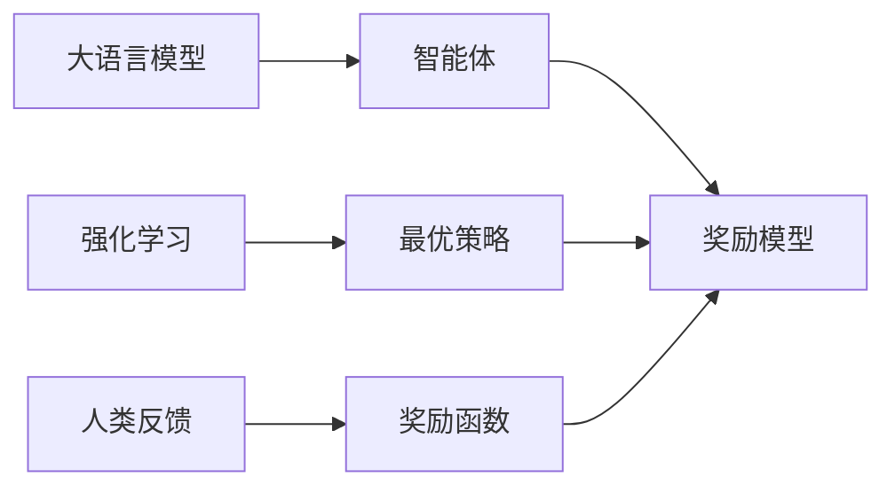

# 大语言模型原理与工程实践：奖励模型损失函数分析

## 1. 背景介绍

### 1.1 大语言模型的兴起

近年来,随着深度学习技术的飞速发展,大语言模型(Large Language Model, LLM)成为了自然语言处理(Natural Language Processing, NLP)领域的研究热点。以 GPT-3、PaLM、BLOOM 等为代表的大语言模型,展现出了惊人的自然语言理解和生成能力,在问答、对话、文本生成、知识推理等任务上取得了突破性的进展。

### 1.2 大语言模型面临的挑战

尽管大语言模型取得了瞩目的成就,但在实际应用中仍然面临诸多挑战:
- 模型参数量巨大,训练和推理成本高昂
- 模型泛化能力有限,容易出现幻觉和错误
- 模型输出难以控制,存在安全和伦理风险
- 模型缺乏常识推理和因果推断能力

### 1.3 奖励模型的提出

为了应对上述挑战,OpenAI、Anthropic、DeepMind 等公司和研究机构提出了奖励模型(Reward Modeling)的思路。奖励模型旨在通过人类反馈(Human Feedback)来引导和优化语言模型的输出行为,使其更加安全、可控、符合人类偏好。本文将重点分析奖励模型中的损失函数设计,探讨其原理、实践和未来方向。

## 2. 核心概念与联系

### 2.1 大语言模型

大语言模型是基于海量文本数据,利用深度神经网络训练得到的语言模型。其核心是通过自回归(Autoregressive)的方式,估计当前词的概率分布:

$$P(x_t|x_{<t}) = \frac{\exp(h_t^Tw_{x_t})}{\sum_{x'\in V} \exp(h_t^Tw_{x'})}$$

其中,$x_t$为当前词,$x_{<t}$为之前的上下文,$h_t$为隐藏状态,$w$为词嵌入矩阵,$V$为词表。

### 2.2 强化学习

强化学习(Reinforcement Learning)是一种通过智能体(Agent)与环境交互,从奖励信号中学习最优策略的机器学习范式。其目标是最大化累积奖励:

$$J(\theta) = \mathbb{E}_{\pi_\theta}[\sum_{t=0}^T \gamma^t r_t]$$

其中,$\theta$为策略参数,$\pi_\theta$为参数化策略,$\gamma$为折扣因子,$r_t$为即时奖励。

### 2.3 奖励模型

奖励模型将大语言模型视为强化学习中的智能体,通过人类反馈来定义奖励函数,引导模型学习最优策略。其核心是基于偏好的学习(Preference Learning),即通过比较不同输出的优劣,学习一个奖励函数:

$$r_\theta(x) = f_\theta(x)$$

其中,$x$为模型输出,$f_\theta$为参数化奖励函数。

### 2.4 核心概念关系图



## 3. 核心算法原理具体操作步骤

### 3.1 基于排序的奖励模型(Ranking-based Reward Model)

#### 3.1.1 收集人类反馈数据

- 给定输入 $x$,采样多个模型输出 $\{y_1,y_2,...,y_n\}$
- 人类标注者对输出进行排序,得到偏好对 $\{(y_i,y_j)|y_i \succ y_j\}$

#### 3.1.2 训练奖励模型

- 初始化奖励模型参数 $\theta$
- 对每个偏好对 $(y_i,y_j)$:
  - 计算奖励值 $r_\theta(y_i), r_\theta(y_j)$
  - 计算排序损失 $\ell(r_\theta(y_i), r_\theta(y_j))$
- 优化目标:最小化排序损失

$$\min_\theta \sum_{(y_i,y_j)\in D} \ell(r_\theta(y_i), r_\theta(y_j))$$

其中,排序损失可以选择 Pairwise ranking loss、Listwise ranking loss 等。

#### 3.1.3 应用奖励模型

- 在语言模型采样过程中,使用奖励模型评估每个候选输出的质量
- 选择奖励值最高的输出作为最终结果

### 3.2 基于分类的奖励模型(Classification-based Reward Model)

#### 3.2.1 收集人类反馈数据

- 给定输入 $x$和模型输出 $y$
- 人类标注者对输出进行打分或分类,得到标签 $l\in \{0,1\}$ 或 $l\in [0,1]$

#### 3.2.2 训练奖励模型

- 初始化奖励模型参数 $\theta$
- 对每个标注样本 $(x,y,l)$:
  - 计算奖励值 $r_\theta(y|x)$
  - 计算分类损失 $\ell(r_\theta(y|x),l)$
- 优化目标:最小化分类损失

$$\min_\theta \sum_{(x,y,l)\in D} \ell(r_\theta(y|x),l)$$

其中,分类损失可以选择交叉熵损失、平方损失等。

#### 3.2.3 应用奖励模型

- 在语言模型采样过程中,使用奖励模型评估每个候选输出的质量
- 选择奖励值最高的输出作为最终结果

## 4. 数学模型和公式详细讲解举例说明

### 4.1 Pairwise ranking loss

给定偏好对 $(y_i,y_j)$,其中 $y_i \succ y_j$,Pairwise ranking loss 定义为:

$$\ell(r_\theta(y_i), r_\theta(y_j)) = \max(0, \epsilon - (r_\theta(y_i) - r_\theta(y_j)))$$

其中,$\epsilon$为超参数,表示期望的奖励值差距。该损失函数鼓励奖励模型对 $y_i$ 给出更高的评分。

举例:假设 $r_\theta(y_i)=0.8, r_\theta(y_j)=0.6, \epsilon=0.5$,则

$$\ell(r_\theta(y_i), r_\theta(y_j)) = \max(0, 0.5 - (0.8 - 0.6)) = 0.3$$

### 4.2 Listwise ranking loss

给定一组偏好对 $\{(y_i,y_j)\}$,Listwise ranking loss 考虑整个排序列表,定义为:

$$\ell(\{r_\theta(y)\}) = -\sum_{y_i \succ y_j} \log \frac{\exp(r_\theta(y_i))}{\exp(r_\theta(y_i)) + \exp(r_\theta(y_j))}$$

该损失函数来源于 ListNet,本质上是最小化预测排序分布与真实排序分布之间的交叉熵。

举例:假设有3个输出 $\{y_1,y_2,y_3\}$,真实排序为 $y_1 \succ y_2 \succ y_3$,奖励模型预测值为 $r_\theta(y_1)=2.0, r_\theta(y_2)=1.0, r_\theta(y_3)=0.5$,则

$$
\begin{aligned}
\ell(\{r_\theta(y)\}) &= -(\log \frac{\exp(2.0)}{\exp(2.0) + \exp(1.0)} \\
&+ \log \frac{\exp(2.0)}{\exp(2.0) + \exp(0.5)} \\
&+ \log \frac{\exp(1.0)}{\exp(1.0) + \exp(0.5)})\\
&\approx 0.58
\end{aligned}
$$

### 4.3 交叉熵损失

给定标注样本 $(x,y,l)$,其中 $l\in \{0,1\}$,交叉熵损失定义为:

$$\ell(r_\theta(y|x),l) = -l\log r_\theta(y|x) - (1-l)\log (1-r_\theta(y|x))$$

该损失函数鼓励奖励模型对正样本给出高评分,对负样本给出低评分。

举例:假设 $r_\theta(y|x)=0.8, l=1$,则

$$\ell(r_\theta(y|x),l) = -1\log 0.8 - 0\log (1-0.8) \approx 0.22$$

## 5. 项目实践：代码实例和详细解释说明

下面以 PyTorch 为例,展示基于排序的奖励模型的简要实现:

```python
import torch
import torch.nn as nn

class RewardModel(nn.Module):
    def __init__(self, input_size, hidden_size):
        super().__init__()
        self.fc1 = nn.Linear(input_size, hidden_size)
        self.fc2 = nn.Linear(hidden_size, 1)

    def forward(self, x):
        h = torch.relu(self.fc1(x))
        r = self.fc2(h)
        return r

def pairwise_ranking_loss(r_i, r_j, epsilon=0.5):
    return torch.max(torch.tensor(0.0), epsilon - (r_i - r_j))

def train(model, optimizer, data):
    model.train()
    for x_i, x_j in data:
        r_i, r_j = model(x_i), model(x_j)
        loss = pairwise_ranking_loss(r_i, r_j)
        optimizer.zero_grad()
        loss.backward()
        optimizer.step()
```

代码说明:
- `RewardModel` 类定义了一个简单的两层全连接网络,用于估计给定输出的奖励值。
- `pairwise_ranking_loss` 函数实现了 Pairwise ranking loss。
- `train` 函数展示了奖励模型的训练流程,对每个偏好对计算损失并更新模型参数。

在实践中,我们还需要准备训练数据、设计模型架构、调整超参数、评估模型性能等。此外,奖励模型往往与语言模型联合优化,形成一个多任务学习的框架。

## 6. 实际应用场景

奖励模型在许多实际场景中得到了应用,例如:

### 6.1 对话系统

在对话系统中,我们希望模型能够生成流畅、自然、合理的回复。传统的语言模型往往难以满足这些要求。通过引入奖励模型,我们可以根据人类反馈来优化模型,生成更加符合人类偏好的回复。

### 6.2 文本摘要

自动文本摘要旨在从长文档中提取关键信息,生成简洁、连贯的摘要。奖励模型可以帮助评估生成摘要的质量,如信息覆盖度、语义相关性等,从而指导摘要模型的优化过程。

### 6.3 机器翻译

机器翻译的目标是将源语言文本转换为目标语言文本,同时保持语义等价和语法正确。传统的翻译模型通常基于最大化条件概率,而奖励模型可以引入更多的评价维度,如流畅度、忠实度等,从而提升翻译质量。

### 6.4 内容生成

在文本生成、对联生成、诗歌创作等任务中,奖励模型可以帮助控制生成内容的主题、风格、格律等属性,使其更加符合特定的要求和审美偏好。

## 7. 工具和资源推荐

### 7.1 开源库

- [transformers](https://github.com/huggingface/transformers): 🤗 Hugging Face 提供的 NLP 统一框架,支持多种预训练语言模型。
- [datasets](https://github.com/huggingface/datasets): 🤗 Hugging Face 提供的 NLP 数据集库,涵盖了各种常见任务。
- [OpenAI Gym](https://github.com/openai/gym): OpenAI 开发的强化学习环境库,可以用于测试奖励模型。
- [Stable Baselines3](https://github.com/DLR-RM/stable-baselines3): 基于 PyTorch 的强化学习算法库,包含多种策略学习方法。

### 7.2 相关论文

- [Learning to summarize from human feedback](https://arxiv.org/abs/2009.01325)
- [Recursively Summarizing Books with Human Feedback](https://arxiv.org/abs/2109.10862)
- [Training language models to follow instructions with human feedback](https://arxiv.org/abs/2203.02155)
- [Constitutional AI: Harmlessness from AI Feedback](https://arxiv.org/