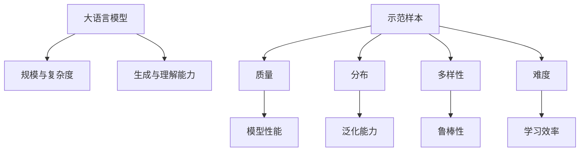

# 大语言模型原理基础与前沿 示范样本选择

## 1. 背景介绍
### 1.1 大语言模型的发展历程
#### 1.1.1 早期的语言模型
#### 1.1.2 神经网络语言模型的兴起
#### 1.1.3 Transformer的革命性突破

### 1.2 大语言模型的应用现状
#### 1.2.1 自然语言处理领域的广泛应用
#### 1.2.2 跨领域的拓展与创新
#### 1.2.3 对社会和经济的深远影响

### 1.3 示范样本选择的重要性
#### 1.3.1 高质量样本对模型性能的决定性作用
#### 1.3.2 样本选择策略的研究现状
#### 1.3.3 示范样本选择面临的挑战

## 2. 核心概念与联系
### 2.1 大语言模型的定义与特点
#### 2.1.1 语言模型的基本概念
#### 2.1.2 大语言模型的规模与复杂度
#### 2.1.3 大语言模型的生成与理解能力

### 2.2 示范样本的内涵与作用
#### 2.2.1 示范样本的定义与类型
#### 2.2.2 示范样本在模型训练中的作用机制
#### 2.2.3 示范样本质量对模型性能的影响

### 2.3 示范样本选择与大语言模型性能的关系
#### 2.3.1 示范样本分布与模型泛化能力
#### 2.3.2 示范样本多样性与模型鲁棒性
#### 2.3.3 示范样本难度与模型学习效率



## 3. 核心算法原理具体操作步骤
### 3.1 基于主动学习的示范样本选择算法
#### 3.1.1 不确定性采样
#### 3.1.2 委员会机制
#### 3.1.3 预期模型变化

### 3.2 基于课程学习的示范样本选择算法
#### 3.2.1 样本难度估计
#### 3.2.2 动态难度调整
#### 3.2.3 多样性约束

### 3.3 基于强化学习的示范样本选择算法
#### 3.3.1 MDP 建模
#### 3.3.2 奖励函数设计
#### 3.3.3 策略优化方法

## 4. 数学模型和公式详细讲解举例说明
### 4.1 主动学习中的不确定性度量
#### 4.1.1 最小置信度
$$\mathbf{x}^{*}=\underset{\mathbf{x} \in \mathcal{U}}{\arg \max }\left(1-P_{\theta}\left(\hat{y} | \mathbf{x}\right)\right)$$
其中 $\mathbf{x}^{*}$ 表示选择的样本，$\mathcal{U}$ 为未标注样本池，$P_{\theta}\left(\hat{y} | \mathbf{x}\right)$ 为模型预测的最大后验概率。

#### 4.1.2 最大熵
$$\mathbf{x}^{*}=\underset{\mathbf{x} \in \mathcal{U}}{\arg \max }-\sum_{i} P_{\theta}\left(y_{i} | \mathbf{x}\right) \log P_{\theta}\left(y_{i} | \mathbf{x}\right)$$
其中 $y_i$ 表示第 $i$ 个类别。

### 4.2 课程学习中的样本难度估计
#### 4.2.1 基于损失的难度估计
$$d(\mathbf{x})=\mathcal{L}\left(f_{\theta}(\mathbf{x}), y\right)$$
其中 $d(\mathbf{x})$ 表示样本 $\mathbf{x}$ 的难度，$\mathcal{L}$ 为损失函数，$f_{\theta}$ 为当前模型。

#### 4.2.2 基于置信度的难度估计
$$d(\mathbf{x})=1-P_{\theta}\left(\hat{y} | \mathbf{x}\right)$$

### 4.3 强化学习中的奖励函数设计
#### 4.3.1 基于模型性能提升的奖励
$$r=\frac{\mathcal{M}\left(\theta^{\prime}\right)-\mathcal{M}(\theta)}{\mathcal{M}(\theta)}$$
其中 $\mathcal{M}$ 为评估指标，$\theta$ 和 $\theta^{\prime}$ 分别为更新前后的模型参数。

#### 4.3.2 基于样本多样性的奖励
$$r=\frac{1}{K} \sum_{i=1}^{K} \min _{j \neq i}\left\|\mathbf{x}_{i}-\mathbf{x}_{j}\right\|_{2}$$
其中 $K$ 为选择的样本数量，$\mathbf{x}_i$ 和 $\mathbf{x}_j$ 为选择的样本。

## 5. 项目实践：代码实例和详细解释说明
### 5.1 基于PyTorch的主动学习示范样本选择
```python
import torch
import numpy as np

def uncertainty_sampling(model, unlabeled_data, num_samples):
    model.eval()
    unlabeled_data = torch.tensor(unlabeled_data)
    with torch.no_grad():
        outputs = model(unlabeled_data)
        probabilities = torch.softmax(outputs, dim=1)
        uncertainties = 1 - probabilities.max(dim=1)[0]
    selected_indices = np.argsort(uncertainties)[-num_samples:]
    return selected_indices
```
该代码实现了基于不确定性采样的主动学习示范样本选择。首先将未标注数据转换为PyTorch张量，然后使用模型进行预测，计算每个样本的不确定性。最后选择不确定性最高的`num_samples`个样本的索引。

### 5.2 基于TensorFlow的课程学习示范样本选择
```python
import tensorflow as tf

def curriculum_sampling(model, labeled_data, unlabeled_data, num_samples):
    labeled_data = tf.convert_to_tensor(labeled_data)
    unlabeled_data = tf.convert_to_tensor(unlabeled_data)

    with tf.GradientTape() as tape:
        labeled_outputs = model(labeled_data)
        labeled_loss = tf.reduce_mean(tf.keras.losses.categorical_crossentropy(labeled_outputs, labeled_data))

    gradients = tape.gradient(labeled_loss, model.trainable_variables)
    unlabeled_outputs = model(unlabeled_data)
    unlabeled_scores = tf.reduce_sum([tf.reduce_sum(tf.square(g)) for g in gradients], axis=0)
    selected_indices = tf.argsort(unlabeled_scores, direction='DESCENDING')[:num_samples]

    return selected_indices
```
该代码实现了基于课程学习的示范样本选择。首先将已标注数据和未标注数据转换为TensorFlow张量，然后使用已标注数据计算模型的损失，并获取损失对模型参数的梯度。接着使用未标注数据计算每个样本的得分，得分为梯度的平方和。最后选择得分最高的`num_samples`个样本的索引。

## 6. 实际应用场景
### 6.1 智能客服中的示范样本选择
在智能客服系统中，示范样本选择可以帮助快速构建高质量的问答对数据集。通过主动学习策略，选择最具代表性和多样性的用户询问，并由人工进行标注，可以显著提升系统的响应质量和用户满意度。

### 6.2 机器翻译中的示范样本选择
机器翻译模型的训练需要大量的双语平行语料。示范样本选择可以帮助优化数据标注的成本和效率。通过识别对模型性能提升贡献最大的样本，有针对性地进行人工翻译和校对，可以显著提升模型的翻译质量。

### 6.3 医疗诊断中的示范样本选择
医疗诊断任务通常面临标注数据稀缺和类别不平衡的问题。示范样本选择可以帮助医疗专家优先标注最具价值的样本，提高诊断模型的泛化能力和鲁棒性。同时，通过动态调整样本难度，可以加速模型的学习过程。

## 7. 工具和资源推荐
### 7.1 主流深度学习框架
- PyTorch: https://pytorch.org/
- TensorFlow: https://www.tensorflow.org/
- Keras: https://keras.io/

### 7.2 示范样本选择工具包
- modAL: https://github.com/modAL-python/modAL
- ALiPy: https://github.com/NUAA-AL/ALiPy
- libact: https://github.com/ntucllab/libact

### 7.3 相关学术论文和资源
- Active Learning Literature Survey: http://burrsettles.com/pub/settles.activelearning.pdf
- Curriculum Learning: https://ronan.collobert.com/pub/matos/2009_curriculum_icml.pdf
- Reinforcement Learning for Active Learning: https://arxiv.org/abs/1708.02383

## 8. 总结：未来发展趋势与挑战
示范样本选择是大语言模型高效训练和应用的关键环节。未来的研究趋势包括：
1. 探索主动学习、课程学习、强化学习等策略的有机结合，设计更加智能和自适应的示范样本选择算法。
2. 研究示范样本选择与模型压缩、知识蒸馏等技术的协同优化，进一步提升大语言模型的效率和性能。
3. 拓展示范样本选择在垂直领域的应用，如金融、法律、教育等，挖掘领域知识对样本选择的指导作用。

同时，示范样本选择也面临着一些挑战：
1. 如何在保证样本质量的同时，最大限度地降低人工标注的成本和时间开销。
2. 如何设计更加鲁棒的示范样本选择算法，应对数据分布漂移和对抗攻击等复杂场景。
3. 如何在示范样本选择过程中融入更多的先验知识和领域约束，提高选择的可解释性和可信度。

## 9. 附录：常见问题与解答
### 9.1 示范样本选择与数据增强的区别是什么？
示范样本选择侧重于从现有数据中选择最有价值的样本，而数据增强则侧重于根据现有数据生成新的样本。两者可以协同使用，示范样本选择确定标注优先级，数据增强扩充训练集规模。

### 9.2 主动学习和课程学习的优缺点分别是什么？
主动学习的优点是可以快速识别对模型性能提升贡献最大的样本，缺点是可能会过度关注难样本而忽略整体分布。课程学习的优点是可以根据模型能力动态调整样本难度，缺点是难度估计的准确性对算法性能影响较大。

### 9.3 示范样本选择是否会引入选择偏差？
示范样本选择确实可能引入一定的选择偏差，尤其是在数据分布不平衡的情况下。为了缓解这一问题，可以在选择过程中引入多样性约束，确保选择的样本在特征空间上的均匀覆盖。同时，也可以通过重要性采样等技术，对选择偏差进行校正。

作者：禅与计算机程序设计艺术 / Zen and the Art of Computer Programming