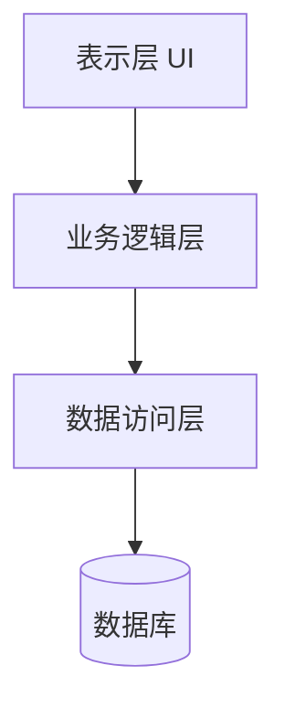
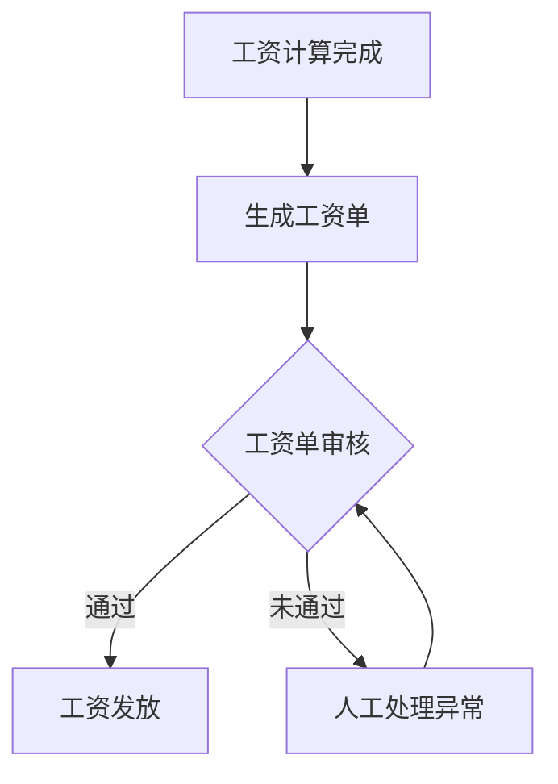

# 学校工资管理系统详细设计与具体代码实现

## 1. 背景介绍

随着教育事业的不断发展,学校规模不断扩大,教职工人数也在持续增加。传统的人工工资管理方式已经无法满足现代化学校对工资计算、发放和管理的需求。因此,构建一个高效、准确、安全的工资管理系统对于学校的人力资源管理至关重要。

本文将详细介绍一个基于 Java 的学校工资管理系统的设计与实现,旨在为读者提供一个完整的解决方案,帮助学校自动化工资计算、发放和管理流程,提高工作效率,减少人为错误。

## 2. 核心概念与联系

### 2.1 系统架构概览

该工资管理系统采用了经典的三层架构设计,包括表示层(UI)、业务逻辑层和数据访问层。



### 2.2 核心概念

- **员工信息管理**:维护员工的基本信息、职位、部门、工资等数据。
- **工资项目设置**:定义工资构成,包括基本工资、绩效工资、补贴等。
- **工资计算规则**:根据工资项目和相关规则计算员工应发工资。
- **工资单管理**:生成和审核工资单,处理异常情况。
- **统计分析**:提供多维度的统计分析报表。

## 3. 核心算法原理具体操作步骤

### 3.1 工资计算算法

工资计算算法是系统的核心部分,其伪代码如下:

```
FOR each 员工
    工资 = 基本工资
    FOR each 补贴项目
        工资 += 计算补贴金额(补贴项目, 员工)
    END FOR
    FOR each 扣除项目
        工资 -= 计算扣除金额(扣除项目, 员工)
    END FOR
    FOR each 绩效考核项目
        工资 += 计算绩效工资(绩效项目, 员工)
    END FOR
END FOR
```

该算法遍历每个员工,首先获取基本工资,然后根据员工情况计算各种补贴、扣除和绩效工资,最终得到应发工资额。

### 3.2 工资单生成

工资单生成流程如下:



系统首先完成工资计算,然后生成工资单,由人力资源人员审核工资单是否正确。如果通过则发放工资,如果未通过则需要人工处理异常情况并重新审核。

## 4. 数学模型和公式详细讲解举例说明

某些工资项目的计算需要使用数学模型和公式,例如:

1. **绩效工资计算**

绩效工资 = 基本工资 * 绩效系数

其中,绩效系数根据员工的绩效考核结果而定,通常由0.8到1.2不等。

2. **年终奖计算**

年终奖 = $\sum_{i=1}^{12}$ 月薪 * 年终奖系数

年终奖系数通常在1到3之间,根据公司当年经营状况和员工工作表现综合评定。

3. **个税计算**

个税金额采用了分段计算的方式,具体计算公式如下:

$$
税率 = \begin{cases}
3\% &\text{如果} 0 < 收入 \leq 1500\
10\% &\text{如果} 1500 < 收入 \leq 4500\
20\% &\text{如果} 4500 < 收入 \leq 9000\
25\% &\text{如果} 9000 < 收入 \leq 35000\
30\% &\text{如果} 35000 < 收入 \leq 55000\
35\% &\text{如果} 55000 < 收入 \leq 80000\
45\% &\text{如果} 80000 < 收入
\end{cases}
$$

个税金额 = 应纳税所得额 * 税率 - 速算扣除数

系统需要根据员工实际收入情况,正确计算个税金额。

## 5. 项目实践:代码实例和详细解释说明

### 5.1 员工信息管理

`Employee`类代表员工的基本信息:

```java
public class Employee {
    private String id;
    private String name;
    private Date hireDate;
    private Department dept;
    private Position position;
    // 省略 getter/setter
}
```

`EmployeeDao`接口定义了对员工信息的增删改查操作:

```java
public interface EmployeeDao {
    void insert(Employee emp);
    void update(Employee emp);
    void delete(String id);
    Employee getById(String id);
    List<Employee> getAll();
}
```

### 5.2 工资项目设置

`SalaryComponent`是工资项目的基类,所有工资项目都继承自它:

```java
public abstract class SalaryComponent {
    protected String name;
    protected String description;

    public abstract double calculate(Employee emp);
}
```

`BaseSalary`类代表基本工资项目:

```java
public class BaseSalary extends SalaryComponent {
    @Override
    public double calculate(Employee emp) {
        return emp.getPosition().getBaseSalary();
    }
}
```

`Allowance`类代表补贴项目:

```java
public class Allowance extends SalaryComponent {
    private double amount;

    public Allowance(String name, double amount) {
        this.name = name;
        this.amount = amount;
    }

    @Override
    public double calculate(Employee emp) {
        return amount;
    }
}
```

### 5.3 工资计算

`SalaryCalculator`负责计算员工的应发工资:

```java
public class SalaryCalculator {
    private List<SalaryComponent> components;

    public SalaryCalculator(List<SalaryComponent> components) {
        this.components = components;
    }

    public double calculateSalary(Employee emp) {
        double totalSalary = 0;
        for (SalaryComponent comp : components) {
            totalSalary += comp.calculate(emp);
        }
        return totalSalary;
    }
}
```

使用示例:

```java
List<SalaryComponent> salaryComps = Arrays.asList(
    new BaseSalary(),
    new Allowance("交通补助", 500),
    new Allowance("餐补", 800)
);
SalaryCalculator calculator = new SalaryCalculator(salaryComps);
Employee emp = new Employee(...);
double salary = calculator.calculateSalary(emp);
```

### 5.4 工资单生成与审核

`SalarySlip`类代表一个工资单:

```java
public class SalarySlip {
    private Employee employee;
    private double baseSalary;
    private List<SalaryComponent> allowances;
    private List<SalaryComponent> deductions;
    private double totalSalary;
    private boolean approved;
    // 省略 getter/setter
}
```

`SalarySlipService`负责生成和审核工资单:

```java
public class SalarySlipService {
    public List<SalarySlip> generateSalarySlips(List<Employee> employees) {
        // 计算每个员工的工资单
    }

    public void approveSalarySlip(SalarySlip slip) {
        // 审核工资单,处理异常情况
        slip.setApproved(true);
    }
}
```

## 6. 实际应用场景

学校工资管理系统可以广泛应用于各级各类学校,包括:

- 大学
- 中小学
- 职业技术学校
- 培训机构

该系统不仅适用于教职工工资管理,也可以用于学校其他人员如后勤人员、管理人员等的工资管理。

## 7. 工具和资源推荐

- **IDE**: IntelliJ IDEA、Eclipse等主流 Java IDE
- **构建工具**: Maven、Gradle
- **框架**: Spring、MyBatis等
- **数据库**: MySQL、Oracle、PostgreSQL等
- **前端框架**: Vue.js、React等
- **报表工具**: JasperReports、Birt等

## 8. 总结:未来发展趋势与挑战

未来,学校工资管理系统将朝着以下几个方向发展:

1. **云化部署**:将系统部署到云平台,实现多租户、按需扩展等优势。
2. **移动化**:提供移动端应用,支持员工随时查看工资情况。
3. **智能化**:利用大数据、机器学习等技术,优化工资分配策略。
4. **集成化**:与学校的其他管理系统集成,实现数据共享和业务协同。

同时,工资管理系统在实施过程中也面临一些挑战:

1. **数据安全**:员工工资等敏感数据的安全存储和传输。
2. **规则复杂化**:各类补贴、扣除项目不断增加,工资计算规则日益复杂。
3. **差异化需求**:不同学校的工资制度存在差异,需要提高系统的可配置性和扩展性。

## 9. 附录:常见问题与解答

1. **如何保证工资计算的准确性?**

答:系统需要建立完善的工资计算规则,并进行充分的测试,同时提供人工审核的环节,确保计算结果的正确性。

2. **工资数据的存储和备份有何建议?**

答:工资数据属于敏感数据,需要采用加密存储,同时建立数据备份机制,避免数据丢失。

3. **如何实现工资项目的灵活配置?**

答:可以在系统中提供工资项目的配置界面,允许管理员根据实际需求定义和修改各类工资项目。

4. **如何处理异常工资情况?**

答:系统需要提供人工干预的接口,允许人力资源人员对异常情况进行审核和处理,并记录处理过程,确保工资发放的正确性。

5. **如何提高系统的性能?**

答:可以采用缓存、异步计算等技术,避免工资计算过程中的性能瓶颈;同时进行数据库优化,提高数据查询效率。

作者: 禅与计算机程序设计艺术 / Zen and the Art of Computer Programming