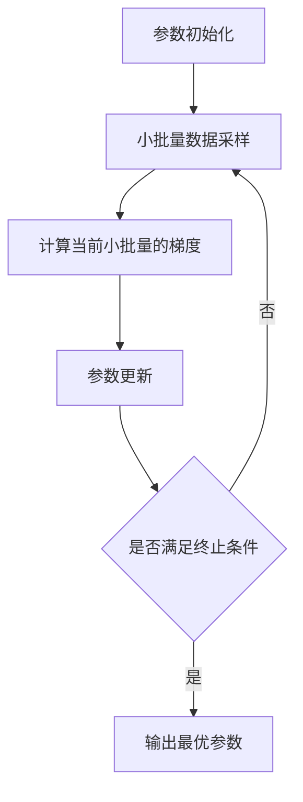

# 小批量梯度下降法(Mini-batch GD)原理与代码实战案例讲解

## 1. 背景介绍
### 1.1 机器学习中的优化问题
#### 1.1.1 经验风险最小化
#### 1.1.2 结构风险最小化
#### 1.1.3 正则化
### 1.2 梯度下降法的发展历程
#### 1.2.1 批量梯度下降法(BGD)
#### 1.2.2 随机梯度下降法(SGD)
#### 1.2.3 小批量梯度下降法(MBGD)的提出

## 2. 核心概念与联系
### 2.1 梯度的概念
#### 2.1.1 方向导数
#### 2.1.2 梯度的几何意义
#### 2.1.3 梯度与等高线
### 2.2 BGD、SGD和MBGD的区别与联系
#### 2.2.1 BGD的特点
#### 2.2.2 SGD的特点
#### 2.2.3 MBGD的特点
#### 2.2.4 三者的区别与联系

## 3. 核心算法原理具体操作步骤
### 3.1 MBGD算法流程
#### 3.1.1 参数初始化
#### 3.1.2 小批量数据采样
#### 3.1.3 计算当前小批量的梯度
#### 3.1.4 参数更新
#### 3.1.5 迭代终止条件判断
### 3.2 MBGD的伪代码描述
### 3.3 MBGD的流程图



## 4. 数学模型和公式详细讲解举例说明
### 4.1 凸优化基础
#### 4.1.1 凸集
#### 4.1.2 凸函数
#### 4.1.3 一阶条件和二阶条件
### 4.2 MBGD的数学模型
#### 4.2.1 目标函数
#### 4.2.2 梯度计算公式
#### 4.2.3 参数更新公式
### 4.3 MBGD收敛性分析
#### 4.3.1 假设条件
#### 4.3.2 收敛性证明
#### 4.3.3 收敛速度分析

## 5. 项目实践：代码实例和详细解释说明
### 5.1 使用Python实现MBGD
#### 5.1.1 导入必要的库
#### 5.1.2 生成模拟数据
#### 5.1.3 定义MBGD优化器类
#### 5.1.4 测试MBGD优化器
### 5.2 在sklearn中使用MBGD优化逻辑回归
#### 5.2.1 导入相关模块
#### 5.2.2 加载数据集
#### 5.2.3 定义Pipeline
#### 5.2.4 gridsearch调参
#### 5.2.5 训练模型并评估

## 6. 实际应用场景
### 6.1 MBGD在深度学习中的应用
#### 6.1.1 MBGD用于训练神经网络
#### 6.1.2 MBGD的改进版本
### 6.2 MBGD在推荐系统中的应用
#### 6.2.1 基于MBGD优化的矩阵分解
#### 6.2.2 MBGD用于CTR预估模型训练
### 6.3 MBGD在计算广告中的应用
#### 6.3.1 FTRL算法原理
#### 6.3.2 MBGD优化FTRL的在线学习

## 7. 工具和资源推荐
### 7.1 深度学习框架
#### 7.1.1 TensorFlow
#### 7.1.2 PyTorch
#### 7.1.3 Keras
### 7.2 优化算法库
#### 7.2.1 Scipy.optimize
#### 7.2.2 Scikit-optimize
### 7.3 相关论文与资料
#### 7.3.1 经典论文
#### 7.3.2 网络资源

## 8. 总结：未来发展趋势与挑战
### 8.1 MBGD的局限性
#### 8.1.1 鞍点问题
#### 8.1.2 自适应学习率的缺失
### 8.2 基于MBGD的改进算法
#### 8.2.1 Momentum
#### 8.2.2 AdaGrad
#### 8.2.3 RMSProp
#### 8.2.4 Adam
### 8.3 研究热点与未来方向
#### 8.3.1 梯度稀疏化
#### 8.3.2 异步并行优化
#### 8.3.3 基于MBGD的联邦学习

## 9. 附录：常见问题与解答
### 9.1 如何设置MBGD的超参数？
### 9.2 MBGD的batch size如何选取？
### 9.3 MBGD对特征缩放和归一化有什么要求？
### 9.4 MBGD能否保证全局最优解？
### 9.5 MBGD的早停策略有哪些？

作者：禅与计算机程序设计艺术 / Zen and the Art of Computer Programming

小批量梯度下降法(Mini-batch Gradient Descent, MBGD)是机器学习和深度学习中应用最为广泛的优化算法之一。它是随机梯度下降法(Stochastic Gradient Descent, SGD)的一种改进变体,通过从训练集中随机抽取一个小批量(mini-batch)样本来估计整个训练集的梯度,进而更新模型参数。与SGD相比,MBGD在保证了一定的计算效率的同时,又能显著降低梯度估计的方差,使得模型训练更加稳定高效。本文将从背景介绍、核心概念、算法原理、数学模型、代码实战、实际应用等多个角度对MBGD进行全面深入的探讨。

在机器学习的监督学习任务中,我们通常需要最小化一个目标函数,即经验风险函数:

$$R_{emp}(f)=\frac{1}{N}\sum^N_{i=1}L(y_i,f(x_i))$$

其中$f$是模型函数,$L$是损失函数,$(x_i,y_i)$是训练样本。经验风险最小化的过程就是寻找最优模型参数$\theta$使得$R_{emp}$最小化的过程。然而,仅仅最小化经验风险容易导致过拟合问题,因此通常还需要加入一个正则化项$\Omega(f)$来控制模型复杂度,得到结构风险函数:

$$R_{srm}(f)=R_{emp}(f)+\lambda\Omega(f)$$

$\lambda$是正则化系数,用于平衡经验风险和模型复杂度。结构风险最小化能够有效地防止模型过拟合,提高模型的泛化性能。

梯度下降法是求解上述风险最小化问题的重要方法。它的基本思想是沿着目标函数梯度的反方向更新参数,使得函数值不断下降,直到达到局部最小值。设$\theta$为待优化参数,$\eta$为学习率,则梯度下降法的参数更新公式为:

$$\theta_{t+1}=\theta_t-\eta\nabla_{\theta}J(\theta_t)$$

其中$J(\theta)$即为风险函数,$\nabla_{\theta}J(\theta_t)$为$\theta_t$处的梯度。根据计算梯度时使用的样本数量,梯度下降法可分为批量梯度下降法(BGD)、随机梯度下降法(SGD)和小批量梯度下降法(MBGD)三类。

BGD在每次迭代时使用整个训练集的样本来计算梯度,参数更新公式为:

$$\theta_{t+1}=\theta_t-\eta\frac{1}{N}\sum^N_{i=1}\nabla_{\theta}L(y_i,f(x_i,\theta_t))$$

BGD的优点是能够利用整个数据集的信息,使得参数更新更加准确稳定。但是当训练集很大时,每次迭代的计算开销也会非常大。

SGD则是每次迭代只随机选取一个样本来计算梯度,参数更新公式为:

$$\theta_{t+1}=\theta_t-\eta\nabla_{\theta}L(y_i,f(x_i,\theta_t))$$

其中样本$(x_i,y_i)$是从训练集中随机抽取的。SGD通过降低每次迭代的计算量,能够大大提高优化效率。但是由于使用单个样本估计的梯度方差很大,因此SGD的收敛过程往往比较不稳定。

MBGD是BGD和SGD的一个折中,它在每次迭代时随机选取一个小批量(mini-batch)样本来计算梯度,参数更新公式为:

$$\theta_{t+1}=\theta_t-\eta\frac{1}{m}\sum^m_{i=1}\nabla_{\theta}L(y_i,f(x_i,\theta_t))$$

其中$\{(x_1,y_1),...,(x_m,y_m)\}$为随机抽取的小批量样本。与SGD相比,MBGD通过对一个batch内的梯度求平均,能够有效降低梯度估计的方差,使得训练过程更加平稳。同时,MBGD的计算效率也比BGD高很多。因此,MBGD在实际应用中被广泛采用。

MBGD的完整算法流程如下:

1. 参数初始化:随机初始化待优化参数$\theta_0$。

2. 迭代优化:

   for t=0,1,2,...,T:

     (1)从训练集中随机抽取一个小批量样本$\{(x_1,y_1),...,(x_m,y_m)\}$;

     (2)计算当前小批量的梯度:
     $$g_t=\frac{1}{m}\sum^m_{i=1}\nabla_{\theta}L(y_i,f(x_i,\theta_t))$$

     (3)更新参数:
     $$\theta_{t+1}=\theta_t-\eta g_t$$

     (4)如果满足迭代终止条件(如达到预设的迭代次数或满足一定的误差阈值),则跳出循环。

3. 输出最优解$\theta_T$。

可以用下面的流程图来直观地表示MBGD的优化过程:


为了更好地理解MBGD的数学原理,我们需要引入一些凸优化的基础知识。在凸优化中,若目标函数$f(x)$满足以下条件:

$$f(\alpha x+(1-\alpha)y)\leq \alpha f(x)+(1-\alpha)f(y), \forall x,y\in \mathbb{R}^n, 0\leq \alpha \leq1$$

则称$f(x)$为凸函数。直观地说,凸函数的任意两点间的连线都在函数的上方。很多机器学习问题都可以表示为一个凸优化问题,因为凸函数有很好的数学性质,如全局最优解的存在唯一性等。

对于可微的凸函数,判断$x^*$是否为全局最优解有两个重要条件:

1. 一阶必要条件:$\nabla f(x^*)=0$

2. 二阶充分条件:$\nabla^2 f(x^*)\succeq0$ ($\nabla^2 f(x^*)$半正定)

MBGD之所以能够收敛到全局最优解,就是因为经验风险函数通常满足凸函数的性质。假设目标函数$f(\theta)$为凸函数,且其梯度$g(\theta)$满足L-Lipschitz条件:

$$\|g(\theta_1)-g(\theta_2)\|\leq L\|\theta_1-\theta_2\|,\forall \theta_1,\theta_2$$

那么可以证明,当学习率$\eta\leq\frac{1}{L}$时,MBGD的参数更新序列$\{\theta_t\}$满足:

$$\mathbb{E}[f(\theta_t)-f(\theta^*)]\leq \frac{\|\theta_0-\theta^*\|^2}{2\eta t}$$

其中$\theta^*$为最优解。这表明MBGD能够以$O(\frac{1}{t})$的速率收敛到全局最优。

下面我们通过一个简单的Python代码实例来演示MBGD的具体实现。首先导入必要的库:

```python
import numpy as np
import matplotlib.