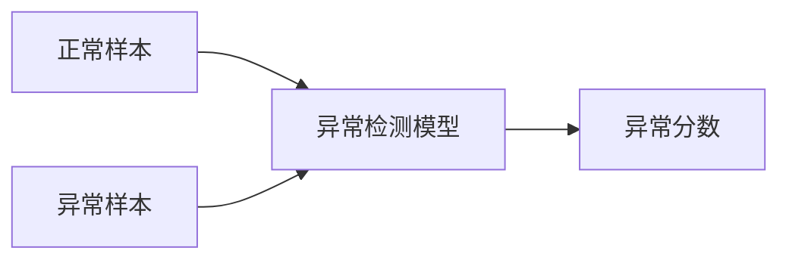

# 异常检测(Anomaly Detection) - 原理与代码实例讲解

## 1. 背景介绍
异常检测是机器学习和数据挖掘领域的一个重要研究方向,在实际应用中有着广泛的需求。异常是指数据集中明显偏离其余数据的个体,通常表现为异常点、异常序列等形式。异常数据的存在会对数据分析和挖掘的结果产生负面影响,因此检测和处理异常数据对于提高数据质量和分析结果的可靠性具有重要意义。

异常检测在诸多领域有着重要应用,例如:
- 欺诈检测:检测信用卡欺诈、保险欺诈等异常交易行为
- 入侵检测:及时发现网络入侵、恶意攻击等网络安全事件
- 设备健康监测:监控工业设备运行情况,及早预警异常并安排检修
- 疾病预警:通过对人体生理指标的异常检测,实现疾病的早期预警

总的来说,异常检测对保障数据安全、设备安全、人身健康安全等方面有着不可或缺的作用。研究高效、准确、可解释的异常检测方法,对于学术研究和工业应用都具有重要价值。

## 2. 核心概念与联系
要理解异常检测的原理和方法,需要先明确几个核心概念:
- 正常样本(Normal Instances):符合数据整体分布规律的样本
- 异常样本(Anomalous Instances):明显偏离整体分布的少数样本,通常表现为异常点、异常序列等
- 特征(Features):描述样本属性的变量,用于刻画样本的特点
- 异常分数(Anomaly Score):评估样本异常程度的分值,越高代表样本越异常

异常检测的目标就是学习一个异常分数计算模型,能够对样本的异常程度进行量化评估。如下图所示,对于一个2维数据集,异常样本与正常样本在特征空间分布上存在明显差异,异常检测模型需要能识别出这种差异并量化异常程度:



异常检测与二分类的区别在于,异常检测通常只有正常样本的训练数据,因为异常情况是未知的、多变的,很难收集全面的异常样本。因此异常检测需要通过对正常样本建模,从而检测出偏离正常的异常情况。

## 3. 核心算法原理与具体步骤

异常检测的方法主要分为三大类:
1. 基于统计的方法
2. 基于距离的方法
3. 基于密度的方法

下面以基于高斯分布的异常检测为例,讲解其核心原理和步骤。

### 3.1 基于高斯分布的异常检测

基于高斯分布的异常检测是统计方法的代表,其基本假设是正常数据服从多元高斯分布,而异常数据偏离该分布。因此可以通过对正常数据的高斯分布参数进行估计,然后计算样本偏离该分布的概率作为异常分数。

假设数据集有 $m$ 个样本 $\{x^{(1)}, x^{(2)}, \ldots, x^{(m)}\}$,每个样本有 $n$ 个特征。异常检测的具体步骤如下:

1. 参数估计:分别估计每个特征的均值 $\mu_j$ 和方差 $\sigma_j^2$
$$
\mu_j = \frac{1}{m} \sum_{i=1}^m x_j^{(i)} \\
\sigma_j^2 = \frac{1}{m} \sum_{i=1}^m (x_j^{(i)} - \mu_j)^2
$$

2. 计算高斯分布概率密度:对于一个新样本 $x$,计算其属于该高斯分布的概率密度
$$
p(x) = \prod_{j=1}^n p(x_j; \mu_j, \sigma_j^2) = \prod_{j=1}^n \frac{1}{\sqrt{2\pi}\sigma_j} \exp \left(-\frac{(x_j-\mu_j)^2}{2\sigma_j^2}\right)
$$

3. 异常判定:如果 $p(x) < \epsilon$,其中 $\epsilon$ 是一个阈值,则判定 $x$ 为异常样本。$-\log p(x)$ 可作为异常分数。

以上是基于高斯分布的异常检测的基本原理和步骤。实际应用中,可以对数据进行一些预处理如特征缩放、PCA降维等,以提高检测效果。此外,对于非高斯分布的数据,可以考虑一些更复杂的概率密度估计方法。

## 4. 数学模型和公式详细讲解举例说明

这里针对高斯分布异常检测的数学模型做进一步说明。多元高斯分布的概率密度函数为:

$$
p(x; \mu, \Sigma) = \frac{1}{(2\pi)^{n/2} |\Sigma|^{1/2}} \exp \left(-\frac{1}{2}(x-\mu)^T \Sigma^{-1} (x-\mu)\right)
$$

其中 $\mu \in \mathbb{R}^n$ 是均值向量,$\Sigma \in \mathbb{R}^{n \times n}$ 是协方差矩阵,$|\Sigma|$ 是 $\Sigma$ 的行列式。

在异常检测任务中,通常假设不同特征之间是独立的,因此协方差矩阵 $\Sigma$ 是一个对角阵,对角线上的元素是各个特征的方差 $\sigma_1^2, \ldots, \sigma_n^2$。这时概率密度可以简化为各特征概率密度的乘积形式:

$$
p(x; \mu, \Sigma) = \prod_{j=1}^n p(x_j; \mu_j, \sigma_j^2) = \prod_{j=1}^n \frac{1}{\sqrt{2\pi}\sigma_j} \exp \left(-\frac{(x_j-\mu_j)^2}{2\sigma_j^2}\right)
$$

举个例子,假设我们通过传感器采集一台机器的振动和温度数据,得到如下正常样本数据:

| 振动 | 温度 |
|------|------|
| 0.5  | 40   |
| 0.1  | 43   |
| 0.3  | 45   |
| ...  | ...  |

我们希望通过这些数据学习一个异常检测模型。首先估计各特征的均值和方差:

$$
\mu_1 = 0.3, \ \sigma_1 = 0.2 \\
\mu_2 = 42, \ \sigma_2 = 3
$$

然后对于一个新采集的样本 $x=(0.6, 50)$,计算其概率密度:

$$
\begin{align*}
p(x) &= p(x_1; 0.3, 0.2^2) \cdot p(x_2; 42, 3^2) \\
&= \frac{1}{\sqrt{2\pi}0.2} \exp \left(-\frac{(0.6-0.3)^2}{2\cdot0.2^2}\right) \cdot \frac{1}{\sqrt{2\pi}3} \exp \left(-\frac{(50-42)^2}{2\cdot3^2}\right) \\
&\approx 0.0063
\end{align*}
$$

如果我们设置阈值 $\epsilon=0.01$,则 $p(x) < \epsilon$,判定该样本为异常,说明机器可能出现了故障。这就是高斯分布异常检测的一个简单应用例子。

## 5. 项目实践:代码实例和详细解释说明

下面给出基于高斯分布的异常检测的Python实现。主要分为两个部分:模型训练和异常检测。

```python
import numpy as np

class GaussianAD:
    def __init__(self, epsilon=0.01):
        self.epsilon = epsilon
        self.mu = None
        self.sigma = None

    def fit(self, X):
        """
        用正常数据拟合高斯分布参数
        """
        self.mu = np.mean(X, axis=0)
        self.sigma = np.std(X, axis=0)

    def predict(self, X):
        """
        异常检测,返回异常分数(负对数概率)
        """
        p = np.prod(self._gaussian_pdf(X), axis=1)
        return -np.log(p)

    def _gaussian_pdf(self, X):
        """
        计算高斯分布概率密度
        """
        return 1/(np.sqrt(2*np.pi)*self.sigma) * np.exp(-(X-self.mu)**2/(2*self.sigma**2))
```

使用示例:

```python
from sklearn.datasets import make_blobs

# 生成模拟数据
X_train, _ = make_blobs(n_samples=200, centers=1, cluster_std=1.0, random_state=42)
X_test, _ = make_blobs(n_samples=100, centers=1, cluster_std=1.0, random_state=42)
X_outliers, _ = make_blobs(n_samples=20, centers=1, cluster_std=5.0, random_state=42)
X_test = np.concatenate([X_test, X_outliers])

# 训练异常检测器
ad = GaussianAD(epsilon=0.005)
ad.fit(X_train)

# 异常检测
scores = ad.predict(X_test)
print(scores)
```

代码说明:
- `GaussianAD` 是基于高斯分布的异常检测器类,`epsilon` 是异常阈值参数
- `fit` 方法用正常数据拟合高斯分布参数,即计算均值 `mu` 和标准差 `sigma`
- `predict` 方法对新样本进行异常检测,返回异常分数
- `_gaussian_pdf` 是计算高斯分布概率密度的辅助函数
- 使用 `make_blobs` 生成模拟数据,其中 `X_train` 是正常样本,`X_outliers` 是异常样本
- 用 `X_train` 训练异常检测器,然后对 `X_test` 进行异常检测,得到异常分数

以上就是一个简单的基于高斯分布的异常检测的代码实例。实际应用中还需要注意数据预处理、阈值选择、模型评估等问题。

## 6. 实际应用场景

异常检测在工业界有着广泛的应用场景,下面列举几个典型案例:

1. 制造业设备故障检测
   - 背景:在生产车间,各种机器设备的健康状况直接影响产品质量和生产效率。设备故障会导致停产,造成经济损失。
   - 应用:通过在设备上安装各种传感器,采集设备的振动、温度、电流等参数,构建异常检测模型。一旦发现设备参数异常,及时预警,安排检修,避免设备损坏。

2. 互联网系统的入侵检测
   - 背景:互联网系统面临着各种恶意攻击和入侵的威胁,及时发现异常流量对于保障系统安全至关重要。
   - 应用:通过收集网络流量日志数据,如IP地址、端口号、请求频率等,构建异常检测模型。一旦发现异常流量,及时阻断,防止入侵事件。

3. 金融交易的欺诈检测
   - 背景:随着电子支付的普及,金融欺诈事件层出不穷,给银行和消费者带来巨大损失。
   - 应用:通过收集交易数据,如交易金额、地点、时间、设备信息等,构建异常检测模型。一旦发现异常交易,及时冻结账户,防止损失进一步扩大。

4. 城市交通的异常事件检测
   - 背景:城市交通系统的安全平稳运行对城市管理至关重要。及时发现交通异常事件可以有效指挥疏导交通,避免交通拥堵和事故发生。
   - 应用:通过交通摄像头采集道路车流量数据,构建异常检测模型。一旦发现流量异常,及时预警,调度交警疏导交通。

异常检测在这些场景中的应用,可以帮助我们及早发现问题,防患于未然。随着数据采集和计算能力的进步,异常检测有望在更多领域发挥重要作用。

## 7. 工具和资源推荐

对于异常检测的研究和应用,推荐以下工具和资源:

1. Python库:
   - scikit-learn:机器学习库,提供了多种异常检测算法的实现
   - PyOD:专门的 Python 异常检测库,包含了30多种经典和前沿的异常检测算法
   - Alibi Detect:异常检测库,注重可解释性和可定制性,支持在线学