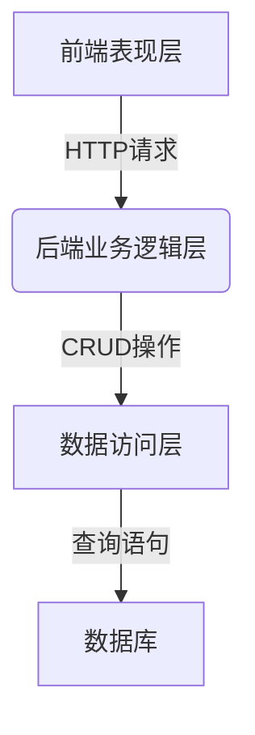

# 房屋装潢公司预算系统详细设计与具体代码实现

## 1. 背景介绍

随着人们生活水平的不断提高,对居住环境的要求也越来越高。装潢公司应运而生,为客户提供专业的房屋装修服务。然而,在装修过程中,预算管理是一个巨大的挑战。传统的人工报价方式耗时耗力,且容易出现失误。因此,开发一个自动化的预算系统,可以极大地提高装潢公司的工作效率和报价准确性。

## 2. 核心概念与联系

### 2.1 系统架构概览

该预算系统采用经典的三层架构,包括表现层(前端)、业务逻辑层(后端)和数据访问层。前端负责与用户交互,后端处理业务逻辑,数据访问层则负责与数据库进行交互。



### 2.2 核心模块

1. **材料库模块**:维护各种装修材料的信息,包括名称、类别、单价等。
2. **工程量计算模块**:根据房屋面积、户型等信息,计算出装修所需的各种材料数量。
3. **报价模块**:将材料数量与单价相乘,得出总预算报价。
4. **方案管理模块**:保存和管理不同装修方案的预算信息。

## 3. 核心算法原理具体操作步骤

### 3.1 工程量计算算法

工程量计算是整个系统的核心,它决定了预算的准确性。我们采用基于规则的算法,根据房屋面积、户型等信息,结合装修标准,计算出所需材料的数量。

算法步骤:

1. 获取房屋面积、户型等基本信息
2. 从数据库查询装修标准规则
3. 遍历每个房间,根据规则计算出该房间所需材料数量
4. 累加每个房间的材料数量,得到总工程量

### 3.2 报价算法

报价算法的主要任务是将工程量与材料单价相乘,得出总预算。

算法步骤:

1. 获取工程量计算结果
2. 从数据库查询各种材料的单价
3. 遍历每种材料,将数量与单价相乘,得到小计
4. 累加所有小计,得到总预算

## 4. 数学模型和公式详细讲解举例说明

在工程量计算过程中,我们需要根据房屋面积、户型等信息,计算出各种材料的用量。以地板砖为例,其用量可以用下面的公式计算:

$$
地板砖用量 = \frac{房屋面积}{单块地板砖面积} \times 损耗系数
$$

其中:

- 房屋面积是已知的输入数据
- 单块地板砖面积是固定值,可从材料库中获取
- 损耗系数是经验值,通常取1.05~1.1,用于弥补施工过程中的损耗

例如,假设房屋面积为80平方米,单块地板砖面积为0.6平方米,损耗系数取1.08,则地板砖用量为:

$$
地板砖用量 = \frac{80}{0.6} \times 1.08 \approx 144(块)
$$

通过类似的公式,我们可以计算出其他材料的用量,从而得到整个工程的材料需求清单。

## 5. 项目实践:代码实例和详细解释说明

### 5.1 材料库模块

材料库模块使用关系型数据库存储材料信息,主要包括以下几个表:

- 材料表(material):存储材料的基本信息,如名称、类别、单价等。
- 材料规格表(material_spec):存储材料的规格信息,如地板砖的面积、瓷砖的尺寸等。
- 材料损耗表(material_loss):存储不同材料的损耗系数。

下面是一个示例代码,展示如何从数据库中查询材料信息:

```python
import sqlite3

# 连接数据库
conn = sqlite3.connect('materials.db')
c = conn.cursor()

# 查询地板砖信息
c.execute('''
    SELECT m.name, m.unit_price, ms.area, ml.loss_factor
    FROM material m
    JOIN material_spec ms ON m.id = ms.material_id
    JOIN material_loss ml ON m.id = ml.material_id
    WHERE m.category = 'floor_tile'
''')

floor_tile_info = c.fetchone()
print(f'地板砖信息: {floor_tile_info}')

# 关闭数据库连接
conn.close()
```

### 5.2 工程量计算模块

工程量计算模块的核心是一个名为`calculate_quantities`的函数,它接收房屋信息和装修标准作为输入,输出各种材料的需求量。

```python
from typing import Dict

def calculate_quantities(house_info: Dict, standards: Dict) -> Dict:
    """
    计算工程量

    Args:
        house_info (Dict): 房屋信息字典,包含面积、户型等
        standards (Dict): 装修标准字典

    Returns:
        Dict: 材料需求量字典
    """
    quantities = {}

    # 遍历每个房间
    for room_type, room_area in house_info['rooms'].items():
        # 获取该房间类型的装修标准
        room_standards = standards.get(room_type, {})

        # 计算该房间所需的各种材料数量
        for material, rules in room_standards.items():
            quantity = calculate_material_quantity(room_area, rules)
            quantities[material] = quantities.get(material, 0) + quantity

    return quantities
```

其中,`calculate_material_quantity`函数根据具体的规则计算单种材料的用量:

```python
def calculate_material_quantity(area, rules):
    """
    根据规则计算单种材料的用量

    Args:
        area (float): 房间面积
        rules (Dict): 材料用量计算规则

    Returns:
        float: 材料用量
    """
    unit_area = rules['unit_area']
    loss_factor = rules['loss_factor']

    return (area / unit_area) * loss_factor
```

### 5.3 报价模块

报价模块的主要任务是将工程量与材料单价相乘,得出总预算。下面是一个简单的实现:

```python
from typing import Dict

def calculate_total_cost(quantities: Dict, material_prices: Dict) -> float:
    """
    计算总预算

    Args:
        quantities (Dict): 材料需求量字典
        material_prices (Dict): 材料单价字典

    Returns:
        float: 总预算
    """
    total_cost = 0

    for material, quantity in quantities.items():
        unit_price = material_prices.get(material, 0)
        material_cost = quantity * unit_price
        total_cost += material_cost

    return total_cost
```

## 6. 实际应用场景

装潢公司预算系统可以广泛应用于以下场景:

1. **装修报价**:系统可以根据客户提供的房屋信息,快速生成装修预算报价单,提高工作效率。
2. **材料采购**:通过分析历史预算数据,系统可以预测未来一段时间内的材料需求量,为材料采购提供依据。
3. **成本控制**:系统可以对比预算与实际支出,帮助装潢公司控制成本,提高利润率。
4. **方案优化**:通过比较不同装修方案的预算差异,系统可以帮助客户选择最优方案。

## 7. 工具和资源推荐

1. **Python**:本系统使用Python作为主要开发语言,具有简洁易读、生产力高、跨平台等优点。
2. **Django**:一个流行的Python Web框架,可以快速开发Web应用。
3. **SQLite**:一个轻量级的关系型数据库,无需单独的数据库服务器,适合小型项目使用。
4. **Vue.js**:一个流行的JavaScript框架,可以构建现代化的Web前端界面。
5. **Mermaid**:一个基于JavaScript的图形描述语言,可以在Markdown中嵌入图形。

## 8. 总结:未来发展趋势与挑战

虽然当前的预算系统已经可以满足基本需求,但仍有一些值得改进的地方:

1. **数据驱动**:未来可以通过收集和分析大量历史数据,优化装修标准规则,提高预算精度。
2. **智能化**:利用机器学习等技术,系统可以自动识别房屋图纸,提取关键信息,无需人工输入。
3. **可视化**:提供更加直观的3D可视化界面,让客户更好地了解装修效果。
4. **个性化**:根据客户的喜好和预算,自动推荐合适的装修方案。

另一个重大挑战是,如何将该系统与装潢公司的其他业务系统(如设计系统、施工管理系统等)进行无缝集成,实现数据共享和业务协同。

## 9. 附录:常见问题与解答

1. **问:如何处理特殊情况,比如阳台、走廊等非标准房间?**

   答:对于这些特殊房间,我们可以在装修标准中单独设置规则。例如,对于阳台,可以将其视为一个"半室外"空间,使用防水、防潮的特殊材料。

2. **问:如何保证材料单价的准确性和实时性?**

   答:我们可以与材料供应商建立数据接口,定期从其系统获取最新的材料价格信息。另外,也可以允许人工干预,手动调整个别材料的单价。

3. **问:系统是否考虑了材料的库存情况?**

   答:当前版本的系统暂未考虑材料库存,主要关注预算计算。未来,我们可以将材料库存管理模块整合进来,实现"一站式"的装修解决方案。

4. **问:如何处理客户中途更改装修方案的情况?**

   答:系统应当允许客户灵活修改装修方案,并自动重新计算预算。同时,我们也可以保留历史版本的预算信息,以便对比和审计。

作者: 禅与计算机程序设计艺术 / Zen and the Art of Computer Programming