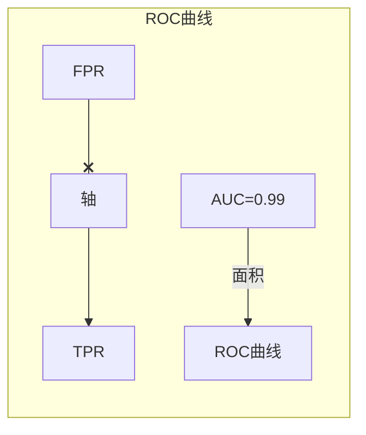

# 构建ROC曲线：实战演练

## 1.背景介绍

在机器学习和数据挖掘领域中,模型评估是一个非常重要的环节。评估模型的性能对于选择最佳模型、调整超参数以及优化算法至关重要。常用的评估指标有准确率(Accuracy)、精确率(Precision)、召回率(Recall)、F1分数等。然而,这些指标都有其局限性,例如在面对不平衡数据集(类别分布不均匀)时,准确率可能会产生误导。

在二分类问题中,ROC(Receiver Operating Characteristic)曲线和AUC(Area Under the Curve)是衡量二元分类模型效果的重要工具。ROC曲线能够综合反映模型的多个重要指标,如真正率(TPR)和假正率(FPR),从而全面评估模型的性能。AUC作为ROC曲线下的面积,能够用一个数值总结ROC曲线,方便不同模型之间的比较。

## 2.核心概念与联系

### 2.1 ROC曲线

ROC曲线是一种展示二分类模型在不同分类阈值下的性能的可视化工具。它的横轴表示假正率(FPR),纵轴表示真正率(TPR)。

$$
FPR = \frac{FP}{FP+TN}
$$

$$
TPR = \frac{TP}{TP+FN}
$$

其中,TP(True Positive)表示将正例正确预测为正例的数量,FP(False Positive)表示将负例错误预测为正例的数量,TN(True Negative)表示将负例正确预测为负例的数量,FN(False Negative)表示将正例错误预测为负例的数量。

理想情况下,模型应该将所有正例预测为正例,所有负例预测为负例,即TPR=1且FPR=0,对应ROC曲线的左上角。随机猜测的模型对应ROC曲线上的对角线y=x。一个好的模型的ROC曲线应该尽可能靠近左上角,即TPR较高且FPR较低。

### 2.2 AUC

AUC(Area Under the Curve)是ROC曲线下的面积,范围在0到1之间。AUC越接近1,模型的性能越好。一个完美的模型的AUC为1,随机猜测的模型的AUC为0.5。AUC不仅能够综合考虑模型的真正率和假正率,而且对不平衡数据也有很好的适应性。

AUC的计算公式为:

$$
AUC = \int_0^1 TPR(t)dt
$$

其中,t为阈值,TPR(t)为在该阈值下的真正率。

### 2.3 ROC与其他评估指标的关系

ROC曲线能够全面反映模型在不同阈值下的性能,与其他评估指标存在一定的关系:

- 准确率(Accuracy)只考虑了正确预测的比例,没有区分正负例,在数据分布不平衡时可能会产生误导。
- 精确率(Precision)和召回率(Recall)分别只考虑了正例的预测情况,缺乏全面性。
- F1分数是精确率和召回率的调和平均,但也没有考虑负例的情况。

相比之下,ROC曲线和AUC能够综合考虑正负例的预测情况,更加全面和客观。

## 3.核心算法原理具体操作步骤

构建ROC曲线的核心步骤如下:

1. **获取模型的预测结果和真实标签**

对于二分类问题,假设模型的预测结果为概率值,范围在0到1之间。我们需要获取模型对每个样本的预测概率,以及对应的真实标签(0或1)。

2. **设置阈值,计算每个阈值下的TP、FP、TN、FN**

我们设置一系列阈值,通常从0到1,步长为0.01或0.001等。对于每个阈值,将预测概率大于等于该阈值的样本预测为正例,小于该阈值的预测为负例。然后根据真实标签,计算在该阈值下的TP、FP、TN、FN的数量。

3. **计算每个阈值下的FPR和TPR**

根据上一步计算得到的TP、FP、TN、FN,利用公式计算该阈值下的FPR和TPR。

4. **绘制ROC曲线**

将每个阈值下的(FPR,TPR)作为一个点,连接所有点,即得到ROC曲线。

5. **计算AUC**

利用trapz()函数对ROC曲线的面积进行数值积分,即可得到AUC的值。

以下是Python中利用scikit-learn库构建ROC曲线的示例代码:

```python
from sklearn.metrics import roc_curve, auc

# 假设y_true为真实标签,y_score为模型预测的概率值
fpr, tpr, thresholds = roc_curve(y_true, y_score)
roc_auc = auc(fpr, tpr)

# 绘制ROC曲线
import matplotlib.pyplot as plt
plt.figure()
lw = 2
plt.plot(fpr, tpr, color='darkorange', lw=lw, label='ROC curve (area = %0.2f)' % roc_auc)
plt.plot([0, 1], [0, 1], color='navy', lw=lw, linestyle='--')
plt.xlim([0.0, 1.0])
plt.ylim([0.0, 1.05])
plt.xlabel('False Positive Rate')
plt.ylabel('True Positive Rate')
plt.title('Receiver Operating Characteristic')
plt.legend(loc="lower right")
plt.show()
```

## 4.数学模型和公式详细讲解举例说明

ROC曲线和AUC的核心数学模型和公式已在前面章节中给出,这里通过一个简单的例子进行详细说明。

假设我们有一个二分类数据集,包含10个正例和10个负例,模型对每个样本的预测概率如下:

```
正例: [0.9, 0.8, 0.7, 0.6, 0.55, 0.54, 0.53, 0.52, 0.51, 0.505]
负例: [0.5, 0.4, 0.39, 0.38, 0.37, 0.36, 0.35, 0.34, 0.33, 0.32]
```

我们设置阈值为0.5,那么:

- TP = 6 (正例中预测概率>=0.5的有6个)
- FP = 5 (负例中预测概率>=0.5的有5个)
- TN = 5 (负例中预测概率<0.5的有5个)
- FN = 4 (正例中预测概率<0.5的有4个)

根据公式,可以计算出该阈值下的FPR和TPR:

$$
FPR = \frac{5}{5+5} = 0.5
$$

$$
TPR = \frac{6}{6+4} = 0.6
$$

因此,在阈值为0.5时,ROC曲线上的点坐标为(0.5,0.6)。

我们可以继续设置其他阈值,如0.51、0.52等,计算对应的FPR和TPR,并将所有点连接,即得到ROC曲线。

为了计算AUC,我们可以使用trapz()函数对ROC曲线的面积进行数值积分。假设在阈值0.5和0.51时,FPR和TPR分别为:

```
阈值0.5: FPR=0.5, TPR=0.6
阈值0.51: FPR=0.4, TPR=0.7
```

那么,阈值0.5到0.51之间的面积可以近似计算为:

$$
\frac{(0.7+0.6)}{2} \times (0.4-0.5) = 0.05
$$

对ROC曲线的所有小矩形面积求和,即可得到AUC的近似值。

通过这个例子,我们可以更好地理解ROC曲线和AUC的构建过程以及相关数学模型。

## 5.项目实践:代码实例和详细解释说明

这里我们将使用scikit-learn中的make_blobs函数生成一个简单的二分类数据集,并构建一个逻辑回归模型,最后绘制ROC曲线和计算AUC。

```python
import numpy as np
import matplotlib.pyplot as plt
from sklearn.linear_model import LogisticRegression
from sklearn.metrics import roc_curve, auc
from sklearn.datasets import make_blobs

# 生成数据集
X, y = make_blobs(n_samples=1000, centers=2, n_features=2, random_state=1)

# 训练逻辑回归模型
clf = LogisticRegression().fit(X, y)

# 预测概率
y_score = clf.predict_proba(X)[:,1]

# 计算ROC曲线和AUC
fpr, tpr, thresholds = roc_curve(y, y_score)
roc_auc = auc(fpr, tpr)

# 绘制ROC曲线
plt.figure()
lw = 2
plt.plot(fpr, tpr, color='darkorange', lw=lw, label='ROC curve (area = %0.2f)' % roc_auc)
plt.plot([0, 1], [0, 1], color='navy', lw=lw, linestyle='--')
plt.xlim([0.0, 1.0])
plt.ylim([0.0, 1.05])
plt.xlabel('False Positive Rate')
plt.ylabel('True Positive Rate')
plt.title('Receiver Operating Characteristic')
plt.legend(loc="lower right")
plt.show()
```

代码解释:

1. 导入所需的库和函数。
2. 使用make_blobs函数生成一个简单的二分类数据集,包含1000个样本,2个类别,2个特征。
3. 使用逻辑回归模型对数据集进行训练。
4. 获取模型对每个样本的预测概率(属于正例的概率)。
5. 调用roc_curve函数计算每个阈值下的FPR和TPR,以及对应的阈值。
6. 调用auc函数计算ROC曲线下的面积AUC。
7. 绘制ROC曲线,并在图例中显示AUC的值。

运行上述代码,我们可以得到如下ROC曲线图:



可以看到,该逻辑回归模型在这个简单数据集上的表现非常好,ROC曲线接近于左上角的完美情况,AUC值也接近于1。

通过这个实例,我们不仅掌握了用代码构建ROC曲线的方法,还能更好地理解ROC曲线、AUC以及它们与模型性能之间的关系。

## 6.实际应用场景

ROC曲线和AUC广泛应用于各种二分类问题,包括但不限于:

- **信用风险评估**: 银行和金融机构需要评估客户的信用风险,将客户分为"良好"和"不良"两类,ROC曲线可以帮助选择最优分类模型。

- **疾病诊断**: 医疗领域中,需要根据患者的症状和检查结果判断是否患有某种疾病,ROC曲线可以评估诊断模型的性能。

- **入侵检测**: 网络安全领域中,需要将网络流量分为"正常"和"异常"两类,ROC曲线可以评估入侵检测系统的效果。

- **垃圾邮件过滤**: 将电子邮件分为"垃圾邮件"和"正常邮件"两类,ROC曲线可以评估垃圾邮件过滤器的性能。

- **图像分类**: 将图像分为不同类别,如猫狗分类、癌症检测等,ROC曲线可以评估图像分类模型的效果。

- **异常检测**: 在工业生产、金融交易等领域,需要检测异常数据点,ROC曲线可以评估异常检测算法的性能。

总的来说,只要涉及二分类问题,ROC曲线和AUC就可以作为评估模型性能的重要工具。

## 7.工具和资源推荐

### 7.1 Python库

- **scikit-learn**: 机器学习领域最流行的Python库,提供了roc_curve和auc等函数,可以方便地计算ROC曲线和AUC。

- **matplotlib**: 数据可视化库,可以绘制ROC曲线图。

- **numpy**: 科学计算库,提供了数值计算功能。

### 7.2 在线工具

- **ROC曲线可视化工具**: 一些在线工具可以根据输入的数据直接绘制ROC曲线,如http://www.navan.name/roc/

### 7.3 教程和文章

- 《An introduction to ROC analysis》: 经典的ROC曲线和AUC介绍文章,深入浅出。

- 《ROC曲线的绘制及其意义》: