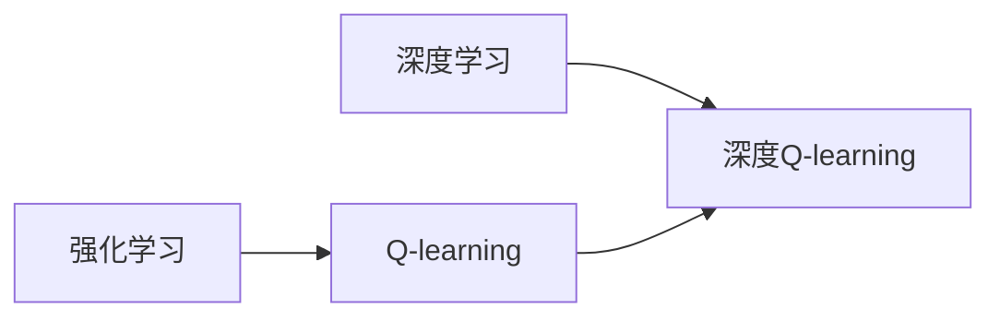
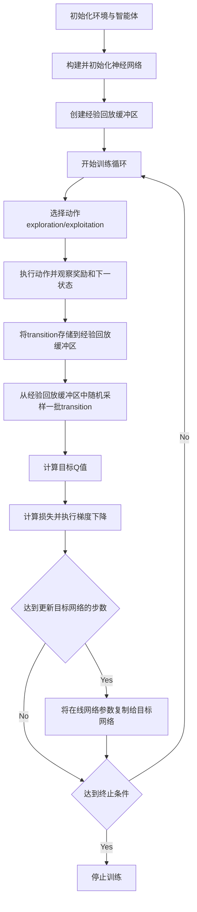

# 深度 Q-learning：探寻机器预知未来的可能性

## 1. 背景介绍
### 1.1 强化学习的兴起
#### 1.1.1 强化学习的定义与特点
#### 1.1.2 强化学习的发展历程
#### 1.1.3 强化学习的应用前景

### 1.2 Q-learning 的诞生
#### 1.2.1 Q-learning 的起源
#### 1.2.2 Q-learning 的核心思想
#### 1.2.3 Q-learning 的优势与局限

### 1.3 深度学习的崛起
#### 1.3.1 深度学习的概念与特点
#### 1.3.2 深度学习的发展历程
#### 1.3.3 深度学习在各领域的应用

## 2. 核心概念与联系
### 2.1 强化学习中的核心概念
#### 2.1.1 智能体(Agent)
#### 2.1.2 环境(Environment)
#### 2.1.3 状态(State)
#### 2.1.4 动作(Action)
#### 2.1.5 奖励(Reward)
#### 2.1.6 策略(Policy)
#### 2.1.7 价值函数(Value Function)

### 2.2 Q-learning 中的核心概念
#### 2.2.1 Q 值(Q-value)
#### 2.2.2 Q 表(Q-table)
#### 2.2.3 时间差分学习(Temporal Difference Learning)
#### 2.2.4 探索与利用(Exploration and Exploitation)

### 2.3 深度学习中的核心概念
#### 2.3.1 神经网络(Neural Network)
#### 2.3.2 前馈神经网络(Feedforward Neural Network)
#### 2.3.3 卷积神经网络(Convolutional Neural Network, CNN)
#### 2.3.4 循环神经网络(Recurrent Neural Network, RNN)

### 2.4 深度 Q-learning 的核心概念
#### 2.4.1 深度 Q 网络(Deep Q-Network, DQN)
#### 2.4.2 经验回放(Experience Replay)
#### 2.4.3 目标网络(Target Network)
#### 2.4.4 Double DQN
#### 2.4.5 Dueling DQN
#### 2.4.6 优先经验回放(Prioritized Experience Replay)

### 2.5 概念之间的联系
#### 2.5.1 强化学习与 Q-learning 的关系
#### 2.5.2 Q-learning 与深度学习的结合
#### 2.5.3 深度 Q-learning 的优势与创新点

## 3. 核心算法原理具体操作步骤
### 3.1 Q-learning 算法
#### 3.1.1 Q-learning 的更新规则
#### 3.1.2 Q-learning 的伪代码
#### 3.1.3 Q-learning 的收敛性证明

### 3.2 深度 Q-learning 算法
#### 3.2.1 DQN 的网络结构设计
#### 3.2.2 DQN 的损失函数与优化方法
#### 3.2.3 DQN 的训练流程
#### 3.2.4 DQN 的改进版本(Double DQN, Dueling DQN 等)

### 3.3 深度 Q-learning 的具体操作步骤
#### 3.3.1 环境与智能体的设计
#### 3.3.2 神经网络的构建与初始化
#### 3.3.3 经验回放缓冲区的创建
#### 3.3.4 训练循环的实现
#### 3.3.5 探索与利用策略的选择
#### 3.3.6 目标网络的更新
#### 3.3.7 模型的保存与加载

## 4. 数学模型和公式详细讲解举例说明
### 4.1 马尔可夫决策过程(Markov Decision Process, MDP)
#### 4.1.1 MDP 的定义与组成元素
#### 4.1.2 MDP 的贝尔曼方程(Bellman Equation)
#### 4.1.3 MDP 与强化学习的关系

### 4.2 Q-learning 的数学模型
#### 4.2.1 Q-learning 的贝尔曼方程
#### 4.2.2 Q-learning 的更新公式推导
#### 4.2.3 Q-learning 的收敛性证明

### 4.3 深度 Q-learning 的数学模型
#### 4.3.1 DQN 的损失函数推导
#### 4.3.2 DQN 的梯度计算与更新
#### 4.3.3 Double DQN 的数学原理
#### 4.3.4 Dueling DQN 的数学原理
#### 4.3.5 优先经验回放的数学原理

### 4.4 数学公式的详细讲解与举例
#### 4.4.1 Q-learning 更新公式的详细讲解与举例
#### 4.4.2 DQN 损失函数的详细讲解与举例
#### 4.4.3 Double DQN 公式的详细讲解与举例
#### 4.4.4 Dueling DQN 公式的详细讲解与举例
#### 4.4.5 优先经验回放公式的详细讲解与举例

Q-learning 的更新公式：

$$Q(s_t, a_t) \leftarrow Q(s_t, a_t) + \alpha [r_{t+1} + \gamma \max_{a} Q(s_{t+1}, a) - Q(s_t, a_t)]$$

其中，$s_t$ 表示当前状态，$a_t$ 表示在当前状态下选择的动作，$r_{t+1}$ 表示执行动作后获得的奖励，$s_{t+1}$ 表示执行动作后转移到的下一个状态，$\alpha$ 表示学习率，$\gamma$ 表示折扣因子。

DQN 的损失函数：

$$L(\theta) = \mathbb{E}_{(s,a,r,s') \sim D} [(r + \gamma \max_{a'} Q(s', a';\theta^-) - Q(s,a;\theta))^2]$$

其中，$\theta$ 表示在线网络的参数，$\theta^-$ 表示目标网络的参数，$D$ 表示经验回放缓冲区，$(s,a,r,s')$ 表示从经验回放缓冲区中采样的一个转移(transition)。

## 5. 项目实践：代码实例和详细解释说明
### 5.1 环境设置与库的导入
#### 5.1.1 OpenAI Gym 环境的安装与使用
#### 5.1.2 TensorFlow 或 PyTorch 的安装与导入
#### 5.1.3 其他必要库的导入(Numpy, Matplotlib 等)

### 5.2 深度 Q 网络的构建
#### 5.2.1 神经网络的定义与初始化
#### 5.2.2 前馈传播与反向传播的实现
#### 5.2.3 损失函数与优化器的选择

### 5.3 智能体的设计与实现
#### 5.3.1 智能体类的定义
#### 5.3.2 经验回放缓冲区的创建与管理
#### 5.3.3 探索与利用策略的实现
#### 5.3.4 目标网络的更新

### 5.4 训练流程的实现
#### 5.4.1 环境的重置与渲染
#### 5.4.2 动作的选择与执行
#### 5.4.3 奖励的计算与状态的转移
#### 5.4.4 经验的存储与采样
#### 5.4.5 网络的训练与更新

### 5.5 模型的评估与可视化
#### 5.5.1 模型性能的评估指标
#### 5.5.2 训练过程中奖励的可视化
#### 5.5.3 测试阶段智能体行为的可视化

### 5.6 代码实例与详细解释
#### 5.6.1 完整的深度 Q-learning 代码实例
#### 5.6.2 关键代码块的详细解释说明
#### 5.6.3 超参数的选择与调整
#### 5.6.4 常见错误与调试技巧

## 6. 实际应用场景
### 6.1 游戏领域的应用
#### 6.1.1 Atari 游戏中的应用(如 Breakout, Space Invaders 等)
#### 6.1.2 棋类游戏中的应用(如国际象棋、围棋等)
#### 6.1.3 第一人称射击游戏中的应用(如 Doom)

### 6.2 机器人控制领域的应用
#### 6.2.1 机器人运动规划中的应用
#### 6.2.2 机器人操纵任务中的应用
#### 6.2.3 自动驾驶中的应用

### 6.3 推荐系统领域的应用
#### 6.3.1 新闻推荐中的应用
#### 6.3.2 电商推荐中的应用
#### 6.3.3 视频推荐中的应用

### 6.4 自然语言处理领域的应用
#### 6.4.1 对话系统中的应用
#### 6.4.2 问答系统中的应用
#### 6.4.3 文本生成中的应用

### 6.5 其他领域的应用
#### 6.5.1 智能交通中的应用
#### 6.5.2 智能电网中的应用
#### 6.5.3 金融交易中的应用

## 7. 工具和资源推荐
### 7.1 深度学习框架
#### 7.1.1 TensorFlow
#### 7.1.2 PyTorch
#### 7.1.3 Keras

### 7.2 强化学习环境
#### 7.2.1 OpenAI Gym
#### 7.2.2 DeepMind Lab
#### 7.2.3 Unity ML-Agents

### 7.3 强化学习库
#### 7.3.1 Stable Baselines
#### 7.3.2 RLlib
#### 7.3.3 TensorFlow Agents

### 7.4 学习资源
#### 7.4.1 在线课程(如 David Silver 的强化学习课程)
#### 7.4.2 书籍推荐(如《Reinforcement Learning: An Introduction》)
#### 7.4.3 论文推荐(如 DQN, Double DQN, Dueling DQN 等)
#### 7.4.4 博客与教程(如 OpenAI 的博客)

## 8. 总结：未来发展趋势与挑战
### 8.1 深度 Q-learning 的优势与局限
#### 8.1.1 深度 Q-learning 的主要优势
#### 8.1.2 深度 Q-learning 面临的局限与挑战

### 8.2 深度强化学习的发展趋势
#### 8.2.1 模型无关的深度强化学习算法
#### 8.2.2 分层深度强化学习
#### 8.2.3 元学习与迁移学习在深度强化学习中的应用
#### 8.2.4 多智能体深度强化学习
#### 8.2.5 安全与鲁棒的深度强化学习

### 8.3 深度强化学习面临的挑战
#### 8.3.1 样本效率问题
#### 8.3.2 探索与利用的平衡问题
#### 8.3.3 奖励稀疏问题
#### 8.3.4 泛化与迁移问题
#### 8.3.5 可解释性与可信赖性问题

### 8.4 未来研究方向与展望
#### 8.4.1 结合先验知识的深度强化学习
#### 8.4.2 无监督或半监督的深度强化学习
#### 8.4.3 结合因果推理的深度强化学习
#### 8.4.4 面向实际应用的深度强化学习算法优化
#### 8.4.5 深度强化学习在更广泛领域的应用探索

## 9. 附录：常见问题与解答
### 9.1 深度 Q-learning 的收敛性问题
### 9.2 深度 Q-learning 的超参数调优问题
### 9.3 深度 Q-learning 在连续动作空间中的应用问题
### 9.4 深度 Q-learning 在部分可观测环境中的应用问题
### 9.5