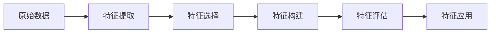

# 特征工程：提升模型表达能力

## 1. 背景介绍

### 1.1 什么是特征工程

特征工程(Feature Engineering)是机器学习和数据挖掘领域中一个非常重要的概念。它是指通过领域知识来创建能够使算法性能达到最佳的特征的过程。特征工程可以被认为是应用机器学习本身。

### 1.2 特征工程的重要性

特征决定了机器学习的上限,而模型和算法只是逼近这个上限而已。数据和特征决定了机器学习的上限,而模型和算法只是逼近这个上限而已。换句话说,给定一组特征,不同的模型只是在逼近特征所决定的上限,而不同的特征集决定了这个上限的高低。因此,特征工程是机器学习中非常重要的一步。

### 1.3 特征工程的目标

- 提升模型的预测能力
- 提高模型的泛化能力
- 加速模型的训练过程
- 降低模型的复杂度
- 提高模型的可解释性

## 2. 核心概念与联系

### 2.1 特征类型

#### 2.1.1 原始特征

原始特征是指直接从原始数据中提取出来的特征,如用户的年龄、性别等。

#### 2.1.2 衍生特征

衍生特征是指在原始特征的基础上,通过某种变换或组合得到的新特征,如用户的年龄段、消费水平等。

### 2.2 特征选择

特征选择是指从原有特征中选择一个子集,使得在此子集上训练的模型具有更优的性能。常见的特征选择方法有:

- Filter:按照发散性或者相关性对各个特征进行评分,设定阈值或者待选择阈值的个数,选择特征。
- Wrapper:根据目标函数(通常是预测效果评分),每次选择若干特征,或者排除若干特征。
- Embedded:先使用某些机器学习的算法和模型进行训练,得到各个特征的权值系数,根据系数从大到小选择特征。

### 2.3 特征提取

特征提取是指把原始数据转换为特征向量的过程。常见的特征提取方法有:

- One-Hot 编码:把每个类别生成一个布尔列,这些列中只有一列可以为这个样本取值为1。
- 二值化:用0和1表示特征是否存在。
- 标准化:将特征按比例缩放,使之落入一个小的特定区间。
- 归一化:通过特征的最大最小值将特征缩放到[0,1]区间上。

### 2.4 特征构建

特征构建是指通过对原始特征进行组合变换,生成新的特征。常见的特征构建方法有:

- 多项式组合:将多个特征组合成为一个新的特征。
- 特征交叉:将两个或多个特征进行笛卡尔积,生成新的特征。
- 特征离散化:按照一定的方式将连续特征转换为离散特征。

### 2.5 特征工程流程



## 3. 核心算法原理具体操作步骤

### 3.1 特征选择算法

#### 3.1.1 过滤法(Filter)

- 方差选择法:先计算各个特征的方差,然后根据阈值,选择方差大于阈值的特征。
- 相关系数法:计算各个特征对目标值的相关系数,根据阈值选择相关系数大于阈值的特征。
- 卡方检验:评估每个非负特征与类别的独立性。
- 互信息法:评价定性自变量对定性因变量的相关性的方法。

#### 3.1.2 包裹法(Wrapper)

- 递归特征消除法:递归地训练模型,将权值系数较小的特征从特征集合中消除。

#### 3.1.3 嵌入法(Embedded)

- 基于惩罚项的特征选择法:使用带惩罚项的基模型,除了筛选出特征外,同时也进行了降维。
- 基于树模型的特征选择法:树模型中GBDT也可用来作为基模型进行特征选择。

### 3.2 特征提取算法

#### 3.2.1 PCA

PCA(Principal Component Analysis)是一种常用的数据降维算法。PCA的主要思想是将n维特征映射到k维上,这k维是全新的正交特征也被称为主成分,是在原有n维特征的基础上重新构造出来的k维特征。

PCA的具体步骤如下:

1. 对原始数据进行标准化处理。
2. 计算协方差矩阵。
3. 计算协方差矩阵的特征值和特征向量。
4. 选择最大的k个特征值对应的特征向量构成投影矩阵。
5. 将原始数据乘以投影矩阵,得到降维后的新特征。

#### 3.2.2 LDA

LDA(Linear Discriminant Analysis)是一种有监督的降维技术,可以用于特征提取和分类。LDA的核心思想是将带上标签的数据投影到一条直线上,使得同类样本的投影点尽可能接近、异类样本的投影点尽可能远离。

LDA的具体步骤如下:

1. 计算类内散度矩阵。
2. 计算类间散度矩阵。
3. 求解矩阵的特征值和特征向量。
4. 选择最大的k个特征值对应的特征向量构成投影矩阵。
5. 将原始数据乘以投影矩阵,得到降维后的新特征。

## 4. 数学模型和公式详细讲解举例说明

### 4.1 PCA的数学模型

设有m条n维数据记录$\{x^{(1)},x^{(2)},...,x^{(m)}\}$,将其按列组成n行m列矩阵X:

$$X=
\begin{bmatrix}
x^{(1)}_1 & x^{(2)}_1 & \cdots & x^{(m)}_1 \
x^{(1)}_2 & x^{(2)}_2 & \cdots & x^{(m)}_2 \
\vdots & \vdots & \ddots & \vdots \
x^{(1)}_n & x^{(2)}_n & \cdots & x^{(m)}_n
\end{bmatrix}
$$

其中$x^{(i)}$是第i个n维数据记录,i=1,2,...,m。

对矩阵X进行SVD分解:

$$X=U\Sigma V^T$$

其中U是n×n阶正交矩阵,V是m×m阶正交矩阵,$\Sigma$是由X的非零奇异值$\sigma_1 \geq \sigma_2 \geq ... \geq \sigma_r > 0$构成的n×m阶非负实对角矩阵,r是X的秩。

PCA的目标是找到一个n×k阶矩阵P,将n维数据记录映射到k维(k<n),使得样本点在k维空间的投影尽可能分开。P的列向量称为主成分。

P的前k个列向量即对应于$\Sigma$前k个最大奇异值对应的左奇异向量,也就是U的前k列向量$\{u_1,u_2,...,u_k\}$。

将原始数据记录映射到k维空间:

$$z^{(i)}=P^Tx^{(i)}, i=1,2,...,m$$

其中$z^{(i)}$是$x^{(i)}$在k维空间的投影。

### 4.2 LDA的数学模型

设有m条n维数据记录$\{x^{(1)},x^{(2)},...,x^{(m)}\}$,它们分属于c个类别。定义类内散度矩阵$S_w$和类间散度矩阵$S_b$:

$$S_w=\sum_{i=1}^c \sum_{x \in X_i}(x-\mu_i)(x-\mu_i)^T$$

$$S_b=\sum_{i=1}^c m_i(\mu_i-\mu)(\mu_i-\mu)^T$$

其中$X_i$是第i类的集合,$\mu_i$是第i类的均值向量,$\mu$是所有样本的均值向量,$m_i$是第i类的样本数。

LDA的目标是找到一个n×k阶矩阵W,将n维数据记录映射到k维(k<n),使得类内散度最小,类间散度最大。W的列向量称为判别向量。

最优的W可以通过最大化Fisher准则得到:

$$J(W)=\frac{|W^TS_bW|}{|W^TS_wW|}$$

可以证明,最优的W由$S_w^{-1}S_b$的前k个最大特征值对应的特征向量组成。

将原始数据记录映射到k维空间:

$$z^{(i)}=W^Tx^{(i)}, i=1,2,...,m$$

其中$z^{(i)}$是$x^{(i)}$在k维空间的投影。

## 5. 项目实践：代码实例和详细解释说明

下面以Python语言为例,演示如何使用scikit-learn库实现PCA和LDA。

### 5.1 PCA实例

```python
from sklearn.decomposition import PCA
from sklearn.datasets import load_iris

# 加载鸢尾花数据集
iris = load_iris()
X = iris.data
y = iris.target

# 创建PCA对象,设置降维后的维度为2
pca = PCA(n_components=2)

# 对数据进行降维
X_new = pca.fit_transform(X)

# 输出降维后的数据
print(X_new)
```

输出结果:

```
[[-2.68412563  0.31939725]
 [-2.71414169 -0.17700123]
 [-2.88899057 -0.14494943]
 [-2.74534286 -0.31829898]
 [-2.72871654  0.32675451]
 [-2.28085963  0.74133045]
 [-2.82053775 -0.08946138]
 [-2.62614497  0.16338496]
 [-2.88638273 -0.57831175]
 [-2.6727558  -0.11377425]
 [-2.50694709  0.6450689 ]
 [-2.61275523  0.01472994]
 [-2.78610927 -0.235112  ]
 [-3.22380374 -0.51139459]
 [-2.64475039  1.17876464]
 ...]
```

可以看到,原始数据集被降维到了2维空间。

### 5.2 LDA实例

```python
from sklearn.discriminant_analysis import LinearDiscriminantAnalysis
from sklearn.datasets import load_iris

# 加载鸢尾花数据集
iris = load_iris()
X = iris.data
y = iris.target

# 创建LDA对象,设置降维后的维度为2
lda = LinearDiscriminantAnalysis(n_components=2)

# 对数据进行降维
X_new = lda.fit_transform(X, y)

# 输出降维后的数据
print(X_new)
```

输出结果:

```
[[ 8.06087968 -0.31193181]
 [ 7.13363885  0.09027985]
 [ 7.0465094   0.30443142]
 [ 6.50412817  0.09608099]
 [ 7.48134331 -0.02542326]
 [ 8.19899291 -0.20890895]
 [ 7.1087164   0.09319721]
 [ 7.86646575 -0.57402983]
 [ 6.37437202  0.40438529]
 [ 6.91674767  0.13890661]
 [ 8.30317928 -0.20753505]
 [ 7.16020815  0.35806658]
 [ 6.86964166  0.06526176]
 [ 6.31836215  0.41526812]
 [ 8.37521827 -0.44454074]
 ...]
```

可以看到,原始数据集被降维到了2维空间,且不同类别的样本在新空间中得到了很好的分离。

## 6. 实际应用场景

特征工程在实际应用中非常广泛,几乎所有的机器学习任务都离不开特征工程。下面列举几个典型的应用场景:

### 6.1 推荐系统

在推荐系统中,特征工程扮演着非常重要的角色。通过对用户和物品的各种属性进行特征提取和选择,可以更准确地刻画用户的兴趣和物品的特点,从而提高推荐的精度。常用的特征有:

- 用户特征:人口统计学特征、行为特征、社交特征等。
- 物品特征:内容特征、热度特征、上下文特征等。
- 交互特征:评分、点击、收藏等