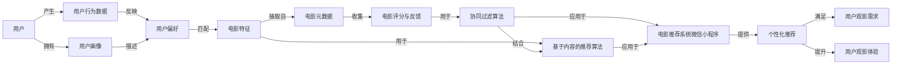

# 电影推荐系统微信小程序

## 1. 背景介绍

### 1.1 推荐系统概述
#### 1.1.1 推荐系统的定义与作用
#### 1.1.2 推荐系统的发展历程
#### 1.1.3 推荐系统的应用领域

### 1.2 微信小程序概述  
#### 1.2.1 微信小程序的特点与优势
#### 1.2.2 微信小程序的发展现状
#### 1.2.3 微信小程序在推荐系统中的应用

### 1.3 电影推荐系统微信小程序的意义
#### 1.3.1 满足用户个性化观影需求
#### 1.3.2 提升用户观影体验
#### 1.3.3 促进电影行业的发展

## 2. 核心概念与联系

### 2.1 推荐系统的核心概念
#### 2.1.1 用户画像
#### 2.1.2 物品特征
#### 2.1.3 用户-物品交互

### 2.2 电影推荐系统的关键要素
#### 2.2.1 电影元数据
#### 2.2.2 用户评分与反馈
#### 2.2.3 用户行为数据

### 2.3 微信小程序的核心组件
#### 2.3.1 WXML与WXSS
#### 2.3.2 JavaScript逻辑层
#### 2.3.3 微信小程序API

## 3. 核心算法原理具体操作步骤

### 3.1 协同过滤算法
#### 3.1.1 基于用户的协同过滤
#### 3.1.2 基于物品的协同过滤
#### 3.1.3 基于模型的协同过滤

### 3.2 基于内容的推荐算法 
#### 3.2.1 TF-IDF算法
#### 3.2.2 Word2Vec算法
#### 3.2.3 主题模型算法

### 3.3 混合推荐算法
#### 3.3.1 加权混合推荐
#### 3.3.2 分阶段混合推荐
#### 3.3.3 元学习混合推荐

## 4. 数学模型和公式详细讲解举例说明

### 4.1 协同过滤算法的数学模型
#### 4.1.1 用户-物品评分矩阵
#### 4.1.2 相似度计算公式
#### 4.1.3 预测评分计算公式

### 4.2 基于内容的推荐算法的数学模型
#### 4.2.1 TF-IDF权重计算公式 
#### 4.2.2 Word2Vec词向量计算公式
#### 4.2.3 主题模型的概率生成过程

### 4.3 混合推荐算法的数学模型
#### 4.3.1 加权混合推荐的权重计算方法
#### 4.3.2 分阶段混合推荐的阶段划分方法
#### 4.3.3 元学习混合推荐的目标函数与优化方法

## 5. 项目实践：代码实例和详细解释说明

### 5.1 微信小程序前端开发
#### 5.1.1 WXML页面布局与数据绑定
#### 5.1.2 WXSS样式设计与动画效果
#### 5.1.3 JavaScript逻辑控制与事件处理

### 5.2 推荐系统后端开发
#### 5.2.1 数据预处理与特征工程
#### 5.2.2 协同过滤算法的实现
#### 5.2.3 基于内容的推荐算法的实现
#### 5.2.4 混合推荐算法的实现

### 5.3 微信小程序与推荐系统的集成
#### 5.3.1 微信小程序与后端服务的通信
#### 5.3.2 推荐结果的展示与交互
#### 5.3.3 用户反馈的收集与处理

## 6. 实际应用场景

### 6.1 个性化首页推荐
#### 6.1.1 基于用户历史行为的推荐
#### 6.1.2 基于用户画像的推荐
#### 6.1.3 基于实时热门的推荐

### 6.2 相关电影推荐
#### 6.2.1 基于电影内容的相似推荐
#### 6.2.2 基于用户行为的关联推荐
#### 6.2.3 基于社交关系的推荐

### 6.3 新电影的冷启动推荐
#### 6.3.1 基于电影元数据的推荐
#### 6.3.2 基于专家评分的推荐
#### 6.3.3 基于社交网络的推荐

## 7. 工具和资源推荐

### 7.1 微信小程序开发工具
#### 7.1.1 微信开发者工具
#### 7.1.2 微信云开发
#### 7.1.3 第三方小程序开发框架

### 7.2 推荐系统开发工具
#### 7.2.1 Python推荐系统库
#### 7.2.2 Spark MLlib机器学习库
#### 7.2.3 TensorFlow推荐系统框架

### 7.3 电影数据资源
#### 7.3.1 MovieLens数据集
#### 7.3.2 IMDb电影数据库
#### 7.3.3 豆瓣电影数据API

## 8. 总结：未来发展趋势与挑战

### 8.1 电影推荐系统的发展趋势
#### 8.1.1 多模态推荐
#### 8.1.2 跨域推荐
#### 8.1.3 实时推荐

### 8.2 微信小程序推荐系统的发展趋势
#### 8.2.1 社交化推荐
#### 8.2.2 场景化推荐
#### 8.2.3 智能化推荐

### 8.3 电影推荐系统微信小程序面临的挑战
#### 8.3.1 用户隐私保护
#### 8.3.2 推荐系统的公平性
#### 8.3.3 推荐系统的可解释性

## 9. 附录：常见问题与解答

### 9.1 如何提高推荐系统的准确性？
### 9.2 如何解决推荐系统的冷启动问题？
### 9.3 如何平衡推荐系统的多样性与相关性？
### 9.4 如何评估推荐系统的效果？
### 9.5 如何处理推荐系统中的用户反馈？

作者：禅与计算机程序设计艺术 / Zen and the Art of Computer Programming

## 电影推荐系统微信小程序的核心概念与联系

## 电影推荐系统微信小程序的核心算法原理具体操作步骤
1. 数据预处理
   - 收集用户行为数据电影元数据评分反馈等
   - 对数据进行清洗去重填充缺失值等
   - 构建用户-物品评分矩阵用户特征矩阵物品特征矩阵

2. 协同过滤算法
   - 基于用户的协同过滤
     - 计算用户之间的相似度如余弦相似度皮尔逊相关系数等
     - 根据相似用户的评分加权预测目标用户对物品的评分
   - 基于物品的协同过滤  
     - 计算物品之间的相似度如余弦相似度调整余弦相似度等
     - 根据目标用户对相似物品的评分加权预测其对目标物品的评分
   - 基于模型的协同过滤
     - 使用机器学习模型如矩阵分解隐语义模型等学习用户物品的隐向量
     - 根据用户和物品的隐向量预测用户对物品的评分

3. 基于内容的推荐算法
   - TF-IDF算法
     - 计算电影元数据如题材演员导演等的TF-IDF权重
     - 根据用户对电影元数据的偏好计算用户对电影的偏好得分
   - Word2Vec算法
     - 使用Word2Vec模型将电影元数据映射为向量表示
     - 计算用户历史观影记录与候选电影之间的相似度
   - 主题模型算法
     - 使用LDA等主题模型从电影元数据中提取隐含的主题分布
     - 根据用户对主题的偏好计算用户对电影的偏好得分

4. 混合推荐算法
   - 加权混合推荐
     - 对协同过滤和基于内容的推荐结果进行加权求和
     - 权重可以根据算法的效果用户反馈等动态调整
   - 分阶段混合推荐
     - 在不同阶段使用不同的推荐算法如冷启动阶段使用基于内容的推荐算法
     - 在数据充足阶段使用协同过滤算法
   - 元学习混合推荐
     - 使用元学习方法如stacking blending等将多个推荐算法的结果进行组合
     - 通过学习不同算法在不同场景下的表现动态调整组合策略

5. 推荐结果的生成与展示
   - 根据算法得到的用户-物品预测评分生成Top-N推荐列表
   - 在微信小程序中展示推荐结果提供用户交互功能如点击查看详情评分反馈等
   - 收集用户反馈数据用于优化推荐系统

## 电影推荐系统微信小程序的数学模型和公式详细讲解举例说明

### 1. 协同过滤算法的数学模型

#### 1.1 用户-物品评分矩阵

在协同过滤算法中用户-物品评分矩阵是核心的数据结构。假设有$m$个用户$u_1,u_2,...,u_m$和$n$个电影$i_1,i_2,...,i_n$用户-物品评分矩阵$R$可以表示为：

$$
R=\begin{bmatrix}
r_{11} & r_{12} & \cdots & r_{1n}\
r_{21} & r_{22} & \cdots & r_{2n}\
\vdots & \vdots & \ddots & \vdots\
r_{m1} & r_{m2} & \cdots & r_{mn}
\end{bmatrix}
$$

其中$r_{ui}$表示用户$u$对电影$i$的评分如果用户没有对电影评分则$r_{ui}$为空值。

#### 1.2 相似度计算公式

在协同过滤算法中需要计算用户之间或物品之间的相似度。常用的相似度计算公式有：

- 余弦相似度：
  $$
  \text{sim}(u,v)=\frac{\sum_{i\in I_{uv}}r_{ui}r_{vi}}{\sqrt{\sum_{i\in I_{u}}r_{ui}^2}\sqrt{\sum_{i\in I_{v}}r_{vi}^2}}
  $$
  其中$I_{uv}$表示用户$u$和$v$共同评分的物品集合$I_u$和$I_v$分别表示用户$u$和$v$评分的物品集合。

- 皮尔逊相关系数：
  $$
  \text{sim}(u,v)=\frac{\sum_{i\in I_{uv}}(r_{ui}-\bar{r}_u)(r_{vi}-\bar{r}_v)}{\sqrt{\sum_{i\in I_{uv}}(r_{ui}-\bar{r}_u)^2}\sqrt{\sum_{i\in I_{uv}}(r_{vi}-\bar{r}_v)^2}}
  $$
  其中$\bar{r}_u$和$\bar{r}_v$分别表示用户$u$和$v$的平均评分。

#### 1.3 预测评分计算公式

在得到用户或物品之间的相似度后可以预测用户对未评分物品的评分。常用的预测评分计算公式有：

- 基于用户的协同过滤：
  $$
  \hat{r}_{ui}=\bar{r}_u+\frac{\sum_{v\in N_u}\text{sim}(u,v)(r_{vi}-\bar{r}_v)}{\sum_{v\in N_u}|\text{sim}(u,v)|}
  $$
  其中$N_u$表示与用户$u$最相似的$k$个用户$\hat{r}_{ui}$表示预测用户$