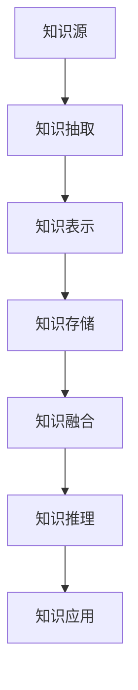

# 知识图谱(Knowledge Graph)原理与代码实战案例讲解

## 1. 背景介绍
### 1.1 知识图谱的起源与发展
#### 1.1.1 知识图谱的起源
#### 1.1.2 知识图谱的发展历程
#### 1.1.3 知识图谱的现状与挑战
### 1.2 知识图谱的应用领域
#### 1.2.1 搜索引擎领域
#### 1.2.2 问答系统领域
#### 1.2.3 推荐系统领域

## 2. 核心概念与联系
### 2.1 知识图谱的定义
### 2.2 知识图谱的核心组成要素
#### 2.2.1 实体(Entity)
#### 2.2.2 关系(Relation)
#### 2.2.3 属性(Attribute)
### 2.3 知识图谱与其他知识表示方法的区别
#### 2.3.1 知识图谱与本体的区别
#### 2.3.2 知识图谱与关系数据库的区别
#### 2.3.3 知识图谱与语义网络的区别

## 3. 核心算法原理具体操作步骤
### 3.1 知识抽取
#### 3.1.1 命名实体识别(NER)
#### 3.1.2 关系抽取(Relation Extraction)
#### 3.1.3 属性抽取(Attribute Extraction)
### 3.2 知识表示与存储
#### 3.2.1 RDF(Resource Description Framework)
#### 3.2.2 知识库存储与查询
### 3.3 知识融合
#### 3.3.1 实体对齐(Entity Alignment)
#### 3.3.2 知识合并(Knowledge Fusion)
### 3.4 知识推理
#### 3.4.1 基于规则的推理
#### 3.4.2 基于表示学习的推理
#### 3.4.3 基于神经网络的推理

## 4. 数学模型和公式详细讲解举例说明
### 4.1 TransE模型
#### 4.1.1 TransE模型原理
#### 4.1.2 TransE模型公式推导
#### 4.1.3 TransE模型优缺点分析
### 4.2 TransR模型
#### 4.2.1 TransR模型原理
#### 4.2.2 TransR模型公式推导
#### 4.2.3 TransR模型优缺点分析
### 4.3 RESCAL模型
#### 4.3.1 RESCAL模型原理
#### 4.3.2 RESCAL模型公式推导
#### 4.3.3 RESCAL模型优缺点分析

## 5. 项目实践：代码实例和详细解释说明
### 5.1 数据准备
#### 5.1.1 数据集介绍
#### 5.1.2 数据预处理
### 5.2 模型训练
#### 5.2.1 TransE模型训练
#### 5.2.2 TransR模型训练
#### 5.2.3 RESCAL模型训练
### 5.3 模型评估
#### 5.3.1 链接预测任务评估
#### 5.3.2 三元组分类任务评估
### 5.4 模型应用
#### 5.4.1 知识图谱可视化
#### 5.4.2 知识问答系统
#### 5.4.3 知识推荐系统

## 6. 实际应用场景
### 6.1 智能搜索
### 6.2 金融风控
### 6.3 医疗辅助诊断
### 6.4 智能客服

## 7. 工具和资源推荐
### 7.1 知识图谱构建工具
#### 7.1.1 OpenKE
#### 7.1.2 DeepDive
#### 7.1.3 Ambiverse
### 7.2 知识图谱可视化工具
#### 7.2.1 Protege
#### 7.2.2 Gephi
#### 7.2.3 Neo4j
### 7.3 知识图谱开放数据集
#### 7.3.1 Freebase
#### 7.3.2 DBpedia
#### 7.3.3 YAGO
### 7.4 知识图谱学习资源
#### 7.4.1 知识图谱教程
#### 7.4.2 知识图谱论文
#### 7.4.3 知识图谱开源项目

## 8. 总结：未来发展趋势与挑战
### 8.1 知识图谱的未来发展趋势
#### 8.1.1 多模态知识图谱
#### 8.1.2 动态演化知识图谱
#### 8.1.3 个性化知识图谱
### 8.2 知识图谱面临的挑战
#### 8.2.1 知识获取与融合
#### 8.2.2 知识表示与推理
#### 8.2.3 知识应用与解释

## 9. 附录：常见问题与解答
### 9.1 知识图谱与知识库有什么区别？
### 9.2 知识图谱构建需要哪些数据？
### 9.3 知识图谱存储一般采用什么数据库？
### 9.4 知识图谱如何解决实体歧义问题？
### 9.5 知识图谱能否处理多语言数据？



知识图谱(Knowledge Graph)是一种结构化的知识库,旨在以图的形式来表示实体(如人物、地点、事物等)之间的关系,从而更好地组织、管理和利用海量的信息和数据。知识图谱起源于Google于2012年提出的概念,目的是增强其搜索引擎的语义理解能力。之后,知识图谱迅速成为人工智能、自然语言处理、语义网等领域的研究热点。

知识图谱的核心组成要素包括实体(Entity)、关系(Relation)和属性(Attribute)。实体是指现实世界中的人、地点、事物等,关系刻画了实体之间的联系,属性则描述了实体的特性。与本体、关系数据库等其他知识表示方法相比,知识图谱更加注重实体间语义关联的建模。

构建知识图谱的核心步骤包括知识抽取、知识表示、知识融合和知识推理。知识抽取旨在从非结构化或半结构化数据中提取出实体、关系和属性,常用技术包括命名实体识别、关系抽取和属性抽取。知识表示与存储则采用RDF等语义网技术对抽取的知识进行建模,并存入图数据库如Neo4j中。由于知识往往来源于多个异构数据源,因此需要进行知识融合,即对不同来源的重复、冲突的知识进行消歧和对齐。最后,基于已有的知识图谱,可以利用规则推理、表示学习、神经网络等方法进行知识推理,发现隐含的新知识。

为了更好地理解知识图谱的表示学习方法,下面以几个经典的知识图谱嵌入模型为例进行详细阐述。

TransE是一个基于平移(Translation)的知识图谱嵌入模型,其核心思想是将关系看作实体之间的平移向量。形式化地,TransE认为一个三元组$(h,r,t)$中头实体$h$经关系$r$平移后应该接近尾实体$t$,即$\mathbf{h} + \mathbf{r} \approx \mathbf{t}$,其中$\mathbf{h}, \mathbf{r}, \mathbf{t} \in \mathbb{R}^k$分别是实体和关系的嵌入向量。TransE的目标函数定义为:

$$\mathcal{L} = \sum_{(h,r,t) \in S} \sum_{(h',r,t') \in S'} [\gamma + d(\mathbf{h} + \mathbf{r}, \mathbf{t}) - d(\mathbf{h'} + \mathbf{r}, \mathbf{t'})]_+$$

其中$S$是正例三元组集合,$S'$是通过随机替换头实体或尾实体得到的负例三元组,$\gamma$是超参数,d是L1或L2距离,$[x]_+ = max(0, x)$。直观上看,TransE的目标是最小化正例的嵌入距离,同时最大化负例的距离。

TransE模型简单高效,但其也存在一些局限性,如难以处理1-N、N-1、N-N等复杂关系。为此,后续工作如TransH、TransR、TransD等在TransE的基础上进行了改进。以TransR为例,其将实体和关系的嵌入空间分开,通过映射矩阵将实体投影到关系空间,从而提升了模型的表示能力。TransR的得分函数定义为:

$$f_r(h,t) = \|\mathbf{M}_r\mathbf{h} + \mathbf{r} - \mathbf{M}_r\mathbf{t}\|_2^2$$

其中$\mathbf{M}_r \in \mathbb{R}^{k \times d}$是关系$r$对应的映射矩阵,$\mathbf{h}, \mathbf{t} \in \mathbb{R}^d$是实体的嵌入向量,$\mathbf{r} \in \mathbb{R}^k$是关系的嵌入向量。

除了基于平移的模型,另一类重要的知识图谱嵌入方法是基于语义匹配的模型,代表性工作如RESCAL。RESCAL采用三阶张量分解的思路,通过最小化重构误差来学习实体和关系的嵌入表示。其得分函数定义为:

$$f_r(h,t) = \mathbf{h}^\top\mathbf{M}_r\mathbf{t}$$

其中$\mathbf{M}_r \in \mathbb{R}^{d \times d}$是关系$r$对应的语义匹配矩阵。可以看出,不同于TransE等模型中的距离得分函数,RESCAL采用了基于语义相似度的内积得分函数。

下面以一个简单的知识图谱构建项目为例,演示如何利用OpenKE工具训练TransE等知识图谱嵌入模型。首先是数据准备阶段,这里选用FB15k数据集,其包含14951个实体和1345个关系。接着进行模型训练,以TransE为例:

```python
import openke
from openke.config import Trainer, Tester
from openke.module.model import TransE
from openke.module.loss import MarginLoss
from openke.module.strategy import NegativeSampling

# dataloader for training
train_dataloader = openke.data.TrainDataLoader(
	in_path = "./benchmarks/FB15K/",
	nbatches = 100,
	threads = 8,
	sampling_mode = "normal",
	bern_flag = 1,
	filter_flag = 1,
	neg_ent = 25,
	neg_rel = 0
)

# define the model
transe = TransE(
	ent_tot = train_dataloader.get_ent_tot(),
	rel_tot = train_dataloader.get_rel_tot(),
	dim = 200,
	p_norm = 1,
	norm_flag = True
)

# define the loss function
model = NegativeSampling(
	model = transe,
	loss = MarginLoss(margin = 5.0),
	batch_size = train_dataloader.get_batch_size()
)

# train the model
trainer = Trainer(model = model, data_loader = train_dataloader, train_times = 1000, alpha = 1.0, use_gpu = True)
trainer.run()
```

模型训练完成后,可以在验证集或测试集上评估其表现。这里考虑链接预测任务,即根据头实体和关系预测尾实体,评估指标采用Hit@10(预测结果的前10个中包含正确答案的比例)和MRR(倒数排名的平均值):

```python
# dataloader for test
test_dataloader = openke.data.TestDataLoader("./benchmarks/FB15K/", "link")

# test the model
transe.load_checkpoint('./checkpoint/transe.ckpt')
tester = Tester(model = transe, data_loader = test_dataloader, use_gpu = True)
tester.run_link_prediction(type_constrain = False)
```

在FB15k数据集上,TransE模型取得了Hit@10 47.1%和MRR 29.4%的结果。此外,还可以利用训练好的TransE模型进行知识图谱的可视化展示、构建知识问答系统等应用。

知识图谱技术已经在智能搜索、金融风控、医疗辅助诊断、智能客服等领域得到广泛应用。未来,知识图谱有望向多模态、动态演化、个性化等方向发展,但同时也面临知识获取融合、知识表示推理、知识应用解释等诸多挑战。这需要自然语言处理、机器学习、知识工程等多个领域的协同创新。

作者：禅与计算机程序设计艺术 /