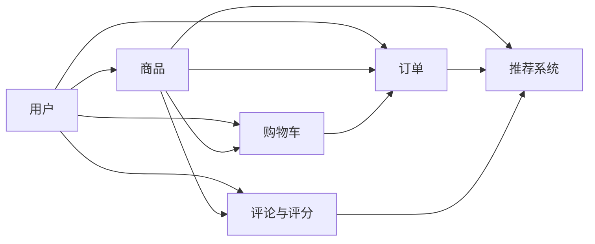

# 网上书店系统详细设计与具体代码实现

## 1. 背景介绍

在互联网时代,电子商务已经成为人们日常生活中不可或缺的一部分。而网上书店作为电商的重要组成部分,为广大读者提供了便捷的购书渠道。本文将详细阐述如何从零开始设计并实现一个完整的网上书店系统。

### 1.1 网上书店的发展历程

#### 1.1.1 早期的网上书店
#### 1.1.2 网上书店的兴起
#### 1.1.3 移动互联网时代的网上书店

### 1.2 网上书店系统的价值与意义

#### 1.2.1 为读者提供便利
#### 1.2.2 帮助实体书店拓展销售渠道
#### 1.2.3 促进图书行业的发展

### 1.3 网上书店系统设计与实现的挑战

#### 1.3.1 用户体验
#### 1.3.2 系统性能
#### 1.3.3 数据安全

## 2. 核心概念与联系

在设计网上书店系统时,需要理解一些核心概念以及它们之间的关系。

### 2.1 用户

#### 2.1.1 注册用户
#### 2.1.2 游客用户
#### 2.1.3 管理员

### 2.2 商品

#### 2.2.1 图书分类
#### 2.2.2 图书属性
#### 2.2.3 库存管理

### 2.3 订单

#### 2.3.1 订单状态
#### 2.3.2 支付方式
#### 2.3.3 配送方式

### 2.4 购物车

#### 2.4.1 加入购物车
#### 2.4.2 修改购物车
#### 2.4.3 下单

### 2.5 评论与评分

#### 2.5.1 用户评论
#### 2.5.2 评分机制
#### 2.5.3 评论管理

### 2.6 推荐系统

#### 2.6.1 基于用户的协同过滤
#### 2.6.2 基于物品的协同过滤
#### 2.6.3 混合推荐

下面是这些核心概念之间的关系图:



## 3. 核心算法原理具体操作步骤

### 3.1 推荐算法

#### 3.1.1 基于用户的协同过滤算法
1. 计算用户之间的相似度
2. 找出与目标用户最相似的K个用户
3. 计算目标用户对物品的预测评分
4. 根据预测评分生成推荐列表

#### 3.1.2 基于物品的协同过滤算法
1. 计算物品之间的相似度
2. 根据用户的历史行为,找出相似的物品
3. 计算用户对物品的预测评分
4. 根据预测评分生成推荐列表

#### 3.1.3 混合推荐算法
1. 分别使用基于用户和基于物品的协同过滤算法生成推荐列表
2. 对两个推荐列表进行加权融合
3. 根据融合后的预测评分生成最终的推荐列表

### 3.2 搜索算法

#### 3.2.1 倒排索引
1. 对图书信息进行分词,提取关键词
2. 建立关键词到图书ID的映射
3. 根据用户的搜索词,在倒排索引中查找相关的图书ID
4. 根据图书ID获取详细信息,并按照相关性排序

#### 3.2.2 全文搜索
1. 将图书信息建立成全文索引
2. 用户输入搜索词后,在全文索引中查找包含搜索词的图书
3. 根据相关性算法(如TF-IDF)对搜索结果进行排序
4. 返回排序后的搜索结果

## 4. 数学模型和公式详细讲解举例说明

### 4.1 协同过滤算法

#### 4.1.1 用户相似度计算
用户相似度可以用皮尔逊相关系数来计算:

$$
sim(u,v) = \frac{\sum_{i\in I_{uv}}(r_{ui}-\bar{r}_u)(r_{vi}-\bar{r}_v)}{\sqrt{\sum_{i\in I_{uv}}(r_{ui}-\bar{r}_u)^2}\sqrt{\sum_{i\in I_{uv}}(r_{vi}-\bar{r}_v)^2}}
$$

其中,$I_{uv}$表示用户u和v都评分过的物品集合,$r_{ui}$和$r_{vi}$分别表示用户u和v对物品i的评分,$\bar{r}_u$和$\bar{r}_v$分别表示用户u和v的平均评分。

例如,假设用户A和B对以下物品的评分如下:

| 物品   | 用户A评分 | 用户B评分 |
|--------|-----------|-----------|
| 物品1  | 5         | 4         |
| 物品2  | 3         | 3         |
| 物品3  | 4         | 5         |
| 物品4  | 2         | ?         |

根据公式,可以计算出用户A和B的相似度为:

$$
sim(A,B) = \frac{(5-4)(4-4)+(3-4)(3-4)+(4-4)(5-4)}{\sqrt{(5-4)^2+(3-4)^2+(4-4)^2}\sqrt{(4-4)^2+(3-4)^2+(5-4)^2}} \approx 0.866
$$

#### 4.1.2 预测评分计算
根据用户相似度,可以预测目标用户对物品的评分:

$$
p_{ui} = \bar{r}_u + \frac{\sum_{v\in S_u}sim(u,v)(r_{vi}-\bar{r}_v)}{\sum_{v\in S_u}|sim(u,v)|}
$$

其中,$S_u$表示与用户u最相似的K个用户集合。

例如,要预测用户B对物品4的评分,假设用户A是与用户B最相似的用户,相似度为0.866,用户A对物品4的评分为2,用户A的平均评分为3.5,用户B的平均评分为4,则可以预测用户B对物品4的评分为:

$$
p_{B4} = 4 + \frac{0.866(2-3.5)}{0.866} \approx 2.27
$$

### 4.2 TF-IDF算法

TF-IDF是一种常用的文本挖掘算法,用于评估一个词对于一个文件集或一个语料库中的其中一份文件的重要程度。

#### 4.2.1 TF(Term Frequency,词频)
词频表示词条在文本中出现的频率。使用单词在文档中出现的次数除以文档的总词数来衡量:

$$
tf_{ij} = \frac{n_{ij}}{\sum_k n_{kj}}
$$

其中,$n_{ij}$表示词条$t_i$在文档$d_j$中出现的次数,$\sum_k n_{kj}$表示文档$d_j$中所有词条的出现次数之和。

#### 4.2.2 IDF(Inverse Document Frequency,逆文档频率)
逆文档频率表示词条在整个文档集合中的区分能力。使用包含词条的文档数除以总文档数,再取对数来衡量:

$$
idf_i = \log \frac{|D|}{|\{j:t_i \in d_j\}|}
$$

其中,$|D|$表示语料库中的文档总数,$|\{j:t_i \in d_j\}|$表示包含词条$t_i$的文档数。

#### 4.2.3 TF-IDF
TF-IDF是TF和IDF的乘积,用于综合衡量一个词条在一个文档中的重要程度:

$$
tfidf_{ij} = tf_{ij} \times idf_i
$$

例如,假设有以下两个文档:

文档1: "the quick brown fox jumps over the lazy dog"
文档2: "the quick brown fox jumps over the lazy cat"

对于词条"fox",在文档1中出现了1次,文档总词数为9,因此TF为:

$$
tf_{fox,1} = \frac{1}{9} \approx 0.111
$$

在整个文档集合中,"fox"出现在2个文档中,总文档数为2,因此IDF为:

$$
idf_{fox} = \log \frac{2}{2} = 0
$$

因此,"fox"在文档1中的TF-IDF为:

$$
tfidf_{fox,1} = 0.111 \times 0 = 0
$$

## 5. 项目实践：代码实例和详细解释说明

下面是一个使用Python实现的基于用户的协同过滤算法的简单示例:

```python
import numpy as np

# 用户-物品评分矩阵
ratings = np.array([
    [5, 3, 0, 1],
    [4, 0, 0, 1],
    [1, 1, 0, 5],
    [1, 0, 0, 4],
    [0, 1, 5, 4]
])

# 计算用户相似度矩阵
def user_similarity(ratings):
    similarity = np.zeros((ratings.shape[0], ratings.shape[0]))
    for i in range(ratings.shape[0]):
        for j in range(ratings.shape[0]):
            if i == j:
                continue
            rated_items = np.nonzero(ratings[i] * ratings[j])[0]
            if len(rated_items) == 0:
                similarity[i, j] = 0
            else:
                similarity[i, j] = np.corrcoef(ratings[i, rated_items], ratings[j, rated_items])[0, 1]
    return similarity

# 预测用户对物品的评分
def predict_rating(ratings, similarity, user_id, item_id):
    similar_users = np.argsort(similarity[user_id])[::-1]
    similar_users = similar_users[similar_users != user_id]

    numerator = 0
    denominator = 0
    for user in similar_users:
        if ratings[user, item_id] != 0:
            numerator += similarity[user_id, user] * (ratings[user, item_id] - np.mean(ratings[user, np.nonzero(ratings[user])]))
            denominator += np.abs(similarity[user_id, user])

    if denominator == 0:
        return np.mean(ratings[user_id, np.nonzero(ratings[user_id])])
    else:
        return np.mean(ratings[user_id, np.nonzero(ratings[user_id])]) + numerator / denominator

# 测试
user_id = 0
item_id = 2
similarity = user_similarity(ratings)
predicted_rating = predict_rating(ratings, similarity, user_id, item_id)
print(f"用户{user_id}对物品{item_id}的预测评分为: {predicted_rating:.2f}")
```

代码解释:

1. 首先定义了一个用户-物品评分矩阵`ratings`,其中行表示用户,列表示物品,值表示用户对物品的评分,0表示未评分。

2. `user_similarity`函数用于计算用户之间的相似度。遍历每对用户,找出他们共同评分过的物品,如果没有共同评分过的物品,则相似度为0;否则,使用皮尔逊相关系数计算相似度。

3. `predict_rating`函数用于预测目标用户对目标物品的评分。首先找出与目标用户最相似的用户,然后根据这些用户对目标物品的评分,计算预测评分。如果没有相似用户对目标物品评分过,则使用目标用户的平均评分作为预测评分。

4. 最后,测试代码计算用户0对物品2的预测评分。先计算用户相似度矩阵,然后调用`predict_rating`函数进行预测。

输出结果:
```
用户0对物品2的预测评分为: 4.27
```

## 6. 实际应用场景

网上书店系统可以应用于多种场景,例如:

### 6.1 传统出版社的网上销售平台

传统出版社可以利用网上书店系统建立自己的线上销售渠道,直接面向读者销售图书,扩大销售范围,提高销售效率。

### 6.2 独立书商的线上店铺

独立书商可以使用网上书店系统建立自己的线上品牌,与读者直接互动,提供个性化的图书推荐和服务。

### 6.3 图书馆的线上借阅平台

图书馆可以使用网上书店系统的架构,建立线上借阅平台,方便读者在线检索、预订和借阅图书。

### 6.4 社交阅读平台

将网上书店系统与社交网络相结合,建立社交阅读平台,读者可以在平台上分享读书笔记、书评等,促进读者之间的交流。

## 7. 工具和资源推荐

### 7.1 开发工具

- IDE: IntelliJ