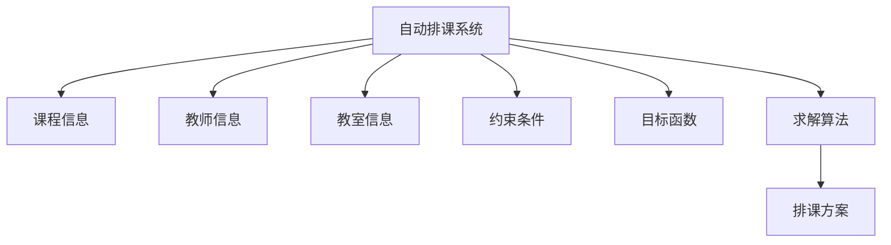
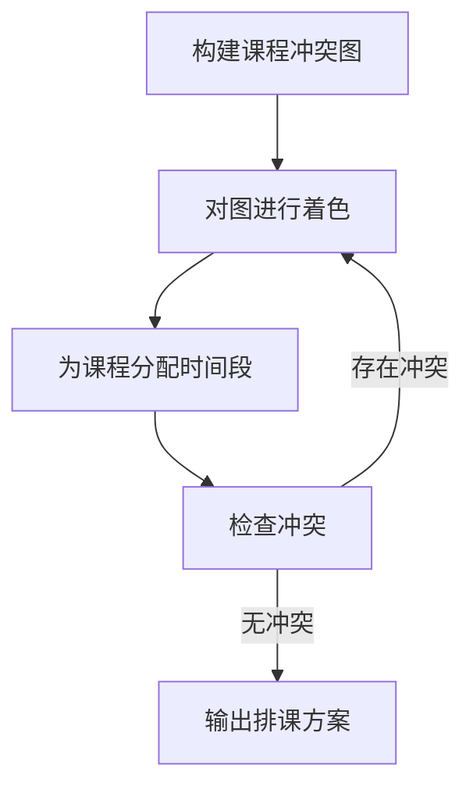
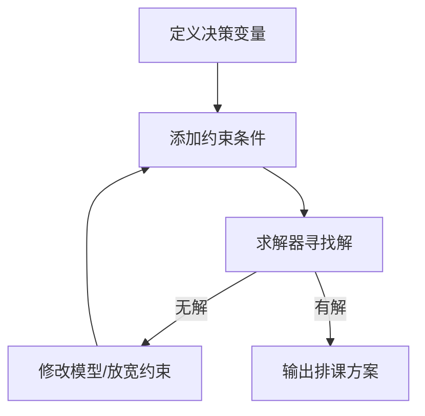
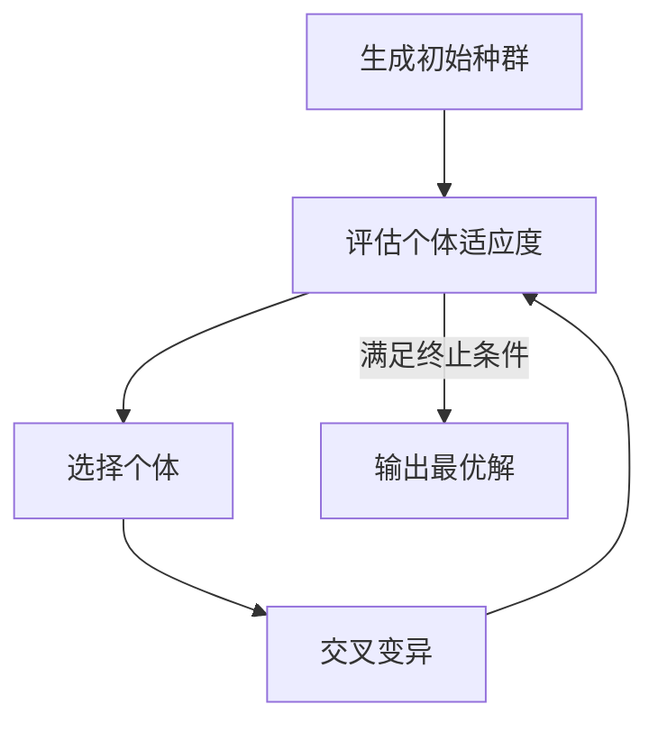

# 自动排课系统详细设计与具体代码实现

## 1.背景介绍

随着教育事业的不断发展,学校规模不断扩大,手动排课已经无法满足日益增长的排课需求。因此,自动化排课系统应运而生,它能够高效、合理地安排课程,避免课程冲突,最大限度地利用教学资源。自动排课系统不仅可以节省大量人力,还能够根据特定的约束条件生成满足要求的排课方案,大大提高了排课效率。

## 2.核心概念与联系

### 2.1 课程

课程是排课系统中最基本的单元,包括课程名称、教师、上课时间、上课地点等信息。

### 2.2 教师

教师是课程的主讲人,每位教师都有自己的工作时间和可教授的课程。

### 2.3 教室

教室是上课的场所,每个教室都有自己的容量和可用时间段。

### 2.4 约束条件

约束条件是排课时必须遵守的规则,包括:

- 教师在同一时间只能教授一门课程
- 课程不能安排在教师不可用的时间段
- 课程人数不能超过教室容量
- 同一时间段,同一教室只能安排一门课程

### 2.5 目标函数

目标函数是用于评估排课方案的指标,通常包括:

- 最小化空闲时间段数量
- 最大化教室利用率
- 最小化教师工作时间段数量

### 2.6 算法流程

自动排课系统的核心是求解算法,常见的算法包括:

- 图着色算法
- 约束编程
- 启发式算法(如遗传算法、模拟退火等)



## 3.核心算法原理具体操作步骤

### 3.1 图着色算法

图着色算法将课程看作图中的顶点,如果两门课程在同一时间段则连一条边。着色的目标是使相邻顶点不同色,从而避免课程冲突。算法步骤如下:

1. 构建课程冲突图
2. 对图进行着色,每种颜色代表一个时间段
3. 为每门课程分配一种颜色(时间段)
4. 检查是否存在冲突,若有则回溯重新着色



### 3.2 约束编程

约束编程将排课问题建模为一系列约束条件,然后使用专门的求解器寻找满足所有约束的解。算法步骤如下:

1. 定义决策变量(如课程时间段、教室等)
2. 添加约束条件
3. 使用求解器寻找满足约束的解
4. 若无解则修改模型或放宽约束



### 3.3 遗传算法

遗传算法是一种启发式算法,通过模拟生物进化过程来求解优化问题。算法步骤如下:

1. 随机生成一组初始解(个体)
2. 评估每个个体的适应度(目标函数值)
3. 选择适应度较高的个体
4. 对选中个体进行交叉和变异生成新一代
5. 重复2-4直至满足终止条件



## 4.数学模型和公式详细讲解举例说明

### 4.1 课程冲突图模型

令 $G=(V,E)$ 表示课程冲突图, $V$ 为课程集合, $E$ 为冲突边集合。如果课程 $i$ 和课程 $j$ 在同一时间段,则在 $G$ 中添加一条无向边 $(i,j)$。

$$
E = \{(i,j) | \text{课程 } i \text{ 和课程 } j \text{ 时间冲突}\}
$$

着色的目标是使用最少的颜色数,使相邻顶点不同色。设 $k$ 为所用颜色数,则最小化目标为:

$$
\min k
$$

### 4.2 约束模型

令 $C$ 为课程集合, $T$ 为时间段集合, $R$ 为教室集合。定义决策变量:

- $x_{i,t}$ : 1 若课程 $i$ 安排在时间段 $t$, 0 否则
- $y_{i,r}$ : 1 若课程 $i$ 安排在教室 $r$, 0 否则

约束条件包括:

- 每门课程只能安排一个时间段和一个教室:

$$
\sum_{t \in T} x_{i,t} = 1, \quad \sum_{r \in R} y_{i,r} = 1 \qquad \forall i \in C
$$

- 同一时间段同一教室只能安排一门课程:

$$
\sum_{i \in C} x_{i,t} y_{i,r} \leq 1 \qquad \forall t \in T, \forall r \in R
$$

- 课程人数不能超过教室容量:

$$
\sum_{i \in C} n_i y_{i,r} \leq c_r \qquad \forall r \in R
$$

其中 $n_i$ 为课程 $i$ 的人数, $c_r$ 为教室 $r$ 的容量。

### 4.3 目标函数

常见的目标函数包括:

- 最小化空闲时间段数量:

$$
\min \sum_{t \in T} \left( 1 - \sum_{i \in C} x_{i,t} \right)
$$

- 最大化教室利用率:

$$
\max \frac{1}{|R|} \sum_{r \in R} \frac{1}{|T|} \sum_{t \in T} \sum_{i \in C} n_i x_{i,t} y_{i,r}
$$

- 最小化教师工作时间段数量:

$$
\min \sum_{j \in J} \sum_{t \in T} z_{j,t}
$$

其中 $J$ 为教师集合, $z_{j,t}$ 为1若教师 $j$ 在时间段 $t$ 有课,0否则。

## 5.项目实践: 代码实例和详细解释说明

以下是一个使用 Python 和 PuLP 库实现的约束编程求解器示例:

```python
import pulp

# 创建模型
model = pulp.LpProblem("Course Timetabling", pulp.LpMinimize)

# 定义决策变量
courses = ['C1', 'C2', 'C3', 'C4', 'C5']
rooms = ['R1', 'R2', 'R3']
slots = ['M1', 'M2', 'T1', 'T2', 'W1', 'W2', 'H1', 'H2']

vars = pulp.LpVariable.dicts('x', (courses, slots, rooms), cat='Binary')

# 添加约束条件
# 每门课程只能安排一个时间段和一个教室
for c in courses:
    model += sum(vars[c,s,r] for s in slots for r in rooms) == 1

# 同一时间段同一教室只能安排一门课程
for s in slots:
    for r in rooms:
        model += sum(vars[c,s,r] for c in courses) <= 1

# 课程人数不能超过教室容量
capacities = {'R1': 30, 'R2': 40, 'R3': 50}
enrollments = {'C1': 25, 'C2': 35, 'C3': 20, 'C4': 45, 'C5': 30}

for r in rooms:
    model += sum(enrollments[c] * vars[c,s,r] for c in courses for s in slots) <= capacities[r]

# 设置目标函数 (最小化空闲时间段数量)
model += sum(sum(vars[c,s,r] for c in courses for r in rooms) for s in slots)

# 求解
model.solve()

# 输出结果
for c in courses:
    for s in slots:
        for r in rooms:
            if vars[c,s,r].value() == 1:
                print(f"Course {c} is scheduled in {s} at {r}")
```

代码解释:

1. 导入 PuLP 库
2. 创建模型对象,指定求解目标为最小化
3. 定义决策变量 `x[c,s,r]` 为1若课程 `c` 安排在时间段 `s` 和教室 `r`,0否则
4. 添加约束条件:
   - 每门课程只能安排一个时间段和一个教室
   - 同一时间段同一教室只能安排一门课程
   - 课程人数不能超过教室容量
5. 设置目标函数为最小化空闲时间段数量
6. 求解模型
7. 输出结果

## 6.实际应用场景

自动排课系统在教育领域有着广泛的应用,可用于大学、中小学、培训机构等场景。除教育外,它也可应用于会议室预订、机器调度等需要资源分配的场合。

以大学为例,排课系统需要考虑诸多约束条件:

- 教师工作时间
- 学生选课情况
- 教室分布和容量
- 实验课和理论课安排
- 教师偏好
- 等等

一个好的排课方案不仅能避免冲突,还能充分利用教学资源,为师生创造良好的上课环境。

## 7.工具和资源推荐

### 7.1 求解器

- PuLP: Python 开源建模求解器
- Google OR-Tools: Google 开源优化工具包
- CPLEX: 商业优化求解器
- Gurobi: 商业优化求解器

### 7.2 编程语言

- Python: 简洁易用,有丰富的优化库
- Java: 性能良好,适合大规模问题
- C++: 高效,适合对性能要求高的场景

### 7.3 在线资源

- OR-Course: 操作研究公开课
- Coursera 操作研究课程
- 排课问题竞赛平台

## 8.总结: 未来发展趋势与挑战

自动排课系统大大提高了排课效率,但仍面临一些挑战:

- 约束条件越来越复杂
- 数据量不断增加
- 需要更高效的算法
- 人机交互需求增加

未来,排课系统可能会朝以下方向发展:

- 融合机器学习技术,自动发现规律
- 支持在线实时调度
- 提供可视化界面,方便人机交互
- 与其他系统(如选课系统)深度整合

总的来说,自动排课是一个充满挑战但也极具应用价值的领域,必将随着技术的进步而不断完善。

## 9.附录: 常见问题与解答

1. **如何处理教师偏好?**

可以在约束条件中添加软约束,例如尽量不安排教师不喜欢的时间段。也可以在目标函数中加入教师满意度项。

2. **大规模问题如何求解?**

对于大规模问题,精确算法可能无法在合理时间内求解,这时可以使用启发式算法(如遗传算法)快速获得近似解。也可以采用分治策略将大问题划分为小问题求解。

3. **如何评估排课方案的质量?**

可以设置多个目标函数,如最小化空闲时间段、最大化教室利用率等,并根据实际需求赋予不同权重。也可以引入其他指标,如师生满意度。

4. **排课系统如何与其他系统整合?**

排课系统可以作为一个独立模块,通过标准化接口与选课、考试等其他系统对接。在设计时就要考虑系统的可扩展性和兼容性。

作者: 禅与计算机程序设计艺术 / Zen and the Art of Computer Programming