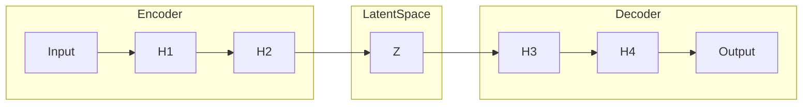

# 自编码器原理与代码实战案例讲解

## 1.背景介绍

### 1.1 什么是自编码器？

自编码器(Autoencoder)是一种无监督学习的人工神经网络,主要用于数据的编码和解码。它的基本思想是将高维输入数据先编码为低维表示,再将低维表示解码还原为与输入数据近似的高维输出。自编码器被广泛应用于降维、去噪、特征提取和生成式建模等领域。

### 1.2 自编码器的发展历程

自编码器最早可以追溯到上世纪80年代,当时被用于降维和特征提取。近年来,随着深度学习的兴起,自编码器也得到了长足发展,衍生出了多种变体网络,如稀疏自编码器、变分自编码器、递归自编码器等,显著扩展了自编码器的应用范围。

### 1.3 自编码器的优势

相比其他无监督学习方法,自编码器具有以下优势:

- 无需人工设计特征,可以自动学习数据的内在特征表示
- 具有非线性映射能力,能捕捉数据的复杂结构
- 可以有效处理高维数据,实现降维和去噪
- 易于与其他深度学习模型相结合,扩展应用范围

## 2.核心概念与联系

### 2.1 自编码器的基本结构

自编码器由两部分组成:编码器(Encoder)和解码器(Decoder)。编码器将高维输入数据映射到低维潜在空间,解码器则将低维潜在表示还原为与输入近似的高维输出。



### 2.2 自编码器的损失函数

自编码器的目标是使输出尽可能接近输入,因此损失函数通常定义为输入与输出之间的距离,例如均方误差:

$$J(x, \hat{x}) = \frac{1}{2n}\sum_{i=1}^{n}(x_i - \hat{x_i})^2$$

其中 $x$ 是输入, $\hat{x}$ 是输出, $n$ 是样本数量。

### 2.3 自编码器的变体

根据不同的约束条件和目标,自编码器衍生出了多种变体:

- **稀疏自编码器(Sparse Autoencoder)**: 在隐含层施加稀疏性约束,学习稀疏表示。
- **去噪自编码器(Denoising Autoencoder)**: 对输入数据加入噪声,训练网络从噪声中恢复原始数据。
- **变分自编码器(Variational Autoencoder, VAE)**: 将潜在空间限制为服从特定分布,可用于生成式建模。

## 3.核心算法原理具体操作步骤

### 3.1 自编码器的前向传播

给定输入数据 $x$,自编码器的前向传播过程如下:

1. 编码器将输入 $x$ 映射到隐含层 $h^{(l)}$:

$$h^{(l)} = f(W^{(l)}x + b^{(l)})$$

其中 $f$ 是激活函数, $W^{(l)}$ 和 $b^{(l)}$ 分别是权重和偏置。

2. 在隐含层之后得到潜在表示 $z$。
3. 解码器将潜在表示 $z$ 映射回输出 $\hat{x}$:

$$\hat{x} = g(W'^{(l)}z + b'^{(l)})$$

其中 $g$ 是输出层的激活函数, $W'^{(l)}$ 和 $b'^{(l)}$ 是解码器的权重和偏置。

### 3.2 自编码器的反向传播

在训练过程中,自编码器通过反向传播算法更新权重,使输出 $\hat{x}$ 尽可能接近输入 $x$。反向传播的步骤如下:

1. 计算输出层的误差:

$$\delta^{(n_l)} = \nabla_a C \odot g'(z^{(n_l)})$$

其中 $C$ 是损失函数, $g'$ 是输出层激活函数的导数, $\odot$ 表示元素wise运算。

2. 计算隐含层的误差:

$$\delta^{(l)} = (W^{(l+1)})^T \delta^{(l+1)} \odot f'(z^{(l)})$$

其中 $f'$ 是隐含层激活函数的导数。

3. 更新权重和偏置:

$$W^{(l)} \leftarrow W^{(l)} - \alpha \frac{\partial C}{\partial W^{(l)}}$$
$$b^{(l)} \leftarrow b^{(l)} - \alpha \frac{\partial C}{\partial b^{(l)}}$$

其中 $\alpha$ 是学习率。

重复上述步骤直到收敛或达到最大迭代次数。

## 4.数学模型和公式详细讲解举例说明

### 4.1 均方误差损失函数

均方误差(Mean Squared Error, MSE)是自编码器中最常用的损失函数,用于衡量输入与输出之间的差异:

$$J(x, \hat{x}) = \frac{1}{2n}\sum_{i=1}^{n}(x_i - \hat{x_i})^2$$

其中 $x$ 是输入, $\hat{x}$ 是输出, $n$ 是样本数量。

均方误差的优点是计算简单,且对于输出值的微小变化有较好的敏感性。但是,它对异常值较为敏感,可能导致模型不够鲁棒。

### 4.2 交叉熵损失函数

对于自编码器的一些变体,如变分自编码器,常使用交叉熵作为损失函数。交叉熵可以衡量两个概率分布之间的差异,定义如下:

$$H(p,q) = -\sum_x p(x)\log q(x)$$

其中 $p$ 是真实分布, $q$ 是模型输出的分布。

交叉熵损失函数的优点是能够直接优化数据的似然函数,从而获得更好的生成性能。但是,它对异常值的鲁棒性较差。

### 4.3 正则化项

为了防止自编码器过拟合,常在损失函数中加入正则化项,如 $L_1$ 正则化和 $L_2$ 正则化:

$$J(x, \hat{x}) = \frac{1}{2n}\sum_{i=1}^{n}(x_i - \hat{x_i})^2 + \lambda\Omega(W)$$

其中 $\Omega(W)$ 是正则化项, $\lambda$ 是权衡参数。

- $L_1$ 正则化: $\Omega(W) = \sum_{i,j}|W_{ij}|$
- $L_2$ 正则化: $\Omega(W) = \sum_{i,j}W_{ij}^2$

$L_1$ 正则化可以产生稀疏权重,而 $L_2$ 正则化则倾向于产生权值分布较为集中的解。

## 5.项目实践:代码实例和详细解释说明

### 5.1 环境配置

```python
import numpy as np
import matplotlib.pyplot as plt
from tensorflow.keras.datasets import mnist
from tensorflow.keras.layers import Input, Dense
from tensorflow.keras.models import Model
```

### 5.2 加载MNIST数据集

```python
(x_train, _), (x_test, _) = mnist.load_data()

# 数据预处理
x_train = x_train.astype('float32') / 255
x_test = x_test.astype('float32') / 255
x_train = x_train.reshape(len(x_train), np.prod(x_train.shape[1:]))
x_test = x_test.reshape(len(x_test), np.prod(x_test.shape[1:]))
```

### 5.3 定义自编码器模型

```python
input_dim = x_train.shape[1]
encoding_dim = 32

# 编码器
input_layer = Input(shape=(input_dim,))
encoder = Dense(encoding_dim, activation='relu')(input_layer)

# 解码器
decoder = Dense(input_dim, activation='sigmoid')(encoder)

# 构建自编码器模型
autoencoder = Model(inputs=input_layer, outputs=decoder)
```

### 5.4 训练自编码器模型

```python
autoencoder.compile(optimizer='adam', loss='mse')
autoencoder.fit(x_train, x_train, epochs=50, batch_size=256, shuffle=True)
```

### 5.5 可视化结果

```python
decoded_imgs = autoencoder.predict(x_test)

# 显示原始图像和解码图像
n = 10
plt.figure(figsize=(20, 4))
for i in range(n):
    ax = plt.subplot(2, n, i + 1)
    plt.imshow(x_test[i].reshape(28, 28))
    ax.get_xaxis().set_visible(False)
    ax.get_yaxis().set_visible(False)

    ax = plt.subplot(2, n, i + 1 + n)
    plt.imshow(decoded_imgs[i].reshape(28, 28))
    ax.get_xaxis().set_visible(False)
    ax.get_yaxis().set_visible(False)

plt.show()
```

上述代码实现了一个简单的自编码器,对MNIST手写数字图像进行编码和解码。你可以进一步探索自编码器的变体,如稀疏自编码器、变分自编码器等,并将其应用于其他数据集和任务。

## 6.实际应用场景

自编码器在以下领域有广泛的应用:

### 6.1 数据压缩

自编码器可以将高维数据压缩到低维表示,从而实现有损数据压缩。这在存储和传输大规模数据时非常有用。

### 6.2 降噪

去噪自编码器能够从噪声数据中恢复出原始数据,可用于图像/音频/视频的去噪处理。

### 6.3 异常检测

由于自编码器被训练为重构输入数据,因此对于异常数据,重构误差会较大。利用这一特性,可以实现异常检测。

### 6.4 特征提取

自编码器的隐含层可以提取输入数据的有效特征表示,这些特征可用于其他机器学习任务,如分类、聚类等。

### 6.5 生成式建模

变分自编码器等自编码器变体可以学习数据的潜在分布,从而生成新的样本,在图像/音频/文本生成等领域有应用。

### 6.6 推荐系统

自编码器可以学习用户和物品的潜在表示,用于协同过滤推荐系统。

## 7.工具和资源推荐

### 7.1 深度学习框架

- TensorFlow: 谷歌开源的端到端机器学习平台
- PyTorch: Facebook开源的Python机器学习库
- Keras: 高层次神经网络API,可在TensorFlow/CNTK/Theano上运行

### 7.2 自编码器相关资源

- Keras自编码器示例: https://keras.io/examples/auto_encoders/
- PyTorch自编码器教程: https://pytorch.org/tutorials/beginner/ae_tutorial.html
- 变分自编码器讲解: http://kvfrans.com/variational-autoencoders-explained/
- 自编码器应用案例: https://blog.openai.com/unsupervised-sentiment-neuron/

## 8.总结:未来发展趋势与挑战

### 8.1 发展趋势

- 结合注意力机制,提高自编码器的表达能力
- 探索新的正则化方法,提高自编码器的泛化性能
- 将自编码器与其他深度学习模型相结合,扩展应用范围
- 在生成式对抗网络等领域,自编码器有望发挥更大作用

### 8.2 挑战

- 自编码器的训练过程不够透明,存在"黑盒"问题
- 缺乏足够的理论指导,模型设计依赖经验
- 对异常值的鲁棒性有待提高
- 生成质量有待进一步改进,与真实数据仍有一定差距

## 9.附录:常见问题与解答

### 9.1 自编码器和PCA的区别?

主成分分析(PCA)是一种线性无监督降维技术,而自编码器则是非线性的。自编码器通过神经网络学习数据的非线性表示,能够捕捉更复杂的数据结构。另外,自编码器还可以用于生成式建模等其他任务。

### 9.2 如何选择编码维度?

编码维度的选择需要权衡压缩率和重构质量。较低的编码维度可以获得更高的压缩率,但可能导致信息损失;较高的编码维度则能保留更多信息,但压缩率较低。通常需要根据具体任务