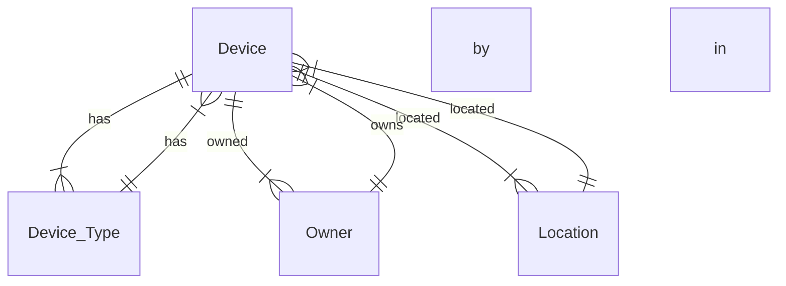

## 1. Background Introduction

In today's interconnected world, managing device information is crucial for businesses and organizations to maintain efficient operations. This article aims to provide a comprehensive guide on designing and implementing a device information management system (DIMS). We will delve into the core concepts, algorithms, mathematical models, practical examples, and tools required to build a robust DIMS.

### 1.1 Importance of Device Information Management

Effective device management is essential for several reasons:

1. **Inventory Control**: Keeping track of devices helps organizations avoid overspending on unnecessary purchases and ensures that all devices are accounted for.
2. **Asset Utilization**: By understanding the status and location of devices, organizations can optimize their usage and minimize downtime.
3. **Security**: Proper device management helps protect sensitive data by ensuring that only authorized personnel have access to devices.
4. **Compliance**: Adhering to industry regulations and standards is crucial, and a well-designed DIMS can help organizations meet these requirements.

### 1.2 Scope and Objectives

The primary objective of this article is to provide a detailed design and implementation guide for a DIMS. We will cover the following aspects:

1. Core concepts and connections
2. Algorithm principles and operational steps
3. Mathematical models and formulas
4. Practical examples and code implementation
5. Application scenarios
6. Tools and resources recommendations
7. Future development trends and challenges
8. Frequently asked questions and answers

## 2. Core Concepts and Connections

Before diving into the design and implementation details, let's first understand the core concepts and connections that form the foundation of a DIMS.

### 2.1 Device Information

Device information refers to the data associated with a device, including:

1. **Device Identifier**: A unique identifier for each device, such as a serial number or MAC address.
2. **Device Type**: The category of the device, such as laptop, smartphone, or printer.
3. **Device Status**: The current operational status of the device, such as available, in use, or under maintenance.
4. **Location**: The physical location of the device within the organization.
5. **Owner**: The individual or department responsible for the device.
6. **Specifications**: Technical details about the device, such as processor type, memory size, and operating system.

### 2.2 Database Design

A relational database is an ideal choice for storing device information. The database schema should include tables for devices, owners, locations, and device types.



### 2.3 APIs and Integration

To enable seamless communication between the DIMS and other systems, APIs (Application Programming Interfaces) are essential. APIs allow for the exchange of device information, enabling automation and real-time updates.

## 3. Core Algorithm Principles and Specific Operational Steps

Now that we have a basic understanding of the core concepts, let's discuss the algorithm principles and operational steps for managing device information.

### 3.1 Device Registration

When a new device is added to the system, it should be registered by providing the necessary information, such as device identifier, type, status, location, and owner.

### 3.2 Device Status Management

The system should be able to update the device status in real-time, such as when a device is checked out, returned, or under maintenance.

### 3.3 Device Location Tracking

The system should be able to track the location of devices, either through manual input or automated methods like GPS.

### 3.4 Device Maintenance Scheduling

The system should be able to schedule maintenance for devices based on their usage and specific maintenance requirements.

### 3.5 Device Inventory Management

The system should be able to maintain an inventory of devices, including the number of available devices and those under maintenance.

## 4. Detailed Explanation and Examples of Mathematical Models and Formulas

Mathematical models and formulas can help optimize the management of device information. Here are some examples:

### 4.1 Device Utilization Rate

The device utilization rate is calculated as follows:

$$Utilization\_Rate = \frac{Time\_In\_Use}{Total\_Time}$$

### 4.2 Mean Time Between Failures (MTBF)

The Mean Time Between Failures is a measure of a device's reliability and is calculated as the average time a device operates between failures:

$$MTBF = \frac{Total\_Operating\_Time}{Number\_of\_Failures}$$

## 5. Project Practice: Code Examples and Detailed Explanations

In this section, we will provide practical examples of code implementation for key functionalities of the DIMS.

### 5.1 Device Registration

Here's a simple example of device registration in Python:

```python
class Device:
    def __init__(self, identifier, type, status, location, owner):
        self.identifier = identifier
        self.type = type
        self.status = status
        self.location = location
        self.owner = owner

    def register(self):
        # Code to register the device in the database
        pass
```

### 5.2 Device Status Management

Here's an example of updating the device status in Python:

```python
class Device:
    # ... (previous code)

    def checkout(self):
        self.status = "checked out"
        # Code to update the device status in the database
        pass

    def return_device(self):
        self.status = "available"
        # Code to update the device status in the database
        pass
```

## 6. Practical Application Scenarios

Let's consider a practical scenario where a company wants to implement a DIMS to manage its fleet of laptops. The system should be able to:

1. Register new laptops
2. Track the status and location of laptops
3. Schedule maintenance for laptops based on their utilization rate
4. Provide reports on laptop usage and maintenance

## 7. Tools and Resources Recommendations

Here are some tools and resources that can help in the development of a DIMS:

1. **Database Management Systems (DBMS)**: MySQL, PostgreSQL, and MongoDB are popular choices for storing device information.
2. **API Frameworks**: Flask and Django are popular Python-based API frameworks.
3. **Version Control Systems (VCS)**: Git is a widely-used VCS for managing code repositories.
4. **Integrated Development Environments (IDE)**: PyCharm, Visual Studio Code, and Jupyter Notebook are popular IDEs for Python development.

## 8. Summary: Future Development Trends and Challenges

The future of device information management is promising, with advancements in IoT, AI, and machine learning. Here are some trends and challenges to consider:

1. **Real-time Device Monitoring**: With the rise of IoT, real-time monitoring of device status and usage will become increasingly important.
2. **Predictive Maintenance**: AI and machine learning can help predict when a device is likely to fail, enabling proactive maintenance.
3. **Security**: As the number of connected devices grows, ensuring the security of device information will become more critical.
4. **Scalability**: As organizations grow, the DIMS must be able to scale to accommodate an increasing number of devices.

## 9. Appendix: Frequently Asked Questions and Answers

**Q1: What is the best database for a DIMS?**

A1: The choice of database depends on the specific requirements of the system. MySQL, PostgreSQL, and MongoDB are popular choices for storing device information.

**Q2: How can I ensure the security of device information in the DIMS?**

A2: Implementing strong authentication and authorization mechanisms, encrypting sensitive data, and regularly updating the system to patch vulnerabilities can help ensure the security of device information.

**Q3: Can I use a NoSQL database for a DIMS?**

A3: Yes, NoSQL databases like MongoDB can be a good choice for a DIMS due to their scalability and flexibility.

**Q4: How can I integrate the DIMS with other systems?**

A4: APIs are essential for integrating the DIMS with other systems. REST APIs are a popular choice due to their simplicity and wide support.

**Q5: Can I use a cloud-based solution for my DIMS?**

A5: Yes, cloud-based solutions can offer scalability, flexibility, and cost savings. Popular cloud providers like AWS, Google Cloud, and Azure offer database and API services that can be used for a DIMS.

## Author: Zen and the Art of Computer Programming