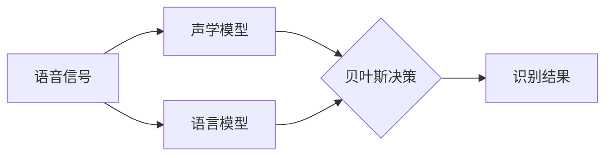
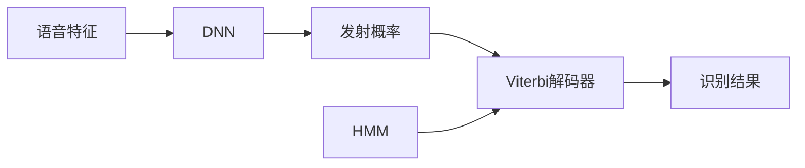

# 语音识别原理与代码实战案例讲解

## 1.背景介绍

语音识别技术是一种将人类语音转换为相应文本或命令的过程,已经广泛应用于智能手机、智能家居、车载系统等多个领域。随着深度学习技术的不断发展,语音识别的准确率也在不断提高,为人机交互带来了全新的体验。本文将全面介绍语音识别的核心原理、算法实现以及实战案例,帮助读者深入理解这一重要技术。

## 2.核心概念与联系

语音识别主要涉及以下几个核心概念:

### 2.1 语音信号处理

语音信号是一种时变的模拟信号,需要经过采样、量化等数字化处理才能被计算机识别。常用的语音信号处理技术包括:

- 预加重(Pre-Emphasis)
- 分帧(Framing)
- 加窗(Windowing)
- 傅里叶变换(Fourier Transform)

### 2.2 声学模型(Acoustic Model)

声学模型的作用是将语音特征向量映射到语音单元(如音素)的概率分布上。常用的声学模型有:

- 高斯混合模型(GMM-HMM)
- 深度神经网络(DNN-HMM)

### 2.3 语言模型(Language Model)

语言模型的作用是估计一个词序列的概率,用于提高识别准确率。常用的语言模型有:

- N-gram模型
- 神经网络语言模型(NNLM)

### 2.4 声学模型与语言模型的整合

声学模型和语言模型的结合使用是语音识别系统的核心,通过贝叶斯公式将两者相乘得到最终的识别结果。



## 3.核心算法原理具体操作步骤

### 3.1 高斯混合模型-隐马尔可夫模型 (GMM-HMM)

GMM-HMM 模型是传统的声学模型,包含以下步骤:

1. **HMM 模型训练**:利用带标注的语音数据,使用 Baum-Welch 算法训练 HMM 模型的参数。
2. **GMM 参数估计**:对每个 HMM 状态,使用 EM 算法估计 GMM 的参数(均值、方差和混合权重)。
3. **解码**:给定一个语音特征序列,使用 Viterbi 算法求解最可能的 HMM 状态序列,从而得到识别结果。

### 3.2 深度神经网络-隐马尔可夫模型 (DNN-HMM)

DNN-HMM 模型是目前主流的声学模型,包含以下步骤:

1. **DNN 训练**:利用标注好的语音数据,训练一个前馈深度神经网络,输出为 HMM 状态的发射概率。
2. **HMM 训练**:固定 DNN 参数,使用传统的 Baum-Welch 算法训练 HMM 的转移概率。
3. **解码**:给定语音特征序列,结合 DNN 和 HMM 的概率,使用 Viterbi 算法解码得到识别结果。



### 3.3 端到端模型

近年来,端到端模型(如 CTC、Attention-Based Encoder-Decoder)逐渐取代了传统的 HMM 模型,可以直接从语音特征到文本序列,避免了中间步骤。这类模型通常使用深度神经网络结构,并采用序列到序列的训练方式。

## 4.数学模型和公式详细讲解举例说明

### 4.1 GMM 概率密度函数

高斯混合模型(GMM)是一种半参数概率密度模型,由多个单高斯分量线性叠加而成。对于 D 维特征向量 $\mathbf{x}$,含 M 个混合成分的 GMM 概率密度为:

$$p(\mathbf{x}|\lambda) = \sum_{i=1}^M \omega_i \mathcal{N}(\mathbf{x}|\boldsymbol{\mu}_i,\boldsymbol{\Sigma}_i)$$

其中:
- $\omega_i$ 为第 i 个混合成分的混合权重,满足 $\sum_{i=1}^M\omega_i=1$
- $\mathcal{N}(\mathbf{x}|\boldsymbol{\mu}_i,\boldsymbol{\Sigma}_i)$ 为第 i 个混合成分的高斯分布密度函数:

$$\mathcal{N}(\mathbf{x}|\boldsymbol{\mu}_i,\boldsymbol{\Sigma}_i)=\frac{1}{(2\pi)^{D/2}|\boldsymbol{\Sigma}_i|^{1/2}}\exp\left(-\frac{1}{2}(\mathbf{x}-\boldsymbol{\mu}_i)^{\top}\boldsymbol{\Sigma}_i^{-1}(\mathbf{x}-\boldsymbol{\mu}_i)\right)$$

- $\boldsymbol{\mu}_i$ 为 D 维均值向量
- $\boldsymbol{\Sigma}_i$ 为 D×D 维协方差矩阵

GMM 模型的参数 $\lambda=\{\omega_i,\boldsymbol{\mu}_i,\boldsymbol{\Sigma}_i\}_{i=1}^M$ 可以通过期望最大化(EM)算法估计得到。

### 4.2 HMM 前向概率

隐马尔可夫模型(HMM)是一种生成模型,可以计算观测序列 $\mathbf{O}=\{o_1,o_2,...,o_T\}$ 的概率 $P(\mathbf{O}|\lambda)$。该概率可以通过前向算法高效计算:

$$\alpha_t(i)=P(o_1,o_2,...,o_t,q_t=i|\lambda)$$

其中 $\alpha_t(i)$ 表示部分观测序列 $o_1,o_2,...,o_t$ 并在时刻 t 处于状态 $q_t=i$ 的前向概率。通过递推可以计算:

$$
\begin{aligned}
\alpha_1(i)&=\pi_i b_i(o_1),\quad 1\leq i\leq N\
\alpha_{t+1}(j)&=\left[\sum_{i=1}^N\alpha_t(i)a_{ij}\right]b_j(o_{t+1}),\quad 1\leq j\leq N,\quad 1\leq t\leq T-1
\end{aligned}
$$

其中 $\pi_i$ 为初始状态概率, $a_{ij}$ 为状态转移概率, $b_j(o_t)$ 为观测概率。最终观测序列的概率为:

$$P(\mathbf{O}|\lambda)=\sum_{i=1}^N\alpha_T(i)$$

### 4.3 N-gram 语言模型

N-gram 语言模型是一种基于统计的语言模型,通过计算历史 N-1 个词的条件概率来预测当前词的概率:

$$P(w_n|w_1^{n-1})=\frac{C(w_1^n)}{C(w_1^{n-1})}$$

其中 $C(w_1^n)$ 表示词序列 $w_1,w_2,...,w_n$ 在语料库中出现的次数。

为了解决数据稀疏问题,通常会使用平滑技术,如加法平滑(Add-one Smoothing):

$$P(w_n|w_1^{n-1})=\frac{C(w_1^n)+\alpha}{C(w_1^{n-1})+V\alpha}$$

其中 $V$ 为词汇量大小,$\alpha$ 为平滑参数。

### 4.4 注意力机制

注意力机制(Attention Mechanism)是一种有助于神经网络模型捕捉长距离依赖关系的技术,在机器翻译、语音识别等序列到序列的任务中发挥重要作用。

对于编码器的输出 $\{\mathbf{h}_1,\mathbf{h}_2,...,\mathbf{h}_T\}$ 和解码器隐状态 $\mathbf{s}_t$,注意力权重 $\alpha_{t,i}$ 可以计算为:

$$\alpha_{t,i}=\frac{\exp(e_{t,i})}{\sum_{j=1}^T\exp(e_{t,j})},\quad e_{t,i}=\mathbf{v}_a^\top\tanh(\mathbf{W}_a\mathbf{s}_t+\mathbf{U}_a\mathbf{h}_i)$$

其中 $\mathbf{v}_a$,$\mathbf{W}_a$,$\mathbf{U}_a$ 为可训练参数。注意力加权和 $\mathbf{c}_t$ 为:

$$\mathbf{c}_t=\sum_{i=1}^T\alpha_{t,i}\mathbf{h}_i$$

解码器可以结合 $\mathbf{c}_t$ 和 $\mathbf{s}_t$ 预测下一个输出。

## 5.项目实践:代码实例和详细解释说明

以下是一个使用 PyTorch 实现的简单语音识别系统示例,包括声学模型和语言模型的构建:

### 5.1 数据预处理

```python
import torchaudio

# 加载语音数据
waveform, sample_rate = torchaudio.load("speech.wav")

# 计算梅尔频率倒谱系数 (MFCC) 特征
mfcc_transform = torchaudio.transforms.MFCC()
mfcc = mfcc_transform(waveform)
```

### 5.2 声学模型

```python
import torch.nn as nn

# 定义 DNN 声学模型
class AcousticModel(nn.Module):
    def __init__(self, input_dim, hidden_dim, output_dim):
        super().__init__()
        self.fc1 = nn.Linear(input_dim, hidden_dim)
        self.fc2 = nn.Linear(hidden_dim, hidden_dim)
        self.fc3 = nn.Linear(hidden_dim, output_dim)

    def forward(self, x):
        x = torch.relu(self.fc1(x))
        x = torch.relu(self.fc2(x))
        x = self.fc3(x)
        return x

# 实例化模型
input_dim = mfcc.shape[1]  # MFCC 特征维度
output_dim = 39  # 音素个数
model = AcousticModel(input_dim, 256, output_dim)

# 训练模型
criterion = nn.CrossEntropyLoss()
optimizer = torch.optim.Adam(model.parameters())
for epoch in range(10):
    ...  # 训练循环
```

### 5.3 语言模型

```python
import torch.nn as nn

# 定义 LSTM 语言模型
class LanguageModel(nn.Module):
    def __init__(self, vocab_size, embedding_dim, hidden_dim):
        super().__init__()
        self.embedding = nn.Embedding(vocab_size, embedding_dim)
        self.lstm = nn.LSTM(embedding_dim, hidden_dim, batch_first=True)
        self.fc = nn.Linear(hidden_dim, vocab_size)

    def forward(self, x):
        embedded = self.embedding(x)
        output, _ = self.lstm(embedded)
        output = self.fc(output)
        return output

# 实例化模型
vocab_size = 1000  # 词汇量大小
embedding_dim = 128
hidden_dim = 256
model = LanguageModel(vocab_size, embedding_dim, hidden_dim)

# 训练模型
criterion = nn.CrossEntropyLoss()
optimizer = torch.optim.Adam(model.parameters())
for epoch in range(10):
    ...  # 训练循环
```

### 5.4 解码与识别

```python
import torch.nn.functional as F

# 声学模型前向计算
logits = model(mfcc)

# 使用 Viterbi 算法解码
decoded = F.ctc_decode(logits, ...)

# 将解码结果转换为文本
text = decoder.convert_to_text(decoded)
print(f"识别结果: {text}")
```

上述代码仅为简单示例,实际的语音识别系统会更加复杂,需要处理更多数据预处理、模型训练和解码细节。但总的思路是相似的,即构建声学模型、语言模型,然后将两者结合进行解码和识别。

## 6.实际应用场景

语音识别技术在现实生活中有着广泛的应用,主要包括:

1. **智能语音助手**: 如 Siri、Alexa 和小米小爱同学等,可以通过语音与用户进行自然交互,执行查询、控制家居设备等操作。

2. **会议记录**: 利用语音识别技术可以自动将会议对话转录为文字记录,提高工作效率。

3. **车载语音控制**: 驾驶员可以通过语音指令控