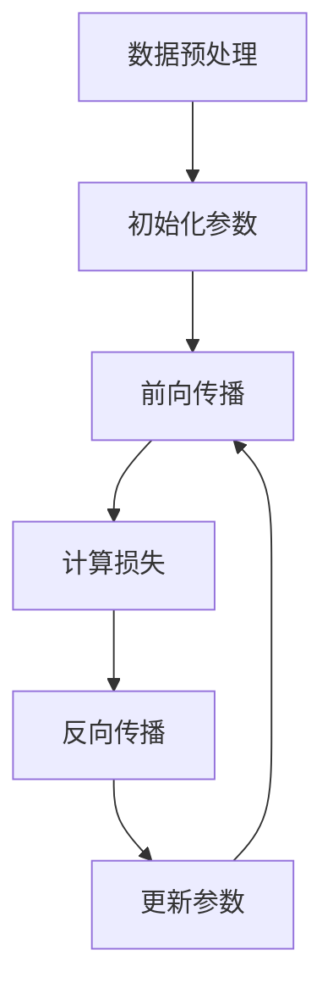

# 逻辑回归(Logistic Regression) - 原理与代码实例讲解

## 1. 背景介绍
### 1.1 逻辑回归简介
逻辑回归(Logistic Regression)是一种常用的监督学习算法,主要用于解决二分类问题。它是一种广义线性模型,通过Sigmoid函数将线性回归的输出映射到(0,1)区间,得到分类的概率。

### 1.2 逻辑回归的应用场景
逻辑回归广泛应用于各个领域,如:
- 金融领域:信用评分、欺诈检测等
- 医疗领域:疾病诊断、药物反应预测等
- 营销领域:客户流失预测、广告点击率预测等
- 自然语言处理:文本分类、情感分析等

## 2. 核心概念与联系
### 2.1 Sigmoid函数
Sigmoid函数是逻辑回归的核心,它将实数映射到(0,1)区间,常用的Sigmoid函数为Logistic函数:

$$
\sigma(z) = \frac{1}{1+e^{-z}}
$$

其中,$z$为线性回归的输出。

### 2.2 决策边界
逻辑回归通过Sigmoid函数将样本映射到(0,1)区间,一般取0.5为阈值,大于0.5的样本预测为正类,小于0.5的样本预测为负类。在特征空间中,决策边界为使Sigmoid函数输出为0.5的超平面。

### 2.3 损失函数
逻辑回归使用极大似然估计来求解模型参数,对应的损失函数为交叉熵损失函数:

$$
J(\theta) = -\frac{1}{m}\sum_{i=1}^m [y^{(i)}\log(h_\theta(x^{(i)}))+(1-y^{(i)})\log(1-h_\theta(x^{(i)}))]
$$

其中,$m$为样本数,$y^{(i)}$为第$i$个样本的真实标签,$h_\theta(x^{(i)})$为模型对第$i$个样本的预测概率。

### 2.4 优化算法
逻辑回归通常使用梯度下降法来优化损失函数,求解最优参数。梯度下降法的更新公式为:

$$
\theta_j := \theta_j - \alpha \frac{\partial}{\partial \theta_j} J(\theta)
$$

其中,$\alpha$为学习率,$\frac{\partial}{\partial \theta_j} J(\theta)$为损失函数对$\theta_j$的偏导数。

## 3. 核心算法原理具体操作步骤
逻辑回归的主要步骤如下:
1. 数据预处理:对数据进行清洗、特征缩放等预处理操作。
2. 初始化参数:随机初始化模型参数$\theta$。
3. 前向传播:根据当前参数计算预测概率。

   $$
   z = \theta^T x \\
   h_\theta(x) = \sigma(z) = \frac{1}{1+e^{-z}}
   $$

4. 计算损失:根据预测概率和真实标签计算交叉熵损失。

   $$
   J(\theta) = -\frac{1}{m}\sum_{i=1}^m [y^{(i)}\log(h_\theta(x^{(i)}))+(1-y^{(i)})\log(1-h_\theta(x^{(i)}))]
   $$

5. 反向传播:计算损失函数对参数的梯度。

   $$
   \frac{\partial}{\partial \theta_j} J(\theta) = \frac{1}{m}\sum_{i=1}^m (h_\theta(x^{(i)})-y^{(i)})x_j^{(i)}
   $$

6. 更新参数:使用梯度下降法更新参数。

   $$
   \theta_j := \theta_j - \alpha \frac{\partial}{\partial \theta_j} J(\theta)
   $$

7. 重复步骤3-6,直到达到停止条件(如达到最大迭代次数或损失函数收敛)。



## 4. 数学模型和公式详细讲解举例说明
### 4.1 二元逻辑回归
对于二分类问题,假设有$m$个样本,每个样本有$n$个特征。令$x^{(i)}$表示第$i$个样本的特征向量,$y^{(i)} \in \{0,1\}$表示第$i$个样本的标签。逻辑回归模型假设样本的标签$y$服从伯努利分布,即:

$$
P(y=1|x;\theta) = h_\theta(x) \\
P(y=0|x;\theta) = 1-h_\theta(x)
$$

其中,$h_\theta(x)$为模型的预测函数,表示样本$x$为正类的概率,其形式为:

$$
h_\theta(x) = \sigma(\theta^T x) = \frac{1}{1+e^{-\theta^T x}}
$$

模型的参数$\theta$可以通过极大似然估计求解,即最小化负对数似然函数:

$$
J(\theta) = -\frac{1}{m}\sum_{i=1}^m [y^{(i)}\log(h_\theta(x^{(i)}))+(1-y^{(i)})\log(1-h_\theta(x^{(i)}))]
$$

使用梯度下降法更新参数:

$$
\theta_j := \theta_j - \alpha \frac{\partial}{\partial \theta_j} J(\theta)
$$

其中,

$$
\frac{\partial}{\partial \theta_j} J(\theta) = \frac{1}{m}\sum_{i=1}^m (h_\theta(x^{(i)})-y^{(i)})x_j^{(i)}
$$

### 4.2 多元逻辑回归
对于多分类问题,假设有$K$个类别,可以将其转化为$K$个二元分类问题。对于第$k$个类别,定义一个二元分类器:

$$
h_\theta^{(k)}(x) = P(y=k|x;\theta) = \frac{e^{\theta_k^T x}}{\sum_{j=1}^K e^{\theta_j^T x}}
$$

其中,$\theta_k$为第$k$个分类器的参数。模型的预测结果为:

$$
\hat{y} = \arg\max_k h_\theta^{(k)}(x)
$$

多元逻辑回归的损失函数为:

$$
J(\theta) = -\frac{1}{m}\sum_{i=1}^m \sum_{k=1}^K 1\{y^{(i)}=k\}\log(h_\theta^{(k)}(x^{(i)}))
$$

其中,$1\{\cdot\}$为示性函数,当条件成立时取值为1,否则为0。

## 5. 项目实践:代码实例和详细解释说明
下面以Python和scikit-learn库为例,演示如何实现逻辑回归。

### 5.1 数据集准备
使用scikit-learn自带的乳腺癌数据集,该数据集包含569个样本,每个样本有30个特征,标签为良性(0)或恶性(1)。

```python
from sklearn.datasets import load_breast_cancer
from sklearn.model_selection import train_test_split

# 加载数据集
X, y = load_breast_cancer(return_X_y=True)

# 划分训练集和测试集
X_train, X_test, y_train, y_test = train_test_split(X, y, test_size=0.2, random_state=42)
```

### 5.2 模型训练和评估
使用scikit-learn的LogisticRegression类训练逻辑回归模型,并在测试集上评估模型性能。

```python
from sklearn.linear_model import LogisticRegression
from sklearn.metrics import accuracy_score, precision_score, recall_score, f1_score

# 创建逻辑回归模型
lr = LogisticRegression(penalty='l2', C=1.0, solver='liblinear', random_state=42)

# 训练模型
lr.fit(X_train, y_train)

# 在测试集上预测
y_pred = lr.predict(X_test)

# 计算评估指标
print("Accuracy: ", accuracy_score(y_test, y_pred))
print("Precision: ", precision_score(y_test, y_pred))
print("Recall: ", recall_score(y_test, y_pred))
print("F1 Score: ", f1_score(y_test, y_pred))
```

输出结果:
```
Accuracy:  0.9649122807017544
Precision:  0.9811320754716981
Recall:  0.9629629629629629
F1 Score:  0.9719626168224299
```

可以看到,在该数据集上,逻辑回归模型取得了较高的分类性能。

## 6. 实际应用场景
逻辑回归在实际应用中有广泛的用途,下面列举几个典型的应用场景:

### 6.1 垃圾邮件识别
训练一个逻辑回归模型来判断一封邮件是否为垃圾邮件。特征可以包括邮件主题、正文中的关键词、发件人等信息。

### 6.2 客户流失预测
训练一个逻辑回归模型来预测客户是否会流失。特征可以包括客户的人口统计学信息、购买历史、客户服务互动记录等。

### 6.3 疾病诊断
训练一个逻辑回归模型来诊断患者是否患有某种疾病。特征可以包括患者的症状、体征、化验结果等医疗数据。

## 7. 工具和资源推荐
- scikit-learn:Python机器学习库,提供了易用的逻辑回归API。
- TensorFlow、PyTorch:流行的深度学习框架,也支持逻辑回归。
- Google ML Crash Course:谷歌的机器学习速成课程,包含逻辑回归的教程。
- CS229 Lecture Notes:斯坦福大学机器学习课程讲义,对逻辑回归有深入讲解。

## 8. 总结:未来发展趋势与挑战
逻辑回归是一种简单而有效的分类算法,在许多领域得到了广泛应用。未来逻辑回归的研究方向可能包括:

1. 特征工程:如何自动化、高效地进行特征选择和提取,提升模型性能。
2. 模型解释:如何让逻辑回归模型的预测结果更加可解释,增强模型的可信度。
3. 在线学习:如何在数据流的场景下使用逻辑回归,实现实时学习和预测。
4. 与其他算法结合:如何将逻辑回归与其他机器学习算法(如决策树、神经网络等)结合,发挥各自的优势。

逻辑回归也面临一些挑战:

1. 处理非线性问题:逻辑回归是一种线性分类器,对于非线性可分的数据,需要进行特征转换或使用核技巧。
2. 处理高维数据:当特征数量远大于样本数量时,逻辑回归可能会过拟合,需要采用正则化等技术来缓解。
3. 处理不平衡数据:当不同类别的样本数量差异很大时,逻辑回归可能会倾向于预测数量多的类别,需要采用过采样、欠采样等策略来平衡数据。

## 9. 附录:常见问题与解答
### 9.1 逻辑回归与线性回归有什么区别?
线性回归用于预测连续值,而逻辑回归用于预测分类标签。逻辑回归的预测函数是Sigmoid函数,将实数映射到(0,1)区间表示概率,而线性回归的预测函数是恒等函数。

### 9.2 逻辑回归能否用于多分类?
可以,将多分类问题转化为多个二元分类问题,训练多个二元逻辑回归模型,预测时选择概率最大的类别作为最终预测结果。

### 9.3 逻辑回归的优缺点是什么?
优点:
- 模型简单,易于理解和实现。
- 训练速度快,适用于大规模数据集。
- 可以输出概率,易于调整决策阈值。

缺点:
- 是一种线性分类器,对非线性可分数据拟合效果不佳。
- 对特征缩放敏感,需要对数据进行归一化等预处理。
- 容易受到异常值的影响。

### 9.4 如何评估逻辑回归模型的性能?
可以使用准确率、精确率、召回率、F1分数等评估指标。还可以绘制ROC曲线和PR曲线,计算AUC值来评估模型的整体性能。

### 9.5 如何调参优化逻辑回归模型?
- 特征选择:去除无关特征,选择信息量大的