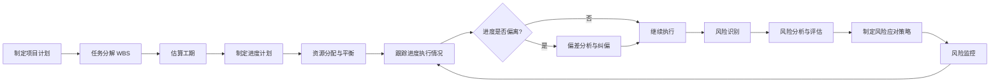

# 项目进度跟踪与风险管控原理与代码实战案例讲解

## 1. 背景介绍
### 1.1 项目管理的重要性
在现代商业环境中,项目管理已成为组织实现战略目标、提高竞争力的关键手段。高效的项目管理能够帮助企业在预算内按时交付高质量的项目成果,满足客户和相关方的期望。

### 1.2 项目进度与风险管理面临的挑战
然而,项目在执行过程中往往会遇到诸多不确定因素和风险事件,导致项目进度延迟,成本超支,质量下降等问题。如何有效跟踪项目进度,及时识别和应对潜在风险,是每个项目经理都必须面对的现实挑战。

### 1.3 项目管理工具与技术的发展
随着信息技术的快速发展,越来越多的项目管理软件和系统被开发出来,为项目经理提供了更加智能化、自动化的管理手段。利用这些工具,项目经理可以实时掌控项目动态,优化资源配置,提高项目管理的效率和效果。

## 2. 核心概念与联系
### 2.1 项目进度管理
项目进度管理是指在项目执行过程中,运用一系列的方法、工具和技术,对项目各项工作的完成情况进行监控,确保项目按照计划完成。其核心是通过测量实际进度与计划进度的偏差,及时采取纠偏措施,保证项目如期完成。

### 2.2 项目风险管理
项目风险管理是指在项目生命周期内,通过风险识别、风险分析、风险应对等一系列活动,最大限度地降低风险事件对项目目标的负面影响。风险管理贯穿项目全过程,需要项目团队保持高度的风险意识和快速响应能力。

### 2.3 进度与风险管理的关系
项目进度管理和风险管理是密不可分的。一方面,风险事件的发生往往会导致项目进度延迟;另一方面,进度延迟本身也是一种风险,会引发一系列连锁反应,影响项目的成本、质量等其他目标。因此,只有将进度管理和风险管理有机结合,才能实现项目管理的最优化。

### 2.4 管理过程概览
下图展示了项目进度跟踪与风险管控的主要环节和流程:



## 3. 核心算法原理具体操作步骤
### 3.1 关键路径法 CPM
关键路径法是项目进度管理的重要工具,通过分析项目网络图,识别出决定项目总工期的关键路径与关键活动,有助于优化资源配置,缩短工期。其基本步骤如下:

1. 将项目分解为多个任务活动
2. 估算每个活动的工期
3. 绘制项目网络图AON
4. 正向计算最早开始时间和最早完成时间
5. 逆向计算最晚开始时间和最晚完成时间
6. 计算每个活动的总时差和自由时差
7. 识别关键路径(总时差为0的路径)
8. 优化关键路径,缩短工期

### 3.2 挣值分析 EVA
挣值分析是通过比较已完成工作的预算成本与实际成本,评估项目进度和成本绩效的方法。通过计算一系列指标,可以量化项目进展情况,预测完工趋势。主要指标包括:

- PV 计划价值
- EV 挣值
- AC 实际成本
- SV 进度偏差
- SPI 进度绩效指数
- CV 成本偏差
- CPI 成本绩效指数

基本步骤如下:
1. 收集项目任务的 PV、EV 和 AC 数据
2. 计算进度偏差 SV = EV - PV
3. 计算进度绩效指数 SPI = EV / PV
4. 计算成本偏差 CV = EV - AC
5. 计算成本绩效指数 CPI = EV / AC
6. 分析偏差原因,采取纠偏措施
7. 预测完工趋势 EAC = BAC / CPI

### 3.3 蒙特卡洛模拟
蒙特卡洛模拟是一种基于概率统计的定量风险分析方法。通过构建风险模型,随机模拟大量可能情景,估算风险事件发生的概率及其影响。步骤如下:

1. 识别风险因素并估算概率分布
2. 构建风险分析模型
3. 设置模拟参数(如迭代次数)
4. 生成随机数,模拟各种情景
5. 统计模拟结果,分析风险概率和影响
6. 评估风险水平,制定应对策略

## 4. 数学模型和公式详细讲解举例说明
### 4.1 PERT 三点估算法
PERT 是一种估算单个活动工期的方法,综合考虑了乐观、悲观和最可能的三种情况,得出期望工期和标准差,用于测量与控制进度风险。

设 a 为乐观估计值,m 为最可能估计值,b 为悲观估计值,则:

期望工期:
$$
t_e = \frac{a + 4m + b}{6}
$$

标准差:
$$
\sigma = \frac{b - a}{6}
$$

变异系数:
$$
v = \frac{\sigma}{t_e}
$$

变异系数 v 越大,表明活动工期的不确定性越高,风险越大。

例如,某项目某项活动的乐观工期为 2 天,最可能工期为 4 天,悲观工期为 12 天,则:

$$
\begin{aligned}
t_e &= \frac{2 + 4 \times 4 + 12}{6} = 5 \\
\sigma &= \frac{12 - 2}{6} = 1.67 \\
v &= \frac{1.67}{5} = 0.33
\end{aligned}
$$

可见该活动的期望工期为 5 天,标准差为 1.67 天,变异系数为 0.33,风险较高,需要重点关注。

### 4.2 进度绩效指数 SPI
SPI 衡量项目实际进度与计划进度的偏离程度,反映了项目的进度绩效。

$$
SPI = \frac{EV}{PV}
$$

其中,EV 为挣值,PV 为计划价值。

当 $SPI = 1$ 时,表示进度与计划一致;
当 $SPI > 1$ 时,表示进度超前;
当 $SPI < 1$ 时,表示进度延迟。

例如,某项目第 6 周的 EV 为 120 万元,PV 为 100 万元,则:

$$
SPI_6 = \frac{120}{100} = 1.2
$$

可见该项目第 6 周的进度绩效指数为 1.2,进度超前 20%,进展良好。

### 4.3 完工估算 EAC
EAC 是根据当前进度绩效,预测完工成本的一种方法,常用的计算公式有:

假设后续执行绩效与当前一致:
$$
EAC = \frac{BAC}{CPI}
$$

假设后续执行绩效有所改善:
$$
EAC = AC + \frac{BAC - EV}{CPI \times SPI}
$$

其中,BAC 为完工预算,AC 为实际成本,CPI 为成本绩效指数,SPI 为进度绩效指数。

例如,某项目的 BAC 为 1000 万元,当前 AC 为 400 万元,EV 为 360 万元,则:

$$
\begin{aligned}
CPI &= \frac{360}{400} = 0.9 \\
SPI &= \frac{360}{400} = 0.9 \\
EAC_1 &= \frac{1000}{0.9} = 1111 \text{万元} \\
EAC_2 &= 400 + \frac{1000 - 360}{0.9 \times 0.9} = 1211 \text{万元}
\end{aligned}
$$

可见,假设后续绩效与当前一致,预计完工成本为 1111 万元;假设后续绩效有所改善,预计完工成本为 1211 万元。项目经理可据此调整资源投入,控制成本。

## 5. 项目实践:代码实例和详细解释说明
下面以 Python 代码为例,演示如何使用 `NetworkX` 库构建项目网络图,实现关键路径法。

```python
import networkx as nx
import matplotlib.pyplot as plt

# 定义 AON 网络图
G = nx.DiGraph()

# 添加活动节点和时间属性
G.add_node(1, duration=3)
G.add_node(2, duration=5)
G.add_node(3, duration=2)
G.add_node(4, duration=4)
G.add_node(5, duration=3)
G.add_node(6, duration=1)

# 添加活动之间的依赖关系
G.add_edge(1, 2)
G.add_edge(1, 3)
G.add_edge(2, 4)
G.add_edge(3, 4)
G.add_edge(3, 5)
G.add_edge(4, 6)
G.add_edge(5, 6)

# 绘制网络图
pos = nx.spring_layout(G)
nx.draw(G, pos, with_labels=True, node_size=800, alpha=0.5, node_color='lightblue')
node_labels = nx.get_node_attributes(G, 'duration')
nx.draw_networkx_labels(G, pos, labels=node_labels)

# 计算关键路径
path = nx.dag_longest_path(G)
path_edges = list(zip(path, path[1:]))
nx.draw_networkx_nodes(G, pos, nodelist=path, node_color='r')
nx.draw_networkx_edges(G, pos, edgelist=path_edges, edge_color='r', width=3)

plt.axis('off')
plt.show()

print(f"关键路径为: {' -> '.join(map(str, path))}")
print(f"项目工期为: {nx.dag_longest_path_length(G)} 天")
```

代码说明:

1. 导入 `networkx` 和 `matplotlib` 库,用于构建和可视化网络图。
2. 创建有向图 `G` 表示 AON 网络。
3. 使用 `add_node` 方法添加活动节点,并设置工期属性 `duration`。
4. 使用 `add_edge` 方法添加活动之间的依赖关系。
5. 使用 `spring_layout` 生成节点位置坐标,并用 `draw` 方法绘制网络图。
6. 使用 `get_node_attributes` 获取节点的工期属性,并用 `draw_networkx_labels` 绘制节点标签。
7. 调用 `dag_longest_path` 计算关键路径,并用红色突出显示关键活动。
8. 使用 `dag_longest_path_length` 计算项目总工期。

运行该代码,可得到项目网络图和关键路径,如下图所示:


输出结果为:
```
关键路径为: 1 -> 3 -> 5 -> 6
项目工期为: 9 天
```

可见,该项目的关键路径为 1 -> 3 -> 5 -> 6,总工期为 9 天。项目经理应重点关注这条路径上的活动,优化资源配置,确保不发生延期。

## 6. 实际应用场景
项目进度跟踪与风险管控在各行各业的项目管理实践中广泛应用,如:

- IT 软件开发项目:通过 WBS 分解任务,估算工期,跟踪开发进度和代码质量,识别技术难点和需求变更风险,及时调整人员和排期。

- 建筑工程项目:运用网络图和甘特图,优化施工顺序,平衡资源负荷,实时监控现场进度,评估天气、安全等风险因素,动态调整计划。

- 新产品研发项目:采用阶段评审和质量门控,跟踪设计、测试等里程碑,分析试验数据和用户反馈,应对技术路线变更和产品缺