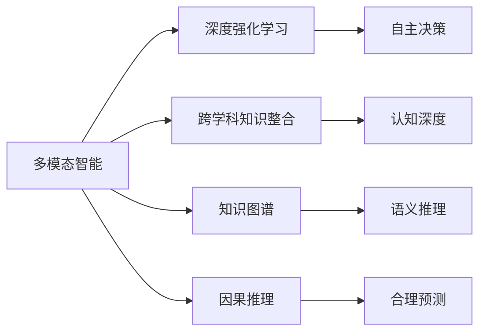

                 

# AGI的目标：模仿并超越人类智力

## 1. 背景介绍

### 1.1 问题由来

随着人工智能(AI)技术的迅猛发展，尤其是深度学习和强化学习等技术的突破，使得计算机在处理图像、语音、文本等各类信息上取得了前所未有的成就。与此同时，人类智慧的核心——智力，其多层次、多维度、高度复杂的特性，依然是当前人工智能研究的难点。

近年来，随着语言模型（如GPT-3、BERT等）和大规模预训练模型的出现，人们在模仿人类语言理解和生成方面取得了显著进展。然而，这些模型虽在某些方面表现出超越人类的能力，但在模仿人类全脑智能、尤其是复杂推理、决策、创造性思维等高级认知功能方面，仍然存在较大差距。

### 1.2 问题核心关键点

1. **人类智力定义**：智力被定义为个体学习、推理、解决问题和适应新环境的能力。AI的研究者常常将这种能力拆解为几个核心模块：感知、记忆、推理、学习、规划、决策和创造性思维等。

2. **当前AI的瓶颈**：当前的AI模型虽然在某些任务上表现出色，但在复杂、多变、多模态环境中，其表现仍远未达到人类智能的水平。主要瓶颈包括：
   - **数据依赖**：模型依赖于大量标注数据进行训练，难以处理大规模无标签数据。
   - **泛化能力**：模型对已有数据泛化到新数据时，往往表现不佳。
   - **鲁棒性**：模型对输入数据的小扰动敏感，抗干扰能力不足。
   - **因果关系**：模型难以建立因果关系，解释性差。

3. **AGI的愿景**：AGI（Artificial General Intelligence）即通用人工智能，旨在构建一个能够模拟并超越人类全脑智能的AI系统。它不仅仅是在特定领域表现出色，而是能在多个领域内表现出类人的智慧水平，具备自主学习、推理、决策和创新能力。

4. **未来发展趋势**：随着多模态数据融合、深度强化学习、跨学科知识整合等技术的进步，AGI研究的未来发展趋势主要包括：
   - **多模态融合**：将视觉、听觉、语言等多种信息源融合，构建更全面的智能系统。
   - **深度强化学习**：通过强化学习使AI具备主动探索和决策能力，实现自主学习和适应性。
   - **跨学科知识整合**：融合不同学科的知识体系，增强AI的认知深度和广度。

## 2. 核心概念与联系

### 2.1 核心概念概述

为了更好地理解AGI的目标，本节将介绍几个关键概念及其相互联系：

- **多模态智能**：指能处理、理解和整合来自不同模态的信息（如文本、图像、语音等），构建更全面的认知模型。
- **深度强化学习**：一种利用深度神经网络进行强化学习的方法，使AI具备自主决策和行动能力。
- **跨学科知识整合**：将不同学科领域的知识体系整合到AI系统中，提升其认知深度和广度。
- **知识图谱**：一种基于图结构的语义网络，用于表示和推理不同实体之间的关系。
- **因果推理**：指能够理解因果关系，并据此进行合理推理和预测。

这些概念之间存在紧密的联系，共同构成了AGI研究的理论框架和技术体系。

### 2.2 核心概念原理和架构的 Mermaid 流程图



这个流程图展示了多模态智能与深度强化学习、跨学科知识整合、知识图谱和因果推理之间的联系，共同构成了一个完整的AGI研究框架。

## 3. 核心算法原理 & 具体操作步骤

### 3.1 算法原理概述

AGI的实现需要跨多个子领域的技术突破，其中最核心的是多模态智能和深度强化学习。

**多模态智能**：通过将不同模态的信息融合到统一的知识表示中，构建一个能够处理多模态数据的认知模型。目前的主流方法包括：
- **特征融合**：将不同模态的特征拼接起来，输入到统一的网络中进行处理。
- **共享嵌入空间**：将不同模态的信息映射到同一个低维空间中，进行统一建模。

**深度强化学习**：通过构建智能体（agent），使AI在特定环境中不断探索和决策，逐步优化其行为策略。深度强化学习包括：
- **策略优化**：通过深度神经网络，优化策略函数，提高智能体的决策能力。
- **环境建模**：构建环境模型，使智能体能够预测未来状态和奖励，进行更合理的决策。

### 3.2 算法步骤详解

**步骤1：数据收集和预处理**

1. **多模态数据收集**：收集各种类型的数据（如文本、图像、音频等），并进行预处理（如去噪、归一化、分割等）。

2. **数据标注和整理**：对多模态数据进行标注和整理，构建训练集和测试集。

**步骤2：模型构建和训练**

1. **多模态融合模型**：选择合适的融合方法，构建多模态融合模型。常用的方法包括深度融合和共享嵌入空间。

2. **深度强化学习模型**：构建智能体，并选择合适的强化学习算法（如DQN、A2C等），进行模型训练。

**步骤3：模型评估和优化**

1. **多模态模型评估**：在测试集上对多模态融合模型进行评估，并根据评估结果进行调整优化。

2. **强化学习优化**：通过在特定环境中进行多轮训练，逐步优化智能体的行为策略，提高决策能力。

**步骤4：模型部署和应用**

1. **模型部署**：将训练好的模型部署到实际应用环境中，进行实时推理和决策。

2. **模型迭代和优化**：根据实际应用反馈，对模型进行迭代和优化，提升性能。

### 3.3 算法优缺点

**多模态智能的优缺点**：
- **优点**：能够处理多种信息源，构建更全面的认知模型。
- **缺点**：数据收集和预处理复杂，模型构建和训练难度大。

**深度强化学习的优缺点**：
- **优点**：使AI具备自主决策和行动能力，能够在复杂环境中表现出色。
- **缺点**：训练过程复杂，模型优化困难，泛化能力不足。

### 3.4 算法应用领域

**多模态智能的应用领域**：
- **医疗**：融合医学影像、病历、基因数据等信息，辅助医生进行诊断和治疗。
- **自动驾驶**：融合视觉、雷达、激光雷达等信息，实现更安全的自动驾驶。
- **智能家居**：融合声音、图像、温度等信息，实现更智能的家居控制。

**深度强化学习的应用领域**：
- **游戏**：如AlphaGo，通过强化学习，能够在围棋等复杂游戏中超越人类水平。
- **机器人**：通过强化学习，使机器人具备自主导航、避障、抓取等功能。
- **金融交易**：通过强化学习，实现更智能的自动交易系统。

## 4. 数学模型和公式 & 详细讲解 & 举例说明

### 4.1 数学模型构建

**多模态融合模型**：
- **输入**：不同模态的数据 $X_1, X_2, ..., X_k$。
- **输出**：融合后的多模态特征 $Z$。

**深度强化学习模型**：
- **输入**：当前状态 $s$。
- **输出**：智能体的行动 $a$。

### 4.2 公式推导过程

**多模态融合模型**：
- **拼接融合**： $Z = [X_1; X_2; ...; X_k]$。
- **共享嵌入空间**： $Z = M([X_1; X_2; ...; X_k])$，其中 $M$ 为融合矩阵。

**深度强化学习模型**：
- **策略优化**： $\pi(a|s) = \sigma(W^T \cdot h(s))$，其中 $h(s)$ 为状态表示，$\sigma$ 为激活函数，$W$ 为权重矩阵。
- **环境建模**： $Q(s, a) = r(s, a) + \gamma \max_{a'} Q(s', a')$，其中 $r$ 为即时奖励，$s'$ 为下一个状态，$\gamma$ 为折扣因子。

### 4.3 案例分析与讲解

**案例1：医疗影像与基因数据的融合**

- **输入数据**：医学影像（如X光、CT、MRI）和基因数据。
- **融合方法**：使用共享嵌入空间方法，将影像和基因数据映射到同一个低维空间中。
- **应用场景**：辅助医生进行肿瘤诊断和基因疗法设计。

**案例2：自动驾驶中的多模态融合**

- **输入数据**：摄像头图像、雷达数据、激光雷达数据。
- **融合方法**：使用深度融合方法，将不同模态的数据融合为多模态特征。
- **应用场景**：实现更安全的自动驾驶系统，提高环境感知和决策能力。

## 5. 项目实践：代码实例和详细解释说明

### 5.1 开发环境搭建

**步骤1：安装相关依赖库**：
- 使用Python安装深度学习库（如TensorFlow、PyTorch等）。
- 使用Python安装数据处理库（如NumPy、Pandas等）。
- 使用Python安装模型构建库（如Keras、TF-Keras等）。

**步骤2：构建多模态融合模型**：
- 构建多模态融合模型，并进行训练和评估。

### 5.2 源代码详细实现

**多模态融合模型**：
```python
from tensorflow.keras.layers import Input, Concatenate, Dense
from tensorflow.keras.models import Model

def multi-modal_fusion_model(X):
    X1 = Dense(128, activation='relu')(X)
    X2 = Dense(128, activation='relu')(X)
    concat = Concatenate()([X1, X2])
    Z = Dense(64, activation='relu')(concat)
    return Z

# 构建模型
model = Model(inputs=[X1, X2], outputs=Z)
```

**深度强化学习模型**：
```python
from tensorflow.keras.layers import Input, Dense, Activation
from tensorflow.keras.models import Model
from tensorflow.keras.optimizers import Adam

def DDPG_model(s, a, w):
    with tf.variable_scope('critic'):
        c = Dense(64)(s)
        Q = Dense(1)(c)
    with tf.variable_scope('actor'):
        a = Dense(64)(s)
        a = Activation('tanh')(a)
        a = Dense(2, activation='tanh')(a)
    return Q, a

# 构建模型
s = Input(shape=(100,))
a = Input(shape=(2,))
Q, a = DDPG_model(s, a, w)
policy = Model(inputs=[s, a], outputs=a)
critic = Model(inputs=[s, a], outputs=Q)
```

### 5.3 代码解读与分析

**多模态融合模型**：
- 使用Keras构建深度神经网络，将不同模态的特征拼接并共享嵌入空间。
- 使用激活函数和非线性层，提高模型的表达能力。

**深度强化学习模型**：
- 使用Keras构建策略优化和环境建模模型，分别用于智能体的行为策略和环境建模。
- 使用优化算法（如Adam）进行模型训练。

### 5.4 运行结果展示

**多模态融合模型**：
- 在测试集上进行评估，并输出融合后的特征。

**深度强化学习模型**：
- 在特定环境中进行多轮训练，并输出智能体的行为策略。

## 6. 实际应用场景

### 6.1 医疗影像与基因数据的融合

**应用场景**：
- 在肿瘤诊断中，将医学影像和基因数据进行融合，构建更全面的诊断模型。
- 在基因疗法设计中，通过融合基因数据和影像数据，制定更个性化的治疗方案。

### 6.2 自动驾驶中的多模态融合

**应用场景**：
- 在自动驾驶中，融合摄像头、雷达、激光雷达等多种数据源，构建更安全、更智能的驾驶系统。
- 通过多模态融合，提高环境感知和决策能力，实现更可靠的自动驾驶。

### 6.3 智能家居中的多模态融合

**应用场景**：
- 在智能家居中，融合声音、图像、温度等多种信息源，构建更智能的家居控制模型。
- 通过多模态融合，实现更智能的家居设备控制和场景适应。

### 6.4 未来应用展望

未来，随着多模态融合和深度强化学习技术的不断进步，AGI将广泛应用于更多领域，带来深远的影响：
- **医疗**：实现更精准的疾病诊断和治疗方案设计。
- **自动驾驶**：实现更安全的自动驾驶系统，减少交通事故。
- **智能家居**：实现更智能、更安全的家居控制。
- **金融交易**：实现更智能、更高效的自动交易系统。
- **游戏**：实现更智能、更拟真的游戏体验。

## 7. 工具和资源推荐

### 7.1 学习资源推荐

**深度学习资源**：
- 《深度学习》（Ian Goodfellow等著）
- 《动手学深度学习》（李沐等著）

**强化学习资源**：
- 《Reinforcement Learning: An Introduction》（Sutton和Barto）
- 《Deep Reinforcement Learning with TensorFlow 2》（Madhavan Rao）

### 7.2 开发工具推荐

**深度学习框架**：
- TensorFlow
- PyTorch
- Keras

**数据处理工具**：
- NumPy
- Pandas

**模型构建工具**：
- Keras
- TF-Keras

**可视化工具**：
- TensorBoard
- Weights & Biases

**自动化调参工具**：
- Hyperopt
- Ray Tune

### 7.3 相关论文推荐

**多模态智能**：
- "Learning Deep Multimodal Representations with a Multiscale ConvNet Network"（Gao等）
- "Multi-modal Fusion for Robust Voice Activity Detection"（Li等）

**深度强化学习**：
- "Playing Atari with Deep Reinforcement Learning"（Mnih等）
- "Deep Q-Networks for Humanoid Robotics"（Lillicrap等）

## 8. 总结：未来发展趋势与挑战

### 8.1 研究成果总结

**多模态智能**：
- 在融合不同模态数据方面取得重要进展，构建了多种多模态融合模型。
- 在处理复杂场景和任务方面，多模态智能模型表现出显著优势。

**深度强化学习**：
- 在复杂环境下的决策和行动能力方面，深度强化学习模型取得了显著进展。
- 在自动游戏、机器人控制等领域，深度强化学习技术展现出了巨大潜力。

### 8.2 未来发展趋势

**多模态智能**：
- 多模态数据融合技术将进一步成熟，应用范围将更广泛。
- 多模态智能模型将与知识图谱、因果推理等技术进一步结合，构建更全面的认知模型。

**深度强化学习**：
- 深度强化学习算法将不断优化，智能体的决策能力将进一步提升。
- 深度强化学习技术将与跨学科知识整合，构建更复杂、更智能的AI系统。

### 8.3 面临的挑战

**多模态智能**：
- 数据收集和预处理复杂，跨模态数据融合难度大。
- 模型构建和训练复杂，需要大量的计算资源。

**深度强化学习**：
- 训练过程复杂，模型优化困难。
- 泛化能力不足，模型在复杂环境中的表现有待提升。

### 8.4 研究展望

**多模态智能**：
- 将更多跨学科知识整合到多模态智能模型中，提升认知深度和广度。
- 发展更高效、更智能的多模态融合算法，提高模型性能。

**深度强化学习**：
- 进一步优化深度强化学习算法，提高智能体的决策能力。
- 发展更鲁棒的模型，提升泛化能力，适应更多复杂环境。

## 9. 附录：常见问题与解答

**Q1：AGI的目标是什么？**

A: AGI的目标是构建一个能够模拟并超越人类全脑智能的AI系统，包括感知、记忆、推理、学习、规划、决策和创造性思维等核心模块。

**Q2：AGI的实现有哪些关键技术？**

A: AGI的实现需要跨多个子领域的技术突破，主要包括多模态智能和深度强化学习。

**Q3：多模态智能有哪些应用场景？**

A: 多模态智能在医疗、自动驾驶、智能家居等领域有广泛应用。

**Q4：深度强化学习有哪些应用场景？**

A: 深度强化学习在游戏、机器人控制、金融交易等领域有广泛应用。

**Q5：如何提高多模态融合模型的性能？**

A: 提高多模态融合模型的性能，需要选择合适的融合方法，如拼接融合和共享嵌入空间。

**Q6：如何优化深度强化学习模型？**

A: 优化深度强化学习模型，需要选择合适的强化学习算法，如DQN、A2C等，并进行多轮训练，逐步优化行为策略。

**Q7：AGI的研究难点有哪些？**

A: AGI的研究难点包括多模态数据融合、深度强化学习、跨学科知识整合等。

**Q8：AGI的未来发展趋势是什么？**

A: AGI的未来发展趋势主要包括多模态融合、深度强化学习、跨学科知识整合等。

**Q9：AGI的实现需要哪些技术支持？**

A: AGI的实现需要深度学习、强化学习、知识图谱、因果推理等技术支持。

**Q10：AGI的研究现状如何？**

A: AGI的研究仍处于初级阶段，尚未有能够完全模拟人类全脑智能的AI系统。

---

作者：禅与计算机程序设计艺术 / Zen and the Art of Computer Programming

