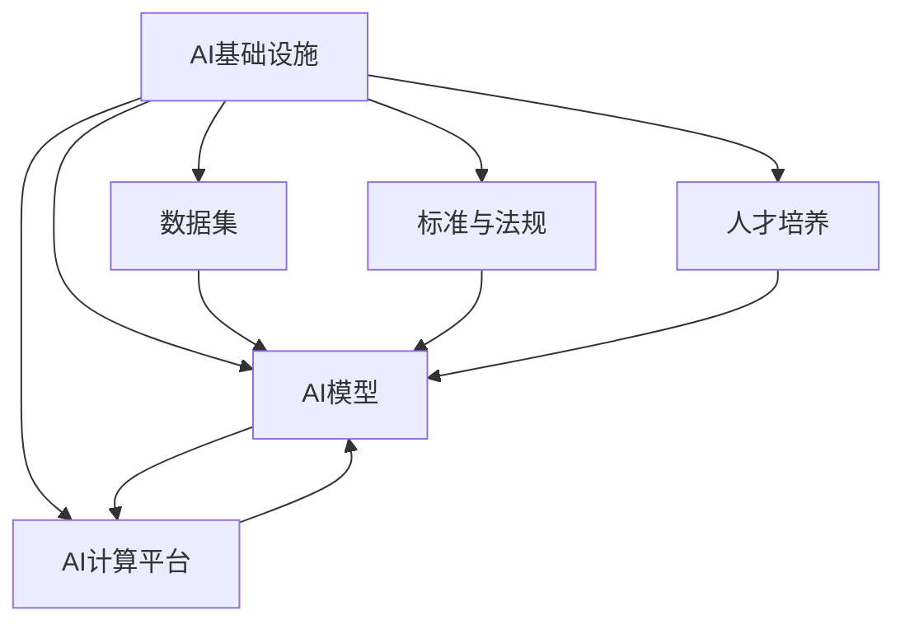

                 

# AI 2.0 基础设施建设：全球合作与竞争

在人工智能（AI）领域，基础设施的建设是一个复杂而宏大的话题，它不仅关乎技术进步，也关乎全球范围内的合作与竞争。AI 2.0，即新一代人工智能，正处于快速发展之中，它的基础设施建设成为推动AI技术创新的关键。本文将从背景介绍、核心概念与联系、核心算法原理与操作步骤、数学模型和公式、项目实践、实际应用场景、工具和资源推荐、总结未来发展趋势与挑战、以及附录等维度，全面探讨AI 2.0基础设施建设的全球合作与竞争。

## 1. 背景介绍

### 1.1 问题由来

AI 2.0时代，人工智能技术已经从科学研究转向了实际应用，人工智能基础设施建设成为了技术创新的关键。AI 2.0基础设施不仅包括数据、计算资源和算法，还包括标准和法规、人才培养等多方面的内容。全球范围内，各国和组织在AI基础设施建设上展开了激烈的竞争与合作，推动着AI技术的快速发展和广泛应用。

### 1.2 问题核心关键点

AI 2.0基础设施建设的核心关键点在于以下几个方面：

1. **数据获取与处理**：数据是AI模型的基础，高质量、大规模的数据获取与处理对于模型训练和应用至关重要。
2. **计算资源**：强大的计算能力是支持大规模AI模型训练和推理的必要条件。
3. **算法与模型**：高效的算法和模型架构是提升AI系统性能的核心。
4. **标准与法规**：AI技术的标准和法规建设对于推动AI技术的健康发展具有重要意义。
5. **人才培养**：AI人才的培养和引进是推动AI技术发展的关键因素。

这些关键点共同构成了AI 2.0基础设施建设的主要内容，每个方面都影响着AI技术的全球竞争与合作格局。

## 2. 核心概念与联系

### 2.1 核心概念概述

为了更好地理解AI 2.0基础设施建设的全球合作与竞争，我们需要明确几个核心概念及其相互联系：

1. **AI基础设施**：包括数据、计算资源、算法、标准与法规、人才培养等多个方面，是支持AI技术发展的物质和精神基础。
2. **AI模型**：如深度学习模型、知识图谱、自然语言处理模型等，是AI基础设施的重要组成部分。
3. **AI计算平台**：如云平台、超级计算机、边缘计算设备等，提供高效的计算能力和资源管理。
4. **数据集**：如公开数据集、企业内部数据、私有数据等，是训练AI模型的基础。
5. **标准与法规**：如数据隐私、模型透明性、算法偏见等，规范AI技术的开发与应用。
6. **人才培养**：如AI教育、实习、研究等，为AI技术的发展提供人才支持。

这些核心概念之间的逻辑关系可以通过以下Mermaid流程图来展示：



这个流程图展示了AI基础设施与AI模型、AI计算平台、数据集、标准与法规、人才培养之间的逻辑关系：

1. AI基础设施为AI模型的训练和应用提供了必要的基础资源。
2. AI计算平台和数据集是AI基础设施的重要组成部分。
3. 标准与法规和人才培养则从外部环境和技术人才两个维度支持AI基础设施的建设。
4. AI模型是基础设施和平台的核心应用对象。

## 3. 核心算法原理 & 具体操作步骤

### 3.1 算法原理概述

AI 2.0基础设施建设的算法原理主要围绕以下几个方面展开：

1. **数据获取与预处理**：通过爬虫、API接口等手段获取数据，并进行清洗、标注等预处理。
2. **模型训练与优化**：使用深度学习框架（如TensorFlow、PyTorch等）对AI模型进行训练和优化。
3. **分布式计算**：利用分布式计算框架（如Hadoop、Spark等）进行大规模数据和模型的训练。
4. **模型部署与维护**：将训练好的模型部署到生产环境，并进行定期更新和维护。
5. **标准与法规制定**：制定数据隐私、算法透明性等标准和法规，保障AI技术的健康发展。

这些原理构成了AI 2.0基础设施建设的基础，各部分紧密合作，共同推动AI技术的创新与应用。

### 3.2 算法步骤详解

以下是AI 2.0基础设施建设的详细步骤：

1. **数据获取与预处理**：
   - 使用爬虫技术从互联网上获取数据。
   - 通过API接口获取企业内部数据。
   - 对数据进行清洗、去重、标注等预处理，确保数据质量。
   
2. **模型训练与优化**：
   - 使用深度学习框架搭建AI模型，如卷积神经网络（CNN）、循环神经网络（RNN）、Transformer等。
   - 通过随机梯度下降（SGD）、Adam等优化算法对模型进行训练。
   - 使用正则化技术（如L2正则化）防止过拟合。
   
3. **分布式计算**：
   - 将数据和模型分布到多台计算节点上。
   - 使用Hadoop、Spark等分布式计算框架进行并行计算。
   - 使用Flink、Storm等流计算框架处理实时数据。
   
4. **模型部署与维护**：
   - 将训练好的模型部署到云平台或本地服务器。
   - 使用TensorFlow Serving、TorchServe等框架进行模型服务化。
   - 对模型进行定期更新和维护，确保模型性能和数据一致性。
   
5. **标准与法规制定**：
   - 制定数据隐私保护标准，如GDPR、CCPA等。
   - 制定算法透明性和公平性标准，如模型解释性、偏见检测等。
   
这些步骤共同构成了AI 2.0基础设施建设的完整流程，每个步骤都是技术创新和应用的基础。

### 3.3 算法优缺点

AI 2.0基础设施建设的算法具有以下优点：

1. **高效性**：通过分布式计算和高效的优化算法，可以大幅提升模型训练和推理的速度。
2. **可扩展性**：基于云计算和分布式计算平台，可以灵活扩展计算资源，支持大规模数据和模型的处理。
3. **灵活性**：通过开放API和标准接口，可以方便地与其他系统集成，支持多种应用场景。

同时，该算法也存在一些缺点：

1. **资源消耗大**：大规模数据和模型的训练需要大量的计算资源，增加了硬件成本和能耗。
2. **数据隐私风险**：在数据获取和处理过程中，存在数据泄露和隐私保护的风险。
3. **技术门槛高**：算法实现和基础设施建设需要较高的技术门槛，对人才和技术资源有较高要求。

### 3.4 算法应用领域

AI 2.0基础设施建设的算法在多个领域得到了广泛应用：

1. **自然语言处理（NLP）**：如文本分类、情感分析、机器翻译、问答系统等。
2. **计算机视觉（CV）**：如图像识别、目标检测、图像生成等。
3. **推荐系统**：如电商推荐、内容推荐、广告推荐等。
4. **医疗健康**：如疾病诊断、影像分析、智能问诊等。
5. **金融科技**：如风险评估、信用评分、金融产品推荐等。
6. **智能制造**：如工业预测、设备维护、质量控制等。
7. **智慧城市**：如交通管理、环境监测、智能安防等。

这些应用领域展示了AI 2.0基础设施建设的广泛应用，为各行各业带来了显著的技术和业务价值。

## 4. 数学模型和公式 & 详细讲解 & 举例说明

### 4.1 数学模型构建

为了更好地理解AI 2.0基础设施建设的数学模型和公式，我们以卷积神经网络（CNN）为例，构建一个简单的数学模型。

设CNN模型包含$N$个卷积层和$M$个全连接层。输入数据为$X \in \mathbb{R}^{H \times W \times C}$，其中$H$、$W$、$C$分别为输入数据的高度、宽度和通道数。输出数据为$Y \in \mathbb{R}^{1 \times 1 \times K}$，其中$K$为输出特征的数量。

### 4.2 公式推导过程

CNN模型的前向传播过程可以表示为：

$$
Y = f(Conv(\ldots, Conv(Conv(X; W^{(1)}; b^{(1)}); W^{(2)}; b^{(2)}); \ldots, W^{(N)}; b^{(N)}); W^{(M)}; b^{(M)})
$$

其中，$Conv$表示卷积操作，$W$表示卷积核，$b$表示偏置项，$f$表示激活函数（如ReLU、Sigmoid等）。

### 4.3 案例分析与讲解

以图像分类为例，CNN模型通过卷积层提取图像的局部特征，然后通过池化层降低特征维度，最后通过全连接层进行分类。具体实现如下：

1. **卷积层**：使用$3 \times 3$的卷积核，步长为$1$，无填充。
2. **激活函数**：使用ReLU激活函数。
3. **池化层**：使用$2 \times 2$的最大池化操作，步长为$2$。
4. **全连接层**：使用Softmax激活函数进行分类。

假设输入图像为$X \in \mathbb{R}^{28 \times 28 \times 1}$，输出类别数为$K=10$。模型的参数包括$N=2$个卷积层的卷积核$W^{(1)} \in \mathbb{R}^{3 \times 3 \times 1 \times C}$、偏置项$b^{(1)} \in \mathbb{R}^{1 \times 1 \times C}$，以及全连接层的权重$W^{(M)} \in \mathbb{R}^{K \times F}$和偏置项$b^{(M)} \in \mathbb{R}^{K}$。其中$C=1$，$F=784$。

通过上述公式，CNN模型可以完成图像分类任务。在实际应用中，需要根据具体任务调整模型结构和超参数，以获得更好的性能。

## 5. 项目实践：代码实例和详细解释说明

### 5.1 开发环境搭建

在进行AI 2.0基础设施建设的实践时，我们需要准备好开发环境。以下是使用Python进行TensorFlow开发的环境配置流程：

1. 安装Anaconda：从官网下载并安装Anaconda，用于创建独立的Python环境。

2. 创建并激活虚拟环境：
```bash
conda create -n tf-env python=3.8 
conda activate tf-env
```

3. 安装TensorFlow：根据CUDA版本，从官网获取对应的安装命令。例如：
```bash
pip install tensorflow==2.5.0
```

4. 安装TensorBoard：
```bash
pip install tensorboard
```

5. 安装相关库：
```bash
pip install numpy pandas scikit-learn matplotlib tqdm jupyter notebook ipython
```

完成上述步骤后，即可在`tf-env`环境中开始AI 2.0基础设施建设的实践。

### 5.2 源代码详细实现

下面我们以图像分类为例，给出使用TensorFlow进行卷积神经网络（CNN）模型训练的PyTorch代码实现。

```python
import tensorflow as tf
from tensorflow import keras
import numpy as np
import matplotlib.pyplot as plt

# 加载数据集
(x_train, y_train), (x_test, y_test) = keras.datasets.mnist.load_data()

# 数据预处理
x_train = x_train / 255.0
x_test = x_test / 255.0
x_train = np.expand_dims(x_train, axis=-1)
x_test = np.expand_dims(x_test, axis=-1)

# 构建模型
model = keras.Sequential([
    keras.layers.Conv2D(32, (3, 3), activation='relu', input_shape=(28, 28, 1)),
    keras.layers.MaxPooling2D((2, 2)),
    keras.layers.Flatten(),
    keras.layers.Dense(128, activation='relu'),
    keras.layers.Dense(10, activation='softmax')
])

# 编译模型
model.compile(optimizer='adam', loss='sparse_categorical_crossentropy', metrics=['accuracy'])

# 训练模型
model.fit(x_train, y_train, epochs=10, validation_data=(x_test, y_test))

# 评估模型
test_loss, test_acc = model.evaluate(x_test, y_test, verbose=2)
print('Test accuracy:', test_acc)
```

以上就是使用TensorFlow进行卷积神经网络模型训练的完整代码实现。可以看到，TensorFlow提供了丰富的API和工具，使得模型的构建和训练变得简洁高效。

### 5.3 代码解读与分析

让我们再详细解读一下关键代码的实现细节：

**数据加载与预处理**：
- `keras.datasets.mnist.load_data()`：加载MNIST手写数字数据集。
- `x_train = x_train / 255.0`：将像素值归一化到[0,1]之间。
- `x_train = np.expand_dims(x_train, axis=-1)`：将输入数据转换为3D张量。

**模型构建**：
- `keras.layers.Conv2D(32, (3, 3), activation='relu', input_shape=(28, 28, 1))`：添加一个卷积层，32个$3 \times 3$的卷积核，ReLU激活函数。
- `keras.layers.MaxPooling2D((2, 2))`：添加一个最大池化层，池化窗口为$2 \times 2$。
- `keras.layers.Flatten()`：将池化后的输出展平。
- `keras.layers.Dense(128, activation='relu')`：添加一个全连接层，128个神经元，ReLU激活函数。
- `keras.layers.Dense(10, activation='softmax')`：添加一个全连接层，10个神经元，softmax激活函数。

**模型编译与训练**：
- `model.compile(optimizer='adam', loss='sparse_categorical_crossentropy', metrics=['accuracy'])`：编译模型，使用Adam优化器，交叉熵损失函数，准确率作为评估指标。
- `model.fit(x_train, y_train, epochs=10, validation_data=(x_test, y_test))`：训练模型，使用10个epochs，验证集为测试集。

**模型评估**：
- `test_loss, test_acc = model.evaluate(x_test, y_test, verbose=2)`：评估模型，返回测试集上的损失和准确率。

可以看到，TensorFlow提供的高层次API使得模型的构建和训练变得非常简单，开发者可以专注于核心算法和业务逻辑的实现。

## 6. 实际应用场景

### 6.1 智能客服系统

基于AI 2.0基础设施建设的智能客服系统，可以为用户提供7x24小时不间断服务。系统通过自然语言处理（NLP）技术，理解用户意图，匹配最佳答复，进行智能对话。

在技术实现上，可以收集企业内部的历史客服对话记录，将问题和最佳答复构建成监督数据，在此基础上对预训练模型进行微调。微调后的模型能够自动理解用户意图，匹配最合适的答案模板进行回复。对于客户提出的新问题，还可以接入检索系统实时搜索相关内容，动态组织生成回答。如此构建的智能客服系统，能大幅提升客户咨询体验和问题解决效率。

### 6.2 金融舆情监测

金融机构需要实时监测市场舆论动向，以便及时应对负面信息传播，规避金融风险。传统的人工监测方式成本高、效率低，难以应对网络时代海量信息爆发的挑战。基于AI 2.0基础设施建设的文本分类和情感分析技术，为金融舆情监测提供了新的解决方案。

具体而言，可以收集金融领域相关的新闻、报道、评论等文本数据，并对其进行主题标注和情感标注。在此基础上对预训练语言模型进行微调，使其能够自动判断文本属于何种主题，情感倾向是正面、中性还是负面。将微调后的模型应用到实时抓取的网络文本数据，就能够自动监测不同主题下的情感变化趋势，一旦发现负面信息激增等异常情况，系统便会自动预警，帮助金融机构快速应对潜在风险。

### 6.3 个性化推荐系统

当前的推荐系统往往只依赖用户的历史行为数据进行物品推荐，无法深入理解用户的真实兴趣偏好。基于AI 2.0基础设施建设的个性化推荐系统，可以更好地挖掘用户行为背后的语义信息，从而提供更精准、多样的推荐内容。

在实践中，可以收集用户浏览、点击、评论、分享等行为数据，提取和用户交互的物品标题、描述、标签等文本内容。将文本内容作为模型输入，用户的后续行为（如是否点击、购买等）作为监督信号，在此基础上微调预训练语言模型。微调后的模型能够从文本内容中准确把握用户的兴趣点。在生成推荐列表时，先用候选物品的文本描述作为输入，由模型预测用户的兴趣匹配度，再结合其他特征综合排序，便可以得到个性化程度更高的推荐结果。

### 6.4 未来应用展望

随着AI 2.0基础设施建设的不断推进，基于此的AI技术将在更多领域得到应用，为传统行业带来变革性影响。

在智慧医疗领域，基于AI 2.0基础设施建设的医疗问答、病历分析、药物研发等应用将提升医疗服务的智能化水平，辅助医生诊疗，加速新药开发进程。

在智能教育领域，微调技术可应用于作业批改、学情分析、知识推荐等方面，因材施教，促进教育公平，提高教学质量。

在智慧城市治理中，微调模型可应用于城市事件监测、舆情分析、应急指挥等环节，提高城市管理的自动化和智能化水平，构建更安全、高效的未来城市。

此外，在企业生产、社会治理、文娱传媒等众多领域，基于AI 2.0基础设施建设的AI应用也将不断涌现，为经济社会发展注入新的动力。相信随着预训练模型和微调方法的不断进步，AI 2.0基础设施建设的未来前景将更加广阔，AI技术也将在大规模落地应用中迎来新的发展机遇。

## 7. 工具和资源推荐

### 7.1 学习资源推荐

为了帮助开发者系统掌握AI 2.0基础设施建设的理论基础和实践技巧，这里推荐一些优质的学习资源：

1. 《深度学习》（Ian Goodfellow等著）：深度学习领域的经典教材，系统介绍了深度学习的理论基础和实现方法。
2. 《TensorFlow实战》（Fan Yang等著）：TensorFlow官方文档的实战版，通过实际案例讲解TensorFlow的API和应用场景。
3. 《PyTorch深度学习实践》（Francois Chollet等著）：PyTorch官方文档的实战版，通过案例讲解PyTorch的API和应用场景。
4. 《机器学习实战》（Peter Harrington著）：通过实际案例讲解机器学习算法的实现和应用。
5. 《Python深度学习》（Francois Chollet著）：深度学习基础与实践的结合，通过Python代码实现深度学习算法。

通过对这些资源的学习实践，相信你一定能够快速掌握AI 2.0基础设施建设的核心技术和应用方法。

### 7.2 开发工具推荐

高效的开发离不开优秀的工具支持。以下是几款用于AI 2.0基础设施建设的常用工具：

1. PyTorch：基于Python的开源深度学习框架，灵活动态的计算图，适合快速迭代研究。大部分预训练语言模型都有PyTorch版本的实现。
2. TensorFlow：由Google主导开发的开源深度学习框架，生产部署方便，适合大规模工程应用。同样有丰富的预训练语言模型资源。
3. Weights & Biases：模型训练的实验跟踪工具，可以记录和可视化模型训练过程中的各项指标，方便对比和调优。与主流深度学习框架无缝集成。
4. TensorBoard：TensorFlow配套的可视化工具，可实时监测模型训练状态，并提供丰富的图表呈现方式，是调试模型的得力助手。
5. Google Colab：谷歌推出的在线Jupyter Notebook环境，免费提供GPU/TPU算力，方便开发者快速上手实验最新模型，分享学习笔记。

合理利用这些工具，可以显著提升AI 2.0基础设施建设的开发效率，加快创新迭代的步伐。

### 7.3 相关论文推荐

AI 2.0基础设施建设的理论和技术不断发展，以下是几篇奠基性的相关论文，推荐阅读：

1. ImageNet classification with deep convolutional neural networks（AlexNet论文）：提出了卷积神经网络（CNN），为图像分类任务提供了重要基础。
2. Deep residual learning for image recognition（ResNet论文）：提出了残差网络（ResNet），大幅提升了深度神经网络的训练和泛化能力。
3. Natural Language Processing with Transformers（Transformer论文）：提出了Transformer模型，开创了大规模预训练语言模型的先河。
4. BERT: Pre-training of Deep Bidirectional Transformers for Language Understanding（BERT论文）：提出了BERT模型，引入了基于掩码的自监督预训练任务，刷新了多项NLP任务SOTA。
5. GPT-3: Language Models are Unsupervised Multitask Learners（GPT-2论文）：展示了大语言模型的强大zero-shot学习能力，引发了对于通用人工智能的新一轮思考。

这些论文代表了大规模预训练语言模型的发展脉络，为AI 2.0基础设施建设的理论和技术提供了坚实的基础。

## 8. 总结：未来发展趋势与挑战

### 8.1 总结

本文对AI 2.0基础设施建设的全球合作与竞争进行了全面系统的介绍。首先阐述了AI 2.0基础设施建设的背景和意义，明确了基础设施建设对AI技术创新的重要性。其次，从原理到实践，详细讲解了AI 2.0基础设施建设的数学模型和实现步骤，给出了实际应用场景的代码实例。同时，本文还探讨了AI 2.0基础设施建设的全球合作与竞争格局，展示了AI技术的广泛应用前景。

通过本文的系统梳理，可以看到，AI 2.0基础设施建设是推动AI技术创新的重要环节，它在数据获取、计算资源、算法优化、标准与法规、人才培养等方面都发挥着重要作用。各环节的协同发展，推动着AI技术的快速发展和广泛应用。

### 8.2 未来发展趋势

展望未来，AI 2.0基础设施建设将呈现以下几个发展趋势：

1. **计算资源优化**：随着硬件技术的不断进步，分布式计算和边缘计算将得到进一步发展，提升计算资源利用效率，降低能耗和成本。
2. **数据管理与治理**：数据质量和隐私保护将受到更多关注，数据治理、数据标准化等技术将逐步成熟。
3. **模型透明性与可解释性**：AI模型的透明性与可解释性将成为重要研究方向，帮助用户理解模型决策过程，增强信任度。
4. **跨领域知识整合**：通过知识图谱、语义网络等技术，将跨领域知识整合到AI模型中，提升模型泛化性和鲁棒性。
5. **联邦学习与边缘计算**：联邦学习和边缘计算技术将使得AI模型在分布式环境下更高效、更安全地进行训练和推理。
6. **智能平台与生态系统**：基于AI基础设施的智能平台和生态系统将逐步构建，促进AI技术与更多行业的应用融合。

这些趋势凸显了AI 2.0基础设施建设的前景和重要性，将为AI技术的全球合作与竞争带来新的机遇和挑战。

### 8.3 面临的挑战

尽管AI 2.0基础设施建设已经取得了显著进展，但在迈向更加智能化、普适化应用的过程中，它仍面临着诸多挑战：

1. **数据获取与隐私保护**：高质量数据的获取与隐私保护是基础设施建设的基础，但存在数据泄露和隐私侵犯的风险。
2. **计算资源成本**：大规模计算资源的部署和维护成本较高，需要进一步优化计算资源配置。
3. **模型透明性与可解释性**：现有模型的透明性和可解释性不足，难以满足实际应用需求。
4. **跨领域知识整合**：跨领域知识整合技术尚未成熟，需要进一步研究和探索。
5. **联邦学习与分布式计算**：联邦学习和分布式计算技术尚未广泛应用，存在数据安全和隐私保护的问题。
6. **模型鲁棒性与泛化性**：AI模型在实际应用中面临鲁棒性不足、泛化性差等问题，需要进一步优化和改进。

正视这些挑战，积极应对并寻求突破，将是AI 2.0基础设施建设迈向成熟的关键。

### 8.4 研究展望

面对AI 2.0基础设施建设所面临的挑战，未来的研究需要在以下几个方面寻求新的突破：

1. **联邦学习与分布式计算**：开发更加高效、安全的联邦学习和分布式计算方法，使得模型能够在分布式环境下高效训练和推理。
2. **模型透明性与可解释性**：研究和开发可解释性模型，帮助用户理解模型决策过程，增强模型信任度。
3. **跨领域知识整合**：结合知识图谱、语义网络等技术，将跨领域知识整合到AI模型中，提升模型泛化性和鲁棒性。
4. **数据治理与隐私保护**：制定数据治理标准和隐私保护措施，确保数据质量和隐私安全。
5. **智能平台与生态系统**：构建基于AI基础设施的智能平台和生态系统，促进AI技术与更多行业的应用融合。

这些研究方向的探索，将推动AI 2.0基础设施建设迈向更高的台阶，为AI技术的全球合作与竞争提供新的动力。

## 9. 附录：常见问题与解答

**Q1：AI 2.0基础设施建设中的数据质量与隐私保护问题如何解决？**

A: 数据质量与隐私保护是AI 2.0基础设施建设中面临的重大挑战。为解决这些问题，可以采取以下措施：

1. **数据清洗与预处理**：通过数据清洗和预处理，去除噪音和异常数据，提升数据质量。
2. **数据匿名化与去标识化**：对数据进行匿名化和去标识化处理，保护用户隐私。
3. **联邦学习与隐私计算**：采用联邦学习和隐私计算技术，使得模型在分布式环境下进行训练，避免数据泄露。
4. **数据共享与合作**：通过数据共享与合作，获取更多高质量数据，提升模型性能。
5. **数据治理与隐私保护法规**：制定数据治理标准和隐私保护法规，规范数据使用和共享。

这些措施可以有效地解决数据质量与隐私保护问题，确保AI 2.0基础设施建设的顺利进行。

**Q2：AI 2.0基础设施建设中的计算资源优化有哪些方法？**

A: 计算资源优化是AI 2.0基础设施建设中的重要环节，可以采取以下方法：

1. **分布式计算与云计算**：采用分布式计算和云计算技术，充分利用多台计算资源，提升计算能力。
2. **模型压缩与量化**：对模型进行压缩与量化，减少模型参数和计算量，提升推理速度。
3. **混合精度训练**：采用混合精度训练技术，降低计算资源消耗，提升训练速度。
4. **边缘计算与本地部署**：在边缘设备和本地部署模型，减少数据传输和计算延时，提升用户体验。
5. **硬件加速与专用芯片**：利用硬件加速和专用芯片（如TPU、GPU等），提升计算效率。

这些方法可以有效优化AI 2.0基础设施建设中的计算资源，提升系统的性能和稳定性。

**Q3：AI 2.0基础设施建设中的模型透明性与可解释性如何增强？**

A: 模型透明性与可解释性是AI 2.0基础设施建设中的重要研究方向，可以采取以下方法：

1. **模型解释性**：使用模型解释性工具（如SHAP、LIME等），分析模型预测结果，帮助用户理解模型决策过程。
2. **可视化与图表**：通过可视化图表展示模型训练过程和预测结果，增强模型的透明性。
3. **可解释性模型**：开发可解释性模型（如决策树、规则模型等），提升模型的可解释性。
4. **知识图谱与语义网络**：结合知识图谱和语义网络技术，增强模型的知识整合能力，提升模型的透明性和可解释性。
5. **用户反馈与迭代优化**：通过用户反馈，迭代优化模型，提升模型的透明性和可解释性。

这些方法可以有效增强AI 2.0基础设施建设中的模型透明性与可解释性，提升模型的可信度和应用价值。

---

作者：禅与计算机程序设计艺术 / Zen and the Art of Computer Programming

