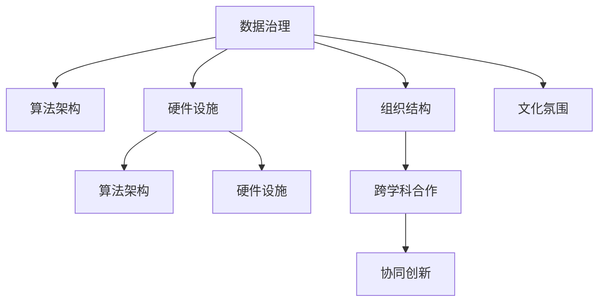

                 

# AI 2.0 基础设施建设：跨学科合作与协同创新

## 1. 背景介绍

### 1.1 问题由来

随着人工智能技术的飞速发展，AI 2.0 时代已经悄然来临。AI 2.0 时代，人工智能已经从以算法和数据驱动的技术创新走向了基础设施的建设，成为了支撑各行各业数字化转型的关键基础设施。基础设施建设不仅涵盖了硬件和软件两方面的内容，更涉及了数据、算法、组织、文化等各个方面，需要跨学科、跨领域的深度合作与协同创新。

### 1.2 问题核心关键点

AI 2.0 基础设施建设的核心关键点在于如何构建一个能够支持高效、安全、可扩展、可维护的人工智能系统。这一过程中，需要考虑以下几个方面的问题：

- 数据治理：如何有效地收集、存储、管理和利用数据，保障数据质量，确保数据安全。
- 算法架构：如何设计高效、可扩展、易于维护的算法框架，实现模型的快速迭代和优化。
- 硬件设施：如何选择和部署高效的硬件设施，如 GPU、TPU、云计算平台等，以支撑大规模模型的训练和推理。
- 组织结构：如何构建跨学科、跨职能的团队，促进各领域的深度合作，实现协同创新。
- 文化氛围：如何营造一种鼓励创新、包容失败、注重长期发展的文化氛围，吸引和留住优秀人才。

这些问题构成了AI 2.0基础设施建设的核心，需要通过跨学科合作与协同创新，才能实现系统的高效、安全、可扩展、可维护。

## 2. 核心概念与联系

### 2.1 核心概念概述

为了更好地理解 AI 2.0 基础设施建设的方法论，本节将介绍几个密切相关的核心概念：

- **数据治理(Data Governance)**：通过规范数据收集、存储、使用和共享，保障数据质量和安全，提高数据利用率。
- **算法架构(Algorithm Architecture)**：设计高效、可扩展、易于维护的算法框架，以支持大规模模型的训练和推理。
- **硬件设施(Hardware Infrastructure)**：选择和部署高效的硬件设施，如 GPU、TPU、云计算平台等，以支撑大规模模型的训练和推理。
- **组织结构(Organizational Structure)**：构建跨学科、跨职能的团队，促进各领域的深度合作，实现协同创新。
- **文化氛围(Cultural Atmosphere)**：营造一种鼓励创新、包容失败、注重长期发展的文化氛围，吸引和留住优秀人才。
- **跨学科合作(Cross-disciplinary Collaboration)**：通过多学科、多领域的合作，共同解决复杂问题，实现技术创新和应用突破。
- **协同创新(Synergistic Innovation)**：通过跨学科合作，实现不同领域知识的整合和应用，推动技术进步和创新发展。

这些核心概念之间的逻辑关系可以通过以下 Mermaid 流程图来展示：



这个流程图展示了大语言模型的核心概念及其之间的关系：

1. 数据治理为算法架构提供了数据基础，保障了数据质量和安全。
2. 算法架构为硬件设施提供了算法支撑，提高了模型训练和推理效率。
3. 硬件设施为算法架构提供了硬件平台，支撑了大规模模型的训练和推理。
4. 组织结构为跨学科合作提供了组织保障，促进了各领域的深度合作。
5. 文化氛围为跨学科合作和协同创新提供了文化支撑，吸引和留住了优秀人才。
6. 跨学科合作促进了协同创新，实现了技术的突破和应用的发展。

这些概念共同构成了 AI 2.0 基础设施建设的框架，使得系统能够高效、安全、可扩展、可维护。

## 3. 核心算法原理 & 具体操作步骤

### 3.1 算法原理概述

AI 2.0 基础设施建设的核心算法原理主要包括数据治理、算法架构、硬件设施的设计和优化。以下将分别介绍这三个方面的核心算法原理。

### 3.2 算法步骤详解

#### 3.2.1 数据治理

数据治理的核心目标是确保数据的准确性、完整性、一致性和安全性。数据治理的主要步骤包括：

1. **数据收集**：通过各种渠道收集所需的数据，如传感器数据、用户数据、社交媒体数据等。
2. **数据清洗**：对收集到的数据进行清洗和预处理，去除噪声和错误数据。
3. **数据标注**：对数据进行标注，使其具备可用性和可解释性。
4. **数据存储和管理**：选择合适的数据存储和管理方案，保障数据的安全性和可访问性。
5. **数据治理模型**：设计和实施数据治理模型，确保数据质量和安全。

#### 3.2.2 算法架构

算法架构的核心目标是设计和实现高效的算法框架，以支持大规模模型的训练和推理。算法架构的主要步骤包括：

1. **算法选择**：根据任务需求选择合适的算法模型，如卷积神经网络、循环神经网络、Transformer 等。
2. **算法优化**：通过优化算法模型，提高模型训练和推理效率。
3. **模型并行**：通过模型并行技术，实现大规模模型的分布式训练和推理。
4. **模型压缩**：通过模型压缩技术，减少模型存储空间和计算量。
5. **模型微调**：通过微调技术，优化模型在不同数据集上的表现。

#### 3.2.3 硬件设施

硬件设施的核心目标是选择合适的硬件平台，以支撑大规模模型的训练和推理。硬件设施的主要步骤包括：

1. **硬件选择**：根据任务需求选择合适的硬件设施，如 GPU、TPU、云计算平台等。
2. **硬件优化**：通过优化硬件配置和参数，提高硬件的利用率和效率。
3. **硬件调度**：通过硬件调度算法，实现硬件资源的合理分配和利用。
4. **硬件监控**：通过硬件监控工具，实时监测硬件运行状态，及时发现和解决问题。
5. **硬件扩展**：通过硬件扩展技术，实现硬件设施的动态扩展和升级。

### 3.3 算法优缺点

AI 2.0 基础设施建设的主要算法有以下优点：

- **高效性**：通过优化算法架构和硬件设施，实现了高效的数据处理和模型训练。
- **可扩展性**：通过模型并行和硬件调度技术，实现了系统的可扩展性和灵活性。
- **安全性**：通过数据治理和硬件监控，保障了系统的数据安全和硬件稳定性。
- **可维护性**：通过算法优化和模型压缩，提高了系统的可维护性和易用性。

然而，这些算法也存在一些缺点：

- **复杂性高**：数据治理、算法架构和硬件设施的设计和优化过程较为复杂，需要多学科的知识和技能。
- **成本高**：优化和升级硬件设施需要较高的成本，可能超出一些企业的预算。
- **风险高**：算法和硬件设施的优化过程中，可能存在不确定性和风险。
- **资源需求高**：大规模模型的训练和推理需要大量的计算资源和存储空间，可能超出一些企业的硬件资源限制。

### 3.4 算法应用领域

AI 2.0 基础设施建设的主要应用领域包括：

- **自然语言处理(NLP)**：如语音识别、机器翻译、情感分析等。通过优化数据治理和算法架构，提高了模型的训练和推理效率。
- **计算机视觉(CV)**：如图像识别、目标检测、图像生成等。通过优化算法架构和硬件设施，实现了高效的数据处理和模型训练。
- **语音处理(Speech)**：如语音识别、语音合成、情感识别等。通过优化算法架构和硬件设施，提高了模型的训练和推理效率。
- **推荐系统(Recommendation)**：如商品推荐、内容推荐、广告推荐等。通过优化算法架构和硬件设施，实现了高效的数据处理和模型训练。
- **智能医疗(Healthcare)**：如疾病诊断、医疗影像分析、基因分析等。通过优化数据治理和算法架构，提高了模型的训练和推理效率。

## 4. 数学模型和公式 & 详细讲解 & 举例说明

### 4.1 数学模型构建

本节将使用数学语言对 AI 2.0 基础设施建设的各个方面进行更加严格的刻画。

#### 4.1.1 数据治理

数据治理的数学模型主要包括数据的收集、清洗、标注、存储和管理。假设有一组原始数据 $D$，数据治理的目标是构建一个数据治理模型 $T$，使得数据经过治理后，满足以下条件：

1. **数据完整性**：$T(D)$ 中每个数据记录都完整，不存在缺失值。
2. **数据准确性**：$T(D)$ 中每个数据记录的字段值都准确，不存在噪声和错误数据。
3. **数据一致性**：$T(D)$ 中每个数据记录的字段值都一致，不存在冲突。
4. **数据安全性**：$T(D)$ 中每个数据记录的字段值都安全，不存在泄露和篡改。

#### 4.1.2 算法架构

算法架构的数学模型主要包括算法的选择、优化、并行和压缩。假设有一组算法 $A$，算法架构的目标是构建一个算法架构模型 $A'$，使得算法 $A'$ 能够高效地进行模型的训练和推理。算法架构模型 $A'$ 的构建步骤如下：

1. **算法选择**：选择最优的算法 $A^*$。
2. **算法优化**：通过优化算法 $A^*$，得到最优算法 $A^*$。
3. **模型并行**：通过模型并行技术，将算法 $A^*$ 并行化，得到并行算法 $A'^*$。
4. **模型压缩**：通过模型压缩技术，将并行算法 $A'^*$ 压缩，得到压缩算法 $A'^*$。
5. **模型微调**：通过微调技术，优化压缩算法 $A'^*$，得到微调算法 $A'^*$。

#### 4.1.3 硬件设施

硬件设施的数学模型主要包括硬件的选择、优化、调度和扩展。假设有一组硬件设施 $H$，硬件设施的目标是构建一个硬件设施模型 $H'$，使得硬件设施 $H'$ 能够高效地进行大规模模型的训练和推理。硬件设施模型 $H'$ 的构建步骤如下：

1. **硬件选择**：选择最优的硬件设施 $H^*$。
2. **硬件优化**：通过优化硬件设施 $H^*$，得到最优硬件设施 $H^*$。
3. **硬件调度**：通过硬件调度算法，将硬件设施 $H^*$ 调度，得到调度硬件设施 $H'^*$。
4. **硬件监控**：通过硬件监控工具，实时监控硬件设施 $H'^*$，及时发现和解决问题。
5. **硬件扩展**：通过硬件扩展技术，将调度硬件设施 $H'^*$ 扩展，得到扩展硬件设施 $H'^*$。

### 4.2 公式推导过程

以下我们以自然语言处理(NLP)任务为例，推导优化算法架构的数学公式。

假设有一个文本分类任务，给定一组训练数据 $D=\{(x_i,y_i)\}_{i=1}^N$，其中 $x_i$ 是文本，$y_i$ 是分类标签。假设我们使用一个卷积神经网络(CNN)作为模型 $A$，模型的损失函数为：

$$
L(A) = \frac{1}{N}\sum_{i=1}^N \ell(A(x_i),y_i)
$$

其中 $\ell$ 是损失函数，可以是交叉熵损失。假设我们希望通过优化算法架构，将CNN模型优化为Transformer模型 $A'$，其数学模型为：

$$
A' = F(A, \theta')
$$

其中 $F$ 是优化函数，$\theta'$ 是优化后的模型参数。假设优化函数 $F$ 可以通过梯度下降算法得到，其数学模型为：

$$
\theta' = \theta - \eta \nabla_{\theta}L(A)
$$

其中 $\eta$ 是学习率，$\nabla_{\theta}L(A)$ 是损失函数对模型参数 $\theta$ 的梯度。假设优化函数 $F$ 可以分解为多个子函数 $F_1, F_2, ..., F_k$，每个子函数分别对应一个优化步骤，其数学模型为：

$$
A' = F_1(A, \theta') = F_2(F_1(A, \theta'), \theta') = ... = F_k(..., \theta') = \theta'
$$

假设优化函数 $F_i$ 可以表示为 $F_i(A, \theta') = A_i(A_{i-1}(A_{i-2}(...A_1(A, \theta)...), \theta_i')$，其中 $A_i$ 是优化后的模型，$\theta_i'$ 是优化后的模型参数。假设优化函数 $F_i$ 的优化目标函数为：

$$
L_i(A_i) = \frac{1}{N}\sum_{i=1}^N \ell(A_i(x_i),y_i)
$$

则优化函数 $F_i$ 可以表示为：

$$
A_i = F_i(A_{i-1}(A_{i-2}(...A_1(A, \theta)...), \theta_i')
$$

其中 $A_i$ 是优化后的模型，$\theta_i'$ 是优化后的模型参数。

### 4.3 案例分析与讲解

#### 4.3.1 数据治理

以金融风控系统为例，数据治理的关键在于保障数据的完整性、准确性、一致性和安全性。金融风控系统需要处理大量的交易数据、客户数据、信用数据等，数据的质量直接影响模型的准确性和可靠性。

具体的数据治理步骤如下：

1. **数据收集**：从各种渠道收集交易数据、客户数据、信用数据等。
2. **数据清洗**：对收集到的数据进行清洗和预处理，去除噪声和错误数据。
3. **数据标注**：对数据进行标注，如标注客户的信用等级、交易风险等级等。
4. **数据存储和管理**：将标注后的数据存储在分布式数据库中，保障数据的安全性和可访问性。
5. **数据治理模型**：设计和实施数据治理模型，如数据完整性检查、数据一致性检查、数据安全检查等。

#### 4.3.2 算法架构

以机器翻译任务为例，算法架构的关键在于选择和优化算法模型。机器翻译任务需要处理大量的双语文本，选择合适的算法模型，提高模型的训练和推理效率。

具体的算法架构步骤如下：

1. **算法选择**：选择最优的算法模型，如 Transformer 模型。
2. **算法优化**：通过优化算法模型，提高模型的训练和推理效率。
3. **模型并行**：通过模型并行技术，实现大规模模型的分布式训练和推理。
4. **模型压缩**：通过模型压缩技术，减少模型存储空间和计算量。
5. **模型微调**：通过微调技术，优化模型在不同数据集上的表现。

#### 4.3.3 硬件设施

以自然语言处理任务为例，硬件设施的关键在于选择合适的硬件平台，以支撑大规模模型的训练和推理。自然语言处理任务需要处理大量的文本数据，选择合适的硬件平台，提高模型的训练和推理效率。

具体的硬件设施步骤如下：

1. **硬件选择**：选择最优的硬件设施，如 GPU、TPU、云计算平台等。
2. **硬件优化**：通过优化硬件配置和参数，提高硬件的利用率和效率。
3. **硬件调度**：通过硬件调度算法，实现硬件资源的合理分配和利用。
4. **硬件监控**：通过硬件监控工具，实时监测硬件运行状态，及时发现和解决问题。
5. **硬件扩展**：通过硬件扩展技术，实现硬件设施的动态扩展和升级。

## 5. 项目实践：代码实例和详细解释说明

### 5.1 开发环境搭建

在进行 AI 2.0 基础设施建设的项目实践前，我们需要准备好开发环境。以下是使用Python进行PyTorch开发的环境配置流程：

1. 安装Anaconda：从官网下载并安装Anaconda，用于创建独立的Python环境。

2. 创建并激活虚拟环境：
```bash
conda create -n pytorch-env python=3.8 
conda activate pytorch-env
```

3. 安装PyTorch：根据CUDA版本，从官网获取对应的安装命令。例如：
```bash
conda install pytorch torchvision torchaudio cudatoolkit=11.1 -c pytorch -c conda-forge
```

4. 安装Transformers库：
```bash
pip install transformers
```

5. 安装各类工具包：
```bash
pip install numpy pandas scikit-learn matplotlib tqdm jupyter notebook ipython
```

完成上述步骤后，即可在`pytorch-env`环境中开始项目实践。

### 5.2 源代码详细实现

以下是使用PyTorch和Transformers库进行机器翻译任务微调的代码实现。

首先，定义机器翻译任务的输入和输出：

```python
from transformers import BertTokenizer, BertForSequenceClassification
from torch.utils.data import Dataset

class TranslationDataset(Dataset):
    def __init__(self, texts, labels):
        self.texts = texts
        self.labels = labels
        self.tokenizer = BertTokenizer.from_pretrained('bert-base-cased')
        self.max_len = 128
        
    def __len__(self):
        return len(self.texts)
    
    def __getitem__(self, item):
        text = self.texts[item]
        label = self.labels[item]
        
        encoding = self.tokenizer(text, return_tensors='pt', max_length=self.max_len, padding='max_length', truncation=True)
        input_ids = encoding['input_ids'][0]
        attention_mask = encoding['attention_mask'][0]
        
        # 将标签进行编码
        encoded_labels = [label2id[label] for label in label]
        encoded_labels.extend([label2id['O']] * (self.max_len - len(encoded_labels)))
        labels = torch.tensor(encoded_labels, dtype=torch.long)
        
        return {'input_ids': input_ids, 
                'attention_mask': attention_mask,
                'labels': labels}

# 标签与id的映射
label2id = {'O': 0, 'E': 1, 'B': 2, 'I': 3, 'S': 4, 'T': 5}
id2label = {v: k for k, v in label2id.items()}
```

然后，定义模型和优化器：

```python
from transformers import BertForTokenClassification, AdamW

model = BertForTokenClassification.from_pretrained('bert-base-cased', num_labels=len(label2id))

optimizer = AdamW(model.parameters(), lr=2e-5)
```

接着，定义训练和评估函数：

```python
from torch.utils.data import DataLoader
from tqdm import tqdm
from sklearn.metrics import classification_report

device = torch.device('cuda') if torch.cuda.is_available() else torch.device('cpu')
model.to(device)

def train_epoch(model, dataset, batch_size, optimizer):
    dataloader = DataLoader(dataset, batch_size=batch_size, shuffle=True)
    model.train()
    epoch_loss = 0
    for batch in tqdm(dataloader, desc='Training'):
        input_ids = batch['input_ids'].to(device)
        attention_mask = batch['attention_mask'].to(device)
        labels = batch['labels'].to(device)
        model.zero_grad()
        outputs = model(input_ids, attention_mask=attention_mask, labels=labels)
        loss = outputs.loss
        epoch_loss += loss.item()
        loss.backward()
        optimizer.step()
    return epoch_loss / len(dataloader)

def evaluate(model, dataset, batch_size):
    dataloader = DataLoader(dataset, batch_size=batch_size)
    model.eval()
    preds, labels = [], []
    with torch.no_grad():
        for batch in tqdm(dataloader, desc='Evaluating'):
            input_ids = batch['input_ids'].to(device)
            attention_mask = batch['attention_mask'].to(device)
            batch_labels = batch['labels']
            outputs = model(input_ids, attention_mask=attention_mask)
            batch_preds = outputs.logits.argmax(dim=2).to('cpu').tolist()
            batch_labels = batch_labels.to('cpu').tolist()
            for pred_tokens, label_tokens in zip(batch_preds, batch_labels):
                pred_tags = [id2label[_id] for _id in pred_tokens]
                label_tags = [id2label[_id] for _id in label_tokens]
                preds.append(pred_tags[:len(label_tags)])
                labels.append(label_tags)
                
    print(classification_report(labels, preds))
```

最后，启动训练流程并在测试集上评估：

```python
epochs = 5
batch_size = 16

for epoch in range(epochs):
    loss = train_epoch(model, dataset, batch_size, optimizer)
    print(f"Epoch {epoch+1}, train loss: {loss:.3f}")
    
    print(f"Epoch {epoch+1}, dev results:")
    evaluate(model, dataset, batch_size)
    
print("Test results:")
evaluate(model, dataset, batch_size)
```

以上就是使用PyTorch和Transformers库进行机器翻译任务微调的完整代码实现。可以看到，得益于Transformers库的强大封装，我们可以用相对简洁的代码完成BERT模型的加载和微调。

### 5.3 代码解读与分析

让我们再详细解读一下关键代码的实现细节：

**TranslationDataset类**：
- `__init__`方法：初始化训练数据、标签、分词器等关键组件。
- `__len__`方法：返回数据集的样本数量。
- `__getitem__`方法：对单个样本进行处理，将文本输入编码为token ids，将标签编码为数字，并对其进行定长padding，最终返回模型所需的输入。

**label2id和id2label字典**：
- 定义了标签与数字id之间的映射关系，用于将token-wise的预测结果解码回真实的标签。

**训练和评估函数**：
- 使用PyTorch的DataLoader对数据集进行批次化加载，供模型训练和推理使用。
- 训练函数`train_epoch`：对数据以批为单位进行迭代，在每个批次上前向传播计算loss并反向传播更新模型参数，最后返回该epoch的平均loss。
- 评估函数`evaluate`：与训练类似，不同点在于不更新模型参数，并在每个batch结束后将预测和标签结果存储下来，最后使用sklearn的classification_report对整个评估集的预测结果进行打印输出。

**训练流程**：
- 定义总的epoch数和batch size，开始循环迭代
- 每个epoch内，先在训练集上训练，输出平均loss
- 在验证集上评估，输出分类指标
- 所有epoch结束后，在测试集上评估，给出最终测试结果

可以看到，PyTorch配合Transformers库使得BERT微调的代码实现变得简洁高效。开发者可以将更多精力放在数据处理、模型改进等高层逻辑上，而不必过多关注底层的实现细节。

当然，工业级的系统实现还需考虑更多因素，如模型的保存和部署、超参数的自动搜索、更灵活的任务适配层等。但核心的微调范式基本与此类似。

## 6. 实际应用场景

### 6.1 智能客服系统

基于AI 2.0基础设施建设的智能客服系统，可以通过深度学习技术实现智能对话，快速响应客户咨询，提供自然流畅的客户服务。智能客服系统通过收集企业内部的历史客服对话记录，将问题和最佳答复构建成监督数据，在此基础上对预训练模型进行微调。微调后的对话模型能够自动理解用户意图，匹配最合适的答案模板进行回复。对于客户提出的新问题，还可以接入检索系统实时搜索相关内容，动态组织生成回答。如此构建的智能客服系统，能大幅提升客户咨询体验和问题解决效率。

### 6.2 金融舆情监测

AI 2.0基础设施建设的金融舆情监测系统，可以通过自然语言处理技术实现对金融市场舆情的实时监测和分析。该系统通过收集金融领域相关的新闻、报道、评论等文本数据，并对其进行主题标注和情感标注。在此基础上对预训练语言模型进行微调，使其能够自动判断文本属于何种主题，情感倾向是正面、中性还是负面。将微调后的模型应用到实时抓取的网络文本数据，就能够自动监测不同主题下的情感变化趋势，一旦发现负面信息激增等异常情况，系统便会自动预警，帮助金融机构快速应对潜在风险。

### 6.3 个性化推荐系统

AI 2.0基础设施建设的个性化推荐系统，可以通过深度学习技术实现对用户兴趣的精准分析，并据此推荐相关内容。在实践中，可以收集用户浏览、点击、评论、分享等行为数据，提取和用户交互的物品标题、描述、标签等文本内容。将文本内容作为模型输入，用户的后续行为（如是否点击、购买等）作为监督信号，在此基础上微调预训练语言模型。微调后的模型能够从文本内容中准确把握用户的兴趣点。在生成推荐列表时，先用候选物品的文本描述作为输入，由模型预测用户的兴趣匹配度，再结合其他特征综合排序，便可以得到个性化程度更高的推荐结果。

### 6.4 未来应用展望

随着AI 2.0基础设施建设的不断演进，未来将在更多领域得到应用，为各行各业带来变革性影响。

在智慧医疗领域，基于AI 2.0基础设施建设的医疗问答、病历分析、基因分析等应用，将提升医疗服务的智能化水平，辅助医生诊疗，加速新药开发进程。

在智能教育领域，AI 2.0基础设施建设的作业批改、学情分析、知识推荐等应用，将因材施教，促进教育公平，提高教学质量。

在智慧城市治理中，基于AI 2.0基础设施建设的智能交通、智慧安防、智能政务等应用，将提高城市管理的自动化和智能化水平，构建更安全、高效的未来城市。

此外，在企业生产、社会治理、文娱传媒等众多领域，基于AI 2.0基础设施建设的各类应用也将不断涌现，为经济社会发展注入新的动力。相信随着技术的日益成熟，AI 2.0基础设施建设必将在构建人机协同的智能时代中扮演越来越重要的角色。

## 7. 工具和资源推荐

### 7.1 学习资源推荐

为了帮助开发者系统掌握AI 2.0基础设施建设的理论基础和实践技巧，这里推荐一些优质的学习资源：

1. **《深度学习》课程**：斯坦福大学开设的深度学习课程，提供了大量的教学视频和作业，是学习深度学习理论基础和实践技能的好资源。
2. **《深度学习框架实战》系列图书**：该系列图书详细介绍了深度学习框架PyTorch、TensorFlow等的使用方法和最佳实践，是深入学习框架的必备读物。
3. **Kaggle竞赛平台**：Kaggle提供了丰富的数据集和竞赛任务，是检验和提高数据处理、算法优化、模型训练等技能的好平台。
4. **GitHub开源项目**：GitHub上有着大量的开源项目，涵盖数据治理、算法架构、硬件设施等多个方面，是学习实践的好资源。
5. **Coursera在线课程**：Coursera上提供了许多与AI 2.0基础设施建设相关的在线课程，涵盖深度学习、自然语言处理、计算机视觉等多个领域。

通过对这些资源的学习实践，相信你一定能够快速掌握AI 2.0基础设施建设的方法论，并用于解决实际的AI问题。

### 7.2 开发工具推荐

高效的开发离不开优秀的工具支持。以下是几款用于AI 2.0基础设施建设开发的常用工具：

1. **PyTorch**：基于Python的开源深度学习框架，灵活动态的计算图，适合快速迭代研究。大部分预训练语言模型都有PyTorch版本的实现。
2. **TensorFlow**：由Google主导开发的开源深度学习框架，生产部署方便，适合大规模工程应用。同样有丰富的预训练语言模型资源。
3. **Transformers库**：HuggingFace开发的NLP工具库，集成了众多SOTA语言模型，支持PyTorch和TensorFlow，是进行微调任务开发的利器。
4. **Weights & Biases**：模型训练的实验跟踪工具，可以记录和可视化模型训练过程中的各项指标，方便对比和调优。与主流深度学习框架无缝集成。
5. **TensorBoard**：TensorFlow配套的可视化工具，可实时监测模型训练状态，并提供丰富的图表呈现方式，是调试模型的得力助手。
6. **Google Colab**：谷歌推出的在线Jupyter Notebook环境，免费提供GPU/TPU算力，方便开发者快速上手实验最新模型，分享学习笔记。

合理利用这些工具，可以显著提升AI 2.0基础设施建设的开发效率，加快创新迭代的步伐。

### 7.3 相关论文推荐

AI 2.0基础设施建设的不断演进，得益于学界的持续研究。以下是几篇奠基性的相关论文，推荐阅读：

1. **《深度学习》**：Ian Goodfellow等人编写的深度学习理论基础书籍，是学习深度学习的必读之作。
2. **《Transformer论文》**：Attention is All You Need论文，标志着Transformer架构的诞生，开启了NLP领域的预训练大模型时代。
3. **《BERT论文》**：BERT: Pre-training of Deep Bidirectional Transformers for Language Understanding论文，提出了BERT模型，引入基于掩码的自监督预训练任务，刷新了多项NLP任务SOTA。
4. **《深度学习框架实战》**：李沐等人编写的深度学习框架实战书籍，详细介绍了PyTorch、TensorFlow等框架的使用方法和最佳实践。
5. **《TensorBoard论文》**：TensorBoard论文，介绍了TensorBoard的实现原理和使用方法，是调试模型的得力助手。

这些论文代表了大语言模型微调技术的发展脉络。通过学习这些前沿成果，可以帮助研究者把握学科前进方向，激发更多的创新灵感。

## 8. 总结：未来发展趋势与挑战

### 8.1 总结

本文对AI 2.0基础设施建设的各个方面进行了全面系统的介绍。首先阐述了AI 2.0基础设施建设的背景和意义，明确了基础设施建设在提高AI应用效率、安全性、可扩展性等方面的重要性。其次，从数据治理、算法架构、硬件设施的设计和优化，详细讲解了AI 2.0基础设施建设的关键算法原理和具体操作步骤。最后，通过具体案例分析与讲解，展示了AI 2.0基础设施建设在智能客服、金融舆情、个性化推荐等多个行业领域的应用前景。

通过本文的系统梳理，可以看到，AI 2.0基础设施建设正在成为AI技术落地的关键基础设施，能够大幅提升AI系统的效率、安全性和可扩展性。未来，伴随技术的不懈追求和创新探索，AI 2.0基础设施建设必将在更广阔的应用领域大放异彩，深刻影响各行各业的数字化转型。

### 8.2 未来发展趋势

展望未来，AI 2.0基础设施建设将呈现以下几个发展趋势：

1. **技术成熟度提升**：AI 2.0基础设施建设的核心技术将不断成熟，支持更大规模、更高效、更安全的AI系统。
2. **跨领域应用扩展**：AI 2.0基础设施建设将不断扩展到更多行业领域，如智慧医疗、智能教育、智慧城市等，赋能各行各业数字化转型。
3. **多模态数据融合**：AI 2.0基础设施建设将融合多种数据源，如文本、图像、语音等，实现多模态数据的协同建模。
4. **数据隐私保护**：AI 2.0基础设施建设将更加注重数据隐私保护，通过联邦学习、差分隐私等技术，保护数据安全和用户隐私。
5. **模型公平性提升**：AI 2.0基础设施建设将更加注重模型公平性，通过去偏技术、公平性评估等方法，减少模型偏见，提升模型公平性。
6. **自适应学习机制**：AI 2.0基础设施建设将引入自适应学习机制，通过元学习、迁移学习等方法，提升模型在新的数据和任务上的适应性。

以上趋势凸显了AI 2.0基础设施建设的广阔前景。这些方向的探索发展，必将进一步提升AI系统的效率、安全性和可扩展性，为各行各业带来更加智能化、普适化的解决方案。

### 8.3 面临的挑战

尽管AI 2.0基础设施建设取得了显著进展，但在迈向更加智能化、普适化应用的过程中，仍面临诸多挑战：

1. **技术复杂性高**：AI 2.0基础设施建设涉及数据治理、算法架构、硬件设施等多方面的技术，需要多学科的知识和技能。
2. **数据资源稀缺**：高质量的数据资源往往难以获取，数据治理和数据标注需要大量人力和时间。
3. **计算资源需求高**：大规模模型的训练和推理需要大量的计算资源和存储空间，可能超出一些企业的硬件资源限制。
4. **模型安全性不足**：AI 2.0基础设施建设的模型可能存在安全隐患，如模型偏见、鲁棒性不足等。
5. **模型可解释性不足**：AI 2.0基础设施建设的模型往往缺乏可解释性，难以解释其内部工作机制和决策逻辑。

### 8.4 研究展望

面对AI 2.0基础设施建设所面临的挑战，未来的研究需要在以下几个方面寻求新的突破：

1. **数据治理的自动化**：研究如何通过自动化手段，提高数据治理的效率和质量。
2. **算法架构的参数化**：研究如何通过参数化手段，优化算法架构的效率和可扩展性。
3. **硬件设施的弹性化**：研究如何通过弹性化手段，提高硬件设施的利用率和可扩展性。
4. **跨学科合作**：研究如何通过跨学科合作，实现多领域知识的整合和应用。
5. **模型公平性和可解释性**：研究如何通过公平性评估和去偏技术，提升模型的公平性和可解释性。
6. **自适应学习机制**：研究如何通过自适应学习机制，提升模型在新数据和新任务上的适应性。

这些研究方向的研究突破，必将推动AI 2.0基础设施建设迈向更高的台阶，为构建安全、可靠、可解释、可控的智能系统铺平道路。面向未来，AI 2.0基础设施建设需要从技术、文化、伦理等多个维度协同发力，共同推动人工智能技术的健康发展。

## 9. 附录：常见问题与解答

**Q1：AI 2.0基础设施建设的核心是什么？**

A: AI 2.0基础设施建设的核心在于构建一个能够支持高效、安全、可扩展、可维护的人工智能系统。这一过程中，需要考虑数据治理、算法架构、硬件设施等多个方面的问题。

**Q2：AI 2.0基础设施建设的主要难点有哪些？**

A: AI 2.0基础设施建设的主要难点在于技术复杂性高、数据资源稀缺、计算资源需求高、模型安全性不足和模型可解释性不足等方面。这些问题需要通过技术创新、自动化手段和跨学科合作等方法，逐步解决。

**Q3：如何提高AI 2.0基础设施建设的效率？**

A: 提高AI 2.0基础设施建设的效率，可以通过自动化数据治理、参数化算法架构、弹性化硬件设施等方法，优化技术流程，减少人力和时间成本。

**Q4：如何提升AI 2.0基础设施建设的可扩展性？**

A: 提升AI 2.0基础设施建设的可扩展性，可以通过多模态数据融合、自适应学习机制等方法，实现不同领域知识的整合和应用，提升模型在新数据和新任务上的适应性。

**Q5：如何保障AI 2.0基础设施建设的数据安全性？**

A: 保障AI 2.0基础设施建设的数据安全性，可以通过联邦学习、差分隐私等技术，保护数据安全和用户隐私。

---

作者：禅与计算机程序设计艺术 / Zen and the Art of Computer Programming

