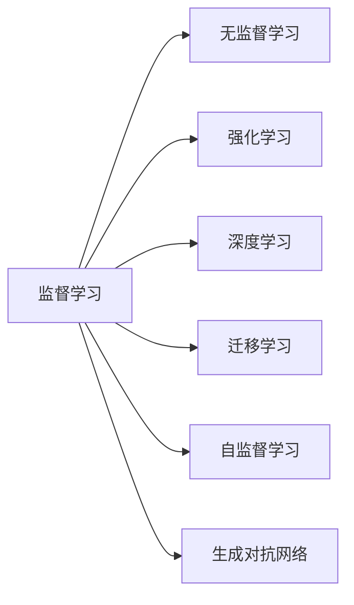

                 

# AI 2.0 时代的机器学习

## 1. 背景介绍

### 1.1 问题由来
近年来，人工智能(AI)技术在各行各业的应用越来越广泛，从自动驾驶、工业自动化，到医疗诊断、金融风控，AI技术正在逐步改变传统行业的业务模式，提升效率和质量。AI技术的核心驱动力之一是机器学习（Machine Learning, ML），它通过训练模型，从数据中自动学习知识，从而实现智能决策和预测。

随着AI技术的不断发展，机器学习也从传统的机器学习（AI 1.0）逐渐演进到新一代机器学习（AI 2.0）。AI 2.0时代，机器学习在算法、数据、硬件和应用场景等方面都发生了显著变化，呈现出新的趋势和挑战。本文将深入探讨AI 2.0时代的机器学习，包括其核心概念、算法原理、实际应用和未来发展方向，为读者提供全面的技术理解和实践指导。

### 1.2 问题核心关键点
AI 2.0时代的机器学习主要包括以下几个关键点：

1. **算法多样化**：传统的监督学习、无监督学习和强化学习依然重要，但深度学习、迁移学习、自监督学习等新方法也获得了广泛应用。
2. **数据质量与量级**：数据质量对于机器学习效果至关重要，高质量标注数据和海量的数据规模是大模型训练的基石。
3. **硬件与算力**：GPU、TPU等高性能计算硬件和大规模分布式计算基础设施，推动了模型训练速度和规模的突破。
4. **模型架构**：深度神经网络成为主流，卷积神经网络（CNN）、循环神经网络（RNN）和Transformer等架构被广泛应用于图像、文本和语音处理等领域。
5. **应用场景**：机器学习在自动驾驶、智能推荐、医疗诊断、金融风控等众多领域取得了突破，加速了产业升级和经济增长。
6. **伦理与安全**：随着模型复杂性的增加，机器学习模型的解释性、公平性、安全性等伦理问题也日益凸显，需要更多的关注和解决。

通过理解这些关键点，我们可以更好地把握AI 2.0时代机器学习的发展脉络，识别新的技术趋势和挑战。

## 2. 核心概念与联系

### 2.1 核心概念概述

为了更深入地理解AI 2.0时代的机器学习，我们先回顾一些核心概念及其相互联系：

- **监督学习(Supervised Learning)**：通过有标签的数据训练模型，学习输入与输出之间的映射关系。常见算法包括线性回归、逻辑回归、决策树、支持向量机等。
- **无监督学习(Unsupervised Learning)**：不依赖标注数据，通过发现数据中的内在结构进行建模。常见算法包括聚类、降维、生成模型等。
- **强化学习(Reinforcement Learning)**：通过与环境交互，最大化预期奖励，学习决策策略。常见算法包括Q-learning、深度Q网络等。
- **深度学习(Deep Learning)**：通过多层神经网络，自动提取数据特征，实现端到端的建模。常见算法包括卷积神经网络（CNN）、循环神经网络（RNN）、自编码器等。
- **迁移学习(Transfer Learning)**：利用预训练模型的知识，在新任务上进行微调，提高模型性能。常见算法包括微调、特征提取、知识蒸馏等。
- **自监督学习(Self-Supervised Learning)**：利用数据的自然冗余性，进行无监督的自我监督学习，常见算法包括自回归语言模型、掩码语言模型等。
- **生成对抗网络(GANs)**：通过生成器和判别器的对抗训练，生成逼真的数据样本，常见算法包括DCGAN、WGAN等。

这些核心概念之间的关系可以通过以下Mermaid流程图来展示：



这个流程图展示了机器学习不同范式之间的关系，帮助我们理解不同方法之间的联系和区别。

## 3. 核心算法原理 & 具体操作步骤

### 3.1 算法原理概述

AI 2.0时代的机器学习，其核心算法原理包括但不限于以下几类：

- **监督学习算法**：基于有标签的数据，通过最小化预测误差，学习输入与输出之间的映射关系。常见算法包括线性回归、逻辑回归、决策树、支持向量机、神经网络等。
- **无监督学习算法**：不依赖标注数据，通过发现数据中的内在结构进行建模。常见算法包括聚类、降维、生成模型等。
- **强化学习算法**：通过与环境交互，最大化预期奖励，学习决策策略。常见算法包括Q-learning、深度Q网络等。
- **深度学习算法**：通过多层神经网络，自动提取数据特征，实现端到端的建模。常见算法包括卷积神经网络（CNN）、循环神经网络（RNN）、自编码器、Transformer等。
- **迁移学习算法**：利用预训练模型的知识，在新任务上进行微调，提高模型性能。常见算法包括微调、特征提取、知识蒸馏等。
- **自监督学习算法**：利用数据的自然冗余性，进行无监督的自我监督学习。常见算法包括自回归语言模型、掩码语言模型等。

这些算法在数据处理、模型训练和应用部署等方面，都具有各自的特点和优势。理解这些算法原理，有助于我们更好地选择和应用合适的机器学习技术。

### 3.2 算法步骤详解

AI 2.0时代的机器学习算法步骤大致可以分为以下几个阶段：

1. **数据预处理**：包括数据清洗、特征提取、数据增强等，确保数据质量和适用性。
2. **模型选择与训练**：根据任务特点选择合适的算法模型，使用训练集进行模型训练。
3. **模型评估与调优**：在验证集上评估模型性能，根据评估结果调整超参数和模型结构，进行模型调优。
4. **模型部署与监控**：将模型部署到实际应用环境中，进行实时监控和性能优化，确保系统稳定运行。

每个阶段的具体操作细节将根据不同的算法和任务有所不同，下面以深度学习为例，详细介绍深度学习模型的训练和评估过程。

### 3.3 算法优缺点

AI 2.0时代的机器学习算法具有以下优点：

1. **高效建模能力**：深度学习等算法可以自动提取数据中的复杂特征，实现端到端的建模，提升了模型的预测能力和泛化能力。
2. **数据利用率高**：无监督学习和自监督学习等算法可以充分利用数据的自然冗余性，提高数据利用率，减少标注成本。
3. **应用场景广泛**：机器学习算法可以应用于图像、文本、语音等多种模态数据，推动了各行各业的数字化转型。
4. **算法多样性**：算法选择灵活，根据任务特点和数据分布，可以选择最合适的算法，提高模型性能。

然而，机器学习算法也存在一些缺点：

1. **数据依赖性强**：大多数机器学习算法需要大量标注数据进行训练，标注成本高，且数据分布变化时模型性能可能下降。
2. **模型复杂度高**：深度学习等算法模型结构复杂，训练和推理计算量大，对硬件资源要求高。
3. **解释性不足**：部分机器学习算法如深度学习模型具有"黑盒"特点，难以解释模型的内部工作机制和决策逻辑。
4. **公平性与安全问题**：机器学习模型容易受到数据偏见的影响，导致预测结果不公平或不安全。
5. **资源消耗大**：模型训练和推理过程中，硬件资源的消耗大，对算力和存储需求高。

## 4. 数学模型和公式 & 详细讲解 & 举例说明

### 4.1 数学模型构建

为了更系统地理解AI 2.0时代的机器学习算法，下面给出几个典型的数学模型构建过程。

- **线性回归模型**：
  假设数据集为 $(x_i, y_i)$，其中 $x_i \in \mathbb{R}^n$ 为输入向量，$y_i \in \mathbb{R}$ 为输出标量。线性回归模型假设输出 $y$ 为输入 $x$ 的线性组合，即 $y = \theta^T x + b$，其中 $\theta \in \mathbb{R}^n$ 为模型参数，$b$ 为偏置项。

- **神经网络模型**：
  神经网络由多个层组成，每层包含多个神经元。假设一个神经网络包含 $L$ 层，第 $l$ 层的神经元数为 $n_l$。神经网络的输出 $y$ 可以通过输入 $x$ 逐层变换得到，即 $y = f_L(f_{L-1}(\dots f_1(x)\dots))$，其中 $f_l$ 为第 $l$ 层的激活函数。

- **卷积神经网络(CNN)**：
  CNN 通过卷积层和池化层提取局部特征，再通过全连接层进行分类或回归。假设卷积核大小为 $k \times k$，输入为 $n$ 维特征图，卷积层输出为 $m$ 维特征图，则卷积层的权重参数为 $n \times m \times k \times k$。

- **循环神经网络(RNN)**：
  RNN 通过循环结构处理序列数据，可以有效地处理文本、语音等时间序列数据。假设 RNN 包含 $L$ 个时间步，每个时间步的隐藏状态为 $h_t$，则 RNN 的输出 $y$ 可以通过历史隐藏状态 $h_{<t}$ 和当前输入 $x_t$ 计算得到，即 $y_t = f(h_{<t}, x_t)$。

### 4.2 公式推导过程

为了更深入地理解AI 2.0时代的机器学习算法，下面以线性回归和卷积神经网络为例，进行公式推导。

- **线性回归公式推导**：
  假设数据集为 $(x_i, y_i)$，其中 $x_i \in \mathbb{R}^n$ 为输入向量，$y_i \in \mathbb{R}$ 为输出标量。假设模型参数为 $\theta$，则预测输出为 $\hat{y} = \theta^T x + b$。根据均方误差损失函数 $\mathcal{L}(\theta) = \frac{1}{2N}\sum_{i=1}^N(y_i - \hat{y}_i)^2$，可以通过梯度下降等优化算法求得最优参数 $\theta$。

- **卷积神经网络公式推导**：
  假设卷积核大小为 $k \times k$，输入为 $n$ 维特征图，卷积层输出为 $m$ 维特征图。假设卷积层的输入为 $x_{i:j}$，卷积核为 $w$，则卷积层的输出为 $\sum_{i=0}^{n-k+1}\sum_{j=0}^{n-k+1}x_{i:j} \cdot w_{i,j}$。通过池化层和全连接层，最终输出预测结果 $y$。

### 4.3 案例分析与讲解

为了更好地理解AI 2.0时代的机器学习算法，下面以图像分类和语音识别为例，进行案例分析。

- **图像分类案例分析**：
  假设有一个图像分类任务，需要将输入图像 $x$ 分为 $K$ 类之一。假设使用了卷积神经网络作为模型，输入图像大小为 $n \times n$，卷积核大小为 $k \times k$，隐藏层神经元数为 $m$。通过多个卷积层、池化层和全连接层，最终输出分类概率 $p_k$，使用交叉熵损失函数 $\mathcal{L}(\theta) = -\frac{1}{N}\sum_{i=1}^N\sum_{k=1}^K(y_i \log p_{ik})$，通过梯度下降等优化算法求得最优参数 $\theta$。

- **语音识别案例分析**：
  假设有一个语音识别任务，需要将输入语音 $x$ 转换为文本 $y$。假设使用了循环神经网络作为模型，输入语音大小为 $n$，隐藏状态大小为 $m$。通过多个时间步的循环计算，最终输出预测文本 $y$，使用交叉熵损失函数 $\mathcal{L}(\theta) = -\frac{1}{N}\sum_{i=1}^N\sum_{t=1}^{T}(y_t \log p_t)$，通过梯度下降等优化算法求得最优参数 $\theta$。

## 5. 项目实践：代码实例和详细解释说明

### 5.1 开发环境搭建

为了进行AI 2.0时代的机器学习项目开发，需要准备好开发环境。以下是使用Python进行TensorFlow开发的环境配置流程：

1. 安装Anaconda：从官网下载并安装Anaconda，用于创建独立的Python环境。

2. 创建并激活虚拟环境：
```bash
conda create -n tf-env python=3.8 
conda activate tf-env
```

3. 安装TensorFlow：根据CUDA版本，从官网获取对应的安装命令。例如：
```bash
conda install tensorflow -c conda-forge
```

4. 安装TensorBoard：
```bash
pip install tensorboard
```

5. 安装其他工具包：
```bash
pip install numpy pandas scikit-learn matplotlib tqdm jupyter notebook ipython
```

完成上述步骤后，即可在`tf-env`环境中开始项目开发。

### 5.2 源代码详细实现

下面我们以图像分类任务为例，给出使用TensorFlow和Keras框架对卷积神经网络进行训练的代码实现。

首先，定义数据预处理函数：

```python
import tensorflow as tf
from tensorflow.keras import datasets, layers, models

def preprocess_data(data_path):
    (train_images, train_labels), (test_images, test_labels) = datasets.cifar10.load_data()
    train_images, test_images = train_images / 255.0, test_images / 255.0
    return train_images, train_labels, test_images, test_labels
```

然后，定义模型和优化器：

```python
model = models.Sequential([
    layers.Conv2D(32, (3, 3), activation='relu', input_shape=(32, 32, 3)),
    layers.MaxPooling2D((2, 2)),
    layers.Conv2D(64, (3, 3), activation='relu'),
    layers.MaxPooling2D((2, 2)),
    layers.Conv2D(64, (3, 3), activation='relu'),
    layers.Flatten(),
    layers.Dense(64, activation='relu'),
    layers.Dense(10)
])

optimizer = tf.keras.optimizers.Adam()
```

接着，定义训练和评估函数：

```python
batch_size = 64
epochs = 10

model.compile(optimizer=optimizer, loss=tf.keras.losses.SparseCategoricalCrossentropy(from_logits=True), metrics=['accuracy'])

train_images, train_labels, test_images, test_labels = preprocess_data('cifar10_data')
train_dataset = tf.data.Dataset.from_tensor_slices((train_images, train_labels)).shuffle(10000).batch(batch_size)
test_dataset = tf.data.Dataset.from_tensor_slices((test_images, test_labels)).batch(batch_size)

history = model.fit(train_dataset, epochs=epochs, validation_data=test_dataset)
```

最后，输出训练结果：

```python
print(history.history['accuracy'])
print(history.history['val_accuracy'])
```

以上就是使用TensorFlow进行卷积神经网络图像分类任务训练的完整代码实现。可以看到，TensorFlow和Keras框架提供了强大的模型构建和训练能力，使得模型训练过程变得简洁高效。

### 5.3 代码解读与分析

让我们再详细解读一下关键代码的实现细节：

**数据预处理函数preprocess_data**：
- 使用CIFAR-10数据集加载训练集和测试集。
- 对图像数据进行归一化处理，将像素值缩放到0-1之间。

**模型定义**：
- 定义卷积神经网络模型，包含多个卷积层、池化层和全连接层。
- 使用Adam优化器和交叉熵损失函数进行模型训练。

**训练函数**：
- 使用Keras框架提供的fit函数进行模型训练。
- 使用数据集进行批量训练，每个batch包含batch_size个样本。
- 在每个epoch结束时，在验证集上评估模型性能。

**训练结果输出**：
- 输出训练集和验证集的精度和损失值，帮助分析和优化模型性能。

通过本文的代码实例，读者可以系统理解AI 2.0时代机器学习项目开发的流程和关键步骤，为后续项目实践打下坚实基础。

## 6. 实际应用场景

### 6.1 智能推荐系统

AI 2.0时代的机器学习在智能推荐系统中的应用非常广泛。通过分析用户的历史行为数据，机器学习模型可以学习到用户兴趣和偏好，从而推荐个性化的商品、新闻、视频等。

具体而言，可以使用协同过滤、基于内容的推荐、深度学习等技术构建推荐系统。协同过滤通过分析用户和物品之间的相似性进行推荐，基于内容的推荐通过分析物品属性进行推荐，深度学习则通过多层的神经网络自动提取数据特征，实现更精确的推荐。

### 6.2 医疗诊断系统

机器学习在医疗诊断系统中也有重要应用。通过分析患者的病历数据、影像数据等，机器学习模型可以辅助医生进行疾病诊断和治疗方案制定。

具体而言，可以使用图像识别、自然语言处理等技术构建医疗诊断系统。图像识别技术可以自动识别医学影像中的病灶和结构，自然语言处理技术可以自动分析病历和医嘱，从而辅助医生进行诊断和治疗。

### 6.3 金融风控系统

机器学习在金融风控系统中的应用也非常广泛。通过分析用户的交易数据、信用记录等，机器学习模型可以预测用户的信用风险和欺诈行为。

具体而言，可以使用信用评分模型、异常检测模型等技术构建金融风控系统。信用评分模型通过分析用户的信用记录和行为特征，预测其还款能力和信用风险。异常检测模型通过检测交易数据中的异常行为，识别潜在的欺诈行为。

### 6.4 未来应用展望

随着AI 2.0时代的机器学习技术不断发展，其在更多领域的应用前景也将更加广阔。未来，机器学习技术将进一步推动以下领域的智能化转型：

1. **智慧城市**：通过机器学习技术，可以实现城市交通管理、环境监测、公共安全等方面的智能化。
2. **智能制造**：通过机器学习技术，可以实现生产调度、质量控制、设备维护等方面的智能化。
3. **智慧农业**：通过机器学习技术，可以实现精准农业、智能灌溉、病虫害防治等方面的智能化。
4. **智慧教育**：通过机器学习技术，可以实现个性化学习、智能评估、智能辅助教学等方面的智能化。

这些领域的智能化应用，将进一步提升生产力和生活品质，推动社会的数字化转型。

## 7. 工具和资源推荐

### 7.1 学习资源推荐

为了帮助读者系统掌握AI 2.0时代的机器学习技术，以下是一些优质的学习资源：

1. **《深度学习》课程**：斯坦福大学Andrew Ng教授开设的深度学习课程，讲解了深度学习的基本概念和经典算法，并提供了丰富的编程练习和项目实战。
2. **《TensorFlow官方文档》**：TensorFlow官方提供的详细文档，包括TensorFlow框架的介绍、API参考和编程示例。
3. **《TensorFlow实战》书籍**：讲解TensorFlow的实际应用案例，提供了从入门到精通的教程和代码实现。
4. **Kaggle数据科学竞赛平台**：提供大量实际应用场景的数据集和竞赛，帮助读者在实际项目中锻炼技能。
5. **Google AI博客**：Google AI团队发布的一系列深度学习技术论文和实现，提供前沿的研究进展和实践经验。

通过这些资源的学习，读者可以系统掌握AI 2.0时代的机器学习技术，并应用到实际项目中。

### 7.2 开发工具推荐

高效开发离不开优秀的工具支持。以下是几款用于AI 2.0时代机器学习开发的常用工具：

1. **PyTorch**：基于Python的深度学习框架，灵活动态的计算图，适合快速迭代研究。
2. **TensorFlow**：由Google主导开发的深度学习框架，生产部署方便，适合大规模工程应用。
3. **Jupyter Notebook**：免费的开源笔记本环境，支持多种编程语言和数据处理工具，适合开发和协作。
4. **Scikit-learn**：基于Python的机器学习库，提供丰富的算法实现和数据处理工具。
5. **TensorBoard**：TensorFlow配套的可视化工具，可实时监测模型训练状态，并提供丰富的图表呈现方式。

合理利用这些工具，可以显著提升AI 2.0时代机器学习项目的开发效率，加快创新迭代的步伐。

### 7.3 相关论文推荐

AI 2.0时代的机器学习技术不断发展，以下是几篇奠基性的相关论文，推荐阅读：

1. **《ImageNet Classification with Deep Convolutional Neural Networks》**：AlexNet论文，首次在ImageNet数据集上使用卷积神经网络取得了突破性成果。
2. **《Deep Residual Learning for Image Recognition》**：ResNet论文，提出了残差连接技术，解决了深度神经网络中的梯度消失问题。
3. **《Attention is All You Need》**：Transformer论文，提出了自注意力机制，极大地提升了语言模型的性能。
4. **《BERT: Pre-training of Deep Bidirectional Transformers for Language Understanding》**：BERT论文，提出了预训练语言模型，在多个NLP任务上取得了最佳性能。
5. **《Adam: A Method for Stochastic Optimization》**：Adam优化器论文，提出了自适应学习率的优化算法，提升了深度学习模型的训练速度和收敛性。

这些论文代表了大模型时代机器学习技术的发展脉络，为读者提供了深入的理论基础和实践指导。

## 8. 总结：未来发展趋势与挑战

### 8.1 总结

本文对AI 2.0时代的机器学习进行了全面系统的介绍。首先阐述了AI 2.0时代的机器学习背景和意义，明确了其在数据、算法、硬件和应用场景等方面的新趋势。其次，从原理到实践，详细讲解了监督学习、无监督学习、深度学习、迁移学习等核心算法及其具体操作，提供了完整的代码实现和分析。同时，本文还广泛探讨了AI 2.0时代机器学习在智能推荐、医疗诊断、金融风控等领域的实际应用场景，展示了其广泛的应用前景。此外，本文还精选了机器学习技术的各类学习资源、开发工具和相关论文，力求为读者提供全方位的技术指引。

通过本文的系统梳理，读者可以全面理解AI 2.0时代机器学习的发展脉络，掌握核心算法和实践技能，为后续研究和应用奠定坚实基础。

### 8.2 未来发展趋势

展望未来，AI 2.0时代的机器学习技术将呈现以下几个发展趋势：

1. **模型规模持续增大**：随着算力成本的下降和数据规模的扩张，深度神经网络模型的参数量将继续增长，超大规模模型将带来更强的泛化能力和应用潜力。
2. **算法多样化**：除了传统的监督学习、无监督学习和强化学习，深度学习、迁移学习、自监督学习等新算法也将继续发展和普及。
3. **硬件和算力提升**：GPU、TPU等高性能计算硬件和大规模分布式计算基础设施，将推动模型训练速度和规模的突破。
4. **应用场景多样化**：机器学习技术将在更多领域得到应用，如智慧城市、智能制造、智慧农业、智慧教育等，推动各行各业的数字化转型。
5. **伦理与安全**：随着模型复杂性的增加，机器学习模型的解释性、公平性、安全性等伦理问题将受到更多关注，需要更多的技术手段和法规规范。

以上趋势凸显了AI 2.0时代机器学习技术的发展前景，也为未来研究提供了方向指导。

### 8.3 面临的挑战

尽管AI 2.0时代的机器学习技术已经取得了瞩目成就，但在迈向更加智能化、普适化应用的过程中，仍面临诸多挑战：

1. **数据依赖性强**：大多数机器学习算法需要大量标注数据进行训练，标注成本高，且数据分布变化时模型性能可能下降。
2. **模型复杂度高**：深度学习等算法模型结构复杂，训练和推理计算量大，对硬件资源要求高。
3. **解释性不足**：部分机器学习算法如深度学习模型具有"黑盒"特点，难以解释模型的内部工作机制和决策逻辑。
4. **公平性与安全问题**：机器学习模型容易受到数据偏见的影响，导致预测结果不公平或不安全。
5. **资源消耗大**：模型训练和推理过程中，硬件资源的消耗大，对算力和存储需求高。

正视这些挑战，积极应对并寻求突破，将是大模型时代机器学习技术走向成熟的必由之路。

### 8.4 研究展望

面对AI 2.0时代机器学习技术面临的挑战，未来的研究需要在以下几个方面寻求新的突破：

1. **无监督学习和自监督学习**：探索更多的无监督和自监督学习算法，降低对标注数据的依赖，提高数据利用率。
2. **参数高效和计算高效**：开发更高效的模型架构和优化算法，减少模型复杂度和资源消耗，提升训练速度和模型性能。
3. **可解释性与公平性**：加强机器学习模型的可解释性和公平性研究，确保模型的透明度和公正性。
4. **多模态融合**：将视觉、语音、文本等多种模态数据进行融合，实现更全面、准确的信息建模和理解。
5. **跨领域迁移**：研究更多跨领域迁移学习方法，提升模型在不同领域上的泛化能力和适应性。

这些研究方向将推动机器学习技术在更多领域的应用和发展，为构建智能人机交互系统提供新的技术手段和理论基础。

## 9. 附录：常见问题与解答

**Q1：AI 2.0时代的机器学习与传统机器学习有何不同？**

A: AI 2.0时代的机器学习与传统机器学习主要在以下几个方面有所不同：

1. **数据量与质量**：AI 2.0时代的大数据技术使得机器学习模型可以处理更大规模、更高质量的数据，从而提升模型的泛化能力和预测精度。
2. **模型复杂度**：AI 2.0时代的深度学习等模型结构更复杂，可以自动提取更高层次的数据特征，提升模型的解释能力和鲁棒性。
3. **算法多样性**：AI 2.0时代的新算法如自监督学习、迁移学习、生成对抗网络等，提供了更多选择，提高了模型的泛化能力和应用场景。
4. **应用范围**：AI 2.0时代的机器学习技术在更多领域得到应用，如自然语言处理、计算机视觉、语音识别等，推动了各行各业的智能化转型。
5. **伦理与安全**：AI 2.0时代的机器学习技术在数据偏见、公平性、安全性等方面面临更多挑战，需要更多的技术手段和法规规范。

总之，AI 2.0时代的机器学习技术在数据处理、模型设计、算法选择等方面都有新的突破和发展，推动了机器学习技术在更广泛场景中的应用和普及。

**Q2：AI 2.0时代的机器学习算法的计算资源需求如何？**

A: AI 2.0时代的机器学习算法对计算资源的需求非常高，主要体现在以下几个方面：

1. **模型规模**：深度神经网络模型参数量庞大，动辄数亿甚至数十亿，对计算资源的需求很高。
2. **训练时间**：深度神经网络模型的训练时间很长，动辄需要数天甚至数周的计算资源，需要大规模分布式计算基础设施支持。
3. **计算资源类型**：深度神经网络模型对GPU、TPU等高性能计算资源的需求较高，需要配备相应的硬件设备。
4. **存储资源**：深度神经网络模型在训练和推理过程中，对存储空间的需求也较高，需要大规模存储设备支持。

因此，AI 2.0时代的机器学习技术对计算资源的需求非常高，需要配备高性能计算硬件和大规模分布式计算基础设施。

**Q3：AI 2.0时代的机器学习算法的可解释性问题如何解决？**

A: 由于AI 2.0时代的机器学习算法模型结构复杂，通常具有"黑盒"特点，难以解释模型的内部工作机制和决策逻辑。为了解决可解释性问题，可以采取以下几种方法：

1. **模型可视化**：通过可视化工具，如TensorBoard，展示模型的训练过程和内部结构，帮助理解模型的工作机制。
2. **可解释性算法**：开发一些可解释性算法，如LIME、SHAP等，对模型的预测结果进行局部解释，帮助理解模型的决策过程。
3. **模型简化**：通过模型简化和特征选择等方法，减少模型的复杂度，提高模型的可解释性。
4. **透明化决策流程**：在设计模型时，明确模型的输入、输出和决策流程，提高模型的透明度和可解释性。
5. **用户互动**：通过用户互动，如问卷调查、反馈机制等，获取用户的反馈和建议，进一步改进模型的可解释性。

通过以上方法，可以在一定程度上解决AI 2.0时代的机器学习算法的可解释性问题，提高模型的透明度和可信度。

**Q4：AI 2.0时代的机器学习算法的公平性问题如何应对？**

A: AI 2.0时代的机器学习算法面临的公平性问题主要体现在以下几个方面：

1. **数据偏见**：机器学习模型容易受到训练数据中偏见的影响，导致预测结果不公平。
2. **算法偏见**：某些算法本身可能具有内在的偏见，导致预测结果不公平。
3. **输出偏见**：机器学习模型可能会输出与现实情况不符的预测结果，导致不公平。

为了应对公平性问题，可以采取以下几种方法：

1. **数据预处理**：通过数据清洗、特征选择等方法，减少数据中的偏见，提高模型的公平性。
2. **算法优化**：开发一些公平性算法，如公平性约束优化、对抗性训练等，提高模型的公平性。
3. **模型评估**：通过公平性评估指标，如准确率、召回率、AUC等，评估模型的公平性，并进行优化。
4. **监督与监管**：通过监督和监管机制，确保模型预测结果符合公平性要求，避免不公平现象的发生。
5. **用户反馈**：通过用户反馈和投诉机制，及时发现和纠正模型预测结果中的不公平现象。

通过以上方法，可以在一定程度上应对AI 2.0时代的机器学习算法的公平性问题，提高模型的公平性和可信度。

---

作者：禅与计算机程序设计艺术 / Zen and the Art of Computer Programming

