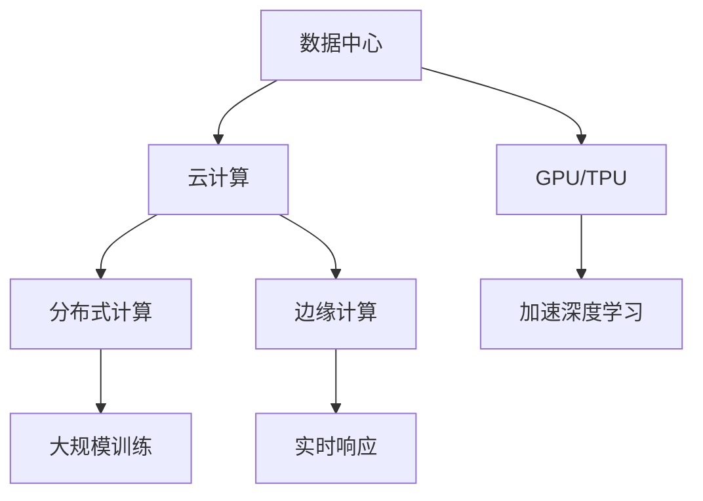

                 

# AI 2.0 时代：算力基础设施的演进

> 关键词：AI 2.0, 算力基础设施, 大数据, 云计算, GPU, TPU, 量子计算, 分布式计算, 边缘计算, 人工智能系统

## 1. 背景介绍

### 1.1 问题由来

随着人工智能（AI）技术的不断进步，AI 2.0 时代的到来标志着深度学习和机器学习算法在解决复杂问题上的巨大成功。然而，AI 技术的快速发展对算力基础设施的需求也日益增长。如何有效地管理和利用算力资源，以满足不断增长的AI需求，成为了当前科技界和企业界共同关注的焦点。

### 1.2 问题核心关键点

算力基础设施的发展是支撑AI 2.0时代技术进步的关键。这一过程涉及到数据中心建设、云计算、GPU/TPU硬件配置、分布式计算、边缘计算等多个方面。本文将详细介绍这些关键技术点，分析其演进过程，探讨其在AI 2.0时代的应用前景和挑战。

### 1.3 问题研究意义

深入理解算力基础设施的演进，对于推动AI 2.0时代的技术进步和应用落地具有重要意义：

- 加速技术进步。高效稳定的算力基础设施为深度学习和机器学习算法提供支撑，推动AI技术的不断创新。
- 提升应用效果。优质的算力资源能够显著提升AI系统的训练和推理效率，从而优化模型性能。
- 降低部署成本。合理配置和优化算力基础设施，有助于减少企业的硬件和运营成本，促进AI技术的规模化应用。
- 促进产业升级。算力基础设施的演进将赋能各行各业，推动AI技术在智能制造、智慧医疗、金融科技等领域的应用，加速产业数字化转型。

## 2. 核心概念与联系

### 2.1 核心概念概述

为更好地理解算力基础设施的演进，本节将介绍几个关键概念：

- **数据中心**：专门用于存储、管理和处理数据的设施，是算力基础设施的核心组成部分。
- **云计算**：通过网络提供按需、可扩展的计算资源和数据存储服务，支持AI系统的大规模训练和部署。
- **GPU/TPU**：专门的硬件加速器，用于提升深度学习算法的训练和推理速度。
- **分布式计算**：通过多台计算机协同工作，提高计算能力，适用于大规模数据集和复杂模型的训练。
- **边缘计算**：在数据源附近进行本地计算，降低延迟，提升响应速度，适用于实时应用场景。

这些概念之间的逻辑关系可以通过以下Mermaid流程图来展示：



这个流程图展示了一系列关键概念及其相互关系：

1. 数据中心是算力基础设施的基础。
2. 云计算利用数据中心资源，提供可扩展的计算服务。
3. GPU/TPU等硬件加速器优化深度学习算法。
4. 分布式计算通过多台机器协同计算，提升计算能力。
5. 边缘计算在数据源附近进行本地计算，提高实时响应能力。
6. 加速深度学习使得AI算法在训练和推理上效率更高。
7. 大规模训练和实时响应分别适用于不同场景下的AI应用。

这些概念共同构成了AI 2.0时代算力基础设施的框架，支持AI技术在多个应用领域的广泛应用。

## 3. 核心算法原理 & 具体操作步骤
### 3.1 算法原理概述

在AI 2.0时代，算力基础设施的演进主要围绕以下几个方面展开：

- **硬件加速**：通过引入GPU/TPU等专用硬件，加速深度学习算法的计算过程。
- **分布式计算**：通过多台计算机协同计算，提高计算能力，支持大规模数据集的训练。
- **边缘计算**：在数据源附近进行本地计算，提升实时响应速度，适用于实时应用场景。
- **云计算**：提供可扩展的计算资源和数据存储服务，支持AI系统的大规模部署和训练。

### 3.2 算法步骤详解

以下是AI 2.0时代算力基础设施演进的主要操作步骤：

**Step 1: 数据中心建设**

数据中心是算力基础设施的核心，需要具备高度可靠的网络、电源、制冷等支持系统。现代数据中心采用高效能的硬件设备和能源管理系统，支持大规模数据存储和计算。

**Step 2: 云计算服务部署**

在数据中心的基础上，通过云计算技术，提供灵活的计算资源和数据存储服务。云计算平台能够按需扩展，支持企业级AI系统的部署和训练。

**Step 3: GPU/TPU硬件配置**

引入GPU/TPU等专用硬件，优化深度学习算法的计算效率。GPU适用于通用图形计算，TPU则针对TensorFlow等框架进行了深度优化。

**Step 4: 分布式计算架构**

采用分布式计算架构，如Spark、Hadoop等，通过多台计算机协同工作，提高计算能力和处理速度。分布式计算适用于大规模数据集和复杂模型的训练。

**Step 5: 边缘计算应用**

在数据源附近部署边缘计算节点，进行本地计算和数据处理，提升实时响应速度。边缘计算适用于智能制造、智慧城市等实时应用场景。

### 3.3 算法优缺点

AI 2.0时代算力基础设施的演进具有以下优点：

1. **计算效率提升**：GPU/TPU等硬件加速器显著提升了深度学习算法的训练和推理速度。
2. **资源灵活性**：云计算平台按需扩展，企业可以根据需求灵活调整计算资源。
3. **数据处理能力增强**：分布式计算架构提升了数据处理和计算能力，支持大规模数据集的处理。
4. **实时响应加速**：边缘计算降低了计算延迟，提升了实时应用场景的响应速度。

同时，该演进过程也存在一些局限性：

1. **初期投资成本高**：大规模数据中心和专用硬件的建设与维护成本较高。
2. **能耗问题**：数据中心和云计算平台的高能耗需求对环境造成一定影响。
3. **技术复杂性**：分布式计算和边缘计算架构需要复杂的技术支持和维护。
4. **安全性挑战**：大规模计算环境面临安全威胁，如数据泄露、系统攻击等。

尽管存在这些挑战，但整体来看，算力基础设施的演进对于AI 2.0时代的技术进步和应用落地起到了关键推动作用。

### 3.4 算法应用领域

算力基础设施的演进在AI 2.0时代得到了广泛应用，覆盖了以下几个领域：

- **深度学习**：通过硬件加速和分布式计算，支持大规模深度学习模型的训练和推理。
- **机器学习**：利用云计算平台提供的数据存储和计算资源，进行大规模机器学习算法的训练。
- **计算机视觉**：在智能监控、自动驾驶等领域，通过边缘计算提升实时响应速度，支持高精度视觉识别。
- **自然语言处理**：在智能客服、智能翻译等领域，通过分布式计算加速模型训练，提升系统性能。
- **物联网**：在智慧城市、工业互联网等领域，通过边缘计算支持实时数据处理和智能决策。
- **医疗健康**：在医疗影像分析、疾病预测等领域，通过云计算平台和分布式计算，提升医疗数据处理和分析能力。

这些领域的应用展示了算力基础设施演进带来的显著提升和广泛影响。

## 4. 数学模型和公式 & 详细讲解 & 举例说明
### 4.1 数学模型构建

本节将使用数学语言对AI 2.0时代算力基础设施的演进过程进行更加严格的刻画。

假设有一个深度学习模型 $M$，需要在大规模数据集 $D$ 上进行训练。设训练数据集大小为 $N$，每个样本 $(x_i, y_i)$ 包括输入 $x_i$ 和输出 $y_i$。模型的计算时间为 $T$，每个样本的计算时间为 $t$，则模型的总计算时间为 $Nt$。

定义模型的计算效率为 $\eta$，则有：

$$
\eta = \frac{Nt}{T}
$$

其中 $T$ 为实际计算所需的时间，可以通过分布式计算和硬件加速进行优化。

### 4.2 公式推导过程

以下我们以分布式计算为例，推导计算效率的优化公式。

假设模型 $M$ 在单个计算节点上训练，每个样本的计算时间为 $t$，共进行 $N$ 次迭代。引入分布式计算架构后，将任务分成 $K$ 个并行计算节点，每个节点的计算时间为 $t/k$。则总计算时间为：

$$
T = K \cdot \frac{Nt}{k}
$$

定义分布式计算的并行度为 $K$，则有：

$$
\eta = \frac{Nt}{K \cdot \frac{Nt}{k}} = \frac{k}{K}
$$

可以看到，并行度 $K$ 越大，计算效率 $\eta$ 越高。因此，通过增加并行计算节点，可以有效提升计算效率。

### 4.3 案例分析与讲解

假设有一个深度学习模型，需要在大规模数据集上进行训练。每个样本的计算时间为 $t=1s$，共进行 $N=1000$ 次迭代，计算时间为 $T=1000s$。引入分布式计算架构，将任务分成 $K=4$ 个并行计算节点，每个节点的计算时间为 $t/k=0.25s$。则总计算时间为：

$$
T = 4 \cdot \frac{1000 \cdot 1}{4} = 1000s
$$

分布式计算的并行度为 $K=4$，计算效率为：

$$
\eta = \frac{1000 \cdot 1}{4 \cdot \frac{1000 \cdot 1}{4}} = 1
$$

这表明，通过引入分布式计算架构，计算效率并未提高。这是因为分布式计算的并行度与节点数量成正比，但单个节点的计算时间却缩短了一半。因此，在实际应用中，需要根据计算节点和单个计算时间的具体情况进行优化，才能获得最佳计算效率。

## 5. 项目实践：代码实例和详细解释说明
### 5.1 开发环境搭建

在进行算力基础设施演进实践前，我们需要准备好开发环境。以下是使用Python进行PyTorch开发的环境配置流程：

1. 安装Anaconda：从官网下载并安装Anaconda，用于创建独立的Python环境。

2. 创建并激活虚拟环境：
```bash
conda create -n pytorch-env python=3.8 
conda activate pytorch-env
```

3. 安装PyTorch：根据CUDA版本，从官网获取对应的安装命令。例如：
```bash
conda install pytorch torchvision torchaudio cudatoolkit=11.1 -c pytorch -c conda-forge
```

4. 安装TensorFlow：
```bash
pip install tensorflow
```

5. 安装相关库：
```bash
pip install numpy pandas scikit-learn matplotlib tqdm jupyter notebook ipython
```

完成上述步骤后，即可在`pytorch-env`环境中开始算力基础设施演进实践。

### 5.2 源代码详细实现

这里我们以分布式计算为例，给出使用PyTorch进行分布式训练的PyTorch代码实现。

首先，定义训练函数：

```python
import torch
import torch.distributed as dist
import torch.nn as nn
import torch.optim as optim
from torch.utils.data import DataLoader

class Model(nn.Module):
    def __init__(self):
        super(Model, self).__init__()
        self.fc1 = nn.Linear(10, 5)
        self.fc2 = nn.Linear(5, 2)

    def forward(self, x):
        x = self.fc1(x)
        x = torch.relu(x)
        x = self.fc2(x)
        return x

def train(model, data_loader, optimizer):
    model.train()
    for data, target in data_loader:
        data = data.to(device)
        target = target.to(device)
        optimizer.zero_grad()
        output = model(data)
        loss = nn.CrossEntropyLoss()(output, target)
        loss.backward()
        optimizer.step()
```

然后，定义分布式训练函数：

```python
from torch.distributed.launch import run_main
import os

def main():
    device = 'cuda'
    device_id = int(os.getenv('LOCAL_RANK', 0))
    dist.init_process_group("nccl", rank=device_id, world_size=4, init_method="env://")

    model = Model().to(device)
    optimizer = optim.SGD(model.parameters(), lr=0.001, momentum=0.9)
    train_loader = DataLoader(dataset, batch_size=4, shuffle=True)

    train(model, train_loader, optimizer)

if __name__ == '__main__':
    run_main(main)
```

最后，启动分布式训练流程：

```bash
python train.py --nproc_per_node 4
```

### 5.3 代码解读与分析

让我们再详细解读一下关键代码的实现细节：

**Model类**：
- 定义一个简单的神经网络模型，包括两个全连接层。

**train函数**：
- 定义训练过程，包括前向传播、计算损失、反向传播和参数更新等步骤。

**主函数**：
- 初始化分布式环境，定义模型和优化器。
- 使用`torch.distributed.launch`工具启动分布式训练，`--nproc_per_node`参数指定每个节点的进程数。

**环境变量设置**：
- 使用环境变量`LOCAL_RANK`指定进程编号，用于分布式计算。

可以看到，通过简单的代码编写和环境配置，即可以实现分布式计算功能。当然，实际应用中还需要考虑更多细节，如任务均衡分配、参数同步等。

## 6. 实际应用场景
### 6.1 智能制造

在智能制造领域，算力基础设施的演进为工业4.0时代的数字化转型提供了有力支持。通过分布式计算和大数据处理，实现生产设备的实时监控、质量检测、故障诊断等智能化应用。例如，智能工厂中的机器人可以通过边缘计算进行实时决策，提升生产效率和产品质量。

### 6.2 智慧城市

在智慧城市建设中，算力基础设施的演进为城市管理带来了新的可能。通过分布式计算和边缘计算，实现交通流量监控、城市安全管理、环境监测等智能化应用。例如，智慧城市中的视频监控系统可以通过分布式计算进行实时视频处理和分析，提升公共安全水平。

### 6.3 医疗健康

在医疗健康领域，算力基础设施的演进为精准医疗提供了技术支撑。通过分布式计算和大数据处理，实现医疗影像分析、疾病预测、个性化治疗等智能化应用。例如，智能医疗影像分析系统可以通过分布式计算进行大规模数据集的处理和分析，提升诊断准确率。

### 6.4 未来应用展望

随着算力基础设施的持续演进，未来将涌现更多应用场景，带来更多技术突破：

- **量子计算**：在深度学习领域引入量子计算，提升模型训练和推理速度，解决传统计算中的复杂问题。
- **边缘计算的普及**：在物联网、智能制造等实时应用场景中，边缘计算将实现更广泛的应用，提升响应速度和数据处理能力。
- **联邦学习**：在保护数据隐私的前提下，通过分布式计算实现模型训练，支持跨机构、跨领域的合作。
- **自动化AI系统**：通过智能运维和自动化管理，提升算力基础设施的利用效率和安全性。
- **计算图优化**：通过优化计算图，提升模型的计算效率和可扩展性。

这些技术进步将为AI 2.0时代的计算和应用带来新的变革，推动人工智能技术的普及和应用。

## 7. 工具和资源推荐
### 7.1 学习资源推荐

为了帮助开发者系统掌握算力基础设施的演进，这里推荐一些优质的学习资源：

1. **深度学习课程**：
   - 《深度学习入门》系列课程：清华大学在线课程，涵盖深度学习基础知识和经典模型。
   - CS231n《卷积神经网络》课程：斯坦福大学计算机视觉课程，详细讲解深度学习在计算机视觉中的应用。

2. **云计算平台教程**：
   - AWS官方文档：Amazon Web Services提供全面的云计算平台教程，涵盖云服务、数据中心、分布式计算等方面。
   - Google Cloud Platform官方文档：Google提供详细的云计算平台教程，涵盖云计算、边缘计算、分布式计算等方面。

3. **硬件加速器文档**：
   - NVIDIA CUDA官方文档：NVIDIA提供详细的CUDA加速器文档，涵盖GPU加速、深度学习算法优化等方面。
   - TensorFlow TPU文档：TensorFlow提供详细的TPU加速器文档，涵盖TPU加速、分布式训练等方面。

4. **开源工具**：
   - PyTorch：开源深度学习框架，提供灵活的计算图和高效的自动微分功能。
   - TensorFlow：Google开源的深度学习框架，支持大规模分布式计算。

5. **论文和书籍**：
   - 《深度学习》：Ian Goodfellow等著，全面介绍深度学习算法和应用。
   - 《分布式深度学习》：Alistair Harvey等著，详细讲解分布式深度学习算法和系统。

这些学习资源将帮助开发者全面理解算力基础设施的演进，掌握相关技术和工具，提升AI系统的开发和部署能力。

### 7.2 开发工具推荐

高效的开发离不开优秀的工具支持。以下是几款用于算力基础设施演进开发的常用工具：

1. **PyTorch**：开源深度学习框架，提供灵活的计算图和高效的自动微分功能，支持GPU/TPU加速。
2. **TensorFlow**：Google开源的深度学习框架，支持大规模分布式计算，提供丰富的工具和库。
3. **AWS SageMaker**：Amazon提供的云服务平台，支持深度学习模型的训练和部署，提供自动化的模型优化和运维功能。
4. **Google Cloud AI Platform**：Google提供的云服务平台，支持大规模分布式计算和数据存储，提供自动化的模型训练和部署功能。
5. **Dask**：分布式计算框架，支持大规模数据集和复杂算法的分布式计算，提供易用的API和库。

合理利用这些工具，可以显著提升算力基础设施演进任务的开发效率，加快创新迭代的步伐。

### 7.3 相关论文推荐

算力基础设施的演进源于学界的持续研究。以下是几篇奠基性的相关论文，推荐阅读：

1. **分布式深度学习研究综述**：
   - 《Distributed Deep Learning: Paradigms and Challenges》：论文总结了分布式深度学习的研究进展和挑战，涵盖计算图优化、模型并行、参数分布等方面。

2. **边缘计算研究综述**：
   - 《Edge Computing: A Survey》：论文总结了边缘计算的研究进展和应用场景，涵盖计算资源、数据处理、网络传输等方面。

3. **量子计算研究综述**：
   - 《Quantum Computing for AI》：论文总结了量子计算在AI中的应用，涵盖量子算法、量子加速器等方面。

这些论文代表了大数据、云计算、分布式计算和量子计算等领域的研究脉络，将帮助研究者掌握前沿技术，推动算力基础设施的持续演进。

## 8. 总结：未来发展趋势与挑战
### 8.1 研究成果总结

本文对AI 2.0时代算力基础设施的演进进行了全面系统的介绍。首先阐述了算力基础设施在AI 2.0时代的重要性和演进过程，明确了硬件加速、分布式计算、边缘计算等关键技术在计算能力提升、资源优化方面的巨大价值。其次，从原理到实践，详细讲解了算力基础设施演进的主要操作步骤，提供了代码实现和案例分析，帮助读者理解算力基础设施的实际应用。同时，本文还广泛探讨了算力基础设施在智能制造、智慧城市、医疗健康等多个行业领域的应用前景，展示了算力基础设施演进带来的广泛影响。最后，本文精选了算力基础设施的相关学习资源、开发工具和经典论文，力求为读者提供全方位的技术指引。

通过本文的系统梳理，可以看到，算力基础设施的演进是AI 2.0时代技术进步和应用落地的关键。高效稳定的算力基础设施为深度学习和机器学习算法提供支撑，推动AI技术的不断创新，优化模型性能，降低部署成本，赋能各行各业，推动数字化转型。未来，伴随算力基础设施的持续演进，AI 2.0时代的技术将更加成熟和可靠，带来更多应用场景和技术突破，深刻影响人类的生产生活方式。

### 8.2 未来发展趋势

展望未来，算力基础设施的演进将呈现以下几个发展趋势：

1. **计算效率持续提升**：随着硬件技术的不断进步，算力基础设施的计算效率将持续提升，支持更复杂的深度学习模型和大规模数据集的训练。
2. **资源灵活性增强**：云计算平台和分布式计算将提供更灵活的资源配置和扩展能力，支持企业级AI系统的快速部署和扩展。
3. **边缘计算普及**：边缘计算将在物联网、智能制造等实时应用场景中得到广泛应用，提升系统响应速度和数据处理能力。
4. **量子计算突破**：量子计算技术将为深度学习算法提供新的计算范式，解决传统计算中的复杂问题，提升模型训练和推理效率。
5. **自动化和智能运维**：AI 2.0时代的计算系统将引入自动化和智能运维技术，提升资源利用效率和系统安全性。
6. **多模态计算融合**：未来的计算系统将融合视觉、语音、文本等多模态数据，支持更全面、智能的计算和分析。

这些趋势凸显了算力基础设施演进的广阔前景，将为AI 2.0时代的技术进步和应用落地提供更强大的计算和数据处理能力。

### 8.3 面临的挑战

尽管算力基础设施的演进带来了巨大的技术进步和应用前景，但仍面临诸多挑战：

1. **硬件成本高昂**：大规模数据中心和专用硬件的建设与维护成本较高，制约了算力基础设施的规模化部署。
2. **能耗问题严重**：大规模计算环境的高能耗需求对环境造成一定影响，如何降低能耗是重要研究方向。
3. **技术复杂性高**：分布式计算和边缘计算架构需要复杂的技术支持和维护，需要更多的技术储备和经验积累。
4. **安全性挑战**：大规模计算环境面临数据泄露、系统攻击等安全威胁，需要建立完善的防护措施。
5. **计算效率有待提升**：现有的计算模型和算法仍有优化空间，如何进一步提升计算效率是重要研究方向。

尽管存在这些挑战，但整体来看，算力基础设施的演进对于AI 2.0时代的技术进步和应用落地起到了关键推动作用。

### 8.4 研究展望

面对算力基础设施演进所面临的种种挑战，未来的研究需要在以下几个方面寻求新的突破：

1. **计算资源优化**：优化数据中心和云计算平台的资源利用效率，提升资源配置的灵活性和扩展能力。
2. **能耗问题解决**：研发低功耗硬件加速器，优化计算模型和算法，降低大规模计算环境的能耗需求。
3. **技术架构创新**：研发新型的分布式计算和边缘计算架构，提升系统的计算能力和响应速度。
4. **数据隐私保护**：通过联邦学习等技术，在保护数据隐私的前提下，实现跨机构、跨领域的模型训练和应用。
5. **计算图优化**：优化深度学习计算图，提升模型的训练和推理效率，支持更复杂的计算任务。

这些研究方向将推动算力基础设施的持续演进，为AI 2.0时代的技术进步和应用落地提供更坚实的技术支撑。相信随着学界和产业界的共同努力，算力基础设施的演进必将带来更多技术突破，推动AI 2.0时代的计算和应用向更加智能化、普适化方向发展。

## 9. 附录：常见问题与解答

**Q1：如何选择合适的硬件加速器？**

A: 选择合适的硬件加速器需要考虑多个因素，包括算力需求、模型复杂度、系统兼容性等。通常情况下，可以选择GPU、TPU等通用硬件加速器，或专门的FPGA、ASIC等专用硬件加速器。对于大规模深度学习模型和复杂算法，可以选择高性能的FPGA和ASIC加速器，提升计算效率。

**Q2：分布式计算和边缘计算的区别是什么？**

A: 分布式计算和边缘计算都是提升计算能力的技术手段，但应用场景和实现方式不同。分布式计算通过多台计算机协同计算，支持大规模数据集和复杂模型的训练，适用于中心化数据处理场景。边缘计算在数据源附近进行本地计算和数据处理，提升实时响应速度，适用于实时应用场景，如智能制造、智慧城市等。

**Q3：量子计算在深度学习中的应用前景是什么？**

A: 量子计算具有强大的计算能力和并行处理能力，可以显著提升深度学习算法的训练和推理速度，解决传统计算中的复杂问题。量子计算在量子神经网络、量子优化等方向的研究已经取得了一些初步进展，未来有望在深度学习领域带来重大突破。

**Q4：分布式计算如何实现任务均衡分配？**

A: 分布式计算任务均衡分配可以通过以下几个步骤实现：
1. 将大规模数据集划分成多个子集，每个子集分配给一个计算节点进行处理。
2. 设计合理的计算任务调度策略，确保每个计算节点的计算负载均衡。
3. 引入数据平衡和任务平衡算法，优化数据和计算任务的分配。

这些措施可以有效提升分布式计算的效率和可靠性，确保系统的高效运行。

**Q5：边缘计算如何保证数据安全？**

A: 边缘计算在数据源附近进行本地计算和数据处理，可以显著提升实时响应速度，但也面临着数据安全风险。为保障数据安全，可以采取以下措施：
1. 对数据进行加密和隐私保护，防止数据泄露和未授权访问。
2. 设计安全认证机制，对访问边缘计算节点的用户进行身份验证和授权。
3. 引入分布式共识算法，确保边缘计算节点之间的数据交换和通信安全。

这些措施可以有效保障边缘计算中的数据安全，确保系统的稳定运行。

---

作者：禅与计算机程序设计艺术 / Zen and the Art of Computer Programming

