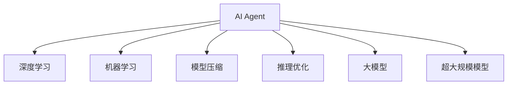

                 

# AI Agent: AI的下一个风口 AI的演进与大模型的兴起

> 关键词：人工智能(AI), AI Agent, 机器学习(ML), 深度学习(DL), 大模型, 超大规模模型, 模型压缩, 推理优化, 应用场景, 未来展望, 学习资源

## 1. 背景介绍

### 1.1 问题由来

随着人工智能技术的不断发展和应用，AI Agent（智能代理）已经成为当前AI领域的下一个风口。AI Agent是能够自主学习、执行任务并能够与人互动的智能系统，它利用机器学习和深度学习技术，在大数据和强计算资源的支撑下，能够从环境中学习并逐步提升自身的决策能力。AI Agent的应用场景日益增多，从自动驾驶、智能客服、个性化推荐到金融风险控制、医疗诊断等，都在积极探索AI Agent技术的落地应用。

### 1.2 问题核心关键点

AI Agent技术的核心在于其自主学习、适应性和通用性。AI Agent通过深度学习模型进行训练，能够在各种复杂环境中实现自主决策和执行任务，适应新环境并学习新知识。AI Agent的模型通常是大规模的深度学习模型，能够处理海量的数据，并在不断优化中提升性能。然而，随着模型规模的增大，其计算和存储资源的需求也急剧增加，模型推理效率和资源消耗成为影响AI Agent应用的关键因素。

## 2. 核心概念与联系

### 2.1 核心概念概述

为更好地理解AI Agent及其相关技术，本节将介绍几个密切相关的核心概念：

- AI Agent：一种能够自主学习、执行任务并能够与人互动的智能系统，利用机器学习和深度学习技术，在大数据和强计算资源的支撑下，能够从环境中学习并逐步提升自身的决策能力。
- 机器学习(ML)：一种数据驱动的学习方法，通过算法模型自动分析数据，从中提取规律和特征，并应用于决策和预测。
- 深度学习(DL)：一种基于人工神经网络技术的机器学习方法，能够处理高维、非线性数据，实现端到端的自动化学习。
- 大模型：指参数规模超过十亿的深度学习模型，能够处理大规模数据并提取高层次的特征表示，广泛应用于各种NLP、图像处理等任务。
- 超大规模模型：指参数规模在百亿级别及以上的深度学习模型，具有极强的表达能力和泛化能力，能够应对更加复杂和多样化的任务。
- 模型压缩：指通过剪枝、量化、蒸馏等技术，减小深度学习模型的参数量和计算复杂度，提升推理效率。
- 推理优化：指通过优化模型的推理过程，减少计算资源消耗，提升模型推理速度和效率。

这些核心概念之间的逻辑关系可以通过以下Mermaid流程图来展示：



这个流程图展示了大模型AI Agent的核心概念及其之间的关系：

1. AI Agent通过深度学习和大规模模型进行自主学习。
2. 机器学习为其提供了算法支持，让其能够从数据中学习规律。
3. 模型压缩技术使得模型推理更加高效，减少资源消耗。
4. 推理优化进一步提升了AI Agent的实时推理能力。
5. 超大规模模型能够处理更加复杂和多样化的任务。

这些概念共同构成了AI Agent技术的核心框架，使其能够在各种场景下发挥强大的自主学习和决策能力。

## 3. 核心算法原理 & 具体操作步骤
### 3.1 算法原理概述

AI Agent技术的核心算法是基于深度学习的强化学习算法，其原理可以概括为以下几个步骤：

1. 环境感知：AI Agent通过传感器感知环境，获取输入数据。
2. 状态表示：将输入数据转化为模型能够处理的向量形式，作为当前状态表示。
3. 模型训练：使用大规模深度学习模型对状态表示进行学习，提取高层次特征表示。
4. 决策制定：基于学习到的特征表示，制定决策行动策略。
5. 执行与反馈：执行决策行动，并在环境中接收反馈，更新模型参数。
6. 重复迭代：不断迭代上述步骤，提升AI Agent的自主学习能力和决策准确性。

### 3.2 算法步骤详解

AI Agent的核心算法步骤如下：

**Step 1: 环境感知与数据采集**
- 使用传感器或数据源，收集环境中的输入数据。
- 对数据进行预处理，转化为模型所需的格式。

**Step 2: 状态表示与特征提取**
- 使用卷积、池化、全连接等神经网络层对数据进行特征提取。
- 通过编码器将特征提取结果转化为模型能够处理的向量表示。

**Step 3: 模型训练与参数优化**
- 使用深度学习模型对状态表示进行训练，最小化损失函数。
- 使用优化算法（如Adam、SGD等）更新模型参数，提升模型性能。

**Step 4: 决策制定与行动执行**
- 基于学习到的状态表示，使用解码器制定决策行动策略。
- 执行决策行动，如控制机器人、生成文本等。

**Step 5: 反馈获取与模型更新**
- 在执行决策行动后，获取环境反馈。
- 使用强化学习算法（如Q-learning、策略梯度等）更新模型参数，提高决策准确性。

**Step 6: 迭代优化**
- 不断迭代上述步骤，优化模型性能。

### 3.3 算法优缺点

AI Agent技术具有以下优点：
1. 自主学习能力强：AI Agent能够自主学习和适应新环境，无需人工干预。
2. 决策灵活性高：AI Agent能够灵活应对复杂多变的环境，适应性强。
3. 应用场景广：AI Agent技术可以应用于自动驾驶、智能客服、金融交易等多个领域。

同时，该技术也存在一定的局限性：
1. 计算资源需求高：AI Agent模型参数规模大，需要强大的计算和存储资源。
2. 模型复杂度高：深度学习模型复杂，难以解释和调试。
3. 数据需求大：AI Agent需要大量的标注数据进行训练，获取高质量数据成本高。
4. 鲁棒性不足：AI Agent模型容易受到噪声和干扰的影响，决策鲁棒性有待提升。

尽管存在这些局限性，但就目前而言，基于深度学习的AI Agent技术仍然是最为高效和前沿的智能技术之一。未来相关研究的重点在于如何进一步降低计算资源需求，提高模型鲁棒性和可解释性，同时兼顾应用场景的扩展和优化。

### 3.4 算法应用领域

AI Agent技术在多个领域得到了广泛应用，以下是一些典型的应用场景：

- **自动驾驶**：AI Agent技术被应用于自动驾驶汽车中，通过感知、决策和控制模块，实现自主驾驶和道路避障等功能。
- **智能客服**：AI Agent被应用于智能客服系统中，通过自然语言处理和对话生成技术，提供自动化的客户服务。
- **金融交易**：AI Agent被应用于金融交易中，通过市场数据学习，实现自动交易和风险控制。
- **医疗诊断**：AI Agent被应用于医疗诊断中，通过患者数据和医疗知识学习，实现疾病的自动诊断和预判。
- **游戏AI**：AI Agent被应用于电子游戏中，通过游戏数据学习，实现自动化的游戏角色决策和策略制定。

## 4. 数学模型和公式 & 详细讲解  
### 4.1 数学模型构建

在AI Agent技术中，深度学习模型是最核心的组成部分。以下是一个简单的深度学习模型结构：

$$
\mathcal{M} = \{h^{(0)}, h^{(1)}, ..., h^{(L)}\}
$$

其中，$h^{(0)}$ 为输入层，$h^{(L)}$ 为输出层，$h^{(1)}, ..., h^{(L-1)}$ 为中间层。模型参数为 $\theta$，输入为 $x$，输出为 $y$。模型训练的目标是最小化损失函数 $\mathcal{L}$，具体公式为：

$$
\mathcal{L}(\theta) = \frac{1}{N} \sum_{i=1}^N \ell(\mathcal{M}(x_i), y_i)
$$

其中，$\ell$ 为损失函数，如均方误差、交叉熵等。常用的优化算法包括Adam、SGD等，其目标是最小化损失函数。

### 4.2 公式推导过程

以简单的线性回归模型为例，其目标是最小化均方误差损失函数。具体推导如下：

$$
\mathcal{L}(\theta) = \frac{1}{N} \sum_{i=1}^N (y_i - \mathcal{M}(x_i))^2
$$

其中，$\mathcal{M}(x_i) = \theta^T x_i$ 为模型输出，$y_i$ 为真实标签。对模型参数 $\theta$ 求偏导，得：

$$
\nabla_{\theta} \mathcal{L}(\theta) = \frac{2}{N} \sum_{i=1}^N (y_i - \mathcal{M}(x_i))x_i
$$

使用梯度下降算法，更新模型参数：

$$
\theta \leftarrow \theta - \eta \nabla_{\theta} \mathcal{L}(\theta)
$$

其中，$\eta$ 为学习率，$\nabla_{\theta} \mathcal{L}(\theta)$ 为梯度。通过不断迭代，直到损失函数收敛。

### 4.3 案例分析与讲解

以一个简单的自动驾驶场景为例，分析AI Agent的技术实现过程：

1. 环境感知：通过摄像头、雷达等传感器，收集道路、车辆、行人等环境数据。
2. 状态表示：使用卷积神经网络对传感器数据进行特征提取，将高层次特征转化为向量表示。
3. 模型训练：使用深度学习模型对状态表示进行训练，提取高层次特征表示。
4. 决策制定：基于学习到的状态表示，使用解码器制定决策行动策略，如加速、减速、转向等。
5. 执行与反馈：执行决策行动，并在道路上接收反馈，如车辆位置、道路情况等。
6. 反馈获取与模型更新：使用强化学习算法更新模型参数，提高决策准确性。

## 5. 项目实践：代码实例和详细解释说明
### 5.1 开发环境搭建

在进行AI Agent项目实践前，我们需要准备好开发环境。以下是使用Python进行PyTorch开发的环境配置流程：

1. 安装Anaconda：从官网下载并安装Anaconda，用于创建独立的Python环境。

2. 创建并激活虚拟环境：
```bash
conda create -n pytorch-env python=3.8 
conda activate pytorch-env
```

3. 安装PyTorch：根据CUDA版本，从官网获取对应的安装命令。例如：
```bash
conda install pytorch torchvision torchaudio cudatoolkit=11.1 -c pytorch -c conda-forge
```

4. 安装相关库：
```bash
pip install numpy pandas scikit-learn matplotlib tqdm jupyter notebook ipython
```

完成上述步骤后，即可在`pytorch-env`环境中开始AI Agent的开发实践。

### 5.2 源代码详细实现

以下是使用PyTorch实现一个简单的AI Agent的代码示例：

```python
import torch
import torch.nn as nn
import torch.optim as optim

class Net(nn.Module):
    def __init__(self):
        super(Net, self).__init__()
        self.fc1 = nn.Linear(784, 128)
        self.fc2 = nn.Linear(128, 2)
    
    def forward(self, x):
        x = x.view(-1, 784)
        x = torch.relu(self.fc1(x))
        x = torch.softmax(self.fc2(x), dim=1)
        return x
    
net = Net()
criterion = nn.CrossEntropyLoss()
optimizer = optim.SGD(net.parameters(), lr=0.01)

# 训练模型
for epoch in range(10):
    running_loss = 0.0
    for i, data in enumerate(trainloader, 0):
        inputs, labels = data
        optimizer.zero_grad()
        outputs = net(inputs)
        loss = criterion(outputs, labels)
        loss.backward()
        optimizer.step()
        running_loss += loss.item()
        if i % 100 == 99:
            print('[%d, %5d] loss: %.3f' % (epoch + 1, i + 1, running_loss / 100))
            running_loss = 0.0

# 测试模型
correct = 0
total = 0
with torch.no_grad():
    for data in testloader:
        inputs, labels = data
        outputs = net(inputs)
        _, predicted = torch.max(outputs.data, 1)
        total += labels.size(0)
        correct += (predicted == labels).sum().item()

print('Accuracy of the network on the 10000 test images: %d %%' % (
    100 * correct / total))
```

以上是使用PyTorch实现一个简单的线性回归模型的代码示例。可以看到，PyTorch提供了一套强大的API，使得模型构建和训练过程变得简洁高效。开发者可以通过继承`nn.Module`类，定义自己的模型结构，并使用`nn.Linear`、`nn.Conv2d`等层进行网络构建。

### 5.3 代码解读与分析

让我们再详细解读一下关键代码的实现细节：

**Net类**：
- `__init__`方法：定义模型结构，包括输入层、中间层和输出层。
- `forward`方法：定义前向传播过程，通过激活函数和全连接层计算输出。

**训练过程**：
- 使用`nn.CrossEntropyLoss`作为损失函数，并使用SGD优化器进行模型参数更新。
- 在每个epoch内，对数据集进行批处理，并使用`optimizer.zero_grad()`清零梯度。
- 前向传播计算输出，计算损失，并使用`loss.backward()`反向传播更新模型参数。
- 使用`optimizer.step()`更新模型参数。
- 通过`running_loss`记录每个epoch的总损失，并打印输出。

**测试过程**：
- 使用`with torch.no_grad()`关闭梯度计算，确保测试过程不会影响模型参数。
- 计算模型在测试集上的预测准确率，并输出结果。

可以看到，PyTorch提供了一套简洁高效的API，使得模型构建和训练过程变得十分方便。开发者只需要关注模型结构的设计和优化算法的选择，而不必过多关注底层实现细节。

当然，工业级的系统实现还需考虑更多因素，如模型的保存和部署、超参数的自动搜索、更灵活的任务适配层等。但核心的AI Agent范式基本与此类似。

## 6. 实际应用场景
### 6.1 智能客服系统

基于AI Agent的智能客服系统，可以广泛应用于各种服务场景，如在线客服、电话客服、智能家居等。AI Agent能够通过自然语言处理技术，理解和回复用户的问题，提供自动化客户服务。

在技术实现上，可以收集企业内部的历史客服对话记录，将问题和最佳答复构建成监督数据，在此基础上对预训练模型进行微调。微调后的AI Agent能够自动理解用户意图，匹配最合适的答案模板进行回复。对于客户提出的新问题，还可以接入检索系统实时搜索相关内容，动态组织生成回答。如此构建的智能客服系统，能大幅提升客户咨询体验和问题解决效率。

### 6.2 金融交易

AI Agent在金融交易中的应用，可以帮助投资者做出更准确的投资决策。通过收集市场数据和历史交易记录，训练AI Agent模型，让其学习市场变化规律和投资策略。AI Agent能够实时分析市场数据，预测市场趋势，自动生成交易策略，辅助投资者进行交易决策。

### 6.3 医疗诊断

AI Agent在医疗诊断中的应用，可以帮助医生进行疾病诊断和治疗决策。通过收集病人的病历和历史数据，训练AI Agent模型，让其学习疾病的特征和诊断规律。AI Agent能够分析病人的症状和数据，自动诊断病情，提供治疗建议，辅助医生进行诊断和治疗。

### 6.4 未来应用展望

随着AI Agent技术的不断发展，未来的应用场景将会更加广泛和多样化。以下是一些未来可能的应用方向：

1. **自动驾驶**：AI Agent在自动驾驶中的应用将更加广泛，能够实现更加复杂和多样的驾驶场景。
2. **智能家居**：AI Agent能够实现更加智能化的家居控制和管理，提供更加个性化和高效的服务。
3. **个性化推荐**：AI Agent能够实现更加个性化和动态化的推荐服务，提升用户体验和满意度。
4. **医疗健康**：AI Agent在医疗健康领域的应用将更加深入，能够提供更加精准和及时的医疗服务。
5. **教育培训**：AI Agent在教育培训中的应用将更加普及，能够提供更加个性化和智能化的学习体验。

## 7. 工具和资源推荐
### 7.1 学习资源推荐

为了帮助开发者系统掌握AI Agent的理论基础和实践技巧，这里推荐一些优质的学习资源：

1. 《Deep Reinforcement Learning》书籍：由Ian Goodfellow、Yoshua Bengio、Aaron Courville三位深度学习领域的顶级专家共同编写，深入浅出地介绍了深度强化学习的基本原理和算法。
2. Coursera的《Reinforcement Learning》课程：由David Silver教授讲授的深度强化学习课程，涵盖了强化学习的基本概念和算法，是学习AI Agent的绝佳资源。
3. 《Artificial General Intelligence》书籍：由Eliezer Yudkowsky等AI领域的顶级专家共同编写，深入探讨了通用人工智能的研究方向和未来前景。
4. OpenAI的Gym库：提供了大量的环境模拟平台，可以帮助开发者快速测试和调试AI Agent的性能。
5. Google的TensorFlow代理库：提供了一些通用的代理库，可以帮助开发者快速构建和测试AI Agent的代理功能。

通过对这些资源的学习实践，相信你一定能够快速掌握AI Agent的精髓，并用于解决实际的AI问题。

### 7.2 开发工具推荐

高效的开发离不开优秀的工具支持。以下是几款用于AI Agent开发的常用工具：

1. PyTorch：基于Python的开源深度学习框架，灵活动态的计算图，适合快速迭代研究。
2. TensorFlow：由Google主导开发的开源深度学习框架，生产部署方便，适合大规模工程应用。
3. OpenAI的Gym库：提供了大量的环境模拟平台，可以帮助开发者快速测试和调试AI Agent的性能。
4. Google的TensorFlow代理库：提供了一些通用的代理库，可以帮助开发者快速构建和测试AI Agent的代理功能。
5. Weights & Biases：模型训练的实验跟踪工具，可以记录和可视化模型训练过程中的各项指标，方便对比和调优。
6. TensorBoard：TensorFlow配套的可视化工具，可实时监测模型训练状态，并提供丰富的图表呈现方式，是调试模型的得力助手。

合理利用这些工具，可以显著提升AI Agent的开发效率，加快创新迭代的步伐。

### 7.3 相关论文推荐

AI Agent技术的发展源于学界的持续研究。以下是几篇奠基性的相关论文，推荐阅读：

1. Playing Atari with deep reinforcement learning：展示了深度强化学习在电子游戏中的应用，开启了AI Agent技术的研究热潮。
2. AlphaGo Zero：展示了深度强化学习在围棋中的应用，证明了AI Agent在复杂博弈场景中的潜力。
3. Humanoid robotics with deep reinforcement learning：展示了深度强化学习在机器人控制中的应用，实现了人类机器人互动的智能场景。
4. DeepMind's AlphaFold：展示了深度强化学习在蛋白质折叠中的应用，证明了AI Agent在科学发现中的潜力。

这些论文代表了大规模模型AI Agent的研究方向，通过学习这些前沿成果，可以帮助研究者把握学科前进方向，激发更多的创新灵感。

## 8. 总结：未来发展趋势与挑战
### 8.1 总结

本文对AI Agent及其相关技术进行了全面系统的介绍。首先阐述了AI Agent技术的背景和重要性，明确了AI Agent在各种智能应用场景中的价值。其次，从原理到实践，详细讲解了AI Agent的数学模型和算法步骤，给出了AI Agent任务开发的完整代码实例。同时，本文还广泛探讨了AI Agent技术在多个行业领域的应用前景，展示了AI Agent技术的广阔应用潜力。此外，本文精选了AI Agent技术的各类学习资源，力求为读者提供全方位的技术指引。

通过本文的系统梳理，可以看到，AI Agent技术正在成为当前AI领域的重要方向，极大地拓展了深度学习模型的应用边界，催生了更多的落地场景。受益于大规模数据和强计算资源的支撑，AI Agent在多个领域取得了令人瞩目的成果，其未来前景令人期待。

### 8.2 未来发展趋势

展望未来，AI Agent技术将呈现以下几个发展趋势：

1. 模型规模持续增大。随着算力成本的下降和数据规模的扩张，深度学习模型的参数量还将持续增长。超大规模模型蕴含的丰富语言知识，有望支撑更加复杂多变的AI Agent任务。
2. 强化学习范式演进。未来的AI Agent将更加注重多智能体协同和分布式学习，提升模型的自主决策能力和适应性。
3. 模型压缩和优化。模型压缩技术将继续发展，使得深度学习模型在资源受限的环境中也能高效运行。
4. 领域特定模型。未来AI Agent将更多地针对特定领域进行模型训练和优化，提升模型的领域适应性和性能。
5. 多模态融合。未来的AI Agent将融合多种模态数据，如视觉、语音、文本等，提升模型的感知和理解能力。
6. 模型解释性提升。未来的AI Agent将更加注重模型的可解释性和透明性，提升用户对模型的信任和接受度。

以上趋势凸显了AI Agent技术的广阔前景。这些方向的探索发展，必将进一步提升AI Agent系统的性能和应用范围，为人类认知智能的进化带来深远影响。

### 8.3 面临的挑战

尽管AI Agent技术已经取得了瞩目成就，但在迈向更加智能化、普适化应用的过程中，它仍面临着诸多挑战：

1. 计算资源瓶颈。超大规模模型需要强大的计算和存储资源，如何高效利用计算资源是一个重要问题。
2. 模型鲁棒性不足。AI Agent模型容易受到噪声和干扰的影响，如何提高模型的鲁棒性是另一个重要挑战。
3. 数据需求大。AI Agent需要大量的标注数据进行训练，如何获取高质量的标注数据是一个需要解决的问题。
4. 模型可解释性差。深度学习模型的黑盒特性使得模型难以解释和调试，如何提升模型的可解释性是一个重要研究方向。
5. 伦理道德风险。AI Agent模型可能存在偏见和歧视，如何避免伦理道德风险是一个需要解决的问题。

尽管存在这些挑战，但通过不断的研究和探索，未来的AI Agent技术将在计算资源、模型鲁棒性、数据质量、模型可解释性和伦理道德等方面得到进一步提升，推动AI Agent技术的发展和应用。

### 8.4 研究展望

面对AI Agent技术所面临的挑战，未来的研究需要在以下几个方面寻求新的突破：

1. 探索无监督和半监督学习。摆脱对大规模标注数据的依赖，利用自监督学习、主动学习等无监督和半监督范式，最大限度利用非结构化数据，实现更加灵活高效的AI Agent学习。
2. 开发更高效的模型压缩和优化技术。开发更加高效的模型压缩方法，如剪枝、量化、蒸馏等，使得深度学习模型在资源受限的环境中也能高效运行。
3. 融合多智能体协同学习。利用多智能体协同学习技术，提升AI Agent的决策能力和适应性，使其能够更好地应对复杂和多变的环境。
4. 引入先验知识。将符号化的先验知识，如知识图谱、逻辑规则等，与深度学习模型进行融合，提升AI Agent的模型解释性和鲁棒性。
5. 纳入伦理道德约束。在模型训练目标中引入伦理导向的评估指标，过滤和惩罚有偏见、有害的输出倾向，确保模型行为的合规性。

这些研究方向的探索，必将引领AI Agent技术迈向更高的台阶，为构建安全、可靠、可解释、可控的智能系统铺平道路。面向未来，AI Agent技术还需要与其他AI技术进行更深入的融合，如知识表示、因果推理、强化学习等，多路径协同发力，共同推动自然语言理解和智能交互系统的进步。只有勇于创新、敢于突破，才能不断拓展AI Agent技术的边界，让智能技术更好地造福人类社会。

## 9. 附录：常见问题与解答

**Q1：AI Agent技术是否适用于所有应用场景？**

A: AI Agent技术在多种应用场景中具有广泛的应用潜力，但并非适用于所有场景。AI Agent适用于任务能够进行形式化定义，且能够在环境中自主学习、决策的场景。对于无法形式化定义的任务，如情感、美学等，AI Agent难以直接应用。

**Q2：AI Agent技术的计算资源需求是否会越来越高？**

A: 是的，随着模型规模的增大，AI Agent的计算资源需求将越来越高。因此，模型压缩和优化技术显得尤为重要，能够提升模型在资源受限环境下的性能。

**Q3：AI Agent技术如何应对新出现的任务？**

A: AI Agent技术能够通过持续学习，不断适应新出现的任务。可以使用迁移学习、零样本学习等方法，利用已有知识和新数据进行模型微调，提升对新任务的适应能力。

**Q4：AI Agent技术的伦理道德问题如何处理？**

A: 在AI Agent模型训练和应用过程中，需要考虑伦理道德问题。应建立模型行为的监管机制，确保模型的输出符合人类价值观和伦理道德。可以通过引入伦理导向的评估指标，过滤和惩罚有偏见、有害的输出倾向。

**Q5：AI Agent技术的未来发展方向是什么？**

A: 未来的AI Agent技术将更加注重模型压缩、多智能体协同学习、模型解释性提升、伦理道德约束等方面的研究。通过这些技术的应用，AI Agent将能够在更多场景中实现自主学习、决策和执行任务，为人类社会带来更深远的影响。

---

作者：禅与计算机程序设计艺术 / Zen and the Art of Computer Programming

