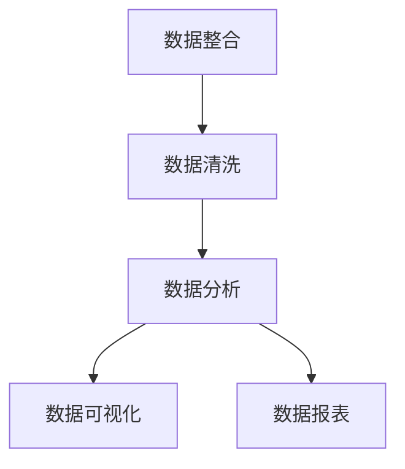

                 

# AI DMP 数据基建：数据可视化与报表

> 关键词：AI DMP, 数据可视化, 报表, 用户行为分析, 机器学习, 数据工程, 数据报表

## 1. 背景介绍

### 1.1 问题由来

在互联网时代，大数据驱动着各行各业的发展。尤其是广告行业，数据成为最重要的资源。传统的广告投放依赖于用户的粗略分类，难以做到精准投放。随着AI和大数据技术的发展，广告主可以通过数据挖掘和分析，获得更深入的用户洞察，从而实现精准营销。

AI DMP（Advanced AI Data Management Platform）是广告主用于数据管理和分析的重要工具。通过AI DMP，广告主可以整合多渠道、多设备的用户数据，进行用户画像分析、行为预测和个性化推荐。然而，数据分析结果的可视化展示，对于广告主来说至关重要。因此，AI DMP中的数据可视化与报表功能，成为其核心功能之一。

### 1.2 问题核心关键点

AI DMP中的数据可视化与报表功能，旨在帮助广告主更好地理解用户数据，发现市场趋势，进行精准营销决策。具体包括以下几个方面：

- 数据整合：整合多渠道、多设备的用户数据，形成一个统一的数据视图。
- 数据清洗：去除冗余和噪声数据，保证数据的准确性和一致性。
- 数据分析：通过机器学习和数据挖掘技术，进行用户画像分析、行为预测等。
- 数据可视化：将分析结果通过图形、图表等方式，直观地展示给广告主，帮助其做出决策。
- 数据报表：生成定期或定时的报表，以统计数据和图表的方式，展示用户行为、转化效果等关键指标。

这些功能共同构成了AI DMP数据基建的核心。通过这些功能，广告主可以更好地理解和利用用户数据，实现精准营销。

### 1.3 问题研究意义

AI DMP中的数据可视化与报表功能，对于广告主的精准营销决策具有重要意义：

1. **数据洞察**：通过数据可视化，广告主可以直观地理解用户行为和偏好，发现潜在机会和风险。
2. **决策支持**：数据报表提供关键指标的统计和分析，帮助广告主做出更加科学和合理的决策。
3. **用户画像**：基于用户行为数据的分析，广告主可以构建更加准确的用户画像，实现个性化营销。
4. **市场预测**：通过行为预测，广告主可以预测市场趋势，提前布局，抢占先机。
5. **实时监控**：数据可视化与实时监控结合，广告主可以实时跟踪营销效果，及时调整策略。

因此，AI DMP中的数据可视化与报表功能，是广告主进行精准营销的必备工具。

## 2. 核心概念与联系

### 2.1 核心概念概述

AI DMP中的数据可视化与报表功能，涉及多个核心概念：

- **数据整合**：通过ETL（Extract, Transform, Load）过程，将不同渠道和设备的用户数据整合到一个统一的数据库中。
- **数据清洗**：去除数据中的重复、噪声和异常值，保证数据的准确性和一致性。
- **数据分析**：使用机器学习和数据挖掘技术，进行用户画像分析、行为预测等。
- **数据可视化**：通过图表、仪表盘等方式，将分析结果直观地展示给用户。
- **数据报表**：生成定期或定时的报表，以统计数据和图表的方式，展示用户行为、转化效果等关键指标。

这些核心概念之间有着紧密的联系。数据整合和清洗是数据分析的基础，而数据分析又是数据可视化和报表生成的前提。数据可视化和报表则提供直观的展示和统计，帮助广告主更好地理解数据和做出决策。

### 2.2 核心概念原理和架构的 Mermaid 流程图



这个流程图展示了AI DMP数据基建的核心概念及其相互关系。数据整合和清洗是数据分析的基础，数据分析又是数据可视化和报表生成的前提。数据可视化和报表则提供直观的展示和统计，帮助广告主更好地理解数据和做出决策。

## 3. 核心算法原理 & 具体操作步骤

### 3.1 算法原理概述

AI DMP中的数据可视化与报表功能，主要依赖于数据清洗和机器学习等技术。其核心算法原理包括：

- **数据清洗**：通过去重、去噪、缺失值处理等技术，保证数据质量。
- **用户画像分析**：使用聚类、分类等机器学习算法，构建用户画像。
- **行为预测**：使用时间序列分析、回归等算法，预测用户行为。
- **数据可视化**：使用数据可视化技术，将分析结果展示为图形、图表等。
- **数据报表**：使用统计分析技术，生成关键指标的报表。

### 3.2 算法步骤详解

#### 3.2.1 数据整合

数据整合是AI DMP的第一步，其核心步骤包括：

1. **数据采集**：从不同的渠道和设备收集用户数据，如浏览器日志、移动应用数据等。
2. **数据集成**：将采集到的数据整合到一个统一的数据库中。可以使用ETL工具进行数据集成。
3. **数据同步**：确保数据在不同时间点的一致性。

#### 3.2.2 数据清洗

数据清洗是数据分析的基础，其核心步骤包括：

1. **去重**：去除数据中的重复记录。
2. **去噪**：去除数据中的噪声和异常值。
3. **缺失值处理**：处理数据中的缺失值。

#### 3.2.3 用户画像分析

用户画像分析是数据分析的重要内容，其核心步骤包括：

1. **特征提取**：从数据中提取有用的特征，如用户的年龄、性别、兴趣爱好等。
2. **聚类分析**：使用聚类算法，将用户分为不同的群体。
3. **分类分析**：使用分类算法，对用户进行分类。

#### 3.2.4 行为预测

行为预测是数据分析的重要应用，其核心步骤包括：

1. **时间序列分析**：使用时间序列分析算法，预测用户行为的变化趋势。
2. **回归分析**：使用回归算法，预测用户的行为结果。

#### 3.2.5 数据可视化

数据可视化是数据展示的重要方式，其核心步骤包括：

1. **选择合适的图表类型**：根据数据特点，选择合适的图表类型，如折线图、柱状图、散点图等。
2. **数据可视化**：将分析结果展示为图形、图表等。

#### 3.2.6 数据报表

数据报表是数据展示的重要工具，其核心步骤包括：

1. **统计分析**：对数据进行统计分析，计算关键指标。
2. **报表生成**：将统计结果生成报表，如用户行为报表、转化效果报表等。

### 3.3 算法优缺点

AI DMP中的数据可视化与报表功能，具有以下优点：

- **直观展示**：通过数据可视化，广告主可以直观地理解用户行为和偏好。
- **决策支持**：数据报表提供关键指标的统计和分析，帮助广告主做出更加科学和合理的决策。
- **实时监控**：数据可视化与实时监控结合，广告主可以实时跟踪营销效果，及时调整策略。

同时，该方法也存在一些缺点：

- **数据质量要求高**：数据清洗和整合需要高质量的数据，否则会影响分析结果的准确性。
- **技术复杂度高**：机器学习算法和数据可视化技术需要较高的技术门槛，对于普通广告主来说，可能存在一定的学习成本。
- **计算资源消耗大**：数据整合和清洗需要较大的计算资源，特别是在大数据环境下，计算资源消耗较大。

### 3.4 算法应用领域

AI DMP中的数据可视化与报表功能，在多个领域得到了广泛应用，例如：

- **广告投放**：通过数据可视化与报表，广告主可以实时监控广告效果，优化广告投放策略。
- **客户管理**：通过用户画像分析，广告主可以更好地理解客户需求，进行个性化推荐。
- **市场营销**：通过行为预测，广告主可以预测市场趋势，进行精准营销。
- **产品推荐**：通过用户画像分析，广告主可以构建精准的用户画像，进行个性化推荐。

这些应用场景展示了AI DMP中数据可视化与报表功能的强大实力，为广告主提供了精准营销的重要工具。

## 4. 数学模型和公式 & 详细讲解 & 举例说明

### 4.1 数学模型构建

AI DMP中的数据可视化与报表功能，涉及多个数学模型，包括数据清洗、聚类分析、时间序列分析、回归分析等。这里以用户画像分析为例，介绍相关的数学模型。

用户画像分析的核心数学模型包括：

- **K-means聚类算法**：将用户分为不同的群体。
- **协同过滤算法**：推荐系统中的算法，基于用户的行为进行推荐。
- **逻辑回归算法**：预测用户的行为结果。

### 4.2 公式推导过程

以K-means聚类算法为例，其公式推导如下：

1. **初始化**：随机选择K个初始质心$\mu_1, \mu_2, \ldots, \mu_K$。
2. **分配阶段**：将每个数据点分配到最近的质心，形成K个簇。
3. **更新阶段**：重新计算每个簇的质心$\mu_i$。
4. **收敛**：重复执行步骤2和步骤3，直到质心不再变化。

K-means聚类算法的伪代码如下：

```python
K = 3  # 簇的数量
num_clusters = K
iterations = 100  # 迭代次数

# 随机选择K个初始质心
clusters = [random.sample(data, k) for k in range(num_clusters)]

# 迭代更新质心
for iteration in range(iterations):
    for x in data:
        distances = [euclidean_distance(x, c) for c in clusters]
        cluster_index = distances.index(min(distances))
        clusters[cluster_index].append(x)

    # 更新质心
    for i in range(num_clusters):
        clusters[i] = np.mean(clusters[i], axis=0)

# 输出簇的质心
print(clusters)
```

### 4.3 案例分析与讲解

以某电商平台的用户行为数据为例，进行K-means聚类分析，将用户分为不同的群体。具体步骤如下：

1. **数据采集**：从电商平台收集用户行为数据，包括浏览记录、购买记录、评价记录等。
2. **数据清洗**：去除数据中的重复、噪声和异常值。
3. **特征提取**：从数据中提取有用的特征，如用户的浏览时间、购买频率、评价内容等。
4. **聚类分析**：使用K-means聚类算法，将用户分为不同的群体。
5. **分析结果**：根据聚类结果，广告主可以发现不同群体的用户行为特点，进行针对性营销。

## 5. 项目实践：代码实例和详细解释说明

### 5.1 开发环境搭建

AI DMP中的数据可视化与报表功能，需要一定的开发环境支持。以下是Python环境下的搭建步骤：

1. **安装Python**：从官网下载并安装Python，推荐使用Anaconda进行环境管理。
2. **安装PyTorch**：使用conda安装PyTorch库，支持数据处理和机器学习。
3. **安装Pandas和NumPy**：Pandas和NumPy是Python中的数据处理和数学计算库，用于数据清洗和分析。
4. **安装Matplotlib**：Matplotlib是Python中的数据可视化库，用于生成图形和图表。
5. **安装Scikit-learn**：Scikit-learn是Python中的机器学习库，用于聚类分析和行为预测。

### 5.2 源代码详细实现

以下是一个简单的Python代码实现，用于对电商平台用户行为数据进行K-means聚类分析：

```python
import pandas as pd
import numpy as np
from sklearn.cluster import KMeans
import matplotlib.pyplot as plt

# 加载数据
data = pd.read_csv('user_behavior_data.csv')

# 数据清洗
data = data.drop_duplicates()
data = data.dropna()

# 特征提取
features = ['browsing_time', 'purchase_frequency', 'review_content']
data = data[features]

# K-means聚类分析
kmeans = KMeans(n_clusters=3, random_state=0)
kmeans.fit(data)

# 分析结果
clusters = kmeans.labels_
num_clusters = len(np.unique(clusters))

# 可视化结果
for i in range(num_clusters):
    cluster = data[clusters == i]
    plt.scatter(cluster['browsing_time'], cluster['purchase_frequency'])
    plt.title(f'Cluster {i+1}')
    plt.show()
```

### 5.3 代码解读与分析

上述代码实现了对电商平台用户行为数据的K-means聚类分析，并可视化不同群体的用户行为。具体解读如下：

1. **数据加载**：使用Pandas库加载用户行为数据。
2. **数据清洗**：使用Pandas库对数据进行去重和缺失值处理。
3. **特征提取**：从数据中提取有用的特征，如用户的浏览时间、购买频率、评价内容等。
4. **聚类分析**：使用Scikit-learn库中的KMeans算法，对数据进行聚类分析。
5. **分析结果**：根据聚类结果，将用户分为不同的群体。
6. **可视化结果**：使用Matplotlib库，将不同群体的用户行为可视化展示。

## 6. 实际应用场景

### 6.1 智能推荐系统

AI DMP中的数据可视化与报表功能，在智能推荐系统中得到了广泛应用。通过用户画像分析，推荐系统可以精准地推荐商品，提高转化率。

具体而言，智能推荐系统可以从电商平台收集用户行为数据，使用数据可视化与报表功能，分析用户的浏览、购买、评价等行为，构建精准的用户画像。根据用户画像，推荐系统可以生成个性化的推荐结果，提高用户的购买率。

### 6.2 用户行为分析

AI DMP中的数据可视化与报表功能，可以帮助广告主更好地理解用户行为和偏好，进行精准营销决策。

具体而言，广告主可以从电商平台收集用户行为数据，使用数据可视化与报表功能，分析用户的浏览、购买、评价等行为，构建精准的用户画像。根据用户画像，广告主可以制定精准的营销策略，提高广告的点击率和转化率。

### 6.3 市场预测

AI DMP中的数据可视化与报表功能，可以帮助广告主预测市场趋势，进行精准营销决策。

具体而言，广告主可以从电商平台收集用户行为数据，使用数据可视化与报表功能，分析用户的购买行为和市场趋势，预测未来的市场变化。根据市场预测结果，广告主可以调整营销策略，提高广告的点击率和转化率。

### 6.4 未来应用展望

随着AI和大数据技术的发展，AI DMP中的数据可视化与报表功能，将在更多领域得到应用，为各行各业带来变革性影响。

在智慧城市治理中，AI DMP中的数据可视化与报表功能，可以用于城市事件监测、舆情分析、应急指挥等环节，提高城市管理的自动化和智能化水平，构建更安全、高效的未来城市。

在智能医疗领域，AI DMP中的数据可视化与报表功能，可以用于病患数据管理、病情预测、药品推荐等环节，提高医疗服务的智能化水平，辅助医生诊疗，加速新药开发进程。

在智慧教育领域，AI DMP中的数据可视化与报表功能，可以用于作业批改、学情分析、知识推荐等环节，因材施教，促进教育公平，提高教学质量。

## 7. 工具和资源推荐

### 7.1 学习资源推荐

为了帮助开发者系统掌握AI DMP数据可视化与报表的理论基础和实践技巧，这里推荐一些优质的学习资源：

1. **《Python数据分析实战》**：讲解了Python数据分析的基础知识和技术，包括数据清洗、特征提取、可视化等。
2. **《机器学习实战》**：讲解了机器学习的基本原理和常用算法，包括聚类分析、回归分析等。
3. **Kaggle数据科学竞赛**：Kaggle是一个数据科学竞赛平台，提供了丰富的数据集和挑战，可以帮助开发者提升数据分析和机器学习的技能。
4. **Coursera课程**：Coursera提供了一系列数据科学和机器学习的课程，包括数据清洗、数据可视化、机器学习等。
5. **HuggingFace官方文档**：HuggingFace是一家专注于NLP的科技公司，提供了一系列预训练模型和工具库，帮助开发者实现高效的数据处理和分析。

### 7.2 开发工具推荐

AI DMP中的数据可视化与报表功能，需要依托于高效的数据处理和分析工具。以下是几款推荐的工具：

1. **PyTorch**：PyTorch是一个高效的深度学习框架，支持Python开发，适用于数据分析和机器学习任务。
2. **Pandas**：Pandas是一个强大的数据处理库，支持数据清洗、数据合并、数据分组等操作。
3. **NumPy**：NumPy是一个数学计算库，支持数组和矩阵运算，适用于科学计算和数据分析。
4. **Matplotlib**：Matplotlib是一个Python中的数据可视化库，支持绘制图形、图表等。
5. **Scikit-learn**：Scikit-learn是一个Python中的机器学习库，支持聚类分析、回归分析等。

### 7.3 相关论文推荐

AI DMP中的数据可视化与报表功能，是AI和大数据技术的重要应用。以下是几篇奠基性的相关论文，推荐阅读：

1. **《K-means: Algorithms for Vector Quantization》**：K-means算法是聚类分析中的经典算法，介绍了K-means算法的原理和实现。
2. **《User Behavior Analysis in E-Commerce》**：介绍了如何通过用户行为数据分析，提高推荐系统的精准性。
3. **《Data Visualization in Business Intelligence》**：介绍了如何通过数据可视化，提高商业决策的准确性和效率。
4. **《Machine Learning for Recommender Systems》**：介绍了机器学习在推荐系统中的应用，包括聚类分析、协同过滤等。
5. **《Big Data Analytics in Marketing》**：介绍了如何通过大数据分析，提高市场营销的效果和效率。

## 8. 总结：未来发展趋势与挑战

### 8.1 总结

本文对AI DMP中的数据可视化与报表功能进行了全面系统的介绍。首先阐述了数据可视化与报表在AI DMP中的重要地位和研究意义，明确了数据可视化与报表在用户行为分析、市场预测、智能推荐等方面的核心价值。其次，从原理到实践，详细讲解了数据可视化与报表的数学模型和操作步骤，给出了数据可视化与报表任务开发的完整代码实例。同时，本文还广泛探讨了数据可视化与报表功能在智能推荐系统、用户行为分析、市场预测等多个领域的应用前景，展示了其强大的应用潜力。此外，本文精选了数据可视化与报表技术的各类学习资源，力求为读者提供全方位的技术指引。

通过本文的系统梳理，可以看到，AI DMP中的数据可视化与报表功能，是广告主进行精准营销的重要工具。其利用数据整合、数据清洗、用户画像分析、行为预测、数据可视化等技术，帮助广告主更好地理解和利用用户数据，实现精准营销。未来，伴随AI和大数据技术的持续演进，数据可视化与报表技术还将进一步发展，为各行各业带来更广阔的应用前景。

### 8.2 未来发展趋势

展望未来，AI DMP中的数据可视化与报表功能将呈现以下几个发展趋势：

1. **数据整合和清洗自动化**：随着大数据技术的发展，数据整合和清洗将变得更加自动化和智能化。例如，使用自动化的数据清洗工具，自动识别和处理数据中的噪声和异常值。
2. **用户画像分析多样化**：未来的用户画像分析将更加多样化和深入。例如，使用多模态数据，如视频、音频等，构建更全面的用户画像。
3. **行为预测精准化**：未来的行为预测将更加精准和实时。例如，使用实时数据流分析，预测用户的行为变化趋势，提高精准营销的效率。
4. **数据可视化智能化**：未来的数据可视化将更加智能化和动态化。例如，使用交互式可视化工具，用户可以实时调整展示的维度和角度，发现更多的数据洞见。
5. **数据报表自动化**：未来的数据报表将更加自动化和智能化。例如，使用自动化的报表生成工具，根据预设的规则和条件，自动生成关键指标的报表。

这些趋势展示了AI DMP中数据可视化与报表功能的未来发展方向，将进一步提升数据的价值和应用的广度。

### 8.3 面临的挑战

尽管AI DMP中的数据可视化与报表功能已经取得了显著的成就，但在迈向更加智能化、普适化应用的过程中，它仍面临着诸多挑战：

1. **数据质量瓶颈**：大数据环境下，数据质量往往难以保证。如何自动化的数据清洗和整合，提高数据质量，将是一大难题。
2. **计算资源消耗大**：大数据环境下，数据清洗和整合需要较大的计算资源。如何在保证数据质量的同时，优化计算资源消耗，将是一大挑战。
3. **技术复杂度高**：数据可视化与报表功能涉及多学科的知识，需要较高的技术门槛。如何降低技术门槛，提高使用便捷性，将是一大挑战。
4. **数据隐私和安全**：用户数据的隐私和安全问题日益重要。如何在数据处理和分析中保护用户隐私，确保数据安全，将是一大挑战。
5. **多模态数据融合**：未来的数据可视化与报表功能将涉及多模态数据的融合。如何有效地融合多种模态数据，提取有用的信息，将是一大挑战。

### 8.4 研究展望

未来的数据可视化与报表功能，需要在多个方面进行深入研究：

1. **自动化数据清洗和整合**：开发自动化的数据清洗和整合工具，提高数据处理效率和质量。
2. **多模态数据融合**：研究多模态数据的融合技术，提取有用的信息，提升数据分析的深度和广度。
3. **数据隐私保护**：研究数据隐私保护技术，确保用户数据的安全和隐私。
4. **实时数据流分析**：研究实时数据流分析技术，提高行为预测的实时性和精准性。
5. **交互式可视化**：开发交互式可视化工具，提升用户的数据洞见和分析能力。

这些研究方向将推动AI DMP中的数据可视化与报表功能的进一步发展，为各行各业带来更高效、更智能的数据分析和决策支持。

## 9. 附录：常见问题与解答

**Q1：如何进行数据清洗和整合？**

A: 数据清洗和整合是数据分析的基础，主要步骤如下：

1. **数据清洗**：去除数据中的重复、噪声和异常值，可以使用Pandas库中的去重、去噪等函数。
2. **数据整合**：将不同渠道和设备的用户数据整合到一个统一的数据库中，可以使用ETL工具进行数据集成。

**Q2：如何选择合适的数据可视化工具？**

A: 数据可视化工具的选择主要取决于数据的特点和分析的需求。以下是一些常用的数据可视化工具：

1. **Matplotlib**：适用于绘制图形和图表，支持多种图形类型和自定义设置。
2. **Seaborn**：基于Matplotlib，支持高级的统计图形绘制。
3. **Plotly**：支持交互式可视化，适用于动态图形和可视化报表。
4. **Tableau**：商业可视化工具，支持多种数据源和可视化类型。
5. **D3.js**：JavaScript库，支持自定义和交互式可视化。

**Q3：如何进行行为预测？**

A: 行为预测是数据分析的重要应用，主要步骤如下：

1. **数据预处理**：对数据进行清洗和特征提取。
2. **选择算法**：选择适合的预测算法，如时间序列分析、回归分析等。
3. **训练模型**：使用历史数据训练预测模型。
4. **评估模型**：使用测试数据评估预测模型的准确性。

**Q4：如何进行用户画像分析？**

A: 用户画像分析是数据分析的重要内容，主要步骤如下：

1. **数据预处理**：对数据进行清洗和特征提取。
2. **选择算法**：选择适合的聚类算法，如K-means聚类、协同过滤等。
3. **训练模型**：使用历史数据训练用户画像模型。
4. **分析结果**：根据聚类结果，分析不同用户群体的特点和行为模式。

**Q5：如何进行交互式可视化？**

A: 交互式可视化是数据分析的重要工具，主要步骤如下：

1. **选择工具**：选择适合的交互式可视化工具，如Tableau、Plotly等。
2. **设计界面**：设计交互式可视化的界面，支持用户自定义图形和参数。
3. **实时更新**：实时更新图形和参数，展示最新的数据洞见。

这些解答展示了AI DMP中数据可视化与报表功能的实际应用，帮助开发者更好地理解和利用用户数据，实现精准营销。

---

作者：禅与计算机程序设计艺术 / Zen and the Art of Computer Programming

