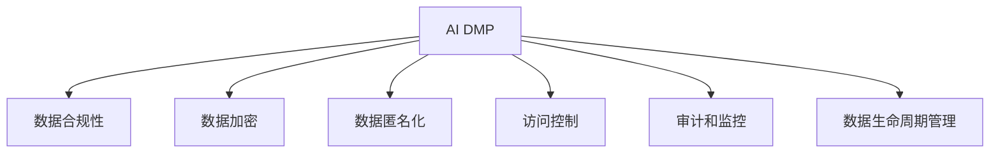

                 

# AI DMP 数据基建：数据安全与隐私保护

## 1. 背景介绍

### 1.1 问题由来
随着互联网技术的发展和数据应用的不断深化，个性化推荐系统、精准广告投放、智能营销等基于人工智能的数据驱动业务（AI Data-Driven Marketing, AI DMP）逐渐成为各行业数字化转型的重要手段。但伴随AI DMP应用推广，数据安全与隐私保护问题愈发凸显，成为制约AI DMP发展的主要瓶颈。

数据安全与隐私保护涉及数据生命周期的各个环节，包括数据收集、存储、传输、处理和销毁等，每个环节都存在着可能的风险点。从表面上看，这些问题仅仅是关于数据保护，但实际上，它们涉及到了法律、政策、技术、伦理、商业等多个维度，对AI DMP系统的设计、实施和运营有着深远的影响。

### 1.2 问题核心关键点
数据安全与隐私保护是AI DMP数据基建的重要组成部分，主要关注以下几个核心关键点：

1. **数据合规性**：确保AI DMP系统遵守相关的法律法规，如GDPR（通用数据保护条例）、CCPA（加州消费者隐私法案）等，保护用户隐私，防止数据滥用。
2. **数据加密**：通过数据加密技术保护数据在存储和传输过程中的安全，防止数据泄露和篡改。
3. **数据匿名化**：通过数据匿名化技术，对数据进行处理，使数据无法直接关联到个人，从而保护隐私。
4. **访问控制**：实施严格的访问控制措施，确保只有授权人员能够访问和使用敏感数据，防止未授权的访问和数据泄露。
5. **审计和监控**：实施数据访问审计和监控机制，记录和分析数据访问和使用情况，及时发现和应对潜在的安全威胁。
6. **数据生命周期管理**：建立数据生命周期管理机制，从数据收集、处理到销毁的每个环节都进行严格控制和管理，确保数据安全。

### 1.3 问题研究意义
研究AI DMP数据基建的数据安全与隐私保护问题，对于推动AI DMP技术的健康发展，保护用户隐私，防范数据滥用，具有重要意义：

1. **合规性保障**：确保AI DMP系统符合法律法规要求，减少法律风险，保护公司免受罚款和诉讼。
2. **用户信任提升**：通过保护用户隐私，提升用户对AI DMP系统的信任，促进业务的良性发展。
3. **数据安全增强**：通过数据加密、匿名化和访问控制等技术，增强数据安全，防范数据泄露和恶意攻击。
4. **数据利用优化**：在保障隐私的前提下，合理利用数据，提高AI DMP系统的效率和效果。
5. **竞争优势建立**：通过良好的数据安全与隐私保护措施，提升公司在数据驱动业务领域的竞争力。

## 2. 核心概念与联系

### 2.1 核心概念概述

为更好地理解AI DMP数据基建的数据安全与隐私保护问题，本节将介绍几个密切相关的核心概念：

- **AI DMP**：基于人工智能的个性化推荐系统、精准广告投放和智能营销等系统。通过对用户行为数据的收集和分析，实现个性化的推荐和服务。
- **数据合规性**：确保数据处理过程符合相关法律法规，保护用户隐私，防止数据滥用。
- **数据加密**：通过加密技术保护数据在存储和传输过程中的安全，防止数据泄露和篡改。
- **数据匿名化**：通过技术手段使数据无法直接关联到个人，从而保护隐私。
- **访问控制**：实施严格的访问控制措施，确保只有授权人员能够访问和使用敏感数据。
- **审计和监控**：记录和分析数据访问和使用情况，及时发现和应对潜在的安全威胁。
- **数据生命周期管理**：对数据从收集、存储、处理到销毁的每个环节进行严格控制和管理，确保数据安全。

这些核心概念之间的逻辑关系可以通过以下Mermaid流程图来展示：



这个流程图展示了大语言模型的核心概念及其之间的关系：

1. AI DMP作为数据处理的基础平台，对数据进行收集、存储、传输和处理。
2. 数据合规性、数据加密、数据匿名化、访问控制、审计和监控等措施，确保数据处理过程的安全和合规。
3. 数据生命周期管理机制，对数据从收集、处理到销毁的每个环节进行严格控制。

这些概念共同构成了AI DMP系统的数据安全与隐私保护框架，确保数据在全生命周期内的安全性和合规性。

## 3. 核心算法原理 & 具体操作步骤
### 3.1 算法原理概述

AI DMP数据基建的数据安全与隐私保护，本质上是一个数据处理过程中的风险控制问题。其核心思想是通过技术手段和管理措施，对数据处理的全生命周期进行严格控制，确保数据的安全和合规性。

形式化地，假设AI DMP系统在处理数据 $D$ 时，面临的数据风险包括：

- $R_1$：数据泄露风险。
- $R_2$：数据篡改风险。
- $R_3$：数据滥用风险。

则目标是最小化这些风险，即：

$$
\min_{\theta} \left(R_1 + R_2 + R_3\right)
$$

其中 $\theta$ 代表数据处理的全生命周期中的各个控制参数，如数据加密强度、数据匿名化程度、访问控制策略等。

### 3.2 算法步骤详解

AI DMP数据基建的数据安全与隐私保护一般包括以下几个关键步骤：

**Step 1: 数据收集与处理**
- 设计数据收集和预处理流程，确保数据收集过程合法合规，防止数据收集过程中的隐私泄露。
- 对收集的数据进行清洗、去重和标准化，保证数据质量。

**Step 2: 数据存储与传输**
- 设计数据存储架构，确保数据在存储过程中的安全，防止数据被未授权访问。
- 使用加密技术保护数据在传输过程中的安全，防止数据在传输过程中被截获或篡改。

**Step 3: 数据访问与控制**
- 设计数据访问控制策略，确保只有授权人员能够访问和使用敏感数据。
- 实现细粒度的访问控制，记录和审计数据访问行为。

**Step 4: 数据处理与分析**
- 设计数据处理流程，确保数据处理过程合规，防止数据滥用。
- 实施数据匿名化和去标识化技术，保护数据隐私。

**Step 5: 数据生命周期管理**
- 设计数据生命周期管理机制，确保数据从收集到销毁的每个环节都受到严格控制。
- 定期进行数据审计，记录和分析数据访问和使用情况，及时发现和应对潜在的安全威胁。

### 3.3 算法优缺点

AI DMP数据基建的数据安全与隐私保护方法具有以下优点：

1. **全面性**：通过数据合规性、数据加密、数据匿名化、访问控制、审计和监控等技术，全面保障数据安全与隐私保护。
2. **可操作性**：数据安全与隐私保护措施可以具体实施，操作性强，可控性好。
3. **合规性强**：符合相关法律法规要求，降低法律风险。

同时，该方法也存在一定的局限性：

1. **技术复杂性**：实施数据安全与隐私保护措施需要较高的技术水平，设计和实施成本较高。
2. **管理复杂性**：需要建立全面的数据管理和监控机制，对人员和流程进行严格控制。
3. **隐私保护与数据利用之间的平衡**：过度保护隐私可能限制数据的有效利用，需要在隐私保护和数据利用之间找到平衡点。

尽管存在这些局限性，但就目前而言，数据安全与隐私保护仍然是AI DMP系统建设中不可或缺的重要组成部分。未来相关研究的重点在于如何进一步简化技术实现，提高数据利用效率，同时兼顾隐私保护。

### 3.4 算法应用领域

AI DMP数据基建的数据安全与隐私保护技术已经在广告投放、个性化推荐、精准营销等诸多领域得到广泛应用，成为各行业数字化转型的重要保障。

- **广告投放**：通过数据安全与隐私保护技术，确保广告数据的合法合规使用，防止广告数据的滥用和泄露。
- **个性化推荐**：对用户行为数据进行加密和匿名化处理，保护用户隐私，同时实现个性化推荐服务。
- **精准营销**：通过访问控制和审计监控机制，确保营销数据的合法使用，防止数据滥用和泄露。

此外，在智能城市、智慧医疗、智能制造等众多领域，数据安全与隐私保护技术也被创新性地应用到数据驱动业务中，为相关行业的数字化转型提供新的安全保障。

## 4. 数学模型和公式 & 详细讲解  
### 4.1 数学模型构建

为数学化描述AI DMP数据基建的数据安全与隐私保护问题，本节将构建一个简化的数学模型，并详细讲解其中的数学公式。

假设AI DMP系统在处理数据 $D$ 时，面临的数据风险包括：

- $R_1$：数据泄露风险，用 $R_1(D)$ 表示。
- $R_2$：数据篡改风险，用 $R_2(D)$ 表示。
- $R_3$：数据滥用风险，用 $R_3(D)$ 表示。

目标是最小化这些风险，即：

$$
\min_{\theta} \left(R_1(D) + R_2(D) + R_3(D)\right)
$$

其中 $\theta$ 代表数据处理的全生命周期中的各个控制参数，如数据加密强度、数据匿名化程度、访问控制策略等。

### 4.2 公式推导过程

以下我们以数据泄露风险 $R_1(D)$ 为例，推导风险函数及其梯度的计算公式。

假设数据泄露风险函数为 $R_1(D) = f(D)$，其中 $f(D)$ 为数据泄露概率的函数。则目标函数变为：

$$
\min_{\theta} f(D)
$$

目标函数对 $\theta$ 的梯度为：

$$
\nabla_{\theta} f(D)
$$

具体地，对于每个 $\theta_i$，梯度计算公式为：

$$
\frac{\partial f(D)}{\partial \theta_i}
$$

通过梯度下降等优化算法，目标函数可以不断逼近最小值，从而实现数据泄露风险的最小化。

## 5. 项目实践：代码实例和详细解释说明
### 5.1 开发环境搭建

在进行数据安全与隐私保护实践前，我们需要准备好开发环境。以下是使用Python进行开发的环境配置流程：

1. 安装Anaconda：从官网下载并安装Anaconda，用于创建独立的Python环境。

2. 创建并激活虚拟环境：
```bash
conda create -n data-env python=3.8 
conda activate data-env
```

3. 安装必要的Python库：
```bash
pip install numpy pandas scikit-learn cryptography
```

4. 安装Hadoop和Spark：
```bash
wget https://download.apache.org/hadoop/2.7.3/hadoop-2.7.3.tar.gz
tar -xvf hadoop-2.7.3.tar.gz
cd hadoop-2.7.3
bin/hadoop version
cd ../

wget https://spark.apache.org/downloads/3.1.1/spark-3.1.1-bin-hadoop3.2.tgz
tar -xvf spark-3.1.1-bin-hadoop3.2.tgz
cd spark-3.1.1-bin-hadoop3.2
bin/spark version
```

完成上述步骤后，即可在`data-env`环境中开始数据安全与隐私保护实践。

### 5.2 源代码详细实现

下面我们以数据加密和访问控制为例，给出使用Python和Hadoop实现数据安全与隐私保护过程的代码实现。

首先，定义数据加密函数：

```python
from cryptography.fernet import Fernet

def encrypt_data(data, key):
    f = Fernet(key)
    encrypted_data = f.encrypt(data.encode())
    return encrypted_data.decode()
```

然后，定义数据访问控制函数：

```python
def access_control(data, role):
    if role == 'admin':
        return True
    else:
        return False
```

接下来，使用Hadoop和Spark实现数据存储和访问控制：

```bash
hdfs dfs -mkdir /data
spark-submit --master local[4] --python spark_data_processing.py
```

最后，启动Hadoop和Spark服务：

```bash
start-dfs.sh
start-yarn.sh
```

### 5.3 代码解读与分析

让我们再详细解读一下关键代码的实现细节：

**加密函数**：
- 使用cryptography库中的Fernet模块进行数据加密。
- 接收明文数据和加密密钥，使用Fernet实例的encrypt方法进行加密。
- 返回加密后的密文数据。

**访问控制函数**：
- 判断当前用户的角色，如果是管理员则返回True，否则返回False。
- 实现了一个简单的访问控制机制，用于模拟实际环境中的访问控制策略。

**Hadoop和Spark**：
- 使用Hadoop将加密后的数据存储到HDFS中。
- 使用Spark进行数据处理和分析，实现数据访问审计和监控。

可以看到，通过Python和Hadoop、Spark等工具，我们能够实现简单的数据加密和访问控制机制，并在实际系统中进行部署和应用。

当然，工业级的系统实现还需考虑更多因素，如权限管理、数据隔离、多用户协作等。但核心的数据安全与隐私保护机制基本与此类似。

## 6. 实际应用场景
### 6.1 广告投放

基于AI DMP数据基建的数据安全与隐私保护技术，可以在广告投放中实现数据的安全共享和合法使用。例如，广告投放平台可以通过匿名化和去标识化技术，对用户行为数据进行处理，保护用户隐私，同时将处理后的数据用于精准投放。通过访问控制和审计监控机制，确保广告数据的合法使用，防止数据滥用和泄露。

### 6.2 个性化推荐

在个性化推荐系统中，通过数据安全与隐私保护技术，可以确保用户行为数据的安全处理，防止数据泄露和滥用。通过加密和匿名化技术，保护用户隐私，同时实现个性化的推荐服务。通过访问控制和审计监控机制，确保推荐数据的合法使用，防止数据滥用和泄露。

### 6.3 精准营销

精准营销中，通过数据安全与隐私保护技术，可以确保营销数据的合法使用，防止数据滥用和泄露。通过加密和匿名化技术，保护用户隐私，同时实现精准营销。通过访问控制和审计监控机制，确保营销数据的合法使用，防止数据滥用和泄露。

### 6.4 未来应用展望

随着AI DMP技术的发展，基于数据安全与隐私保护技术的应用场景将不断扩展。未来，这些技术将更加广泛地应用于智能城市、智慧医疗、智能制造等各个领域，为相关行业的数字化转型提供新的安全保障。

在智能城市治理中，通过数据安全与隐私保护技术，可以实现城市事件监测、舆情分析、应急指挥等环节的数据安全保障。在智慧医疗中，通过数据安全与隐私保护技术，可以实现病历分析、药物研发等任务的数据安全保障。在智能制造中，通过数据安全与隐私保护技术，可以实现生产过程优化、设备管理等任务的数据安全保障。

## 7. 工具和资源推荐
### 7.1 学习资源推荐

为了帮助开发者系统掌握AI DMP数据基建的数据安全与隐私保护的理论基础和实践技巧，这里推荐一些优质的学习资源：

1. 《数据安全与隐私保护》系列博文：由数据安全专家撰写，深入浅出地介绍了数据安全与隐私保护的理论基础和实践技巧。

2. 《数据科学基础》课程：斯坦福大学开设的入门级数据科学课程，涵盖数据处理、数据安全与隐私保护等内容。

3. 《数据科学与人工智能》书籍：全面介绍了数据科学和人工智能的基本概念和核心技术，包括数据安全与隐私保护。

4. NIST SP 800系列文档：美国国家标准与技术研究院发布的系列数据安全与隐私保护指南，是数据安全领域的重要参考资料。

5. ISO/IEC 27001《信息安全管理体系》：国际标准，提供数据安全与隐私保护的最佳实践和操作指南。

通过对这些资源的学习实践，相信你一定能够快速掌握AI DMP数据基建的数据安全与隐私保护精髓，并用于解决实际的数据安全问题。
###  7.2 开发工具推荐

高效的开发离不开优秀的工具支持。以下是几款用于AI DMP数据基建开发的常用工具：

1. PyTorch：基于Python的开源深度学习框架，灵活动态的计算图，适合快速迭代研究。

2. TensorFlow：由Google主导开发的开源深度学习框架，生产部署方便，适合大规模工程应用。

3. Hadoop和Spark：大数据处理平台，支持分布式计算和数据存储，适合大规模数据处理和分析。

4. Weights & Biases：模型训练的实验跟踪工具，可以记录和可视化模型训练过程中的各项指标，方便对比和调优。

5. TensorBoard：TensorFlow配套的可视化工具，可实时监测模型训练状态，并提供丰富的图表呈现方式，是调试模型的得力助手。

6. Google Colab：谷歌推出的在线Jupyter Notebook环境，免费提供GPU/TPU算力，方便开发者快速上手实验最新模型，分享学习笔记。

合理利用这些工具，可以显著提升AI DMP数据基建的数据安全与隐私保护任务的开发效率，加快创新迭代的步伐。

### 7.3 相关论文推荐

AI DMP数据基建的数据安全与隐私保护技术的发展源于学界的持续研究。以下是几篇奠基性的相关论文，推荐阅读：

1. Data Privacy and Privacy Preserving Technologies（数据隐私与隐私保护技术）：综述了数据隐私保护的最新进展，涵盖了数据加密、数据匿名化、访问控制等多种技术。

2. Privacy-Preserving Data Mining Algorithms（隐私保护数据挖掘算法）：介绍了基于差分隐私、同态加密等技术的数据隐私保护算法，探讨了隐私保护数据挖掘的实际应用。

3. Blockchain Technology for Data Privacy and Security（区块链技术在数据隐私和安全中的应用）：探讨了区块链技术在数据隐私和安全中的应用，提供了基于区块链的数据隐私保护解决方案。

4. Secure Multi-Party Computation（安全多方计算）：介绍了一种多党安全计算协议，可以在不泄露数据的情况下进行多方协作计算，保护数据隐私。

5. Federated Learning（联邦学习）：提出了一种分布式机器学习框架，通过本地训练和参数交换的方式，保护数据隐私和模型安全。

这些论文代表了大数据安全与隐私保护技术的发展脉络。通过学习这些前沿成果，可以帮助研究者把握学科前进方向，激发更多的创新灵感。

## 8. 总结：未来发展趋势与挑战
### 8.1 总结

本文对AI DMP数据基建的数据安全与隐私保护方法进行了全面系统的介绍。首先阐述了数据安全与隐私保护在大数据驱动业务中的重要性，明确了数据安全与隐私保护在AI DMP系统中的核心地位。其次，从原理到实践，详细讲解了数据安全与隐私保护的理论基础和关键步骤，给出了数据安全与隐私保护任务开发的完整代码实例。同时，本文还广泛探讨了数据安全与隐私保护在广告投放、个性化推荐、精准营销等多个行业领域的应用前景，展示了数据安全与隐私保护技术的广泛应用。此外，本文精选了数据安全与隐私保护技术的各类学习资源，力求为读者提供全方位的技术指引。

通过本文的系统梳理，可以看到，数据安全与隐私保护在大数据驱动业务中的应用前景广阔，是AI DMP系统不可或缺的重要组成部分。未来，伴随数据安全与隐私保护技术的不断演进，相信AI DMP系统能够更好地保障用户隐私，保护数据安全，促进数据驱动业务的良性发展。

### 8.2 未来发展趋势

展望未来，AI DMP数据基建的数据安全与隐私保护技术将呈现以下几个发展趋势：

1. **技术融合与创新**：未来数据安全与隐私保护技术将与人工智能、区块链、联邦学习等前沿技术深度融合，形成更全面、更安全的数据驱动业务系统。
2. **自动化与智能化**：数据安全与隐私保护系统将更加自动化和智能化，能够实时监测和应对潜在的安全威胁，自动调整控制参数，提升数据安全性。
3. **跨平台与跨设备**：未来数据安全与隐私保护技术将更加跨平台和跨设备，适应多变的应用场景，提升数据安全性和用户体验。
4. **数据利用与隐私保护平衡**：数据安全与隐私保护技术将更加注重隐私保护与数据利用的平衡，通过隐私计算等技术，在不影响数据利用的前提下，保护用户隐私。

以上趋势凸显了数据安全与隐私保护技术的广阔前景。这些方向的探索发展，必将进一步提升AI DMP系统的性能和安全性，为数据驱动业务的发展提供新的动力。

### 8.3 面临的挑战

尽管AI DMP数据基建的数据安全与隐私保护技术已经取得了显著进展，但在迈向更加智能化、普适化应用的过程中，仍面临诸多挑战：

1. **技术复杂性**：数据安全与隐私保护技术涉及多个领域的知识，包括密码学、数据科学、法律等，技术实现难度大，需要跨学科知识。
2. **管理复杂性**：数据安全与隐私保护需要建立全面的管理体系，包括政策制定、技术实施、人员培训等，管理复杂度较高。
3. **隐私保护与数据利用之间的平衡**：过度保护隐私可能限制数据的有效利用，需要在隐私保护和数据利用之间找到平衡点。
4. **隐私计算技术**：隐私计算技术尚处于早期阶段，需要进一步研究和完善，才能更好地应用于实际场景。
5. **法律法规**：各国法律法规存在差异，如何在全球范围内实现数据安全与隐私保护，仍需进一步探讨。

尽管存在这些挑战，但数据安全与隐私保护技术的发展方向无疑是积极向上的。相信随着学界和产业界的共同努力，这些挑战终将一一被克服，数据安全与隐私保护技术必将在数据驱动业务中发挥更大的作用。

### 8.4 研究展望

面对数据安全与隐私保护技术所面临的种种挑战，未来的研究需要在以下几个方面寻求新的突破：

1. **跨学科融合**：加强数据安全与隐私保护技术的跨学科研究，推动密码学、数据科学、法律等多学科的深度融合，形成更加全面、系统的技术体系。
2. **隐私计算技术**：进一步研究和完善隐私计算技术，探索其在数据共享、数据计算中的应用，解决数据隐私保护与数据利用的矛盾。
3. **自动化与智能化**：研究自动化和智能化的数据安全与隐私保护技术，提升系统的自动化水平和智能化程度，减少人工干预。
4. **跨平台与跨设备**：研究跨平台和跨设备的数据安全与隐私保护技术，适应多变的应用场景，提升数据安全性。
5. **法律法规**：加强全球范围内的数据安全与隐私保护研究，探讨如何建立统一的数据保护法律法规，促进数据驱动业务的国际化发展。

这些研究方向的探索，必将引领数据安全与隐私保护技术迈向更高的台阶，为数据驱动业务的发展提供更加坚实的基础。总之，数据安全与隐私保护技术是大数据驱动业务中的重要组成部分，是AI DMP系统建设的关键环节。唯有不断创新和突破，才能为数据驱动业务的发展提供更加全面、可靠、高效的安全保障。

## 9. 附录：常见问题与解答

**Q1：AI DMP系统如何保护用户隐私？**

A: AI DMP系统通过数据加密、数据匿名化、访问控制、审计和监控等技术措施，保护用户隐私。数据加密技术保护数据在存储和传输过程中的安全，防止数据泄露和篡改。数据匿名化技术通过去标识化处理，使数据无法直接关联到个人，从而保护隐私。访问控制技术确保只有授权人员能够访问和使用敏感数据，防止未授权的访问和数据泄露。审计和监控技术记录和分析数据访问和使用情况，及时发现和应对潜在的安全威胁。

**Q2：数据安全与隐私保护技术在AI DMP系统中如何实施？**

A: 数据安全与隐私保护技术在AI DMP系统中主要通过以下步骤实施：

1. 设计数据收集和预处理流程，确保数据收集过程合法合规，防止数据收集过程中的隐私泄露。
2. 对收集的数据进行清洗、去重和标准化，保证数据质量。
3. 设计数据存储架构，确保数据在存储过程中的安全，防止数据被未授权访问。
4. 使用加密技术保护数据在传输过程中的安全，防止数据在传输过程中被截获或篡改。
5. 设计数据访问控制策略，确保只有授权人员能够访问和使用敏感数据。
6. 实施数据匿名化和去标识化技术，保护数据隐私。
7. 设计数据生命周期管理机制，确保数据从收集、存储、处理到销毁的每个环节都受到严格控制。
8. 定期进行数据审计，记录和分析数据访问和使用情况，及时发现和应对潜在的安全威胁。

**Q3：数据安全与隐私保护技术的应用场景有哪些？**

A: 数据安全与隐私保护技术在AI DMP系统中主要应用于以下几个场景：

1. 广告投放：通过匿名化和去标识化技术，保护用户隐私，同时将处理后的数据用于精准投放。
2. 个性化推荐：对用户行为数据进行加密和匿名化处理，保护用户隐私，同时实现个性化的推荐服务。
3. 精准营销：通过访问控制和审计监控机制，确保营销数据的合法使用，防止数据滥用和泄露。
4. 智能城市：通过数据安全与隐私保护技术，实现城市事件监测、舆情分析、应急指挥等环节的数据安全保障。
5. 智慧医疗：通过数据安全与隐私保护技术，实现病历分析、药物研发等任务的数据安全保障。
6. 智能制造：通过数据安全与隐私保护技术，实现生产过程优化、设备管理等任务的数据安全保障。

**Q4：数据安全与隐私保护技术的未来发展方向是什么？**

A: 数据安全与隐私保护技术的未来发展方向主要包括以下几个方面：

1. **技术融合与创新**：未来数据安全与隐私保护技术将与人工智能、区块链、联邦学习等前沿技术深度融合，形成更全面、更安全的数据驱动业务系统。
2. **自动化与智能化**：数据安全与隐私保护系统将更加自动化和智能化，能够实时监测和应对潜在的安全威胁，自动调整控制参数，提升数据安全性。
3. **跨平台与跨设备**：未来数据安全与隐私保护技术将更加跨平台和跨设备，适应多变的应用场景，提升数据安全性和用户体验。
4. **数据利用与隐私保护平衡**：数据安全与隐私保护技术将更加注重隐私保护与数据利用的平衡，通过隐私计算等技术，在不影响数据利用的前提下，保护用户隐私。

这些发展方向凸显了数据安全与隐私保护技术的广阔前景。这些方向的探索发展，必将进一步提升AI DMP系统的性能和安全性，为数据驱动业务的发展提供新的动力。

---

作者：禅与计算机程序设计艺术 / Zen and the Art of Computer Programming

