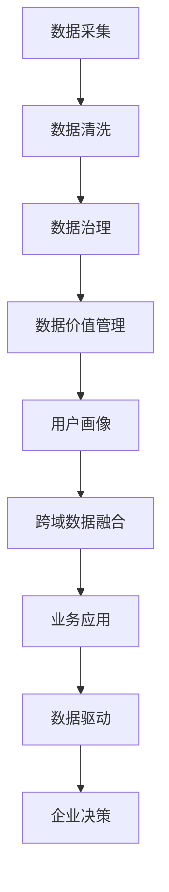

                 

# AI DMP 数据基建：现状与未来

> 关键词：人工智能数据中台,数据驱动,数据治理,数据价值管理,用户画像,跨域数据融合

## 1. 背景介绍

在数字经济时代，数据驱动成为企业竞争的核心要素，而AI DMP（人工智能数据中台）作为数据价值的提取与激活工具，已成为企业数字化转型的重要引擎。AI DMP通过对海量数据的挖掘与整合，为企业提供深入的用户画像与行为洞察，支持个性化推荐、精准营销、客户细分等多个业务场景，助力企业实现业务增长。然而，AI DMP的构建与运营也面临着数据质量、技术架构、业务融合等多重挑战。本文将全面探讨AI DMP的数据基建现状与未来发展方向，为读者提供深入的技术见解与实践指导。

## 2. 核心概念与联系

### 2.1 核心概念概述

为深入理解AI DMP的数据基建，首先需要明确几个关键概念：

- **AI DMP**：人工智能数据中台，基于人工智能技术构建的数据价值平台，通过数据采集、清洗、治理、分析和应用等环节，形成数据驱动的决策支撑系统。

- **数据驱动**：指企业通过数据收集、分析与应用，实现精准决策和业务优化，最大化数据资产价值。

- **数据治理**：包括数据质量管理、元数据管理、数据安全管理等，确保数据资产的可信性与可用性。

- **数据价值管理**：指通过对数据进行价值评估、挖掘与应用，最大化数据资产对业务增长和决策支持的贡献。

- **用户画像**：根据用户的历史行为数据和社交数据，构建详尽的用户特征与行为模型，支持精细化营销和个性化服务。

- **跨域数据融合**：指将来自不同数据源的异构数据进行融合，形成全局视图，支持多场景的业务应用。

### 2.2 核心概念原理和架构的 Mermaid 流程图



这个流程图展示了AI DMP从数据采集到业务应用的全过程，以及各环节之间的相互联系：

1. **数据采集**：收集企业内外部的各类数据，形成原始数据池。
2. **数据清洗**：对原始数据进行清洗与标注，去除噪音与异常，确保数据质量。
3. **数据治理**：建立元数据管理、数据质量控制、数据安全防护等机制，保障数据安全与可信。
4. **数据价值管理**：通过数据挖掘与分析，发现数据价值，评估数据质量，应用数据洞察。
5. **用户画像**：根据用户数据构建详尽的用户模型，支持精准营销与个性化服务。
6. **跨域数据融合**：将多源异构数据融合，形成统一的全局视图，支持更全面的业务洞察。
7. **业务应用**：基于AI DMP提供的数据与洞察，实现个性化推荐、精准营销等业务应用。
8. **企业决策**：数据驱动的企业决策，提升决策效率与质量，助力业务增长。

## 3. 核心算法原理 & 具体操作步骤

### 3.1 算法原理概述

AI DMP的核心算法原理主要基于数据挖掘、机器学习和人工智能技术，通过以下关键步骤实现数据价值的提取与激活：

1. **数据采集与清洗**：通过爬虫、API接口等方式，采集来自各数据源的数据，并进行清洗与标注。
2. **数据治理**：建立数据质量管理、元数据管理、数据安全防护等机制，确保数据可信与安全。
3. **数据价值管理**：通过数据挖掘与分析，发现数据价值，评估数据质量，应用数据洞察。
4. **用户画像构建**：根据用户行为数据，构建详尽的用户特征与行为模型。
5. **跨域数据融合**：将多源异构数据融合，形成统一的全局视图，支持多场景的业务应用。

### 3.2 算法步骤详解

以下是AI DMP数据基建的主要操作步骤：

**Step 1: 数据采集与清洗**

1. 设计数据采集管道，收集企业内外部的各类数据，如网站行为、交易记录、社交媒体数据等。
2. 对收集到的数据进行初步清洗与预处理，去除噪音与异常，填补缺失值。
3. 对清洗后的数据进行标注，标记数据来源、类型、时效等信息，方便后续处理。

**Step 2: 数据治理**

1. 建立数据质量管理机制，制定数据质量评估标准，定期检测数据质量。
2. 构建元数据管理平台，记录数据源、字段、类型、质量等信息，支持数据追溯与审计。
3. 实施数据安全防护措施，如数据加密、访问控制、隐私保护等，确保数据安全。

**Step 3: 数据价值管理**

1. 使用数据挖掘与分析技术，如关联规则、分类、聚类等，发现数据中的模式与规律。
2. 评估数据质量与价值，建立数据价值评估模型，量化数据对业务增长的贡献。
3. 应用数据洞察，通过可视化、报告等形式，向业务人员提供数据驱动的决策支持。

**Step 4: 用户画像构建**

1. 收集用户的行为数据、社交数据、交易数据等，形成用户数据的全局视图。
2. 使用机器学习技术，如协同过滤、内容推荐等，构建用户画像模型。
3. 根据用户画像，生成详尽的用户特征与行为标签，支持个性化推荐、精准营销等业务应用。

**Step 5: 跨域数据融合**

1. 设计跨域数据融合策略，确定不同数据源的融合规则与方式。
2. 使用数据融合技术，如数据对齐、合并、去重等，形成统一的全局视图。
3. 根据业务需求，调整融合后的数据结构与格式，支持多场景的业务应用。

### 3.3 算法优缺点

AI DMP的数据基建方法具有以下优点：

1. **高效性**：通过自动化数据采集与清洗，显著提升数据处理的效率。
2. **全面性**：通过跨域数据融合，形成全局视图，支持多场景的业务应用。
3. **数据价值**：通过数据价值管理，发现数据中的模式与规律，量化数据对业务增长的贡献。
4. **个性化服务**：通过用户画像构建，支持个性化推荐、精准营销等业务应用。

同时，该方法也存在一些缺点：

1. **数据复杂性**：不同数据源的数据格式、类型、质量差异较大，数据融合与治理难度较大。
2. **技术复杂性**：需要整合多种数据挖掘、机器学习、人工智能技术，技术门槛较高。
3. **隐私风险**：在数据融合与共享过程中，存在隐私泄露和数据滥用的风险。
4. **成本较高**：数据采集、清洗、治理、分析等环节需要投入大量资源，成本较高。

### 3.4 算法应用领域

AI DMP的数据基建方法在多个领域中得到了广泛应用，如电子商务、金融、医疗、媒体等：

- **电子商务**：通过用户画像构建与个性化推荐，提升用户体验与销售转化率。
- **金融**：通过数据分析与风险评估，优化客户细分与精准营销策略。
- **医疗**：通过健康数据整合与分析，提升疾病预测与个性化治疗方案。
- **媒体**：通过用户行为分析与内容推荐，提升用户粘性与广告效果。

## 4. 数学模型和公式 & 详细讲解 & 举例说明

### 4.1 数学模型构建

AI DMP的数据基建过程可以抽象为以下几个数学模型：

1. **数据采集模型**：$D_{ac}=\{d_{ac1},d_{ac2},\ldots,d_{acn}\}$，表示从不同数据源采集到的数据集合。
2. **数据清洗模型**：$D_{cl}=\{d_{cli}|d_{ac}\in D_{ac}\}$，表示清洗后的数据集合。
3. **数据治理模型**：$D_{gt}=\{d_{gth}|d_{cl}\in D_{cl}\}$，表示治理后的数据集合。
4. **数据价值管理模型**：$D_{vms}=\{d_{vms}|d_{gt}\in D_{gt}\}$，表示数据价值管理的输出结果。
5. **用户画像模型**：$P=\{p_{uid}|d_{gt}\in D_{gt}\}$，表示用户画像的结果集。
6. **跨域数据融合模型**：$D_{fd}=\{d_{fd}|d_{gt}\in D_{gt}\}$，表示融合后的全局数据视图。

### 4.2 公式推导过程

**数据采集模型**

设数据源数量为 $n$，第 $i$ 个数据源的采集函数为 $f_i$，则数据采集模型为：

$$
D_{ac}=\{f_i(x_i)|x_i\in X_i\}
$$

其中，$X_i$ 为第 $i$ 个数据源的数据集，$f_i$ 为数据采集函数。

**数据清洗模型**

设数据清洗函数为 $g$，则数据清洗模型为：

$$
D_{cl}=\{g(d_{ac})|d_{ac}\in D_{ac}\}
$$

**数据治理模型**

设数据治理函数为 $h$，则数据治理模型为：

$$
D_{gt}=\{h(d_{cl})|d_{cl}\in D_{cl}\}
$$

**数据价值管理模型**

设数据价值管理函数为 $v$，则数据价值管理模型为：

$$
D_{vms}=\{v(d_{gt})|d_{gt}\in D_{gt}\}
$$

**用户画像模型**

设用户画像函数为 $u$，则用户画像模型为：

$$
P=\{u(d_{gt})|d_{gt}\in D_{gt}\}
$$

**跨域数据融合模型**

设跨域数据融合函数为 $f_{fd}$，则跨域数据融合模型为：

$$
D_{fd}=\{f_{fd}(d_{gt})|d_{gt}\in D_{gt}\}
$$

### 4.3 案例分析与讲解

以下以电子商务领域的个性化推荐为例，详细讲解AI DMP的数据基建过程：

1. **数据采集**：通过网站行为、交易记录、用户反馈等数据源，采集用户的行为数据。
2. **数据清洗**：去除噪音与异常，填补缺失值，标记数据来源与类型。
3. **数据治理**：建立数据质量评估标准，记录元数据信息，实施数据安全措施。
4. **数据价值管理**：通过关联规则分析，发现用户的购买偏好与行为模式，评估数据质量与价值。
5. **用户画像构建**：使用协同过滤算法，构建用户画像模型，生成详尽的用户特征与行为标签。
6. **跨域数据融合**：将用户行为数据、社交数据、交易数据等融合，形成全局视图，支持推荐算法优化。
7. **个性化推荐**：根据用户画像与全局视图，使用推荐算法，生成个性化推荐结果，提升用户体验与转化率。

## 5. 项目实践：代码实例和详细解释说明

### 5.1 开发环境搭建

在进行AI DMP数据基建实践前，需要准备好开发环境。以下是使用Python进行Scikit-learn开发的环境配置流程：

1. 安装Anaconda：从官网下载并安装Anaconda，用于创建独立的Python环境。

2. 创建并激活虚拟环境：
```bash
conda create -n ai_dmp_env python=3.8 
conda activate ai_dmp_env
```

3. 安装Scikit-learn：
```bash
conda install scikit-learn
```

4. 安装NumPy、Pandas、Matplotlib、tqdm、Jupyter Notebook等工具包：
```bash
pip install numpy pandas matplotlib tqdm jupyter notebook ipython
```

完成上述步骤后，即可在`ai_dmp_env`环境中开始AI DMP数据基建实践。

### 5.2 源代码详细实现

下面我们以用户画像构建为例，给出使用Scikit-learn库对用户数据进行画像建模的Python代码实现。

首先，定义用户画像的数学模型：

```python
from sklearn.cluster import KMeans
from sklearn.preprocessing import StandardScaler
from sklearn.metrics import pairwise_distances_argmin_min

# 定义用户画像的数学模型
class UserProfile:
    def __init__(self, data):
        self.data = data
        self.n_clusters = 10
        self.standard_scaler = StandardScaler()

    def fit(self):
        self.standard_scaler.fit(self.data)
        self.data_scaled = self.standard_scaler.transform(self.data)
        self.clusterer = KMeans(n_clusters=self.n_clusters)
        self.clusterer.fit(self.data_scaled)
        self.cluster_labels = self.clusterer.labels_
        self.cluster_centers = self.clusterer.cluster_centers_

    def predict(self, new_data):
        new_data_scaled = self.standard_scaler.transform(new_data)
        distances = pairwise_distances_argmin_min(new_data_scaled, self.cluster_centers)
        predicted_cluster_id = distances[1]
        predicted_user_id = distances[0]
        return predicted_user_id, predicted_cluster_id
```

然后，定义数据处理函数：

```python
import pandas as pd
from sklearn.preprocessing import LabelEncoder

# 加载用户行为数据
def load_user_data(file_path):
    data = pd.read_csv(file_path)
    return data

# 处理缺失值
def handle_missing_values(data):
    return data.dropna()

# 进行标签编码
def encode_labels(data):
    label_encoder = LabelEncoder()
    for column in data.columns:
        data[column] = label_encoder.fit_transform(data[column])
    return data

# 标准化数据
def standardize_data(data):
    return StandardScaler().fit_transform(data)
```

接着，加载并处理数据：

```python
# 加载用户行为数据
user_data = load_user_data('user_behavior.csv')

# 处理缺失值
user_data = handle_missing_values(user_data)

# 进行标签编码
user_data = encode_labels(user_data)

# 标准化数据
user_data = standardize_data(user_data)
```

最后，启动用户画像模型训练：

```python
# 训练用户画像模型
user_profile = UserProfile(user_data)
user_profile.fit()

# 测试用户画像模型
test_user_data = load_user_data('test_user_behavior.csv')
test_user_data = handle_missing_values(test_user_data)
test_user_data = encode_labels(test_user_data)
test_user_data = standardize_data(test_user_data)

for i in range(10):
    user_id, cluster_id = user_profile.predict(test_user_data[i])
    print(f'User {i+1} belongs to cluster {cluster_id} with id {user_id}')
```

以上就是使用Scikit-learn库对用户数据进行画像建模的完整代码实现。可以看到，通过构建UserProfile类，我们可以对用户数据进行聚类分析，生成详尽的用户画像，并支持对新用户进行聚类预测。

### 5.3 代码解读与分析

让我们再详细解读一下关键代码的实现细节：

**UserProfile类**：
- `__init__`方法：初始化数据集、聚类数量、标准化器等关键组件。
- `fit`方法：标准化数据、进行K-Means聚类，输出聚类标签与聚类中心。
- `predict`方法：标准化新数据，计算与聚类中心的距离，返回聚类标签与用户ID。

**数据处理函数**：
- `load_user_data`：读取用户行为数据，形成DataFrame。
- `handle_missing_values`：处理缺失值，去除非数值型数据。
- `encode_labels`：对标签进行LabelEncoder编码，方便聚类分析。
- `standardize_data`：对数据进行标准化处理，适应聚类算法的假设。

**模型训练与测试**：
- 创建UserProfile实例，进行模型训练。
- 加载测试用户数据，处理缺失值和标签编码。
- 使用训练好的UserProfile模型对测试数据进行聚类预测，输出聚类标签与用户ID。

以上代码实现了用户画像构建的基本流程，基于K-Means聚类算法，对用户行为数据进行聚类分析，生成详尽的用户画像。通过UserProfile类的定义与使用，代码实现了数据预处理、模型训练与预测的自动化流程，便于重复利用与扩展。

当然，在工业级的系统实现中，还需要考虑更多因素，如模型的保存与部署、超参数的自动搜索、更灵活的任务适配层等。但核心的用户画像构建方法基本与此类似。

## 6. 实际应用场景

### 6.1 电商推荐系统

基于AI DMP的用户画像构建，电商推荐系统能够实时获取用户的行为数据，通过聚类分析生成详尽的用户画像，并支持个性化推荐。用户画像可以包括用户的购买历史、浏览记录、评价反馈等，结合商品的属性与类别，生成精准的个性化推荐结果。通过推荐引擎的优化，可以显著提升用户体验与销售转化率。

### 6.2 金融风控系统

金融风控系统需要对客户的信用历史、交易记录等数据进行综合分析，生成详尽的用户画像。通过用户画像构建与聚类分析，可以识别高风险用户，制定精准的信贷策略。同时，通过行为分析，可以预测客户的信用变化趋势，提升风险评估的准确性。

### 6.3 医疗诊断系统

医疗诊断系统需要结合患者的病历数据、检查结果等，生成详尽的用户画像。通过用户画像构建与聚类分析，可以识别出高风险病例，制定个性化的治疗方案。同时，通过数据分析，可以预测疾病的发生与发展趋势，提升医疗决策的科学性。

### 6.4 未来应用展望

随着AI DMP技术的不断演进，其在多领域的应用前景将更加广阔：

- **智能制造**：通过数据分析与用户画像构建，优化生产流程，提升产品质量，实现个性化定制。
- **智慧城市**：通过城市数据融合与用户画像构建，提升城市管理效率，实现智能交通、公共安全等应用。
- **智能医疗**：通过健康数据整合与用户画像构建，优化诊疗流程，提升医疗决策的科学性，实现个性化治疗。
- **智慧教育**：通过学生行为数据分析，生成详尽的学生画像，优化教学策略，提升教育效果。

## 7. 工具和资源推荐

### 7.1 学习资源推荐

为了帮助开发者系统掌握AI DMP的数据基建理论基础和实践技巧，这里推荐一些优质的学习资源：

1. **《数据科学与机器学习》课程**：由斯坦福大学开设的MOOC课程，涵盖数据科学、机器学习、深度学习等多个领域，提供全面的学习资料。
2. **《Python数据分析》书籍**：全面介绍Python在数据分析中的应用，包括数据清洗、处理、可视化等，适合数据驱动项目开发。
3. **《数据治理与数据价值管理》书籍**：详细讲解数据治理与数据价值管理的理论基础与实践方法，适合数据管理人员阅读。
4. **《用户画像构建与推荐系统》书籍**：详细介绍用户画像构建与推荐系统的构建方法，适合推荐系统开发人员阅读。
5. **Kaggle平台**：提供大量的数据分析竞赛与数据集，适合实践与提升数据处理与分析能力。

通过对这些资源的学习实践，相信你一定能够快速掌握AI DMP的数据基建方法，并用于解决实际的业务问题。

### 7.2 开发工具推荐

高效的开发离不开优秀的工具支持。以下是几款用于AI DMP数据基建开发的常用工具：

1. **Scikit-learn**：Python的机器学习库，提供了丰富的数据处理与分析功能，适合数据分析与模型构建。
2. **Pandas**：Python的数据处理库，支持数据清洗、整合与分析，适合数据驱动项目开发。
3. **NumPy**：Python的数值计算库，支持高效的数值计算与矩阵运算，适合科学计算与数据分析。
4. **Matplotlib**：Python的绘图库，支持丰富的图表绘制功能，适合数据可视化。
5. **Jupyter Notebook**：Python的交互式开发环境，支持代码执行与结果展示，适合数据科学项目开发。

合理利用这些工具，可以显著提升AI DMP数据基建任务的开发效率，加快创新迭代的步伐。

### 7.3 相关论文推荐

AI DMP的数据基建研究源于学界的持续研究。以下是几篇奠基性的相关论文，推荐阅读：

1. **《数据科学与机器学习》论文**：详细介绍了数据科学与机器学习的基本概念与方法，适合入门阅读。
2. **《数据治理与数据价值管理》论文**：系统讲解了数据治理与数据价值管理的理论基础与实践方法，适合数据管理人员阅读。
3. **《用户画像构建与推荐系统》论文**：介绍了用户画像构建与推荐系统的构建方法，适合推荐系统开发人员阅读。
4. **Kaggle平台的数据竞赛论文**：包含大量数据分析竞赛的案例与论文，适合实践与提升数据处理与分析能力。

这些论文代表了大数据处理与分析的研究方向，通过学习这些前沿成果，可以帮助研究者把握学科前进方向，激发更多的创新灵感。

## 8. 总结：未来发展趋势与挑战

### 8.1 研究成果总结

本文对AI DMP的数据基建进行了全面系统的介绍。首先阐述了AI DMP作为数据价值提取与激活工具的重要地位，明确了数据驱动在企业竞争中的核心价值。其次，从原理到实践，详细讲解了数据采集、清洗、治理、分析与应用等关键环节，给出了AI DMP数据基建的完整代码实例。同时，本文还广泛探讨了AI DMP在电商、金融、医疗等多个领域的应用前景，展示了数据驱动的巨大潜力。

通过本文的系统梳理，可以看到，AI DMP的数据基建方法已经成为企业数字化转型的重要引擎，极大地拓展了数据资产的利用范围，带来了深刻的业务变革。未来，伴随数据处理与分析技术的持续演进，AI DMP必将在更广泛的领域中发挥重要作用，推动数据驱动的智能化发展。

### 8.2 未来发展趋势

展望未来，AI DMP的数据基建技术将呈现以下几个发展趋势：

1. **技术集成化**：未来的AI DMP将更加注重技术集成与融合，整合多种数据处理与分析工具，提升系统整体的性能与灵活性。
2. **数据自动化**：通过自动化的数据采集与清洗，进一步提升数据处理的效率，降低人工干预的复杂度。
3. **数据可视化**：提升数据的可视化能力，帮助业务人员更直观地理解数据洞察与业务变化趋势。
4. **数据实时化**：支持数据的实时采集与处理，提升数据驱动的决策速度与响应效率。
5. **数据跨域融合**：支持跨域数据的融合与共享，提升数据的全面性与准确性，支持多场景的业务应用。
6. **数据治理智能化**：建立智能化的数据治理机制，自动识别数据质量问题，提升数据治理的自动化水平。

以上趋势凸显了AI DMP数据基建技术的广阔前景。这些方向的探索发展，必将进一步提升数据处理与分析的效率与效果，推动数据驱动的智能化发展。

### 8.3 面临的挑战

尽管AI DMP的数据基建技术已经取得了一定的成果，但在迈向更加智能化、普适化应用的过程中，它仍面临着多重挑战：

1. **数据质量问题**：不同数据源的数据格式、类型、质量差异较大，数据融合与治理难度较大。
2. **数据隐私问题**：在数据融合与共享过程中，存在隐私泄露和数据滥用的风险。
3. **技术复杂性**：需要整合多种数据处理与分析工具，技术门槛较高。
4. **成本问题**：数据采集、清洗、治理、分析等环节需要投入大量资源，成本较高。
5. **系统集成问题**：AI DMP系统需要与企业现有业务系统进行集成，面临系统兼容性与接口设计等问题。

正视这些挑战，积极应对并寻求突破，将是大数据处理与分析技术不断成熟的必由之路。相信随着学界和产业界的共同努力，这些挑战终将一一被克服，AI DMP数据基建必将在构建人机协同的智能时代中扮演越来越重要的角色。

### 8.4 研究展望

面向未来，AI DMP数据基建技术还需要在以下几个方向进行更深入的探索：

1. **无监督学习与半监督学习**：探索无监督学习与半监督学习的数据处理与分析方法，降低对标注数据的依赖，提升数据处理的自动化水平。
2. **跨域数据融合**：进一步提升跨域数据融合的效率与效果，支持多场景的业务应用。
3. **数据治理智能化**：建立智能化的数据治理机制，自动识别数据质量问题，提升数据治理的自动化水平。
4. **数据可视化**：提升数据的可视化能力，帮助业务人员更直观地理解数据洞察与业务变化趋势。
5. **数据实时化**：支持数据的实时采集与处理，提升数据驱动的决策速度与响应效率。
6. **数据跨域融合**：支持跨域数据的融合与共享，提升数据的全面性与准确性，支持多场景的业务应用。

这些研究方向将推动AI DMP技术的不断演进，为数据驱动的智能化发展提供更坚实的技术保障。

## 9. 附录：常见问题与解答

**Q1：什么是AI DMP？**

A: AI DMP是人工智能数据中台，基于人工智能技术构建的数据价值平台。通过数据采集、清洗、治理、分析和应用等环节，形成数据驱动的决策支撑系统。

**Q2：AI DMP的构建与运营面临哪些挑战？**

A: AI DMP的构建与运营面临多重挑战，包括数据质量问题、数据隐私问题、技术复杂性、成本问题、系统集成问题等。需要通过持续的技术创新与优化，克服这些挑战。

**Q3：如何提升数据驱动的决策效果？**

A: 提升数据驱动的决策效果，需要从数据采集、清洗、治理、分析与应用等环节进行全面优化，确保数据的质量、可信与安全。同时，建立智能化的数据治理机制，提升数据治理的自动化水平，进一步提升数据驱动的决策效果。

**Q4：未来AI DMP技术将如何发展？**

A: 未来AI DMP技术将更加注重技术集成与融合，整合多种数据处理与分析工具，提升系统整体的性能与灵活性。通过自动化的数据采集与清洗，进一步提升数据处理的效率。提升数据的可视化能力，帮助业务人员更直观地理解数据洞察与业务变化趋势。支持数据的实时采集与处理，提升数据驱动的决策速度与响应效率。

这些方向的发展，将推动AI DMP技术的不断演进，为数据驱动的智能化发展提供更坚实的技术保障。

---

作者：禅与计算机程序设计艺术 / Zen and the Art of Computer Programming

