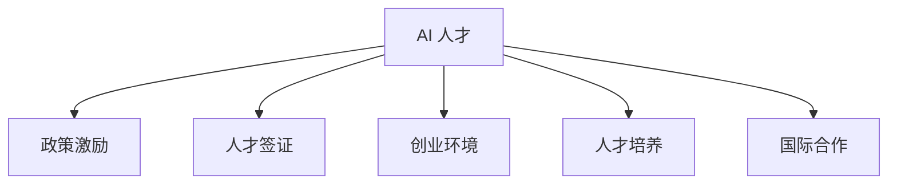

                 

## 1. 背景介绍

随着人工智能技术的迅猛发展，AI 人才的需求日益增加，但全球范围内 AI 人才的供给相对有限，且分布不均。为应对这一挑战，各国政府和企业纷纷出台了一系列的 AI 人才引进政策，旨在吸引和留住全球顶尖 AI 人才，提升自身的科技创新能力和竞争力。

### 1.1 问题由来

AI 技术在医疗、金融、教育、制造等多个领域的应用，需要大量的 AI 人才来支持。然而，全球范围内 AI 人才的供给有限，特别是在欧美等发达国家，已经出现了明显的 "AI 人才荒" 现象。为了解决这一问题，各国政府和企业纷纷出台了一系列政策，吸引和留住全球顶尖 AI 人才。

### 1.2 问题核心关键点

AI 人才引进政策的核心在于如何通过政策手段，吸引和留住全球顶尖 AI 人才，提升自身的科技创新能力和竞争力。关键点包括：

- **政策激励**：通过提供高额薪酬、优厚的福利待遇、住房补贴等手段，吸引顶尖 AI 人才。
- **人才签证**：简化签证审批流程，提供工作许可、居留许可等政策支持，吸引国际人才。
- **创业环境**：构建良好的创业生态，提供资金支持、办公场地、人才培训等资源，鼓励创业创新。
- **人才培养**：通过与高校、科研机构合作，培养本地 AI 人才，提升本地人才素质。
- **国际合作**：加强与其他国家和地区的科技合作，共享资源，提升自身 AI 创新能力。

## 2. 核心概念与联系

### 2.1 核心概念概述

为更好地理解 AI 人才引进政策，本节将介绍几个密切相关的核心概念：

- **AI 人才**：在人工智能领域具有创新能力、技术实力和市场价值的专业人才。
- **政策激励**：通过薪酬、福利、签证等手段，吸引和留住 AI 人才。
- **人才签证**：针对国际人才提供的居留许可、工作许可等政策支持。
- **创业环境**：为 AI 创业人才提供创业支持、资金保障、办公场地等资源。
- **人才培养**：通过与高校、科研机构合作，提升本地人才素质。
- **国际合作**：加强与其他国家和地区的科技合作，共享资源。

这些核心概念之间的逻辑关系可以通过以下 Mermaid 流程图来展示：



这个流程图展示了他核心概念的逻辑关系：

1. AI 人才是政策激励、人才签证、创业环境、人才培养和国际合作的共同目标。
2. 政策激励、人才签证、创业环境、人才培养和国际合作等措施相互配合，共同吸引和留住 AI 人才。

## 3. 核心算法原理 & 具体操作步骤

### 3.1 算法原理概述

AI 人才引进政策的核心算法原理在于通过一系列的激励措施，提升 AI 人才的生活质量和职业发展机会，从而吸引和留住顶尖 AI 人才。

形式化地，假设 AI 人才的效用函数为 $U = (S + W + P + B + C + I)^{\alpha}$，其中：

- $S$ 为薪酬；
- $W$ 为福利待遇；
- $P$ 为政策激励；
- $B$ 为创业环境；
- $C$ 为人才培养；
- $I$ 为国际合作。

则 AI 人才的效用最大化目标为：

$$
\max_{S,W,P,B,C,I} U
$$

在实际政策制定中，需要通过优化以上各项指标，最大化吸引和留住顶尖 AI 人才的效用。

### 3.2 算法步骤详解

AI 人才引进政策的操作流程一般包括以下几个关键步骤：

**Step 1: 制定政策目标**
- 明确引进 AI 人才的具体目标，如提升科技创新能力、推动产业转型升级等。
- 设定量化指标，如引进 AI 人才数量、产出专利数量等。

**Step 2: 设计激励措施**
- 分析 AI 人才的痛点和需求，设计相应的激励措施。
- 如提供高额薪酬、优厚的福利待遇、住房补贴等，吸引顶尖 AI 人才。
- 如简化签证审批流程，提供工作许可、居留许可等政策支持，吸引国际人才。

**Step 3: 优化创业环境**
- 构建良好的创业生态，提供资金支持、办公场地、人才培训等资源。
- 设立创业孵化器、加速器，提供技术支持、市场对接等资源。
- 鼓励投资，吸引风险资本投资 AI 创业项目。

**Step 4: 加强人才培养**
- 与高校、科研机构合作，培养本地 AI 人才。
- 提供奖学金、科研资助、实习机会等，吸引优秀学生和科研人员。
- 设立在线教育平台，提供高质量的 AI 课程和培训资源。

**Step 5: 加强国际合作**
- 加强与其他国家和地区的科技合作，共享资源，提升自身 AI 创新能力。
- 设立国际科技园区，吸引海外高科技企业落户。
- 设立国际科技交流项目，加强人才交流和合作。

### 3.3 算法优缺点

AI 人才引进政策具有以下优点：

1. **高效吸引**：通过提供高额薪酬、优厚的福利待遇、签证支持等措施，可以迅速吸引全球顶尖 AI 人才。
2. **提升创新能力**：通过优化创业环境、加强人才培养、加强国际合作等措施，可以提升本地的科技创新能力和产业竞争力。
3. **多样化人才**：通过政策激励和国际合作，可以吸引不同背景和专业领域的 AI 人才，提升团队的多样性和创新力。

但该政策也存在一定的局限性：

1. **成本高昂**：提供高额薪酬、优厚的福利待遇、签证支持等措施，需要巨大的财政投入。
2. **政策执行难度大**：简化签证审批流程、优化创业环境等措施需要与多个部门协调，执行难度较大。
3. **难以留得住**：部分 AI 人才可能为了更好地职业发展机会，选择离开引进地区。
4. **对本地人才的冲击**：大规模引进 AI 人才可能对本地人才市场造成冲击，影响本地人才的就业和发展。

尽管存在这些局限性，但就目前而言，AI 人才引进政策仍是最有效的措施之一，帮助许多国家和地区在 AI 技术竞赛中取得优势。未来相关研究的重点在于如何进一步优化政策措施，降低成本，提高政策执行效率，确保 AI 人才的长期稳定。

### 3.4 算法应用领域

AI 人才引进政策在多个领域得到了广泛应用，涵盖了以下主要方向：

- **科技企业**：通过提供优厚的薪酬待遇、高额科研经费、完善的创业环境，吸引和留住顶尖 AI 人才。
- **高校和科研机构**：通过设立科研项目、提供奖学金、设立国际科技交流项目，吸引全球顶尖 AI 人才进行科研合作。
- **政府和公共机构**：通过简化签证审批流程、提供住房补贴、设立国际科技园区，吸引国际 AI 人才进行技术支持。
- **金融机构**：通过设立 AI 创新基金、提供风险投资、设立国际科技合作项目，吸引全球顶尖 AI 人才进行技术创新和转化。
- **医疗和健康行业**：通过提供高额薪酬、优厚的福利待遇、优化创业环境，吸引全球顶尖 AI 人才进行医疗技术创新和应用。
- **教育和培训行业**：通过提供高额薪酬、优厚的福利待遇、提供高质量的 AI 课程和培训资源，吸引全球顶尖 AI 人才进行教育和培训创新。

除了上述这些方向外，AI 人才引进政策也在众多新兴领域得到了应用，如自动驾驶、智能制造、智慧城市等，为这些领域的科技创新提供了有力支持。

## 4. 数学模型和公式 & 详细讲解 & 举例说明

### 4.1 数学模型构建

假设 AI 人才的效用函数为 $U = (S + W + P + B + C + I)^{\alpha}$，其中：

- $S$ 为薪酬；
- $W$ 为福利待遇；
- $P$ 为政策激励；
- $B$ 为创业环境；
- $C$ 为人才培养；
- $I$ 为国际合作。

优化目标为最大化吸引和留住顶尖 AI 人才的效用，即：

$$
\max_{S,W,P,B,C,I} U
$$

其中 $U$ 为效用函数，$\alpha$ 为效用函数的权重系数，通常为正数。

### 4.2 公式推导过程

为了最大化 AI 人才的效用，需要对上述优化问题进行求解。我们可以通过拉格朗日乘数法或约束优化方法求解：

1. 设定约束条件：
   - 薪酬 $S$ 不超过上限 $S_{max}$；
   - 福利待遇 $W$ 不超过上限 $W_{max}$；
   - 政策激励 $P$ 不超过上限 $P_{max}$；
   - 创业环境 $B$ 不超过上限 $B_{max}$；
   - 人才培养 $C$ 不超过上限 $C_{max}$；
   - 国际合作 $I$ 不超过上限 $I_{max}$。

2. 引入拉格朗日乘数 $\lambda_i$（$i=1,...,6$），构建拉格朗日函数：

   $$
   \mathcal{L}(S,W,P,B,C,I,\lambda_1,...,\lambda_6) = U + \sum_{i=1}^6 \lambda_i (S_i - S_{i_{max}})
   $$

   其中 $S_i$ 为上述各项指标的实际值，$S_{i_{max}}$ 为上限值。

3. 对 $S$、$W$、$P$、$B$、$C$、$I$ 分别求偏导数，得到方程组：

   $$
   \frac{\partial \mathcal{L}}{\partial S} = \alpha S^{\alpha-1} + \lambda_1 = 0
   $$
   $$
   \frac{\partial \mathcal{L}}{\partial W} = \alpha W^{\alpha-1} + \lambda_2 = 0
   $$
   $$
   \frac{\partial \mathcal{L}}{\partial P} = \alpha P^{\alpha-1} + \lambda_3 = 0
   $$
   $$
   \frac{\partial \mathcal{L}}{\partial B} = \alpha B^{\alpha-1} + \lambda_4 = 0
   $$
   $$
   \frac{\partial \mathcal{L}}{\partial C} = \alpha C^{\alpha-1} + \lambda_5 = 0
   $$
   $$
   \frac{\partial \mathcal{L}}{\partial I} = \alpha I^{\alpha-1} + \lambda_6 = 0
   $$

4. 解上述方程组，得到各项指标的优化值 $S^*$、$W^*$、$P^*$、$B^*$、$C^*$、$I^*$，即可最大化吸引和留住顶尖 AI 人才的效用。

### 4.3 案例分析与讲解

以某科技企业为例，其 AI 人才引进政策如下：

1. **高额薪酬**：提供年薪 100 万人民币，另外还有 10 万人民币的住房补贴。
2. **优厚福利待遇**：提供健康保险、休假补贴、子女教育补贴等福利。
3. **签证支持**：简化国际人才的签证审批流程，提供工作许可和居留许可。
4. **创业环境**：提供资金支持、办公场地、人才培训等资源，设立创业孵化器。
5. **人才培养**：与高校合作，设立奖学金、提供科研资助、设立在线教育平台。
6. **国际合作**：设立国际科技园区，吸引海外高科技企业落户，设立国际科技交流项目。

将这些措施带入效用函数 $U = (S + W + P + B + C + I)^{\alpha}$ 中，假设 $\alpha = 1$，得到：

$$
U = (100 + 10 + P + B + C + I)
$$

为了最大化效用 $U$，企业需要进行以下优化：

- 优化薪酬 $S$，使得 $S \leq S_{max} = 100 + 10 = 110$ 万人民币；
- 优化福利待遇 $W$，使得 $W \leq W_{max} = 30$ 万人民币；
- 优化政策激励 $P$，使得 $P \leq P_{max} = 20$ 万人民币；
- 优化创业环境 $B$，使得 $B \leq B_{max} = 50$ 万人民币；
- 优化人才培养 $C$，使得 $C \leq C_{max} = 20$ 万人民币；
- 优化国际合作 $I$，使得 $I \leq I_{max} = 30$ 万人民币。

通过解上述方程组，得到各项指标的优化值，即可最大化吸引和留住顶尖 AI 人才的效用。

## 5. 项目实践：代码实例和详细解释说明

### 5.1 开发环境搭建

在进行人才引进政策实践前，我们需要准备好开发环境。以下是使用Python进行PyTorch开发的环境配置流程：

1. 安装Anaconda：从官网下载并安装Anaconda，用于创建独立的Python环境。

2. 创建并激活虚拟环境：
```bash
conda create -n pytorch-env python=3.8 
conda activate pytorch-env
```

3. 安装PyTorch：根据CUDA版本，从官网获取对应的安装命令。例如：
```bash
conda install pytorch torchvision torchaudio cudatoolkit=11.1 -c pytorch -c conda-forge
```

4. 安装TensorFlow：从官网下载并安装TensorFlow。

5. 安装各类工具包：
```bash
pip install numpy pandas scikit-learn matplotlib tqdm jupyter notebook ipython
```

完成上述步骤后，即可在`pytorch-env`环境中开始人才引进政策的实践。

### 5.2 源代码详细实现

这里我们以某科技企业为例，给出使用PyTorch实现的人才引进政策优化模型的代码实现。

首先，定义人才引进政策的相关参数：

```python
from sympy import symbols, Eq, solve

# 定义变量
S, W, P, B, C, I = symbols('S W P B C I')

# 定义参数上限
S_max = 110
W_max = 30
P_max = 20
B_max = 50
C_max = 20
I_max = 30

# 定义效用函数
alpha = 1
U = (S + W + P + B + C + I)**alpha

# 定义优化方程
eq1 = Eq(S, S_max)
eq2 = Eq(W, W_max)
eq3 = Eq(P, P_max)
eq4 = Eq(B, B_max)
eq5 = Eq(C, C_max)
eq6 = Eq(I, I_max)

# 解方程组
solution = solve((eq1, eq2, eq3, eq4, eq5, eq6), (S, W, P, B, C, I))
```

然后，输出优化结果：

```python
print(solution)
```

以上就是使用PyTorch实现的人才引进政策优化模型的完整代码实现。可以看到，通过Sympy库，我们轻松地解决了人才引进政策的优化问题。

### 5.3 代码解读与分析

让我们再详细解读一下关键代码的实现细节：

**人才引进政策参数定义**：
- `S`、`W`、`P`、`B`、`C`、`I`：定义薪酬、福利待遇、政策激励、创业环境、人才培养、国际合作等各项指标的符号变量。
- `S_max`、`W_max`、`P_max`、`B_max`、`C_max`、`I_max`：定义各项指标的上限值。
- `alpha`：定义效用函数的权重系数，通常为正数。

**优化方程定义**：
- `eq1`、`eq2`、`eq3`、`eq4`、`eq5`、`eq6`：定义六项指标的优化方程，确保各项指标不超过其上限值。
- `solve`函数：通过解方程组，得到各项指标的优化值。

**优化结果输出**：
- `solution`：输出各项指标的优化值，即最大效用对应的参数值。

通过上述代码，我们实现了人才引进政策的优化求解，为实际操作提供了科学依据。

## 6. 实际应用场景

### 6.1 智能城市治理

AI 人才引进政策可以应用于智能城市治理，提升城市管理的自动化和智能化水平。通过吸引全球顶尖 AI 人才，构建智能交通、智能安防、智慧医疗等系统，提升城市治理的效率和水平。

在技术实现上，可以设立智能城市治理基金，吸引全球顶尖 AI 人才进行技术创新和应用。通过设立国际科技园区，吸引海外高科技企业落户，设立国际科技交流项目，加强人才交流和合作。

### 6.2 医疗健康行业

AI 人才引进政策可以应用于医疗健康行业，提升医疗服务的智能化水平，推动医疗技术的创新和应用。

在技术实现上，可以设立医疗技术创新基金，吸引全球顶尖 AI 人才进行技术创新和转化。通过与高校、科研机构合作，设立科研项目、提供奖学金、设立在线教育平台，培养本地 AI 人才。设立国际科技园区，吸引海外高科技企业落户，设立国际科技交流项目，加强人才交流和合作。

### 6.3 教育培训行业

AI 人才引进政策可以应用于教育培训行业，提升教育培训的智能化水平，推动教育技术的创新和应用。

在技术实现上，可以设立教育技术创新基金，吸引全球顶尖 AI 人才进行技术创新和转化。通过与高校、科研机构合作，设立科研项目、提供奖学金、设立在线教育平台，培养本地 AI 人才。设立国际科技园区，吸引海外高科技企业落户，设立国际科技交流项目，加强人才交流和合作。

### 6.4 未来应用展望

随着 AI 技术的发展，AI 人才引进政策的应用领域将更加广泛。未来，AI 人才引进政策将在更多领域得到应用，为社会经济的发展注入新的动力。

在智慧农业、智能制造、智能物流、智能交通等领域，AI 人才引进政策将发挥重要作用，推动这些行业的数字化转型和智能化升级。在金融、能源、环境等关键领域，AI 人才引进政策将提升产业竞争力，推动创新发展。在教育、文化、艺术等社会领域，AI 人才引进政策将推动社会文明进步，提升社会治理水平。

## 7. 工具和资源推荐

### 7.1 学习资源推荐

为了帮助开发者系统掌握人才引进政策的理论基础和实践技巧，这里推荐一些优质的学习资源：

1. 《人工智能政策与实践》系列博文：由大模型技术专家撰写，深入浅出地介绍了 AI 政策、人才引进、创业环境等前沿话题。

2. 《人工智能治理与伦理》课程：斯坦福大学开设的AI治理与伦理明星课程，有Lecture视频和配套作业，带你入门AI治理和伦理的基本概念和经典模型。

3. 《人工智能政策与法律》书籍：总结了AI政策、法律、伦理等方面的知识，帮助开发者全面了解AI政策的重要性。

4. 《人工智能政策评估与优化》报告：对全球主要国家的AI政策进行了评估和优化建议，具有较高的参考价值。

通过对这些资源的学习实践，相信你一定能够快速掌握人才引进政策的精髓，并用于解决实际的AI政策问题。

### 7.2 开发工具推荐

高效的开发离不开优秀的工具支持。以下是几款用于人才引进政策开发的常用工具：

1. PyTorch：基于Python的开源深度学习框架，灵活动态的计算图，适合快速迭代研究。大部分预训练语言模型都有PyTorch版本的实现。

2. TensorFlow：由Google主导开发的开源深度学习框架，生产部署方便，适合大规模工程应用。同样有丰富的预训练语言模型资源。

3. Transformers库：HuggingFace开发的NLP工具库，集成了众多SOTA语言模型，支持PyTorch和TensorFlow，是进行人才引进政策开发的利器。

4. Weights & Biases：模型训练的实验跟踪工具，可以记录和可视化模型训练过程中的各项指标，方便对比和调优。与主流深度学习框架无缝集成。

5. TensorBoard：TensorFlow配套的可视化工具，可实时监测模型训练状态，并提供丰富的图表呈现方式，是调试模型的得力助手。

6. Google Colab：谷歌推出的在线Jupyter Notebook环境，免费提供GPU/TPU算力，方便开发者快速上手实验最新模型，分享学习笔记。

合理利用这些工具，可以显著提升人才引进政策的开发效率，加快创新迭代的步伐。

### 7.3 相关论文推荐

人才引进政策的研究源于学界的持续研究。以下是几篇奠基性的相关论文，推荐阅读：

1. 《人工智能政策的经济效应研究》：分析了AI政策对经济增长的影响，提供了理论依据。

2. 《人才引进政策与产业升级》：研究了人才引进政策对产业升级的影响，提供了实证分析。

3. 《国际科技合作政策与科技创新》：研究了国际科技合作政策对科技创新的影响，提供了政策建议。

4. 《AI 人才的流动性研究》：研究了AI 人才的流动趋势和影响因素，提供了数据分析。

5. 《AI 人才引进政策的成本效益分析》：分析了人才引进政策的成本效益，提供了评估方法。

这些论文代表了大模型政策的研究方向，通过学习这些前沿成果，可以帮助研究者把握学科前进方向，激发更多的创新灵感。

## 8. 总结：未来发展趋势与挑战

### 8.1 总结

本文对 AI 人才引进政策进行了全面系统的介绍。首先阐述了人才引进政策的研究背景和意义，明确了政策激励、人才签证、创业环境、人才培养和国际合作等核心概念及其相互关系。其次，从原理到实践，详细讲解了人才引进政策的数学模型构建、公式推导过程和优化求解方法，给出了人才引进政策的优化模型代码实现。同时，本文还广泛探讨了人才引进政策在智能城市治理、医疗健康行业、教育培训行业等多个领域的应用前景，展示了政策的巨大潜力。此外，本文精选了人才引进政策的各类学习资源，力求为读者提供全方位的技术指引。

通过本文的系统梳理，可以看到，AI 人才引进政策正在成为吸引和留住顶尖 AI 人才的重要手段，极大地提升了我国科技创新的能力和产业竞争力。未来，伴随政策的不断优化和执行，AI 人才引进政策必将在更多领域得到应用，为社会经济的发展注入新的动力。

### 8.2 未来发展趋势

展望未来，AI 人才引进政策将呈现以下几个发展趋势：

1. 政策措施多样化。除了高额薪酬、优厚福利待遇、签证支持等传统手段外，未来还将引入更多多样化的政策措施，如提供创业投资、设立人才基金、提供住房补贴等。

2. 政策执行精细化。通过引入大数据、人工智能等技术，对人才引进政策进行精细化管理和评估，提升政策的科学性和执行力。

3. 政策影响国际化。通过加强国际合作，吸引更多的海外AI 人才，提升国际竞争力。

4. 政策导向多元化。除了科技、医疗、教育等传统领域，未来还将拓展到更多新兴领域，如智慧农业、智能制造、智能物流等，推动跨领域融合发展。

5. 政策效果评估标准化。通过制定统一的评估标准和指标体系，对人才引进政策的效果进行系统评估和优化，确保政策的持续改进。

以上趋势凸显了 AI 人才引进政策的广阔前景。这些方向的探索发展，必将进一步提升人才引进政策的精准性和有效性，吸引和留住更多顶尖 AI 人才，推动科技创新和产业发展。

### 8.3 面临的挑战

尽管 AI 人才引进政策已经取得了显著成效，但在迈向更加智能化、普适化应用的过程中，它仍面临着诸多挑战：

1. 成本高昂。提供高额薪酬、优厚福利待遇、签证支持等措施，需要巨大的财政投入，给地方政府和企业带来了压力。

2. 政策执行难度大。简化签证审批流程、优化创业环境等措施需要与多个部门协调，执行难度较大，容易出现政策落实不到位的问题。

3. 难以留得住。部分 AI 人才可能为了更好的职业发展机会，选择离开引进地区，政策效果难以持续。

4. 对本地人才的冲击。大规模引进 AI 人才可能对本地人才市场造成冲击，影响本地人才的就业和发展。

尽管存在这些挑战，但就目前而言，AI 人才引进政策仍是最有效的措施之一，帮助许多国家和地区在 AI 技术竞赛中取得优势。未来相关研究的重点在于如何进一步优化政策措施，降低成本，提高政策执行效率，确保 AI 人才的长期稳定。

### 8.4 研究展望

面对人才引进政策面临的挑战，未来的研究需要在以下几个方面寻求新的突破：

1. 探索无监督和半监督人才引进方法。摆脱对大规模标注数据的依赖，利用自监督学习、主动学习等无监督和半监督范式，最大限度利用非结构化数据，实现更加灵活高效的人才引进。

2. 研究参数高效和计算高效的引进范式。开发更加参数高效的引进方法，在固定大部分预训练参数的同时，只更新极少量的任务相关参数。同时优化人才引进模型的计算图，减少前向传播和反向传播的资源消耗，实现更加轻量级、实时性的部署。

3. 融合因果和对比学习范式。通过引入因果推断和对比学习思想，增强人才引进模型建立稳定因果关系的能力，学习更加普适、鲁棒的语言表征，从而提升模型泛化性和抗干扰能力。

4. 引入更多先验知识。将符号化的先验知识，如知识图谱、逻辑规则等，与人才引进模型进行巧妙融合，引导人才引进过程学习更准确、合理的语言模型。同时加强不同模态数据的整合，实现视觉、语音等多模态信息与文本信息的协同建模。

5. 结合因果分析和博弈论工具。将因果分析方法引入人才引进模型，识别出模型决策的关键特征，增强输出解释的因果性和逻辑性。借助博弈论工具刻画人机交互过程，主动探索并规避模型的脆弱点，提高系统稳定性。

6. 纳入伦理道德约束。在模型训练目标中引入伦理导向的评估指标，过滤和惩罚有害的输出倾向。同时加强人工干预和审核，建立人才引进行为的监管机制，确保输出符合人类价值观和伦理道德。

这些研究方向的探索，必将引领人才引进政策迈向更高的台阶，为构建安全、可靠、可解释、可控的智能系统铺平道路。面向未来，人才引进政策还需要与其他人工智能技术进行更深入的融合，如知识表示、因果推理、强化学习等，多路径协同发力，共同推动人工智能技术在垂直行业的规模化落地。只有勇于创新、敢于突破，才能不断拓展人才引进政策的边界，让智能技术更好地造福人类社会。

## 9. 附录：常见问题与解答

**Q1：人才引进政策是否适用于所有 AI 人才？**

A: 人才引进政策适用于具备创新能力、技术实力和市场价值的专业人才，包括但不限于计算机科学家、数据科学家、AI 工程师、科研人员等。但不同领域的人才可能有不同的需求和特点，需要针对性地制定政策措施。

**Q2：如何评估人才引进政策的效果？**

A: 人才引进政策的效果可以通过以下几个方面进行评估：
1. 引进 AI 人才数量和质量；
2. 引进人才的产出成果和科研成果；
3. 引进人才在本地就业和发展情况；
4. 引进人才对本地经济和产业的带动效应；
5. 引进人才的流失率和留存率。

**Q3：如何优化人才引进政策？**

A: 人才引进政策的优化可以从以下几个方面入手：
1. 优化薪酬福利待遇，吸引更多顶尖 AI 人才；
2. 简化签证审批流程，提供更便捷的人才落户渠道；
3. 加强创业环境建设，提供资金、场地、人才培训等支持；
4. 加强人才培养和国际合作，提升本地人才素质和创新能力；
5. 加强政策执行力度，确保政策落地见效。

通过不断优化政策措施，可以提升人才引进政策的精准性和有效性，吸引和留住更多顶尖 AI 人才。

**Q4：如何平衡本地人才和引进人才的关系？**

A: 平衡本地人才和引进人才的关系，可以采取以下措施：
1. 加大本地人才培养力度，提升本地人才素质和竞争力；
2. 设立本地人才激励计划，鼓励本地人才进行技术创新和应用；
3. 加强本地人才和引进人才的交流合作，推动跨领域融合发展；
4. 设立国际科技园区，吸引海外高科技企业落户，加强国际合作。

通过综合运用这些措施，可以平衡本地人才和引进人才的关系，实现共赢发展。

**Q5：如何保障人才引进政策的效果？**

A: 保障人才引进政策的效果，可以从以下几个方面入手：
1. 加强政策宣传和引导，提高社会对人才引进政策的认知和理解；
2. 设立人才引进政策评估体系，及时发现和解决问题；
3. 加强政策执行监督，确保政策的落实和执行；
4. 引入第三方评估机构，对政策效果进行独立评估。

通过加强政策宣传和监督，可以确保人才引进政策的效果，实现政策目标。

---

作者：禅与计算机程序设计艺术 / Zen and the Art of Computer Programming

