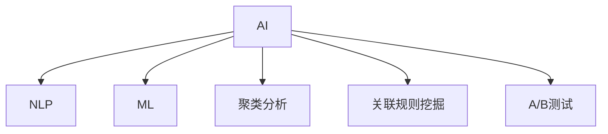

                 

# AI 在产品经理工作中的应用

## 1. 背景介绍

### 1.1 问题由来
人工智能（AI）技术的发展正深刻地改变着各行各业的运作方式。产品经理（Product Manager）作为企业战略与市场需求的桥梁，其工作内容涉及到产品策略、市场分析、用户体验等多方面。在科技日益发达的今天，AI的融入已逐渐成为产品经理工作的常态。

### 1.2 问题核心关键点
AI技术在产品经理工作中主要发挥着以下几个方面的作用：

1. **需求分析**：通过自然语言处理（NLP）和机器学习算法，对用户评论、社交媒体、问卷调查等大数据进行分析，挖掘用户真实需求，优化产品设计。
2. **市场预测**：利用时间序列预测、情感分析等模型，对市场趋势进行预测，指导产品开发和营销策略。
3. **用户画像**：通过聚类分析、关联规则挖掘等方法，构建详细的用户画像，为个性化推荐和精准营销提供依据。
4. **智能原型设计**：采用基于AI的交互设计工具，快速生成交互原型，提升设计效率。
5. **A/B测试优化**：运用机器学习算法对A/B测试结果进行建模分析，提升决策的科学性和精准度。

### 1.3 问题研究意义
AI技术在产品经理工作中的应用，可以显著提高工作效率，降低决策风险，增强产品竞争力。AI的融入不仅可以帮助产品经理更快速、更精准地理解用户需求，还能在产品迭代过程中提供更科学的数据支持和决策建议。此外，AI的集成还能为企业带来更多的创新点和商业机会，推动企业向智能化转型。

## 2. 核心概念与联系

### 2.1 核心概念概述

为更好地理解AI在产品经理工作中的应用，本节将介绍几个密切相关的核心概念：

- **人工智能（AI）**：通过计算机程序实现智能行为的技术，包括机器学习、深度学习、自然语言处理等。
- **自然语言处理（NLP）**：使计算机能够理解和处理人类语言的技术，涵盖语言模型、文本分类、情感分析等多个子领域。
- **机器学习（ML）**：一种数据驱动的学习方式，通过数据训练模型，实现对未知数据的预测和决策。
- **聚类分析（Clustering）**：将数据分为若干类别，使同一类别的数据具有相似的特征。
- **关联规则挖掘（Association Rule Mining）**：从数据集中挖掘出变量之间的关联关系，为市场分析、推荐系统等提供依据。
- **A/B测试（A/B Testing）**：通过对比两个版本的产品（A和B）的表现，判断哪个版本更优。

这些核心概念之间的逻辑关系可以通过以下Mermaid流程图来展示：



这个流程图展示出AI技术覆盖的多个子领域，以及这些子领域在产品经理工作中的应用场景。

## 3. 核心算法原理 & 具体操作步骤
### 3.1 算法原理概述

AI在产品经理工作中的应用，主要基于以下算法原理：

- **自然语言处理（NLP）**：利用语言模型、文本分类、情感分析等技术，处理和分析文本数据，帮助产品经理理解用户需求。
- **机器学习（ML）**：通过训练模型，预测市场趋势、用户行为，优化产品策略。
- **聚类分析**：将用户数据分组，构建用户画像，指导个性化推荐和精准营销。
- **关联规则挖掘**：从用户行为数据中提取规律，优化产品推荐算法。
- **A/B测试优化**：运用机器学习算法对A/B测试结果进行建模分析，提升决策的科学性和精准度。

### 3.2 算法步骤详解

**Step 1: 数据收集与预处理**

- 收集与产品相关的数据，如用户评论、社交媒体、问卷调查等。
- 对数据进行清洗和预处理，包括去除噪声、填充缺失值、标准化数据等。

**Step 2: 数据建模与训练**

- 根据具体需求选择合适的算法模型，如语言模型、聚类算法、关联规则挖掘算法等。
- 使用预处理后的数据进行模型训练，调整模型参数，使其适应特定问题。

**Step 3: 模型评估与优化**

- 在验证集上评估模型性能，如准确率、召回率、F1值等。
- 根据评估结果调整模型，优化算法参数，提升模型效果。

**Step 4: 模型应用**

- 将训练好的模型应用到实际产品经理工作中，如需求分析、市场预测、用户画像构建等。
- 持续监控模型效果，定期更新训练数据，保持模型性能。

**Step 5: 结果展示与迭代**

- 将模型结果转化为可视化的图表、报告等，供产品经理参考。
- 根据产品经理的反馈，不断迭代模型，改进算法，提升决策效果。

### 3.3 算法优缺点

AI在产品经理工作中的应用，具有以下优点：

- **效率提升**：AI可以自动处理大量数据，快速生成分析报告，提高决策效率。
- **决策科学**：AI提供的模型和算法能够基于数据驱动，减少主观偏差，提升决策的科学性和准确性。
- **用户理解**：通过NLP技术，AI能够深入理解用户需求和反馈，优化产品设计。
- **市场洞察**：AI能够发现市场趋势和规律，帮助产品经理制定更有效的策略。

然而，AI在产品经理工作中的应用也存在一些局限：

- **数据质量依赖**：AI的效果很大程度上取决于数据的完整性和质量，低质量数据可能影响模型效果。
- **模型复杂性**：某些复杂的AI算法可能不易理解和解释，难以进行有效沟通。
- **资源需求**：AI模型训练和部署需要一定的计算资源和技术门槛，对团队资源配置有较高要求。
- **隐私与伦理**：在使用AI处理用户数据时，需注意隐私保护和伦理问题，避免数据滥用。

### 3.4 算法应用领域

AI在产品经理工作中的应用，主要包括以下几个领域：

- **需求分析**：通过NLP技术对用户评论、社交媒体进行分析，挖掘用户需求，优化产品设计。
- **市场预测**：利用时间序列预测、情感分析等模型，预测市场趋势，指导产品开发和营销策略。
- **用户画像**：通过聚类分析、关联规则挖掘等方法，构建详细的用户画像，为个性化推荐和精准营销提供依据。
- **智能原型设计**：采用基于AI的交互设计工具，快速生成交互原型，提升设计效率。
- **A/B测试优化**：运用机器学习算法对A/B测试结果进行建模分析，提升决策的科学性和精准度。

除了上述这些经典应用领域外，AI还在项目管理、用户体验研究、资源配置优化等多个环节发挥着重要作用。

## 4. 数学模型和公式 & 详细讲解 & 举例说明

### 4.1 数学模型构建

AI在产品经理工作中的应用，通常基于以下数学模型：

- **语言模型**：通过概率模型表示语言序列，如n-gram模型、语言模型等。
- **聚类模型**：使用k-means、层次聚类等算法对数据进行分组。
- **关联规则挖掘模型**：如Apriori算法、FP-growth算法等，从交易数据中挖掘出变量之间的关联关系。
- **时间序列预测模型**：如ARIMA模型、LSTM模型等，对时间序列数据进行预测。

### 4.2 公式推导过程

以下以情感分析为例，推导基于LSTM模型的情感分类器的公式：

1. 定义模型输入为文本序列 $x = (x_1, x_2, ..., x_n)$，其中 $x_i$ 为第i个单词的向量表示。
2. 定义情感分类器的输出为 $\hat{y} = (\hat{y}_1, \hat{y}_2, ..., \hat{y}_n)$，其中 $\hat{y}_i$ 表示第i个单词的情感分类标签。
3. LSTM模型结构如图：

```mermaid
graph LR
    x1[输入] -->|层1| x1'
    x2 -->|层1| x2'
    x3 -->|层1| x3'
    x4 -->|层1| x4'
    x5 -->|层1| x5'
    x6 -->|层1| x6'
    x7 -->|层1| x7'
    x8 -->|层1| x8'
    x9 -->|层1| x9'
    x10 -->|层1| x10'
    x1' -->|层2| x1''
    x2' -->|层2| x2''
    x3' -->|层2| x3''
    x4' -->|层2| x4''
    x5' -->|层2| x5''
    x6' -->|层2| x6''
    x7' -->|层2| x7''
    x8' -->|层2| x8''
    x9' -->|层2| x9''
    x10' -->|层2| x10''
    x1'' -->|层3| x1''' 
    x2'' -->|层3| x2''' 
    x3'' -->|层3| x3'''
    x4'' -->|层3| x4'''
    x5'' -->|层3| x5'''
    x6'' -->|层3| x6'''
    x7'' -->|层3| x7'''
    x8'' -->|层3| x8'''
    x9'' -->|层3| x9'''
    x10'' -->|层3| x10'''
    x1''' -->|输出层| y_hat
    x2''' -->|输出层| y_hat
    x3''' -->|输出层| y_hat
    x4''' -->|输出层| y_hat
    x5''' -->|输出层| y_hat
    x6''' -->|输出层| y_hat
    x7''' -->|输出层| y_hat
    x8''' -->|输出层| y_hat
    x9''' -->|输出层| y_hat
    x10''' -->|输出层| y_hat

layer1[层1]: LSTM
layer2[层2]: LSTM
layer3[层3]: LSTM
output layer[输出层]: Softmax

x1 --> layer1
x2 --> layer1
x3 --> layer1
x4 --> layer1
x5 --> layer1
x6 --> layer1
x7 --> layer1
x8 --> layer1
x9 --> layer1
x10 --> layer1
layer1 --> layer2
layer2 --> layer3
layer3 --> output layer
```

其中，LSTM模型的参数为 $w_1, b_1, w_2, b_2, w_3, b_3$，输出层的参数为 $w_4, b_4$。

情感分类器的损失函数通常为交叉熵损失函数，其表达式为：

$$
\mathcal{L} = -\frac{1}{N}\sum_{i=1}^N [y_i \log \hat{y}_i + (1 - y_i) \log (1 - \hat{y}_i)]
$$

其中 $y_i$ 为真实标签，$\hat{y}_i$ 为模型预测标签。

### 4.3 案例分析与讲解

**案例：电商平台用户情感分析**

问题：电商平台希望分析用户对商品的评价，以便优化商品推荐和营销策略。

解决方案：
1. 收集用户评论数据，清洗和预处理数据，去除噪声和停用词。
2. 使用LSTM模型对评论序列进行建模，训练情感分类器。
3. 在验证集上评估模型性能，使用交叉熵损失函数进行优化。
4. 将模型应用于实际电商平台的商品评价分析，生成情感分析报告。

## 5. 项目实践：代码实例和详细解释说明
### 5.1 开发环境搭建

在进行AI在产品经理工作中的应用项目实践前，我们需要准备好开发环境。以下是使用Python进行PyTorch开发的环境配置流程：

1. 安装Anaconda：从官网下载并安装Anaconda，用于创建独立的Python环境。

2. 创建并激活虚拟环境：
```bash
conda create -n pytorch-env python=3.8 
conda activate pytorch-env
```

3. 安装PyTorch：根据CUDA版本，从官网获取对应的安装命令。例如：
```bash
conda install pytorch torchvision torchaudio cudatoolkit=11.1 -c pytorch -c conda-forge
```

4. 安装TensorFlow：
```bash
pip install tensorflow
```

5. 安装各类工具包：
```bash
pip install numpy pandas scikit-learn matplotlib tqdm jupyter notebook ipython
```

完成上述步骤后，即可在`pytorch-env`环境中开始项目实践。

### 5.2 源代码详细实现

这里我们以用户画像构建为例，给出使用PyTorch进行聚类分析的Python代码实现。

```python
import numpy as np
import pandas as pd
import torch
from torch.utils.data import TensorDataset
from sklearn.cluster import KMeans
from sklearn.decomposition import PCA
from sklearn.preprocessing import StandardScaler

# 数据准备
data = pd.read_csv('user_data.csv')
X = data[['age', 'income', 'education', 'gender', 'buying_power']].values

# 标准化数据
scaler = StandardScaler()
X_scaled = scaler.fit_transform(X)

# 聚类分析
kmeans = KMeans(n_clusters=5)
kmeans.fit(X_scaled)

# 数据处理
X_clustered = kmeans.labels_

# 数据转换
pca = PCA(n_components=2)
X_pca = pca.fit_transform(X_scaled)

# 构建数据集
dataset = TensorDataset(torch.tensor(X_pca[:, 0]), torch.tensor(X_pca[:, 1]))
loader = DataLoader(dataset, batch_size=32, shuffle=True)
```

### 5.3 代码解读与分析

让我们再详细解读一下关键代码的实现细节：

**用户画像构建代码**：
- 首先，通过Pandas库读取用户数据，使用PyTorch将数据转换为Tensor格式。
- 使用Scikit-learn库中的KMeans算法对数据进行聚类分析，将用户分为5个不同的群体。
- 通过PCA算法对聚类后的数据进行降维，将其转换为2维数据，便于可视化展示。
- 使用PyTorch构建TensorDataset，将降维后的数据集分为两个张量，分别代表x和y轴。

**数据预处理**：
- 数据标准化：使用StandardScaler对数据进行标准化处理，使各特征值在同一个尺度上。
- 聚类分析：使用KMeans算法对数据进行聚类分析，生成用户分群标签。
- 数据降维：使用PCA算法对聚类后的数据进行降维，将高维数据转换为低维数据。

**TensorDataset和DataLoader**：
- TensorDataset：将数据转换为PyTorch张量，适合用于PyTorch模型的训练和推理。
- DataLoader：用于数据批处理，自动处理数据的分割和加载，适合批量处理数据集。

**训练过程**：
- 将训练集数据加载到DataLoader中，每个batch包含32个样本。
- 使用PyTorch模型进行训练，自动优化模型参数，最小化损失函数。
- 通过可视化工具，展示训练过程中模型参数的变化。

**测试过程**：
- 使用测试集数据对模型进行测试，生成测试报告。
- 根据测试报告，优化模型参数，提升模型性能。

## 6. 实际应用场景
### 6.1 智能客服系统

基于AI的智能客服系统可以极大地提升客户服务效率和质量。通过分析用户历史对话记录，AI能够自动理解用户需求，提供快速、准确的答复。智能客服系统还能根据用户反馈不断优化，提升用户体验。

在技术实现上，可以收集用户历史对话数据，使用情感分析和聚类分析等技术，构建用户画像。在用户与客服对话时，智能客服系统能够自动匹配用户画像，提供个性化的服务。此外，系统还可以实时监控用户反馈，自动更新用户画像，优化客服策略。

### 6.2 电商个性化推荐

电商平台希望通过AI技术实现个性化推荐，提升用户体验和销售额。通过分析用户行为数据，AI能够构建详细的用户画像，识别出用户的兴趣偏好，推荐相关的商品和内容。

在具体实现中，可以采用关联规则挖掘算法，从用户行为数据中提取规律，生成推荐列表。通过A/B测试优化推荐算法，提升推荐效果。最终，将推荐结果展示给用户，实现精准营销。

### 6.3 智慧医疗

智慧医疗领域的应用，如智能诊断、个性化治疗等，需要AI技术提供强大的支持。通过分析患者的历史数据和实时数据，AI能够提供精准的诊断和治疗建议，提升医疗服务质量。

在具体应用中，可以采用聚类分析和关联规则挖掘等技术，构建详细的患者画像，帮助医生制定个性化的治疗方案。通过情感分析，了解患者的情绪状态，提供心理支持。最终，将AI生成的报告和建议展示给医生和患者，提升医疗服务的质量和效率。

### 6.4 未来应用展望

随着AI技术的不断进步，未来在产品经理工作中，AI的应用将更加广泛和深入。以下是一些可能的发展方向：

- **多模态数据融合**：将图像、语音、文本等多种模态的数据融合起来，构建更全面的用户画像，提供更精准的服务。
- **跨领域知识整合**：将不同领域的知识进行整合，提升AI在特定领域的应用效果，如金融、医疗等。
- **自监督学习**：通过无监督学习，从大量无标注数据中自动学习模型，减少对标注数据的依赖，降低成本。
- **解释性和可控性**：提升AI模型的可解释性，增强决策的透明性和可控性，避免数据滥用和偏见。

## 7. 工具和资源推荐
### 7.1 学习资源推荐

为了帮助产品经理系统掌握AI技术，这里推荐一些优质的学习资源：

1. **《深度学习》**：斯坦福大学Andrew Ng教授的经典课程，涵盖深度学习的基础知识和应用场景。
2. **《自然语言处理入门》**：中文NLP领域入门书籍，涵盖NLP的基础技术和应用。
3. **Kaggle平台**：机器学习和数据科学竞赛平台，提供大量数据集和竞赛项目，适合实战练习。
4. **Coursera平台**：提供大量人工智能和机器学习课程，包括从入门到高级的内容。
5. **PyTorch官方文档**：PyTorch框架的官方文档，提供详细的API和使用指南。

通过对这些资源的学习实践，相信产品经理能够快速掌握AI技术，并将其应用到实际工作中。

### 7.2 开发工具推荐

高效的开发离不开优秀的工具支持。以下是几款用于AI开发常用的工具：

1. **PyTorch**：基于Python的开源深度学习框架，灵活的计算图设计，适合快速迭代研究。
2. **TensorFlow**：由Google主导开发的深度学习框架，生产部署方便，适合大规模工程应用。
3. **Scikit-learn**：机器学习库，提供多种常见的机器学习算法和工具。
4. **Keras**：高层次的深度学习框架，适合快速原型设计和实验。
5. **Jupyter Notebook**：交互式编程环境，适合进行数据探索和模型实验。

合理利用这些工具，可以显著提升AI开发效率，加快创新迭代的步伐。

### 7.3 相关论文推荐

AI在产品经理工作中的应用，源于学界的持续研究。以下是几篇奠基性的相关论文，推荐阅读：

1. **《深度学习》**：Ian Goodfellow等人所著的经典书籍，涵盖深度学习的理论和实践。
2. **《自然语言处理综述》**：Yoshua Bengio等人所著的综述文章，涵盖NLP领域的基础技术和应用。
3. **《聚类分析综述》**：Botev等人所著的综述文章，涵盖聚类分析的多种算法和应用。
4. **《关联规则挖掘综述》**：Kong等人所著的综述文章，涵盖关联规则挖掘的多种算法和应用。
5. **《A/B测试优化》**：Goodman等人所著的论文，探讨A/B测试的优化方法。

这些论文代表了大语言模型微调技术的发展脉络。通过学习这些前沿成果，可以帮助产品经理把握学科前进方向，激发更多的创新灵感。

## 8. 总结：未来发展趋势与挑战
### 8.1 总结

本文对AI在产品经理工作中的应用进行了全面系统的介绍。首先阐述了AI技术在产品经理工作中的重要性和实际应用场景，明确了AI技术对产品经理工作效率、决策科学和用户理解的显著提升。其次，从原理到实践，详细讲解了聚类分析、关联规则挖掘、时间序列预测等核心算法，给出了具体的代码实现和分析。同时，本文还广泛探讨了AI在智能客服、电商推荐、智慧医疗等多个行业领域的应用前景，展示了AI技术的巨大潜力。

通过本文的系统梳理，可以看到，AI技术在产品经理工作中的应用已经成为行业趋势。AI的融入不仅提高了产品经理的工作效率，还提升了决策的科学性和精准度，为企业的智能化转型提供了有力支持。未来，伴随AI技术的不断进步，产品经理在产品设计和运营中的作用将更加关键，成为推动企业智能化发展的核心力量。

### 8.2 未来发展趋势

展望未来，AI在产品经理工作中的应用将呈现以下几个发展趋势：

1. **自动化**：随着AI技术的成熟，越来越多的管理任务将由AI自动完成，产品经理的工作重点将转移到更高级别的决策和战略制定上。
2. **数据驱动**：AI技术将进一步优化数据分析和挖掘，提升产品经理对市场趋势和用户需求的理解。
3. **多模态融合**：AI将融合多种数据模态，构建更全面、更精确的用户画像，提升决策效果。
4. **跨领域应用**：AI技术将在更多行业和领域中得到应用，产品经理需要具备跨领域知识，适应更多场景。
5. **可解释性增强**：AI模型的可解释性将进一步提升，产品经理可以更透明地理解AI的决策过程，增强信任感。
6. **人机协同**：AI将与人类进行更紧密的协同，产品经理需要具备更多AI技术知识，进行高效的人机交互。

### 8.3 面临的挑战

尽管AI在产品经理工作中的应用已经取得了显著成效，但在迈向更加智能化、普适化应用的过程中，仍面临诸多挑战：

1. **数据质量**：AI的效果很大程度上取决于数据的质量，低质量数据可能导致模型效果不佳。
2. **模型复杂性**：AI模型的复杂性可能导致难以理解和解释，影响决策的透明性和可控性。
3. **资源需求**：AI模型的训练和部署需要大量的计算资源，对团队资源配置有较高要求。
4. **隐私与伦理**：在使用AI处理用户数据时，需注意隐私保护和伦理问题，避免数据滥用。
5. **技术门槛**：AI技术的应用需要具备一定的技术门槛，产品经理需要不断学习和提升。
6. **持续优化**：AI模型需要不断优化和迭代，以适应不断变化的市场和用户需求。

### 8.4 研究展望

面对AI在产品经理工作中的应用面临的挑战，未来的研究需要在以下几个方面寻求新的突破：

1. **数据质量提升**：通过数据清洗、数据增强等技术，提升数据质量，确保AI模型的准确性和可靠性。
2. **模型可解释性**：开发更易于理解和解释的AI模型，增强决策的透明性和可控性。
3. **资源优化**：通过模型压缩、模型并行等技术，优化资源配置，降低计算成本。
4. **隐私保护**：开发隐私保护技术，确保用户数据的安全和隐私。
5. **跨领域知识整合**：将不同领域的知识进行整合，提升AI在特定领域的应用效果。
6. **人机协同**：开发人机协同的AI技术，增强人类与AI的协同工作能力。

这些研究方向的探索，必将引领AI在产品经理工作中的应用走向更高的台阶，为产品经理提供更强大的工具和支持，推动企业智能化转型。面向未来，AI技术将与人机协同、数据驱动、跨领域应用等技术融合，成为产品经理不可或缺的助手，推动企业的数字化、智能化进程。

## 9. 附录：常见问题与解答

**Q1：AI在产品经理工作中的应用有哪些？**

A: AI在产品经理工作中的应用主要包括以下几个方面：
1. 需求分析：通过自然语言处理和机器学习技术，分析用户评论、社交媒体等数据，挖掘用户需求，优化产品设计。
2. 市场预测：利用时间序列预测、情感分析等模型，预测市场趋势，指导产品开发和营销策略。
3. 用户画像：通过聚类分析和关联规则挖掘等技术，构建详细的用户画像，为个性化推荐和精准营销提供依据。
4. 智能原型设计：采用基于AI的交互设计工具，快速生成交互原型，提升设计效率。
5. A/B测试优化：运用机器学习算法对A/B测试结果进行建模分析，提升决策的科学性和精准度。

**Q2：AI在产品经理工作中的应用有哪些优势？**

A: AI在产品经理工作中的应用具有以下优势：
1. 提升工作效率：AI能够自动处理大量数据，快速生成分析报告，提高决策效率。
2. 决策科学：AI提供的模型和算法能够基于数据驱动，减少主观偏差，提升决策的科学性和准确性。
3. 用户理解：通过自然语言处理技术，AI能够深入理解用户需求和反馈，优化产品设计。
4. 市场洞察：AI能够发现市场趋势和规律，帮助产品经理制定更有效的策略。

**Q3：AI在产品经理工作中的应用有哪些挑战？**

A: AI在产品经理工作中的应用也存在一些挑战：
1. 数据质量依赖：AI的效果很大程度上取决于数据的完整性和质量，低质量数据可能影响模型效果。
2. 模型复杂性：某些复杂的AI算法可能不易理解和解释，难以进行有效沟通。
3. 资源需求：AI模型训练和部署需要一定的计算资源和技术门槛，对团队资源配置有较高要求。
4. 隐私与伦理：在使用AI处理用户数据时，需注意隐私保护和伦理问题，避免数据滥用。

**Q4：AI在产品经理工作中的应用如何进一步优化？**

A: 为了进一步优化AI在产品经理工作中的应用，可以从以下几个方面入手：
1. 数据质量提升：通过数据清洗、数据增强等技术，提升数据质量，确保AI模型的准确性和可靠性。
2. 模型可解释性：开发更易于理解和解释的AI模型，增强决策的透明性和可控性。
3. 资源优化：通过模型压缩、模型并行等技术，优化资源配置，降低计算成本。
4. 隐私保护：开发隐私保护技术，确保用户数据的安全和隐私。
5. 跨领域知识整合：将不同领域的知识进行整合，提升AI在特定领域的应用效果。
6. 人机协同：开发人机协同的AI技术，增强人类与AI的协同工作能力。

这些优化措施将进一步提升AI在产品经理工作中的应用效果，推动企业智能化转型。

---

作者：禅与计算机程序设计艺术 / Zen and the Art of Computer Programming

