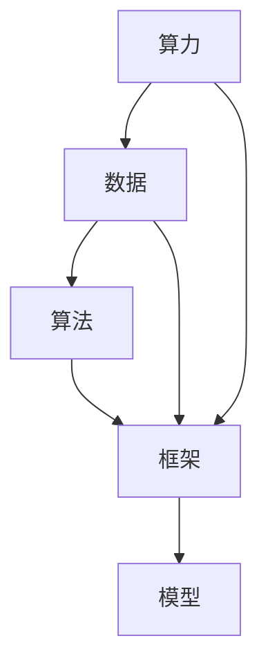

                 

# AI 基础设施建设：算力、数据、算法、框架

## 1. 背景介绍

在数字化转型的浪潮中，人工智能(AI)技术正在以飞快的速度重塑各行各业。从自动驾驶、医疗诊断、金融预测到智慧城市，AI的触角正在越来越多地深入到人们生活的方方面面。然而，尽管AI技术层出不穷，要将其落地应用并产生实际价值，还需依靠强大的基础设施建设。本文将深入探讨构建AI基础设施的核心要素：算力、数据、算法、框架，从理论到实践，为你揭开AI技术的神秘面纱。

## 2. 核心概念与联系

### 2.1 核心概念概述

为更好地理解AI基础设施的核心要素，本节将介绍几个密切相关的核心概念：

- **算力**：指计算能力，即硬件设备在单位时间内所能处理的任务数量。算力是AI应用的基础，强大的算力能加快模型训练速度，提升推理效率。
- **数据**：指用于训练和测试AI模型的数据集。高质量的数据集是模型性能的保障，数据的数量、质量、多样性对AI模型的效果至关重要。
- **算法**：指用于解决特定问题的计算方法和步骤。算法决定了模型的决策逻辑和输出结果，高效的算法能提升模型训练和推理的效率。
- **框架**：指用于开发、训练、部署AI模型的软件工具。框架提供了模型构建的抽象接口，加速了AI应用的开发过程。

这些核心概念之间的逻辑关系可以通过以下Mermaid流程图来展示：



这个流程图展示了一个从算力、数据到算法和框架，最终生成AI模型的整体流程。

## 3. 核心算法原理 & 具体操作步骤

### 3.1 算法原理概述

AI基础设施的核心在于构建高效的算法，以便在有限的资源下最大化模型性能。AI算法的原理通常基于数学模型和优化方法，通过训练过程调整模型参数，使其能够预测或生成新数据。常见的AI算法包括但不限于：

- **监督学习**：通过标注数据训练模型，使其能够进行分类、回归等任务。
- **无监督学习**：利用未标注数据学习数据的分布特征，发现潜在模式。
- **强化学习**：通过与环境的互动，学习最优策略以最大化奖励。
- **迁移学习**：将在一个任务上学到的知识迁移到另一个相关任务上，提高模型的泛化能力。
- **迁移预训练**：先在大规模数据上预训练模型，再在小数据集上进行微调，提升模型性能。
- **自监督学习**：利用数据自相关的特性，学习模型参数。

这些算法通常需要大量数据和计算资源进行训练和优化，以获得最佳的模型性能。

### 3.2 算法步骤详解

AI算法的设计和实现过程通常包括以下步骤：

1. **数据准备**：收集、清洗、标注数据集，划分训练集、验证集和测试集。
2. **模型选择**：选择或设计合适的算法和模型架构，如深度神经网络、卷积神经网络等。
3. **模型训练**：使用训练集对模型进行迭代训练，调整模型参数以最小化损失函数。
4. **模型评估**：在验证集上评估模型性能，选择最优模型进行测试集上的最终评估。
5. **模型优化**：根据评估结果，对模型进行优化调整，如增加正则化、调整学习率等。
6. **模型部署**：将训练好的模型集成到应用系统中，进行实时推理或预测。

### 3.3 算法优缺点

AI算法的优缺点因算法类型而异，但通常来说：

- **优点**：算法可以自动发现数据中的模式和规律，适应性强，能够处理大规模数据集，提升决策准确性。
- **缺点**：算法需要大量计算资源和标注数据，训练过程复杂，模型可解释性较差，容易过拟合。

### 3.4 算法应用领域

AI算法被广泛应用于各种领域，例如：

- **计算机视觉**：如图像识别、目标检测、图像生成等。
- **自然语言处理**：如文本分类、情感分析、机器翻译等。
- **语音识别**：如语音合成、语音识别等。
- **推荐系统**：如电商推荐、视频推荐等。
- **金融预测**：如股票预测、风险评估等。
- **医疗诊断**：如疾病预测、图像分析等。

## 4. 数学模型和公式 & 详细讲解 & 举例说明

### 4.1 数学模型构建

AI算法通常基于数学模型进行构建，例如线性回归、逻辑回归、支持向量机等。这里以线性回归模型为例，介绍数学模型的构建过程。

假设我们有一个线性回归模型 $y = wx + b$，其中 $y$ 是输出，$x$ 是输入，$w$ 是权重向量，$b$ 是偏置项。我们的目标是找到最优的 $w$ 和 $b$，使得模型能够最小化预测误差。

### 4.2 公式推导过程

在损失函数中，我们通常使用均方误差（Mean Squared Error, MSE）作为优化目标：

$$
\mathcal{L}(w, b) = \frac{1}{N} \sum_{i=1}^N (y_i - wx_i - b)^2
$$

其中 $N$ 是样本数量，$y_i$ 是第 $i$ 个样本的标签，$x_i$ 是第 $i$ 个样本的特征。

为了最小化损失函数，我们使用梯度下降算法对权重和偏置进行更新：

$$
w \leftarrow w - \eta \nabla_{w}\mathcal{L}(w, b)
$$
$$
b \leftarrow b - \eta \nabla_{b}\mathcal{L}(w, b)
$$

其中 $\eta$ 是学习率，$\nabla_{w}\mathcal{L}(w, b)$ 和 $\nabla_{b}\mathcal{L}(w, b)$ 分别是损失函数对 $w$ 和 $b$ 的梯度。

### 4.3 案例分析与讲解

假设我们有一个房价预测问题，其中输入是房子的面积 $x_i$，输出是房子的价格 $y_i$。我们的目标是训练一个线性回归模型，使其能够预测新房子的价格。

我们首先需要收集和清洗房价数据集，将其划分为训练集和测试集。然后使用梯度下降算法在训练集上训练模型，不断调整权重和偏置，直到在测试集上的均方误差最小。最后，使用训练好的模型对新房子的面积进行预测，得到其价格。

## 5. 项目实践：代码实例和详细解释说明

### 5.1 开发环境搭建

在进行AI项目实践前，我们需要准备好开发环境。以下是使用Python进行TensorFlow开发的环境配置流程：

1. 安装Anaconda：从官网下载并安装Anaconda，用于创建独立的Python环境。

2. 创建并激活虚拟环境：
```bash
conda create -n tf-env python=3.8 
conda activate tf-env
```

3. 安装TensorFlow：根据CUDA版本，从官网获取对应的安装命令。例如：
```bash
pip install tensorflow tensorflow-cpu tensorflow-addons
```

4. 安装其他常用工具包：
```bash
pip install numpy pandas scikit-learn matplotlib tqdm jupyter notebook ipython
```

完成上述步骤后，即可在`tf-env`环境中开始AI项目实践。

### 5.2 源代码详细实现

下面以房价预测为例，给出使用TensorFlow对线性回归模型进行训练的PyTorch代码实现。

首先，定义模型：

```python
import tensorflow as tf

model = tf.keras.Sequential([
    tf.keras.layers.Dense(units=1, input_shape=[1])
])

# 定义损失函数和优化器
model.compile(loss='mean_squared_error', optimizer=tf.keras.optimizers.Adam(0.01))
```

然后，准备数据：

```python
import pandas as pd
import numpy as np

# 加载数据集
data = pd.read_csv('housing.csv')

# 数据预处理
X = np.array(data[['sqft']]).reshape(-1, 1)
y = np.array(data['price'])

# 将数据划分为训练集和测试集
X_train, X_test, y_train, y_test = train_test_split(X, y, test_size=0.2, random_state=42)
```

接着，训练模型：

```python
model.fit(X_train, y_train, epochs=100, validation_data=(X_test, y_test))
```

最后，评估模型：

```python
loss = model.evaluate(X_test, y_test)
print('Mean Squared Error: ', loss)
```

以上就是使用TensorFlow进行房价预测的完整代码实现。可以看到，TensorFlow提供了丰富的API和模型，可以高效地进行模型构建和训练。

### 5.3 代码解读与分析

让我们再详细解读一下关键代码的实现细节：

**Sequential模型**：
- 创建一个序列模型，可以按顺序堆叠多个层。
- 添加一层全连接层，其中`units`参数指定输出单元数，`input_shape`参数指定输入形状。

**模型编译**：
- 定义模型的损失函数和优化器，`mean_squared_error`是均方误差损失函数，`Adam`优化器是常用的随机梯度下降优化器。

**数据预处理**：
- 从CSV文件中加载数据集，使用`pandas`进行数据清洗和预处理。
- 将数据集划分为训练集和测试集。

**模型训练**：
- 使用`fit`方法对模型进行训练，指定训练集和测试集，设置迭代次数为100次。

**模型评估**：
- 使用`evaluate`方法评估模型在测试集上的均方误差。

可以看到，TensorFlow提供了从模型构建到训练评估的全套工具，大大简化了AI模型的开发过程。

当然，工业级的系统实现还需考虑更多因素，如模型的保存和部署、超参数的自动搜索、更灵活的模型适配层等。但核心的算法构建和训练过程基本与此类似。

## 6. 实际应用场景

### 6.1 金融风险管理

金融行业面临着巨大的风险挑战，例如信用风险、市场风险等。利用AI技术，可以构建风险预测模型，提前识别潜在风险，制定应对策略。

具体而言，可以通过收集金融市场的历史数据，包括股票价格、利率、市场波动等，使用监督学习算法训练模型，预测未来的金融风险。例如，可以使用线性回归、决策树等算法，对金融市场的变化进行预测，并在发现异常波动时发出警报，帮助金融机构及时采取措施，降低损失。

### 6.2 智能推荐系统

电商和内容平台需要为用户提供个性化的推荐服务，提高用户体验和转化率。AI推荐系统可以通过用户的行为数据，如浏览记录、购买历史等，训练模型，预测用户对新商品或内容的兴趣。

在技术实现上，可以收集用户的行为数据，使用协同过滤、矩阵分解等算法，训练推荐模型，预测用户对新商品或内容的兴趣，生成个性化的推荐列表。通过推荐系统，用户可以获得更加精准的内容和服务，同时平台也能提高用户的停留时间和交易量。

### 6.3 医疗影像诊断

医疗影像诊断是AI在医疗领域的重要应用之一。通过AI技术，可以对X光片、CT扫描等影像数据进行分析，辅助医生进行疾病诊断和手术规划。

具体而言，可以收集大量的医疗影像数据，使用卷积神经网络等深度学习算法，训练影像诊断模型，对新影像进行分析和预测。例如，可以使用卷积神经网络，对乳腺癌的影像数据进行分类，判断是否为恶性肿瘤，从而辅助医生进行诊断和治疗。

### 6.4 未来应用展望

随着AI技术的不断进步，AI基础设施建设也将迎来新的发展。未来的AI应用将更加广泛和深入，涵盖更多领域和行业。

在智慧城市中，AI技术将用于城市管理、交通规划、公共安全等领域，提升城市治理效率和居民生活质量。例如，可以使用AI技术，对城市中的交通流量进行实时监控和预测，优化交通信号灯的时序，减少交通拥堵。

在智能家居中，AI技术将用于设备互联、语音识别、环境监测等方面，提升家庭生活的便捷性和舒适度。例如，可以使用AI技术，对家中的智能设备进行语音控制，自动调节室内温度、灯光等，提升家庭生活的智能化水平。

## 7. 工具和资源推荐

### 7.1 学习资源推荐

为了帮助开发者系统掌握AI基础设施的核心要素，这里推荐一些优质的学习资源：

1. **《深度学习》（Ian Goodfellow 著）**：深度学习领域的经典教材，涵盖了深度学习的数学基础、算法原理和实际应用。
2. **《TensorFlow官方文档》**：TensorFlow的官方文档，提供了详细的API介绍、模型构建和训练教程。
3. **Coursera《机器学习》课程**：由斯坦福大学Andrew Ng教授讲授，系统介绍了机器学习的理论和应用，适合初学者和进阶学习者。
4. **Kaggle数据集和竞赛平台**：提供了大量高质量的数据集和竞赛，通过实际项目实践，提高数据处理和模型构建能力。
5. **GitHub开源项目**：GitHub上丰富的开源项目和代码库，提供了大量现成的模型和算法，可以参考和学习。

通过对这些资源的学习实践，相信你一定能够全面掌握AI基础设施的构建方法，并用于解决实际的AI问题。

### 7.2 开发工具推荐

高效的开发离不开优秀的工具支持。以下是几款用于AI基础设施开发的常用工具：

1. **TensorFlow**：由Google主导开发的开源深度学习框架，生产部署方便，适合大规模工程应用。提供了丰富的API和模型，支持分布式训练和推理。
2. **PyTorch**：Facebook开发的开源深度学习框架，灵活高效，适合研究和原型开发。提供了丰富的数学运算和优化算法。
3. **Scikit-learn**：Python中的机器学习库，提供了常用的机器学习算法和工具，适合快速构建和训练模型。
4. **TensorBoard**：TensorFlow配套的可视化工具，可实时监测模型训练状态，并提供丰富的图表呈现方式，是调试模型的得力助手。
5. **Jupyter Notebook**：交互式开发环境，支持Python代码的编写、执行和可视化，方便进行模型构建和实验。

合理利用这些工具，可以显著提升AI基础设施的开发效率，加速创新迭代的步伐。

### 7.3 相关论文推荐

AI基础设施建设的研究源于学界的持续研究。以下是几篇奠基性的相关论文，推荐阅读：

1. **Deep Learning**（Ian Goodfellow 等著）：深度学习领域的经典教材，涵盖了深度学习的数学基础、算法原理和实际应用。
2. **ImageNet Classification with Deep Convolutional Neural Networks**（Alex Krizhevsky 等著）：介绍了深度卷积神经网络在图像分类任务中的应用，标志着深度学习时代的到来。
3. **Convolutional Neural Networks for Sentence Classification**（Kaiming He 等著）：介绍了卷积神经网络在文本分类任务中的应用，展示了其在自然语言处理领域的强大潜力。
4. **Natural Language Processing with Transfer Learning**（Xavier Glorot 等著）：介绍了迁移学习在自然语言处理中的应用，展示了其在多领域任务上的通用性和高效性。
5. **Recurrent Neural Networks for Sequence Prediction**（Yoshua Bengio 等著）：介绍了循环神经网络在序列预测任务中的应用，展示了其在语言模型和机器翻译等任务上的表现。

这些论文代表了大规模深度学习基础设施建设的研究进展，通过学习这些前沿成果，可以帮助研究者把握学科前进方向，激发更多的创新灵感。

## 8. 总结：未来发展趋势与挑战

### 8.1 总结

本文对AI基础设施建设的核心要素：算力、数据、算法、框架进行了全面系统的介绍。首先阐述了算力、数据、算法、框架在AI基础设施建设中的重要性，明确了它们之间的相互联系和影响。其次，从理论到实践，详细讲解了AI算法的设计和实现过程，给出了AI项目的完整代码实现。同时，本文还探讨了AI技术在金融风险管理、智能推荐系统、医疗影像诊断等多个领域的应用前景，展示了AI技术的广泛应用潜力。

通过本文的系统梳理，可以看到，构建AI基础设施的各要素之间相互依存、相互促进，共同支撑着AI技术的发展和应用。未来，随着算力、数据、算法、框架的不断进步，AI基础设施将更加强大和高效，为更多行业带来变革性影响。

### 8.2 未来发展趋势

展望未来，AI基础设施建设将呈现以下几个发展趋势：

1. **算力普及**：随着云计算和边缘计算技术的发展，算力资源将变得更加普及和高效。强大的算力将为AI应用提供坚实的基础，推动更多行业采用AI技术。
2. **数据开放**：数据开放政策将推动更多高质量数据的共享和利用，提升AI模型的训练和推理能力。开放数据也将促进跨领域、跨行业的合作和创新。
3. **算法优化**：高效算法的研究将不断优化模型训练和推理过程，提升模型的精度和效率。算法优化也将使AI应用更加普适和可控。
4. **框架优化**：深度学习框架将不断优化和升级，提供更加便捷、高效的模型构建和训练工具。新的框架将进一步简化AI应用的开发过程。
5. **自动化开发**：自动化开发工具将帮助开发者快速构建和部署AI应用，提升开发效率和应用效果。自动化开发也将推动AI技术的普及和应用。
6. **多模态融合**：多模态数据融合技术将提升AI系统的综合能力和适应性，推动AI技术在更多场景中的应用。多模态融合也将使AI系统更加全面和智能。

这些趋势将使AI基础设施建设更加强大和高效，为AI技术在更多领域的应用提供坚实的支撑。

### 8.3 面临的挑战

尽管AI基础设施建设取得了显著进展，但仍面临着诸多挑战：

1. **数据隐私和安全**：大规模数据集的收集和处理需要关注数据隐私和安全问题。如何在保证数据安全和隐私的前提下，充分利用数据资源，是一个重要挑战。
2. **计算资源限制**：强大的算力需要大量的计算资源，如何有效利用算力资源，避免资源浪费，是一个亟待解决的问题。
3. **模型可解释性**：AI模型的决策过程往往缺乏可解释性，如何使模型更加透明和可解释，是一个重要的研究方向。
4. **系统鲁棒性**：AI系统的鲁棒性需要进一步提高，避免在数据噪声、对抗攻击等情况下出现错误。
5. **技术标准化**：AI技术的标准化需要进一步推进，统一接口和协议，提高系统的互操作性和可扩展性。
6. **人才培养**：AI技术的发展需要大量高水平人才，如何培养和吸引更多的AI人才，是一个长期挑战。

这些挑战需要多方协作，共同推进AI基础设施建设，才能实现AI技术的广泛应用和可持续发展。

### 8.4 研究展望

面对AI基础设施建设所面临的挑战，未来的研究需要在以下几个方面寻求新的突破：

1. **联邦学习**：联邦学习可以在不共享原始数据的情况下，实现模型参数的分布式训练和更新，保护数据隐私。
2. **分布式计算**：分布式计算可以提供高效的算力资源，解决单点算力不足的问题。
3. **模型压缩**：模型压缩技术可以减小模型大小，提高模型的推理效率，适应资源受限的环境。
4. **自动机器学习**：自动机器学习可以自动选择和调整模型参数，提高模型构建和训练的效率。
5. **跨模态融合**：跨模态融合技术可以将不同模态的数据融合在一起，提升模型的综合能力和适应性。
6. **模型解释**：模型解释技术可以使模型更加透明和可解释，提升系统的可信度和可接受度。
7. **对抗攻击防御**：对抗攻击防御技术可以提升系统的鲁棒性，避免在对抗攻击下出现错误。

这些研究方向的探索发展，将引领AI基础设施建设迈向更高的台阶，为构建安全、可靠、可解释、可控的智能系统铺平道路。面向未来，AI基础设施建设还需要与其他AI技术进行更深入的融合，如知识表示、因果推理、强化学习等，多路径协同发力，共同推动AI技术的进步。只有勇于创新、敢于突破，才能不断拓展AI技术的边界，让智能技术更好地造福人类社会。

## 9. 附录：常见问题与解答

**Q1：如何构建高效的数据基础设施？**

A: 构建高效的数据基础设施需要考虑以下几个方面：
1. **数据收集和清洗**：收集高质量的数据，并进行清洗和预处理，去除噪声和异常值。
2. **数据存储和备份**：使用高效的数据存储和备份技术，确保数据的安全性和可访问性。
3. **数据管理和治理**：建立数据管理和治理机制，确保数据的完整性和一致性。
4. **数据共享和开放**：推动数据共享和开放政策，促进数据资源的充分利用和合作创新。

**Q2：如何选择合适的AI算法？**

A: 选择合适的AI算法需要考虑以下几个方面：
1. **任务类型**：根据具体任务类型选择合适的算法，如分类、回归、聚类等。
2. **数据特性**：根据数据特性选择合适的算法，如线性模型适用于数据线性可分的情况，深度学习模型适用于数据非线性可分的情况。
3. **模型复杂度**：根据模型复杂度选择合适的算法，避免过度复杂或过度简单。
4. **计算资源**：根据计算资源选择合适的算法，避免资源浪费或资源不足。

**Q3：如何构建高效的AI模型？**

A: 构建高效的AI模型需要考虑以下几个方面：
1. **数据准备**：收集、清洗、标注数据集，划分训练集、验证集和测试集。
2. **模型选择**：选择或设计合适的算法和模型架构，如深度神经网络、卷积神经网络等。
3. **模型训练**：使用训练集对模型进行迭代训练，调整模型参数以最小化损失函数。
4. **模型评估**：在验证集上评估模型性能，选择最优模型进行测试集上的最终评估。
5. **模型优化**：根据评估结果，对模型进行优化调整，如增加正则化、调整学习率等。
6. **模型部署**：将训练好的模型集成到应用系统中，进行实时推理或预测。

**Q4：如何提高AI系统的可解释性？**

A: 提高AI系统的可解释性需要考虑以下几个方面：
1. **透明性**：确保AI系统的决策过程透明，使其决策依据可追溯。
2. **可视化**：使用可视化技术展示AI系统的内部状态和决策过程，增强可理解性。
3. **交互式**：提供交互式界面，使用户能够与AI系统进行互动，理解其行为和结果。
4. **知识图谱**：使用知识图谱技术构建AI系统的知识体系，增强其解释能力。
5. **自动化解释**：使用自动化解释技术，自动生成AI系统的解释，提高解释效率。

这些建议可以帮助开发者构建高效、可解释、可信的AI系统，提升其在实际应用中的效果和价值。

---

作者：禅与计算机程序设计艺术 / Zen and the Art of Computer Programming

