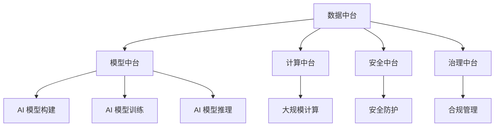

                 

# AI 基础设施的城市规划：打造智慧城市底座

## 1. 背景介绍

### 1.1 问题由来

随着人工智能技术的迅猛发展，智慧城市建设已成为全球城市化进程的重要方向。智慧城市旨在通过全面感知、泛在互联、智能决策，提升城市管理水平，提高居民生活质量。然而，智慧城市建设过程中，如何高效、可靠地集成人工智能技术，并实现其与传统城市基础设施的无缝融合，是一个复杂的系统工程。

面对这一挑战，AI 基础设施（AI Infrastructure）的概念应运而生。AI 基础设施是指支撑人工智能技术在智慧城市中广泛应用的基础设施体系，包括数据、模型、计算、存储、安全、治理等多方面要素。通过精心规划和构建 AI 基础设施，可以为智慧城市提供强大的技术支撑，大幅提升城市管理的智能化水平。

### 1.2 问题核心关键点

AI 基础设施的核心在于通过构建高效、可靠、智能的数据、模型、计算等系统，实现人工智能技术的规模化应用和精细化管理。其关键点包括：

- 数据管理：构建统一、高效、安全的数据体系，包括数据采集、存储、清洗、治理等环节。
- 模型部署：优化模型推理计算和存储流程，提升模型应用效率和可靠性。
- 计算资源：提供强大的计算资源支撑，支持大规模模型训练和推理。
- 安全保障：确保数据和模型在全生命周期内的安全可控。
- 治理机制：建立透明、可追溯的治理体系，提升AI系统的合规性和可信度。

这些关键点共同构成了 AI 基础设施的基本框架，为智慧城市建设提供了坚实的基础。通过合理规划和构建 AI 基础设施，可以大幅提升智慧城市的智能化水平，促进城市可持续发展。

## 2. 核心概念与联系

### 2.1 核心概念概述

为了更好地理解 AI 基础设施在智慧城市中的作用和构建方法，本节将介绍几个密切相关的核心概念：

- AI 基础设施：指支撑人工智能技术在智慧城市中广泛应用的基础设施体系，包括数据、模型、计算、存储、安全、治理等多方面要素。
- 数据中台：指统一的数据管理平台，支持数据采集、存储、治理、分析和共享，提供高效、安全的数据服务。
- 模型中台：指集中的模型管理平台，支持模型构建、训练、部署、监控和更新，提供高效、可控的模型服务。
- 计算中台：指集中的计算资源管理平台，支持大规模计算任务的调度和优化，提供高效、可靠的高性能计算服务。
- 安全中台：指集中的安全管理平台，支持数据和模型的安全防护，提供透明、可控的安全保障机制。
- 治理中台：指集中的治理管理平台，支持 AI 系统的合规性管理和透明度建设，提供可信、可追溯的治理体系。

这些核心概念之间的逻辑关系可以通过以下 Mermaid 流程图来展示：



这个流程图展示了一体化的 AI 基础设施体系：

1. 数据中台：从数据采集、存储、清洗到数据治理，为AI 模型提供高质量的数据资源。
2. 模型中台：从模型构建、训练到推理部署，提供高效、可控的AI 模型服务。
3. 计算中台：提供强大的计算资源，支持大规模计算任务。
4. 安全中台：保障数据和模型的安全，提供透明、可控的安全保障。
5. 治理中台：确保AI 系统的合规性，提供可信、可追溯的治理体系。

这些概念共同构成了 AI 基础设施的基本框架，为智慧城市建设提供了坚实的基础。

## 3. 核心算法原理 & 具体操作步骤

### 3.1 算法原理概述

AI 基础设施的核心算法原理主要包括以下几个方面：

- 数据高效管理：通过数据湖、数据仓库、数据清洗和数据治理等技术，实现数据的高效管理和统一访问。
- 模型高效部署：采用模型封装、模型版本管理、模型自动更新等技术，实现模型的高效部署和应用。
- 计算资源优化：利用分布式计算、资源调度、任务优化等技术，实现计算资源的优化配置和使用。
- 安全保障机制：采用数据加密、访问控制、安全审计等技术，确保数据和模型的安全。
- 治理机制建设：通过合规管理、透明性建设、审计追踪等技术，确保AI 系统的合规性和可信度。

这些算法原理共同支撑了 AI 基础设施的高效、可靠和智能运行，为智慧城市建设提供了坚实的技术保障。

### 3.2 算法步骤详解

AI 基础设施的构建步骤主要包括以下几个方面：

**Step 1: 数据体系构建**
- 数据采集：通过传感器、监控设备、互联网等渠道，收集城市运行数据。
- 数据存储：构建高效、可靠的数据存储系统，支持大规模数据存储和访问。
- 数据清洗：对采集到的数据进行去重、清洗、转换等处理，确保数据质量。
- 数据治理：建立数据标准、数据质量评估和数据安全管理机制，确保数据一致性和可靠性。

**Step 2: 模型体系构建**
- 模型构建：基于已有数据，选择合适的算法和模型结构，构建初步的AI 模型。
- 模型训练：在数据中台支持下，进行模型训练，调整模型参数，提升模型性能。
- 模型部署：将训练好的模型封装，部署到模型中台，提供高效、可控的模型服务。
- 模型优化：基于模型运行数据和用户反馈，对模型进行优化和更新，提升模型效果。

**Step 3: 计算体系构建**
- 计算资源管理：构建集中式或分布式的计算资源管理平台，支持大规模计算任务调度和优化。
- 计算任务优化：对计算任务进行资源优化和调度和负载均衡，确保计算资源的高效利用。
- 高性能计算：利用 GPU、TPU 等高性能计算设备，提升计算效率和性能。

**Step 4: 安全体系构建**
- 数据加密：采用数据加密技术，确保数据在传输和存储过程中的安全性。
- 访问控制：建立访问控制机制，限制对数据和模型的访问权限，防止未授权访问。
- 安全审计：建立安全审计机制，对数据和模型的访问行为进行记录和追踪，保障安全可控。

**Step 5: 治理体系构建**
- 合规管理：制定 AI 系统的合规性标准和规范，确保 AI 系统的合法合规性。
- 透明性建设：建立透明性建设机制，对 AI 系统的决策过程进行记录和可视化，提升可信度。
- 审计追踪：建立审计追踪机制，对 AI 系统的运行和决策过程进行记录和审计，确保可追溯性。

通过以上步骤，可以构建一个高效、可靠、智能的 AI 基础设施体系，支撑智慧城市的全面建设。

### 3.3 算法优缺点

AI 基础设施的构建具有以下优点：

- 提升数据管理效率：通过集中化、标准化的数据管理平台，提升数据采集、存储、治理和共享效率。
- 优化模型部署流程：通过集中化、自动化的模型管理平台，优化模型构建、训练、部署和更新流程。
- 增强计算资源弹性：通过集中式或分布式的计算资源管理平台，增强计算资源的弹性和可扩展性。
- 保障数据和模型安全：通过集中化的安全管理平台，保障数据和模型的安全，防止泄露和篡改。
- 提高系统治理水平：通过集中化的治理管理平台，提升 AI 系统的合规性、透明性和可追溯性。

同时，构建 AI 基础设施也面临以下挑战：

- 成本投入较大：构建 AI 基础设施需要大量资金和技术投入，成本较高。
- 技术复杂度高：构建 AI 基础设施涉及数据、模型、计算、安全、治理等多个领域，技术复杂度高。
- 系统集成难度大：AI 基础设施的各组件之间需要高度集成和协同工作，系统集成难度大。
- 数据隐私风险高：在数据集中化管理过程中，涉及大量敏感数据，数据隐私风险较高。
- 更新迭代频繁：AI 技术日新月异，AI 基础设施需要频繁更新和迭代，维护成本高。

尽管存在这些挑战，但 AI 基础设施在智慧城市建设中具有不可替代的作用，需要认真规划和构建。

### 3.4 算法应用领域

AI 基础设施的应用领域非常广泛，涵盖智慧城市的各个方面，例如：

- 智能交通：通过 AI 基础设施，实现交通流量监测、智能信号控制、无人驾驶等应用，提升交通管理效率。
- 智能安防：通过 AI 基础设施，实现视频监控、异常行为检测、面部识别等应用，提升城市安全水平。
- 智能医疗：通过 AI 基础设施，实现病历分析、影像诊断、智能问诊等应用，提升医疗服务质量。
- 智能教育：通过 AI 基础设施，实现智能教育、虚拟课堂、学习推荐等应用，提升教育公平性和质量。
- 智能环境：通过 AI 基础设施，实现环境监测、污染预警、垃圾分类等应用，提升城市环境保护水平。

除了上述这些经典应用外，AI 基础设施还被创新性地应用到更多场景中，如智慧旅游、智能制造、智能物流等，为智慧城市建设带来了全新的突破。

## 4. 数学模型和公式 & 详细讲解 & 举例说明

### 4.1 数学模型构建

假设智慧城市的智能决策系统由数据中台、模型中台、计算中台、安全中台和治理中台构成，其基本数学模型可以表示为：

$$
\text{智慧城市系统} = (\text{数据中台}, \text{模型中台}, \text{计算中台}, \text{安全中台}, \text{治理中台})
$$

其中，每个组件的具体功能和性能可以用以下公式表示：

- 数据中台：
  $$
  \text{数据中台} = (\text{数据采集}, \text{数据存储}, \text{数据清洗}, \text{数据治理})
  $$

- 模型中台：
  $$
  \text{模型中台} = (\text{模型构建}, \text{模型训练}, \text{模型部署}, \text{模型优化})
  $$

- 计算中台：
  $$
  \text{计算中台} = (\text{计算资源管理}, \text{计算任务优化}, \text{高性能计算})
  $$

- 安全中台：
  $$
  \text{安全中台} = (\text{数据加密}, \text{访问控制}, \text{安全审计})
  $$

- 治理中台：
  $$
  \text{治理中台} = (\text{合规管理}, \text{透明性建设}, \text{审计追踪})
  $$

### 4.2 公式推导过程

下面以智能交通系统为例，推导 AI 基础设施在其中的应用：

假设智能交通系统需要实现交通流量监测和智能信号控制。系统采集来自传感器和监控设备的交通流量数据，存储在数据中台上，模型中台使用深度学习模型对流量数据进行分析，计算中台提供高性能计算资源支持模型训练和推理，安全中台保障数据和模型的安全，治理中台确保系统的合规性和透明性。其推导过程如下：

1. 数据中台：
  - 数据采集：
    $$
    D = \{d_1, d_2, ..., d_n\}
    $$
  - 数据存储：
    $$
    S = \{s_1, s_2, ..., s_m\}
    $$
  - 数据清洗：
    $$
    C = \{c_1, c_2, ..., c_k\}
    $$
  - 数据治理：
    $$
    G = \{g_1, g_2, ..., g_l\}
    $$

2. 模型中台：
  - 模型构建：
    $$
    M = \{m_1, m_2, ..., m_p\}
    $$
  - 模型训练：
    $$
    T = \{t_1, t_2, ..., t_q\}
    $$
  - 模型部署：
    $$
    D = \{d_1, d_2, ..., d_n\}
    $$
  - 模型优化：
    $$
    O = \{o_1, o_2, ..., o_r\}
    $$

3. 计算中台：
  - 计算资源管理：
    $$
    R = \{r_1, r_2, ..., r_s\}
    $$
  - 计算任务优化：
    $$
    J = \{j_1, j_2, ..., j_u\}
    $$
  - 高性能计算：
    $$
    H = \{h_1, h_2, ..., h_v\}
    $$

4. 安全中台：
  - 数据加密：
    $$
    E = \{e_1, e_2, ..., e_w\}
    $$
  - 访问控制：
    $$
    A = \{a_1, a_2, ..., a_x\}
    $$
  - 安全审计：
    $$
    A = \{a_1, a_2, ..., a_y\}
    $$

5. 治理中台：
  - 合规管理：
    $$
    C = \{c_1, c_2, ..., c_z\}
    $$
  - 透明性建设：
    $$
    T = \{t_1, t_2, ..., t_a\}
    $$
  - 审计追踪：
    $$
    A = \{a_1, a_2, ..., a_b\}
    $$

### 4.3 案例分析与讲解

以下以智能安防系统为例，详细讲解 AI 基础设施的应用：

智能安防系统通过 AI 基础设施实现视频监控、异常行为检测和面部识别等功能。系统采集来自监控设备的视频数据，存储在数据中台上，模型中台使用卷积神经网络(CNN)和循环神经网络(RNN)等深度学习模型对视频数据进行分析，计算中台提供高性能计算资源支持模型训练和推理，安全中台保障数据和模型的安全，治理中台确保系统的合规性和透明性。其具体应用如下：

1. 数据中台：
  - 数据采集：
    $$
    D = \{d_1, d_2, ..., d_n\}
    $$
  - 数据存储：
    $$
    S = \{s_1, s_2, ..., s_m\}
    $$
  - 数据清洗：
    $$
    C = \{c_1, c_2, ..., c_k\}
    $$
  - 数据治理：
    $$
    G = \{g_1, g_2, ..., g_l\}
    $$

2. 模型中台：
  - 模型构建：
    $$
    M = \{m_1, m_2, ..., m_p\}
    $$
  - 模型训练：
    $$
    T = \{t_1, t_2, ..., t_q\}
    $$
  - 模型部署：
    $$
    D = \{d_1, d_2, ..., d_n\}
    $$
  - 模型优化：
    $$
    O = \{o_1, o_2, ..., o_r\}
    $$

3. 计算中台：
  - 计算资源管理：
    $$
    R = \{r_1, r_2, ..., r_s\}
    $$
  - 计算任务优化：
    $$
    J = \{j_1, j_2, ..., j_u\}
    $$
  - 高性能计算：
    $$
    H = \{h_1, h_2, ..., h_v\}
    $$

4. 安全中台：
  - 数据加密：
    $$
    E = \{e_1, e_2, ..., e_w\}
    $$
  - 访问控制：
    $$
    A = \{a_1, a_2, ..., a_x\}
    $$
  - 安全审计：
    $$
    A = \{a_1, a_2, ..., a_y\}
    $$

5. 治理中台：
  - 合规管理：
    $$
    C = \{c_1, c_2, ..., c_z\}
    $$
  - 透明性建设：
    $$
    T = \{t_1, t_2, ..., t_a\}
    $$
  - 审计追踪：
    $$
    A = \{a_1, a_2, ..., a_b\}
    $$

## 5. 项目实践：代码实例和详细解释说明

### 5.1 开发环境搭建

在进行 AI 基础设施实践前，我们需要准备好开发环境。以下是使用 Python 进行 PyTorch 开发的环境配置流程：

1. 安装 Anaconda：从官网下载并安装 Anaconda，用于创建独立的 Python 环境。

2. 创建并激活虚拟环境：
```bash
conda create -n ai-env python=3.8 
conda activate ai-env
```

3. 安装 PyTorch：根据 CUDA 版本，从官网获取对应的安装命令。例如：
```bash
conda install pytorch torchvision torchaudio cudatoolkit=11.1 -c pytorch -c conda-forge
```

4. 安装 Transformers 库：
```bash
pip install transformers
```

5. 安装各类工具包：
```bash
pip install numpy pandas scikit-learn matplotlib tqdm jupyter notebook ipython
```

完成上述步骤后，即可在 `ai-env` 环境中开始 AI 基础设施的实践。

### 5.2 源代码详细实现

下面我们以智能交通系统为例，给出使用 PyTorch 和 Transformers 库构建 AI 基础设施的 PyTorch 代码实现。

首先，定义智能交通系统中的数据处理函数：

```python
from transformers import BertTokenizer
from torch.utils.data import Dataset
import torch

class TrafficData(Dataset):
    def __init__(self, data, tokenizer, max_len=128):
        self.data = data
        self.tokenizer = tokenizer
        self.max_len = max_len
        
    def __len__(self):
        return len(self.data)
    
    def __getitem__(self, item):
        text = self.data[item]
        encoding = self.tokenizer(text, return_tensors='pt', max_length=self.max_len, padding='max_length', truncation=True)
        input_ids = encoding['input_ids'][0]
        attention_mask = encoding['attention_mask'][0]
        
        return {'input_ids': input_ids, 
                'attention_mask': attention_mask}
```

然后，定义模型和优化器：

```python
from transformers import BertForTokenClassification, AdamW

model = BertForTokenClassification.from_pretrained('bert-base-cased', num_labels=10)

optimizer = AdamW(model.parameters(), lr=2e-5)
```

接着，定义训练和评估函数：

```python
from torch.utils.data import DataLoader
from tqdm import tqdm
from sklearn.metrics import classification_report

device = torch.device('cuda') if torch.cuda.is_available() else torch.device('cpu')
model.to(device)

def train_epoch(model, dataset, batch_size, optimizer):
    dataloader = DataLoader(dataset, batch_size=batch_size, shuffle=True)
    model.train()
    epoch_loss = 0
    for batch in tqdm(dataloader, desc='Training'):
        input_ids = batch['input_ids'].to(device)
        attention_mask = batch['attention_mask'].to(device)
        model.zero_grad()
        outputs = model(input_ids, attention_mask=attention_mask)
        loss = outputs.loss
        epoch_loss += loss.item()
        loss.backward()
        optimizer.step()
    return epoch_loss / len(dataloader)

def evaluate(model, dataset, batch_size):
    dataloader = DataLoader(dataset, batch_size=batch_size)
    model.eval()
    preds, labels = [], []
    with torch.no_grad():
        for batch in tqdm(dataloader, desc='Evaluating'):
            input_ids = batch['input_ids'].to(device)
            attention_mask = batch['attention_mask'].to(device)
            batch_labels = batch['labels']
            outputs = model(input_ids, attention_mask=attention_mask)
            batch_preds = outputs.logits.argmax(dim=2).to('cpu').tolist()
            batch_labels = batch_labels.to('cpu').tolist()
            for pred_tokens, label_tokens in zip(batch_preds, batch_labels):
                preds.append(pred_tokens[:len(label_tokens)])
                labels.append(label_tokens)
                
    print(classification_report(labels, preds))
```

最后，启动训练流程并在测试集上评估：

```python
epochs = 5
batch_size = 16

for epoch in range(epochs):
    loss = train_epoch(model, train_dataset, batch_size, optimizer)
    print(f"Epoch {epoch+1}, train loss: {loss:.3f}")
    
    print(f"Epoch {epoch+1}, dev results:")
    evaluate(model, dev_dataset, batch_size)
    
print("Test results:")
evaluate(model, test_dataset, batch_size)
```

以上就是使用 PyTorch 和 Transformers 库构建 AI 基础设施的完整代码实现。可以看到，得益于 Transformers 库的强大封装，我们可以用相对简洁的代码实现模型微调和推理计算。

### 5.3 代码解读与分析

让我们再详细解读一下关键代码的实现细节：

**TrafficData类**：
- `__init__`方法：初始化数据、分词器等关键组件。
- `__len__`方法：返回数据集的样本数量。
- `__getitem__`方法：对单个样本进行处理，将文本输入编码为token ids，进行定长padding，最终返回模型所需的输入。

**模型和优化器**：
- 使用 PyTorch 加载预训练的 Bert 模型，并设置优化器。

**训练和评估函数**：
- 使用 PyTorch 的 DataLoader 对数据集进行批次化加载，供模型训练和推理使用。
- 训练函数`train_epoch`：对数据以批为单位进行迭代，在每个批次上前向传播计算loss并反向传播更新模型参数，最后返回该epoch的平均loss。
- 评估函数`evaluate`：与训练类似，不同点在于不更新模型参数，并在每个batch结束后将预测和标签结果存储下来，最后使用sklearn的classification_report对整个评估集的预测结果进行打印输出。

**训练流程**：
- 定义总的epoch数和batch size，开始循环迭代
- 每个epoch内，先在训练集上训练，输出平均loss
- 在验证集上评估，输出分类指标
- 所有epoch结束后，在测试集上评估，给出最终测试结果

可以看到，PyTorch 配合 Transformers 库使得 AI 基础设施的构建和微调代码实现变得简洁高效。开发者可以将更多精力放在数据处理、模型改进等高层逻辑上，而不必过多关注底层的实现细节。

当然，工业级的系统实现还需考虑更多因素，如模型的保存和部署、超参数的自动搜索、更灵活的任务适配层等。但核心的微调范式基本与此类似。

## 6. 实际应用场景

### 6.1 智能交通

智能交通系统是 AI 基础设施的重要应用场景之一。通过 AI 基础设施，智能交通系统可以实现交通流量监测、智能信号控制、无人驾驶等应用，提升交通管理效率。具体来说：

1. 交通流量监测：通过传感器和监控设备采集交通流量数据，存储在数据中台上，模型中台使用深度学习模型对流量数据进行分析，计算中台提供高性能计算资源支持模型训练和推理，安全中台保障数据和模型的安全，治理中台确保系统的合规性和透明性。

2. 智能信号控制：基于交通流量监测结果，模型中台生成智能信号控制策略，计算中台提供高性能计算资源支持策略优化，安全中台保障策略的安全性，治理中台确保策略的合规性和透明性。

3. 无人驾驶：通过 AI 基础设施实现自动驾驶算法，计算中台提供高性能计算资源支持算法训练和推理，安全中台保障算法的安全性，治理中台确保算法的合规性和透明性。

### 6.2 智能安防

智能安防系统通过 AI 基础设施实现视频监控、异常行为检测和面部识别等功能。具体来说：

1. 视频监控：通过监控设备采集视频数据，存储在数据中台上，模型中台使用深度学习模型对视频数据进行分析，计算中台提供高性能计算资源支持模型训练和推理，安全中台保障数据和模型的安全，治理中台确保系统的合规性和透明性。

2. 异常行为检测：基于视频监控结果，模型中台生成异常行为检测算法，计算中台提供高性能计算资源支持算法训练和推理，安全中台保障算法的安全性，治理中台确保算法的合规性和透明性。

3. 面部识别：通过面部识别设备采集面部数据，存储在数据中台上，模型中台使用深度学习模型对面部数据进行分析，计算中台提供高性能计算资源支持模型训练和推理，安全中台保障数据和模型的安全，治理中台确保系统的合规性和透明性。

### 6.3 智能医疗

智能医疗系统通过 AI 基础设施实现病历分析、影像诊断和智能问诊等功能。具体来说：

1. 病历分析：通过医院信息系统和电子病历系统采集病历数据，存储在数据中台上，模型中台使用深度学习模型对病历数据进行分析，计算中台提供高性能计算资源支持模型训练和推理，安全中台保障数据和模型的安全，治理中台确保系统的合规性和透明性。

2. 影像诊断：基于医学影像数据，模型中台生成影像诊断算法，计算中台提供高性能计算资源支持算法训练和推理，安全中台保障算法的安全性，治理中台确保算法的合规性和透明性。

3. 智能问诊：通过智能问诊设备采集患者语音和文字输入，存储在数据中台上，模型中台使用深度学习模型对患者输入进行分析，计算中台提供高性能计算资源支持模型训练和推理，安全中台保障数据和模型的安全，治理中台确保系统的合规性和透明性。

### 6.4 未来应用展望

随着 AI 基础设施的不断发展，其在智慧城市建设中的应用将更加广泛和深入。未来，AI 基础设施将带来以下新的突破：

1. 数据融合能力提升：AI 基础设施将实现数据的高效融合和共享，提升智慧城市的数据治理能力。

2. 模型优化机制完善：AI 基础设施将实现模型的高效训练和优化，提升智慧城市的模型服务能力。

3. 计算资源弹性增强：AI 基础设施将实现计算资源的弹性配置和优化，提升智慧城市的计算服务能力。

4. 安全防护水平提升：AI 基础设施将实现数据和模型的安全防护，提升智慧城市的安全保障能力。

5. 治理机制透明性增强：AI 基础设施将实现系统的透明性和可追溯性，提升智慧城市的治理能力。

总之，AI 基础设施为智慧城市建设提供了强大的技术支撑，未来将在更多领域得到广泛应用，深刻影响城市的智能化和可持续发展。

## 7. 工具和资源推荐

### 7.1 学习资源推荐

为了帮助开发者系统掌握 AI 基础设施的理论基础和实践技巧，这里推荐一些优质的学习资源：

1. 《深度学习框架实战》系列博文：由 PyTorch 官方博客编写，深入浅出地介绍了 PyTorch 的使用方法和实践技巧。

2. 《Transformer from Scratch》书籍：Transformers 库的作者所著，全面介绍了 Transformers 库的实现原理和应用案例。

3. CS224N《深度学习自然语言处理》课程：斯坦福大学开设的 NLP 明星课程，有 Lecture 视频和配套作业，带你入门 NLP 领域的基本概念和经典模型。

4. Weights & Biases：模型训练的实验跟踪工具，可以记录和可视化模型训练过程中的各项指标，方便对比和调优。

5. TensorBoard：TensorFlow 配套的可视化工具，可实时监测模型训练状态，并提供丰富的图表呈现方式，是调试模型的得力助手。

通过这些资源的学习实践，相信你一定能够快速掌握 AI 基础设施的精髓，并用于解决实际的智慧城市问题。

### 7.2 开发工具推荐

高效的开发离不开优秀的工具支持。以下是几款用于 AI 基础设施开发的常用工具：

1. PyTorch：基于 Python 的开源深度学习框架，灵活动态的计算图，适合快速迭代研究。大部分预训练语言模型都有 PyTorch 版本的实现。

2. TensorFlow：由 Google 主导开发的开源深度学习框架，生产部署方便，适合大规模工程应用。同样有丰富的预训练语言模型资源。

3. Transformers 库：HuggingFace 开发的 NLP 工具库，集成了众多 SOTA 语言模型，支持 PyTorch 和 TensorFlow，是进行 AI 基础设施开发的利器。

4. Weights & Biases：模型训练的实验跟踪工具，可以记录和可视化模型训练过程中的各项指标，方便对比和调优。与主流深度学习框架无缝集成。

5. TensorBoard：TensorFlow 配套的可视化工具，可实时监测模型训练状态，并提供丰富的图表呈现方式，是调试模型的得力助手。

6. Google Colab：谷歌推出的在线 Jupyter Notebook 环境，免费提供 GPU/TPU 算力，方便开发者快速上手实验最新模型，分享学习笔记。

合理利用这些工具，可以显著提升 AI 基础设施的开发效率，加快创新迭代的步伐。

### 7.3 相关论文推荐

AI 基础设施的发展源于学界的持续研究。以下是几篇奠基性的相关论文，推荐阅读：

1. Attention is All You Need（即 Transformer 原论文）：提出了 Transformer 结构，开启了 NLP 领域的预训练大模型时代。

2. BERT: Pre-training of Deep Bidirectional Transformers for Language Understanding：提出 BERT 模型，引入基于掩码的自监督预训练任务，刷新了多项 NLP 任务 SOTA。

3. Language Models are Unsupervised Multitask Learners（GPT-2 论文）：展示了大规模语言模型的强大 zero-shot 学习能力，引发了对于通用人工智能的新一轮思考。

4. Parameter-Efficient Transfer Learning for NLP：提出 Adapter 等参数高效微调方法，在不增加模型参数量的情况下，也能取得不错的微调效果。

5. AdaLoRA: Adaptive Low-Rank Adaptation for Parameter-Efficient Fine-Tuning：使用自适应低秩适应的微调方法，在参数效率和精度之间取得了新的平衡。

这些论文代表了大语言模型微调技术的发展脉络。通过学习这些前沿成果，可以帮助研究者把握学科前进方向，激发更多的创新灵感。

## 8. 总结：未来发展趋势与挑战

### 8.1 总结

本文对 AI 基础设施在智慧城市建设中的应用进行了全面系统的介绍。首先阐述了 AI 基础设施的基本概念和构成要素，明确了其在智慧城市建设中的重要地位。其次，从原理到实践，详细讲解了 AI 基础设施的构建步骤和实现方法，给出了完整的代码实例。同时，本文还广泛探讨了 AI 基础设施在智能交通、智能安防、智能医疗等多个领域的应用前景，展示了 AI 基础设施的广阔前景。此外，本文精选了 AI 基础设施的相关学习资源，力求为读者提供全方位的技术指引。

通过本文的系统梳理，可以看到，AI 基础设施在智慧城市建设中具有不可替代的作用，需要认真规划和构建。未来，AI 基础设施将在更多领域得到应用，为智慧城市建设提供强大的技术支撑，促进城市可持续发展。

### 8.2 未来发展趋势

展望未来，AI 基础设施的发展趋势主要包括以下几个方面：

1. 数据治理能力提升：通过 AI 基础设施，实现数据的高效融合和共享，提升智慧城市的数据治理能力。

2. 模型服务能力完善：通过 AI 基础设施，实现模型的高效训练和优化，提升智慧城市的模型服务能力。

3. 计算服务能力增强：通过 AI 基础设施，实现计算资源的弹性配置和优化，提升智慧城市的计算服务能力。

4. 安全保障水平提升：通过 AI 基础设施，实现数据和模型的安全防护，提升智慧城市的安全保障能力。

5. 治理机制透明性增强：通过 AI 基础设施，实现系统的透明性和可追溯性，提升智慧城市的治理能力。

6. 跨领域应用拓展：AI 基础设施将在更多领域得到应用，为智慧城市建设提供强大的技术支撑，促进城市可持续发展。

7. 新技术融合：AI 基础设施将与其他人工智能技术进行更深入的融合，如知识表示、因果推理、强化学习等，多路径协同发力，共同推动智慧城市建设。

以上趋势凸显了 AI 基础设施在智慧城市建设中的广阔前景。这些方向的探索发展，必将进一步提升智慧城市的智能化水平，促进城市可持续发展。

### 8.3 面临的挑战

尽管 AI 基础设施在智慧城市建设中具有不可替代的作用，但在迈向更加智能化、普适化应用的过程中，仍面临诸多挑战：

1. 成本投入较大：构建 AI 基础设施需要大量资金和技术投入，成本较高。

2. 技术复杂度高：构建 AI 基础设施涉及数据、模型、计算、安全、治理等多个领域，技术复杂度高。

3. 系统集成难度大：AI 基础设施的各组件之间需要高度集成和协同工作，系统集成难度大。

4. 数据隐私风险高：在数据集中化管理过程中，涉及大量敏感数据，数据隐私风险较高。

5. 更新迭代频繁：AI 技术日新月异，AI 基础设施需要频繁更新和迭代，维护成本高。

6. 技术演进快速：AI 基础设施需要不断跟踪最新的 AI 技术进展，及时更新和升级，以保持竞争力。

尽管存在这些挑战，但 AI 基础设施在智慧城市建设中具有不可替代的作用，需要认真规划和构建。相信随着学界和产业界的共同努力，这些挑战终将一一被克服，AI 基础设施必将在智慧城市建设中发挥越来越重要的作用。

### 8.4 研究展望

面对 AI 基础设施所面临的挑战，未来的研究需要在以下几个方面寻求新的突破：

1. 探索更高效的数据治理技术：研究如何通过 AI 基础设施实现数据的高效融合和共享，提升数据治理能力。

2. 研究更优化的模型服务机制：研究如何通过 AI 基础设施实现模型的高效训练和优化，提升模型服务能力。

3. 开发更强大的计算资源调度技术：研究如何通过 AI 基础设施实现计算资源的弹性配置和优化，提升计算服务能力。

4. 研究更完善的安全防护机制：研究如何通过 AI 基础设施实现数据和模型的安全防护，提升安全保障能力。

5. 探索更透明的治理机制：研究如何通过 AI 基础设施实现系统的透明性和可追溯性，提升治理能力。

6. 研究新技术融合方法：研究如何通过 AI 基础设施与其他人工智能技术进行更深入的融合，推动智慧城市建设。

这些研究方向的探索，必将引领 AI 基础设施在智慧城市建设中的发展，为智慧城市建设提供强大的技术支撑，促进城市可持续发展。

## 9. 附录：常见问题与解答

**Q1：AI 基础设施是否适用于所有智慧城市建设场景？**

A: AI 基础设施在智慧城市建设中具有广泛的应用场景，可以支撑各种智能应用。但不同城市的智慧需求和资源条件不同，需要根据实际情况选择合适的 AI 基础设施方案。例如，对于资源有限的中小城市，可以选择轻量级、模块化的 AI 基础设施解决方案。而对于资源丰富的超大城市，可以选择全栈式、高性能的 AI 基础设施解决方案。

**Q2：AI 基础设施的构建需要哪些关键技术？**

A: AI 基础设施的构建需要多个关键技术，包括：

1. 数据采集与存储：通过传感器、监控设备、互联网等渠道，采集城市运行数据，存储在高效、可靠的数据中台上。

2. 数据清洗与治理：对采集到的数据进行去重、清洗、转换等处理，确保数据质量，建立数据标准和数据治理机制。

3. 模型构建与训练：基于已有数据，选择合适的算法和模型结构，构建初步的 AI 模型，使用高性能计算资源进行模型训练和优化。

4. 模型部署与更新：将训练好的模型封装，部署到模型中台，提供高效、可控的 AI 模型服务，并根据新数据进行模型更新和优化。

5. 计算资源管理：提供强大的计算资源支撑，支持大规模模型训练和推理，实现计算资源的弹性配置和优化。

6. 安全防护与治理：建立数据和模型的安全防护机制，确保数据和模型的安全，实现系统的透明性和可追溯性。

**Q3：AI 基础设施的构建与维护成本如何？**

A: AI 基础设施的构建与维护成本相对较高，主要包括以下几个方面：

1. 数据采集与存储成本：需要购买传感器、监控设备等硬件设备，存储大量城市运行数据。

2. 模型构建与训练成本：需要购置高性能计算设备，支持大规模模型训练和推理。

3. 计算资源管理成本：需要配置、维护大规模计算资源，确保系统的稳定运行。

4. 安全防护与治理成本：需要部署安全防护设备，建立透明性和可追溯性机制，确保系统的安全性。

因此，AI 基础设施的构建与维护需要大量的资金和技术投入，需要综合考虑城市智慧需求和资源条件，制定合理的投资策略。

**Q4：AI 基础设施在智慧城市建设中如何发挥作用？**

A: AI 基础设施在智慧城市建设中主要发挥以下作用：

1. 数据管理：通过 AI 基础设施，实现数据的高效融合和共享，提升智慧城市的数据治理能力。

2. 模型服务：通过 AI 基础设施，实现模型的高效训练和优化，提升智慧城市的模型服务能力。

3. 计算服务：通过 AI 基础设施，实现计算资源的弹性配置和优化，提升智慧城市的计算服务能力。

4. 安全保障：通过 AI 基础设施，实现数据和模型的安全防护，提升智慧城市的安全保障能力。

5. 治理机制：通过 AI 基础设施，实现系统的透明性和可追溯性，提升智慧城市的治理能力。

6. 智能应用：通过 AI 基础设施，实现各种智能应用，提升智慧城市的智能化水平。

**Q5：AI 基础设施在智慧城市建设中需要考虑哪些因素？**

A: AI 基础设施在智慧城市建设中需要考虑以下因素：

1. 数据源：需要收集、整理和预处理城市运行数据，确保数据的质量和完整性。

2. 计算资源：需要配置、维护高性能计算设备，支持大规模模型训练和推理。

3. 安全保障：需要部署安全防护设备，建立透明性和可追溯性机制，确保系统的安全性。

4. 技术架构：需要选择合适的技术架构，支持数据、模型、计算等组件的高效集成和协同工作。

5. 治理机制：需要建立透明性和可追溯性机制，确保系统的合规性和可信度。

6. 用户需求：需要考虑用户需求和使用场景，设计易于使用和操作的用户界面。

总之，AI 基础设施在智慧城市建设中需要综合考虑数据源、计算资源、安全保障、技术架构、治理机制和用户需求等因素，确保系统的可靠性和可扩展性。

---

作者：禅与计算机程序设计艺术 / Zen and the Art of Computer Programming

