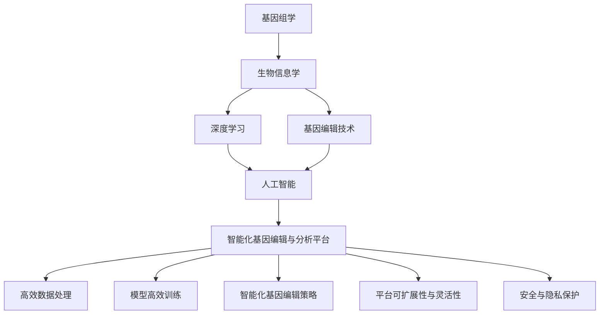

                 

# AI 基础设施的基因工程：智能化基因编辑与分析平台

## 1. 背景介绍

在当今生命科学和医疗健康领域，基因编辑与分析技术的进步为疾病的早期诊断、个性化治疗以及遗传病的基因修正提供了新的可能。然而，这些技术的发展也面临着数据处理、分析复杂性高，运算速度慢，以及模型和算法的选择复杂等挑战。因此，构建一个高效的智能化基因编辑与分析平台，是当下解决这些挑战，推动基因组学、生物信息学以及医疗健康领域发展的关键。

### 1.1 问题由来
随着基因组学和生物信息学的发展，高通量测序技术（如Next Generation Sequencing, NGS）的应用越来越广泛，产生了海量的基因组数据。然而，这些数据的解读和分析需要极其复杂的计算和强大的数据处理能力。传统的人工分析和统计方法已经无法满足需求，需要借助人工智能（AI）技术进行智能化处理。

基因编辑技术（如CRISPR-Cas9）的发展为基因组操作提供了强大的工具，使得科学家能够更加精确地研究基因功能与疾病关系，但这些操作的高精度和高成本要求更高效的AI辅助系统。智能化基因编辑与分析平台能够利用AI技术，优化基因编辑流程，提供精确的基因操作建议，从而加速基因编辑技术在医疗和生物研究中的应用。

### 1.2 问题核心关键点
智能化基因编辑与分析平台的核心关键点包括以下几点：

1. **数据高效处理与存储**：处理基因组数据通常需要高计算资源和存储需求，如何高效存储和处理海量基因数据是一个关键挑战。
2. **模型高效训练与调优**：基因数据通常需要复杂的深度学习模型进行分析和解释，如何快速高效地训练和调优模型是一个核心问题。
3. **智能化基因编辑策略**：利用AI技术，根据基因数据和患者特征，提供智能化的基因编辑策略，从而提高基因编辑的精度和成功率。
4. **平台可扩展性与灵活性**：平台需要支持多种基因编辑工具和算法，能够适应不同的基因编辑场景和需求。
5. **安全与隐私保护**：基因数据高度敏感，平台需要保证数据的安全和隐私，防止数据泄露和滥用。

## 2. 核心概念与联系

### 2.1 核心概念概述

为了更好地理解智能化基因编辑与分析平台的原理和架构，下面将介绍几个核心概念及其相互联系：

- **基因组学（Genomics）**：研究基因组DNA的结构、功能和演化，是理解生命活动的基础。
- **生物信息学（Bioinformatics）**：应用计算机科学和信息学的技术来解析和分析生物数据，特别是基因组数据。
- **深度学习（Deep Learning）**：一种基于神经网络的机器学习技术，能够从大量数据中学习到复杂模式和结构。
- **基因编辑技术（Gene Editing）**：如CRISPR-Cas9，通过设计特定的核酸序列来精确地修改基因组。
- **人工智能（AI）**：包括机器学习、计算机视觉、自然语言处理等，能够从数据中提取知识并做出决策。
- **智能化基因编辑与分析平台**：集成深度学习、基因编辑和生物信息学技术，能够高效处理、分析基因数据，并提供智能化的基因编辑策略。

这些核心概念通过以下Mermaid流程图来展示它们之间的联系：



这个流程图展示了基因组学、生物信息学、深度学习、基因编辑和人工智能等核心概念如何相互关联，最终构成智能化基因编辑与分析平台。

## 3. 核心算法原理 & 具体操作步骤
### 3.1 算法原理概述

智能化基因编辑与分析平台的核心算法原理主要基于深度学习技术，尤其是卷积神经网络（CNN）和循环神经网络（RNN）等架构，以处理和分析基因组数据。以下是其基本原理概述：

- **基因组数据的处理**：通过序列比对和基因组注释工具，将原始的基因组数据转换成可用于深度学习模型训练的格式。
- **深度学习模型的训练**：使用基因组数据训练深度学习模型，学习到基因序列和功能之间的关系。
- **基因编辑策略的生成**：通过分析基因数据和患者特征，利用深度学习模型生成智能化的基因编辑策略。

### 3.2 算法步骤详解

下面详细介绍智能化基因编辑与分析平台的具体操作步骤：

1. **数据预处理**：对原始基因组数据进行清洗、比对和注释，生成可用于深度学习模型训练的数据集。
2. **模型训练**：使用基因组数据训练深度学习模型，学习基因序列和功能之间的关系。
3. **基因编辑策略生成**：分析基因数据和患者特征，利用训练好的模型生成智能化的基因编辑策略。
4. **模型调优**：通过验证集对模型进行调优，提高模型的准确性和鲁棒性。
5. **平台部署与测试**：将训练好的模型部署到智能化基因编辑与分析平台上，并进行测试和优化。

### 3.3 算法优缺点

智能化基因编辑与分析平台的算法具有以下优点：

1. **高效数据处理**：深度学习模型能够处理大规模基因数据，提高数据处理的效率。
2. **精确基因编辑**：利用AI技术，根据基因数据和患者特征，生成精确的基因编辑策略，提高编辑成功率。
3. **可扩展性强**：平台支持多种基因编辑工具和算法，能够适应不同的基因编辑场景和需求。

同时，该算法也存在一些缺点：

1. **计算资源需求高**：深度学习模型训练和推理需要大量的计算资源和存储空间。
2. **模型解释性不足**：深度学习模型通常是"黑盒"系统，难以解释其内部工作机制和决策逻辑。
3. **数据隐私和安全问题**：基因数据高度敏感，平台需要保证数据的安全和隐私。

### 3.4 算法应用领域

智能化基因编辑与分析平台在以下几个领域具有广泛的应用前景：

1. **个性化医疗**：利用基因数据和患者特征，生成个性化的基因编辑策略，实现精准医疗。
2. **基因组学研究**：通过深度学习模型，解析基因组数据，发现基因与疾病之间的关系，加速基因组学研究。
3. **生物制药**：利用AI技术，优化药物设计和临床试验流程，加速新药开发。
4. **农业生物技术**：通过基因编辑，培育高产、抗病和抗逆性的作物品种，推动农业科技进步。
5. **生物信息学教育**：开发智能化基因编辑与分析平台，提供基因编辑和生物信息学教学工具，提升教学效果。

## 4. 数学模型和公式 & 详细讲解  
### 4.1 数学模型构建

智能化基因编辑与分析平台的核心数学模型主要基于深度学习模型，特别是卷积神经网络（CNN）和循环神经网络（RNN）。以下是一些基本数学模型的构建：

1. **卷积神经网络（CNN）**：用于处理基因序列数据，提取局部特征和全局结构。
2. **循环神经网络（RNN）**：用于处理时间序列数据，捕捉基因序列中的时序信息。
3. **长短期记忆网络（LSTM）**：用于处理长序列数据，解决传统RNN的梯度消失问题。

### 4.2 公式推导过程

以卷积神经网络（CNN）为例，其基本公式为：

$$
y = W^T x + b
$$

其中，$y$ 表示输出特征图，$x$ 表示输入基因序列，$W$ 表示卷积核权重，$b$ 表示偏置项。在基因编辑中，可以通过CNN提取基因序列中的局部特征，如突变位点、启动子区域等，从而生成基因编辑策略。

### 4.3 案例分析与讲解

以基因组数据为例，下面进行一个案例分析：

假设我们有一个长度为$L$的基因序列$x$，其中第$i$个位置的核苷酸为$a_i$。我们可以使用一个$n \times k$的卷积核$W$，将基因序列$x$卷积处理得到特征图$y$，其中$n$表示卷积核的尺寸，$k$表示卷积核的通道数。卷积操作的公式为：

$$
y_i = \sum_{j=0}^{L-k} W_{ij} \cdot x_{i+j}
$$

其中，$y_i$表示第$i$个特征点的值，$W_{ij}$表示卷积核的权重。通过卷积操作，我们可以提取基因序列中的局部特征，如突变位点、启动子区域等。

## 5. 项目实践：代码实例和详细解释说明
### 5.1 开发环境搭建

在搭建开发环境之前，需要确保有以下工具和库的支持：

1. **Python**：作为主要的编程语言，Python在深度学习和生物信息学领域应用广泛。
2. **TensorFlow或PyTorch**：深度学习模型的训练和推理。
3. **Keras或TensorFlow-Keras**：高级API，用于快速构建深度学习模型。
4. **BioPython**：生物信息学库，用于基因数据处理和分析。
5. **Docker**：容器化部署，确保数据和模型的安全与隐私保护。

以下是在Docker中搭建开发环境的步骤：

1. 安装Docker：从官网下载并安装Docker，并配置环境变量。
2. 创建Docker镜像：使用以下命令创建Docker镜像：

```bash
docker build -t gene-editing-platform .
```

3. 运行Docker容器：使用以下命令启动Docker容器：

```bash
docker run -it -p 8080:8080 gene-editing-platform
```

### 5.2 源代码详细实现

下面是一个使用TensorFlow构建卷积神经网络的示例代码：

```python
import tensorflow as tf
from tensorflow.keras import layers

# 定义卷积神经网络模型
model = tf.keras.Sequential()
model.add(layers.Conv2D(32, (3, 3), activation='relu', input_shape=(L, k, 1)))
model.add(layers.MaxPooling2D((2, 2)))
model.add(layers.Flatten())
model.add(layers.Dense(128, activation='relu'))
model.add(layers.Dense(1, activation='sigmoid'))

# 编译模型
model.compile(optimizer='adam', loss='binary_crossentropy', metrics=['accuracy'])

# 训练模型
model.fit(X_train, y_train, epochs=10, batch_size=32, validation_data=(X_test, y_test))
```

其中，`L`和`k`分别表示基因序列的长度和卷积核的尺寸，`X_train`和`y_train`分别表示训练数据和标签。

### 5.3 代码解读与分析

以下是代码的详细解释：

1. **模型定义**：使用`Sequential`模型，依次添加卷积层、池化层和全连接层，最后输出一个二分类结果。
2. **模型编译**：指定优化器、损失函数和评估指标。
3. **模型训练**：使用训练数据和标签进行模型训练，指定训练轮数和批次大小。

### 5.4 运行结果展示

在训练完成后，可以使用以下代码进行模型评估：

```python
loss, accuracy = model.evaluate(X_test, y_test)
print(f'Test loss: {loss:.4f}')
print(f'Test accuracy: {accuracy:.4f}')
```

其中，`X_test`和`y_test`分别表示测试数据和标签。

## 6. 实际应用场景
### 6.1 医疗诊断

在医疗诊断领域，智能化基因编辑与分析平台可以用于遗传病的早期诊断和基因编辑策略的生成。通过分析患者基因数据，平台可以识别出潜在的高风险基因变异，并生成个性化的基因编辑策略，从而提高诊断的准确性和效率。

### 6.2 基因治疗

基因治疗是当前医疗领域的热门方向，智能化基因编辑与分析平台可以通过深度学习模型分析基因数据，生成精确的基因编辑策略，指导基因治疗方案的设计和实施，提高基因治疗的成功率。

### 6.3 农业育种

在农业育种领域，平台可以通过基因编辑技术，培育高产、抗病和抗逆性的作物品种，推动农业科技进步。通过深度学习模型分析基因数据，平台可以识别出对作物生长和产量有重大影响的基因变异，并指导育种过程。

### 6.4 生物信息学研究

在生物信息学研究中，平台可以用于基因组数据解析、基因功能预测和生物标记物发现等任务。通过深度学习模型分析基因数据，平台可以发现新的基因功能、预测基因表达和调控机制，并发现新的生物标记物，推动基因组学和生物信息学研究的发展。

### 6.5 药物开发

在药物开发领域，平台可以用于药物筛选和设计，加速新药开发进程。通过深度学习模型分析基因数据，平台可以发现与疾病相关的基因和蛋白质，指导药物设计和临床试验，提高药物研发的成功率。

## 7. 工具和资源推荐
### 7.1 学习资源推荐

以下是一些推荐的AI和基因编辑相关的学习资源：

1. **Coursera上的Deep Learning课程**：由Andrew Ng教授主讲，涵盖深度学习的基本概念和应用。
2. **edX上的Bioinformatics Specialization**：由MIT教授主讲，涵盖生物信息学和基因组学的基本概念和应用。
3. **Deep Learning for Genomics and Bioinformatics**：一本介绍深度学习在基因组学和生物信息学应用的书籍。
4. **Genome Analysis with Next-Generation Sequencing**：一本介绍高通量测序技术在基因组分析中应用的书籍。
5. **CRISPR-Cas9: Protocols, Engineering and Applications**：一本介绍CRISPR-Cas9技术的原理、设计和应用的书籍。

### 7.2 开发工具推荐

以下是一些推荐的AI和基因编辑相关的开发工具：

1. **TensorFlow或PyTorch**：深度学习模型的训练和推理。
2. **Keras或TensorFlow-Keras**：高级API，用于快速构建深度学习模型。
3. **BioPython**：生物信息学库，用于基因数据处理和分析。
4. **Docker**：容器化部署，确保数据和模型的安全与隐私保护。
5. **Jupyter Notebook**：交互式开发环境，用于数据预处理和模型调试。

### 7.3 相关论文推荐

以下是一些推荐的相关论文，涵盖深度学习在基因组学和生物信息学应用的各个方面：

1. **Deep learning for genomics and biomedicine**：一篇综述论文，介绍了深度学习在基因组学和生物医学应用的现状和展望。
2. **Sequence-to-sequence learning for genetic code optimization**：一篇论文，介绍使用序列到序列模型优化遗传密码的研究。
3. **Deep learning for personalized cancer therapy**：一篇论文，介绍使用深度学习生成个性化癌症治疗方案的研究。
4. **CRISPR-Cas9-based gene editing in humans**：一篇综述论文，介绍CRISPR-Cas9技术在人类基因编辑中的应用。
5. **A Survey on Bioinformatics Databases and Tools for Next Generation Sequencing**：一篇综述论文，介绍高通量测序技术在基因组学研究中的应用。

## 8. 总结：未来发展趋势与挑战
### 8.1 总结

本文对智能化基因编辑与分析平台的原理和应用进行了详细阐述。通过深度学习模型处理基因组数据，平台能够高效地解析基因数据，生成智能化的基因编辑策略，推动基因组学和生物信息学的发展。平台在医疗诊断、基因治疗、农业育种、药物开发等领域具有广泛的应用前景。

### 8.2 未来发展趋势

展望未来，智能化基因编辑与分析平台将呈现以下几个发展趋势：

1. **模型复杂度的提升**：随着深度学习模型和算法的不断进步，平台的复杂度将不断提升，能够处理更加复杂的基因组数据和生物信息学任务。
2. **数据来源的多样化**：平台将支持多种数据来源，包括基因组数据、蛋白质数据、代谢数据等，能够综合多种数据进行基因编辑策略的生成。
3. **实时计算能力的提升**：通过优化计算图和并行计算，平台的实时计算能力将不断提升，能够支持实时基因编辑和分析任务。
4. **跨学科融合**：平台将与机器学习、计算机视觉、自然语言处理等技术进行深度融合，推动跨学科的协同发展。
5. **边缘计算的应用**：平台将支持边缘计算技术，能够在医疗、农业等边缘设备上部署，提高数据处理和分析的效率。

### 8.3 面临的挑战

尽管智能化基因编辑与分析平台已经取得了显著进展，但在迈向更广泛应用的过程中，仍面临一些挑战：

1. **数据隐私和安全问题**：基因数据高度敏感，平台需要确保数据的安全和隐私，防止数据泄露和滥用。
2. **模型复杂度的增加**：随着模型复杂度的提升，训练和推理所需的计算资源和存储需求将大幅增加。
3. **算法的可解释性**：深度学习模型通常是"黑盒"系统，难以解释其内部工作机制和决策逻辑。
4. **跨领域数据的融合**：平台需要支持多种数据来源，但不同类型的数据具有不同的特征，如何有效融合不同类型的数据是一个挑战。

### 8.4 研究展望

未来的研究需要在以下几个方面寻求新的突破：

1. **联邦学习**：通过联邦学习技术，保护数据隐私的同时进行模型训练和优化，解决数据隐私和安全问题。
2. **模型压缩和优化**：通过模型压缩和优化技术，减小模型的计算和存储需求，提高平台的实时计算能力。
3. **可解释性增强**：通过可解释性技术，增强深度学习模型的可解释性，提高模型的可信度和可靠性。
4. **跨领域数据融合**：开发更加高效的数据融合方法，将不同类型的数据进行有效整合，提高平台的综合分析能力。
5. **边缘计算支持**：支持边缘计算技术，提高平台的实时处理和分析能力，推动边缘计算在基因组学和生物信息学领域的应用。

总之，智能化基因编辑与分析平台将为基因组学和生物信息学领域带来新的发展机遇，推动基因编辑技术在医疗、农业、药物开发等领域的应用。面对未来，我们需要不断探索新的技术手段和方法，推动平台向更加智能化、普适化和可靠性的方向发展。

## 9. 附录：常见问题与解答

**Q1：如何选择合适的深度学习模型进行基因编辑与分析？**

A: 选择合适的深度学习模型需要考虑多个因素，包括基因数据的特点、任务的具体需求以及计算资源的限制。例如，对于基因序列数据，可以使用卷积神经网络（CNN）进行特征提取；对于时序数据，可以使用循环神经网络（RNN）或长短期记忆网络（LSTM）进行时序分析。此外，可以使用预训练模型进行迁移学习，提高模型的泛化能力和鲁棒性。

**Q2：在基因编辑与分析中，如何处理数据隐私和安全问题？**

A: 在基因编辑与分析中，数据隐私和安全问题非常关键。以下是一些处理数据隐私和安全问题的方法：

1. **数据加密**：对基因数据进行加密处理，确保数据传输和存储过程中的安全性。
2. **联邦学习**：通过联邦学习技术，保护数据隐私的同时进行模型训练和优化，防止数据泄露。
3. **访问控制**：对数据进行访问控制，限制未授权用户对数据的访问。
4. **匿名化处理**：对数据进行匿名化处理，去除个人敏感信息，保护患者隐私。
5. **合规性审查**：确保平台的合规性，遵守相关法律法规，保护患者权益。

**Q3：在基因编辑与分析中，如何进行模型调优？**

A: 模型调优是提高模型性能的关键步骤。以下是一些常见的模型调优方法：

1. **学习率调整**：通过调整学习率，防止模型过拟合或欠拟合，提高模型的泛化能力。
2. **正则化技术**：使用L2正则、Dropout等正则化技术，防止模型过拟合。
3. **超参数调优**：通过网格搜索、随机搜索等方法，找到最优的超参数组合。
4. **模型压缩**：通过模型压缩技术，减小模型的计算和存储需求，提高模型的实时计算能力。
5. **数据增强**：通过数据增强技术，丰富训练集，提高模型的泛化能力。

这些方法需要根据具体任务和数据特点进行灵活组合，以达到最佳的调优效果。

**Q4：在基因编辑与分析中，如何保证模型的高效性和可靠性？**

A: 保证模型的高效性和可靠性需要从多个方面进行优化：

1. **模型压缩和优化**：通过模型压缩和优化技术，减小模型的计算和存储需求，提高模型的实时计算能力。
2. **可解释性增强**：通过可解释性技术，增强深度学习模型的可解释性，提高模型的可信度和可靠性。
3. **数据增强和清洗**：通过数据增强和清洗技术，提高训练集的多样性和质量，减少噪声对模型性能的影响。
4. **模型集成**：通过模型集成技术，综合多个模型的优势，提高模型的鲁棒性和泛化能力。
5. **联邦学习和分布式训练**：通过联邦学习和分布式训练技术，提升模型的训练效率和鲁棒性。

这些优化方法需要根据具体任务和数据特点进行灵活组合，以达到最佳的模型性能。

**Q5：在基因编辑与分析中，如何保护模型的知识产权和创新性？**

A: 保护模型的知识产权和创新性需要采取以下措施：

1. **版权登记**：对模型进行版权登记，确保模型的知识产权得到法律保护。
2. **专利申请**：对模型进行专利申请，确保模型的创新性得到法律保护。
3. **开源协议**：通过开源协议，授权第三方使用模型，但保留对模型的修改和改进权。
4. **数据和模型共享**：在确保数据和模型安全的前提下，共享数据和模型，推动模型的广泛应用和创新。
5. **合作协议**：与其他机构或企业合作，共同开发和推广模型，确保模型的知识产权和创新性得到法律保护。

这些措施需要结合具体的法律和行业规范进行实施，确保模型的知识产权和创新性得到有效保护。

作者：禅与计算机程序设计艺术 / Zen and the Art of Computer Programming

