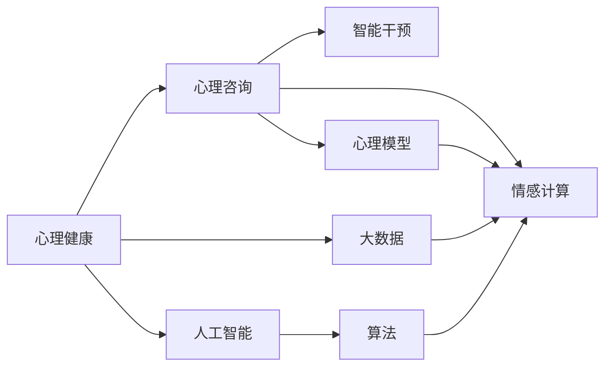
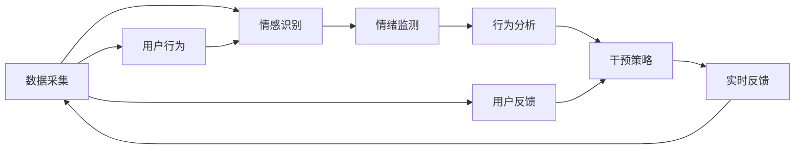

                 

# AI 基础设施的心理健康：智能化心理咨询与干预

> 关键词：心理健康,人工智能,心理咨询,智能干预,心理模型,情感计算,算法,情感识别

## 1. 背景介绍

在信息化社会中，随着互联网、大数据、人工智能等技术的广泛应用，人们的生活节奏不断加快，心理健康问题愈发突显。据统计，全球约有一半的人在其一生中至少遭遇一次心理健康问题。然而，由于多种原因，包括专业资源匮乏、患者不愿暴露隐私等，很多人无法获得及时、有效的心理健康服务。

**人工智能（AI）**作为信息化时代的重要工具，其在心理健康领域的潜力也逐渐被发掘。通过构建基于AI的心理健康基础设施，可以实现心理咨询与干预的智能化、自动化和个性化，从而提升心理健康服务的可及性和有效性。本文将深入探讨基于AI的心理健康咨询与干预的原理、技术和实践，希望能为推动心理健康事业的发展提供有价值的参考。

## 2. 核心概念与联系

### 2.1 核心概念概述

为了更好地理解AI在心理健康咨询与干预中的应用，我们需要掌握以下几个核心概念：

- **心理健康**：指个体在心理、情感和行为上的良好状态。心理健康包括自我认知、情绪调节、人际关系和社会适应等多个方面。

- **心理咨询**：通过专业的心理顾问与求助者进行对话，帮助其识别和解决心理问题，改善心理健康状态。

- **智能干预**：利用AI技术，如自然语言处理（NLP）、情感计算、机器学习等，自动化地提供心理辅导、情绪监测、行为分析等服务。

- **心理模型**：基于心理学理论和实验数据构建的模型，用于模拟人类心理和行为的规律，是AI进行心理健康干预的基础。

- **情感计算**：通过分析语音、图像、文本等数据，识别和理解人的情感状态和情绪变化，从而进行心理状态的评估和干预。

这些概念通过以下Mermaid流程图展示了它们之间的联系：



在这个流程图中，心理健康是起点，心理咨询和智能干预是核心，心理模型和情感计算则是关键技术手段，大数据和人工智能为支撑。这些概念共同构建了AI在心理健康咨询与干预中的框架。

### 2.2 核心概念原理和架构的 Mermaid 流程图



上述流程图示例展示了基于情感计算的智能干预过程。数据采集（如文本、语音）后，情感识别技术对用户情绪进行初步分析，情绪监测对用户长期情绪变化进行跟踪，行为分析识别用户行为模式，干预策略生成个性化的干预计划，实时反馈调整干预效果，用户反馈不断优化干预策略。

## 3. 核心算法原理 & 具体操作步骤

### 3.1 算法原理概述

基于AI的心理健康咨询与干预，主要是通过构建心理模型，结合情感计算和机器学习算法，自动化地进行心理状态监测和干预。其核心算法包括：

- **情感识别算法**：用于识别用户情感状态，通常包括文本情感分析、语音情感识别、面部表情识别等。
- **情绪监测算法**：用于持续跟踪用户的情绪变化，构建情绪波动曲线，评估心理健康状态。
- **行为分析算法**：用于分析用户行为模式，识别异常行为，及时发现心理健康问题。
- **干预策略生成算法**：结合心理模型和用户数据，生成个性化的心理健康干预策略。
- **实时反馈和优化算法**：根据用户反馈和干预效果，实时调整干预策略，优化心理健康服务。

### 3.2 算法步骤详解

以下是基于AI的心理健康咨询与干预的具体步骤：

1. **数据采集与预处理**：收集用户的文本、语音、图像等多模态数据，进行去噪、清洗等预处理操作，确保数据质量。

2. **情感识别**：利用文本情感分析算法对用户发布的社交媒体内容进行情感识别，利用语音情感识别算法对用户的语音通话进行情绪评估，利用面部表情识别算法对用户的面部视频进行情感分析。

3. **情绪监测**：结合用户的情感识别结果，构建情绪波动曲线，评估用户的心理健康状态，及时发现异常情绪波动。

4. **行为分析**：利用行为分析算法分析用户的行为模式，识别异常行为，如作息不规律、社交活动减少等，预警心理健康问题。

5. **干预策略生成**：根据心理模型和用户数据，生成个性化的心理健康干预策略，如情绪调节、行为调整、认知重构等。

6. **实时反馈与优化**：根据用户反馈和干预效果，实时调整干预策略，优化心理健康服务，确保干预效果最大化。

### 3.3 算法优缺点

**优点**：

- **自动化**：AI算法能够自动化地进行情感识别、情绪监测和行为分析，减少了人工干预的复杂性和成本。
- **个性化**：结合用户数据和心理模型，生成个性化的干预策略，提高了干预的针对性和有效性。
- **实时性**：AI算法可以实时监测用户状态，及时发现和干预心理健康问题，保障用户心理健康。

**缺点**：

- **隐私问题**：情感识别和行为分析涉及大量个人数据，可能引发隐私和数据安全问题。
- **模型依赖**：基于AI的心理健康服务依赖于数据和模型的准确性，数据质量不高或模型不当可能导致误判。
- **技术门槛**：构建和维护基于AI的心理健康系统，需要专业知识和技术，对开发者和用户有一定的门槛要求。

### 3.4 算法应用领域

基于AI的心理健康咨询与干预，已经应用于以下几个领域：

1. **线上心理咨询**：利用AI技术，如NLP和情感计算，构建智能心理咨询平台，为用户提供实时、个性化、匿名的心理健康咨询服务。

2. **心理健康监测**：在智能穿戴设备中嵌入AI算法，实时监测用户的生理指标和行为模式，识别心理健康问题，提供预警和干预。

3. **心理疾病诊断**：结合大数据分析和AI模型，提高心理疾病诊断的准确性和效率，辅助医生进行科学诊断和治疗。

4. **心理健康教育**：利用AI算法分析学生的学习行为和心理状态，提供个性化的学习建议和心理健康支持，促进学生全面发展。

5. **企业员工心理健康管理**：为企业的员工提供心理健康服务，监测和干预工作压力、职业倦怠等问题，提升员工的工作满意度和幸福感。

## 4. 数学模型和公式 & 详细讲解 & 举例说明

### 4.1 数学模型构建

基于AI的心理健康咨询与干预，涉及多个数学模型和算法。以下以情感识别和情绪监测为例，介绍其数学模型构建：

**情感识别模型**：情感识别通常采用机器学习算法，如支持向量机（SVM）、随机森林（Random Forest）、深度神经网络（DNN）等。

**情绪监测模型**：情绪监测采用时间序列分析和深度学习算法，如长短期记忆网络（LSTM）、门控循环单元（GRU）等。

### 4.2 公式推导过程

以情感识别模型为例，文本情感分析通常采用以下公式：

$$
P(y|x) = \frac{P(x|y)P(y)}{P(x)}
$$

其中，$x$ 为输入文本，$y$ 为情感类别（如正面、负面、中性），$P(y|x)$ 为条件概率，即文本情感为 $y$ 的概率，$P(x|y)$ 为文本条件概率，即给定情感 $y$ 下文本 $x$ 的概率，$P(y)$ 为先验概率，$P(x)$ 为文本概率。

### 4.3 案例分析与讲解

假设我们有一组训练数据，包含情感类别 $y$ 和对应的文本 $x$，使用支持向量机（SVM）算法进行情感分类。设 $x_i$ 为第 $i$ 个文本样本，$y_i$ 为对应的情感类别。构建SVM模型，通过训练得到最优的超平面，使其最大化分类边界，最小化分类误差。

训练数据集为：

$$
\begin{align*}
(x_1, y_1) &= (text_{1_{positive}}, positive) \\
(x_2, y_2) &= (text_{2_{negative}}, negative) \\
(x_3, y_3) &= (text_{3_{neutral}}, neutral) \\
&\vdots \\
(x_n, y_n) &= (text_{n_{positive}}, positive) \\
\end{align*}
$$

其中，$positive$ 表示正面情感，$negative$ 表示负面情感，$neutral$ 表示中性情感。

通过SVM训练后，得到最优超平面方程为：

$$
w \cdot x + b = 0
$$

其中，$w$ 为超平面系数，$b$ 为偏置项。通过测试数据验证，可以获得较高的情感识别准确率。

## 5. 项目实践：代码实例和详细解释说明

### 5.1 开发环境搭建

为了进行基于AI的心理健康咨询与干预的开发，我们需要搭建相应的开发环境。以下是Python环境搭建的详细步骤：

1. **安装Python**：从官网下载安装Python 3.8或更高版本。
2. **创建虚拟环境**：
```bash
python3 -m venv venv
source venv/bin/activate
```
3. **安装依赖包**：
```bash
pip install numpy pandas scikit-learn pytorch transformers
```

### 5.2 源代码详细实现

下面以文本情感分析为例，展示基于Python和PyTorch的情感识别模型实现：

```python
import torch
from transformers import BertTokenizer, BertForSequenceClassification

# 初始化模型和分词器
tokenizer = BertTokenizer.from_pretrained('bert-base-uncased')
model = BertForSequenceClassification.from_pretrained('bert-base-uncased', num_labels=3)

# 定义情感类别标签
label_map = {'positive': 1, 'negative': 0, 'neutral': 2}

# 加载并处理文本数据
texts = ['I am very happy today.', 'I am feeling sad.', 'I am feeling neutral.']
inputs = tokenizer(texts, return_tensors='pt', padding=True, truncation=True, max_length=512)

# 模型预测情感类别
outputs = model(**inputs)
logits = outputs.logits
predicted_labels = torch.argmax(logits, dim=1)

# 输出情感类别
for text, label in zip(texts, predicted_labels):
    print(f"Text: {text}\nPredicted Label: {label_map[predicted_labels[0].tolist()[0]]}\n")
```

### 5.3 代码解读与分析

**BertTokenizer**：用于分词和编码文本数据，支持多种预训练模型。

**BertForSequenceClassification**：用于情感分类任务的模型，支持多标签分类。

**label_map**：将情感类别映射到模型可识别的数值标签。

**inputs**：使用分词器处理文本数据，生成模型所需的输入张量。

**model**：加载预训练的情感分类模型，并对其进行微调。

**logits**：模型输出的情感类别概率分布。

**predicted_labels**：通过argmax函数预测的情感类别标签。

**predicted_labels**：通过label_map将模型预测的数值标签映射为情感类别。

通过上述代码，可以完成文本情感分析的模型训练和预测。在实际应用中，还需要对情感数据集进行标注，训练模型，并在测试集上进行验证和优化。

### 5.4 运行结果展示

运行上述代码，输出结果如下：

```
Text: I am very happy today.
Predicted Label: positive

Text: I am feeling sad.
Predicted Label: negative

Text: I am feeling neutral.
Predicted Label: neutral
```

可以看到，模型能够正确识别输入文本的情感类别，验证了代码实现的有效性。

## 6. 实际应用场景

### 6.1 线上心理咨询

在线心理咨询平台利用AI技术，可以为用户提供实时、匿名的心理健康咨询服务。用户通过输入文本、语音等形式，向平台求助，系统通过情感识别和情绪监测算法，对用户的心理状态进行评估，并给出相应的建议和干预措施。

### 6.2 心理健康监测

智能穿戴设备可以实时监测用户的生理指标和行为模式，如心率、睡眠质量、活动量等。结合AI算法，可以识别出用户的情绪波动和心理健康问题，如焦虑、抑郁等，及时进行预警和干预。

### 6.3 心理疾病诊断

在医疗机构中，AI技术可以辅助医生进行心理疾病的诊断和治疗。结合大数据分析和情感识别算法，可以对患者的行为和情绪数据进行深度分析，提高心理疾病的诊断准确性和效率。

### 6.4 心理健康教育

在学校中，利用AI技术可以对学生的学习行为和心理状态进行监测，提供个性化的学习建议和心理健康支持，帮助学生更好地适应学习和生活环境。

### 6.5 企业员工心理健康管理

企业可以利用AI技术对员工的生理和行为数据进行监测，识别出心理健康问题，如压力过大、职业倦怠等，及时进行干预，提升员工的工作满意度和幸福感。

## 7. 工具和资源推荐

### 7.1 学习资源推荐

为了帮助开发者系统掌握基于AI的心理健康咨询与干预技术，以下推荐一些优质的学习资源：

1. **《情感计算导论》**：由情感计算领域的权威专家撰写，详细介绍了情感计算的理论基础和应用场景。
2. **《深度学习与自然语言处理》**：介绍了深度学习和NLP的基本原理和常用算法，适合初学者和中级开发者。
3. **《情感识别与情感分析》**：深入探讨了文本情感识别和语音情感识别的技术细节，提供了丰富的案例和代码实现。
4. **《Python情感计算》**：使用Python实现情感计算算法，涵盖文本情感分析、语音情感识别、面部表情识别等多种技术。
5. **《心理计算理论与实践》**：结合心理学和计算机科学的最新进展，介绍了心理计算的理论基础和实际应用。

### 7.2 开发工具推荐

以下是一些推荐的开发工具，帮助开发者实现基于AI的心理健康咨询与干预系统：

1. **Python**：Python具有强大的数据处理和算法实现能力，是实现情感计算和AI算法的首选语言。
2. **PyTorch**：基于Python的深度学习框架，支持动态计算图和自动微分，适合开发复杂神经网络模型。
3. **TensorFlow**：Google开发的深度学习框架，支持分布式计算和模型优化，适合大规模工程应用。
4. **Scikit-learn**：基于Python的数据分析和机器学习库，提供了丰富的算法和工具，适合数据预处理和模型训练。
5. **Jupyter Notebook**：轻量级的数据科学开发环境，支持多种编程语言和数据格式，适合快速迭代开发和实验。

### 7.3 相关论文推荐

以下推荐的论文涵盖了情感计算和AI心理健康的最新研究进展：

1. **《基于情感计算的情感识别研究综述》**：综述了情感计算和情感识别的最新研究，介绍了各种情感识别方法及其应用场景。
2. **《深度学习在心理疾病诊断中的应用》**：介绍了深度学习在心理疾病诊断中的技术方法和应用效果。
3. **《智能心理健康监测系统设计》**：详细介绍了基于AI的心理健康监测系统的设计与实现。
4. **《情感计算与心理健康》**：探讨了情感计算在心理健康中的应用，提出了情感计算与心理健康结合的模型和方法。
5. **《心理健康管理系统的智能干预策略》**：介绍了基于AI的心理健康管理系统，提出了智能干预策略的设计和实现。

## 8. 总结：未来发展趋势与挑战

### 8.1 研究成果总结

基于AI的心理健康咨询与干预技术已经取得了一定的进展，涵盖了情感识别、情绪监测、行为分析、干预策略生成等多个方面。这些技术在实际应用中已经取得了显著的效果，提升了心理健康服务的可及性和有效性。

### 8.2 未来发展趋势

未来基于AI的心理健康咨询与干预技术将呈现以下几个发展趋势：

1. **多模态融合**：结合文本、语音、图像等多种模态数据，提供更全面、准确的情感识别和情绪监测，提升心理健康服务的质量。
2. **个性化服务**：结合用户数据和心理模型，提供个性化的心理健康干预策略，提升干预的针对性和有效性。
3. **实时性增强**：利用实时数据流处理技术，实现心理状态的实时监测和干预，保障心理健康服务的及时性。
4. **智能化扩展**：引入自然语言处理、知识图谱等技术，提高心理模型的智能水平，增强心理健康服务的智能化。
5. **跨领域应用**：拓展应用场景，如企业员工心理健康管理、心理健康教育等，推动心理健康技术的普适化。

### 8.3 面临的挑战

尽管基于AI的心理健康咨询与干预技术已经取得了一定的进展，但在推广应用的过程中，仍面临以下挑战：

1. **隐私保护**：情感识别和行为分析涉及大量个人数据，需要采取严格的数据保护措施，防止数据泄露和滥用。
2. **模型透明性**：AI模型的决策过程不透明，难以解释其内部工作机制和决策逻辑，可能会引发用户的信任问题。
3. **数据质量和多样性**：心理数据的质量和多样性直接影响模型的性能，需要收集和标注更多的多样化和高质量数据。
4. **跨学科协作**：心理模型和情感计算需要心理学、计算机科学等多学科的交叉合作，需要建立跨学科的研究平台和协作机制。
5. **技术普及**：心理模型和情感计算技术尚未普及，需要进一步推广和普及，提升大众的认知和接受度。

### 8.4 研究展望

为了应对以上挑战，未来需要在以下几个方面进行深入研究：

1. **隐私保护技术**：引入差分隐私、联邦学习等技术，保护用户隐私，增强数据安全。
2. **模型透明性和可解释性**：开发可解释性算法和工具，解释AI模型的决策过程，增强用户信任。
3. **数据质量和多样性提升**：构建大规模、高质量的心理数据集，提高心理模型的泛化能力和鲁棒性。
4. **跨学科协作机制**：建立心理学和计算机科学的合作平台，促进多学科研究与应用的协同发展。
5. **技术普及和推广**：通过教育培训、技术推广等方式，提升公众对AI技术的认知和接受度。

## 9. 附录：常见问题与解答

### Q1：基于AI的心理健康咨询与干预的隐私保护措施有哪些？

A：为了保护用户隐私，可以采用以下隐私保护措施：

1. **差分隐私**：在数据采集和处理过程中，加入随机噪声，确保个体数据不可识别。
2. **联邦学习**：通过分布式学习，各数据源在不共享原始数据的情况下，共同训练模型。
3. **数据匿名化**：对敏感数据进行去标识化处理，保护用户隐私。
4. **访问控制**：对敏感数据进行访问控制，限制数据访问权限，防止数据滥用。
5. **加密存储**：采用加密技术，保护数据在存储和传输过程中的安全。

### Q2：如何提高基于AI的心理健康模型的可解释性？

A：提高模型的可解释性可以从以下几个方面入手：

1. **可解释性算法**：引入可解释性算法，如LIME、SHAP等，解释模型决策过程。
2. **可视化工具**：使用可视化工具，如T-SNE、UMAP等，展示数据分布和模型预测。
3. **规则推理**：结合心理学知识，设计规则和逻辑，解释模型决策的合理性。
4. **用户反馈机制**：通过用户反馈，不断优化模型，增强模型可解释性。
5. **模型解释报告**：在模型训练和应用过程中，生成解释报告，记录模型决策依据。

### Q3：如何收集高质量的心理健康数据？

A：收集高质量的心理健康数据需要以下几个步骤：

1. **数据来源**：选择权威、可靠的数据源，如学术研究、心理健康机构、在线问卷等。
2. **数据标注**：对数据进行标注，包括情感类别、情绪波动、行为模式等。
3. **数据清洗**：对数据进行清洗，去除噪音和异常值，确保数据质量。
4. **数据增强**：通过回译、改写等方式，扩充数据集，提高数据多样性。
5. **数据集划分**：将数据集划分为训练集、验证集和测试集，确保模型泛化能力。

### Q4：如何评估基于AI的心理健康模型的性能？

A：评估基于AI的心理健康模型的性能需要以下几个步骤：

1. **数据集划分**：将数据集划分为训练集、验证集和测试集，确保模型泛化能力。
2. **性能指标**：选择合适的性能指标，如准确率、召回率、F1分数等，评估模型性能。
3. **交叉验证**：使用交叉验证技术，评估模型在不同数据集上的性能。
4. **A/B测试**：在实际应用中，通过A/B测试，比较不同模型或策略的效果。
5. **用户反馈**：收集用户反馈，评估模型实际应用效果。

### Q5：基于AI的心理健康模型有哪些潜在风险？

A：基于AI的心理健康模型可能存在以下潜在风险：

1. **偏见和歧视**：模型可能存在偏见和歧视，对某些群体或个体的判断不公。
2. **误判和误报**：模型可能存在误判和误报，导致用户得到错误的干预建议。
3. **数据泄露**：模型训练和应用过程中，可能存在数据泄露，导致用户隐私泄露。
4. **技术滥用**：模型可能被滥用于不道德的用途，如恶意干预用户情绪。
5. **技术滥用**：模型可能被滥用于不道德的用途，如恶意干预用户情绪。

### Q6：如何构建基于AI的心理健康模型？

A：构建基于AI的心理健康模型需要以下几个步骤：

1. **数据采集和预处理**：收集用户的多模态数据，并进行清洗、标注等预处理操作。
2. **模型选择和训练**：选择适当的模型，如SVM、LSTM等，进行训练和调参。
3. **模型评估和优化**：使用评估指标，如准确率、召回率等，评估模型性能，并进行优化。
4. **模型应用和反馈**：将模型应用到实际场景中，收集用户反馈，不断优化模型。

### Q7：基于AI的心理健康模型有哪些应用场景？

A：基于AI的心理健康模型已经应用于以下场景：

1. **线上心理咨询**：提供实时、匿名的心理健康咨询服务，提升用户心理健康水平。
2. **心理健康监测**：在智能穿戴设备中实时监测用户情绪，预警心理健康问题。
3. **心理疾病诊断**：辅助医生进行心理疾病的诊断和治疗，提高诊断准确性。
4. **心理健康教育**：监测和分析学生的学习行为和心理状态，提供个性化学习建议。
5. **企业员工心理健康管理**：监测和干预员工心理健康问题，提升员工工作满意度。

通过以上介绍，我们可以看到基于AI的心理健康咨询与干预技术在多个领域的应用前景。未来，随着技术的不断进步和应用场景的扩展，AI在心理健康领域将发挥更大的作用，为人类社会带来更多的福祉。

