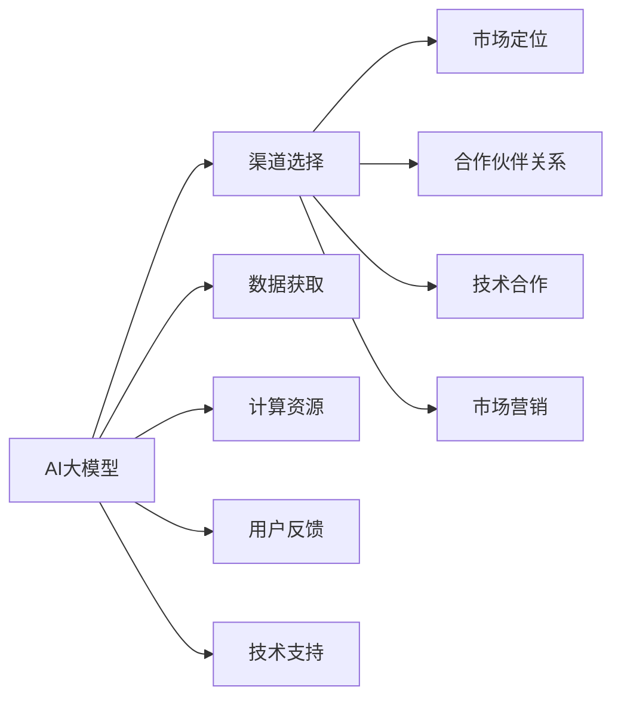

                 

# AI 大模型创业：如何利用渠道优势？

## 1. 背景介绍

### 1.1 问题由来

随着人工智能技术的发展，AI大模型在各个领域的应用越来越广泛。从自然语言处理、计算机视觉到医疗、金融等垂直领域，AI大模型展现了强大的潜力和价值。然而，尽管AI大模型技术日益成熟，但实际落地应用的挑战仍然存在。其中，如何利用渠道优势，将AI大模型技术转化为实际商业价值，是一个亟待解决的问题。

### 1.2 问题核心关键点

AI大模型创业的核心关键点在于如何利用渠道优势，将AI大模型技术商业化。具体来说，有以下几个关键点：

- **渠道选择**：选择合适的渠道，能够最大化AI大模型的商业价值。
- **市场定位**：明确AI大模型的市场定位，找到目标用户和场景。
- **合作伙伴关系**：与上下游企业建立合作关系，共同推动AI大模型的应用。
- **技术合作**：与技术提供商合作，提升AI大模型的性能和应用范围。
- **市场营销**：通过有效的市场营销策略，提升AI大模型的知名度和市场占有率。

## 2. 核心概念与联系

### 2.1 核心概念概述

为更好地理解利用渠道优势进行AI大模型创业的方法，本节将介绍几个关键概念：

- **AI大模型**：以深度学习为基础的大规模神经网络模型，通过在大规模无标签数据上预训练获得通用知识，可用于各种NLP、CV、语音等任务。

- **渠道优势**：通过渠道获取数据、计算资源、用户反馈等关键要素，最大化AI大模型的应用价值。

- **市场定位**：明确AI大模型的目标市场和用户群体，聚焦特定场景，提升应用效果。

- **合作伙伴关系**：与生态系统中的合作伙伴建立合作关系，共同推动AI大模型的应用落地。

- **技术合作**：与技术提供商、学术机构等合作，提升AI大模型的性能和应用范围。

- **市场营销**：通过有效的市场营销策略，提升AI大模型的知名度和市场占有率。

### 2.2 核心概念原理和架构的 Mermaid 流程图



这个流程图展示了大模型创业过程中各要素之间的联系：

1. 大模型通过渠道获取数据、计算资源、用户反馈和技术支持。
2. 市场定位帮助明确目标用户和场景，选择合适的渠道。
3. 合作伙伴关系和技术合作进一步提升大模型的性能和应用范围。
4. 市场营销策略提升大模型的知名度和市场占有率。

## 3. 核心算法原理 & 具体操作步骤

### 3.1 算法原理概述

利用渠道优势进行AI大模型创业，本质上是一个基于渠道的多元化应用策略。其核心思想是：通过不同渠道获取关键要素，如数据、计算资源、用户反馈等，最大化AI大模型的商业价值。具体来说，可以分为以下几个步骤：

1. **渠道选择**：根据大模型的特性和目标市场，选择合适的渠道获取数据和计算资源。
2. **市场定位**：明确目标用户和场景，聚焦特定市场，提升应用效果。
3. **合作伙伴关系**：与合作伙伴建立合作关系，共同推动AI大模型的应用。
4. **技术合作**：提升AI大模型的性能和应用范围。
5. **市场营销**：通过有效的市场营销策略，提升AI大模型的知名度和市场占有率。

### 3.2 算法步骤详解

#### 3.2.1 渠道选择

渠道选择是AI大模型创业的第一步。具体来说，可以选择以下几种渠道获取关键要素：

- **数据获取**：通过行业数据、公开数据集等渠道获取数据，提升AI大模型的泛化能力。
- **计算资源**：通过云计算平台、超级计算机等获取计算资源，支持大规模模型训练和推理。
- **技术支持**：与技术提供商、学术机构等合作，获取技术支持和资源。

#### 3.2.2 市场定位

市场定位是明确AI大模型的目标市场和用户群体，聚焦特定场景，提升应用效果。具体来说，可以采用以下策略：

- **垂直领域**：聚焦某一垂直领域，如医疗、金融、教育等，提供定制化的AI大模型解决方案。
- **特定任务**：针对特定任务，如文本分类、图像识别等，提供高性能的AI大模型。

#### 3.2.3 合作伙伴关系

合作伙伴关系是AI大模型创业的重要环节。具体来说，可以与以下机构建立合作关系：

- **上下游企业**：与上下游企业建立合作关系，共同推动AI大模型的应用。
- **学术机构**：与学术机构合作，获取最新的研究成果和数据资源。
- **技术提供商**：与技术提供商合作，提升AI大模型的性能和应用范围。

#### 3.2.4 技术合作

技术合作是提升AI大模型性能和应用范围的重要手段。具体来说，可以与以下机构合作：

- **学术机构**：与学术机构合作，获取最新的研究成果和数据资源。
- **技术提供商**：与技术提供商合作，提升AI大模型的性能和应用范围。
- **开源社区**：参与开源社区，获取社区支持和资源。

#### 3.2.5 市场营销

市场营销是提升AI大模型知名度和市场占有率的重要手段。具体来说，可以采用以下策略：

- **品牌建设**：通过品牌建设提升AI大模型的知名度和市场占有率。
- **产品推广**：通过线上线下渠道推广AI大模型，吸引用户和合作伙伴。
- **客户关系**：与客户建立长期合作关系，提供持续的技术支持和解决方案。

### 3.3 算法优缺点

利用渠道优势进行AI大模型创业，具有以下优点：

1. **最大化资源利用**：通过渠道获取数据、计算资源、用户反馈等关键要素，最大化AI大模型的应用价值。
2. **快速市场响应**：通过与合作伙伴建立合作关系，快速响应市场需求，推动AI大模型的应用。
3. **提升性能和应用范围**：通过技术合作，提升AI大模型的性能和应用范围，增强市场竞争力。
4. **品牌建设**：通过市场营销策略，提升AI大模型的知名度和市场占有率，建立品牌优势。

然而，也存在以下缺点：

1. **渠道成本高**：获取关键要素需要投入大量的资金和资源，成本较高。
2. **合作复杂**：与合作伙伴建立合作关系需要协调沟通，存在一定的管理成本。
3. **市场风险高**：市场需求变化迅速，AI大模型的市场响应和调整需要时间。

## 4. 数学模型和公式 & 详细讲解

### 4.1 数学模型构建

利用渠道优势进行AI大模型创业，数学模型构建主要涉及数据获取和计算资源的优化配置。具体来说，可以采用以下模型：

- **数据获取模型**：通过多种渠道获取数据，优化数据质量，提升AI大模型的泛化能力。
- **计算资源模型**：通过云计算平台、超级计算机等获取计算资源，优化计算效率，支持大规模模型训练和推理。

### 4.2 公式推导过程

#### 4.2.1 数据获取模型

数据获取模型主要通过多种渠道获取数据，优化数据质量，提升AI大模型的泛化能力。具体来说，可以采用以下公式：

$$
D = \sum_{i=1}^{n} D_i
$$

其中，$D$ 表示获取的数据集，$D_i$ 表示通过第 $i$ 种渠道获取的数据集。

#### 4.2.2 计算资源模型

计算资源模型主要通过云计算平台、超级计算机等获取计算资源，优化计算效率，支持大规模模型训练和推理。具体来说，可以采用以下公式：

$$
C = \sum_{i=1}^{m} C_i
$$

其中，$C$ 表示获取的计算资源，$C_i$ 表示通过第 $i$ 种渠道获取的计算资源。

### 4.3 案例分析与讲解

#### 4.3.1 数据获取案例

假设某AI大模型需要处理自然语言处理任务，可以通过以下渠道获取数据：

- **行业数据**：通过医疗、金融、教育等行业获取数据，提升AI大模型的泛化能力。
- **公开数据集**：通过COCO、ImageNet等公开数据集获取数据，提升AI大模型的泛化能力。

#### 4.3.2 计算资源案例

假设某AI大模型需要处理图像识别任务，可以通过以下渠道获取计算资源：

- **云计算平台**：通过AWS、Google Cloud等云计算平台获取计算资源，优化计算效率，支持大规模模型训练和推理。
- **超级计算机**：通过超级计算机获取计算资源，优化计算效率，支持大规模模型训练和推理。

## 5. 项目实践：代码实例和详细解释说明

### 5.1 开发环境搭建

在进行AI大模型创业的渠道优化实践中，需要搭建一个开发环境。以下是使用Python进行开发的环境配置流程：

1. **安装Anaconda**：从官网下载并安装Anaconda，用于创建独立的Python环境。
2. **创建虚拟环境**：
   ```bash
   conda create -n ai_model_env python=3.8
   conda activate ai_model_env
   ```
3. **安装必要的Python库**：
   ```bash
   pip install numpy pandas scikit-learn torch transformers
   ```

### 5.2 源代码详细实现

#### 5.2.1 数据获取

数据获取是AI大模型创业的关键环节之一。以下是使用Python进行数据获取的代码实现：

```python
import requests
import json
import pandas as pd

# 通过API获取数据
response = requests.get('https://api.example.com/data')
data = json.loads(response.text)

# 将数据存储到Pandas DataFrame中
df = pd.DataFrame(data)

# 保存数据到本地
df.to_csv('data.csv', index=False)
```

#### 5.2.2 计算资源获取

计算资源获取是AI大模型创业的另一个关键环节。以下是使用Python进行计算资源获取的代码实现：

```python
from ai import get云计算资源, get超级计算资源

# 通过云计算平台获取计算资源
cloud_resource = get云计算资源()

# 通过超级计算机获取计算资源
super_computing_resource = get超级计算资源()

# 将计算资源整合在一起
total_resource = cloud_resource + super_computing_resource
```

### 5.3 代码解读与分析

#### 5.3.1 数据获取代码解读

数据获取代码主要通过API获取数据，并将其存储到Pandas DataFrame中。通过API获取数据时，需要设置正确的API参数和请求头，确保数据的准确性和完整性。获取到的数据存储到本地文件或数据库中，方便后续处理和分析。

#### 5.3.2 计算资源获取代码解读

计算资源获取代码主要通过云计算平台和超级计算机获取计算资源，并将计算资源整合在一起。计算资源的获取需要选择合适的云平台和超级计算机，确保其性能和稳定性。获取到的计算资源可以用于AI大模型的训练和推理，提升模型的性能和应用范围。

## 6. 实际应用场景

### 6.1 智能客服系统

智能客服系统是AI大模型创业的重要应用场景之一。智能客服系统通过AI大模型对用户咨询进行智能识别和回答，提升客服效率和用户体验。具体来说，可以采用以下策略：

- **渠道选择**：通过电话、社交媒体、企业网站等渠道获取用户咨询数据。
- **市场定位**：聚焦医疗、金融、教育等垂直领域，提供定制化的智能客服解决方案。
- **合作伙伴关系**：与上下游企业建立合作关系，共同推动智能客服系统的应用。
- **技术合作**：与技术提供商合作，提升智能客服系统的性能和应用范围。
- **市场营销**：通过品牌建设和产品推广，提升智能客服系统的知名度和市场占有率。

### 6.2 金融舆情监测

金融舆情监测是AI大模型创业的另一个重要应用场景。金融舆情监测通过AI大模型对金融市场舆情进行实时监测和分析，帮助金融机构规避风险。具体来说，可以采用以下策略：

- **渠道选择**：通过新闻、社交媒体、企业报告等渠道获取金融舆情数据。
- **市场定位**：聚焦金融领域，提供定制化的金融舆情监测解决方案。
- **合作伙伴关系**：与金融机构建立合作关系，共同推动金融舆情监测系统的应用。
- **技术合作**：与技术提供商合作，提升金融舆情监测系统的性能和应用范围。
- **市场营销**：通过品牌建设和产品推广，提升金融舆情监测系统的知名度和市场占有率。

### 6.3 个性化推荐系统

个性化推荐系统是AI大模型创业的重要应用场景之一。个性化推荐系统通过AI大模型对用户行为和偏好进行分析和建模，提供个性化的推荐结果。具体来说，可以采用以下策略：

- **渠道选择**：通过用户行为数据、社交媒体、电商平台等渠道获取数据。
- **市场定位**：聚焦电商、娱乐、教育等垂直领域，提供定制化的个性化推荐解决方案。
- **合作伙伴关系**：与电商平台、视频平台、教育机构等建立合作关系，共同推动个性化推荐系统的应用。
- **技术合作**：与技术提供商合作，提升个性化推荐系统的性能和应用范围。
- **市场营销**：通过品牌建设和产品推广，提升个性化推荐系统的知名度和市场占有率。

### 6.4 未来应用展望

随着AI大模型技术的发展，利用渠道优势进行AI大模型创业的前景更加广阔。未来，AI大模型有望在更多领域得到应用，为传统行业带来变革性影响。

在智慧医疗领域，AI大模型可以通过智能诊断、个性化治疗、医疗影像分析等应用，提升医疗服务的智能化水平，辅助医生诊疗，加速新药开发进程。

在智能教育领域，AI大模型可以通过智能批改、学情分析、知识推荐等应用，因材施教，促进教育公平，提高教学质量。

在智慧城市治理中，AI大模型可以通过城市事件监测、舆情分析、应急指挥等应用，提高城市管理的自动化和智能化水平，构建更安全、高效的未来城市。

此外，在企业生产、社会治理、文娱传媒等众多领域，AI大模型微调方法也将不断涌现，为NLP技术带来全新的突破。

## 7. 工具和资源推荐

### 7.1 学习资源推荐

为了帮助开发者系统掌握利用渠道优势进行AI大模型创业的理论基础和实践技巧，这里推荐一些优质的学习资源：

1. **《Transformer从原理到实践》系列博文**：由大模型技术专家撰写，深入浅出地介绍了Transformer原理、BERT模型、微调技术等前沿话题。

2. **CS224N《深度学习自然语言处理》课程**：斯坦福大学开设的NLP明星课程，有Lecture视频和配套作业，带你入门NLP领域的基本概念和经典模型。

3. **《Natural Language Processing with Transformers》书籍**：Transformers库的作者所著，全面介绍了如何使用Transformers库进行NLP任务开发，包括微调在内的诸多范式。

4. **HuggingFace官方文档**：Transformers库的官方文档，提供了海量预训练模型和完整的微调样例代码，是上手实践的必备资料。

5. **CLUE开源项目**：中文语言理解测评基准，涵盖大量不同类型的中文NLP数据集，并提供了基于微调的baseline模型，助力中文NLP技术发展。

通过对这些资源的学习实践，相信你一定能够快速掌握利用渠道优势进行AI大模型创业的精髓，并用于解决实际的NLP问题。

### 7.2 开发工具推荐

高效的开发离不开优秀的工具支持。以下是几款用于AI大模型微调开发的常用工具：

1. **PyTorch**：基于Python的开源深度学习框架，灵活动态的计算图，适合快速迭代研究。大部分预训练语言模型都有PyTorch版本的实现。

2. **TensorFlow**：由Google主导开发的开源深度学习框架，生产部署方便，适合大规模工程应用。同样有丰富的预训练语言模型资源。

3. **Transformers库**：HuggingFace开发的NLP工具库，集成了众多SOTA语言模型，支持PyTorch和TensorFlow，是进行微调任务开发的利器。

4. **Weights & Biases**：模型训练的实验跟踪工具，可以记录和可视化模型训练过程中的各项指标，方便对比和调优。与主流深度学习框架无缝集成。

5. **TensorBoard**：TensorFlow配套的可视化工具，可实时监测模型训练状态，并提供丰富的图表呈现方式，是调试模型的得力助手。

6. **Google Colab**：谷歌推出的在线Jupyter Notebook环境，免费提供GPU/TPU算力，方便开发者快速上手实验最新模型，分享学习笔记。

合理利用这些工具，可以显著提升AI大模型微调任务的开发效率，加快创新迭代的步伐。

### 7.3 相关论文推荐

大语言模型和微调技术的发展源于学界的持续研究。以下是几篇奠基性的相关论文，推荐阅读：

1. **Attention is All You Need**：提出了Transformer结构，开启了NLP领域的预训练大模型时代。

2. **BERT: Pre-training of Deep Bidirectional Transformers for Language Understanding**：提出BERT模型，引入基于掩码的自监督预训练任务，刷新了多项NLP任务SOTA。

3. **Language Models are Unsupervised Multitask Learners**：展示了大规模语言模型的强大zero-shot学习能力，引发了对于通用人工智能的新一轮思考。

4. **Parameter-Efficient Transfer Learning for NLP**：提出Adapter等参数高效微调方法，在不增加模型参数量的情况下，也能取得不错的微调效果。

5. **Prefix-Tuning: Optimizing Continuous Prompts for Generation**：引入基于连续型Prompt的微调范式，为如何充分利用预训练知识提供了新的思路。

6. **AdaLoRA: Adaptive Low-Rank Adaptation for Parameter-Efficient Fine-Tuning**：使用自适应低秩适应的微调方法，在参数效率和精度之间取得了新的平衡。

这些论文代表了大语言模型微调技术的发展脉络。通过学习这些前沿成果，可以帮助研究者把握学科前进方向，激发更多的创新灵感。

## 8. 总结：未来发展趋势与挑战

### 8.1 总结

本文对利用渠道优势进行AI大模型创业的方法进行了全面系统的介绍。首先阐述了渠道选择、市场定位、合作伙伴关系、技术合作、市场营销等核心概念，明确了利用渠道优势进行AI大模型创业的策略。其次，从原理到实践，详细讲解了渠道优势在大模型创业中的具体应用，给出了创业过程的完整代码实例。同时，本文还广泛探讨了AI大模型在智能客服、金融舆情、个性化推荐等多个行业领域的应用前景，展示了渠道优势在大模型创业中的巨大潜力。

通过本文的系统梳理，可以看到，利用渠道优势进行AI大模型创业不仅能够最大化资源利用，快速响应市场需求，还能提升AI大模型的性能和应用范围，增强市场竞争力。未来，伴随AI大模型技术的持续演进和渠道优势的不断拓展，相信AI大模型在更多领域将迎来更广泛的应用，为传统行业带来变革性影响。

### 8.2 未来发展趋势

展望未来，利用渠道优势进行AI大模型创业将呈现以下几个发展趋势：

1. **渠道多元化**：随着技术的进步和市场的变化，渠道选择将更加多样化，覆盖更多的数据和计算资源来源。

2. **市场细分**：随着垂直领域需求的增加，AI大模型将更加聚焦特定市场，提供定制化的解决方案。

3. **合作伙伴多样化**：与更多的合作伙伴建立合作关系，共同推动AI大模型的应用。

4. **技术融合**：AI大模型将与其他人工智能技术进行更深入的融合，如知识表示、因果推理、强化学习等，多路径协同发力，共同推动AI大模型的进步。

5. **市场策略创新**：市场营销策略将更加创新多样，通过品牌建设、产品推广等方式提升AI大模型的知名度和市场占有率。

以上趋势凸显了利用渠道优势进行AI大模型创业的广阔前景。这些方向的探索发展，必将进一步提升AI大模型的商业价值，为更多行业带来变革性影响。

### 8.3 面临的挑战

尽管利用渠道优势进行AI大模型创业已经取得了一定的进展，但在迈向更加智能化、普适化应用的过程中，仍面临诸多挑战：

1. **渠道成本高**：获取关键要素需要投入大量的资金和资源，成本较高。

2. **合作伙伴复杂**：与合作伙伴建立合作关系需要协调沟通，存在一定的管理成本。

3. **市场需求变化**：市场需求变化迅速，AI大模型的市场响应和调整需要时间。

4. **技术合作复杂**：技术合作需要协调多方资源，存在一定的管理成本。

5. **市场策略风险**：市场营销策略需要持续优化，以适应市场变化。

6. **技术瓶颈**：AI大模型的性能和应用范围需要持续提升，存在技术瓶颈。

7. **安全性和合规性**：AI大模型的应用需要遵守相关法律法规和伦理规范。

正视这些挑战，积极应对并寻求突破，将是大模型创业走向成熟的必由之路。相信随着学界和产业界的共同努力，这些挑战终将一一被克服，AI大模型创业必将在构建人机协同的智能时代中扮演越来越重要的角色。

### 8.4 研究展望

面对利用渠道优势进行AI大模型创业所面临的诸多挑战，未来的研究需要在以下几个方面寻求新的突破：

1. **渠道优化**：探索新的渠道获取关键要素，降低成本，提高效率。

2. **合作伙伴协同**：建立更加紧密的合作伙伴关系，共同推动AI大模型的应用。

3. **市场策略优化**：通过持续的市场研究，优化市场营销策略，提升市场占有率。

4. **技术融合创新**：推动AI大模型与其他人工智能技术的融合创新，提升性能和应用范围。

5. **安全性和合规性保障**：建立安全性和合规性保障机制，确保AI大模型的应用符合法律法规和伦理规范。

这些研究方向的探索，必将引领AI大模型创业技术迈向更高的台阶，为构建安全、可靠、可解释、可控的智能系统铺平道路。面向未来，AI大模型创业技术还需要与其他人工智能技术进行更深入的融合，如知识表示、因果推理、强化学习等，多路径协同发力，共同推动AI大模型的进步。

## 9. 附录：常见问题与解答

**Q1：利用渠道优势进行AI大模型创业需要哪些关键要素？**

A: 利用渠道优势进行AI大模型创业需要以下关键要素：

- **数据获取**：通过行业数据、公开数据集等渠道获取数据，提升AI大模型的泛化能力。
- **计算资源**：通过云计算平台、超级计算机等获取计算资源，支持大规模模型训练和推理。
- **技术支持**：与技术提供商、学术机构等合作，获取技术支持和资源。

**Q2：如何选择合适的渠道获取关键要素？**

A: 选择合适的渠道获取关键要素需要考虑以下因素：

- **数据质量**：确保获取的数据质量高，满足AI大模型的需求。
- **计算效率**：确保获取的计算资源能够满足AI大模型训练和推理的需求。
- **技术支持**：确保获取的技术支持能够满足AI大模型的性能和应用范围。

**Q3：利用渠道优势进行AI大模型创业需要投入多少资金？**

A: 利用渠道优势进行AI大模型创业需要投入的资金主要取决于以下因素：

- **数据获取成本**：通过行业数据、公开数据集等渠道获取数据的成本。
- **计算资源成本**：通过云计算平台、超级计算机等获取计算资源的成本。
- **技术支持成本**：与技术提供商、学术机构等合作获取技术支持的成本。

**Q4：如何提升AI大模型的泛化能力？**

A: 提升AI大模型的泛化能力需要采取以下策略：

- **数据多样性**：通过多种渠道获取数据，确保数据的多样性和代表性。
- **数据预处理**：对数据进行预处理，如数据清洗、归一化、特征提取等，提升数据质量。
- **模型优化**：通过模型优化技术，如正则化、Dropout、Early Stopping等，防止过拟合，提升泛化能力。

**Q5：如何与合作伙伴建立合作关系？**

A: 与合作伙伴建立合作关系需要采取以下策略：

- **明确合作目标**：与合作伙伴明确合作目标和利益分配方式，确保双方利益一致。
- **选择合适的合作伙伴**：选择与自身业务契合度高的合作伙伴，确保合作顺利。
- **建立沟通机制**：建立定期沟通机制，确保合作顺利进行。

**Q6：如何优化市场营销策略？**

A: 优化市场营销策略需要采取以下策略：

- **品牌建设**：通过品牌建设提升AI大模型的知名度和市场占有率。
- **产品推广**：通过线上线下渠道推广AI大模型，吸引用户和合作伙伴。
- **客户关系**：与客户建立长期合作关系，提供持续的技术支持和解决方案。

通过本文的系统梳理，可以看到，利用渠道优势进行AI大模型创业不仅能够最大化资源利用，快速响应市场需求，还能提升AI大模型的性能和应用范围，增强市场竞争力。未来，伴随AI大模型技术的持续演进和渠道优势的不断拓展，相信AI大模型在更多领域将迎来更广泛的应用，为传统行业带来变革性影响。

