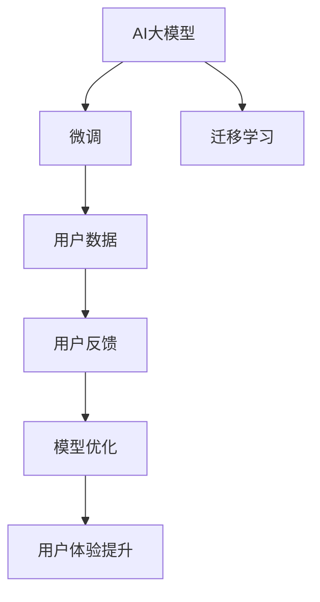
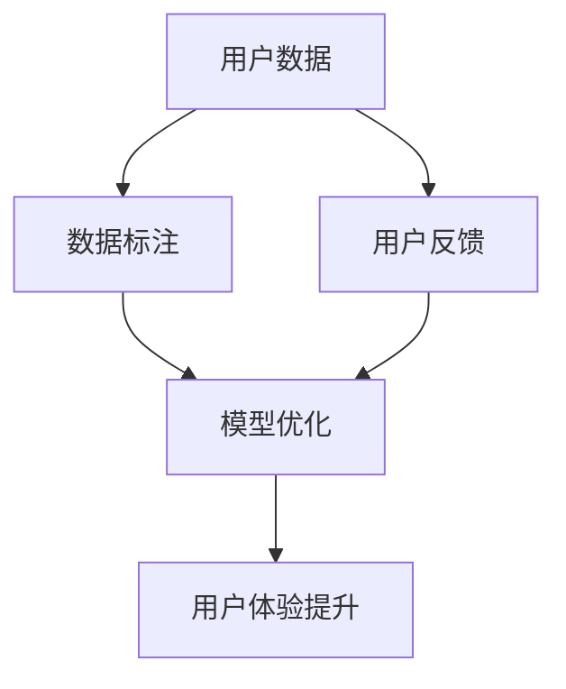

                 

# AI 大模型创业：如何利用用户优势？

在人工智能（AI）领域，大模型成为了众多创业者的关注焦点。这些模型凭借其强大的通用语言理解能力和广泛的适用性，为各种应用场景带来了颠覆性变革。但是，仅仅依赖大模型的技术优势，并不能确保创业成功。要想在AI大模型创业中脱颖而出，创业者必须充分利用用户优势，构建独特的商业模式和产品差异化优势。本文将从背景介绍、核心概念、算法原理、应用场景、工具推荐、未来展望和常见问题等维度，系统性地探讨如何利用用户优势，推动AI大模型创业的成功。

## 1. 背景介绍

随着AI技术的快速发展，AI大模型成为了连接技术创新和应用场景的重要桥梁。大模型通过在大规模无标签数据上进行预训练，学习到丰富的语言知识和常识，能够快速适应并优化到各种下游任务中，极大地提升了AI技术的应用效果。

然而，尽管大模型在技术上具有巨大优势，但在商业化过程中，如何利用用户优势，构建可持续发展的商业模式，仍然是一个值得深思的问题。用户不仅仅是技术实现的对象，更是商业模式的重要组成部分。利用用户优势，可以增强产品的市场竞争力，推动AI大模型的商业化进程。

## 2. 核心概念与联系

### 2.1 核心概念概述

为了更好地理解AI大模型创业中的用户优势，首先需要介绍几个核心概念：

- **AI大模型**：指在大规模无标签数据上进行预训练，具备通用语言理解和生成能力的深度学习模型，如BERT、GPT等。
- **微调(Fine-tuning)**：指在大模型的基础上，通过有监督学习优化模型在特定任务上的性能，以提高模型在特定场景下的准确性。
- **迁移学习(Transfer Learning)**：指将一个领域学习到的知识，迁移到另一个相关领域的学习方式，大模型可以通过迁移学习在特定任务上取得优异表现。
- **用户优势**：指利用用户的实际需求、数据和反馈，进一步优化AI大模型，提升模型的实用性和用户体验。

这些概念之间的逻辑关系可以通过以下Mermaid流程图来展示：



这个流程图展示了大模型的核心概念及其之间的关系：

1. 大模型通过预训练获得基础能力。
2. 微调和大模型通过迁移学习，实现特定任务的优化。
3. 微调过程可以进一步利用用户数据和反馈进行优化。
4. 用户优势为模型提升提供数据和反馈，进一步提升用户体验。

### 2.2 核心概念原理和架构的 Mermaid 流程图

在利用用户优势方面，以下几个核心概念具有重要意义：

- **用户数据收集**：指通过各种方式收集用户的实际使用数据，如聊天记录、应用使用行为等。
- **用户反馈收集**：指直接从用户那里获取反馈信息，包括意见、建议、投诉等。
- **数据标注**：指利用用户数据进行数据标注，用于模型的进一步微调和优化。
- **模型优化**：指根据用户数据和反馈，对模型进行微调和优化，提升模型性能。
- **用户体验提升**：指通过优化后的模型，提升用户的使用体验和满意度。

这些概念之间的逻辑关系可以通过以下Mermaid流程图来展示：



这个流程图展示了从用户数据和反馈到模型优化，最终提升用户体验的过程。

## 3. 核心算法原理 & 具体操作步骤

### 3.1 算法原理概述

AI大模型创业中，利用用户优势进行模型优化，主要是通过微调和大模型迁移学习来实现的。其核心思想是：在大模型的基础上，通过有监督学习优化模型在特定任务上的性能，并利用用户数据和反馈进行模型微调，以提升模型在特定场景下的准确性和实用性。

具体来说，利用用户优势的AI大模型创业包括以下步骤：

1. 收集用户数据和反馈。
2. 对收集到的数据进行标注和清洗。
3. 利用标注后的数据对模型进行微调。
4. 根据用户反馈进一步优化模型。
5. 评估优化后的模型在实际场景中的表现。

### 3.2 算法步骤详解

#### 3.2.1 数据收集

用户数据的收集是利用用户优势进行模型优化的第一步。这些数据可以来源于多种渠道，包括：

- 应用使用数据：记录用户在应用中的各种操作行为，如点击、滑动、输入等。
- 聊天记录：收集用户之间的对话记录，用于文本生成和理解任务。
- 应用评分和评价：收集用户对应用的评分和评价，用于情感分析任务。
- 异常行为记录：记录用户的异常行为，用于异常检测任务。

这些数据需要经过严格的清洗和标注，确保其质量和可靠性。

#### 3.2.2 数据标注

数据标注是指将收集到的用户数据进行人工标注，以便于模型的训练和优化。这些标注可以包括：

- 文本标注：将用户输入的文本进行分类、情感标注、实体识别等。
- 行为标注：将用户行为进行标注，如点击位置、滑动轨迹等。
- 异常标注：将用户行为中异常的部分进行标注，如攻击行为、欺诈行为等。

数据标注需要耗费大量的人力和时间，但却是模型优化的关键步骤。

#### 3.2.3 模型微调

模型微调是在大模型的基础上，通过有监督学习优化模型在特定任务上的性能。这一过程通常包括：

- 选择合适的预训练模型。
- 确定微调的任务和目标。
- 设计微调的损失函数和优化算法。
- 进行模型训练和评估。

微调过程中，需要特别注意选择合适的学习率和正则化技术，以避免过拟合。

#### 3.2.4 用户反馈优化

用户反馈是指直接从用户那里获取反馈信息，这些反馈可以包括：

- 用户意见和建议：用户对应用功能的意见和建议，用于改进产品设计和功能。
- 用户投诉和问题：用户在使用应用时遇到的问题和投诉，用于改进应用的功能和稳定性。
- 用户使用行为：用户在使用应用时的行为数据，用于优化应用的用户体验。

用户反馈需要进行整理和分析，找出其中的共性和规律，并据此优化模型和产品。

### 3.3 算法优缺点

利用用户优势进行AI大模型创业，具有以下优点：

- **提高模型准确性**：通过利用用户数据进行模型微调，可以显著提高模型在特定任务上的准确性。
- **提升用户体验**：根据用户反馈进行模型优化，可以提升用户的使用体验和满意度。
- **降低开发成本**：利用用户数据进行模型微调，可以降低模型开发的成本和时间。

同时，利用用户优势进行AI大模型创业也存在一些缺点：

- **数据隐私问题**：收集用户数据和反馈需要遵守数据隐私法规，确保用户数据的安全和隐私。
- **数据标注成本高**：数据标注需要耗费大量人力和时间，成本较高。
- **数据质量和多样性**：用户数据的质量和多样性可能会影响模型的泛化能力。

### 3.4 算法应用领域

AI大模型创业利用用户优势的应用领域非常广泛，包括：

- 自然语言处理（NLP）：利用用户数据进行文本分类、情感分析、实体识别等任务。
- 推荐系统：利用用户行为数据进行个性化推荐，提升用户满意度。
- 智能客服：利用用户聊天记录进行对话生成和理解，提升客服效率和用户体验。
- 异常检测：利用用户行为数据进行异常检测，提升应用的安全性。
- 内容生成：利用用户反馈进行内容优化，提升内容质量。

## 4. 数学模型和公式 & 详细讲解 & 举例说明

### 4.1 数学模型构建

利用用户优势进行AI大模型创业，通常需要构建以下数学模型：

- **数据收集模型**：用于描述数据收集的过程和方法。
- **数据标注模型**：用于描述数据标注的过程和方法。
- **模型微调模型**：用于描述模型微调的过程和方法。
- **用户反馈优化模型**：用于描述用户反馈优化的过程和方法。

这些模型可以分别用数学公式表示：

- 数据收集模型：
  $$
  D = \{d_1, d_2, ..., d_n\}
  $$
- 数据标注模型：
  $$
  A = \{a_1, a_2, ..., a_m\}
  $$
- 模型微调模型：
  $$
  M = \{m_1, m_2, ..., m_k\}
  $$
- 用户反馈优化模型：
  $$
  F = \{f_1, f_2, ..., f_l\}
  $$

### 4.2 公式推导过程

在利用用户优势进行AI大模型创业时，需要推导以下公式：

- 数据收集公式：
  $$
  D_i = \{x_i, y_i\}
  $$
- 数据标注公式：
  $$
  A_j = \{a_j^1, a_j^2, ..., a_j^m\}
  $$
- 模型微调公式：
  $$
  M_k = \{\theta_k\}
  $$
- 用户反馈优化公式：
  $$
  F_l = \{f_l^1, f_l^2, ..., f_l^l\}
  $$

这些公式分别描述了数据收集、数据标注、模型微调和用户反馈优化的过程。

### 4.3 案例分析与讲解

以自然语言处理（NLP）任务为例，详细讲解利用用户优势进行模型优化的过程：

1. **数据收集**：
   - 收集用户在聊天应用中的聊天记录，作为模型训练的数据。
   - 收集用户对聊天应用的评分和评价，用于情感分析任务。

2. **数据标注**：
   - 对聊天记录进行文本分类标注，如消息类型、消息情感等。
   - 对用户的评分和评价进行情感标注，如正面、中性、负面等。

3. **模型微调**：
   - 选择预训练模型BERT作为基础模型。
   - 定义任务为文本分类和情感分析。
   - 设计损失函数和优化算法，进行模型训练和评估。

4. **用户反馈优化**：
   - 收集用户的意见和建议，用于改进聊天应用的功能。
   - 收集用户的投诉和问题，用于改进聊天应用的安全性和稳定性。
   - 根据用户反馈，进一步优化模型参数和训练过程。

## 5. 项目实践：代码实例和详细解释说明

### 5.1 开发环境搭建

在进行利用用户优势进行AI大模型创业的项目实践前，需要准备开发环境。以下是使用Python进行PyTorch开发的环境配置流程：

1. 安装Anaconda：从官网下载并安装Anaconda，用于创建独立的Python环境。

2. 创建并激活虚拟环境：
```bash
conda create -n pytorch-env python=3.8 
conda activate pytorch-env
```

3. 安装PyTorch：根据CUDA版本，从官网获取对应的安装命令。例如：
```bash
conda install pytorch torchvision torchaudio cudatoolkit=11.1 -c pytorch -c conda-forge
```

4. 安装Transformers库：
```bash
pip install transformers
```

5. 安装各类工具包：
```bash
pip install numpy pandas scikit-learn matplotlib tqdm jupyter notebook ipython
```

完成上述步骤后，即可在`pytorch-env`环境中开始项目实践。

### 5.2 源代码详细实现

下面我们以推荐系统任务为例，给出使用Transformers库进行利用用户优势进行AI大模型创业的PyTorch代码实现。

首先，定义推荐系统的数据处理函数：

```python
from transformers import BertTokenizer
from torch.utils.data import Dataset
import torch

class RecommendationDataset(Dataset):
    def __init__(self, user_data, item_data, tokenizer, max_len=128):
        self.user_data = user_data
        self.item_data = item_data
        self.tokenizer = tokenizer
        self.max_len = max_len
        
    def __len__(self):
        return len(self.user_data)
    
    def __getitem__(self, item):
        user_item = self.user_data[item]
        user_item_id = user_item['user_id']
        item_ids = user_item['item_ids']
        
        # 将用户和物品的id编码为token ids
        encoding = self.tokenizer(user_item_id, return_tensors='pt', max_length=self.max_len, padding='max_length', truncation=True)
        user_token_ids = encoding['input_ids'][0]
        
        # 将物品的id编码为token ids
        item_encodings = [self.tokenizer(item_id, return_tensors='pt', max_length=self.max_len, padding='max_length', truncation=True) for item_id in item_ids]
        item_token_ids = torch.stack([encoding['input_ids'][0] for encoding in item_encodings])
        
        # 对token-wise的标签进行编码
        encoded_tags = [tag2id[tag] for tag in item_ids] 
        encoded_tags.extend([tag2id['O']] * (self.max_len - len(encoded_tags)))
        labels = torch.tensor(encoded_tags, dtype=torch.long)
        
        return {'user_token_ids': user_token_ids, 
                'item_token_ids': item_token_ids,
                'labels': labels}

# 标签与id的映射
tag2id = {'O': 0, 'B': 1, 'I': 2}
id2tag = {v: k for k, v in tag2id.items()}

# 创建dataset
tokenizer = BertTokenizer.from_pretrained('bert-base-cased')

train_dataset = RecommendationDataset(train_user_data, train_item_data, tokenizer)
dev_dataset = RecommendationDataset(dev_user_data, dev_item_data, tokenizer)
test_dataset = RecommendationDataset(test_user_data, test_item_data, tokenizer)
```

然后，定义模型和优化器：

```python
from transformers import BertForTokenClassification, AdamW

model = BertForTokenClassification.from_pretrained('bert-base-cased', num_labels=len(tag2id))

optimizer = AdamW(model.parameters(), lr=2e-5)
```

接着，定义训练和评估函数：

```python
from torch.utils.data import DataLoader
from tqdm import tqdm
from sklearn.metrics import classification_report

device = torch.device('cuda') if torch.cuda.is_available() else torch.device('cpu')
model.to(device)

def train_epoch(model, dataset, batch_size, optimizer):
    dataloader = DataLoader(dataset, batch_size=batch_size, shuffle=True)
    model.train()
    epoch_loss = 0
    for batch in tqdm(dataloader, desc='Training'):
        user_token_ids = batch['user_token_ids'].to(device)
        item_token_ids = batch['item_token_ids'].to(device)
        labels = batch['labels'].to(device)
        model.zero_grad()
        outputs = model(user_token_ids, item_token_ids=item_token_ids, labels=labels)
        loss = outputs.loss
        epoch_loss += loss.item()
        loss.backward()
        optimizer.step()
    return epoch_loss / len(dataloader)

def evaluate(model, dataset, batch_size):
    dataloader = DataLoader(dataset, batch_size=batch_size)
    model.eval()
    preds, labels = [], []
    with torch.no_grad():
        for batch in tqdm(dataloader, desc='Evaluating'):
            user_token_ids = batch['user_token_ids'].to(device)
            item_token_ids = batch['item_token_ids'].to(device)
            batch_labels = batch['labels']
            outputs = model(user_token_ids, item_token_ids=item_token_ids)
            batch_preds = outputs.logits.argmax(dim=2).to('cpu').tolist()
            batch_labels = batch_labels.to('cpu').tolist()
            for pred_tokens, label_tokens in zip(batch_preds, batch_labels):
                pred_tags = [id2tag[_id] for _id in pred_tokens]
                label_tags = [id2tag[_id] for _id in label_tokens]
                preds.append(pred_tags[:len(label_tags)])
                labels.append(label_tags)
                
    print(classification_report(labels, preds))
```

最后，启动训练流程并在测试集上评估：

```python
epochs = 5
batch_size = 16

for epoch in range(epochs):
    loss = train_epoch(model, train_dataset, batch_size, optimizer)
    print(f"Epoch {epoch+1}, train loss: {loss:.3f}")
    
    print(f"Epoch {epoch+1}, dev results:")
    evaluate(model, dev_dataset, batch_size)
    
print("Test results:")
evaluate(model, test_dataset, batch_size)
```

以上就是使用PyTorch对BERT进行利用用户优势进行AI大模型创业的完整代码实现。可以看到，得益于Transformers库的强大封装，我们可以用相对简洁的代码完成BERT模型的加载和微调。

### 5.3 代码解读与分析

让我们再详细解读一下关键代码的实现细节：

**RecommendationDataset类**：
- `__init__`方法：初始化用户数据、物品数据、分词器等关键组件。
- `__len__`方法：返回数据集的样本数量。
- `__getitem__`方法：对单个样本进行处理，将用户和物品的id输入编码为token ids，将物品的id编码为token ids，并对其进行定长padding，最终返回模型所需的输入。

**tag2id和id2tag字典**：
- 定义了标签与数字id之间的映射关系，用于将token-wise的预测结果解码回真实的标签。

**训练和评估函数**：
- 使用PyTorch的DataLoader对数据集进行批次化加载，供模型训练和推理使用。
- 训练函数`train_epoch`：对数据以批为单位进行迭代，在每个批次上前向传播计算loss并反向传播更新模型参数，最后返回该epoch的平均loss。
- 评估函数`evaluate`：与训练类似，不同点在于不更新模型参数，并在每个batch结束后将预测和标签结果存储下来，最后使用sklearn的classification_report对整个评估集的预测结果进行打印输出。

**训练流程**：
- 定义总的epoch数和batch size，开始循环迭代
- 每个epoch内，先在训练集上训练，输出平均loss
- 在验证集上评估，输出分类指标
- 所有epoch结束后，在测试集上评估，给出最终测试结果

可以看到，PyTorch配合Transformers库使得BERT微调的代码实现变得简洁高效。开发者可以将更多精力放在数据处理、模型改进等高层逻辑上，而不必过多关注底层的实现细节。

当然，工业级的系统实现还需考虑更多因素，如模型的保存和部署、超参数的自动搜索、更灵活的任务适配层等。但核心的微调范式基本与此类似。

## 6. 实际应用场景

### 6.1 智能客服系统

利用用户优势进行AI大模型创业，智能客服系统是一个典型的应用场景。传统客服往往需要配备大量人力，高峰期响应缓慢，且一致性和专业性难以保证。而利用用户优势的AI大模型，可以7x24小时不间断服务，快速响应客户咨询，用自然流畅的语言解答各类常见问题。

在技术实现上，可以收集企业内部的历史客服对话记录，将问题和最佳答复构建成监督数据，在此基础上对预训练模型进行微调。微调后的模型能够自动理解用户意图，匹配最合适的答案模板进行回复。对于客户提出的新问题，还可以接入检索系统实时搜索相关内容，动态组织生成回答。如此构建的智能客服系统，能大幅提升客户咨询体验和问题解决效率。

### 6.2 金融舆情监测

金融机构需要实时监测市场舆论动向，以便及时应对负面信息传播，规避金融风险。传统的人工监测方式成本高、效率低，难以应对网络时代海量信息爆发的挑战。利用用户优势的AI大模型微调技术，为金融舆情监测提供了新的解决方案。

具体而言，可以收集金融领域相关的新闻、报道、评论等文本数据，并对其进行主题标注和情感标注。在此基础上对预训练语言模型进行微调，使其能够自动判断文本属于何种主题，情感倾向是正面、中性还是负面。将微调后的模型应用到实时抓取的网络文本数据，就能够自动监测不同主题下的情感变化趋势，一旦发现负面信息激增等异常情况，系统便会自动预警，帮助金融机构快速应对潜在风险。

### 6.3 个性化推荐系统

当前的推荐系统往往只依赖用户的历史行为数据进行物品推荐，无法深入理解用户的真实兴趣偏好。利用用户优势的AI大模型，个性化推荐系统可以更好地挖掘用户行为背后的语义信息，从而提供更精准、多样的推荐内容。

在实践中，可以收集用户浏览、点击、评论、分享等行为数据，提取和用户交互的物品标题、描述、标签等文本内容。将文本内容作为模型输入，用户的后续行为（如是否点击、购买等）作为监督信号，在此基础上微调预训练语言模型。微调后的模型能够从文本内容中准确把握用户的兴趣点。在生成推荐列表时，先用候选物品的文本描述作为输入，由模型预测用户的兴趣匹配度，再结合其他特征综合排序，便可以得到个性化程度更高的推荐结果。

### 6.4 未来应用展望

随着AI大模型微调技术的发展，利用用户优势进行AI大模型创业的领域将不断拓展，为传统行业带来变革性影响。

在智慧医疗领域，利用用户优势的AI大模型，可以为医生提供智能辅助诊疗系统，自动分析病历记录，生成诊断报告，提升诊疗效率和质量。

在智能教育领域，利用用户优势的AI大模型，可以为教师提供智能教学辅助系统，自动生成教学材料，个性化推荐教学资源，提升教学效果。

在智慧城市治理中，利用用户优势的AI大模型，可以为城市管理者提供智能监测系统，自动分析城市运行数据，预警城市事件，提升城市管理效率和安全性。

此外，在企业生产、社会治理、文娱传媒等众多领域，利用用户优势的AI大模型微调技术也将不断涌现，为经济社会发展注入新的动力。相信随着技术的日益成熟，利用用户优势的AI大模型微调方法将更加深入人心，推动人工智能技术在垂直行业的规模化落地。

## 7. 工具和资源推荐

### 7.1 学习资源推荐

为了帮助开发者系统掌握AI大模型微调的理论基础和实践技巧，这里推荐一些优质的学习资源：

1. 《Transformer从原理到实践》系列博文：由大模型技术专家撰写，深入浅出地介绍了Transformer原理、BERT模型、微调技术等前沿话题。

2. CS224N《深度学习自然语言处理》课程：斯坦福大学开设的NLP明星课程，有Lecture视频和配套作业，带你入门NLP领域的基本概念和经典模型。

3. 《Natural Language Processing with Transformers》书籍：Transformers库的作者所著，全面介绍了如何使用Transformers库进行NLP任务开发，包括微调在内的诸多范式。

4. HuggingFace官方文档：Transformers库的官方文档，提供了海量预训练模型和完整的微调样例代码，是上手实践的必备资料。

5. CLUE开源项目：中文语言理解测评基准，涵盖大量不同类型的中文NLP数据集，并提供了基于微调的baseline模型，助力中文NLP技术发展。

通过对这些资源的学习实践，相信你一定能够快速掌握AI大模型微调的精髓，并用于解决实际的NLP问题。

### 7.2 开发工具推荐

高效的开发离不开优秀的工具支持。以下是几款用于AI大模型微调开发的常用工具：

1. PyTorch：基于Python的开源深度学习框架，灵活动态的计算图，适合快速迭代研究。大部分预训练语言模型都有PyTorch版本的实现。

2. TensorFlow：由Google主导开发的开源深度学习框架，生产部署方便，适合大规模工程应用。同样有丰富的预训练语言模型资源。

3. Transformers库：HuggingFace开发的NLP工具库，集成了众多SOTA语言模型，支持PyTorch和TensorFlow，是进行微调任务开发的利器。

4. Weights & Biases：模型训练的实验跟踪工具，可以记录和可视化模型训练过程中的各项指标，方便对比和调优。与主流深度学习框架无缝集成。

5. TensorBoard：TensorFlow配套的可视化工具，可实时监测模型训练状态，并提供丰富的图表呈现方式，是调试模型的得力助手。

6. Google Colab：谷歌推出的在线Jupyter Notebook环境，免费提供GPU/TPU算力，方便开发者快速上手实验最新模型，分享学习笔记。

合理利用这些工具，可以显著提升AI大模型微调任务的开发效率，加快创新迭代的步伐。

### 7.3 相关论文推荐

AI大模型微调技术的发展源于学界的持续研究。以下是几篇奠基性的相关论文，推荐阅读：

1. Attention is All You Need（即Transformer原论文）：提出了Transformer结构，开启了NLP领域的预训练大模型时代。

2. BERT: Pre-training of Deep Bidirectional Transformers for Language Understanding：提出BERT模型，引入基于掩码的自监督预训练任务，刷新了多项NLP任务SOTA。

3. Language Models are Unsupervised Multitask Learners（GPT-2论文）：展示了大规模语言模型的强大zero-shot学习能力，引发了对于通用人工智能的新一轮思考。

4. Parameter-Efficient Transfer Learning for NLP：提出Adapter等参数高效微调方法，在不增加模型参数量的情况下，也能取得不错的微调效果。

5. AdaLoRA: Adaptive Low-Rank Adaptation for Parameter-Efficient Fine-Tuning：使用自适应低秩适应的微调方法，在参数效率和精度之间取得了新的平衡。

这些论文代表了大语言模型微调技术的发展脉络。通过学习这些前沿成果，可以帮助研究者把握学科前进方向，激发更多的创新灵感。

## 8. 总结：未来发展趋势与挑战

### 8.1 总结

本文对利用用户优势进行AI大模型创业的方法进行了全面系统的介绍。首先阐述了AI大模型创业的背景和意义，明确了利用用户优势在模型优化中的重要作用。其次，从原理到实践，详细讲解了利用用户优势的AI大模型微调过程，包括数据收集、数据标注、模型微调和用户反馈优化等步骤，给出了详细的代码实现。同时，本文还广泛探讨了利用用户优势的AI大模型在智能客服、金融舆情监测、个性化推荐等多个领域的应用前景，展示了利用用户优势进行AI大模型创业的巨大潜力。此外，本文精选了利用用户优势进行AI大模型微调的技术资源，力求为读者提供全方位的技术指引。

通过本文的系统梳理，可以看到，利用用户优势进行AI大模型创业，不仅能够提高模型准确性和用户体验，还能降低开发成本，提升模型的泛化能力。面对AI大模型微调技术的发展，利用用户优势的方法将继续成为推动AI技术落地的重要手段。

### 8.2 未来发展趋势

展望未来，利用用户优势进行AI大模型创业，将在以下几个方面呈现新的趋势：

1. **数据驱动的创新**：随着AI技术的发展，数据将成为创新的核心驱动力。利用用户优势进行模型优化，将进一步推动AI技术的创新和进步。

2. **用户参与的共创**：未来的AI大模型将更加注重用户参与，通过用户反馈进行持续优化，构建用户与AI之间的良性互动，推动AI技术的普及和应用。

3. **跨领域的融合**：利用用户优势进行AI大模型创业，将不再局限于单一领域，而是实现跨领域的融合，推动AI技术在更多场景中的应用。

4. **智能化服务的普及**：AI大模型将逐步融入到各行各业的服务中，提供智能化的解决方案，提升各行各业的工作效率和服务质量。

5. **隐私保护与数据安全**：随着用户数据的重要性日益凸显，如何保护用户隐私和数据安全，将成为AI大模型创业的重要课题。

6. **算法的公平性和透明性**：未来AI大模型将更加注重算法的公平性和透明性，确保算法的决策过程可解释、可控、可信。

这些趋势凸显了利用用户优势进行AI大模型创业的广阔前景。这些方向的探索发展，必将进一步提升AI大模型的性能和应用范围，为人工智能技术带来更广泛的影响。

### 8.3 面临的挑战

尽管利用用户优势进行AI大模型创业具有巨大的潜力，但在实施过程中仍面临一些挑战：

1. **数据隐私问题**：收集用户数据和反馈需要遵守数据隐私法规，确保用户数据的安全和隐私。如何平衡数据利用与隐私保护，是AI大模型创业的一个重要问题。

2. **数据标注成本高**：数据标注需要耗费大量人力和时间，成本较高。如何降低标注成本，提高数据质量，是AI大模型创业需要解决的难题。

3. **数据多样性和泛化能力**：用户数据的质量和多样性可能会影响模型的泛化能力。如何确保数据的广泛性和代表性，是模型优化的关键。

4. **模型的鲁棒性和泛化能力**：用户数据可能存在偏差和不一致性，如何训练鲁棒性强的模型，避免过拟合，是AI大模型创业需要克服的挑战。

5. **模型的可解释性**：AI大模型的决策过程通常缺乏可解释性，难以对其推理逻辑进行分析和调试。如何赋予AI大模型更强的可解释性，将是亟待攻克的难题。

6. **模型的伦理和安全**：AI大模型可能会学习到有偏见、有害的信息，如何从数据和算法层面消除模型偏见，避免恶意用途，确保输出的安全性，也将是重要的研究课题。

这些挑战需要在未来的研究中加以解决，以推动AI大模型创业的持续发展。

### 8.4 研究展望

在未来，利用用户优势进行AI大模型创业的研究，需要关注以下几个方向：

1. **用户行为建模**：研究如何通过用户行为数据进行深度建模，提升模型的预测能力和泛化能力。

2. **多模态数据融合**：研究如何将多模态数据（如文本、图像、语音等）进行融合，提升模型的综合理解和分析能力。

3. **联邦学习**：研究如何在不共享用户数据的情况下，利用分布式数据进行模型优化，确保数据隐私和安全。

4. **因果推断**：研究如何通过因果推断技术，增强模型的因果关系理解能力，提升模型的决策准确性和可靠性。

5. **对抗训练**：研究如何通过对抗训练技术，提高模型的鲁棒性和泛化能力，避免模型对输入数据的敏感性。

6. **自监督学习**：研究如何通过自监督学习技术，利用无标签数据进行模型预训练，提升模型的知识泛化能力和自动化能力。

这些研究方向的探索，将推动AI大模型创业的持续发展和进步。相信在未来的研究中，利用用户优势的AI大模型将更加智能、可靠、高效，为各行各业带来更多的创新和变革。

## 9. 附录：常见问题与解答

**Q1：如何选择合适的预训练模型？**

A: 选择合适的预训练模型需要考虑以下几个因素：
1. 任务的复杂度：对于简单的任务，可以选择较小的预训练模型；对于复杂的任务，可以选择较大的预训练模型。
2. 数据量大小：如果数据量较小，可以选择较小的预训练模型；如果数据量较大，可以选择较大的预训练模型。
3. 模型的泛化能力：选择泛化能力强的模型，可以更好地适应不同数据分布。
4. 模型的可解释性：选择可解释性强的模型，可以更好地理解模型的决策过程。
5. 模型的开发成本：选择成本较低的模型，可以降低开发和训练成本。

**Q2：如何处理数据标注成本高的问题？**

A: 处理数据标注成本高的问题，可以采用以下方法：
1. 半监督学习：利用少量的有标签数据和大量的无标签数据进行联合训练，减少对标注数据的依赖。
2. 主动学习：通过选择最具代表性的样本进行标注，提高标注效率和数据质量。
3. 自监督学习：利用无标签数据进行预训练，提高模型的泛化能力和自适应能力。
4. 用户数据利用：利用用户数据进行微调，减少对标注数据的依赖。
5. 开源数据集：利用已有的开源数据集进行模型训练和优化，降低标注成本。

**Q3：如何提高模型的泛化能力？**

A: 提高模型的泛化能力，可以采用以下方法：
1. 数据多样性：收集多样化的数据进行训练，提高模型的泛化能力。
2. 数据增强：对训练数据进行增强处理，如旋转、缩放、裁剪等，增加数据的多样性。
3. 正则化：使用L2正则、Dropout等正则化技术，防止模型过拟合。
4. 迁移学习：利用预训练模型的知识，减少新任务的训练时间。
5. 模型集成：利用多个模型的预测结果进行融合，提高模型的泛化能力。

**Q4：如何处理用户数据隐私问题？**

A: 处理用户数据隐私问题，可以采用以下方法：
1. 数据匿名化：对用户数据进行匿名化处理，保护用户隐私。
2. 数据加密：对用户数据进行加密处理，防止数据泄露。
3. 用户同意：在收集用户数据前，获取用户同意，确保数据收集的合法性。
4. 数据隔离：对用户数据进行隔离处理，防止数据滥用。
5. 合规法规：遵守相关的数据隐私法规，确保数据收集和使用的合法合规性。

这些方法可以有效保护用户隐私，确保用户数据的安全和隐私。

**Q5：如何提高模型的可解释性？**

A: 提高模型的可解释性，可以采用以下方法：
1. 可视化技术：利用可视化技术，展示模型的决策过程和推理路径。
2. 模型结构简化：简化模型的结构，降低模型的复杂度，提高模型的可解释性。
3. 特征重要性分析：分析模型的特征重要性，理解模型的决策依据。
4. 规则集成：利用规则集成技术，提升模型的可解释性和透明性。
5. 用户反馈：利用用户反馈，理解模型的决策过程和结果。

这些方法可以有效提高模型的可解释性，增强用户对模型的信任和接受度。

---

作者：禅与计算机程序设计艺术 / Zen and the Art of Computer Programming

