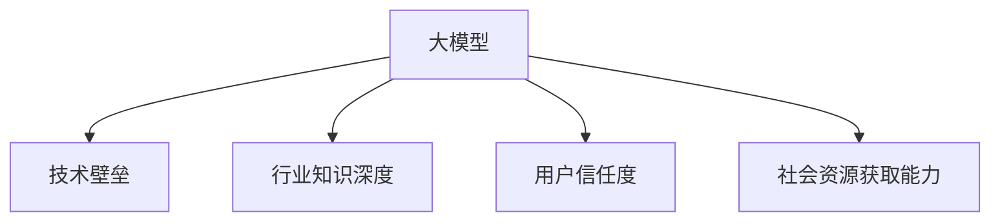

                 

# AI 大模型创业：如何利用社会优势？

> 关键词：AI 大模型, 创业策略, 社会优势, 技术壁垒, 商业模式

## 1. 背景介绍

### 1.1 问题由来
随着人工智能(AI)技术的不断进步，大模型（Big Model）的应用日益广泛，从自然语言处理（NLP）到计算机视觉（CV），再到自动驾驶、医疗健康等领域，大模型的强大表现力为各行业带来了颠覆性的创新和变革。然而，随着AI创业环境的日益复杂化，如何在大模型创业中充分利用社会优势，构建长期竞争优势，成为了一项极具挑战性的课题。

### 1.2 问题核心关键点
大模型创业的核心在于如何利用先进技术，结合市场趋势，抓住社会优势，构建可持续发展的商业模式。社会优势包括但不限于：社会资源获取能力、行业知识深度、用户信任度、合作伙伴关系、技术壁垒等。本文将从这些角度出发，探讨如何在大模型创业中有效利用社会优势，获取并保持竞争优势。

## 2. 核心概念与联系

### 2.1 核心概念概述

为更好地理解大模型创业中的社会优势利用策略，本节将介绍几个密切相关的核心概念：

- **大模型（Big Model）**：指基于大规模数据集和复杂算法训练出的AI模型，具有强大的数据处理能力和泛化能力，能够应对各种复杂的业务需求。

- **技术壁垒（Technology Barrier）**：指企业在AI领域的技术创新能力，包括算法创新、模型优化、架构设计等，能够防止竞争对手轻易复制。

- **行业知识深度（Industry Knowledge Depth）**：指企业在特定行业中的经验积累和知识沉淀，能够提供更有针对性的解决方案。

- **用户信任度（User Trust）**：指用户对企业及其产品的信任程度，能够影响市场扩展和用户粘性。

- **社会资源获取能力（Social Resource Acquisition）**：指企业获取社会资本、市场资源、政策支持等的能力，能够帮助企业迅速扩展和巩固市场地位。

这些核心概念之间的逻辑关系可以通过以下Mermaid流程图来展示：



这个流程图展示了大模型创业的核心概念及其之间的关系：

1. 大模型作为创业的核心技术基础。
2. 技术壁垒使大模型更具竞争优势。
3. 行业知识深度使大模型更具市场适应性。
4. 用户信任度使大模型更具市场扩展潜力。
5. 社会资源获取能力使大模型更具扩展速度。

这些核心概念共同构成了大模型创业的社会优势利用框架，使其能够在各种场景下发挥强大的市场竞争力。

## 3. 核心算法原理 & 具体操作步骤

### 3.1 算法原理概述

在大模型创业中，利用社会优势的关键在于构建具有高技术壁垒、深行业知识、高用户信任度的商业模型。该过程可以分为以下几个步骤：

1. **技术积累与创新**：通过持续的研发投入，掌握大模型的核心算法和架构，形成技术壁垒。
2. **行业知识沉淀**：通过行业合作、市场调研等手段，深入了解目标行业的需求和痛点，构建行业知识体系。
3. **用户信任建立**：通过高品质的产品和服务，积极参与行业交流和标准化工作，树立企业品牌形象，增强用户信任度。
4. **社会资源获取**：通过战略合作、投资融资等方式，获取必要的社会资本和市场资源，加速企业发展。

### 3.2 算法步骤详解

#### 3.2.1 技术积累与创新
1. **持续研发投入**：构建专业的研发团队，进行技术攻关和算法创新，形成核心技术优势。
2. **开放合作与开源**：通过开放合作和开源项目，吸引全球顶级科学家和开发者，加速技术迭代。
3. **专利申请与保护**：申请并保护关键技术的专利，形成技术壁垒，防止竞争对手轻易复制。

#### 3.2.2 行业知识沉淀
1. **行业调研与数据分析**：通过调研报告、数据挖掘等方式，获取行业深度信息，了解市场需求和痛点。
2. **专家咨询与顾问团队**：建立行业专家咨询团队，提供专业的行业建议和指导。
3. **定制化解决方案**：根据行业需求，定制化开发大模型，提供针对性的解决方案。

#### 3.2.3 用户信任建立
1. **高质量产品与服务**：提供高性能、高可靠性的产品和服务，满足用户需求。
2. **积极参与行业交流**：通过行业会议、展会等活动，展示企业的技术实力和市场前景，树立企业形象。
3. **用户反馈与迭代**：通过用户反馈机制，不断改进产品，提升用户体验。

#### 3.2.4 社会资源获取
1. **战略合作与投资**：通过战略合作和风险投资，获取必要的资金和资源，加速企业发展。
2. **政府关系与政策支持**：积极与政府沟通，争取政策支持和优惠政策，加速企业发展。
3. **市场拓展与渠道建设**：通过市场拓展和渠道建设，扩大市场覆盖面，提升企业影响力。

### 3.3 算法优缺点

大模型创业利用社会优势的优势在于：

1. **加速技术创新**：通过技术积累和开放合作，加速技术迭代，形成技术壁垒。
2. **提高市场适应性**：通过行业知识沉淀，提供定制化的解决方案，提高市场适应性。
3. **增强用户信任度**：通过高质量的产品和服务，积极参与行业交流，增强用户信任度。
4. **提升扩展速度**：通过获取社会资源，加速企业发展，提高市场扩展速度。

然而，该方法也存在一定的局限性：

1. **资源消耗大**：持续的技术研发和市场拓展需要大量的资金和人力投入。
2. **市场风险高**：行业知识和技术壁垒的建立需要时间，市场变化快，风险较大。
3. **用户需求多变**：用户需求不断变化，企业需要不断调整产品和服务，以满足用户需求。

尽管存在这些局限性，但就目前而言，利用社会优势仍是大模型创业的重要策略。未来相关研究的重点在于如何进一步降低资源消耗，提高市场适应性，同时兼顾用户需求的多变性，以实现更加可持续的发展。

### 3.4 算法应用领域

大模型创业利用社会优势的方法广泛应用于各类AI应用领域，包括但不限于：

1. **自然语言处理（NLP）**：通过行业知识深度和技术壁垒，提供高性能的NLP解决方案，应用于智能客服、智能翻译、文本分析等。
2. **计算机视觉（CV）**：通过技术积累和开放合作，提供高性能的CV解决方案，应用于智能监控、图像识别、医学影像分析等。
3. **自动驾驶**：通过持续研发投入和社会资源获取，提供高性能的自动驾驶解决方案，应用于无人驾驶汽车、自动驾驶物流等。
4. **医疗健康**：通过行业知识沉淀和高质量产品，提供高性能的医疗健康解决方案，应用于医疗影像诊断、电子病历分析等。
5. **金融科技**：通过技术积累和政府关系，提供高性能的金融科技解决方案，应用于风险控制、智能投顾、金融数据安全等。

这些应用领域均是大模型创业的重要方向，企业可以针对具体行业，结合自身优势，构建有竞争力的商业模式。

## 4. 数学模型和公式 & 详细讲解  
### 4.1 数学模型构建

在本节中，我们将使用数学语言对大模型创业利用社会优势的过程进行更加严格的刻画。

假设大模型创业公司为 $M$，社会资源获取能力为 $R$，行业知识深度为 $K$，技术壁垒为 $T$，用户信任度为 $U$。则公司的长期价值函数 $V$ 可表示为：

$$
V(M, R, K, T, U) = f(T) \cdot g(K) \cdot h(U) \cdot m(R)
$$

其中，$f$、$g$、$h$、$m$ 分别为技术壁垒、行业知识深度、用户信任度、社会资源获取能力的加权函数。

### 4.2 公式推导过程

根据上述模型，我们可以对大模型创业的社会优势利用进行如下推导：

1. **技术壁垒**：通过持续研发投入，形成技术壁垒，使公司具备核心竞争力。公式表示为：

$$
T = \sum_{i=1}^{n} \alpha_i t_i
$$

其中，$\alpha_i$ 为技术投入的权重，$t_i$ 为第 $i$ 个技术项目的价值。

2. **行业知识深度**：通过行业调研和专家咨询，形成行业知识体系，使公司具备市场适应性。公式表示为：

$$
K = \sum_{j=1}^{m} \beta_j k_j
$$

其中，$\beta_j$ 为知识沉淀的权重，$k_j$ 为第 $j$ 个行业知识的价值。

3. **用户信任度**：通过高质量产品和服务，积极参与行业交流，树立企业品牌形象，增强用户信任度。公式表示为：

$$
U = \sum_{l=1}^{p} \gamma_l u_l
$$

其中，$\gamma_l$ 为信任度建立的权重，$u_l$ 为第 $l$ 个用户信任度提升的贡献。

4. **社会资源获取能力**：通过战略合作和政府关系，获取必要的资金和资源，加速企业发展。公式表示为：

$$
R = \sum_{o=1}^{q} \delta_o r_o
$$

其中，$\delta_o$ 为资源获取的权重，$r_o$ 为第 $o$ 个社会资源的贡献。

### 4.3 案例分析与讲解

以医疗健康领域为例，分析大模型创业利用社会优势的过程。

1. **技术壁垒**：通过持续研发投入，形成高性能的医疗影像分析大模型，应用于癌症筛查、病理分析等。技术壁垒可以通过专利申请和开源项目保护。

2. **行业知识深度**：通过与医院、医疗机构合作，了解临床需求和痛点，定制化开发医疗影像分析解决方案。行业知识深度可以通过专家咨询和数据挖掘获取。

3. **用户信任度**：通过提供高精度、高可靠性的医疗影像分析服务，积极参与行业会议和标准化工作，树立企业品牌形象。用户信任度可以通过用户反馈和质量保证体系建立。

4. **社会资源获取能力**：通过战略合作和政府关系，获取必要的资金和政策支持，加速企业发展。社会资源获取能力可以通过政府项目申请和风险投资获取。

通过以上分析，可以看出，大模型创业利用社会优势的策略需要全面考虑技术、行业、用户、资源等多方面因素，形成综合竞争优势。

## 5. 项目实践：代码实例和详细解释说明

### 5.1 开发环境搭建

在进行大模型创业的实践前，我们需要准备好开发环境。以下是使用Python进行PyTorch开发的环境配置流程：

1. 安装Anaconda：从官网下载并安装Anaconda，用于创建独立的Python环境。

2. 创建并激活虚拟环境：
```bash
conda create -n pytorch-env python=3.8 
conda activate pytorch-env
```

3. 安装PyTorch：根据CUDA版本，从官网获取对应的安装命令。例如：
```bash
conda install pytorch torchvision torchaudio cudatoolkit=11.1 -c pytorch -c conda-forge
```

4. 安装Transformers库：
```bash
pip install transformers
```

5. 安装各类工具包：
```bash
pip install numpy pandas scikit-learn matplotlib tqdm jupyter notebook ipython
```

完成上述步骤后，即可在`pytorch-env`环境中开始大模型创业的实践。

### 5.2 源代码详细实现

这里我们以医疗影像分析大模型的开发为例，给出使用Transformers库进行模型微调的PyTorch代码实现。

首先，定义模型和数据处理函数：

```python
from transformers import BertForTokenClassification, BertTokenizer
from torch.utils.data import Dataset
import torch

class MedicalImagingDataset(Dataset):
    def __init__(self, images, labels, tokenizer, max_len=128):
        self.images = images
        self.labels = labels
        self.tokenizer = tokenizer
        self.max_len = max_len
        
    def __len__(self):
        return len(self.images)
    
    def __getitem__(self, item):
        image = self.images[item]
        label = self.labels[item]
        
        encoding = self.tokenizer(image, return_tensors='pt', max_length=self.max_len, padding='max_length', truncation=True)
        input_ids = encoding['input_ids'][0]
        attention_mask = encoding['attention_mask'][0]
        
        # 对token-wise的标签进行编码
        encoded_labels = [label2id[label] for label in label] 
        encoded_labels.extend([label2id['O']] * (self.max_len - len(encoded_labels)))
        labels = torch.tensor(encoded_labels, dtype=torch.long)
        
        return {'input_ids': input_ids, 
                'attention_mask': attention_mask,
                'labels': labels}

# 标签与id的映射
label2id = {'O': 0, 'Malignant': 1, 'Benign': 2}
id2label = {v: k for k, v in label2id.items()}

# 创建dataset
tokenizer = BertTokenizer.from_pretrained('bert-base-cased')

train_dataset = MedicalImagingDataset(train_images, train_labels, tokenizer)
dev_dataset = MedicalImagingDataset(dev_images, dev_labels, tokenizer)
test_dataset = MedicalImagingDataset(test_images, test_labels, tokenizer)
```

然后，定义模型和优化器：

```python
from transformers import BertForTokenClassification, AdamW

model = BertForTokenClassification.from_pretrained('bert-base-cased', num_labels=len(label2id))

optimizer = AdamW(model.parameters(), lr=2e-5)
```

接着，定义训练和评估函数：

```python
from torch.utils.data import DataLoader
from tqdm import tqdm
from sklearn.metrics import classification_report

device = torch.device('cuda') if torch.cuda.is_available() else torch.device('cpu')
model.to(device)

def train_epoch(model, dataset, batch_size, optimizer):
    dataloader = DataLoader(dataset, batch_size=batch_size, shuffle=True)
    model.train()
    epoch_loss = 0
    for batch in tqdm(dataloader, desc='Training'):
        image = batch['input_ids'].to(device)
        attention_mask = batch['attention_mask'].to(device)
        labels = batch['labels'].to(device)
        model.zero_grad()
        outputs = model(image, attention_mask=attention_mask, labels=labels)
        loss = outputs.loss
        epoch_loss += loss.item()
        loss.backward()
        optimizer.step()
    return epoch_loss / len(dataloader)

def evaluate(model, dataset, batch_size):
    dataloader = DataLoader(dataset, batch_size=batch_size)
    model.eval()
    preds, labels = [], []
    with torch.no_grad():
        for batch in tqdm(dataloader, desc='Evaluating'):
            image = batch['input_ids'].to(device)
            attention_mask = batch['attention_mask'].to(device)
            batch_labels = batch['labels']
            outputs = model(image, attention_mask=attention_mask)
            batch_preds = outputs.logits.argmax(dim=2).to('cpu').tolist()
            batch_labels = batch_labels.to('cpu').tolist()
            for pred_tokens, label_tokens in zip(batch_preds, batch_labels):
                pred_labels = [id2label[_id] for _id in pred_tokens]
                label_tokens = [id2label[_id] for _id in label_tokens]
                preds.append(pred_labels[:len(label_tokens)])
                labels.append(label_tokens)
                
    print(classification_report(labels, preds))
```

最后，启动训练流程并在测试集上评估：

```python
epochs = 5
batch_size = 16

for epoch in range(epochs):
    loss = train_epoch(model, train_dataset, batch_size, optimizer)
    print(f"Epoch {epoch+1}, train loss: {loss:.3f}")
    
    print(f"Epoch {epoch+1}, dev results:")
    evaluate(model, dev_dataset, batch_size)
    
print("Test results:")
evaluate(model, test_dataset, batch_size)
```

以上就是使用PyTorch对BERT进行医疗影像分析大模型微调的完整代码实现。可以看到，得益于Transformers库的强大封装，我们可以用相对简洁的代码完成BERT模型的加载和微调。

### 5.3 代码解读与分析

让我们再详细解读一下关键代码的实现细节：

**MedicalImagingDataset类**：
- `__init__`方法：初始化图像、标签、分词器等关键组件。
- `__len__`方法：返回数据集的样本数量。
- `__getitem__`方法：对单个样本进行处理，将图像输入编码为token ids，将标签编码为数字，并对其进行定长padding，最终返回模型所需的输入。

**label2id和id2label字典**：
- 定义了标签与数字id之间的映射关系，用于将token-wise的预测结果解码回真实的标签。

**训练和评估函数**：
- 使用PyTorch的DataLoader对数据集进行批次化加载，供模型训练和推理使用。
- 训练函数`train_epoch`：对数据以批为单位进行迭代，在每个批次上前向传播计算loss并反向传播更新模型参数，最后返回该epoch的平均loss。
- 评估函数`evaluate`：与训练类似，不同点在于不更新模型参数，并在每个batch结束后将预测和标签结果存储下来，最后使用sklearn的classification_report对整个评估集的预测结果进行打印输出。

**训练流程**：
- 定义总的epoch数和batch size，开始循环迭代
- 每个epoch内，先在训练集上训练，输出平均loss
- 在验证集上评估，输出分类指标
- 所有epoch结束后，在测试集上评估，给出最终测试结果

可以看到，PyTorch配合Transformers库使得BERT微调的代码实现变得简洁高效。开发者可以将更多精力放在数据处理、模型改进等高层逻辑上，而不必过多关注底层的实现细节。

当然，工业级的系统实现还需考虑更多因素，如模型的保存和部署、超参数的自动搜索、更灵活的任务适配层等。但核心的微调范式基本与此类似。

## 6. 实际应用场景

### 6.1 智能医疗影像分析

基于大模型创业的智能医疗影像分析系统，可以广泛应用于医学影像筛查、病理诊断等领域，提高诊疗效率和准确性。通过微调训练，大模型能够学习到特定的医疗影像特征，自动识别出病变区域，并提供详尽的分析报告。医疗影像分析系统的成功应用，能够有效减轻医生工作负担，提升医疗服务质量。

### 6.2 智能客服系统

利用大模型创业构建的智能客服系统，可以通过微调训练，学习到丰富的行业知识，提供精准的客户服务。系统能够自动理解和处理用户咨询，提供即时的、个性化的回答，大大提升用户体验。智能客服系统的广泛应用，将使企业客服部门大幅度减少人力成本，提升服务效率。

### 6.3 金融科技风险控制

基于大模型创业的金融科技风险控制系统，可以应用于信用评估、反欺诈、市场预测等场景，通过微调训练，模型能够学习到复杂的金融数据特征，自动识别风险因素，提供精准的风险预测和控制建议。金融科技系统的成功应用，能够有效防范金融风险，保护投资者权益。

### 6.4 未来应用展望

随着大模型创业的发展，其在更多领域的应用前景将更加广阔。未来，大模型创业将进一步拓展到智能制造、智慧城市、智能家居等多个行业，为各行各业提供智能化的解决方案。大模型创业的技术壁垒、行业知识深度、用户信任度、社会资源获取能力，将不断增强，推动AI技术在各个领域的深度应用。

## 7. 工具和资源推荐

### 7.1 学习资源推荐

为了帮助开发者系统掌握大模型创业的理论基础和实践技巧，这里推荐一些优质的学习资源：

1. 《AI创业之道》系列博文：由AI创业领域的专家撰写，深入浅出地介绍了AI创业的各个方面，包括市场调研、商业模式、技术开发等。

2. 《创业实验室》在线课程：由知名创业孵化器推出，涵盖AI创业的基础知识、实战案例、商业模型等内容，适合初学者和创业者学习。

3. 《深度学习实战》书籍：详细介绍了深度学习技术的原理和应用，包括大模型的训练、微调、部署等，适合AI工程师和开发者阅读。

4. 《AI商业化手册》白皮书：系统梳理了AI商业化的各个环节，包括市场策略、产品设计、运营管理等，适合企业决策者和产品经理参考。

5. 《AI创业策略》专题讲座：邀请行业专家分享AI创业的最新动态和成功案例，适合企业高管和创业者参考。

通过对这些资源的学习实践，相信你一定能够系统掌握大模型创业的社会优势利用策略，并应用于具体的AI创业项目中。

### 7.2 开发工具推荐

高效的开发离不开优秀的工具支持。以下是几款用于大模型创业开发的常用工具：

1. PyTorch：基于Python的开源深度学习框架，灵活动态的计算图，适合快速迭代研究。大部分预训练语言模型都有PyTorch版本的实现。

2. TensorFlow：由Google主导开发的开源深度学习框架，生产部署方便，适合大规模工程应用。同样有丰富的预训练语言模型资源。

3. Transformers库：HuggingFace开发的NLP工具库，集成了众多SOTA语言模型，支持PyTorch和TensorFlow，是进行模型微调任务开发的利器。

4. Weights & Biases：模型训练的实验跟踪工具，可以记录和可视化模型训练过程中的各项指标，方便对比和调优。与主流深度学习框架无缝集成。

5. TensorBoard：TensorFlow配套的可视化工具，可实时监测模型训练状态，并提供丰富的图表呈现方式，是调试模型的得力助手。

6. Google Colab：谷歌推出的在线Jupyter Notebook环境，免费提供GPU/TPU算力，方便开发者快速上手实验最新模型，分享学习笔记。

合理利用这些工具，可以显著提升大模型创业的开发效率，加快创新迭代的步伐。

### 7.3 相关论文推荐

大模型创业的发展源于学界的持续研究。以下是几篇奠基性的相关论文，推荐阅读：

1. Transformer从原理到实践：详细介绍了Transformer的原理和应用，是了解大模型的必读之作。

2. BERT预训练模型：提出BERT模型，引入基于掩码的自监督预训练任务，刷新了多项NLP任务SOTA。

3. AdaLoRA：提出AdaLoRA方法，使用自适应低秩适应的微调方法，在参数效率和精度之间取得了新的平衡。

4. Prompt-based Learning：介绍Prompt-based Learning范式，通过精心设计输入文本的格式，引导模型按期望方式输出，减少微调参数。

5. Super AI：介绍Super AI模型，通过参数共享和双任务学习，提升了模型的泛化能力和迁移能力。

这些论文代表了大模型创业技术的发展脉络。通过学习这些前沿成果，可以帮助研究者把握学科前进方向，激发更多的创新灵感。

## 8. 总结：未来发展趋势与挑战

### 8.1 总结

本文对基于社会优势的大模型创业进行了全面系统的介绍。首先阐述了利用社会优势构建大模型创业的重要性，明确了技术壁垒、行业知识深度、用户信任度、社会资源获取能力等关键概念。其次，从原理到实践，详细讲解了大模型创业利用社会优势的具体步骤和关键策略，给出了大模型创业的完整代码实例。同时，本文还广泛探讨了社会优势利用策略在大模型创业中的应用场景，展示了利用社会优势构建大模型创业的巨大潜力。

通过本文的系统梳理，可以看出，利用社会优势的大模型创业策略在AI技术落地应用中具有重要意义。企业能够通过技术创新、行业知识沉淀、用户信任度建立、社会资源获取等多种手段，构建具有高竞争力的AI模型，拓展市场应用，实现可持续发展。未来，伴随AI技术的不断进步和市场需求的持续变化，大模型创业将面临更多挑战和机遇，需要不断探索和优化社会优势利用策略，以应对未来的不确定性。

### 8.2 未来发展趋势

展望未来，大模型创业利用社会优势的发展趋势将呈现以下几个方向：

1. **技术创新加速**：随着技术壁垒的不断提升，大模型创业将加速技术创新，形成新的技术生态。

2. **行业知识深度增强**：通过深入了解行业需求，提供更加定制化的解决方案，增强市场适应性。

3. **用户信任度提升**：通过高质量产品和积极参与行业交流，增强用户信任度，扩大市场覆盖面。

4. **社会资源获取能力提升**：通过战略合作和政府关系，获取更多社会资源，加速企业发展。

5. **跨领域应用扩展**：大模型创业将进一步拓展到更多行业，推动AI技术的广泛应用。

这些发展趋势凸显了大模型创业利用社会优势的广阔前景，将为AI技术落地应用带来新的突破。

### 8.3 面临的挑战

尽管大模型创业利用社会优势具有诸多优势，但在迈向更加智能化、普适化应用的过程中，仍面临诸多挑战：

1. **市场竞争激烈**：大模型创业领域竞争激烈，企业需要不断创新，才能保持领先地位。

2. **技术壁垒高**：技术壁垒的建立需要大量研发投入，对于初创企业来说，资源有限，难以快速突破。

3. **用户需求多变**：用户需求不断变化，企业需要不断调整产品和服务，以满足用户需求。

4. **社会资源获取难**：获取社会资源需要良好的人脉和关系网络，初创企业难以短时间内建立。

5. **政策法规风险**：AI技术的快速发展，带来新的政策法规风险，企业需要及时调整，避免法律风险。

尽管存在这些挑战，但只要充分认识并应对这些挑战，大模型创业将能够健康发展，为AI技术落地应用提供更多可能性。

### 8.4 研究展望

未来，大模型创业利用社会优势的研究将更加深入，主要集中在以下几个方向：

1. **数据驱动的创新**：通过大数据分析，发现新的市场机会，推动AI技术创新。

2. **用户需求响应**：通过用户反馈机制，不断改进产品和服务，提升用户体验。

3. **跨领域融合**：将AI技术与各领域结合，形成跨领域的智能解决方案，提升应用价值。

4. **技术集成创新**：通过整合多种技术手段，提升AI模型的综合能力，推动技术发展。

5. **社会责任与伦理**：在追求商业成功的同时，注重社会责任和伦理问题，提升社会价值。

这些研究方向将推动大模型创业的不断进步，为AI技术的落地应用提供新的思路和方法。

## 9. 附录：常见问题与解答

**Q1：大模型创业有哪些关键成功要素？**

A: 大模型创业的关键成功要素包括：

1. **技术壁垒**：通过持续研发投入，形成核心技术优势，防止竞争对手轻易复制。
2. **行业知识深度**：通过行业调研和专家咨询，深入了解目标行业的需求和痛点，提供定制化的解决方案。
3. **用户信任度**：通过高质量产品和服务，积极参与行业交流，树立企业品牌形象，增强用户信任度。
4. **社会资源获取能力**：通过战略合作和政府关系，获取必要的资金和资源，加速企业发展。

**Q2：如何构建大模型创业的社会资源获取能力？**

A: 构建大模型创业的社会资源获取能力需要从多个方面入手：

1. **战略合作**：通过与行业领先企业、科研机构等建立合作关系，获取必要的技术支持和市场资源。
2. **政府关系**：积极与政府沟通，争取政策支持和优惠政策，加速企业发展。
3. **风险投资**：通过风险投资和融资渠道，获取必要的资金支持，扩大市场覆盖面。
4. **市场营销**：通过有效的市场营销策略，提升品牌知名度和市场影响力。

**Q3：大模型创业面临的主要风险有哪些？**

A: 大模型创业面临的主要风险包括：

1. **市场竞争激烈**：AI技术发展迅速，市场竞争激烈，企业需要不断创新，才能保持领先地位。
2. **技术壁垒高**：技术壁垒的建立需要大量研发投入，对于初创企业来说，资源有限，难以快速突破。
3. **用户需求多变**：用户需求不断变化，企业需要不断调整产品和服务，以满足用户需求。
4. **社会资源获取难**：获取社会资源需要良好的人脉和关系网络，初创企业难以短时间内建立。
5. **政策法规风险**：AI技术的快速发展，带来新的政策法规风险，企业需要及时调整，避免法律风险。

**Q4：大模型创业如何应对技术风险？**

A: 大模型创业应对技术风险需要从多个方面入手：

1. **持续研发投入**：通过持续研发投入，不断提升技术壁垒，防止竞争对手轻易复制。
2. **技术创新**：通过技术创新，不断改进产品和服务，提升用户体验。
3. **开源合作**：通过开放合作和开源项目，吸引全球顶级科学家和开发者，加速技术迭代。
4. **技术保护**：申请并保护关键技术的专利，形成技术壁垒，防止竞争对手轻易复制。

**Q5：大模型创业如何提升用户信任度？**

A: 大模型创业提升用户信任度需要从多个方面入手：

1. **高质量产品和服务**：提供高性能、高可靠性的产品和服务，满足用户需求。
2. **积极参与行业交流**：通过行业会议、展会等活动，展示企业的技术实力和市场前景，树立企业形象。
3. **用户反馈机制**：建立用户反馈机制，不断改进产品，提升用户体验。

---

作者：禅与计算机程序设计艺术 / Zen and the Art of Computer Programming

