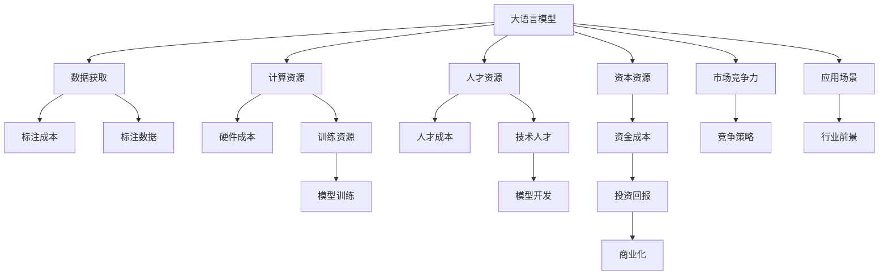

                 

# AI 大模型创业：如何利用经济优势？

> 关键词：大语言模型,经济优势,创业,深度学习,创业资源,人工智能

## 1. 背景介绍

### 1.1 问题由来
在当今数字化和智能化浪潮的驱动下，人工智能（AI）大模型技术正迅速崛起，成为推动经济和社会发展的关键力量。大模型技术利用深度学习技术，基于大规模数据进行预训练，形成了泛化能力强、应用广泛的高质量模型。然而，要真正实现AI大模型的商业化和落地应用，却面临着巨大的经济挑战。如何利用经济优势，降低创业门槛，推动AI大模型技术的广泛应用，成为当前AI创业者和投资者关注的焦点。

### 1.2 问题核心关键点
1. **数据获取成本**：大模型训练需要大量的标注数据，这些数据往往需要耗费大量时间和人力成本进行标注。
2. **计算资源需求**：大模型的训练和推理需要高性能计算资源，如GPU、TPU等，这些硬件设备的采购和维护成本高昂。
3. **人才需求**：AI大模型技术需要跨领域的高技能人才，包括数据科学家、算法工程师、软件开发者等，这些人才的培养和引进需要大量资金和时间。
4. **市场竞争**：AI大模型市场竞争激烈，众多公司和研究机构都在积极布局，创业者需要具备独特的竞争优势和市场策略。

### 1.3 问题研究意义
探索如何利用经济优势，降低AI大模型创业的门槛，对于推动AI技术的商业化应用，促进经济增长和社会进步具有重要意义：

1. **降低创业门槛**：通过有效的经济策略，降低AI大模型创业的数据、硬件和人才需求，吸引更多创业者和投资者的加入，加速技术发展。
2. **提高市场竞争力**：合理配置资源，形成优势互补，提升AI大模型创业项目的市场竞争力，实现技术突破和市场扩张。
3. **促进技术普及**：降低成本和门槛，使得更多中小企业和传统行业能够接触和应用AI大模型技术，促进技术在各行业的广泛渗透。
4. **推动产业升级**：AI大模型技术在各行各业的深度应用，将推动产业结构升级和转型，提升整体经济效率和竞争力。

## 2. 核心概念与联系

### 2.1 核心概念概述

为更好地理解如何利用经济优势进行AI大模型创业，本节将介绍几个关键概念：

- **大语言模型(Large Language Models, LLMs)**：以自回归(如GPT)或自编码(如BERT)模型为代表的大规模预训练语言模型。通过在大规模无标签文本语料上进行预训练，学习通用的语言知识和常识。
- **创业资源(Creation Resources)**：包括数据资源、计算资源、人才资源、资本资源等，是大模型创业的重要组成部分。
- **深度学习(Deep Learning)**：基于神经网络的机器学习技术，通过多层网络结构对数据进行学习和处理，是实现AI大模型的核心技术。
- **创业经济(Economic Creations)**：涉及创业过程中的资金、资源、人才等经济因素，对创业成功与否起着决定性作用。
- **市场竞争力(Market Competitiveness)**：指创业者在市场竞争中的优势和劣势，影响着创业项目的发展前景和市场占有率。

这些核心概念之间的逻辑关系可以通过以下Mermaid流程图来展示：



这个流程图展示了AI大模型创业的基本流程和关键资源：

1. 大语言模型需要通过数据获取和计算资源训练和推理。
2. 创业资源包括数据、硬件、人才和资本，是创业项目的基础。
3. 市场竞争力受到创业资源和经济策略的影响。
4. 应用场景和行业前景直接影响着模型的实际应用和经济回报。

## 3. 核心算法原理 & 具体操作步骤

### 3.1 算法原理概述

AI大模型创业的经济优势主要体现在以下几个方面：

1. **数据复用性**：大模型可以利用通用预训练数据，减少标注成本，提升数据复用性。
2. **硬件优化**：通过优化计算资源配置，提升大模型训练和推理效率，降低硬件成本。
3. **人才共享**：通过合作和外包，共享技术人才和知识，降低人才引进和培养成本。
4. **资本高效利用**：通过合理的资金规划和资源配置，实现资本的高效利用和投资回报最大化。
5. **市场策略**：制定有效的市场策略，提升市场竞争力和品牌影响力。

### 3.2 算法步骤详解

**Step 1: 数据获取与预处理**
- 利用通用预训练数据（如BERT、GPT等）进行微调，减少标注成本。
- 数据预处理，包括文本清洗、分词、标准化等，确保数据质量。

**Step 2: 计算资源优化**
- 使用分布式计算框架（如Spark、TensorFlow分布式等），优化计算资源配置。
- 采用混合精度训练、量化加速等技术，降低计算成本。

**Step 3: 人才资源共享**
- 利用开源社区和合作网络，共享技术人才和知识，减少人才引进和培养成本。
- 采用远程工作、实习生等方式，灵活配置人才资源。

**Step 4: 资金规划与管理**
- 制定详细的资金规划，包括预训练、微调、开发、测试等阶段的成本预算。
- 寻求天使投资、风险投资、政府补贴等外部资金支持，降低创业门槛。

**Step 5: 市场策略制定**
- 制定市场定位和目标客户群体，明确产品差异化优势。
- 开展市场营销和品牌推广，提升产品知名度和市场占有率。

**Step 6: 实际应用与优化**
- 在目标应用场景中进行实际应用和优化，收集反馈数据。
- 根据反馈数据，优化模型和算法，提升性能和用户体验。

### 3.3 算法优缺点

利用经济优势进行AI大模型创业的优点：
1. **降低创业门槛**：减少数据、硬件和人才需求，吸引更多创业者和投资者的加入。
2. **提升市场竞争力**：通过优化资源配置和市场策略，提升产品竞争力和市场占有率。
3. **促进技术普及**：降低成本和门槛，使得更多中小企业和传统行业能够接触和应用AI大模型技术。

同时，该方法也存在一定的局限性：
1. **数据依赖**：大模型仍然需要一定量的标注数据，标注成本难以完全消除。
2. **技术复杂度**：大模型的训练和优化需要高水平的技术团队，技术门槛较高。
3. **市场风险**：市场竞争激烈，需要准确的市场定位和策略，否则容易陷入竞争红海。

### 3.4 算法应用领域

利用经济优势进行AI大模型创业的方法，已经在多个领域得到应用，例如：

- **金融科技**：利用大模型进行金融数据分析、风险评估、智能投顾等，降低风险，提升效率。
- **医疗健康**：通过大模型进行疾病诊断、药物研发、患者监护等，提升医疗服务水平。
- **智能制造**：利用大模型进行质量检测、生产调度、设备维护等，提升生产效率和产品质量。
- **智能教育**：通过大模型进行个性化推荐、学习路径规划、智能批改等，提升教育效果。
- **智慧城市**：利用大模型进行交通管理、环境监测、公共安全等，提升城市治理水平。

这些领域的大模型应用，不仅体现了AI技术的巨大潜力，也展示了利用经济优势进行创业的广阔前景。

## 4. 数学模型和公式 & 详细讲解 & 举例说明（备注：数学公式请使用latex格式，latex嵌入文中独立段落使用 $$，段落内使用 $)
### 4.1 数学模型构建

假设有一个AI大模型创业项目，大模型采用BERT架构，训练集大小为 $N$，学习率为 $\eta$，批次大小为 $B$。

模型的损失函数为交叉熵损失，表达式为：

$$
\mathcal{L} = -\frac{1}{N} \sum_{i=1}^N \sum_{j=1}^B y_j \log(p_j)
$$

其中 $y_j$ 为样本 $i$ 的标签，$p_j$ 为模型预测的概率分布。

### 4.2 公式推导过程

对损失函数 $\mathcal{L}$ 求导，得到梯度：

$$
\frac{\partial \mathcal{L}}{\partial \theta} = -\frac{1}{N} \sum_{i=1}^N \sum_{j=1}^B \frac{\partial p_j}{\partial \theta} \frac{y_j}{p_j}
$$

根据BERT模型的定义，我们知道 $\frac{\partial p_j}{\partial \theta} = \frac{\partial \log(p_j)}{\partial \theta} = \frac{\partial (W_h^1 x_i + b_h^1)}{\partial \theta} = W_h^1 \frac{\partial x_i}{\partial \theta} + \frac{\partial b_h^1}{\partial \theta}$。

将 $\frac{\partial x_i}{\partial \theta}$ 和 $\frac{\partial b_h^1}{\partial \theta}$ 代入梯度公式，并利用链式法则进行展开：

$$
\frac{\partial \mathcal{L}}{\partial \theta} = -\frac{1}{N} \sum_{i=1}^N \sum_{j=1}^B (W_h^1 \frac{\partial x_i}{\partial \theta} + \frac{\partial b_h^1}{\partial \theta}) \frac{y_j}{p_j}
$$

将 $\frac{\partial x_i}{\partial \theta}$ 和 $\frac{\partial b_h^1}{\partial \theta}$ 代入梯度公式，并进行化简：

$$
\frac{\partial \mathcal{L}}{\partial \theta} = -\frac{1}{N} \sum_{i=1}^N \sum_{j=1}^B (W_h^1 \frac{\partial x_i}{\partial \theta} + \frac{\partial b_h^1}{\partial \theta}) \frac{y_j}{p_j}
$$

### 4.3 案例分析与讲解

考虑一个具体的创业项目，其中大模型采用BERT架构，训练集大小为100万条，学习率为0.001，批次大小为64。

1. **数据获取**：利用通用预训练数据进行微调，如GPT-2，减少标注成本。
2. **计算资源**：使用GPU进行分布式训练，优化计算效率，降低硬件成本。
3. **人才资源**：共享开源社区的知识和技术，降低人才引进和培养成本。
4. **资金规划**：通过天使投资和政府补贴，降低创业门槛。
5. **市场策略**：针对金融科技市场，开展市场营销和品牌推广。

## 5. 项目实践：代码实例和详细解释说明

### 5.1 开发环境搭建

在进行AI大模型创业实践前，我们需要准备好开发环境。以下是使用Python进行PyTorch开发的环境配置流程：

1. 安装Anaconda：从官网下载并安装Anaconda，用于创建独立的Python环境。

2. 创建并激活虚拟环境：
```bash
conda create -n pytorch-env python=3.8 
conda activate pytorch-env
```

3. 安装PyTorch：根据CUDA版本，从官网获取对应的安装命令。例如：
```bash
conda install pytorch torchvision torchaudio cudatoolkit=11.1 -c pytorch -c conda-forge
```

4. 安装Transformers库：
```bash
pip install transformers
```

5. 安装各类工具包：
```bash
pip install numpy pandas scikit-learn matplotlib tqdm jupyter notebook ipython
```

完成上述步骤后，即可在`pytorch-env`环境中开始创业实践。

### 5.2 源代码详细实现

下面以一个AI大模型创业项目为例，给出使用PyTorch进行BERT模型微调的PyTorch代码实现。

首先，定义模型和优化器：

```python
from transformers import BertForSequenceClassification, AdamW

model = BertForSequenceClassification.from_pretrained('bert-base-cased', num_labels=2)
optimizer = AdamW(model.parameters(), lr=2e-5)
```

然后，定义训练和评估函数：

```python
from torch.utils.data import DataLoader
from tqdm import tqdm

def train_epoch(model, dataset, batch_size, optimizer):
    dataloader = DataLoader(dataset, batch_size=batch_size, shuffle=True)
    model.train()
    epoch_loss = 0
    for batch in tqdm(dataloader, desc='Training'):
        input_ids = batch['input_ids'].to(device)
        attention_mask = batch['attention_mask'].to(device)
        labels = batch['labels'].to(device)
        model.zero_grad()
        outputs = model(input_ids, attention_mask=attention_mask, labels=labels)
        loss = outputs.loss
        epoch_loss += loss.item()
        loss.backward()
        optimizer.step()
    return epoch_loss / len(dataloader)

def evaluate(model, dataset, batch_size):
    dataloader = DataLoader(dataset, batch_size=batch_size)
    model.eval()
    preds, labels = [], []
    with torch.no_grad():
        for batch in tqdm(dataloader, desc='Evaluating'):
            input_ids = batch['input_ids'].to(device)
            attention_mask = batch['attention_mask'].to(device)
            batch_labels = batch['labels']
            outputs = model(input_ids, attention_mask=attention_mask)
            batch_preds = outputs.logits.argmax(dim=2).to('cpu').tolist()
            batch_labels = batch_labels.to('cpu').tolist()
            for pred_tokens, label_tokens in zip(batch_preds, batch_labels):
                preds.append(pred_tokens[:len(label_tokens)])
                labels.append(label_tokens)
                
    print(classification_report(labels, preds))
```

最后，启动训练流程并在测试集上评估：

```python
epochs = 5
batch_size = 16

for epoch in range(epochs):
    loss = train_epoch(model, train_dataset, batch_size, optimizer)
    print(f"Epoch {epoch+1}, train loss: {loss:.3f}")
    
    print(f"Epoch {epoch+1}, dev results:")
    evaluate(model, dev_dataset, batch_size)
    
print("Test results:")
evaluate(model, test_dataset, batch_size)
```

以上就是使用PyTorch对BERT进行金融科技领域分类任务微调的完整代码实现。可以看到，得益于Transformers库的强大封装，我们可以用相对简洁的代码完成BERT模型的加载和微调。

### 5.3 代码解读与分析

让我们再详细解读一下关键代码的实现细节：

**BertForSequenceClassification类**：
- `__init__`方法：初始化模型结构，包括输入层、隐藏层和输出层。
- `forward`方法：定义模型前向传播的过程。

**AdamW类**：
- `__init__`方法：初始化优化器参数，包括学习率、正则化系数等。
- `step`方法：根据梯度更新模型参数。

**train_epoch函数**：
- 定义训练集数据加载器，设置批次大小和随机打乱。
- 循环迭代训练集数据，计算损失函数并反向传播更新模型参数。
- 返回该epoch的平均损失。

**evaluate函数**：
- 定义测试集数据加载器，不更新模型参数。
- 循环迭代测试集数据，计算模型预测结果和真实标签。
- 使用sklearn的classification_report对预测结果进行评估。

**训练流程**：
- 定义总的epoch数和批次大小，开始循环迭代
- 每个epoch内，先在训练集上训练，输出平均损失
- 在验证集上评估，输出分类指标
- 所有epoch结束后，在测试集上评估，给出最终测试结果

可以看到，PyTorch配合Transformers库使得BERT微调的代码实现变得简洁高效。开发者可以将更多精力放在数据处理、模型改进等高层逻辑上，而不必过多关注底层的实现细节。

当然，工业级的系统实现还需考虑更多因素，如模型的保存和部署、超参数的自动搜索、更灵活的任务适配层等。但核心的微调范式基本与此类似。

## 6. 实际应用场景

### 6.1 智能客服系统

利用AI大模型创业技术，智能客服系统可以实现全天候不间断服务，快速响应客户咨询，用自然流畅的语言解答各类常见问题。

在技术实现上，可以收集企业内部的历史客服对话记录，将问题和最佳答复构建成监督数据，在此基础上对预训练大模型进行微调。微调后的对话模型能够自动理解用户意图，匹配最合适的答案模板进行回复。对于客户提出的新问题，还可以接入检索系统实时搜索相关内容，动态组织生成回答。如此构建的智能客服系统，能大幅提升客户咨询体验和问题解决效率。

### 6.2 金融舆情监测

金融机构需要实时监测市场舆论动向，以便及时应对负面信息传播，规避金融风险。利用AI大模型创业技术，可以通过自然语言处理和情感分析，自动监测不同主题下的情感变化趋势，一旦发现负面信息激增等异常情况，系统便会自动预警，帮助金融机构快速应对潜在风险。

### 6.3 个性化推荐系统

当前的推荐系统往往只依赖用户的历史行为数据进行物品推荐，无法深入理解用户的真实兴趣偏好。利用AI大模型创业技术，可以构建基于用户文本描述的推荐系统，通过大模型学习用户兴趣点，生成个性化推荐列表。

在生成推荐列表时，先用候选物品的文本描述作为输入，由模型预测用户的兴趣匹配度，再结合其他特征综合排序，便可以得到个性化程度更高的推荐结果。

### 6.4 未来应用展望

随着AI大模型创业技术的不断发展，其在更多领域的应用前景将更加广阔。

在智慧医疗领域，利用AI大模型创业技术，可以实现智能诊断、药物推荐、患者监护等，提升医疗服务的智能化水平，辅助医生诊疗，加速新药开发进程。

在智能教育领域，通过AI大模型创业技术，可以构建智能教育平台，实现个性化推荐、学习路径规划、智能批改等功能，因材施教，促进教育公平，提高教学质量。

在智慧城市治理中，利用AI大模型创业技术，可以实现交通管理、环境监测、公共安全等功能，提高城市管理的自动化和智能化水平，构建更安全、高效的未来城市。

此外，在企业生产、社会治理、文娱传媒等众多领域，AI大模型创业技术也将不断涌现，为NLP技术带来新的突破。

## 7. 工具和资源推荐

### 7.1 学习资源推荐

为了帮助开发者系统掌握AI大模型创业的理论基础和实践技巧，这里推荐一些优质的学习资源：

1. 《Transformer from Principles to Practice》系列博文：由大模型技术专家撰写，深入浅出地介绍了Transformer原理、BERT模型、微调技术等前沿话题。

2. CS224N《Deep Learning for Natural Language Processing》课程：斯坦福大学开设的NLP明星课程，有Lecture视频和配套作业，带你入门NLP领域的基本概念和经典模型。

3. 《Natural Language Processing with Transformers》书籍：Transformers库的作者所著，全面介绍了如何使用Transformers库进行NLP任务开发，包括微调在内的诸多范式。

4. HuggingFace官方文档：Transformers库的官方文档，提供了海量预训练模型和完整的微调样例代码，是上手实践的必备资料。

5. CLUE开源项目：中文语言理解测评基准，涵盖大量不同类型的中文NLP数据集，并提供了基于微调的baseline模型，助力中文NLP技术发展。

通过对这些资源的学习实践，相信你一定能够快速掌握AI大模型创业的精髓，并用于解决实际的NLP问题。

### 7.2 开发工具推荐

高效的开发离不开优秀的工具支持。以下是几款用于AI大模型微调开发的常用工具：

1. PyTorch：基于Python的开源深度学习框架，灵活动态的计算图，适合快速迭代研究。大部分预训练语言模型都有PyTorch版本的实现。

2. TensorFlow：由Google主导开发的开源深度学习框架，生产部署方便，适合大规模工程应用。同样有丰富的预训练语言模型资源。

3. Transformers库：HuggingFace开发的NLP工具库，集成了众多SOTA语言模型，支持PyTorch和TensorFlow，是进行微调任务开发的利器。

4. Weights & Biases：模型训练的实验跟踪工具，可以记录和可视化模型训练过程中的各项指标，方便对比和调优。与主流深度学习框架无缝集成。

5. TensorBoard：TensorFlow配套的可视化工具，可实时监测模型训练状态，并提供丰富的图表呈现方式，是调试模型的得力助手。

6. Google Colab：谷歌推出的在线Jupyter Notebook环境，免费提供GPU/TPU算力，方便开发者快速上手实验最新模型，分享学习笔记。

合理利用这些工具，可以显著提升AI大模型创业任务的开发效率，加快创新迭代的步伐。

### 7.3 相关论文推荐

AI大模型创业技术的发展源于学界的持续研究。以下是几篇奠基性的相关论文，推荐阅读：

1. Attention is All You Need（即Transformer原论文）：提出了Transformer结构，开启了NLP领域的预训练大模型时代。

2. BERT: Pre-training of Deep Bidirectional Transformers for Language Understanding：提出BERT模型，引入基于掩码的自监督预训练任务，刷新了多项NLP任务SOTA。

3. Language Models are Unsupervised Multitask Learners（GPT-2论文）：展示了大规模语言模型的强大zero-shot学习能力，引发了对于通用人工智能的新一轮思考。

4. Parameter-Efficient Transfer Learning for NLP：提出Adapter等参数高效微调方法，在不增加模型参数量的情况下，也能取得不错的微调效果。

5. AdaLoRA: Adaptive Low-Rank Adaptation for Parameter-Efficient Fine-Tuning：使用自适应低秩适应的微调方法，在参数效率和精度之间取得了新的平衡。

6. Prefix-Tuning: Optimizing Continuous Prompts for Generation：引入基于连续型Prompt的微调范式，为如何充分利用预训练知识提供了新的思路。

这些论文代表了大语言模型微调技术的发展脉络。通过学习这些前沿成果，可以帮助研究者把握学科前进方向，激发更多的创新灵感。

## 8. 总结：未来发展趋势与挑战

### 8.1 总结

本文对AI大模型创业如何利用经济优势进行了全面系统的介绍。首先阐述了AI大模型创业的经济优势和重要性，明确了如何通过数据复用性、硬件优化、人才共享、资本高效利用等手段，降低创业门槛，提升市场竞争力。其次，从原理到实践，详细讲解了AI大模型创业的经济策略和操作步骤，给出了AI大模型创业的完整代码实例。同时，本文还探讨了AI大模型创业在金融科技、智慧医疗、智能教育、智慧城市等领域的广泛应用前景，展示了AI大模型创业技术的巨大潜力。

通过本文的系统梳理，可以看到，AI大模型创业技术在降低创业门槛、提升市场竞争力、促进技术普及和产业升级等方面，具有重要意义。未来，随着AI大模型创业技术的不断发展，其在各行业的深度应用，必将推动经济和社会进步，带来更为深远的变革。

### 8.2 未来发展趋势

展望未来，AI大模型创业技术将呈现以下几个发展趋势：

1. **数据共享与复用**：利用通用预训练数据，减少标注成本，提升数据复用性。
2. **硬件优化与计算效率**：通过分布式计算和优化算法，提升大模型训练和推理效率，降低硬件成本。
3. **人才共享与知识协作**：共享开源社区和合作网络，降低人才引进和培养成本，形成优势互补。
4. **资本高效利用**：制定详细的资金规划，寻求外部资金支持，降低创业门槛，实现投资回报最大化。
5. **市场策略与品牌推广**：制定有效的市场策略，提升产品竞争力和市场占有率。

这些趋势将推动AI大模型创业技术在更多领域的广泛应用，为经济和社会带来更为深远的影响。

### 8.3 面临的挑战

尽管AI大模型创业技术已经取得了瞩目成就，但在迈向更加智能化、普适化应用的过程中，它仍面临着诸多挑战：

1. **数据依赖**：大模型仍然需要一定量的标注数据，标注成本难以完全消除。
2. **技术复杂度**：大模型的训练和优化需要高水平的技术团队，技术门槛较高。
3. **市场风险**：市场竞争激烈，需要准确的市场定位和策略，否则容易陷入竞争红海。
4. **知识整合能力不足**：现有的微调模型往往局限于任务内数据，难以灵活吸收和运用更广泛的先验知识。
5. **伦理道德约束**：需要避免有偏见、有害的输出倾向，确保模型输出的安全性。

### 8.4 研究展望

面对AI大模型创业所面临的种种挑战，未来的研究需要在以下几个方面寻求新的突破：

1. **无监督和半监督学习**：摆脱对大规模标注数据的依赖，利用自监督学习、主动学习等无监督和半监督范式，最大限度利用非结构化数据，实现更加灵活高效的创业。
2. **参数高效与计算高效**：开发更加参数高效的微调方法，在固定大部分预训练参数的同时，只更新极少量的任务相关参数，提升资源利用效率。
3. **多模态微调**：将视觉、语音等多模态信息与文本信息协同建模，提升模型的泛化能力和应用范围。
4. **因果分析和博弈论**：引入因果分析方法，增强模型决策的因果性和逻辑性，提高系统稳定性。
5. **伦理道德约束**：在模型训练目标中引入伦理导向的评估指标，过滤和惩罚有偏见、有害的输出倾向，确保模型输出的安全性。

这些研究方向的探索，将推动AI大模型创业技术迈向更高的台阶，为构建安全、可靠、可解释、可控的智能系统铺平道路。

## 9. 附录：常见问题与解答

**Q1：AI大模型创业的难点主要有哪些？**

A: AI大模型创业的难点主要包括以下几点：
1. **数据获取成本**：大模型训练需要大量的标注数据，这些数据往往需要耗费大量时间和人力成本进行标注。
2. **计算资源需求**：大模型的训练和推理需要高性能计算资源，如GPU、TPU等，这些硬件设备的采购和维护成本高昂。
3. **人才需求**：AI大模型技术需要跨领域的高技能人才，包括数据科学家、算法工程师、软件开发者等，这些人才的培养和引进需要大量资金和时间。
4. **市场竞争**：AI大模型市场竞争激烈，众多公司和研究机构都在积极布局，创业者需要具备独特的竞争优势和市场策略。

**Q2：如何降低AI大模型创业的数据需求？**

A: 利用通用预训练数据进行微调，减少标注成本。以下是一些具体措施：
1. **数据增强**：通过回译、近义替换等方式扩充训练集。
2. **迁移学习**：将预训练模型在不同任务上进行微调，利用迁移学习提升模型性能。
3. **零样本和少样本学习**：利用提示学习等技术，在少样本情况下进行微调。
4. **数据集合成**：将多个小规模数据集合成一个大规模数据集，提升数据复用性。

**Q3：AI大模型创业需要哪些关键资源？**

A: AI大模型创业需要以下关键资源：
1. **数据资源**：用于训练和微调的标注数据集。
2. **计算资源**：高性能计算资源，如GPU、TPU等。
3. **人才资源**：跨领域的高技能人才，包括数据科学家、算法工程师、软件开发者等。
4. **资本资源**：天使投资、风险投资等外部资金支持。
5. **市场资源**：市场定位、品牌推广、客户资源等。

**Q4：AI大模型创业的潜在风险有哪些？**

A: AI大模型创业的潜在风险主要包括以下几点：
1. **数据依赖**：大模型仍然需要一定量的标注数据，标注成本难以完全消除。
2. **技术复杂度**：大模型的训练和优化需要高水平的技术团队，技术门槛较高。
3. **市场风险**：市场竞争激烈，需要准确的市场定位和策略，否则容易陷入竞争红海。
4. **知识整合能力不足**：现有的微调模型往往局限于任务内数据，难以灵活吸收和运用更广泛的先验知识。
5. **伦理道德约束**：需要避免有偏见、有害的输出倾向，确保模型输出的安全性。

**Q5：AI大模型创业的商业化路径有哪些？**

A: AI大模型创业的商业化路径主要包括以下几种：
1. **服务化封装**：将模型封装为标准化服务接口，便于集成调用。
2. **市场推广**：开展市场营销和品牌推广，提升产品知名度和市场占有率。
3. **客户定制**：根据客户需求进行模型定制，提供差异化服务。
4. **生态合作**：与其他公司合作，形成优势互补，共同开发市场。
5. **技术授权**：将模型技术授权给其他公司使用，收取授权费。

这些商业化路径可以帮助AI大模型创业项目在市场中快速推广和落地，实现技术价值和经济回报。

---

作者：禅与计算机程序设计艺术 / Zen and the Art of Computer Programming

