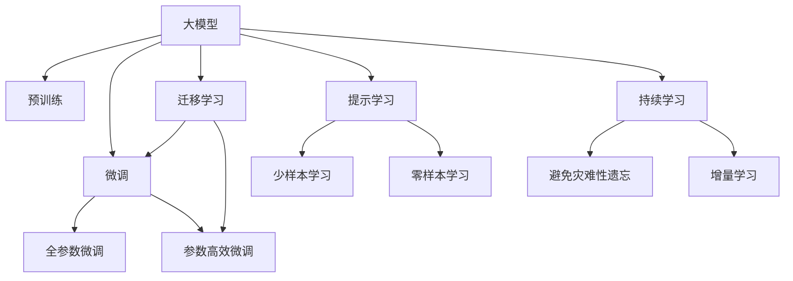

                 

# AI 大模型原理与应用：大模型是一个好的商业模式吗

## 1. 背景介绍

近年来，人工智能(AI)领域取得了举世瞩目的进展，尤其是基于深度学习的大模型，在自然语言处理、计算机视觉、语音识别等领域表现优异。随着模型的规模不断扩大，大模型的商业化应用也逐渐进入人们的视野。那么，大模型究竟是否是一个好的商业模式？本文将从大模型的原理、应用和未来展望出发，全面探讨这一问题。

## 2. 核心概念与联系

### 2.1 核心概念概述

大模型，尤其是基于深度学习的预训练大模型，在AI领域具有重要地位。这些模型通过大规模无标签数据进行预训练，学习通用的语言、视觉或语音知识，能够在特定任务上进行微调以获得更好的性能。主要的大模型有BERT、GPT、ViT等。

大模型的核心概念包括：

- 预训练（Pre-training）：在大规模无标签数据上进行自监督学习，学习通用的知识表示。
- 微调（Fine-tuning）：在预训练模型的基础上，通过少量有标签数据进行有监督学习，适配特定任务。
- 迁移学习（Transfer learning）：将预训练模型在特定任务上的知识进行迁移，减少从头训练的成本。
- 参数高效微调（Parameter-efficient fine-tuning）：在微调过程中只更新部分模型参数，减少计算资源消耗。
- 提示学习（Prompt learning）：通过精心设计的输入模板，引导模型在无需微调的情况下进行推理或生成。

这些概念之间存在密切联系，共同构成了大模型应用的基础。

### 2.2 核心概念原理和架构的 Mermaid 流程图



## 3. 核心算法原理 & 具体操作步骤

### 3.1 算法原理概述

大模型的商业化应用主要基于其强大的泛化能力和任务适配能力。通过预训练和微调，大模型能够在各种NLP、CV、语音等领域任务上表现优异。

### 3.2 算法步骤详解

#### 3.2.1 预训练阶段

1. **数据准备**：收集大规模无标签数据，如语言、图像、音频等，构成训练集。
2. **模型选择**：选择合适的大模型，如BERT、GPT、ViT等，作为初始化参数。
3. **训练**：在预训练数据上使用自监督任务（如掩码语言模型、自回归模型）进行训练，学习通用的知识表示。

#### 3.2.2 微调阶段

1. **任务适配**：根据具体任务类型，设计合适的输出层和损失函数，如分类任务使用交叉熵损失，生成任务使用负对数似然损失。
2. **模型加载**：加载预训练模型，通常只需要加载顶层。
3. **微调训练**：使用任务数据集进行微调，设定合适的学习率、批量大小和迭代次数，使用梯度下降等优化算法更新模型参数。
4. **模型评估**：在验证集上评估微调后的模型性能，调整参数直至最优。

### 3.3 算法优缺点

#### 优点

- **泛化能力强**：大模型通过预训练学习到丰富的通用知识，可以适应多种任务。
- **效率高**：微调过程中，通过迁移学习利用预训练知识，减少从头训练的时间和计算资源。
- **可扩展性好**：大模型参数量庞大，可以轻松扩展到更大规模的商业应用。

#### 缺点

- **数据依赖性高**：微调效果依赖于任务数据的数量和质量，高质量数据的获取成本较高。
- **过拟合风险**：微调模型容易过拟合训练集，泛化性能有待提升。
- **推理开销大**：大模型参数量庞大，推理过程中需要大量计算资源。

### 3.4 算法应用领域

大模型在多个领域中展示了其强大能力，包括：

- **自然语言处理**：如问答系统、文本分类、情感分析、机器翻译等。
- **计算机视觉**：如图像分类、目标检测、图像生成等。
- **语音识别**：如语音转文本、语音合成等。
- **推荐系统**：如电商商品推荐、新闻内容推荐等。

## 4. 数学模型和公式 & 详细讲解

### 4.1 数学模型构建

假设有一个大模型 $M_\theta$，其中 $\theta$ 表示模型参数。预训练阶段使用自监督任务 $P$ 进行训练，微调阶段使用任务数据集 $D$ 进行有监督学习，最小化损失函数 $L$：

$$
L = \frac{1}{N} \sum_{i=1}^N \ell(M_\theta(x_i), y_i)
$$

其中 $\ell$ 为损失函数，如交叉熵损失。

### 4.2 公式推导过程

以二分类任务为例，假设模型输出为 $\hat{y} = M_\theta(x)$，真实标签为 $y \in \{0, 1\}$。则二分类交叉熵损失函数为：

$$
\ell(M_\theta(x), y) = -y\log\hat{y} - (1-y)\log(1-\hat{y})
$$

将损失函数扩展到整个数据集，得：

$$
L = -\frac{1}{N} \sum_{i=1}^N [y_i\log\hat{y_i} + (1-y_i)\log(1-\hat{y_i})]
$$

通过反向传播计算梯度，使用梯度下降等优化算法更新模型参数。

### 4.3 案例分析与讲解

以BERT为例，其预训练过程主要通过掩码语言模型进行训练：

$$
\max_{\theta} \mathbb{E}_{(x, \{m_i\})} [-\log\frac{M_\theta(x)}{1-M_\theta(x)}]
$$

其中 $m_i$ 是掩码位置，$x$ 是输入文本。微调过程则针对特定任务，如情感分析，通过分类任务进行有监督学习。

## 5. 项目实践：代码实例和详细解释说明

### 5.1 开发环境搭建

1. **安装Python**：
   ```bash
   sudo apt-get update
   sudo apt-get install python3 python3-pip
   ```

2. **安装PyTorch和Transformers**：
   ```bash
   pip install torch transformers
   ```

3. **创建虚拟环境**：
   ```bash
   python3 -m venv myenv
   source myenv/bin/activate
   ```

### 5.2 源代码详细实现

以下是一个简单的代码示例，用于微调BERT模型进行情感分析：

```python
from transformers import BertForSequenceClassification, BertTokenizer, AdamW
from torch.utils.data import DataLoader, Dataset

class CustomDataset(Dataset):
    def __init__(self, data, tokenizer):
        self.data = data
        self.tokenizer = tokenizer

    def __len__(self):
        return len(self.data)

    def __getitem__(self, idx):
        text, label = self.data[idx]
        encoding = self.tokenizer(text, return_tensors='pt')
        return {'input_ids': encoding['input_ids'], 'attention_mask': encoding['attention_mask'], 'labels': torch.tensor([label])}

train_data = [
    ("I love this movie", 1),
    ("This movie is terrible", 0),
    ("The acting was amazing", 1),
    ("The plot was confusing", 0)
]

train_dataset = CustomDataset(train_data, tokenizer)

model = BertForSequenceClassification.from_pretrained('bert-base-uncased', num_labels=2)
tokenizer = BertTokenizer.from_pretrained('bert-base-uncased')

optimizer = AdamW(model.parameters(), lr=2e-5)

model.train()
for epoch in range(10):
    for batch in DataLoader(train_dataset, batch_size=2):
        input_ids = batch['input_ids']
        attention_mask = batch['attention_mask']
        labels = batch['labels']
        outputs = model(input_ids, attention_mask=attention_mask, labels=labels)
        loss = outputs.loss
        loss.backward()
        optimizer.step()
        optimizer.zero_grad()
    print(f"Epoch {epoch+1}, Loss: {loss.item()}")
```

### 5.3 代码解读与分析

在上述代码中，我们使用了`BertForSequenceClassification`和`BertTokenizer`，分别用于模型加载和分词。通过`DataLoader`对数据进行批次处理，并在训练过程中使用`AdamW`优化器更新模型参数。

## 6. 实际应用场景

### 6.1 自然语言处理

大模型在NLP领域的应用非常广泛，包括：

- **文本分类**：如新闻分类、情感分析等。
- **机器翻译**：如英中翻译、法中翻译等。
- **问答系统**：如智能客服、智能助手等。
- **摘要生成**：如新闻摘要、文献摘要等。

### 6.2 计算机视觉

大模型在CV领域也有广泛应用，如：

- **图像分类**：如猫狗分类、车辆分类等。
- **目标检测**：如行人检测、车辆检测等。
- **图像生成**：如GAN生成图像、风格迁移等。

### 6.3 语音识别

大模型在语音识别领域也有重要应用，如：

- **语音转文本**：如自动转录、语音搜索等。
- **语音合成**：如语音播报、语音助手等。

### 6.4 未来应用展望

未来，大模型的应用将更加广泛，以下领域值得关注：

- **医疗健康**：如疾病预测、药物研发等。
- **金融服务**：如风险评估、财务预测等。
- **教育培训**：如个性化推荐、智能辅导等。
- **智慧城市**：如交通管理、环境监测等。

## 7. 工具和资源推荐

### 7.1 学习资源推荐

1. **《深度学习》by Ian Goodfellow**：全面介绍深度学习理论和算法。
2. **《TensorFlow实战Google深度学习框架》by Moritz Getz**：详细讲解TensorFlow的使用方法和应用实例。
3. **《PyTorch深度学习及应用实战》by 君迈**：系统介绍PyTorch的原理和实践技巧。
4. **Coursera《深度学习专项课程》by Andrew Ng**：由斯坦福大学教授Andrew Ng讲授，涵盖深度学习的基础和进阶内容。
5. **Kaggle**：提供大量数据集和竞赛，适合实践和竞赛。

### 7.2 开发工具推荐

1. **Jupyter Notebook**：简单易用的交互式开发环境，支持多种编程语言。
2. **TensorBoard**：可视化工具，实时监测模型训练状态。
3. **Weights & Biases**：实验管理工具，记录和跟踪模型训练过程。
4. **Hugging Face**：NLP工具库，提供预训练模型和微调代码。
5. **Google Colab**：免费在线Jupyter Notebook环境，方便实验和分享。

### 7.3 相关论文推荐

1. **Attention is All You Need**：Transformer的奠基性论文，提出自注意力机制。
2. **BERT: Pre-training of Deep Bidirectional Transformers for Language Understanding**：BERT模型的开创性论文，引入掩码语言模型。
3. **GPT-3: Language Models are Unsupervised Multitask Learners**：GPT-3模型，展示零样本学习的能力。
4. **AdaLoRA: Adaptive Low-Rank Adaptation for Parameter-Efficient Fine-Tuning**：参数高效微调的论文，提出自适应低秩适应的微调方法。
5. **AdaLoRA: Adaptive Low-Rank Adaptation for Parameter-Efficient Fine-Tuning**：参数高效微调的论文，提出自适应低秩适应的微调方法。

## 8. 总结：未来发展趋势与挑战

### 8.1 研究成果总结

大模型通过预训练和微调，在多个领域展示了其强大的能力。然而，大模型的商业化应用仍面临诸多挑战，如数据依赖性高、过拟合风险、推理开销大等。

### 8.2 未来发展趋势

1. **模型规模不断增大**：随着算力和数据的提升，大模型的规模将进一步扩大。
2. **微调方法更加多样化**：未来将出现更多参数高效和计算高效的微调方法。
3. **持续学习成为常态**：模型需要不断学习新知识以保持性能。
4. **少样本和零样本学习**：利用大模型的语言理解能力，通过提示学习实现少样本和零样本学习。
5. **多模态融合**：融合视觉、语音等多模态信息，提升模型性能。

### 8.3 面临的挑战

1. **数据依赖性高**：高质量标注数据的获取成本较高。
2. **过拟合风险**：微调模型容易过拟合训练集。
3. **推理开销大**：大模型参数量庞大，推理过程中需要大量计算资源。
4. **可解释性不足**：微调模型的决策过程缺乏可解释性。
5. **安全性有待保障**：模型可能学习到有害信息，导致误导性输出。

### 8.4 研究展望

1. **无监督和半监督微调**：探索无监督和半监督微调方法，减少对标注数据的依赖。
2. **参数高效和计算高效微调**：开发参数高效和计算高效的微调方法。
3. **融合因果分析和博弈论工具**：增强模型的稳定性和鲁棒性。
4. **引入更多先验知识**：结合符号化的先验知识，提高模型的性能。
5. **纳入伦理道德约束**：确保模型输出的安全性。

## 9. 附录：常见问题与解答

**Q1: 大模型是否适用于所有NLP任务？**

A: 大模型在大多数NLP任务上都能取得不错的效果，但对于某些特定领域的任务，如医学、法律等，需要进一步在特定领域语料上进行预训练和微调。

**Q2: 如何选择合适的学习率？**

A: 微调的学习率通常比预训练小1-2个数量级。可以使用warmup策略，在开始阶段使用较小的学习率，再逐渐过渡到预设值。

**Q3: 如何缓解微调过程中的过拟合问题？**

A: 使用数据增强、正则化、对抗训练、参数高效微调等策略缓解过拟合。

**Q4: 微调模型在落地部署时需要注意哪些问题？**

A: 模型裁剪、量化加速、服务化封装、弹性伸缩、监控告警、安全防护等。

---

作者：禅与计算机程序设计艺术 / Zen and the Art of Computer Programming

