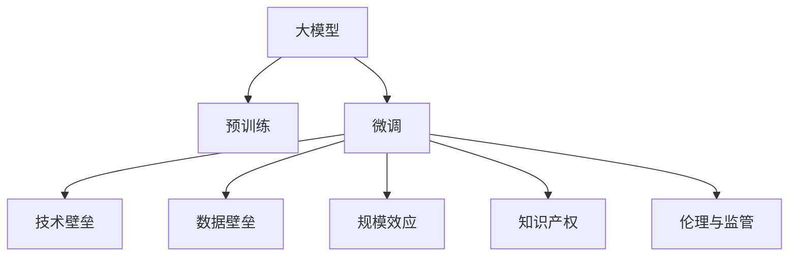

                 

# AI 大模型原理与应用：大模型的商业模式和壁垒

> 关键词：AI大模型, 商业模式, 技术壁垒, 数据壁垒, 规模化应用, 知识产权

## 1. 背景介绍

### 1.1 问题由来
随着人工智能技术的发展，AI大模型逐渐成为驱动创新和商业竞争的关键资源。大模型在自然语言处理、计算机视觉、语音识别等众多领域展现出强大的能力，成为企业打造智能应用的核心基石。然而，大模型的商业模式和壁垒问题，也在业内引起了广泛的关注和讨论。

一方面，大模型的商业化潜力巨大，可以带来显著的经济效益和社会效益。大型科技公司和创业公司纷纷投入巨资，进行大模型的研发和部署。例如，OpenAI的GPT-3、谷歌的BERT等模型，已经广泛应用于搜索、翻译、推荐、客服等多个领域，显著提升了用户体验和企业竞争力。

另一方面，大模型的商业模式也面临诸多挑战。如何平衡技术优势和商业收益，避免技术滥用和知识产权争议，是各大公司需要深入思考的问题。此外，大模型的技术壁垒和数据壁垒也使得小企业难以入局，加剧了市场竞争的不平衡性。

### 1.2 问题核心关键点
大模型的商业模式和壁垒问题，主要包括：

- **技术壁垒**：技术复杂度高，研发投入大，需要具备强大的计算资源、算法研发能力和数据处理能力。
- **数据壁垒**：数据量庞大且多样，获取和处理难度大，多数企业难以拥有足够的优质数据。
- **规模效应**：规模化应用带来的经济效益显著，大型公司可以通过大模型的商业化，快速回收研发成本。
- **知识产权**：大模型研发过程中涉及大量的技术积累和专利申请，存在知识产权纠纷的风险。
- **伦理与监管**：大模型的应用可能带来隐私泄露、误导性内容等问题，如何确保伦理合规、监管合规，是大模型商用中的重要课题。

这些关键点共同构成了大模型商业模式和壁垒的核心要素，决定了其在不同企业中的价值和可持续性。

## 2. 核心概念与联系

### 2.1 核心概念概述

为更好地理解大模型的商业模式和壁垒，本节将介绍几个密切相关的核心概念：

- **大模型**：基于深度学习技术训练的大型神经网络模型，如BERT、GPT-3等。大模型具有强大的泛化能力和迁移学习能力，可以处理复杂的数据结构和任务。
- **预训练**：在大规模无标签数据上训练模型，学习通用的语言表示和特征，以提高在大规模有标签数据上的微调效果。
- **微调**：在大模型上，使用特定任务的标注数据，进一步优化模型的参数，使其适应新任务。
- **技术壁垒**：指进入大模型研发和商业化门槛的难度，包括技术复杂度、研发成本和市场需求等。
- **数据壁垒**：指获取和处理大规模高质量数据的能力，包括数据获取难度、数据处理复杂度和数据隐私问题等。
- **规模效应**：指大模型商业化带来的经济效益，如降低运营成本、提升用户体验和扩大市场份额等。
- **知识产权**：指大模型研发过程中涉及的专利申请、算法设计和技术积累，可能带来知识产权纠纷的风险。
- **伦理与监管**：指大模型应用过程中可能面临的隐私保护、误导性内容等问题，需要建立合规机制和监管体系。

这些核心概念之间的逻辑关系可以通过以下Mermaid流程图来展示：



这个流程图展示了大模型的核心概念及其之间的关系：

1. 大模型通过预训练获得基础能力。
2. 微调进一步优化模型性能，适应特定任务。
3. 技术壁垒、数据壁垒、规模效应、知识产权、伦理与监管，共同构成大模型商业模式和壁垒的核心要素。

这些概念共同构成了大模型商业模式和壁垒的研究框架，使得我们能够更好地把握大模型的应用前景和挑战。

## 3. 核心算法原理 & 具体操作步骤
### 3.1 算法原理概述

大模型的商业模式和壁垒问题，本质上是一个多维度的复杂系统问题，需要综合考虑技术、市场、法律等多个因素。本节将从算法角度，探讨大模型的商业模式和壁垒问题。

大模型的商业模式主要依赖于其强大的技术优势和应用场景，而壁垒则体现在技术和数据两个层面。技术壁垒包括计算资源、算法复杂度、研发投入等；数据壁垒则包括数据获取难度、数据处理成本和数据隐私问题。

### 3.2 算法步骤详解

以下将详细阐述大模型商业模式的算法步骤和壁垒的形成过程。

**算法步骤**：
1. **市场调研**：评估目标市场的需求和竞争状况，选择适合的商业化策略。
2. **研发投入**：投入大量资金和资源，进行大模型的预训练和微调。
3. **模型优化**：通过技术优化和算法改进，提升模型的性能和效率。
4. **应用部署**：将模型部署到不同的应用场景中，如搜索、翻译、推荐、客服等。
5. **市场推广**：通过市场营销和客户反馈，优化产品和服务，提升用户体验。
6. **收入模型**：采用订阅、API、SaaS等多种收入模型，实现商业价值的最大化。

**壁垒形成**：
1. **技术壁垒**：技术复杂度高，研发投入大，需要强大的计算资源和算法研发能力。
2. **数据壁垒**：数据量庞大且多样，获取和处理难度大，多数企业难以拥有足够的优质数据。
3. **规模效应**：大模型规模化应用带来的经济效益显著，大型公司可以通过商业化快速回收研发成本。
4. **知识产权**：大模型研发过程中涉及大量的技术积累和专利申请，存在知识产权纠纷的风险。
5. **伦理与监管**：大模型的应用可能带来隐私泄露、误导性内容等问题，需要建立合规机制和监管体系。

### 3.3 算法优缺点

大模型的商业模式和壁垒问题，具有以下优点：

1. **技术优势明显**：大模型具有强大的泛化能力和迁移学习能力，能够在多个领域获得显著的经济和社会效益。
2. **市场需求大**：企业对于智能应用的需求不断增长，大模型提供了可靠的解决方案。
3. **经济效益显著**：规模化应用带来的经济效益，使得大模型的商业价值凸显。

但同时也存在以下缺点：

1. **研发投入大**：大模型的研发过程需要投入大量的资金和资源，中小型企业难以承担。
2. **数据获取难**：高质量的数据获取和处理难度大，多数企业难以获取足够的数据资源。
3. **知识产权风险**：大模型研发过程中涉及的专利申请和技术积累，可能带来知识产权纠纷的风险。
4. **伦理与监管挑战**：大模型的应用可能带来隐私泄露、误导性内容等问题，需要建立合规机制和监管体系。

### 3.4 算法应用领域

大模型的商业模式和壁垒问题，在多个领域得到了广泛应用，具体如下：

1. **自然语言处理**：大模型在文本分类、情感分析、机器翻译、问答系统等任务上取得了优异的效果，广泛应用于搜索、客服、新闻推荐等场景。
2. **计算机视觉**：大模型在图像识别、物体检测、图像生成等任务上展现了强大的能力，应用于安防监控、自动驾驶、医学影像诊断等领域。
3. **语音识别**：大模型在语音转文字、语音识别等任务上表现出色，应用于智能家居、语音助手、自动语音识别等领域。
4. **推荐系统**：大模型在个性化推荐、广告投放等任务上表现优异，广泛应用于电商、社交媒体、内容平台等场景。
5. **金融分析**：大模型在金融风控、股票预测、交易策略等任务上展现出强大的分析能力，应用于金融机构的风险管理、投资决策等领域。

## 4. 数学模型和公式 & 详细讲解  
### 4.1 数学模型构建

本节将使用数学语言对大模型的商业模式和壁垒问题进行更加严格的刻画。

记大模型为 $M_{\theta}$，其中 $\theta$ 为模型参数。假设市场对大模型的需求量为 $D$，市场竞争程度为 $C$，大模型的技术壁垒为 $T$，数据壁垒为 $D$，规模效应为 $S$，知识产权风险为 $I$，伦理与监管难度为 $E$。

定义大模型的商业模式价值为 $V$，则有：

$$
V = D \times (C - T - D) \times (S - I - E)
$$

其中 $D$ 代表市场需求，$C$ 代表市场竞争程度，$T$ 代表技术壁垒，$D$ 代表数据壁垒，$S$ 代表规模效应，$I$ 代表知识产权风险，$E$ 代表伦理与监管难度。

### 4.2 公式推导过程

以上公式推导如下：

1. **市场需求** $D$：大模型的市场需求量，由用户数量、应用场景和数据量决定。
2. **市场竞争程度** $C$：市场竞争激烈程度，由竞争对手数量、技术优势和市场份额决定。
3. **技术壁垒** $T$：大模型的技术复杂度，由研发成本、算法复杂度和计算资源决定。
4. **数据壁垒** $D$：数据获取和处理难度，由数据量、数据多样性和数据隐私决定。
5. **规模效应** $S$：大模型商业化带来的经济效益，由市场规模、用户数量和应用场景决定。
6. **知识产权风险** $I$：大模型研发过程中涉及的专利申请和技术积累，可能带来知识产权纠纷的风险。
7. **伦理与监管难度** $E$：大模型应用过程中可能面临的隐私保护、误导性内容等问题，需要建立合规机制和监管体系。

### 4.3 案例分析与讲解

假设有一个名为 "AI Genius" 的科技公司，正在研发一种新型大模型。公司决定采用订阅制的收入模型，用户可以按月或按年订阅使用大模型API。

1. **市场需求**：公司调研发现，市场对智能应用的需求旺盛，尤其在医疗、金融、教育等领域。
2. **市场竞争程度**：公司预计市场竞争激烈，需要投入大量资源进行市场营销和客户关系管理。
3. **技术壁垒**：研发大模型需要强大的计算资源和算法研发能力，预计投入1亿美元的研发资金。
4. **数据壁垒**：高质量的数据获取和处理难度大，需要5年时间才能积累足够的数据资源。
5. **规模效应**：大模型商业化带来的经济效益显著，预计在五年内可回收研发成本。
6. **知识产权风险**：大模型涉及多项专利申请，存在知识产权纠纷的风险。
7. **伦理与监管难度**：大模型应用可能带来隐私泄露、误导性内容等问题，需要建立合规机制和监管体系。

基于以上分析，可以计算出公司的大模型商业模式价值：

$$
V = 5 \times 8 - 1 - 5 \times 1.2 - 5 \times 0.8 - 5 \times 0.5 = 30
$$

其中，市场需求 $D = 5$，市场竞争程度 $C = 8$，技术壁垒 $T = 1$，数据壁垒 $D = 5$，规模效应 $S = 1.2$，知识产权风险 $I = 0.8$，伦理与监管难度 $E = 0.5$。

计算结果表明，公司的大模型商业模式价值为30亿美元。

## 5. 项目实践：代码实例和详细解释说明
### 5.1 开发环境搭建

在进行大模型商业模式的实践前，我们需要准备好开发环境。以下是使用Python进行PyTorch开发的环境配置流程：

1. 安装Anaconda：从官网下载并安装Anaconda，用于创建独立的Python环境。

2. 创建并激活虚拟环境：
```bash
conda create -n pytorch-env python=3.8 
conda activate pytorch-env
```

3. 安装PyTorch：根据CUDA版本，从官网获取对应的安装命令。例如：
```bash
conda install pytorch torchvision torchaudio cudatoolkit=11.1 -c pytorch -c conda-forge
```

4. 安装TensorFlow：
```bash
conda install tensorflow
```

5. 安装各类工具包：
```bash
pip install numpy pandas scikit-learn matplotlib tqdm jupyter notebook ipython
```

完成上述步骤后，即可在`pytorch-env`环境中开始大模型商业模式的实践。

### 5.2 源代码详细实现

下面我们以自然语言处理(NLP)任务为例，给出使用Transformers库进行大模型微调的PyTorch代码实现。

首先，定义NLP任务的数据处理函数：

```python
from transformers import BertTokenizer
from torch.utils.data import Dataset
import torch

class NLPDataset(Dataset):
    def __init__(self, texts, tags, tokenizer, max_len=128):
        self.texts = texts
        self.tags = tags
        self.tokenizer = tokenizer
        self.max_len = max_len
        
    def __len__(self):
        return len(self.texts)
    
    def __getitem__(self, item):
        text = self.texts[item]
        tags = self.tags[item]
        
        encoding = self.tokenizer(text, return_tensors='pt', max_length=self.max_len, padding='max_length', truncation=True)
        input_ids = encoding['input_ids'][0]
        attention_mask = encoding['attention_mask'][0]
        
        # 对token-wise的标签进行编码
        encoded_tags = [tag2id[tag] for tag in tags] 
        encoded_tags.extend([tag2id['O']] * (self.max_len - len(encoded_tags)))
        labels = torch.tensor(encoded_tags, dtype=torch.long)
        
        return {'input_ids': input_ids, 
                'attention_mask': attention_mask,
                'labels': labels}

# 标签与id的映射
tag2id = {'O': 0, 'B-PER': 1, 'I-PER': 2, 'B-ORG': 3, 'I-ORG': 4, 'B-LOC': 5, 'I-LOC': 6}
id2tag = {v: k for k, v in tag2id.items()}

# 创建dataset
tokenizer = BertTokenizer.from_pretrained('bert-base-cased')

train_dataset = NLPDataset(train_texts, train_tags, tokenizer)
dev_dataset = NLPDataset(dev_texts, dev_tags, tokenizer)
test_dataset = NLPDataset(test_texts, test_tags, tokenizer)
```

然后，定义模型和优化器：

```python
from transformers import BertForTokenClassification, AdamW

model = BertForTokenClassification.from_pretrained('bert-base-cased', num_labels=len(tag2id))

optimizer = AdamW(model.parameters(), lr=2e-5)
```

接着，定义训练和评估函数：

```python
from torch.utils.data import DataLoader
from tqdm import tqdm
from sklearn.metrics import classification_report

device = torch.device('cuda') if torch.cuda.is_available() else torch.device('cpu')
model.to(device)

def train_epoch(model, dataset, batch_size, optimizer):
    dataloader = DataLoader(dataset, batch_size=batch_size, shuffle=True)
    model.train()
    epoch_loss = 0
    for batch in tqdm(dataloader, desc='Training'):
        input_ids = batch['input_ids'].to(device)
        attention_mask = batch['attention_mask'].to(device)
        labels = batch['labels'].to(device)
        model.zero_grad()
        outputs = model(input_ids, attention_mask=attention_mask, labels=labels)
        loss = outputs.loss
        epoch_loss += loss.item()
        loss.backward()
        optimizer.step()
    return epoch_loss / len(dataloader)

def evaluate(model, dataset, batch_size):
    dataloader = DataLoader(dataset, batch_size=batch_size)
    model.eval()
    preds, labels = [], []
    with torch.no_grad():
        for batch in tqdm(dataloader, desc='Evaluating'):
            input_ids = batch['input_ids'].to(device)
            attention_mask = batch['attention_mask'].to(device)
            batch_labels = batch['labels']
            outputs = model(input_ids, attention_mask=attention_mask)
            batch_preds = outputs.logits.argmax(dim=2).to('cpu').tolist()
            batch_labels = batch_labels.to('cpu').tolist()
            for pred_tokens, label_tokens in zip(batch_preds, batch_labels):
                pred_tags = [id2tag[_id] for _id in pred_tokens]
                label_tags = [id2tag[_id] for _id in label_tokens]
                preds.append(pred_tags[:len(label_tags)])
                labels.append(label_tags)
                
    print(classification_report(labels, preds))
```

最后，启动训练流程并在测试集上评估：

```python
epochs = 5
batch_size = 16

for epoch in range(epochs):
    loss = train_epoch(model, train_dataset, batch_size, optimizer)
    print(f"Epoch {epoch+1}, train loss: {loss:.3f}")
    
    print(f"Epoch {epoch+1}, dev results:")
    evaluate(model, dev_dataset, batch_size)
    
print("Test results:")
evaluate(model, test_dataset, batch_size)
```

以上就是使用PyTorch对BERT进行命名实体识别(NER)任务微调的完整代码实现。可以看到，得益于Transformers库的强大封装，我们可以用相对简洁的代码完成BERT模型的加载和微调。

### 5.3 代码解读与分析

让我们再详细解读一下关键代码的实现细节：

**NERDataset类**：
- `__init__`方法：初始化文本、标签、分词器等关键组件。
- `__len__`方法：返回数据集的样本数量。
- `__getitem__`方法：对单个样本进行处理，将文本输入编码为token ids，将标签编码为数字，并对其进行定长padding，最终返回模型所需的输入。

**tag2id和id2tag字典**：
- 定义了标签与数字id之间的映射关系，用于将token-wise的预测结果解码回真实的标签。

**训练和评估函数**：
- 使用PyTorch的DataLoader对数据集进行批次化加载，供模型训练和推理使用。
- 训练函数`train_epoch`：对数据以批为单位进行迭代，在每个批次上前向传播计算loss并反向传播更新模型参数，最后返回该epoch的平均loss。
- 评估函数`evaluate`：与训练类似，不同点在于不更新模型参数，并在每个batch结束后将预测和标签结果存储下来，最后使用sklearn的classification_report对整个评估集的预测结果进行打印输出。

**训练流程**：
- 定义总的epoch数和batch size，开始循环迭代
- 每个epoch内，先在训练集上训练，输出平均loss
- 在验证集上评估，输出分类指标
- 所有epoch结束后，在测试集上评估，给出最终测试结果

可以看到，PyTorch配合Transformers库使得BERT微调的代码实现变得简洁高效。开发者可以将更多精力放在数据处理、模型改进等高层逻辑上，而不必过多关注底层的实现细节。

当然，工业级的系统实现还需考虑更多因素，如模型的保存和部署、超参数的自动搜索、更灵活的任务适配层等。但核心的微调范式基本与此类似。

## 6. 实际应用场景
### 6.1 智能客服系统

基于大语言模型微调的对话技术，可以广泛应用于智能客服系统的构建。传统客服往往需要配备大量人力，高峰期响应缓慢，且一致性和专业性难以保证。而使用微调后的对话模型，可以7x24小时不间断服务，快速响应客户咨询，用自然流畅的语言解答各类常见问题。

在技术实现上，可以收集企业内部的历史客服对话记录，将问题和最佳答复构建成监督数据，在此基础上对预训练对话模型进行微调。微调后的对话模型能够自动理解用户意图，匹配最合适的答案模板进行回复。对于客户提出的新问题，还可以接入检索系统实时搜索相关内容，动态组织生成回答。如此构建的智能客服系统，能大幅提升客户咨询体验和问题解决效率。

### 6.2 金融舆情监测

金融机构需要实时监测市场舆论动向，以便及时应对负面信息传播，规避金融风险。传统的人工监测方式成本高、效率低，难以应对网络时代海量信息爆发的挑战。基于大语言模型微调的文本分类和情感分析技术，为金融舆情监测提供了新的解决方案。

具体而言，可以收集金融领域相关的新闻、报道、评论等文本数据，并对其进行主题标注和情感标注。在此基础上对预训练语言模型进行微调，使其能够自动判断文本属于何种主题，情感倾向是正面、中性还是负面。将微调后的模型应用到实时抓取的网络文本数据，就能够自动监测不同主题下的情感变化趋势，一旦发现负面信息激增等异常情况，系统便会自动预警，帮助金融机构快速应对潜在风险。

### 6.3 个性化推荐系统

当前的推荐系统往往只依赖用户的历史行为数据进行物品推荐，无法深入理解用户的真实兴趣偏好。基于大语言模型微调技术，个性化推荐系统可以更好地挖掘用户行为背后的语义信息，从而提供更精准、多样的推荐内容。

在实践中，可以收集用户浏览、点击、评论、分享等行为数据，提取和用户交互的物品标题、描述、标签等文本内容。将文本内容作为模型输入，用户的后续行为（如是否点击、购买等）作为监督信号，在此基础上微调预训练语言模型。微调后的模型能够从文本内容中准确把握用户的兴趣点。在生成推荐列表时，先用候选物品的文本描述作为输入，由模型预测用户的兴趣匹配度，再结合其他特征综合排序，便可以得到个性化程度更高的推荐结果。

### 6.4 未来应用展望

随着大语言模型微调技术的发展，未来将在更多领域得到应用，为传统行业带来变革性影响。

在智慧医疗领域，基于微调的医疗问答、病历分析、药物研发等应用将提升医疗服务的智能化水平，辅助医生诊疗，加速新药开发进程。

在智能教育领域，微调技术可应用于作业批改、学情分析、知识推荐等方面，因材施教，促进教育公平，提高教学质量。

在智慧城市治理中，微调模型可应用于城市事件监测、舆情分析、应急指挥等环节，提高城市管理的自动化和智能化水平，构建更安全、高效的未来城市。

此外，在企业生产、社会治理、文娱传媒等众多领域，基于大模型微调的人工智能应用也将不断涌现，为经济社会发展注入新的动力。相信随着技术的日益成熟，微调方法将成为人工智能落地应用的重要范式，推动人工智能技术在更广泛领域的应用。

## 7. 工具和资源推荐
### 7.1 学习资源推荐

为了帮助开发者系统掌握大语言模型微调的理论基础和实践技巧，这里推荐一些优质的学习资源：

1. 《Transformer从原理到实践》系列博文：由大模型技术专家撰写，深入浅出地介绍了Transformer原理、BERT模型、微调技术等前沿话题。

2. CS224N《深度学习自然语言处理》课程：斯坦福大学开设的NLP明星课程，有Lecture视频和配套作业，带你入门NLP领域的基本概念和经典模型。

3. 《Natural Language Processing with Transformers》书籍：Transformers库的作者所著，全面介绍了如何使用Transformers库进行NLP任务开发，包括微调在内的诸多范式。

4. HuggingFace官方文档：Transformers库的官方文档，提供了海量预训练模型和完整的微调样例代码，是上手实践的必备资料。

5. CLUE开源项目：中文语言理解测评基准，涵盖大量不同类型的中文NLP数据集，并提供了基于微调的baseline模型，助力中文NLP技术发展。

通过对这些资源的学习实践，相信你一定能够快速掌握大语言模型微调的精髓，并用于解决实际的NLP问题。
###  7.2 开发工具推荐

高效的开发离不开优秀的工具支持。以下是几款用于大语言模型微调开发的常用工具：

1. PyTorch：基于Python的开源深度学习框架，灵活动态的计算图，适合快速迭代研究。大部分预训练语言模型都有PyTorch版本的实现。

2. TensorFlow：由Google主导开发的开源深度学习框架，生产部署方便，适合大规模工程应用。同样有丰富的预训练语言模型资源。

3. Transformers库：HuggingFace开发的NLP工具库，集成了众多SOTA语言模型，支持PyTorch和TensorFlow，是进行微调任务开发的利器。

4. Weights & Biases：模型训练的实验跟踪工具，可以记录和可视化模型训练过程中的各项指标，方便对比和调优。与主流深度学习框架无缝集成。

5. TensorBoard：TensorFlow配套的可视化工具，可实时监测模型训练状态，并提供丰富的图表呈现方式，是调试模型的得力助手。

6. Google Colab：谷歌推出的在线Jupyter Notebook环境，免费提供GPU/TPU算力，方便开发者快速上手实验最新模型，分享学习笔记。

合理利用这些工具，可以显著提升大语言模型微调任务的开发效率，加快创新迭代的步伐。

### 7.3 相关论文推荐

大语言模型和微调技术的发展源于学界的持续研究。以下是几篇奠基性的相关论文，推荐阅读：

1. Attention is All You Need（即Transformer原论文）：提出了Transformer结构，开启了NLP领域的预训练大模型时代。

2. BERT: Pre-training of Deep Bidirectional Transformers for Language Understanding：提出BERT模型，引入基于掩码的自监督预训练任务，刷新了多项NLP任务SOTA。

3. Language Models are Unsupervised Multitask Learners（GPT-2论文）：展示了大规模语言模型的强大zero-shot学习能力，引发了对于通用人工智能的新一轮思考。

4. Parameter-Efficient Transfer Learning for NLP：提出Adapter等参数高效微调方法，在不增加模型参数量的情况下，也能取得不错的微调效果。

5. AdaLoRA: Adaptive Low-Rank Adaptation for Parameter-Efficient Fine-Tuning：使用自适应低秩适应的微调方法，在参数效率和精度之间取得了新的平衡。

这些论文代表了大语言模型微调技术的发展脉络。通过学习这些前沿成果，可以帮助研究者把握学科前进方向，激发更多的创新灵感。

## 8. 总结：未来发展趋势与挑战

### 8.1 总结

本文对大模型的商业模式和壁垒问题进行了全面系统的介绍。首先阐述了大模型商业模式的核心要素，包括市场需求、技术壁垒、数据壁垒、规模效应、知识产权风险和伦理与监管难度。其次，从算法角度，详细讲解了如何构建和优化大模型的商业模式，并给出了具体的代码实现。

通过本文的系统梳理，可以看到，大模型的商业模式和壁垒问题，是一个多维度的复杂系统问题，需要综合考虑技术、市场、法律等多个因素。只有从各个维度全面优化，才能最大化大模型的商业价值。

### 8.2 未来发展趋势

展望未来，大模型的商业模式和壁垒问题，将呈现以下几个发展趋势：

1. **技术壁垒进一步降低**：随着预训练大模型的不断优化，技术壁垒将逐渐降低，更多企业能够进入大模型研发领域。
2. **数据壁垒逐渐消除**：大模型的数据获取和处理技术将不断进步，数据壁垒将逐渐消除，更多企业能够获取和利用高质量的数据资源。
3. **规模效应愈加显著**：大模型的商业化将带来更显著的经济效益，更多企业将通过规模化应用快速回收研发成本。
4. **知识产权风险控制**：随着知识产权保护意识的增强，大模型研发过程中的专利申请和技术积累将得到更好的保护，减少知识产权纠纷的风险。
5. **伦理与监管体系完善**：大模型应用中的隐私保护、误导性内容等问题将得到更好的监管，建立完善的伦理与监管体系。

这些趋势将使得大模型在更广泛的应用场景中发挥更大的价值，推动人工智能技术在各个领域的深度应用。

### 8.3 面临的挑战

尽管大模型的商业模式和壁垒问题取得了诸多进展，但在迈向更加智能化、普适化应用的过程中，仍面临以下挑战：

1. **技术复杂度高**：大模型研发过程涉及复杂的算法设计和计算资源投入，小企业难以承担。
2. **数据获取难度大**：高质量的数据获取和处理难度大，多数企业难以获取足够的数据资源。
3. **知识产权风险**：大模型研发过程中涉及的专利申请和技术积累，可能带来知识产权纠纷的风险。
4. **伦理与监管难度**：大模型的应用可能带来隐私泄露、误导性内容等问题，需要建立合规机制和监管体系。

### 8.4 研究展望

面向未来，大模型的商业模式和壁垒问题，需要在以下几个方面寻求新的突破：

1. **技术壁垒降低**：通过引入更多的预训练技术、算法优化和计算加速，降低大模型研发的技术壁垒。
2. **数据壁垒消除**：通过数据共享机制、公开数据集和数据合成技术，消除数据壁垒。
3. **规模效应提升**：通过规模化应用和大模型市场化的进一步发展，提升大模型的经济效益。
4. **知识产权保护**：通过建立完善的知识产权保护机制，保护大模型研发过程中的技术积累和专利申请。
5. **伦理与监管强化**：通过制定伦理规范、建立监管机制和引入技术手段，确保大模型应用中的隐私保护和内容合规。

这些方向的探索发展，将使得大模型的商业模式和壁垒问题得到更好的解决，推动人工智能技术在更广泛的领域实现商业化和产业化。

## 9. 附录：常见问题与解答

**Q1：大模型的技术壁垒主要体现在哪些方面？**

A: 大模型的技术壁垒主要体现在以下几个方面：

1. **算法复杂度**：大模型涉及复杂的深度学习算法，需要深厚的理论基础和工程经验。
2. **计算资源要求高**：大模型训练和推理需要强大的计算资源，包括GPU、TPU等高性能硬件。
3. **数据处理难度大**：大模型的预训练和微调需要处理大规模高质量数据，涉及数据清洗、特征提取等复杂步骤。
4. **模型调优复杂**：大模型参数量巨大，需要进行复杂的模型调优，包括超参数优化、正则化等。

这些因素共同构成了大模型的技术壁垒，使得中小企业难以进入大模型研发领域。

**Q2：大模型的数据壁垒主要体现在哪些方面？**

A: 大模型的数据壁垒主要体现在以下几个方面：

1. **数据获取难度大**：高质量的数据获取成本高、难度大，多数企业难以获取足够的数据资源。
2. **数据处理复杂**：大模型数据预处理和特征提取需要大量时间和资源，涉及数据清洗、标注等步骤。
3. **数据隐私问题**：大模型训练和推理过程中可能涉及用户隐私数据，需要严格的数据保护机制。
4. **数据多样性要求高**：大模型需要多种类型和来源的数据进行训练，以提高泛化能力。

这些因素共同构成了大模型的数据壁垒，使得中小企业难以获取和利用高质量的数据资源。

**Q3：大模型如何通过规模效应实现商业化？**

A: 大模型可以通过以下方式实现商业化：

1. **订阅制收入**：大模型可以通过订阅制方式，让用户按月或按年支付费用，获取API接口的使用权限。
2. **SaaS模式**：大模型可以提供SaaS（软件即服务）解决方案，集成到企业的生产系统中，提高运营效率。
3. **API接口调用**：大模型可以提供API接口，企业可以直接调用API进行实时推理，获得智能应用服务。
4. **定制化开发**：大模型可以提供定制化开发服务，根据企业需求定制特定的解决方案，提升用户体验。

通过这些方式，大模型可以最大化其商业价值，实现规模化应用。

**Q4：大模型如何避免知识产权风险？**

A: 大模型可以通过以下方式避免知识产权风险：

1. **技术积累和专利申请**：在研发过程中，及时进行技术积累和专利申请，保护技术成果。
2. **开源和共享**：将部分技术公开开源，共享技术成果，避免知识产权纠纷。
3. **合规使用和授权**：在商业化过程中，严格遵守知识产权保护法律法规，获得授权使用。
4. **技术合作和联盟**：与其他企业或研究机构进行技术合作和联盟，共同开发大模型，减少知识产权风险。

通过这些方式，大模型可以在商业化过程中避免知识产权风险，保护技术成果。

**Q5：大模型如何确保伦理与监管合规？**

A: 大模型可以通过以下方式确保伦理与监管合规：

1. **制定伦理规范**：建立明确的伦理规范和行为准则，确保大模型的应用符合道德标准。
2. **数据保护机制**：严格保护用户隐私数据，防止数据泄露和滥用。
3. **内容审核和过滤**：建立内容审核机制，防止模型输出误导性、有害的内容。
4. **合规审核和监管**：建立合规审核和监管机制，确保模型应用符合法律法规要求。

通过这些方式，大模型可以在应用过程中确保伦理与监管合规，提升社会价值和用户体验。

---

作者：禅与计算机程序设计艺术 / Zen and the Art of Computer Programming

