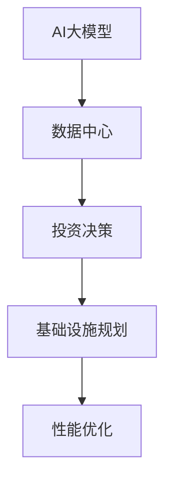

                 

# AI 大模型应用数据中心建设：数据中心投资与建设

> 关键词：AI大模型, 数据中心建设, 投资决策, 基础设施规划, 性能优化

## 1. 背景介绍

### 1.1 问题由来

随着人工智能(AI)技术的发展，AI大模型（如GPT-3、BERT等）在自然语言处理(NLP)、计算机视觉(CV)、语音识别(SR)等领域取得了显著进展。这些模型依赖于大规模的高质量数据和强大的计算能力进行训练和推理，数据中心作为AI大模型应用的物理承载体，其建设和运营的重要性日益凸显。

### 1.2 问题核心关键点

数据中心在AI大模型应用中扮演着至关重要的角色，涉及数据存储、计算资源、网络带宽、冷却系统等多个方面。然而，如何合理规划、高效建设、科学运营数据中心，以满足AI大模型应用的需求，是当前技术发展与产业应用中的一大挑战。本文将从数据中心投资与建设的角度，探讨如何通过科学的决策与规划，构建高效、经济、可持续发展的AI大模型应用基础设施。

## 2. 核心概念与联系

### 2.1 核心概念概述

为更好地理解AI大模型应用数据中心建设，本节将介绍几个密切相关的核心概念：

- **AI大模型**：指使用深度学习技术训练的大型神经网络模型，如BERT、GPT系列等，用于解决复杂的多模态智能任务，如图像识别、自然语言处理、语音识别等。

- **数据中心**：作为计算和存储资源的物理设施，数据中心由服务器、网络设备、存储系统、电力和冷却系统等构成，是支持AI大模型训练、推理和应用的核心基础设施。

- **投资决策**：在AI大模型应用场景下，数据中心的投资决策涉及建设地点、规模、设备选型、能源和冷却方案等多个维度，需全面评估经济性、效率性、可持续性等因素。

- **基础设施规划**：数据中心的建设前需进行详细规划，包括服务器布局、网络架构、冷却系统设计、电力供应等，以确保数据中心高效、可靠地运行。

- **性能优化**：数据中心建设和运营过程中需不断优化系统性能，包括提高服务器计算效率、网络传输速率、存储访问速度等，以支持AI大模型的高性能运行。

这些核心概念之间的逻辑关系可以通过以下Mermaid流程图来展示：



这个流程图展示了大模型应用数据中心的各个关键环节，强调了在建设过程中投资决策、基础设施规划和性能优化之间的密切联系。

## 3. 核心算法原理 & 具体操作步骤

### 3.1 算法原理概述

AI大模型应用数据中心建设的核心在于确保基础设施能够高效、稳定地支持模型的训练和推理。数据中心的建设涉及多方面的决策和规划，包括选址、硬件设备选型、能源供应和冷却系统设计等。本节将从这些关键方面详细探讨其算法原理。

### 3.2 算法步骤详解

**3.2.1 选址决策**

数据中心的选址直接影响其运营成本和效率。选址应考虑以下几点：

- **地理位置**：尽量选择靠近主要用户群体和通信网络设施的位置，以减少延迟和带宽成本。
- **能源成本**：考虑当地的能源供应情况，优先选择可再生能源比例高的地区。
- **自然灾害风险**：避开地震、洪水、火灾等高风险区域。

**3.2.2 硬件设备选型**

选择合适的硬件设备是确保数据中心高效运行的关键。硬件设备选型应考虑以下几点：

- **服务器选型**：根据AI大模型的计算需求，选择高性能的服务器，如配备多核CPU、GPU、FPGA等。
- **存储系统**：选择高速、大容量的存储系统，如SSD、NVMe等，以支持AI模型的数据密集型计算需求。
- **网络设备**：选择高带宽、低延迟的网络设备，如高速交换机、光模块等，以支持数据中心的高流量需求。

**3.2.3 能源和冷却系统设计**

数据中心的能源和冷却系统设计是保证其高效、可靠运行的重要因素。设计时应考虑以下几点：

- **能源供应**：优先选择可再生能源，如太阳能、风能等，降低运营成本。
- **冷却系统**：根据数据中心的规模和设备密度，设计高效的冷却系统，如水冷、风冷等，确保服务器稳定运行。

### 3.3 算法优缺点

**优点**：

- **高效性**：合理的选址和设备选型可确保数据中心高效运行，支持AI大模型的高性能计算需求。
- **经济性**：通过优化能源和冷却系统设计，降低运营成本，提高投资回报率。
- **可持续性**：选择可再生能源和高效冷却系统，提升数据中心的环保和可持续发展能力。

**缺点**：

- **复杂性**：选址、硬件选型、能源和冷却系统设计涉及多个因素，决策过程复杂。
- **风险性**：错误的决策可能导致投资回报率下降，甚至影响数据中心的安全和稳定运行。

### 3.4 算法应用领域

AI大模型应用数据中心的建设不仅适用于大型企业和科研机构，还广泛应用于云服务提供商、初创企业、政府机构等各类用户，助力其在AI大模型应用中实现业务创新和数字化转型。

## 4. 数学模型和公式 & 详细讲解 & 举例说明

### 4.1 数学模型构建

在本节中，我们将构建一个简单的数学模型，用于评估数据中心投资决策的收益和成本。假设数据中心的建设成本为$C$，年运营成本为$O$，年收益为$R$，则预期净现值(Net Present Value, NPV)为：

$$
NPV = R - C - O
$$

其中，$C$包括硬件设备、建筑、电力和冷却系统的成本，$O$包括服务器电力消耗、冷却系统维护、人力资源等成本，$R$为AI大模型应用产生的收益，如数据处理服务费用、广告收入等。

### 4.2 公式推导过程

为了计算NPV，我们需要确定$C$、$O$和$R$的具体数值。例如，$C$可以通过设备单价和数量计算得到：

$$
C = \sum_{i=1}^{n} p_i q_i
$$

其中，$p_i$为第$i$个设备的单价，$q_i$为设备数量。$O$和$R$的具体计算方法需根据实际应用场景进行调整。

### 4.3 案例分析与讲解

假设某公司在数据中心建设上投资了5000万美元，预计年运营成本为500万美元，通过AI大模型应用提供的服务每年带来3000万美元的收入。假设折现率为10%，则该数据中心的NPV计算如下：

$$
NPV = 3000 - 5000 - 500 \times \frac{1 - (1+10\%)^{-10}}{10\%} \approx 650.7
$$

由此可见，该数据中心的投资决策在经济上是可行的，预期净现值为650.7万美元。

## 5. 项目实践：代码实例和详细解释说明

### 5.1 开发环境搭建

在进行数据中心投资与建设项目的开发和实践前，我们需要准备好开发环境。以下是使用Python进行代码实现的环境配置流程：

1. 安装Anaconda：从官网下载并安装Anaconda，用于创建独立的Python环境。

2. 创建并激活虚拟环境：
```bash
conda create -n ai_datacenter python=3.8 
conda activate ai_datacenter
```

3. 安装相关工具包：
```bash
pip install numpy pandas scikit-learn statsmodels sympy
```

4. 导入必要库：
```python
import numpy as np
import pandas as pd
from sklearn.metrics import r2_score
from sympy import symbols, Eq, solve
```

### 5.2 源代码详细实现

以下是使用Sympy库进行数据中心NPV计算的代码实现：

```python
def calculate_NPV(C, O, R, r):
    """
    计算数据中心的净现值
    :param C: 建设成本
    :param O: 年运营成本
    :param R: 年收益
    :param r: 折现率
    :return: 净现值
    """
    NPV = R - C - O / (1 + r)**10
    return NPV

# 假设数据
C = 50000000  # 建设成本
O = 5000000   # 年运营成本
R = 30000000  # 年收益
r = 0.1       # 折现率

# 计算净现值
NPV = calculate_NPV(C, O, R, r)
print(f"数据中心的净现值为: {NPV}")
```

### 5.3 代码解读与分析

让我们再详细解读一下关键代码的实现细节：

**calculate_NPV函数**：
- 定义了计算净现值的函数，其中参数$C$、$O$、$R$和$r$分别代表建设成本、年运营成本、年收益和折现率。
- 使用Sympy库中的符号计算功能，精确计算净现值。

**假设数据**：
- 设置了具体的建设成本、年运营成本、年收益和折现率，以计算NPV。

**计算净现值**：
- 根据净现值的计算公式，调用calculate_NPV函数计算数据中心的净现值。
- 输出计算结果。

## 6. 实际应用场景

### 6.1 智能交通

智能交通系统依赖于大量的传感器数据和AI模型进行实时分析和决策。数据中心作为智能交通应用的基础设施，需具备高效的数据处理和存储能力，支持实时数据的采集、处理和传输。

### 6.2 智慧医疗

智慧医疗涉及海量患者数据和AI大模型的应用，数据中心需提供可靠的数据存储、计算和访问服务，保障医疗数据的隐私和安全，同时支持AI模型的高性能推理。

### 6.3 金融风控

金融风控需要实时分析大量的交易数据，预测风险和欺诈行为。数据中心需具备高性能的计算能力和数据处理能力，支持AI模型的快速推理和实时决策。

### 6.4 未来应用展望

未来，随着AI大模型应用的不断扩展，数据中心建设将更加注重以下几点：

- **数据隐私和安全**：在数据存储和传输过程中，确保数据的隐私和安全，防止数据泄露和滥用。
- **边缘计算**：在数据中心无法满足实时性需求的情况下，引入边缘计算技术，将数据处理和计算任务分散到靠近数据源的计算节点。
- **可持续发展**：选择可再生能源和高效冷却系统，降低数据中心的运营成本，提高环保和可持续发展能力。

## 7. 工具和资源推荐

### 7.1 学习资源推荐

为了帮助开发者系统掌握数据中心投资与建设的理论基础和实践技巧，这里推荐一些优质的学习资源：

1. **数据中心技术与应用**：介绍数据中心的基础设施、技术架构、运维管理等方面的内容，是理解数据中心建设的基础。

2. **AI大模型应用技术**：涵盖AI大模型的训练、推理、应用等方面的内容，帮助开发者全面了解AI大模型应用的场景和需求。

3. **可持续发展的数据中心**：探讨数据中心的可持续发展技术，如可再生能源、节能减排、废物处理等方面的内容。

4. **数据中心投资决策分析**：提供数据中心投资决策的方法和工具，帮助企业进行科学的投资决策和项目规划。

5. **云计算与数据中心管理**：介绍云计算技术在数据中心建设和管理中的应用，帮助企业构建高效、可靠的云数据中心。

### 7.2 开发工具推荐

高效的开发离不开优秀的工具支持。以下是几款用于数据中心投资与建设开发的常用工具：

1. **Anaconda**：用于创建和管理Python环境，支持数据科学和AI项目开发。

2. **Jupyter Notebook**：提供交互式编程环境，支持代码调试和数据可视化。

3. **TensorBoard**：可视化工具，用于监控模型训练和推理过程中的性能指标。

4. **Prometheus**：监控系统，用于实时监控数据中心的性能和资源使用情况。

5. **Ansible**：自动化工具，用于自动化数据中心的部署和管理。

合理利用这些工具，可以显著提升数据中心投资与建设任务的开发效率，加快创新迭代的步伐。

### 7.3 相关论文推荐

数据中心建设涉及诸多前沿技术和应用领域，以下几篇论文代表了大数据中心的研究方向，推荐阅读：

1. **Datacenter Architecture and Design**：详细介绍了数据中心的基础设施和技术架构，是理解数据中心建设的重要参考资料。

2. **High-Performance Computing for AI**：探讨了高性能计算技术在AI大模型应用中的应用，帮助理解数据中心的计算需求和优化方法。

3. **Sustainable Data Centers**：研究了数据中心的可持续发展技术，探讨了数据中心的环保和节能减排方法。

4. **Cloud Computing and Data Centers**：介绍了云计算技术在数据中心建设和管理中的应用，帮助企业构建高效、可靠的云数据中心。

5. **Data Center Investment Decision Making**：提供了数据中心投资决策的方法和工具，帮助企业进行科学的投资决策和项目规划。

这些论文代表了大数据中心的研究方向，通过学习这些前沿成果，可以帮助研究者把握学科前进方向，激发更多的创新灵感。

## 8. 总结：未来发展趋势与挑战

### 8.1 总结

本文对AI大模型应用数据中心建设进行了全面系统的介绍。首先阐述了数据中心在AI大模型应用中的重要性，明确了投资决策、基础设施规划和性能优化之间的紧密联系。其次，从选址、硬件选型、能源和冷却系统设计等方面详细探讨了数据中心建设的关键步骤和算法原理。通过代码实例，展示了如何科学评估数据中心的投资决策。最后，本文探讨了数据中心在智能交通、智慧医疗、金融风控等多个领域的应用场景，展望了未来数据中心的发展趋势和挑战。

通过本文的系统梳理，可以看到，AI大模型应用数据中心的建设是一个复杂而系统的工程，需综合考虑多方面的因素。合理规划和高效建设数据中心，将有助于企业在大模型应用中实现业务创新和数字化转型，构建更高效、经济、可持续发展的AI大模型应用基础设施。

### 8.2 未来发展趋势

展望未来，数据中心建设将呈现以下几个发展趋势：

1. **高性能计算**：随着AI大模型的计算需求不断增长，数据中心需引入更先进的计算技术，如GPU、FPGA、TPU等，提升计算效率和能效比。

2. **可再生能源应用**：选择可再生能源和高效冷却系统，降低数据中心的运营成本，提升环保和可持续发展能力。

3. **边缘计算融合**：在数据中心无法满足实时性需求的情况下，引入边缘计算技术，将数据处理和计算任务分散到靠近数据源的计算节点，提高数据处理的实时性和可靠性。

4. **智能化管理**：引入人工智能技术，实现数据中心的自动化管理，提升数据中心的运营效率和可靠性。

5. **多云协同**：构建多云协同的数据中心，提升数据中心的高可用性和灵活性，满足不同场景下的计算需求。

以上趋势凸显了数据中心建设的技术发展方向，这些方向的探索发展，必将进一步提升数据中心的高效性和可持续性，支持AI大模型应用的高性能、低成本和环保需求。

### 8.3 面临的挑战

尽管数据中心建设技术不断进步，但在迈向更加智能化、普适化应用的过程中，仍面临诸多挑战：

1. **技术复杂性**：数据中心建设涉及多方面的技术问题，如网络架构、冷却系统设计、能源供应等，需综合考虑多方面的因素，技术复杂性高。

2. **投资成本高**：数据中心建设需要大量的资金投入，如设备采购、基础设施建设等，可能对企业带来较大的资金压力。

3. **资源消耗大**：数据中心运营过程中，设备电力消耗和冷却系统能耗较高，需采取有效的节能减排措施。

4. **数据安全和隐私**：数据中心需确保数据的隐私和安全，防止数据泄露和滥用，需引入先进的安全技术和管理措施。

5. **运营和维护复杂**：数据中心运营过程中，设备维护和系统更新需精细化管理，需引入先进的管理工具和技术。

6. **市场需求不确定性**：市场需求的不确定性可能导致数据中心投资回报率不稳定，需进行科学的投资决策和风险管理。

这些挑战需通过技术创新和精细化管理，不断优化数据中心的建设和运营，方能构建高效、经济、可持续发展的AI大模型应用基础设施。

### 8.4 研究展望

未来，数据中心建设需在以下几个方面进行深入研究：

1. **新计算架构**：引入新计算架构，如量子计算、光子计算等，提升数据中心的计算能力和能效比。

2. **新材料应用**：引入新材料技术，如相变材料、新型散热材料等，提高数据中心的冷却效率和设备可靠性。

3. **新管理方法**：引入新的管理方法，如区块链技术、智能合约等，提升数据中心的安全性和可靠性。

4. **新应用场景**：拓展数据中心在新兴领域的应用场景，如智能交通、智慧医疗、金融风控等，实现数据中心的价值最大化。

5. **新技术融合**：将AI大模型、区块链、边缘计算等新技术与数据中心建设进行深度融合，提升数据中心的高性能、低成本和环保能力。

这些研究方向的探索，将推动数据中心建设向更高层次发展，支持AI大模型应用在更多领域的创新和应用。

## 9. 附录：常见问题与解答

**Q1：数据中心建设需要考虑哪些因素？**

A: 数据中心建设需考虑以下因素：

1. 地理位置：靠近主要用户群体和通信网络设施的位置，以减少延迟和带宽成本。

2. 能源成本：优先选择可再生能源，如太阳能、风能等，降低运营成本。

3. 冷却系统设计：根据数据中心的规模和设备密度，设计高效的冷却系统，如水冷、风冷等。

4. 网络架构：选择高带宽、低延迟的网络设备，如高速交换机、光模块等。

5. 服务器选型：根据AI大模型的计算需求，选择高性能的服务器，如配备多核CPU、GPU、FPGA等。

6. 存储系统：选择高速、大容量的存储系统，如SSD、NVMe等。

7. 数据隐私和安全：在数据存储和传输过程中，确保数据的隐私和安全，防止数据泄露和滥用。

**Q2：如何评估数据中心的投资回报率？**

A: 评估数据中心的投资回报率，通常使用净现值(NPV)指标。具体步骤如下：

1. 确定数据中心的建设成本$C$、年运营成本$O$和年收益$R$。

2. 计算净现值$NPV$：$NPV = R - C - O / (1 + r)^{10}$，其中$r$为折现率。

3. 如果$NPV > 0$，则投资决策在经济上是可行的。

**Q3：数据中心如何实现高可用性？**

A: 实现数据中心高可用性，需考虑以下几点：

1. 冗余设计：引入冗余服务器和网络设备，提升系统的容错能力。

2. 自动化管理：引入自动化管理工具，如Ansible、Kubernetes等，实现系统的自动化部署和维护。

3. 多云协同：构建多云协同的数据中心，提升数据中心的高可用性和灵活性，满足不同场景下的计算需求。

4. 数据备份：定期进行数据备份，确保数据的可靠性和可恢复性。

5. 实时监控：引入实时监控系统，如Prometheus、Grafana等，实时监测数据中心的性能和资源使用情况，及时发现和解决问题。

**Q4：如何优化数据中心的冷却系统？**

A: 优化数据中心的冷却系统，需考虑以下几点：

1. 自然冷却：利用外部环境进行自然冷却，如风冷、水冷等。

2. 制冷技术：引入高效制冷技术，如热管、相变材料等，提升冷却系统的效率。

3. 布局优化：优化服务器的布局，如水平扩展、垂直扩展等，提高冷却系统的效率。

4. 实时监控：引入实时监控系统，如BMC、IPMI等，实时监测冷却系统的性能，及时调整冷却策略。

5. 节能措施：引入节能措施，如变频技术、热回收等，降低冷却系统的能耗。

**Q5：如何确保数据中心的能源效率？**

A: 确保数据中心的能源效率，需考虑以下几点：

1. 选择高效设备：选择高效服务器、存储系统、网络设备等，降低能耗。

2. 引入可再生能源：优先选择可再生能源，如太阳能、风能等，降低运营成本。

3. 能源管理：引入能源管理系统，实时监测能源使用情况，优化能源分配和调度。

4. 节能措施：引入节能措施，如热回收、变频技术等，降低能耗。

5. 数据中心设计：优化数据中心的设计，如高效冷却系统、合理布局等，提升能源效率。

---

作者：禅与计算机程序设计艺术 / Zen and the Art of Computer Programming

