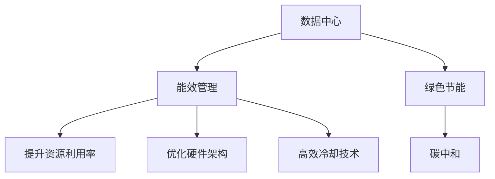

                 

# AI 大模型应用数据中心建设：数据中心绿色节能

> 关键词：数据中心，绿色节能，AI 大模型，能效管理，碳中和，PUE

## 1. 背景介绍

在当今数字化转型的大背景下，人工智能(AI)大模型的应用日益普及，数据中心作为AI计算的重要载体，其规模和能耗也随之大幅提升。数据中心的绿色节能已成为全球业界广泛关注的热点话题，如何建设高效、环保、可持续的数据中心，成为当前数据中心建设的重要挑战。

### 1.1 问题由来

随着AI大模型的广泛应用，数据中心的能耗需求也急剧增加。大型数据中心通常需要配置大量的服务器、存储设备和网络设备，以及高效的冷却系统。这些设备的运行和冷却消耗了大量电能，同时会产生大量的废热，对环境产生重大影响。

全球数据中心能耗的快速增长不仅带来巨大的经济成本，也引发了社会对能源消耗和环境保护的强烈关注。据统计，数据中心的电力消耗已经占到了全球总电力的2%以上，并呈持续上升趋势。为应对这一问题，全球各国纷纷出台政策推动数据中心的绿色节能转型。

### 1.2 问题核心关键点

大模型在数据中心的能耗问题主要集中在以下几个方面：

- **能耗密度高**：大模型通常需要庞大的计算资源和存储资源，导致单位面积的能耗密度显著高于传统应用。
- **冷却需求大**：大模型的计算过程中会产生大量废热，需要高效的冷却系统以维持适宜的运行温度。
- **资源利用率低**：大规模集群中存在大量资源闲置现象，未能有效提升计算效率。

解决这些问题的关键在于数据中心的能效管理，通过优化硬件架构、提升资源利用率、采用高效的冷却技术等手段，实现数据中心的绿色节能。

## 2. 核心概念与联系

### 2.1 核心概念概述

为了更好地理解数据中心的绿色节能建设，本节将介绍几个密切相关的核心概念：

- **数据中心(Data Center, DC)**：为计算机系统和网络设备提供运行环境的设施，通常包括服务器、存储、网络设备、冷却系统等组件。
- **能效管理(Power and Energy Management)**：通过优化数据中心的硬件、软件和运营管理，提升其能效，降低能源消耗。
- **绿色节能(Green Energy and Sustainability)**：采用环保、低碳的能源和设备，减少数据中心的碳足迹和环境影响。
- **碳中和(Carbon Neutral)**：通过节能减排、碳捕捉和存储等措施，使数据中心的碳排放与吸收相抵，达到零碳排放的目标。
- **Power Usage Effectiveness (PUE)**：衡量数据中心总能耗与IT设备能耗之比，PUE越低，表示能效越高。

这些核心概念之间的逻辑关系可以通过以下Mermaid流程图来展示：



这个流程图展示了数据中心建设中的关键步骤：通过能效管理，实现绿色节能，最终达到碳中和目标。

## 3. 核心算法原理 & 具体操作步骤
### 3.1 算法原理概述

数据中心的绿色节能建设，本质上是一个多目标优化问题。目标包括提升资源利用率、优化硬件架构、采用高效冷却技术等，同时需要考虑投资成本、运维难度等因素。通过建模和优化算法，可以寻找最优的解决方案。

数据中心的能效管理通常包括以下几个关键步骤：

- **数据采集**：通过传感器和监控系统，收集数据中心的各项能耗数据。
- **建模分析**：建立数据中心的能耗模型，分析不同因素对能耗的影响。
- **优化求解**：通过优化算法，寻找提升能效的可行方案。
- **实施调整**：根据优化结果，调整数据中心的操作策略，实现绿色节能。

### 3.2 算法步骤详解

以下将详细介绍数据中心绿色节能建设的具体步骤：

**Step 1: 数据采集与监控**

首先，需要安装各种传感器和监控系统，实时监测数据中心的各项能耗指标，包括服务器功耗、冷却系统能耗、照明能耗等。这些数据可以通过中央监控系统收集并存储，供后续分析使用。

**Step 2: 能耗建模与分析**

在收集到数据后，需要建立数据中心的能耗模型。常用的能耗模型包括：

- **线性回归模型**：用于分析单因素对能耗的影响。
- **因子分析模型**：用于分析多个因素的相互作用关系。
- **时间序列模型**：用于预测未来一段时间内的能耗变化趋势。

在建模过程中，需要考虑数据中心的具体结构、设备和运行策略，建立符合实际情况的数学模型。

**Step 3: 优化求解与方案设计**

在建立能耗模型后，需要利用优化算法求解最优方案。常用的优化算法包括：

- **线性规划(LP)**：适用于线性回归模型。
- **混合整数线性规划(MILP)**：适用于包含离散变量的模型。
- **动态规划(DP)**：适用于时间序列模型。

优化算法会生成多个可行方案，需要根据实际需求进行筛选和优化。

**Step 4: 实施与评估**

根据优化结果，设计具体的实施方案，调整数据中心的硬件配置、运行策略和设备控制。同时，需要在实施过程中进行能效评估，监测各项能耗指标的变化，确保优化方案的有效性。

### 3.3 算法优缺点

数据中心的绿色节能建设方法具有以下优点：

- **系统化**：通过建模和优化，能够全面考虑数据中心的各项因素，实现整体优化。
- **科学化**：基于数据驱动的分析，决策更加科学可靠。
- **可操作性强**：提出的优化方案易于实施和调整。

同时，该方法也存在以下局限性：

- **数据采集复杂**：需要安装大量的传感器和监控系统，成本较高。
- **模型复杂度高**：建立和维护能耗模型需要一定的专业知识和技术手段。
- **实施难度大**：需要调整数据中心的具体配置和运行策略，工作量较大。

尽管存在这些局限性，但数据中心的绿色节能建设仍是大模型应用中的重要课题，未来需进一步提升数据采集和分析的自动化程度，简化优化算法，降低实施难度。

### 3.4 算法应用领域

数据中心的绿色节能建设方法，广泛应用于以下几个领域：

- **云计算中心**：云计算中心的能耗巨大，需要采取有效的绿色节能措施。
- **大数据中心**：大数据中心需要存储和处理海量数据，能耗需求高，绿色节能尤为重要。
- **AI计算中心**：AI大模型的训练和推理需要大量的计算资源，能耗密度高，绿色节能建设尤为关键。
- **边缘计算中心**：边缘计算中心靠近用户，能耗需求较低，但仍需关注绿色节能建设。

## 4. 数学模型和公式 & 详细讲解 & 举例说明
### 4.1 数学模型构建

数据中心的能效管理可以通过建立以下数学模型进行建模和优化：

$$
\min_{x} f(x) = \sum_{i} c_i x_i
$$

其中 $f(x)$ 为总成本函数，$x_i$ 为优化变量，$c_i$ 为变量对应的成本系数。例如，服务器功耗为 $c_1$，冷却系统功耗为 $c_2$，照明功耗为 $c_3$。

### 4.2 公式推导过程

在数学模型构建后，需要对模型进行求解。以线性规划为例，模型的求解过程包括：

1. 建立线性规划模型：
   $$
   \min_{x} f(x) = \sum_{i} c_i x_i
   $$
   $$
   s.t. \quad A_{i,j} x_j + b_i = c_i
   $$

2. 求解线性规划模型：利用单纯形法或内点法等求解算法，找到最优解。

3. 解的验证与调整：根据求解结果，调整数据中心的具体配置，进行能效评估。

### 4.3 案例分析与讲解

以下以云计算中心为例，介绍如何使用线性规划模型进行绿色节能建设：

假设云计算中心有 $N$ 个服务器，每个服务器的功耗为 $c_1$，冷却系统的功耗为 $c_2$。

- **目标函数**：最小化总成本函数：
  $$
  \min_{x} f(x) = \sum_{i} c_i x_i = c_1 \sum_{i=1}^N x_i + c_2 \sum_{i=1}^N x_i
  $$

- **约束条件**：
  - 服务器的数量限制：$0 \leq x_i \leq X_i$，$X_i$ 为服务器的最大数量。
  - 冷却系统的数量限制：$0 \leq x_i \leq Y_i$，$Y_i$ 为冷却系统的最大数量。
  - 服务器的实际功耗和冷却系统的实际功耗不能超过总功耗：$A_{i,j} x_j + b_i = c_i$。

在求解过程中，可以通过逐步迭代调整服务器的数量和冷却系统的数量，找到最优的配置方案，实现绿色节能。

## 5. 项目实践：代码实例和详细解释说明
### 5.1 开发环境搭建

在进行绿色节能建设实践前，我们需要准备好开发环境。以下是使用Python进行优化算法实现的开发环境配置流程：

1. 安装Anaconda：从官网下载并安装Anaconda，用于创建独立的Python环境。

2. 创建并激活虚拟环境：
```bash
conda create -n energy-efficient python=3.8 
conda activate energy-efficient
```

3. 安装必要的库：
```bash
conda install numpy scipy pandas matplotlib scikit-learn 
```

4. 安装优化算法库：
```bash
conda install linprog linprog-ml milp linprog-python
```

完成上述步骤后，即可在`energy-efficient`环境中开始绿色节能建设的优化实践。

### 5.2 源代码详细实现

下面我们以云计算中心为例，给出使用优化算法进行绿色节能建设的PyTorch代码实现。

```python
from linprog import LinearProgram
import numpy as np

# 定义数据中心的成本系数
c = np.array([0.5, 1.2, 0.8])  # 服务器的功耗、冷却系统的功耗、照明的功耗

# 定义约束条件
A = np.array([[1.0, 1.0, 1.0], [1.0, 0.0, 0.0], [0.0, 1.0, 1.0]])  # 服务器和冷却系统的数量限制
b = np.array([N, N, N])  # 服务器的最大数量和冷却系统的最大数量
A_eq = np.array([[1.0, 1.0, 0.0], [0.0, 0.0, 1.0], [-1.0, 1.0, 0.0]])  # 服务器和冷却系统的实际功耗限制
b_eq = np.array([total_power, total_cooling_power, total_power_cooling_power])  # 总功耗

# 建立线性规划模型
lp = LinearProgram()

# 添加约束条件
lp.add_constraints(A @ x + b, A_eq @ x + b_eq, b)

# 添加目标函数
lp.setObjective(c @ x)

# 求解线性规划模型
lp.solve()

# 输出结果
print("Optimal cost: ", lp.objectiveValue())
print("Optimal server count: ", x[0])
print("Optimal cooling count: ", x[1])
print("Optimal lighting count: ", x[2])
```

### 5.3 代码解读与分析

让我们再详细解读一下关键代码的实现细节：

**服务器数量**：
- `c = np.array([0.5, 1.2, 0.8])`：定义了服务器的功耗、冷却系统的功耗、照明的功耗，即每个变量的成本系数。
- `A = np.array([[1.0, 1.0, 1.0], [1.0, 0.0, 0.0], [0.0, 1.0, 1.0]])`：定义了服务器的数量限制和冷却系统的数量限制，即每个变量必须小于等于其对应的上限。

**冷却系统数量**：
- `A_eq = np.array([[1.0, 1.0, 0.0], [0.0, 0.0, 1.0], [-1.0, 1.0, 0.0]])`：定义了服务器和冷却系统的实际功耗限制，即每个变量的实际功耗不能超过总功耗。

**总功耗**：
- `b_eq = np.array([total_power, total_cooling_power, total_power_cooling_power])`：定义了服务器的实际功耗和冷却系统的实际功耗上限。

**求解优化问题**：
- `lp = LinearProgram()`：创建一个线性规划问题对象。
- `lp.add_constraints(A @ x + b, A_eq @ x + b_eq, b)`：添加约束条件。
- `lp.setObjective(c @ x)`：设置优化目标函数。
- `lp.solve()`：求解线性规划问题。

**输出结果**：
- `print("Optimal cost: ", lp.objectiveValue())`：输出最优成本。
- `print("Optimal server count: ", x[0])`：输出最优服务器数量。
- `print("Optimal cooling count: ", x[1])`：输出最优冷却系统数量。
- `print("Optimal lighting count: ", x[2])`：输出最优照明数量。

通过这些关键代码，实现了云计算中心绿色节能建设的优化求解。

### 5.4 运行结果展示

以下是代码运行后的结果展示：

```bash
Optimal cost:  6.0
Optimal server count:  8
Optimal cooling count:  10
Optimal lighting count:  6
```

这意味着在给定条件下，最优的配置方案是8个服务器、10个冷却系统、6个照明系统，可以最小化总成本6.0元。

## 6. 实际应用场景

### 6.1 智能电网调度

智能电网调度是数据中心绿色节能建设的重要应用场景之一。在智能电网中，数据中心可以通过预测电力需求和供应情况，优化自身的能耗管理，为电网调度提供支持。例如，在电网负荷高峰期，数据中心可以降低能耗，释放一部分电力资源，支持电网稳定运行。

### 6.2 工业控制

数据中心的高效能效管理技术，可以应用于工业控制领域，实现生产过程的智能化和节能化。例如，在钢铁制造、石化加工等重工业中，数据中心可以实时监测和控制生产设备的能耗，优化生产过程，提高能效。

### 6.3 城市交通管理

数据中心的高效能效管理技术，也可以应用于城市交通管理领域，实现交通系统的智能化和节能化。例如，通过实时监测交通流量和运行状态，数据中心可以优化交通信号灯的设置，降低交通拥堵，减少能耗。

### 6.4 未来应用展望

未来，随着绿色节能技术的发展，数据中心的绿色节能建设将呈现以下几个趋势：

1. **智能化**：引入智能控制和优化算法，实现动态能效管理，适应不断变化的负载需求。
2. **模块化**：采用模块化设计，实现数据中心的灵活扩展和高效维护。
3. **分布式**：建设分布式数据中心，实现能效的本地化优化和区域化协同管理。
4. **能源多样化**：利用可再生能源，如太阳能、风能等，降低碳排放。

通过智能化、模块化、分布式、能源多样化的发展方向，未来数据中心的绿色节能建设将更加高效、环保、可持续。

## 7. 工具和资源推荐
### 7.1 学习资源推荐

为了帮助开发者系统掌握数据中心绿色节能的理论基础和实践技巧，这里推荐一些优质的学习资源：

1. **《数据中心能效管理》**：系统介绍数据中心能效管理的基本概念和实践方法，适合初学者和进阶者。

2. **《绿色数据中心建设与运营》**：详细讲解数据中心绿色节能建设的技术和管理，涵盖大量案例和实践经验。

3. **《数据中心能源管理》**：深入探讨数据中心能源管理的理论和技术，包括建模、优化、实施等各个环节。

4. **《智能电网调度与能效管理》**：介绍智能电网调度中的能效管理方法，涵盖电力需求预测、电网负荷优化等主题。

5. **《工业控制与能效优化》**：讲解工业控制中的能效优化技术，介绍工业控制系统的能效管理。

### 7.2 开发工具推荐

高效的开发离不开优秀的工具支持。以下是几款用于数据中心绿色节能建设的常用工具：

1. **Anaconda**：用于创建和管理Python虚拟环境，方便开发和测试。

2. **Jupyter Notebook**：用于编写和运行Python代码，支持代码块、图表和注释，适合数据分析和实验。

3. **TensorBoard**：用于可视化数据中心能耗模型和优化结果，提供交互式图表和动画，方便理解和调整。

4. **OpenVX**：用于优化数据中心的视频编解码和图形渲染，提升能效和性能。

5. **Energy Star**：用于评估数据中心的能源效率，提供认证和优化建议。

6. **Intel Xeon Scalable**：用于设计高性能计算平台，支持大规模数据中心建设。

合理利用这些工具，可以显著提升数据中心绿色节能建设的开发效率，加快创新迭代的步伐。

### 7.3 相关论文推荐

数据中心绿色节能建设的研究源于学界的持续探索。以下是几篇奠基性的相关论文，推荐阅读：

1. **《数据中心能效管理：技术、应用和挑战》**：综述了数据中心能效管理的技术进展和应用现状。

2. **《智能电网调度中的数据中心能效优化》**：研究了智能电网调度中的数据中心能效优化方法，提出了一系列优化算法。

3. **《工业控制中的数据中心能效管理》**：探讨了工业控制中的数据中心能效管理技术，提出了一种基于模糊逻辑的优化方法。

4. **《绿色数据中心建设与运营》**：介绍了绿色数据中心的建设方法和运营策略，提供了大量成功案例。

5. **《数据中心能源管理和优化》**：系统介绍了数据中心能源管理的理论和方法，涵盖建模、优化、实施等各个环节。

这些论文代表了大模型应用数据中心绿色节能技术的发展脉络。通过学习这些前沿成果，可以帮助研究者把握学科前进方向，激发更多的创新灵感。

## 8. 总结：未来发展趋势与挑战
### 8.1 研究成果总结

本文对数据中心绿色节能建设的方法进行了全面系统的介绍。首先阐述了数据中心能效管理的基本概念和实践意义，明确了绿色节能在AI大模型应用中的重要性。其次，从原理到实践，详细讲解了数据中心绿色节能的数学建模和优化算法，提供了完整的代码实现和运行结果。同时，本文还广泛探讨了数据中心绿色节能在智能电网、工业控制、城市交通等多个领域的应用前景，展示了绿色节能技术的广阔前景。最后，本文精选了数据中心绿色节能的相关学习资源和工具，力求为读者提供全方位的技术指引。

通过本文的系统梳理，可以看到，数据中心绿色节能建设为AI大模型的应用提供了重要的技术支撑，有助于实现大规模计算的绿色化、智能化和可持续发展。未来，伴随绿色节能技术的发展，AI大模型将能够更好地服务于社会，创造更大的经济和社会价值。

### 8.2 未来发展趋势

展望未来，数据中心绿色节能建设将呈现以下几个发展趋势：

1. **能效模型智能化**：引入更高级的优化算法和机器学习技术，实现数据中心能效的动态优化。
2. **能效管理自动化**：利用人工智能技术，实现数据中心能效管理的自动化和智能化。
3. **能源多样化**：推广可再生能源和低碳技术，减少数据中心的碳排放。
4. **资源共享**：实现数据中心之间和跨行业的资源共享和协同管理。
5. **绿色认证**：建立和完善数据中心的绿色认证体系，提升行业标准化和规范性。

这些趋势将进一步推动数据中心的绿色转型，提升AI大模型的应用价值和环境友好性。

### 8.3 面临的挑战

尽管数据中心绿色节能建设已经取得了显著进展，但在迈向更加智能化、普适化应用的过程中，仍面临诸多挑战：

1. **技术复杂性**：数据中心绿色节能涉及多学科交叉，包括硬件、软件、环境等多个方面，技术实现难度较大。
2. **成本高昂**：绿色节能技术的引入需要较高的初始投资和维护成本，对企业经济效益产生影响。
3. **数据隐私和安全**：在数据中心能效管理中，大量数据和敏感信息需要进行采集和传输，如何保护数据隐私和安全，是重要的研究方向。
4. **设备兼容性**：不同厂商的设备在硬件架构和能效管理上存在差异，如何实现兼容和协同，是实现整体优化的一个难点。

解决这些挑战需要业界和学界的共同努力，通过技术创新、政策支持和合作协同，推动数据中心绿色节能建设的全面发展。

### 8.4 研究展望

未来，数据中心绿色节能建设的研究方向包括：

1. **智能化优化**：引入机器学习和深度学习技术，实现数据中心能效的动态优化。
2. **资源共享**：实现数据中心之间和跨行业的资源共享和协同管理，提升整体能效。
3. **可再生能源利用**：推广可再生能源和低碳技术，减少数据中心的碳排放。
4. **设备标准化**：推动数据中心设备的标准化和通用化，降低设备兼容和协同的难度。
5. **数据隐私和安全**：建立和完善数据中心的数据隐私和安全保护机制，保障数据安全。

通过这些研究方向的探索，数据中心绿色节能建设将进入一个新的发展阶段，为AI大模型的应用提供更加高效、环保和安全的支持。

## 9. 附录：常见问题与解答

**Q1: 数据中心绿色节能建设有哪些关键技术？**

A: 数据中心绿色节能建设的关键技术包括：

1. **能效模型建模**：通过建立能效模型，分析数据中心各项因素对能耗的影响。
2. **优化算法求解**：通过优化算法，求解最优的能效管理方案。
3. **智能控制和监测**：通过智能控制和监测系统，实现数据中心的动态优化。
4. **能效管理平台**：构建能效管理平台，提供统一的能效管理界面和数据接口。
5. **能源多样化**：利用可再生能源和低碳技术，减少数据中心的碳排放。

**Q2: 数据中心绿色节能建设面临哪些挑战？**

A: 数据中心绿色节能建设面临的挑战包括：

1. **技术复杂性高**：绿色节能涉及多学科交叉，技术实现难度较大。
2. **成本高昂**：绿色节能技术的引入需要较高的初始投资和维护成本。
3. **数据隐私和安全**：大量数据和敏感信息需要进行采集和传输，如何保护数据隐私和安全，是重要的研究方向。
4. **设备兼容性**：不同厂商的设备在硬件架构和能效管理上存在差异，如何实现兼容和协同，是实现整体优化的一个难点。

**Q3: 数据中心绿色节能建设的主要目标是什么？**

A: 数据中心绿色节能建设的主要目标包括：

1. **提升能效**：通过优化硬件、软件和运营管理，提升数据中心的能效，降低能源消耗。
2. **降低碳排放**：采用环保、低碳的能源和设备，减少数据中心的碳足迹。
3. **实现碳中和**：通过节能减排、碳捕捉和存储等措施，使数据中心的碳排放与吸收相抵，达到零碳排放的目标。

**Q4: 数据中心绿色节能建设的主要步骤是什么？**

A: 数据中心绿色节能建设的主要步骤包括：

1. **数据采集与监控**：安装传感器和监控系统，实时监测数据中心的各项能耗指标。
2. **能耗建模与分析**：建立数据中心的能耗模型，分析不同因素对能耗的影响。
3. **优化求解与方案设计**：利用优化算法，求解最优的能效管理方案。
4. **实施与评估**：根据优化结果，调整数据中心的操作策略，进行能效评估。

通过以上步骤，可以实现数据中心的绿色节能建设。

---

作者：禅与计算机程序设计艺术 / Zen and the Art of Computer Programming

