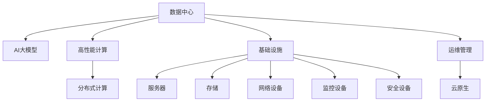

                 

# AI 大模型应用数据中心建设：数据中心运营与管理

> 关键词：数据中心, 大模型, 高性能计算, 人工智能, 基础设施, 运维管理

## 1. 背景介绍

### 1.1 问题由来
随着人工智能（AI）技术的快速发展，特别是深度学习模型的广泛应用，数据中心在AI大模型应用中扮演着至关重要的角色。大规模深度学习模型的训练和推理需要庞大的计算资源，而数据中心作为计算基础设施的核心，必须能够支撑这些需求，同时确保高效、稳定、可靠地运行。

当前，许多大模型应用已经从学术研究走向商业化，各行各业都在利用AI技术进行数字化转型，提升效率和竞争力。然而，建设和管理一个高效、可靠的数据中心并非易事。本文将深入探讨AI大模型应用中的数据中心建设和管理，涵盖硬件、软件、网络、安全等多方面内容。

## 2. 核心概念与联系

### 2.1 核心概念概述

为更好地理解AI大模型数据中心建设和管理，本节将介绍几个密切相关的核心概念：

- **数据中心(Data Center, DC)**：由计算机系统、网络通信设备、存储设备、监控设备、安全设备等组成，用于集中管理和运营企业IT资源的基础设施。

- **AI大模型(AI Large Model)**：指用于解决复杂人工智能任务的大型深度学习模型，通常参数规模大、计算需求高。

- **高性能计算(High Performance Computing, HPC)**：涉及硬件加速、并行计算、分布式计算等技术，旨在提升大规模计算任务的执行效率。

- **基础设施(Infrastructure)**：包括硬件、软件、网络、安全等多个维度，是数据中心建设和运营的基础。

- **运维管理(Operations Management)**：指数据中心的日常维护、监控、故障处理等操作，确保数据中心的稳定运行。

- **云原生(Cloud Native)**：以微服务、容器化、自动化等为核心思想，实现基础设施的弹性、自动化和可靠性。

这些核心概念之间的逻辑关系可以通过以下Mermaid流程图来展示：



这个流程图展示了大模型应用中数据中心的核心概念及其之间的关系：

1. 数据中心通过高性能计算平台，支撑大模型的训练和推理。
2. 基础设施提供了硬件、软件、网络和安全的保障。
3. 运维管理确保数据中心的日常操作稳定可靠。
4. 云原生技术提升了数据中心的弹性、自动化和可靠性。

## 3. 核心算法原理 & 具体操作步骤

### 3.1 算法原理概述

AI大模型应用中的数据中心建设和管理，涉及多个层面的技术原理。以下是一些关键点的概述：

- **硬件加速**：通过GPU、TPU等专用硬件加速器，提升深度学习模型的计算效率。
- **分布式计算**：通过多台服务器并行处理，实现大规模深度学习模型的训练和推理。
- **自动微调和优化**：利用超参数优化和模型压缩技术，减少大模型的计算资源需求。
- **网络优化**：通过优化网络架构和数据传输，确保数据中心内部的高效通信。
- **安全与隐私保护**：通过加密、访问控制等措施，保障数据中心的安全性和隐私保护。

### 3.2 算法步骤详解

基于上述原理，AI大模型应用数据中心的建设和管理可以分为以下几个关键步骤：

1. **需求分析**：根据AI大模型的计算需求，评估数据中心的硬件和软件配置。
2. **硬件选型**：选择合适的GPU、TPU等硬件加速器，确保计算能力。
3. **网络设计**：设计高效的网络架构，优化数据传输路径。
4. **运维策略**：制定运维管理策略，确保数据中心的稳定运行。
5. **安全措施**：部署安全设备，实施访问控制和数据加密等安全策略。
6. **性能优化**：通过超参数优化和模型压缩技术，提升大模型的效率。
7. **自动化管理**：引入云原生技术，实现基础设施的自动化管理和弹性扩展。

### 3.3 算法优缺点

AI大模型应用数据中心的建设和管理，具有以下优点：

- **高效率**：通过分布式计算和硬件加速，提升深度学习模型的训练和推理效率。
- **高可靠性**：通过冗余设计和运维管理，确保数据中心的稳定运行。
- **可扩展性**：通过云计算技术，实现数据中心的弹性扩展和资源共享。
- **成本效益**：通过资源共享和自动化管理，降低运维成本。

同时，也存在以下缺点：

- **初始投资大**：建设高性能数据中心需要大量资金和资源投入。
- **技术复杂**：涉及多层次的技术栈，管理和维护复杂。
- **能耗高**：大模型训练和推理的高计算需求带来高能耗，需要高效能的冷却系统。
- **隐私风险**：大模型的训练和推理涉及大量敏感数据，存在隐私泄露风险。

### 3.4 算法应用领域

AI大模型应用数据中心的建设和管理，在以下几个领域具有重要应用：

- **云计算服务**：通过云原生技术，构建弹性、自动化的AI大模型服务。
- **科学研究**：支持大规模科学计算，推动前沿AI研究。
- **企业数字化转型**：提供AI大模型基础设施，支撑企业应用开发和业务优化。
- **金融科技**：构建高性能计算平台，支持金融数据处理和智能决策。
- **医疗健康**：提供AI大模型训练和推理能力，推动医疗健康智能化发展。

## 4. 数学模型和公式 & 详细讲解 & 举例说明

### 4.1 数学模型构建

AI大模型应用数据中心的建设和管理，涉及到多个数学模型和公式。以下是一些关键模型的概述：

- **分布式深度学习模型**：利用多台服务器并行计算，提升深度学习模型的训练和推理效率。模型参数分布存储在各服务器上，通过同步或异步方式更新。

- **模型压缩和优化**：通过剪枝、量化、蒸馏等技术，减少大模型的计算资源需求，提升推理效率。

- **超参数优化**：通过网格搜索、贝叶斯优化等技术，调整深度学习模型的超参数，提升模型性能。

### 4.2 公式推导过程

以分布式深度学习模型为例，推导其计算效率的公式：

设深度学习模型的参数量为 $P$，单台服务器的计算能力为 $C$，模型在单台服务器上的训练时间为 $T$，则分布式训练的总时间为：

$$
T_{total} = T \times \frac{P}{C \times n}
$$

其中 $n$ 为参与训练的服务器数量。通过增加服务器数量 $n$，可以显著提升深度学习模型的训练效率。

### 4.3 案例分析与讲解

以Google的TPU为例，分析其对AI大模型训练效率的提升。

Google TPU采用专门的硬件加速器，支持大规模深度学习模型的训练。通过TPU的分布式计算能力，能够在短时间内训练出高效的AI模型。以BERT模型的训练为例，使用TPU相比传统的CPU/GPU，训练时间缩短了数十倍，显著提升了AI大模型的开发和部署效率。

## 5. 项目实践：代码实例和详细解释说明

### 5.1 开发环境搭建

在进行AI大模型应用数据中心建设和管理实践前，我们需要准备好开发环境。以下是使用Python进行TensorFlow开发的环境配置流程：

1. 安装Anaconda：从官网下载并安装Anaconda，用于创建独立的Python环境。

2. 创建并激活虚拟环境：
```bash
conda create -n tf-env python=3.8 
conda activate tf-env
```

3. 安装TensorFlow：根据CUDA版本，从官网获取对应的安装命令。例如：
```bash
conda install tensorflow tensorflow-gpu -c conda-forge
```

4. 安装各类工具包：
```bash
pip install numpy pandas scikit-learn matplotlib tqdm jupyter notebook ipython
```

完成上述步骤后，即可在`tf-env`环境中开始开发实践。

### 5.2 源代码详细实现

这里我们以分布式深度学习模型训练为例，给出使用TensorFlow构建的完整代码实现。

```python
import tensorflow as tf
from tensorflow.keras.layers import Dense
from tensorflow.keras.models import Model

# 定义模型
def build_model():
    inputs = tf.keras.layers.Input(shape=(input_shape,), name='inputs')
    outputs = Dense(10, activation='relu')(inputs)
    outputs = Dense(1, activation='sigmoid')(outputs)
    model = Model(inputs=inputs, outputs=outputs, name='model')
    return model

# 定义数据集
train_dataset = tf.data.Dataset.from_tensor_slices((train_data, train_labels))
test_dataset = tf.data.Dataset.from_tensor_slices((test_data, test_labels))

# 定义模型和优化器
model = build_model()
optimizer = tf.keras.optimizers.Adam(learning_rate=0.001)

# 定义损失函数
loss_fn = tf.keras.losses.BinaryCrossentropy(from_logits=True)

# 定义模型训练函数
@tf.function
def train_step(inputs, labels):
    with tf.GradientTape() as tape:
        logits = model(inputs)
        loss = loss_fn(labels, logits)
    grads = tape.gradient(loss, model.trainable_variables)
    optimizer.apply_gradients(zip(grads, model.trainable_variables))
    return loss

# 训练模型
for epoch in range(num_epochs):
    for inputs, labels in train_dataset:
        loss = train_step(inputs, labels)
        if epoch % 10 == 0:
            print(f"Epoch {epoch+1}, loss: {loss.numpy()}")
```

以上是使用TensorFlow构建分布式深度学习模型的完整代码实现。可以看到，TensorFlow的高级API使得模型的定义和训练变得简洁高效。

### 5.3 代码解读与分析

让我们再详细解读一下关键代码的实现细节：

**模型定义**：
- `build_model`函数：定义深度学习模型结构，包括输入层、隐藏层和输出层。
- `Dense`层：实现全连接神经网络层，支持不同激活函数。
- `Model`类：封装输入、输出和损失函数，形成完整的深度学习模型。

**数据集定义**：
- `tf.data.Dataset`：TensorFlow的数据集API，支持从不同数据源加载数据，并进行批处理、预处理等操作。
- `from_tensor_slices`方法：将输入数据和标签作为张量切片加载到数据集中。

**模型训练**：
- `tf.function`装饰器：将训练函数转换为可优化函数，提升计算效率。
- `GradientTape`上下文：自动记录模型计算图，计算梯度并更新参数。
- `apply_gradients`方法：应用优化器的梯度更新，更新模型参数。

**损失函数**：
- `BinaryCrossentropy`：用于二分类任务的损失函数，计算预测值与真实标签之间的差异。

**训练循环**：
- `for`循环：迭代训练集中的每个批次，进行前向传播和反向传播，更新模型参数。
- `print`函数：打印每个epoch的平均损失值。

可以看到，TensorFlow使得深度学习模型的构建和训练变得非常简洁和高效。开发者可以将更多精力放在数据处理、模型改进等高层逻辑上，而不必过多关注底层的实现细节。

当然，工业级的系统实现还需考虑更多因素，如模型的保存和部署、超参数的自动搜索、更灵活的任务适配层等。但核心的分布式计算范式基本与此类似。

## 6. 实际应用场景

### 6.1 云计算服务

AI大模型应用中的数据中心建设，在云计算服务中具有重要应用。云计算服务商通过建设高性能数据中心，提供弹性的AI计算能力，支持用户在大模型训练和推理方面的需求。

以Google云为例，通过Google云平台，用户可以在云端部署分布式深度学习模型，享受高效的计算资源和完善的运维服务。用户可以灵活调整计算资源，按需支付费用，无需担心硬件和软件的维护问题。这种云原生基础设施，极大提升了AI大模型的应用便捷性和成本效益。

### 6.2 科学研究

在科学研究中，AI大模型应用的数据中心建设和管理，提供了强大的计算能力，支持大规模科学计算。例如，大型天文观测数据处理、气候模拟、生物医学计算等科学研究领域，都依赖于高性能数据中心提供计算资源。

例如，天文学家可以利用大模型进行天文图像处理和数据分析，通过大规模并行计算，提升科学研究的效率和精度。在地球科学领域，大模型可以模拟复杂的气候变化过程，支持气候变化的科学研究。

### 6.3 企业数字化转型

AI大模型应用数据中心建设，在企业数字化转型中发挥了重要作用。通过构建企业级数据中心，企业可以支持大规模AI模型训练和推理，提升业务智能化水平。

例如，金融企业可以利用大模型进行风险评估、欺诈检测、客户画像等任务，提升金融服务的效率和精准度。医疗企业可以利用大模型进行疾病预测、医学影像分析、个性化诊疗等任务，推动医疗健康领域的数字化转型。

### 6.4 未来应用展望

随着AI大模型技术的不断成熟，基于数据中心建设和管理的应用将呈现以下几个发展趋势：

1. **边缘计算**：将数据中心的功能下沉到边缘设备，支持实时、本地化的AI应用。
2. **混合云架构**：结合公有云和私有云的优势，提供更灵活、安全的AI计算环境。
3. **跨云集成**：通过API和容器技术，实现跨云平台的数据中心集成，提升AI应用的灵活性和扩展性。
4. **安全合规**：引入区块链、联邦学习等技术，保障数据隐私和安全合规。
5. **智能运维**：通过AI技术优化数据中心运维管理，提升运维效率和自动化水平。

这些趋势将进一步拓展AI大模型应用的范围和深度，提升数据中心的智能化和自动化水平，推动AI技术在更多领域的落地应用。

## 7. 工具和资源推荐

### 7.1 学习资源推荐

为了帮助开发者系统掌握AI大模型应用数据中心建设和管理的技术基础和实践技巧，这里推荐一些优质的学习资源：

1. **《深度学习》(Deep Learning) by Ian Goodfellow**：深度学习领域的经典教材，全面介绍了深度学习的基础理论和实践方法。
2. **《分布式深度学习》(Distributed Deep Learning) by Srinivas Kannan**：介绍分布式深度学习的核心原理和算法，涵盖并行计算、模型优化等内容。
3. **《TensorFlow官方文档》(TensorFlow Official Documentation)**：TensorFlow的官方文档，提供了详细的API文档和示例代码，是深度学习开发的重要参考。
4. **Google Cloud AI Platform官方文档**：Google云平台的官方文档，介绍了如何在云上构建和管理AI应用，包括数据中心建设和运维管理。
5. **《高性能计算与并行算法》(High Performance Computing and Parallel Algorithms) by Prabhakar K. Rao**：介绍了高性能计算的核心原理和算法，支持大规模深度学习模型的训练和推理。

通过对这些资源的学习实践，相信你一定能够快速掌握AI大模型应用数据中心建设和管理的基础知识和实践技巧。

### 7.2 开发工具推荐

高效的开发离不开优秀的工具支持。以下是几款用于AI大模型应用数据中心建设和管理开发的常用工具：

1. **TensorFlow**：由Google主导开发的深度学习框架，支持分布式计算、自动微调和优化。
2. **TensorBoard**：TensorFlow配套的可视化工具，可以实时监测模型训练状态，提供丰富的图表呈现方式。
3. **Kubernetes**：Google开源的容器编排工具，支持大规模分布式系统管理，提供弹性和自动化运维能力。
4. **NVIDIA GPU加速库**：提供高性能GPU加速支持，提升深度学习模型的计算效率。
5. **AWS、Google Cloud、Microsoft Azure**：主流云服务商提供的云平台，支持弹性计算资源和完善的服务支持。

合理利用这些工具，可以显著提升AI大模型应用数据中心的开发效率，加快创新迭代的步伐。

### 7.3 相关论文推荐

AI大模型应用数据中心建设和管理的研究，涉及多个学科和方向，以下是几篇奠基性的相关论文，推荐阅读：

1. **《分布式深度学习与模型并行》(Distributed Deep Learning and Model Parallelism) by S. Shang**：介绍分布式深度学习的核心原理和算法，涵盖数据并行、模型并行等内容。
2. **《GPU加速的深度学习》(GPU-Accelerated Deep Learning) by A. Vapnik**：介绍GPU加速技术在深度学习中的应用，提升计算效率。
3. **《模型压缩与优化》(Model Compression and Optimization) by Y. Zhang**：介绍深度学习模型的压缩和优化技术，提升模型效率和精度。
4. **《基于云计算的深度学习模型训练与部署》(Deep Learning Model Training and Deployment in Cloud) by J. Qu**：介绍基于云平台的数据中心建设和管理方法，支持弹性计算资源和自动化运维。
5. **《高性能计算系统的设计与实现》(High Performance Computing Systems Design and Implementation) by H. Guo**：介绍高性能计算系统的设计实现方法，支持大规模深度学习模型的训练和推理。

这些论文代表了大模型应用数据中心建设和管理的研究方向，通过学习这些前沿成果，可以帮助研究者把握学科前进方向，激发更多的创新灵感。

## 8. 总结：未来发展趋势与挑战

### 8.1 研究成果总结

本文对AI大模型应用数据中心建设和管理进行了全面系统的介绍。首先阐述了数据中心在AI大模型应用中的重要作用，明确了数据中心建设和管理的核心概念。其次，从原理到实践，详细讲解了高性能计算、分布式训练、模型优化、网络设计、安全保障等关键技术，给出了AI大模型应用的完整代码实例。同时，本文还广泛探讨了AI大模型在云计算服务、科学研究、企业数字化转型等多个领域的应用前景，展示了数据中心建设的广阔前景。此外，本文精选了数据中心建设的各类学习资源，力求为读者提供全方位的技术指引。

通过本文的系统梳理，可以看到，AI大模型应用数据中心建设和管理是一个多层次、多维度的复杂系统工程。这一系统工程的成功实施，需要理论、技术、管理等多方面的协同发力。唯有不断提升理论水平、优化技术细节、加强管理能力，才能实现AI大模型应用的高效、稳定、可靠。

### 8.2 未来发展趋势

展望未来，AI大模型应用数据中心的建设和管理将呈现以下几个发展趋势：

1. **智能运维**：引入AI技术优化数据中心运维管理，提升运维效率和自动化水平。
2. **边缘计算**：将数据中心的功能下沉到边缘设备，支持实时、本地化的AI应用。
3. **混合云架构**：结合公有云和私有云的优势，提供更灵活、安全的AI计算环境。
4. **跨云集成**：通过API和容器技术，实现跨云平台的数据中心集成，提升AI应用的灵活性和扩展性。
5. **安全合规**：引入区块链、联邦学习等技术，保障数据隐私和安全合规。
6. **模型优化**：引入模型压缩、量化等技术，减少大模型的计算资源需求，提升推理效率。

这些趋势将进一步拓展AI大模型应用的范围和深度，提升数据中心的智能化和自动化水平，推动AI技术在更多领域的落地应用。

### 8.3 面临的挑战

尽管AI大模型应用数据中心的建设和管理技术已经取得了长足进展，但在迈向更加智能化、普适化应用的过程中，它仍面临着诸多挑战：

1. **硬件瓶颈**：大模型训练和推理的高计算需求带来高能耗，需要高效能的冷却系统。硬件成本较高，需要平衡计算能力和成本效益。
2. **技术复杂性**：涉及多层次的技术栈，管理和维护复杂。需要跨学科团队协同工作，才能保证系统的稳定性和可靠性。
3. **运维成本**：数据中心的建设和运维成本较高，需要高效的资源管理和优化策略。
4. **隐私安全**：大模型的训练和推理涉及大量敏感数据，存在隐私泄露风险。需要严格的数据保护措施和隐私合规策略。

### 8.4 研究展望

面对AI大模型应用数据中心建设和管理所面临的挑战，未来的研究需要在以下几个方面寻求新的突破：

1. **模型压缩与优化**：开发更加参数高效的微调方法，在固定大部分预训练参数的同时，只更新极少量的任务相关参数。同时优化模型的计算图，减少前向传播和反向传播的资源消耗，实现更加轻量级、实时性的部署。
2. **智能运维**：引入AI技术优化数据中心运维管理，提升运维效率和自动化水平。
3. **边缘计算**：将数据中心的功能下沉到边缘设备，支持实时、本地化的AI应用。
4. **混合云架构**：结合公有云和私有云的优势，提供更灵活、安全的AI计算环境。
5. **跨云集成**：通过API和容器技术，实现跨云平台的数据中心集成，提升AI应用的灵活性和扩展性。
6. **安全合规**：引入区块链、联邦学习等技术，保障数据隐私和安全合规。

这些研究方向将引领AI大模型应用数据中心建设和管理技术的不断演进，为构建安全、可靠、可解释、可控的智能系统铺平道路。面向未来，AI大模型应用数据中心建设和管理技术还需要与其他人工智能技术进行更深入的融合，如知识表示、因果推理、强化学习等，多路径协同发力，共同推动自然语言理解和智能交互系统的进步。只有勇于创新、敢于突破，才能不断拓展语言模型的边界，让智能技术更好地造福人类社会。

## 9. 附录：常见问题与解答

**Q1：数据中心在AI大模型应用中的作用是什么？**

A: 数据中心是AI大模型应用的基础设施，提供了计算、存储、网络等资源，支持大规模深度学习模型的训练和推理。通过高性能计算平台，提升深度学习模型的计算效率，确保模型的高效、稳定、可靠运行。

**Q2：如何选择合适的数据中心硬件设备？**

A: 数据中心硬件设备的选择，应根据AI大模型的计算需求进行评估。通常需要考虑以下几个方面：
1. GPU、TPU等专用硬件加速器的性能和可靠性。
2. 服务器、存储等基础设施的计算能力和扩展性。
3. 网络带宽和延迟，支持大规模数据传输和通信。
4. 能效比和冷却系统，确保硬件设备的稳定运行和高效节能。

**Q3：数据中心如何优化计算资源？**

A: 数据中心优化计算资源，主要通过以下措施：
1. 分布式计算：利用多台服务器并行计算，提升深度学习模型的训练和推理效率。
2. 硬件加速：通过GPU、TPU等专用硬件加速器，提升计算能力。
3. 模型压缩和优化：通过剪枝、量化、蒸馏等技术，减少大模型的计算资源需求，提升推理效率。
4. 超参数优化：通过网格搜索、贝叶斯优化等技术，调整深度学习模型的超参数，提升模型性能。

**Q4：数据中心如何保障数据安全？**

A: 数据中心保障数据安全，主要通过以下措施：
1. 访问控制：通过身份认证和权限管理，限制数据访问权限。
2. 数据加密：对数据进行加密存储和传输，防止数据泄露和篡改。
3. 审计和监控：记录和监控数据访问日志，定期进行安全审计和漏洞检测。
4. 灾备和恢复：建立数据备份和恢复机制，确保数据中心的稳定性和可靠性。

**Q5：数据中心如何提升运维效率？**

A: 数据中心提升运维效率，主要通过以下措施：
1. 自动化管理：引入自动化运维工具，如Ansible、Kubernetes等，实现基础设施的自动化管理和配置。
2. 实时监控：部署监控工具，实时监测系统性能和资源使用情况，及时发现和解决问题。
3. 故障预测和修复：通过机器学习和数据分析技术，预测和预处理潜在故障，提高运维效率。
4. 运维培训：定期对运维人员进行培训，提升运维技能和知识水平。

---

作者：禅与计算机程序设计艺术 / Zen and the Art of Computer Programming

