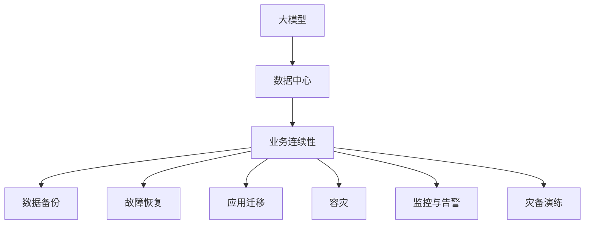

                 

# AI 大模型应用数据中心的业务连续性

> 关键词：业务连续性, 数据中心, 大模型, AI, 故障恢复, 可靠性, 冗余, 容灾, 云服务

## 1. 背景介绍

### 1.1 问题由来

随着人工智能技术的飞速发展，大模型如GPT、BERT等在自然语言处理（NLP）、计算机视觉、语音识别等领域表现出色。这些模型通常是基于大规模数据和海量计算资源训练得到的，具有极高的计算复杂度和存储需求。因此，为了保证这些模型能够稳定运行，数据中心作为其应用和部署的重要基础设施，必须具备良好的业务连续性（Business Continuity, BC）能力，以抵御各种可能的风险和故障，保障大模型应用的可靠性和持续性。

### 1.2 问题核心关键点

大模型应用数据中心的业务连续性主要涉及以下几个核心关键点：

- **数据中心架构**：设计合理的数据中心架构是实现业务连续性的基础，包括硬件设备、网络拓扑、存储配置等。
- **冗余与备份**：实现系统的物理冗余和数据备份，保证在单点故障时系统的快速恢复。
- **容灾策略**：制定完善的容灾策略，包括本地容灾和异地容灾，保障数据的完整性和服务的连续性。
- **监控与告警**：实时监控数据中心的运行状态，一旦发生异常，立即触发告警并采取措施。
- **灾备演练**：定期进行灾备演练，检验和优化容灾策略的有效性。

## 2. 核心概念与联系

### 2.1 核心概念概述

- **业务连续性（Business Continuity, BC）**：指在业务运营过程中，无论发生什么灾难性事件，都应尽可能地保证业务运行不中断。业务连续性包含多个方面，如数据备份与恢复、故障恢复、应用迁移、容灾等。
- **数据中心（Data Center, DC）**：提供计算、存储、网络等资源，支持大模型应用运行和数据处理。数据中心通常由多个物理设备组成，包括服务器、存储、网络设备等。
- **大模型（Large Model）**：指经过大规模预训练，具备强大的语言、视觉、语音处理能力的人工智能模型，如BERT、GPT等。
- **容灾（Disaster Recovery, DR）**：指在灾难发生时，通过备用系统或异地数据中心保证业务的连续性。

### 2.2 核心概念原理和架构的 Mermaid 流程图



## 3. 核心算法原理 & 具体操作步骤

### 3.1 算法原理概述

大模型应用数据中心的业务连续性，主要依赖于冗余与备份、容灾策略、监控与告警、灾备演练等技术手段。其核心原理是通过物理冗余和逻辑冗余，构建高可用性和容灾能力的数据中心环境，确保在大模型应用中遇到任何单点故障时，业务能够快速恢复，减少数据损失，保障用户服务体验。

### 3.2 算法步骤详解

大模型应用数据中心的业务连续性建设步骤如下：

**Step 1: 设计数据中心架构**

- **硬件冗余**：采用多台服务器、多块存储、多条网络链路，构建冗余配置，确保关键组件的高可用性。
- **虚拟化技术**：通过VMware、KVM等虚拟化技术，实现资源池化和弹性伸缩，提高资源利用率和灵活性。
- **分布式系统**：采用分布式架构，如Hadoop、Spark等，支持大模型在分布式环境下的高效运行。

**Step 2: 实现数据备份与恢复**

- **冷备份**：定期将数据备份到磁带、SSD等离线存储设备上，保证在灾难发生时能够恢复数据。
- **热备份**：采用快照、复制等技术，实现数据的实时备份，提高数据恢复的效率。
- **备份验证**：定期测试备份数据，确保备份数据的完整性和可用性。

**Step 3: 制定故障恢复策略**

- **设备冗余**：使用双电源、双网卡、双磁盘等冗余设备，保证关键设备的高可用性。
- **数据冗余**：通过分布式存储和数据复制技术，实现数据的多副本备份和容错。
- **应用冗余**：采用主从备份、负载均衡等技术，实现应用的高可用性。

**Step 4: 制定容灾策略**

- **本地容灾**：在数据中心内部建立灾难恢复体系，包括灾难检测、应急响应、备份恢复等。
- **异地容灾**：在数据中心之间建立跨地域的容灾体系，实现数据的异地备份和灾备切换。
- **容灾演练**：定期进行灾备演练，检验和优化容灾策略的有效性。

**Step 5: 实施监控与告警**

- **监控系统**：部署监控系统，实时监控数据中心的硬件、网络和应用状态。
- **告警机制**：设置告警阈值，一旦监控指标超过预设值，立即触发告警。
- **告警响应**：建立告警响应机制，快速定位和解决问题。

### 3.3 算法优缺点

大模型应用数据中心的业务连续性策略具有以下优点：

- **高可用性**：通过冗余和备份技术，保障关键组件的高可用性，减少单点故障带来的业务中断。
- **高可靠性**：多副本备份和分布式存储，提高数据的可靠性和完整性。
- **高效恢复**：实时备份和快照技术，实现快速的数据恢复和业务连续。

同时，也存在以下缺点：

- **高成本**：冗余设备和备份存储的成本较高，维护和管理复杂。
- **复杂性**：系统架构和容灾策略的设计和实施较为复杂，需要高度的专业技能。
- **资源浪费**：冗余资源和备份数据的存储和维护，可能造成资源浪费。

### 3.4 算法应用领域

基于大模型应用的数据中心业务连续性策略，可以广泛应用于以下几个领域：

- **云计算平台**：支持大规模云计算和数据处理，保证云服务的高可用性和容灾能力。
- **人工智能应用**：支持大模型在自然语言处理、计算机视觉、语音识别等领域的应用，保障算力的稳定运行。
- **金融科技**：支持高频率交易和高可用性支付系统，保障金融数据和服务的连续性。
- **医疗健康**：支持关键医疗数据的备份和恢复，保障医疗服务的可靠性和连续性。

## 4. 数学模型和公式 & 详细讲解 & 举例说明

### 4.1 数学模型构建

大模型应用数据中心的业务连续性模型，可以通过以下数学模型来描述：

- **故障率（λ）**：数据中心在单位时间内发生故障的概率。
- **恢复时间（T_recovery）**：数据中心从故障发生到恢复正常的平均时间。
- **业务中断时间（T_interruption）**：故障发生导致的业务中断时间。
- **业务恢复率（R）**：业务连续性指数，衡量业务中断时间与故障时间的比例。

### 4.2 公式推导过程

根据以上定义，可以推导出业务连续性的计算公式：

$$
R = \frac{1 - \lambda T_{recovery}}{T_{interruption}}
$$

其中，$\lambda$ 为故障率，$T_{recovery}$ 为恢复时间，$T_{interruption}$ 为业务中断时间。

### 4.3 案例分析与讲解

假设数据中心的故障率为 $0.01$，平均恢复时间为 $20$ 分钟，业务中断时间为 $10$ 分钟，可以计算出业务恢复率为：

$$
R = \frac{1 - 0.01 \times 20}{10} = 0.99
$$

即，业务连续性指数为 $0.99$，表明在数据中心发生故障后，业务能够迅速恢复，99% 的时间能够保持正常运行。

## 5. 项目实践：代码实例和详细解释说明

### 5.1 开发环境搭建

在进行业务连续性项目实践前，需要先搭建好开发环境。以下是使用Python和AWS进行业务连续性系统开发的环境配置流程：

1. **安装Python环境**：安装Python 3.x版本，建议使用Anaconda进行环境管理。

2. **安装AWS SDK**：通过Pip安装Boto3，用于访问和操作AWS云服务。

3. **配置AWS credentials**：创建并配置AWS访问密钥，用于API调用。

4. **搭建测试环境**：使用AWS Lambda、S3、RDS等服务，搭建业务连续性系统的测试环境。

5. **部署监控系统**：使用Nagios、Zabbix等开源监控工具，部署业务连续性系统的监控系统。

### 5.2 源代码详细实现

以下是一个使用AWS SDK和Nagios进行业务连续性监控和告警的Python代码实现。

```python
import boto3
import nagios_client

# 创建AWS SDK客户端
ec2_client = boto3.client('ec2')
s3_client = boto3.client('s3')
rds_client = boto3.client('rds')

# 创建Nagios客户端
nagios_client = nagios_client.NagiosClient('http://localhost:5560')

# 监控EC2实例状态
def check_ec2_instance_state(instance_id):
    try:
        instance = ec2_client.describe_instances(InstanceIds=[instance_id])
        state = instance['Reservations'][0]['Instances'][0]['State']['Name']
        return 0 if state == 'running' else 1
    except Exception as e:
        return 2

# 监控S3存储状态
def check_s3_bucket_status(bucket_name):
    try:
        bucket = s3_client.head_bucket(Bucket=bucket_name)
        return 0
    except Exception as e:
        return 1

# 监控RDS实例状态
def check_rds_instance_status(instance_id):
    try:
        instance = rds_client.describe_db_instances(DBInstanceIdentifier=instance_id)
        status = instance['DBInstances'][0]['Status']
        return 0 if status == 'available' else 1
    except Exception as e:
        return 2

# 发送Nagios告警
def send_nagios_alert(service, description, state):
    nagios_client.add_alert(service, description, state, 'critical')

# 监控任务
def monitor_service(service_name):
    while True:
        instance_id = get_instance_id(service_name)
        instance_status = check_ec2_instance_state(instance_id)
        send_nagios_alert(service_name, 'EC2 Instance Status', instance_status)

        bucket_name = get_bucket_name(service_name)
        bucket_status = check_s3_bucket_status(bucket_name)
        send_nagios_alert(service_name, 'S3 Bucket Status', bucket_status)

        instance_id = get_rds_instance_id(service_name)
        rds_status = check_rds_instance_status(instance_id)
        send_nagios_alert(service_name, 'RDS Instance Status', rds_status)

        time.sleep(60)

# 启动监控任务
monitor_service('big_model_service')
```

以上代码实现了对EC2实例、S3存储和RDS实例的监控和告警。在实际应用中，可以根据不同的服务需求，扩展监控对象和告警策略。

### 5.3 代码解读与分析

让我们再详细解读一下关键代码的实现细节：

**check_ec2_instance_state函数**：
- 使用EC2客户端，获取指定EC2实例的状态，返回状态码0表示运行状态，1表示故障状态。

**check_s3_bucket_status函数**：
- 使用S3客户端，获取指定S3存储桶的状态，返回状态码0表示正常状态。

**check_rds_instance_status函数**：
- 使用RDS客户端，获取指定RDS实例的状态，返回状态码0表示可用状态。

**send_nagios_alert函数**：
- 使用Nagios客户端，发送告警信息，状态码0表示正常，1表示警告，2表示严重警告。

**monitor_service函数**：
- 循环监控指定服务的状态，一旦发生异常，立即发送Nagios告警。

以上代码实现了基本的监控和告警功能，实际应用中还需要根据服务特点进行更详细的监控和告警策略设计。

## 6. 实际应用场景

### 6.1 智能客服系统

智能客服系统作为大模型应用的重要场景，其业务连续性对用户体验至关重要。在实际应用中，可以采用分布式架构和多备份策略，确保智能客服系统的稳定运行。

### 6.2 金融交易系统

金融交易系统对业务连续性的要求极高，任何系统故障都可能导致巨大的经济损失。通过采用双活架构、多地备份和实时监控，可以保障金融交易系统的稳定运行。

### 6.3 医疗健康系统

医疗健康系统包含大量关键数据，业务连续性保障是关键。通过采用冷备份、热备份和异地容灾，可以保证医疗数据的可靠性和服务连续性。

### 6.4 未来应用展望

随着AI技术的不断进步，业务连续性将在大模型应用的更多场景中得到应用，为各行各业带来变革性影响。

在智慧城市治理中，通过实时监控和告警机制，可以有效应对突发事件，保障城市管理的稳定性和安全性。

在智能制造领域，通过分布式架构和容灾策略，可以提高生产系统的可靠性和灵活性，降低意外中断带来的损失。

## 7. 工具和资源推荐

### 7.1 学习资源推荐

为了帮助开发者系统掌握业务连续性的理论基础和实践技巧，这里推荐一些优质的学习资源：

1. **《业务连续性管理》（Business Continuity Management）**：系统介绍业务连续性的概念、策略和实施方法。
2. **AWS官方文档**：AWS云服务的官方文档，涵盖了大模型应用的数据中心架构、备份和恢复、监控和告警等详细说明。
3. **Nagios官网**：Nagios监控系统的官方文档，提供了丰富的监控和告警功能实现案例。
4. **VMware官方文档**：VMware虚拟化技术的官方文档，介绍了分布式系统和资源池化等高级技术。

### 7.2 开发工具推荐

高效的开发离不开优秀的工具支持。以下是几款用于业务连续性开发的常用工具：

1. **AWS SDK**：AWS云服务的官方SDK，支持Python、Java、Go等多种语言，方便开发者访问和操作云服务。
2. **Nagios**：开源监控系统，支持丰富的告警机制和自定义插件，适用于各种规模的企业。
3. **Zabbix**：开源监控系统，支持分布式监控和告警，适合大数据中心和复杂环境。
4. **Ansible**：自动化运维工具，支持容器编排、配置管理和故障恢复等功能。
5. **Kubernetes**：容器编排平台，支持多节点、高可用性和弹性伸缩。

### 7.3 相关论文推荐

业务连续性技术的发展源于学界的持续研究。以下是几篇奠基性的相关论文，推荐阅读：

1. **《业务连续性管理标准和实践指南》（ISO 22301:2019）**：介绍了业务连续性管理的标准和实施方法。
2. **《业务连续性管理框架和实践》（Business Continuity Management Framework and Practices）**：详细介绍了业务连续性管理的框架和具体实施步骤。
3. **《基于云计算的业务连续性管理》（Business Continuity Management in Cloud Computing）**：探讨了云计算环境下的业务连续性管理和实践。
4. **《数据中心冗余和容灾策略》（Redundancy and Disaster Recovery Strategies for Data Centers）**：介绍了数据中心冗余和容灾策略的具体实现。

通过对这些资源的学习实践，相信你一定能够快速掌握业务连续性的精髓，并用于解决实际的业务问题。

## 8. 总结：未来发展趋势与挑战

### 8.1 总结

本文对大模型应用数据中心的业务连续性进行了全面系统的介绍。首先阐述了业务连续性的概念和重要性，明确了数据中心架构、冗余与备份、容灾策略、监控与告警等核心技术要点。其次，从原理到实践，详细讲解了业务连续性的数学模型和具体实现，给出了业务连续性系统的代码实现和详细解读。同时，本文还探讨了业务连续性在大模型应用中的实际应用场景和未来展望，提供了业务连续性学习的资源推荐。

通过本文的系统梳理，可以看到，业务连续性技术在大模型应用的广泛应用，保障了系统的高可用性和稳定性。未来，伴随业务连续性技术和大模型应用的进一步发展，必将在更多领域发挥重要作用，为人工智能技术的应用提供坚实的保障。

### 8.2 未来发展趋势

展望未来，业务连续性技术将呈现以下几个发展趋势：

1. **云原生架构**：采用云原生架构，如Kubernetes、Docker等，实现资源的自动化部署和管理。
2. **自动备份与恢复**：引入自动备份和恢复机制，实现业务的实时保护。
3. **AI驱动监控**：利用AI技术进行实时监控和告警，提高故障检测的准确性和及时性。
4. **区块链技术**：引入区块链技术，实现数据的安全性和透明性。
5. **边缘计算**：引入边缘计算，实现数据本地处理和容灾策略的优化。

这些趋势凸显了业务连续性技术的先进性和发展潜力，将推动业务连续性技术在大模型应用的落地和普及。

### 8.3 面临的挑战

尽管业务连续性技术已经取得了显著进展，但在迈向更加智能化、普适化应用的过程中，它仍面临诸多挑战：

1. **复杂性**：业务连续性系统的设计、实施和维护复杂，需要高度的技术水平和管理能力。
2. **成本**：冗余和备份设备的高成本，增加了业务连续性系统的总体投入。
3. **资源浪费**：冗余资源和备份数据的存储和维护，可能造成资源浪费。
4. **技术更新**：新技术的快速迭代，需要业务连续性系统的持续更新和升级。
5. **安全性**：业务连续性系统涉及大量敏感数据，需要严格的安全措施保障数据安全。

### 8.4 研究展望

面对业务连续性面临的这些挑战，未来的研究需要在以下几个方面寻求新的突破：

1. **自动化管理**：引入自动化管理工具，如Ansible、Puppet等，简化业务连续性系统的部署和管理。
2. **成本优化**：通过容器编排、云服务弹性伸缩等技术，降低业务连续性系统的总体投入。
3. **技术融合**：结合区块链、边缘计算等新技术，提高业务连续性系统的可靠性和性能。
4. **安全保障**：引入加密技术、身份认证等安全措施，保障业务连续性系统的安全性。
5. **智能预警**：利用机器学习、深度学习等技术，提高故障预测和预警的准确性。

这些研究方向的探索，必将引领业务连续性技术迈向更高的台阶，为人工智能技术的应用提供更坚实的保障。

## 9. 附录：常见问题与解答

**Q1：业务连续性系统如何与大模型应用集成？**

A: 业务连续性系统与大模型应用的集成，主要涉及数据备份与恢复、故障恢复、监控与告警等技术。具体而言：

- 数据备份与恢复：在数据中心内部和外部建立数据备份机制，确保大模型数据的安全和可恢复性。
- 故障恢复：在发生故障时，通过备份数据和冗余系统快速恢复大模型的运行。
- 监控与告警：实时监控大模型应用的运行状态，一旦发生异常，立即触发告警并采取措施。

**Q2：业务连续性系统的设计和实施需要哪些关键技能？**

A: 业务连续性系统的设计和实施需要以下关键技能：

- **网络架构设计**：了解网络拓扑、负载均衡等网络设计技术。
- **系统备份与恢复**：掌握数据备份、快照、复制等技术，实现数据的可靠存储和快速恢复。
- **故障恢复策略**：熟悉主从备份、双活架构等故障恢复策略。
- **监控与告警**：掌握实时监控和告警机制，保障系统的稳定性和及时性。
- **灾难恢复演练**：定期进行灾备演练，优化容灾策略。

**Q3：如何降低业务连续性系统的实施成本？**

A: 降低业务连续性系统的实施成本，主要可以从以下几个方面入手：

- **采用云服务**：利用云服务的弹性伸缩和自动化管理，降低硬件和人力成本。
- **自动化管理**：引入自动化管理工具，如Ansible、Puppet等，简化业务连续性系统的部署和管理。
- **数据共享**：通过跨部门或跨企业的数据共享，减少数据存储和备份成本。
- **技术优化**：通过优化系统架构、提升资源利用率等技术手段，降低系统维护成本。

**Q4：如何保障业务连续性系统的安全性？**

A: 保障业务连续性系统的安全性，主要可以从以下几个方面入手：

- **数据加密**：对敏感数据进行加密存储和传输，防止数据泄露。
- **身份认证**：使用身份认证技术，确保只有授权人员才能访问和操作系统。
- **访问控制**：制定严格的访问控制策略，限制对关键组件的访问权限。
- **审计日志**：记录系统的操作日志，便于追踪和审计。
- **安全演练**：定期进行安全演练，检验和优化安全措施的有效性。

这些措施的实施，将大大提高业务连续性系统的安全性，保障大模型应用的可靠运行。

---

作者：禅与计算机程序设计艺术 / Zen and the Art of Computer Programming

