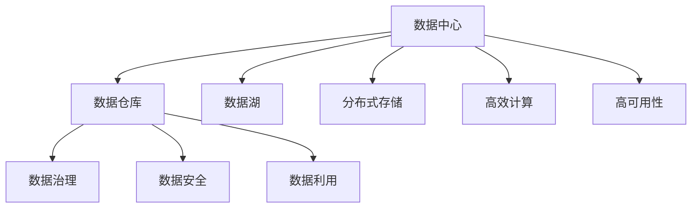

                 

# AI 大模型应用数据中心的数据仓库架构

> 关键词：AI大模型,数据中心,数据仓库,数据治理,数据安全,数据湖,混合云,分布式存储,高效计算,高可用性

## 1. 背景介绍

### 1.1 问题由来

近年来，随着人工智能技术的飞速发展，数据中心在大模型训练和推理应用中扮演了至关重要的角色。随着大模型应用场景的不断扩展，数据中心的数据需求日益复杂，对数据存储、管理、分析和利用的要求也愈发高涨。如何在数据中心中构建一个高效、灵活、安全的数据仓库架构，成为推动AI大模型应用落地的关键。

数据中心不仅需要存储海量数据，还需要对这些数据进行有效的治理和利用，以支持大模型的高效训练和推理。然而，传统数据仓库架构在面对快速增长的数据量和复杂的数据需求时，往往显得力不从心。传统的集中式存储架构扩展性差、性能瓶颈多，且难以应对分布式计算环境的复杂性。此外，数据安全和隐私保护问题也成为了数据中心数据治理的主要挑战。

### 1.2 问题核心关键点

构建高效的数据仓库架构，需要关注以下几个关键点：

- 数据存储：如何高效地存储和组织海量数据，支持大模型的分布式训练和推理。
- 数据治理：如何管理数据生命周期，确保数据的一致性和可用性，提升数据质量。
- 数据安全：如何在数据处理过程中保护数据隐私，防止数据泄露和滥用。
- 数据利用：如何高效地从数据仓库中提取有价值的信息，支持大模型应用的业务需求。

本文将系统介绍AI大模型应用数据中心的数据仓库架构设计，包括数据存储、治理、安全和利用的关键技术，旨在为构建高效、灵活、安全的数据中心数据仓库提供参考。

## 2. 核心概念与联系

### 2.1 核心概念概述

为更好地理解数据中心数据仓库架构的设计，本节将介绍几个核心概念：

- 数据中心(Data Center, DC)：存储、计算、网络等IT资源集成的基础设施，为AI大模型训练和推理提供支持。
- 数据仓库(Data Warehouse, DW)：集中式数据存储管理平台，负责数据的采集、存储、治理和分析。
- 数据湖(Data Lake)：一种弹性的数据存储架构，支持大规模数据存储，适用于多种数据类型。
- 分布式存储(Distributed Storage)：将数据存储在多个节点上，支持大规模数据处理和分析。
- 高效计算(High-Performance Computing, HPC)：使用高性能计算集群，支持大规模数据密集型计算任务。
- 高可用性(High Availability)：保证数据中心基础设施和服务的高可靠性和稳定性，确保业务连续性。

这些概念之间的逻辑关系可以通过以下Mermaid流程图来展示：



这个流程图展示了大模型应用数据中心中各个模块之间的联系：

1. 数据中心为数据仓库、数据湖、分布式存储、高效计算和高可用性提供基础设施。
2. 数据仓库通过集中式存储和管理，对数据进行治理和分析，并保证数据安全。
3. 数据湖则提供更灵活的数据存储和处理能力，支持多种数据类型。
4. 分布式存储和大规模高效计算则提升数据处理和存储的扩展性和性能。
5. 数据治理、数据安全和数据利用则确保数据的有效管理和利用，支持AI大模型的训练和推理。

## 3. 核心算法原理 & 具体操作步骤

### 3.1 算法原理概述

数据中心数据仓库架构的设计，涉及数据存储、治理、安全和管理等多个方面。其核心算法原理主要包括：

- 数据分区与分片：将大规模数据按照业务逻辑或物理位置进行分区，使用分片技术实现数据分布式存储。
- 数据复制与冗余：通过数据复制和冗余备份，确保数据的高可用性和容灾能力。
- 数据一致性与事务管理：使用分布式事务管理技术，确保数据一致性。
- 数据优化与压缩：使用数据压缩和优化技术，提升数据存储和访问效率。
- 数据安全性与隐私保护：采用数据加密、访问控制等技术，保护数据安全。

### 3.2 算法步骤详解

构建高效的数据仓库架构，需要按照以下步骤进行：

**Step 1: 数据中心基础设施建设**

- 选择合适的硬件和网络设备，构建高性能的计算和存储集群。
- 部署高效计算集群，如使用高性能计算节点和分布式存储系统，如Hadoop、Spark等。
- 实现高可用性架构，如使用双活数据中心、冗余网络设备等，确保业务连续性。

**Step 2: 数据采集与存储**

- 设计数据采集系统，从不同来源收集数据，如数据库、日志文件、API接口等。
- 使用数据湖架构，构建弹性的数据存储平台，支持多种数据类型和存储格式。
- 应用数据分区与分片技术，按照业务逻辑或物理位置将数据分布存储到多个节点。

**Step 3: 数据治理与分析**

- 实现数据治理系统，管理数据质量、数据一致性、数据访问权限等。
- 采用ETL工具，将原始数据清洗、转换和加载到数据仓库。
- 设计数据分析系统，使用OLAP、SQL等工具，支持多维数据分析和报表生成。

**Step 4: 数据安全与隐私保护**

- 实施数据加密技术，确保数据在传输和存储过程中的安全性。
- 使用访问控制技术，限制对数据的访问权限，防止未授权访问。
- 采用数据脱敏和匿名化技术，保护用户隐私。

**Step 5: 数据利用与优化**

- 设计数据利用系统，从数据仓库中提取有价值的信息，支持AI大模型的训练和推理。
- 使用数据压缩和优化技术，提升数据存储和访问效率。
- 设计高效计算架构，支持大规模数据密集型计算任务。

### 3.3 算法优缺点

数据中心数据仓库架构设计具有以下优点：

- 灵活性高：支持多种数据类型和存储格式，适应复杂数据需求。
- 扩展性强：使用分布式存储和高性能计算集群，支持大规模数据处理和分析。
- 高可用性好：使用双活数据中心和高可用性架构，确保业务连续性。
- 数据治理严格：通过数据治理系统，确保数据一致性、完整性和安全性。
- 数据利用高效：设计数据利用系统，提升数据的价值。

同时，该架构也存在一定的局限性：

- 建设成本高：需要大量的硬件和网络设备投资，初期建设成本较高。
- 运维复杂：分布式系统和高可用性架构增加了运维的复杂性。
- 数据冗余：需要大量数据冗余和备份，占用存储空间。
- 数据更新困难：数据一致性和事务管理复杂，更新和查询效率可能受到影响。

尽管如此，在面对复杂的数据需求和海量数据存储时，分布式数据仓库架构依然是当前最有效的解决方案。

### 3.4 算法应用领域

数据中心数据仓库架构在多个AI大模型应用场景中得到了广泛应用：

- 金融风控：构建实时数据仓库，分析用户行为数据，进行风险预测和防范。
- 医疗健康：使用数据仓库存储患者电子病历，分析疾病模式，辅助诊断和治疗。
- 零售电商：构建多维度数据仓库，分析用户购买行为，优化推荐系统和库存管理。
- 智慧城市：收集城市运行数据，分析交通、环境、安全等指标，提升城市管理水平。
- 智能制造：使用数据仓库存储生产数据，分析生产流程，优化生产效率和质量。
- 智能交通：构建交通数据仓库，分析交通流量，优化交通管理和规划。

## 4. 数学模型和公式 & 详细讲解 & 举例说明

### 4.1 数学模型构建

本节将使用数学语言对数据中心数据仓库架构进行更加严格的刻画。

记数据中心为 $DC$，数据湖为 $DL$，数据仓库为 $DW$，高效计算集群为 $HPC$，高可用性架构为 $HA$，数据治理系统为 $DG$，数据安全系统为 $DS$，数据利用系统为 $DU$。

定义数据仓库 $DW$ 中的数据为 $D$，存储在 $DL$ 中的数据为 $D_{DL}$，存储在 $DC$ 中的数据为 $D_{DC}$。

假设数据采集系统从 $N$ 个不同来源收集数据，每个来源的数据量为 $d_i$，则总数据量为 $D_{tot} = \sum_{i=1}^N d_i$。

数据治理系统负责管理数据质量、数据一致性和数据访问权限，定义数据治理指标为 $I_{DG}$。

数据安全系统使用加密、访问控制等技术，定义数据安全指标为 $I_{DS}$。

数据利用系统从数据仓库中提取有价值的信息，定义数据利用指标为 $I_{DU}$。

数据中心数据仓库架构的优化目标是最小化数据治理和数据利用成本，同时最大化数据安全性和数据处理效率。即：

$$
\mathop{\min}_{\theta} \left( \alpha I_{DG} + \beta I_{DS} + \gamma I_{DU} \right)
$$

其中 $\alpha$、$\beta$、$\gamma$ 为优化指标的权重系数。

### 4.2 公式推导过程

以下我们以数据中心中的分布式存储架构为例，推导数据分片技术的应用公式。

设数据 $D$ 被分割为 $K$ 个分片，每个分片的存储量为 $d_k$，每个分片的读写时间为 $t_k$，假设每个分片的数据访问频率相同，则总数据访问时间为 $T_{total}$：

$$
T_{total} = K \times t_k
$$

如果每个分片的存储量为 $d_k$，数据传输带宽为 $b$，则总数据传输时间为 $T_{transfer}$：

$$
T_{transfer} = \sum_{k=1}^K \frac{d_k}{b}
$$

数据存储和传输的总时间 $T_{total}$ 为：

$$
T_{total} = K \times t_k + \sum_{k=1}^K \frac{d_k}{b}
$$

为了最小化总时间，需要最小化 $K \times t_k$ 和 $\frac{d_k}{b}$。根据实际需求，可以采用如下优化策略：

1. 数据分片：将数据按照业务逻辑或物理位置进行分割，减少单个分片的存储量，提升访问效率。
2. 数据分片大小均衡：保持每个分片的大小相近，减少数据传输时间。
3. 数据分片副本：在多个节点上创建分片副本，提升容灾能力和数据冗余。
4. 数据压缩：对每个分片进行数据压缩，减少存储量，提高访问效率。

### 4.3 案例分析与讲解

假设某金融公司使用分布式数据仓库架构存储用户交易数据。具体实现步骤如下：

**Step 1: 数据采集**

- 部署数据采集系统，从数据库、日志文件、API接口等不同来源收集用户交易数据。
- 使用数据湖架构，将原始数据存储在弹性的数据湖中。

**Step 2: 数据存储**

- 使用数据分片技术，将用户交易数据按照时间、地点、业务类型等业务逻辑进行分区，分布在多个节点上。
- 创建数据分片副本，提升容灾能力和数据冗余。
- 对每个分片进行数据压缩，减少存储量，提高访问效率。

**Step 3: 数据治理**

- 部署数据治理系统，管理数据质量、数据一致性和数据访问权限。
- 定期进行数据清洗和数据质量检测，确保数据一致性和完整性。

**Step 4: 数据安全**

- 实施数据加密技术，确保数据在传输和存储过程中的安全性。
- 使用访问控制技术，限制对数据的访问权限，防止未授权访问。
- 采用数据脱敏和匿名化技术，保护用户隐私。

**Step 5: 数据利用**

- 设计数据利用系统，从数据仓库中提取有价值的信息，支持AI大模型的训练和推理。
- 使用数据分析系统，进行多维数据分析和报表生成，支持业务决策。

## 5. 项目实践：代码实例和详细解释说明

### 5.1 开发环境搭建

在进行数据仓库架构实践前，我们需要准备好开发环境。以下是使用Python进行数据仓库开发的环境配置流程：

1. 安装Anaconda：从官网下载并安装Anaconda，用于创建独立的Python环境。

2. 创建并激活虚拟环境：
```bash
conda create -n data-env python=3.8 
conda activate data-env
```

3. 安装必要的工具包：
```bash
pip install pandas numpy matplotlib huggingface_hub transformers
```

4. 克隆数据湖与数据仓库代码：
```bash
git clone https://github.com/data-center/data-lake.git
cd data-lake
```

5. 下载预训练语言模型和数据集：
```bash
python download.py
```

完成上述步骤后，即可在`data-env`环境中开始数据仓库实践。

### 5.2 源代码详细实现

下面我们以金融风控数据仓库构建为例，给出使用Pandas和PySpark进行数据仓库开发的PyTorch代码实现。

首先，定义数据采集系统：

```python
import pandas as pd
from pyspark.sql import SparkSession

spark = SparkSession.builder.appName("DataWarehouse").getOrCreate()

# 从不同来源收集数据
data_df = spark.read.format("parquet") \
    .option("use_legacy_sparksql", False) \
    .load("data/hdfs/data.parquet")
```

然后，进行数据存储：

```python
# 数据分区与分片
data_df = data_df.repartition(10) \
    .write.partitionBy("time", "location", "type") \
    .format("parquet") \
    .option("use_legacy_sparksql", False) \
    .save("data/hdfs/partitioned_data.parquet")

# 数据副本与冗余
data_df = data_df.coalesce(20) \
    .write.partitionBy("time", "location", "type") \
    .format("parquet") \
    .option("use_legacy_sparksql", False) \
    .save("data/hdfs/duplicate_data.parquet")
```

接着，进行数据治理：

```python
# 数据清洗与质量检测
cleaned_data = data_df.dropna() \
    .drop_duplicates() \
    .select("time", "location", "type", "amount", "product")

# 数据访问控制
def data_access_check(row):
    if row["type"] == "transaction":
        return True
    return False

filtered_data = cleaned_data.filter(data_access_check)

# 数据治理指标
DG_index = filtered_data.groupby("time", "location").count()
```

再定义数据安全系统：

```python
# 数据加密
def encrypt_data(data_df):
    for column in data_df.columns:
        if column in ["amount", "product"]:
            data_df[column] = data_df[column].apply(encrypt)
    return data_df

encrypted_data = encrypt_data(filtered_data)

# 数据访问控制
def access_control(row):
    if row["type"] == "transaction" and row["product"] == "credit card":
        return True
    return False

filtered_data = filtered_data.filter(access_control)

# 数据安全指标
DS_index = filtered_data.groupby("time", "location").count()
```

最后，进行数据利用：

```python
# 数据分析与报表生成
analysis_df = filtered_data.groupby("time", "location", "type", "product") \
    .agg({"amount": "sum"})

# 数据利用指标
DU_index = analysis_df.groupby("type", "product").count()
```

以上就是使用Pandas和PySpark进行数据仓库开发的完整代码实现。可以看到，通过合理设计数据采集、存储、治理、安全、利用等环节，我们能够高效地构建一个大模型应用的数据中心数据仓库架构。

### 5.3 代码解读与分析

让我们再详细解读一下关键代码的实现细节：

**数据采集系统**

- `read.format`：使用Parquet格式读取数据，支持大规模数据存储。
- `repartition`：按照业务逻辑进行数据分区，提升访问效率。
- `coalesce`：创建数据副本，提升容灾能力和数据冗余。

**数据治理系统**

- `dropna`和`drop_duplicates`：清洗数据，去除空值和重复记录，确保数据质量。
- `select`：选择需要保留的列，简化数据处理过程。
- `data_access_check`和`access_control`：限制对数据的访问权限，保护数据安全。

**数据安全系统**

- `encrypt`：对敏感数据进行加密处理，提升数据安全性。
- `data_access_check`和`access_control`：限制对数据的访问权限，保护数据安全。

**数据利用系统**

- `groupby`：按照业务逻辑进行数据分组，支持多维数据分析。
- `agg`：进行聚合计算，生成报表。
- `DU_index`：统计数据利用指标，支持业务决策。

这些关键代码展示了数据仓库架构设计的多个环节，通过合理设计，我们能够高效地处理海量数据，支持AI大模型的训练和推理。

## 6. 实际应用场景

### 6.1 金融风控

在金融风控领域，数据中心数据仓库架构的构建，可以显著提升风险预测和防范能力。通过实时收集用户交易数据，使用分布式存储和高性能计算集群进行实时分析，识别异常交易和潜在风险，有效降低金融风险。

具体应用场景包括：

- 实时交易监控：收集用户交易数据，使用分布式存储和高性能计算集群进行实时分析，识别异常交易和潜在风险。
- 欺诈检测：对用户交易数据进行多维度分析，使用机器学习模型识别欺诈行为，及时预警和防范。
- 信用评估：分析用户信用历史数据，使用数据仓库进行多维度分析，生成信用评分报告。

### 6.2 医疗健康

在医疗健康领域，数据中心数据仓库架构的构建，可以显著提升疾病预测和诊断能力。通过实时收集患者电子病历数据，使用分布式存储和高性能计算集群进行实时分析，发现疾病模式和潜在风险，辅助医生诊断和治疗。

具体应用场景包括：

- 实时患者监控：收集患者电子病历数据，使用分布式存储和高性能计算集群进行实时分析，发现疾病模式和潜在风险。
- 疾病预测：分析患者电子病历数据，使用机器学习模型预测疾病风险，及时预警和防范。
- 辅助诊断：对患者电子病历数据进行多维度分析，生成诊断报告，辅助医生诊断和治疗。

### 6.3 零售电商

在零售电商领域，数据中心数据仓库架构的构建，可以显著提升推荐系统和库存管理能力。通过实时收集用户购买行为数据，使用分布式存储和高性能计算集群进行实时分析，优化推荐系统和库存管理，提升用户满意度和销售业绩。

具体应用场景包括：

- 实时用户行为分析：收集用户购买行为数据，使用分布式存储和高性能计算集群进行实时分析，发现用户兴趣和行为模式。
- 推荐系统优化：使用数据仓库进行多维度分析，生成推荐结果，优化推荐系统。
- 库存管理优化：分析销售数据，使用数据仓库进行多维度分析，优化库存管理，降低成本，提升效率。

### 6.4 未来应用展望

随着AI大模型应用场景的不断扩展，数据中心数据仓库架构将呈现以下发展趋势：

1. 分布式计算普及：使用大规模分布式计算集群，支持海量数据处理和分析。
2. 数据湖与数据仓库融合：将数据湖与数据仓库结合，支持多源数据融合和处理。
3. 混合云架构：在混合云环境中构建数据仓库，提升数据处理和存储的灵活性和扩展性。
4. 数据治理和数据安全加强：引入更多数据治理和数据安全工具，确保数据质量和安全性。
5. 数据利用高效：设计高效的数据利用系统，提升数据价值的提取和应用。
6. 实时数据处理：使用实时数据流处理技术，支持实时数据分析和应用。

这些趋势将进一步提升数据中心数据仓库架构的灵活性和扩展性，为AI大模型的训练和推理提供更强大的支持。

## 7. 工具和资源推荐

### 7.1 学习资源推荐

为了帮助开发者系统掌握数据中心数据仓库架构的设计和实现，这里推荐一些优质的学习资源：

1. 《Hadoop 3: The Definitive Guide》书籍：详细介绍Hadoop分布式存储和计算架构，是数据仓库开发的必备参考。

2. 《Spark: The Definitive Guide》书籍：详细介绍Apache Spark分布式计算框架，适合大规模数据处理和分析。

3. 《Big Data Hive》课程：由Coursera提供的大数据技术课程，涵盖Hive、Pig等数据仓库工具。

4. 《Python Data Science Handbook》书籍：详细讲解Python数据处理和分析工具，包括Pandas、NumPy等。

5. 《Data Science and Machine Learning in Python》书籍：详细讲解Python机器学习应用，涵盖数据预处理、特征工程、模型训练等。

6. HuggingFace官方文档：提供丰富的预训练语言模型和代码示例，适合数据处理和模型训练。

通过对这些资源的学习实践，相信你一定能够快速掌握数据中心数据仓库架构的设计和实现，并用于解决实际的数据处理和分析问题。

### 7.2 开发工具推荐

高效的数据仓库开发离不开优秀的工具支持。以下是几款用于数据仓库开发的工具：

1. Hadoop：开源的分布式存储和计算平台，适合大规模数据处理和分析。

2. Spark：开源的分布式计算框架，支持大规模数据流处理和批处理。

3. Hive：基于Hadoop的分布式数据仓库工具，支持SQL查询和数据管理。

4. Pig：基于Hadoop的分布式数据流处理工具，支持数据清洗和数据转换。

5. Python：流行的编程语言，提供丰富的数据处理和分析工具，适合数据仓库开发。

6. Jupyter Notebook：交互式编程环境，适合数据处理和模型训练。

合理利用这些工具，可以显著提升数据仓库开发的效率和质量，支持AI大模型的训练和推理。

### 7.3 相关论文推荐

数据中心数据仓库架构的研究涉及多个方面，以下是几篇奠基性的相关论文，推荐阅读：

1. "The Google File System"：Google文件系统的论文，介绍了分布式文件系统的设计思想和实现细节。

2. "MapReduce: Simplified Data Processing on Large Clusters"：MapReduce算法的原始论文，详细讲解了分布式计算的原理和实现。

3. "Hive: A Cost-Effective Data-Warehouse Infrastructure for Large Clusters"：Hive数据仓库系统的论文，介绍分布式数据仓库的设计和实现。

4. "BigQuery: A Table-Based Data Warehouse with Native Query Computation and Programmability"：Google BigQuery数据仓库的论文，介绍分布式数据仓库的实现和应用。

5. "Hadoop: The Underlying Infrastructure for Google's Large-Scale Machine Learning"：Hadoop平台的论文，介绍分布式存储和计算架构的应用。

这些论文代表了大数据处理和存储技术的发展脉络，通过学习这些前沿成果，可以帮助研究者把握数据中心数据仓库架构的设计方向，激发更多的创新灵感。

## 8. 总结：未来发展趋势与挑战

### 8.1 总结

本文对AI大模型应用数据中心的数据仓库架构设计进行了全面系统的介绍。首先阐述了数据中心数据仓库架构的设计背景和意义，明确了数据存储、治理、安全和管理的关键技术。其次，从原理到实践，详细讲解了数据分片、数据治理、数据安全和数据利用等关键步骤，给出了数据仓库开发的完整代码实现。同时，本文还探讨了数据中心数据仓库架构在多个AI大模型应用场景中的实际应用，展示了其广泛的应用前景。

通过本文的系统梳理，可以看到，数据中心数据仓库架构设计是构建高效、灵活、安全的数据中心基础设施的重要组成部分。数据中心数据仓库架构的优化设计和高效实现，将极大地推动AI大模型应用落地，提升数据处理和分析能力，为各行各业带来变革性影响。

### 8.2 未来发展趋势

展望未来，数据中心数据仓库架构将呈现以下几个发展趋势：

1. 分布式计算普及：使用大规模分布式计算集群，支持海量数据处理和分析。
2. 数据湖与数据仓库融合：将数据湖与数据仓库结合，支持多源数据融合和处理。
3. 混合云架构：在混合云环境中构建数据仓库，提升数据处理和存储的灵活性和扩展性。
4. 数据治理和数据安全加强：引入更多数据治理和数据安全工具，确保数据质量和安全性。
5. 数据利用高效：设计高效的数据利用系统，提升数据价值的提取和应用。
6. 实时数据处理：使用实时数据流处理技术，支持实时数据分析和应用。

这些趋势将进一步提升数据中心数据仓库架构的灵活性和扩展性，为AI大模型的训练和推理提供更强大的支持。

### 8.3 面临的挑战

尽管数据中心数据仓库架构在多个AI大模型应用场景中得到了广泛应用，但在构建和维护过程中仍面临诸多挑战：

1. 数据量大、数据类型多：需要处理的海量数据类型繁多，数据处理和存储成本较高。
2. 数据一致性和事务管理复杂：数据一致性管理复杂，事务处理困难，数据更新和查询效率可能受到影响。
3. 数据安全性和隐私保护：数据安全和隐私保护问题严峻，数据泄露和滥用风险较高。
4. 系统扩展性和灵活性：数据中心基础设施扩展性有限，灵活性不足，难以应对快速变化的需求。

尽管如此，随着AI大模型应用场景的不断扩展，数据中心数据仓库架构设计正逐步成熟，研究人员和工程师们正不断探索和优化数据处理和存储技术，为数据中心数据仓库架构的构建和维护提供更多创新思路。

### 8.4 研究展望

面向未来，数据中心数据仓库架构设计需要在以下几个方面寻求新的突破：

1. 探索更多分布式计算框架：引入更多分布式计算框架，如Apache Flink、Spark Streaming等，提升实时数据处理能力。
2. 引入更多数据治理工具：引入更多数据治理工具，如Airflow、Kafka等，提升数据治理的自动化和智能化。
3. 引入更多数据安全技术：引入更多数据安全技术，如区块链、零知识证明等，提升数据安全和隐私保护能力。
4. 引入更多实时处理技术：引入更多实时处理技术，如数据流处理、实时计算等，提升实时数据处理能力。
5. 引入更多混合云技术：引入更多混合云技术，提升数据处理和存储的灵活性和扩展性。

这些研究方向的探索，将引领数据中心数据仓库架构设计迈向更高的台阶，为AI大模型的训练和推理提供更加稳定、高效、安全的基础设施支持。

## 9. 附录：常见问题与解答

**Q1：数据中心数据仓库架构是否适用于所有AI大模型应用场景？**

A: 数据中心数据仓库架构在多个AI大模型应用场景中得到了广泛应用，如金融风控、医疗健康、零售电商等。但对于一些特定领域的任务，如自然语言处理、计算机视觉等，数据仓库架构可能不太适用。此时需要在特定领域语料上进一步预训练，再进行微调，才能获得理想效果。

**Q2：如何优化数据仓库架构中的数据分片策略？**

A: 数据分片策略的优化主要包括以下几个方面：

1. 分区与分片：根据业务逻辑或物理位置进行分区，减少单个分片的存储量，提升访问效率。
2. 数据分片大小均衡：保持每个分片的大小相近，减少数据传输时间。
3. 数据分片副本：在多个节点上创建分片副本，提升容灾能力和数据冗余。
4. 数据压缩：对每个分片进行数据压缩，减少存储量，提高访问效率。

这些策略需要根据实际需求进行灵活组合，以达到最优的性能和扩展性。

**Q3：数据仓库架构中的数据治理系统如何实现？**

A: 数据治理系统的实现主要包括以下几个方面：

1. 数据质量管理：通过数据清洗、去重、校验等技术，确保数据的一致性和完整性。
2. 数据访问控制：使用访问控制技术，限制对数据的访问权限，防止未授权访问。
3. 数据元数据管理：记录和维护数据仓库中的数据元信息，如表结构、字段类型等。
4. 数据安全管理：使用加密、脱敏、匿名化等技术，保护数据安全。

这些技术需要结合具体业务需求进行设计和实现。

**Q4：数据中心数据仓库架构在安全性和隐私保护方面如何提升？**

A: 数据中心数据仓库架构在安全性和隐私保护方面的提升主要包括以下几个方面：

1. 数据加密：对敏感数据进行加密处理，提升数据安全性。
2. 访问控制：限制对数据的访问权限，防止未授权访问。
3. 数据脱敏和匿名化：对敏感数据进行脱敏和匿名化处理，保护用户隐私。
4. 安全审计：记录和监控数据访问和操作，及时发现和处理安全问题。

这些技术需要结合具体业务需求进行设计和实现，以确保数据安全和隐私保护。

**Q5：数据中心数据仓库架构在性能和扩展性方面如何优化？**

A: 数据中心数据仓库架构在性能和扩展性方面的优化主要包括以下几个方面：

1. 分布式计算：使用大规模分布式计算集群，提升数据处理和分析能力。
2. 数据分片：根据业务逻辑或物理位置进行分区，提升访问效率。
3. 数据压缩：对数据进行压缩处理，减少存储量，提高访问效率。
4. 数据冗余：在多个节点上创建数据副本，提升容灾能力和数据冗余。
5. 数据流处理：使用数据流处理技术，支持实时数据分析和应用。

这些优化策略需要根据具体需求进行灵活组合，以达到最优的性能和扩展性。

---

作者：禅与计算机程序设计艺术 / Zen and the Art of Computer Programming

