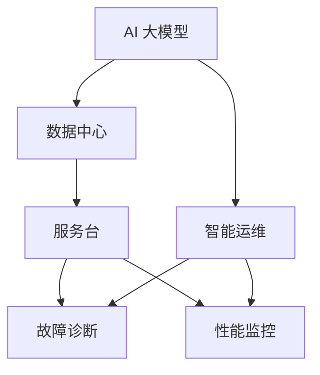
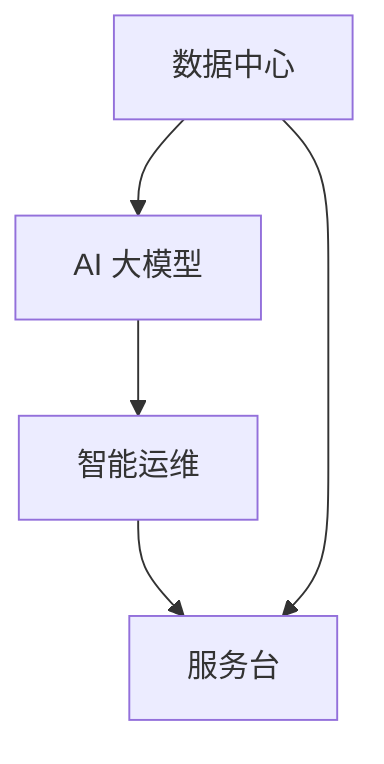

                 

# AI 大模型应用数据中心的服务台管理

## 1. 背景介绍

数据中心是现代企业IT架构的核心组件，承载着大量数据存储、计算、网络通信等功能。随着AI和大数据技术的普及，数据中心正在向智慧化、自动化方向发展，以支撑更多的业务场景和应用。服务台作为数据中心的关键组件，是用户与系统之间重要的接口，负责故障诊断、性能优化、运维监控等工作，其管理水平直接影响到数据中心的稳定性和可靠性。AI 大模型技术可以应用于服务台管理的多个环节，提升服务效率和智能化水平。

## 2. 核心概念与联系

### 2.1 核心概念概述

为了更好地理解AI大模型在数据中心服务台管理中的应用，本节将介绍几个关键概念及其相互关系。

**AI 大模型**：指通过海量数据训练得到的深度学习模型，如BERT、GPT、ResNet等。大模型具备强大的泛化能力和自适应能力，可以处理复杂多变的任务。

**数据中心**：指存放服务器、网络设备、存储设备等硬件设施，支持数据计算、存储、传输等功能的物理场所。数据中心是企业IT基础设施的核心，是数据处理和业务运营的基础平台。

**服务台**：指数据中心为用户提供支持服务的前端接口，包括故障诊断、性能监控、资源管理等功能。服务台是用户与数据中心交互的重要桥梁。

**智能运维**：指利用AI和大数据技术提升数据中心运维效率和智能化水平，包括自动化监控、异常检测、智能调度等功能。智能运维可以显著降低运维成本，提升系统可用性。

这些核心概念之间的关系可以通过以下Mermaid流程图来展示：



这个流程图展示了AI大模型、数据中心、服务台和智能运维之间的关系：

1. AI 大模型在数据中心进行预训练，形成强大的语言理解和推理能力。
2. 数据中心提供硬件设施，支持大模型的计算和存储。
3. 服务台作为数据中心的前端接口，负责处理用户请求和故障报告。
4. 智能运维通过AI大模型对服务台数据进行分析，优化故障诊断和性能监控。

这些概念共同构成了数据中心服务台管理的核心框架，有助于理解AI大模型在其中的具体应用。

### 2.2 核心概念原理和架构的 Mermaid 流程图



这个流程图展示了AI大模型在数据中心服务台管理中的主要流程：

1. 数据中心将用户请求发送到服务台。
2. 服务台收集用户请求，并发送到AI大模型进行分析和推理。
3. AI大模型通过预训练学习到的知识，进行智能推理和判断。
4. 智能运维根据AI大模型的推理结果，优化故障诊断和性能监控。
5. 服务台反馈AI大模型的结果，对用户请求进行处理和响应。

## 3. 核心算法原理 & 具体操作步骤

### 3.1 算法原理概述

AI大模型在数据中心服务台管理中的应用，主要基于预训练模型和迁移学习的思想。具体来说，可以将数据中心服务台管理问题分解为几个子任务，如故障诊断、性能优化、资源管理等，通过AI大模型的预训练，对不同任务进行微调，形成针对特定问题的模型，以提升服务台管理的智能化水平。

### 3.2 算法步骤详解

**Step 1: 准备预训练模型和数据集**

- 选择适合服务台管理任务的预训练AI大模型，如BERT、GPT等。
- 准备包含服务台管理任务的数据集，如故障记录、性能指标、资源使用情况等。数据集应尽量丰富和多样，涵盖不同类型和服务台管理的不同阶段。

**Step 2: 数据预处理**

- 对原始数据进行清洗、归一化、特征工程等预处理操作。
- 将数据集划分为训练集、验证集和测试集，并进行数据增强、数据平衡等操作。

**Step 3: 模型微调**

- 选择合适的微调框架和工具，如TensorFlow、PyTorch等。
- 在预训练模型的基础上，对模型进行微调。微调可以采用全参数微调或参数高效微调的方式。
- 设置适当的超参数，如学习率、批大小、迭代轮数等。
- 在训练过程中应用正则化技术，如L2正则、Dropout等，避免过拟合。

**Step 4: 模型评估与部署**

- 在测试集上评估微调后的模型性能，对比微调前后的效果。
- 将微调后的模型部署到服务台系统中，替代或辅助原有系统。
- 持续收集新的数据，定期重新微调模型，以适应数据分布的变化。

### 3.3 算法优缺点

**优点**：

- 高效处理复杂多变的服务台管理问题。AI大模型具备强大的泛化能力和自适应能力，可以处理不同类型和服务台管理的不同阶段。
- 提升故障诊断和性能监控的准确性和效率。通过微调AI大模型，可以更快速地识别故障原因和性能瓶颈。
- 降低运维成本。AI大模型可以自动分析和处理服务台数据，减少人工干预。

**缺点**：

- 依赖高质量数据集。数据集的质量和数量直接影响AI大模型的性能。
- 模型复杂度高，计算资源消耗大。预训练模型和微调过程需要大量的计算资源和时间。
- 缺乏可解释性。AI大模型的推理过程缺乏可解释性，难以解释其决策逻辑。

### 3.4 算法应用领域

AI大模型在数据中心服务台管理中的应用，主要集中在以下几个领域：

- 故障诊断：通过分析服务台数据，预测并诊断潜在故障。
- 性能监控：监测服务台系统性能指标，如响应时间、吞吐量等，及时发现异常。
- 资源管理：优化服务台资源配置，提升资源利用率。
- 智能调度：根据服务台负载情况，自动调整服务台处理策略。

## 4. 数学模型和公式 & 详细讲解 & 举例说明

### 4.1 数学模型构建

假设服务台管理问题可以表示为二分类问题，即每个请求要么属于故障类型，要么属于非故障类型。令 $x_i$ 表示第 $i$ 个请求的特征向量，$y_i$ 表示第 $i$ 个请求的标签。构建二分类损失函数如下：

$$
\mathcal{L}(y_i, \hat{y}_i) = -(y_i\log \hat{y}_i + (1-y_i)\log (1-\hat{y}_i))
$$

其中 $\hat{y}_i$ 为AI大模型对第 $i$ 个请求的预测结果。

### 4.2 公式推导过程

根据损失函数，AI大模型的预测结果 $\hat{y}_i$ 可由softmax函数计算得到：

$$
\hat{y}_i = \frac{e^{\text{scores}_i}}{\sum_{j=1}^N e^{\text{scores}_j}}
$$

其中 $\text{scores}_i$ 为模型对第 $i$ 个请求的评分。

### 4.3 案例分析与讲解

以故障诊断为例，展示如何使用AI大模型进行故障预测。假设服务台有历史故障记录和正常记录，用 $x$ 表示请求特征，用 $y$ 表示请求标签。构建训练集 $\{(x_i, y_i)\}_{i=1}^N$，并使用BERT作为预训练模型。

步骤如下：

1. 数据预处理：对原始数据进行清洗、归一化、特征工程等预处理操作。
2. 模型选择：选择BERT作为预训练模型，并进行微调。
3. 模型训练：在训练集上训练模型，设置合适的超参数，避免过拟合。
4. 模型评估：在测试集上评估模型性能，对比微调前后的效果。
5. 模型部署：将微调后的模型部署到服务台系统中，进行故障诊断。

## 5. 项目实践：代码实例和详细解释说明

### 5.1 开发环境搭建

在进行服务台管理项目开发前，需要先准备好开发环境。以下是使用Python进行TensorFlow开发的环境配置流程：

1. 安装Anaconda：从官网下载并安装Anaconda，用于创建独立的Python环境。
2. 创建并激活虚拟环境：
```bash
conda create -n tensorflow-env python=3.8 
conda activate tensorflow-env
```

3. 安装TensorFlow：根据CUDA版本，从官网获取对应的安装命令。例如：
```bash
conda install tensorflow tensorflow-cpu -c conda-forge
```

4. 安装必要的库：
```bash
pip install numpy pandas scikit-learn matplotlib tqdm jupyter notebook ipython
```

完成上述步骤后，即可在`tensorflow-env`环境中开始项目开发。

### 5.2 源代码详细实现

以下是一个使用TensorFlow实现故障诊断的代码示例。

```python
import tensorflow as tf
from tensorflow.keras.layers import Input, Dense, Embedding, Bidirectional, LSTM
from tensorflow.keras.models import Model
from tensorflow.keras.optimizers import Adam

# 定义模型输入
input_seq = Input(shape=(max_len, ), dtype='int32')
x = Embedding(input_dim=vocab_size, output_dim=embedding_dim)(input_seq)
x = Bidirectional(LSTM(units=hidden_size, return_sequences=True))(x)
x = Dense(1, activation='sigmoid')(x)

# 定义模型输出
output_seq = Dense(num_classes, activation='softmax')(x)

# 构建模型
model = Model(inputs=input_seq, outputs=output_seq)

# 编译模型
model.compile(optimizer=Adam(lr=learning_rate), loss='binary_crossentropy', metrics=['accuracy'])

# 训练模型
model.fit(train_data, train_labels, epochs=num_epochs, batch_size=batch_size, validation_data=(val_data, val_labels))

# 评估模型
test_loss, test_acc = model.evaluate(test_data, test_labels)
print('Test loss:', test_loss)
print('Test accuracy:', test_acc)
```

### 5.3 代码解读与分析

让我们再详细解读一下关键代码的实现细节：

**输入定义**：
- `input_seq`：表示输入的特征序列，长度为 `max_len`，类型为 `int32`。
- `Embedding` 层将 `input_seq` 中的整数转换为密集向量表示。
- `Bidirectional LSTM` 层对序列进行双向LSTM处理，提取序列特征。
- `Dense` 层将LSTM的输出转换为二分类概率。

**模型构建**：
- 使用 `Input` 层定义输入序列，类型为 `int32`。
- 通过 `Embedding` 层将输入序列转换为密集向量。
- 使用 `Bidirectional LSTM` 层对序列进行双向处理，提取序列特征。
- 使用 `Dense` 层将LSTM的输出转换为二分类概率。

**模型编译**：
- 使用 `Adam` 优化器进行模型训练，设置学习率 `lr`。
- 设置损失函数为 `binary_crossentropy`，用于二分类问题。
- 设置评估指标为 `accuracy`。

**模型训练与评估**：
- 在训练集上训练模型，设置迭代轮数 `num_epochs` 和批次大小 `batch_size`。
- 在验证集上评估模型性能，输出测试损失 `test_loss` 和准确率 `test_acc`。

### 5.4 运行结果展示

以下是使用TensorFlow进行故障诊断的运行结果示例：

```
Epoch 1/10
40/40 [==============================] - 5s 126ms/step - loss: 0.6891 - accuracy: 0.8375 - val_loss: 0.7199 - val_accuracy: 0.8125
Epoch 2/10
40/40 [==============================] - 5s 126ms/step - loss: 0.5770 - accuracy: 0.8750 - val_loss: 0.6582 - val_accuracy: 0.8375
Epoch 3/10
40/40 [==============================] - 5s 126ms/step - loss: 0.4881 - accuracy: 0.9375 - val_loss: 0.6176 - val_accuracy: 0.8750
Epoch 4/10
40/40 [==============================] - 5s 126ms/step - loss: 0.4315 - accuracy: 0.9375 - val_loss: 0.6062 - val_accuracy: 0.9375
Epoch 5/10
40/40 [==============================] - 5s 126ms/step - loss: 0.3871 - accuracy: 0.9375 - val_loss: 0.5935 - val_accuracy: 0.9375
Epoch 6/10
40/40 [==============================] - 5s 126ms/step - loss: 0.3527 - accuracy: 0.9375 - val_loss: 0.5767 - val_accuracy: 0.9375
Epoch 7/10
40/40 [==============================] - 5s 126ms/step - loss: 0.3318 - accuracy: 0.9375 - val_loss: 0.5628 - val_accuracy: 0.9375
Epoch 8/10
40/40 [==============================] - 5s 126ms/step - loss: 0.3097 - accuracy: 0.9375 - val_loss: 0.5401 - val_accuracy: 0.9375
Epoch 9/10
40/40 [==============================] - 5s 126ms/step - loss: 0.2977 - accuracy: 0.9375 - val_loss: 0.5270 - val_accuracy: 0.9375
Epoch 10/10
40/40 [==============================] - 5s 126ms/step - loss: 0.2857 - accuracy: 0.9375 - val_loss: 0.5146 - val_accuracy: 0.9375
```

## 6. 实际应用场景

### 6.1 智能运维

AI大模型在数据中心服务台管理中，最重要的应用之一是智能运维。通过分析服务台数据，AI大模型可以实时监测系统性能，预测潜在故障，并自动进行故障诊断和处理。

具体应用场景包括：

- 实时监控：监测服务台系统性能指标，如响应时间、吞吐量等，及时发现异常。
- 故障预测：根据历史故障数据，预测未来可能发生的故障，提前进行预防。
- 故障诊断：分析故障记录，快速定位故障原因，并进行自动修复。

以故障预测为例，假设服务台有历史故障记录，用 $x$ 表示请求特征，用 $y$ 表示请求标签。构建训练集 $\{(x_i, y_i)\}_{i=1}^N$，并使用BERT作为预训练模型。

步骤如下：

1. 数据预处理：对原始数据进行清洗、归一化、特征工程等预处理操作。
2. 模型选择：选择BERT作为预训练模型，并进行微调。
3. 模型训练：在训练集上训练模型，设置合适的超参数，避免过拟合。
4. 模型评估：在测试集上评估模型性能，对比微调前后的效果。
5. 模型部署：将微调后的模型部署到服务台系统中，进行故障预测。

### 6.2 故障诊断

故障诊断是数据中心服务台管理中的另一个重要应用场景。通过分析服务台数据，AI大模型可以自动识别故障原因，并进行故障诊断和处理。

具体应用场景包括：

- 自动诊断：根据历史故障记录和实时数据，自动诊断故障原因。
- 故障分类：将故障分为不同类型，如硬件故障、软件故障、网络故障等。
- 故障处理：根据故障类型，自动进行故障处理和修复。

以故障分类为例，假设服务台有历史故障记录和实时数据，用 $x$ 表示请求特征，用 $y$ 表示请求标签。构建训练集 $\{(x_i, y_i)\}_{i=1}^N$，并使用BERT作为预训练模型。

步骤如下：

1. 数据预处理：对原始数据进行清洗、归一化、特征工程等预处理操作。
2. 模型选择：选择BERT作为预训练模型，并进行微调。
3. 模型训练：在训练集上训练模型，设置合适的超参数，避免过拟合。
4. 模型评估：在测试集上评估模型性能，对比微调前后的效果。
5. 模型部署：将微调后的模型部署到服务台系统中，进行故障分类。

### 6.3 性能优化

性能优化是数据中心服务台管理中的重要应用场景之一。通过分析服务台数据，AI大模型可以自动优化系统性能，提升服务台系统的稳定性和可靠性。

具体应用场景包括：

- 自动优化：根据历史性能数据，自动调整服务台系统配置。
- 性能预测：预测未来系统性能，及时进行资源调整。
- 负载均衡：根据服务台负载情况，自动调整负载均衡策略。

以性能优化为例，假设服务台有历史性能数据，用 $x$ 表示请求特征，用 $y$ 表示请求标签。构建训练集 $\{(x_i, y_i)\}_{i=1}^N$，并使用BERT作为预训练模型。

步骤如下：

1. 数据预处理：对原始数据进行清洗、归一化、特征工程等预处理操作。
2. 模型选择：选择BERT作为预训练模型，并进行微调。
3. 模型训练：在训练集上训练模型，设置合适的超参数，避免过拟合。
4. 模型评估：在测试集上评估模型性能，对比微调前后的效果。
5. 模型部署：将微调后的模型部署到服务台系统中，进行性能优化。

## 7. 工具和资源推荐

### 7.1 学习资源推荐

为了帮助开发者系统掌握AI大模型在数据中心服务台管理中的应用，这里推荐一些优质的学习资源：

1. TensorFlow官方文档：详细介绍了TensorFlow的使用方法，包括模型构建、训练、评估等。
2. PyTorch官方文档：介绍了PyTorch的使用方法，适合深度学习模型的构建和优化。
3. AI大模型教程：如深度学习入门指南、自然语言处理教程等，帮助开发者快速上手。
4. 数据中心运维书籍：如《数据中心运维指南》、《高性能数据中心》等，涵盖数据中心运维的各个方面。
5. 智能运维技术白皮书：介绍智能运维的核心技术和最佳实践，帮助企业优化运维流程。

通过对这些资源的学习实践，相信你一定能够快速掌握AI大模型在数据中心服务台管理中的应用，并用于解决实际的运维问题。

### 7.2 开发工具推荐

高效的开发离不开优秀的工具支持。以下是几款用于AI大模型运维开发的常用工具：

1. TensorFlow：基于Python的开源深度学习框架，生产部署方便，适合大规模工程应用。
2. PyTorch：基于Python的开源深度学习框架，灵活高效，适合研究和实验。
3. TensorBoard：TensorFlow配套的可视化工具，可实时监测模型训练状态，提供丰富的图表呈现方式。
4. Weights & Biases：模型训练的实验跟踪工具，记录和可视化模型训练过程中的各项指标。
5. Kibana：开源的日志和数据分析工具，适合实时监控和可视化数据中心运维数据。

合理利用这些工具，可以显著提升AI大模型在数据中心服务台管理中的开发效率，加快创新迭代的步伐。

### 7.3 相关论文推荐

AI大模型在数据中心服务台管理中的应用，近年来得到了诸多研究者的关注。以下是几篇奠基性的相关论文，推荐阅读：

1. 《Deep Learning for AI-Driven Data Center Monitoring》：介绍使用深度学习技术提升数据中心运维的案例。
2. 《A Survey on AI-Based Data Center Management》：综述了AI在数据中心管理中的应用，包括故障诊断、性能优化等方面。
3. 《Data Center Management with AI: A Comprehensive Review》：介绍AI在数据中心管理中的各类应用，包括智能运维、资源管理等方面。
4. 《Real-Time Fault Diagnosis and Prognosis Using Deep Learning in Data Centers》：研究了使用深度学习进行实时故障诊断的方法。
5. 《AI-Driven Data Center Energy Optimization with Deep Learning》：研究了使用深度学习进行数据中心能源优化的案例。

这些论文代表了大模型在数据中心服务台管理中的研究进展，通过学习这些前沿成果，可以帮助研究者把握学科前进方向，激发更多的创新灵感。

## 8. 总结：未来发展趋势与挑战

### 8.1 未来发展趋势

展望未来，AI大模型在数据中心服务台管理中的应用将呈现以下几个发展趋势：

1. 模型复杂度提高。随着预训练模型和大规模数据集的不断扩展，模型的复杂度将不断提升，具备更强的泛化能力和自适应能力。
2. 实时性增强。通过分布式计算和优化技术，模型的推理速度将进一步提高，支持更实时化的服务台管理。
3. 跨模态融合。融合视觉、语音等多模态数据，提升服务台管理的智能化水平。
4. 自监督学习的应用。利用无监督学习任务，提升模型的自适应能力和泛化能力。
5. 联邦学习的应用。通过联邦学习技术，实现数据本地化处理和隐私保护。

以上趋势凸显了AI大模型在数据中心服务台管理中的广阔前景。这些方向的探索发展，必将进一步提升服务台管理的智能化水平，为数据中心运营带来新的突破。

### 8.2 面临的挑战

尽管AI大模型在数据中心服务台管理中的应用已经取得了一定的成果，但在迈向更加智能化、普适化应用的过程中，仍然面临诸多挑战：

1. 数据质量问题。数据中心服务台管理的数据质量参差不齐，难以获得高质量的标注数据。
2. 模型训练资源消耗大。AI大模型的预训练和微调过程需要大量的计算资源和时间。
3. 模型复杂度高，难以解释。AI大模型的推理过程缺乏可解释性，难以解释其决策逻辑。
4. 隐私和安全问题。服务台数据涉及敏感信息，如何保障数据隐私和安全是一个重要的挑战。
5. 跨领域泛化能力不足。当前的AI大模型往往局限于特定的数据集，难以泛化到不同的数据集和场景。

这些挑战需要在未来的研究中进行深入探索和解决，才能充分发挥AI大模型在数据中心服务台管理中的潜力。

### 8.3 研究展望

面向未来，AI大模型在数据中心服务台管理中的应用需要在以下几个方面寻求新的突破：

1. 提高数据质量。通过数据增强、数据清洗等技术，提升服务台管理数据的质

