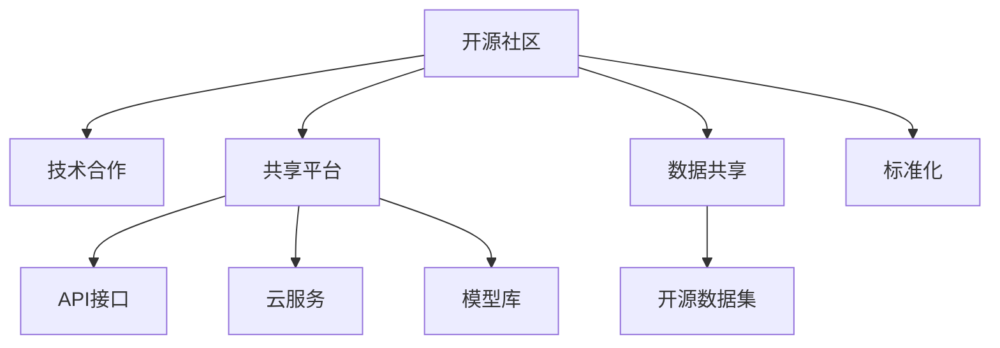

                 

# AI 开源生态：共建共享的技术创新平台

> 关键词：开源生态, AI 技术创新, 共建共享, 技术社区, 合作平台, 开放数据

## 1. 背景介绍

### 1.1 问题由来
近年来，人工智能(AI)技术迅速发展，成为驱动各行各业创新升级的核心动力。AI技术覆盖的领域广泛，包括自然语言处理(NLP)、计算机视觉、语音识别、机器人技术等。然而，AI技术的深度和复杂度不断提升，任何单一机构难以独自掌握所有关键技术，难以完成复杂且全面的人工智能项目。

在这样一个趋势下，开源生态的重要性日益凸显。通过构建开源社区和共享平台，集结全球范围内的技术力量，不仅可以促进技术的快速迭代和应用普及，还能提高AI技术的合作效率和创新能力。共建共享的AI开源生态，已成为引领AI技术发展的重要途径。

### 1.2 问题核心关键点
在AI开源生态的建设过程中，关键点如下：

- **开源社区与平台建设**：如何建立一个既能支持学术研究，又能满足产业应用需求的开放社区和平台，成为首要挑战。
- **技术标准与规范**：如何定义一致的技术标准与规范，保障不同开发者之间能够无缝协作。
- **数据共享与隐私保护**：如何实现数据的开放共享，同时保证数据的隐私和安全。
- **商业与公益的平衡**：如何在商业和公益之间找到合适的平衡点，既满足企业应用需求，又不失公益社区的特色。
- **国际合作与本地化**：如何构建国际化的同时，针对不同地区特点进行调整和优化。

本文将从这些核心关键点出发，深入探讨AI开源生态的构建和共治共享机制，提供全面系统的分析，以期为相关技术社区和平台建设提供理论指导和实践参考。

## 2. 核心概念与联系

### 2.1 核心概念概述

AI开源生态涉及多个关键概念，包括开源社区、共享平台、技术合作、数据共享、标准化等。

- **开源社区**：由志愿者或开发者自发组成的开源社区，提供协作开发、代码托管、文档分享、社区交流等服务。
- **共享平台**：提供API接口、云服务、模型库等资源，支持开发者快速集成和使用AI技术。
- **技术合作**：通过开源社区或共享平台，开发者可以在不同机构、公司和研究团队之间进行技术合作和共享。
- **数据共享**：提供可访问、可复用的开源数据集，满足不同开发者在数据上的需求。
- **标准化**：制定统一的技术标准和规范，保障不同系统间的互操作性和兼容性。

这些概念相互交织，共同构成了AI开源生态的基石。理解并合理运用这些概念，有助于构建健康、高效、可持续发展的AI开源生态。

### 2.2 核心概念原理和架构的 Mermaid 流程图



通过上述流程图，可以看到各个概念间的内在联系：

1. 开源社区为技术合作提供基础；
2. 共享平台承载技术合作和数据共享；
3. 数据共享依赖于标准化和隐私保护；
4. 标准化为技术合作和数据共享提供保障。

## 3. 核心算法原理 & 具体操作步骤

### 3.1 算法原理概述

AI开源生态的核心算法原理在于，通过构建开放、协作、共享的技术平台，集结全球范围内的人才和资源，推动AI技术的持续创新和广泛应用。其核心包括以下几个方面：

- **分布式协同**：通过开源社区和共享平台，实现全球范围内人才和资源的分布式协同，推动技术快速迭代和优化。
- **跨领域融合**：支持不同领域的AI技术之间的融合创新，形成新的应用场景和解决方案。
- **模型优化与更新**：通过持续的模型训练和优化，提升AI技术的准确性和效率。
- **隐私保护与合规性**：在数据共享和合作中，确保数据隐私和安全，遵守相关法律法规。

### 3.2 算法步骤详解

基于上述算法原理，AI开源生态的构建可以包括以下详细步骤：

**Step 1: 建立社区与平台**
- 选择合适的社区管理工具和技术平台，如GitHub、Apache等。
- 设计社区和平台的用户界面和功能模块，提供代码托管、文档分享、在线协作等基础服务。
- 确定平台访问权限和数据使用规则，保障社区成员权益。

**Step 2: 制定技术标准**
- 组织专家团队，制定技术标准和规范，如API接口、模型格式、数据格式等。
- 通过社区投票和反馈机制，逐步完善和优化标准。
- 与国际标准化组织合作，确保标准的国际兼容性和可移植性。

**Step 3: 数据共享与隐私保护**
- 收集和整理行业相关的开源数据集，提供共享服务。
- 设计隐私保护机制，如数据匿名化、加密存储、访问控制等。
- 确保数据共享符合当地法律法规要求。

**Step 4: 技术合作与项目推进**
- 通过社区公告和平台通知，发布技术需求和合作项目。
- 组织线上线下技术研讨会和交流活动，促进开发者交流与合作。
- 支持开源项目的开发和维护，鼓励开发者贡献代码和资源。

**Step 5: 推广与应用**
- 通过社区推广和平台展示，提高AI技术的应用覆盖面。
- 与企业合作，开发定制化的AI解决方案，推动技术落地应用。
- 定期发布开源项目的成果和应用案例，提升社区影响力。

### 3.3 算法优缺点

构建AI开源生态的算法具有以下优点：

- **开放与合作**：通过开源和共享，促进跨界合作，汇聚全球智慧。
- **快速迭代**：分布式协同使得技术可以快速迭代和优化，缩短研发周期。
- **广泛应用**：平台化的服务使得AI技术易于集成和应用，降低企业应用成本。
- **持续创新**：通过持续的合作和技术融合，推动AI技术的持续创新。

同时，这种算法也存在一些缺点：

- **数据安全风险**：开源和共享的数据可能存在隐私和安全风险。
- **协调难度大**：涉及多个机构和利益方，协调和管理难度大。
- **标准制定复杂**：制定一致的技术标准和规范需要广泛共识和长期努力。

### 3.4 算法应用领域

AI开源生态广泛应用于多个领域，包括：

- **自然语言处理**：如机器翻译、情感分析、文本生成等。
- **计算机视觉**：如图像识别、目标检测、图像生成等。
- **机器人技术**：如智能导航、人机交互、机器人视觉等。
- **智能医疗**：如影像分析、疾病诊断、智能问诊等。
- **智能制造**：如质量检测、工艺优化、设备预测维护等。

## 4. 数学模型和公式 & 详细讲解 & 举例说明

### 4.1 数学模型构建

在AI开源生态中，许多算法和模型都可以通过数学模型进行建模和优化。以下以模型优化为例，介绍数学模型构建的基本思路。

设 $f(x)$ 为需要优化的目标函数，$x$ 为模型参数。优化目标是找到 $x$ 的值，使得 $f(x)$ 最小化。常见的优化方法包括梯度下降法、牛顿法等。

梯度下降法的优化过程如下：

$$
x_{t+1} = x_t - \alpha \nabla f(x_t)
$$

其中 $\alpha$ 为学习率，$\nabla f(x_t)$ 为函数 $f(x)$ 在点 $x_t$ 的梯度。

### 4.2 公式推导过程

以梯度下降法为例，推导其优化过程。

设目标函数 $f(x)$ 可微，且其梯度连续可导。在 $x_t$ 处，梯度为 $\nabla f(x_t)$，则梯度下降法的更新公式为：

$$
x_{t+1} = x_t - \alpha \nabla f(x_t)
$$

通过迭代上述公式，可以逐步逼近 $f(x)$ 的极小值点。

### 4.3 案例分析与讲解

以智能医疗领域的图像识别模型为例，介绍模型优化在实际应用中的具体应用。

假设模型需识别肺部CT影像中是否存在肿瘤。通过在大量标注数据上进行训练，获得初步模型 $f(x)$。优化目标为在新的数据上获得更高的准确率。

在模型优化过程中，首先需要定义优化目标函数 $f(x)$。根据准确率指标，设定优化目标函数为：

$$
f(x) = -\frac{1}{N} \sum_{i=1}^N \log f(x, x_i)
$$

其中 $x_i$ 为样本，$f(x, x_i)$ 为模型在 $x_i$ 上的预测结果。

通过梯度下降法更新模型参数 $x$，不断优化模型性能，直到达到预设的准确率。

## 5. 项目实践：代码实例和详细解释说明

### 5.1 开发环境搭建

要进行AI开源生态的构建和应用实践，首先需要搭建好开发环境。

- **安装Python**：选择合适的Python版本（如Python 3.8），确保与社区和平台兼容。
- **安装开源工具**：如Jupyter Notebook、Git等。
- **安装数据处理库**：如Pandas、NumPy等，用于数据清洗和处理。
- **安装模型库**：如TensorFlow、PyTorch等，支持深度学习模型的构建和训练。

### 5.2 源代码详细实现

以下是一个简单的Python代码实例，展示如何在共享平台上使用开源模型进行图像识别。

```python
import tensorflow as tf
import numpy as np

# 加载预训练模型
model = tf.keras.applications.ResNet50(weights='imagenet')

# 定义模型优化器
optimizer = tf.keras.optimizers.Adam()

# 加载训练数据和标签
train_data = np.load('train_data.npy')
train_labels = np.load('train_labels.npy')

# 定义优化目标函数
def loss_fn(y_true, y_pred):
    return tf.keras.losses.categorical_crossentropy(y_true, y_pred)

# 定义模型训练循环
for epoch in range(10):
    with tf.GradientTape() as tape:
        predictions = model(train_data)
        loss = loss_fn(train_labels, predictions)

    gradients = tape.gradient(loss, model.trainable_variables)
    optimizer.apply_gradients(zip(gradients, model.trainable_variables))
```

### 5.3 代码解读与分析

**代码解释**：
1. **模型加载**：使用TensorFlow的预训练模型库，加载ResNet50模型，并进行初始化。
2. **优化器选择**：使用Adam优化器，方便模型训练。
3. **数据加载**：从本地文件加载训练数据和标签。
4. **损失函数定义**：使用交叉熵损失函数，计算模型预测与真实标签的差距。
5. **模型训练循环**：通过梯度下降法，逐步优化模型参数。

**分析**：
- 通过上述代码，可以快速搭建一个基于TensorFlow的图像识别模型，并利用开源社区提供的预训练模型，进行模型训练和优化。
- 该代码展示了模型优化和训练的基本流程，适用于多种深度学习任务。
- 在实际应用中，需要根据具体任务进行模型选择和参数优化，以获得最佳性能。

### 5.4 运行结果展示

通过上述代码训练模型后，可以在共享平台和社区上发布模型，供其他开发者使用和改进。同时，可以通过测试集进行模型验证，评估模型性能。

## 6. 实际应用场景

### 6.1 智能客服系统

在智能客服系统中，AI开源生态的应用场景非常广泛。通过社区和平台，企业可以快速集成和使用AI技术，提升客服系统的人机交互体验。

企业可以通过共享平台获取开源模型和数据集，在本地系统中进行微调和优化，定制化构建智能客服系统。通过自然语言处理和对话生成技术，实现自动回答、问题引导、情感分析等功能，提升服务质量和效率。

### 6.2 智能医疗

在智能医疗领域，AI开源生态的应用场景也非常丰富。通过平台和社区，医疗机构可以获取开源数据集和模型，进行疾病诊断、影像分析、智能问诊等应用开发。

医疗机构可以利用社区提供的开源数据集，训练和优化机器学习模型，快速推出智能诊断和分析工具。通过模型融合和多模态技术，提升诊断准确率和效率，辅助医生诊疗决策。

### 6.3 智能制造

在智能制造领域，AI开源生态的应用场景同样广阔。通过社区和平台，制造企业可以获取开源数据集和模型，进行质量检测、工艺优化、设备预测维护等应用开发。

制造企业可以利用社区提供的开源数据集，训练和优化机器学习模型，快速推出质量检测和预测维护工具。通过多模态技术和知识图谱，提升生产过程的自动化和智能化水平，降低生产成本和提高产品质量。

### 6.4 未来应用展望

随着AI开源生态的不断发展和完善，未来将有更多应用场景得到覆盖和优化。

- **智能城市**：通过社区和平台，城市管理部门可以获取开源数据和模型，进行交通管理、环境监测、智慧能源等应用开发。
- **金融服务**：金融机构可以利用社区提供的开源数据和模型，进行风险评估、投资分析、智能投顾等应用开发。
- **教育培训**：教育机构可以利用社区提供的开源数据和模型，进行智能评测、学习推荐、虚拟教师等应用开发。

AI开源生态将为各行各业带来全新的发展机遇，推动技术的广泛应用和普及。

## 7. 工具和资源推荐

### 7.1 学习资源推荐

为了帮助开发者掌握AI开源生态的构建和应用，以下是一些优秀的学习资源：

1. **《Open Source AI: A Primer》**：一本介绍开源AI生态的入门书籍，涵盖开源社区和平台建设、技术标准制定、数据共享等关键主题。
2. **Kaggle**：数据科学竞赛平台，提供大量的开源数据集和竞赛项目，帮助开发者学习和提升。
3. **GitHub**：全球最大的开源社区，提供丰富的代码库和项目，供开发者协作开发和共享资源。
4. **Stanford University's CS229**：斯坦福大学的机器学习课程，提供深入的理论和技术讲解，帮助开发者全面理解AI技术。
5. **Google AI Blog**：Google AI博客，定期发布最新的AI技术和应用案例，供开发者参考和借鉴。

### 7.2 开发工具推荐

以下是一些常用的AI开源生态开发工具：

1. **GitHub**：全球最大的开源社区，提供代码托管、项目管理和协作开发功能。
2. **Kubernetes**：容器编排平台，支持大规模分布式系统的部署和管理。
3. **Docker**：容器化技术，方便应用部署和运行。
4. **Jupyter Notebook**：开源数据科学工具，支持代码编写、数据处理和结果展示。
5. **TensorFlow**：Google开发的深度学习框架，提供丰富的AI模型和工具。
6. **PyTorch**：Facebook开发的深度学习框架，支持动态计算图和模型优化。

### 7.3 相关论文推荐

以下是几篇关于AI开源生态的重要论文，推荐阅读：

1. **Open Source Software in Artificial Intelligence: A Case Study**：通过对GitHub上开源AI项目的分析，探讨开源生态的构建和管理。
2. **Building and Sharing AI Models on a Public GitHub Repo**：介绍如何利用GitHub构建和共享AI模型，提升模型的可复用性和应用效率。
3. **A Survey of AI in Healthcare**：对AI在医疗领域的应用进行综述，涵盖数据共享、模型优化等关键技术。
4. **OpenAI's AlphaStar and the Future of AI**：介绍OpenAI的AlphaStar项目，展示开源AI生态在实际应用中的成功案例。

## 8. 总结：未来发展趋势与挑战

### 8.1 研究成果总结

本文系统分析了AI开源生态的构建和共治共享机制，提出了共建共享的技术创新平台建设思路。通过开源社区和共享平台，集结全球范围内的技术力量，推动AI技术的持续创新和广泛应用。通过数据共享、技术合作和模型优化，提升AI技术的质量和效率。

### 8.2 未来发展趋势

未来，AI开源生态将呈现以下发展趋势：

- **全球化扩展**：AI开源生态将逐步覆盖全球各个国家和地区，形成全球化的技术创新平台。
- **跨领域融合**：AI开源生态将与大数据、云计算、物联网等技术深度融合，形成跨领域的技术创新链条。
- **商业化应用**：越来越多的AI技术将商业化，通过平台和社区推动大规模应用。
- **普及化教育**：AI开源生态将为教育和培训提供更多资源和工具，推动AI技术普及。
- **多样化应用**：AI开源生态将覆盖更多领域和行业，提供更多样化的应用解决方案。

### 8.3 面临的挑战

尽管AI开源生态在技术创新和应用普及方面取得了显著进展，但在其发展过程中仍面临以下挑战：

- **数据隐私和安全**：开源数据的隐私和安全问题可能带来法律风险和用户隐私泄露。
- **标准化难题**：制定一致的技术标准和规范需要广泛的共识和长期的努力。
- **跨领域协作**：不同领域的开发者和机构之间存在沟通和合作障碍。
- **资金和技术支持**：开源生态的持续发展需要大量的资金和技术投入。
- **社区和平台管理**：社区和平台的运营管理需要专业的团队和技术保障。

### 8.4 研究展望

未来，需要在以下方面进一步推动AI开源生态的持续发展和完善：

- **建立全球性平台**：建设具有国际影响力的AI开源平台，促进全球范围内的技术交流和合作。
- **制定标准化体系**：制定统一的技术标准和规范，保障不同系统间的互操作性和兼容性。
- **加强社区管理**：提升社区和平台的治理水平，保障开发者权益和技术安全。
- **推动商业化应用**：鼓励企业参与开源生态建设，推动AI技术的商业化应用和落地。
- **提升教育培训**：提供更多AI教育资源和培训课程，提升开发者和用户的技术水平。

## 9. 附录：常见问题与解答

**Q1: AI开源生态与闭源生态有何不同？**

A: AI开源生态强调开放共享，通过社区和平台推动技术创新和应用普及。而闭源生态则由单一机构或公司控制，技术创新和应用推广往往受到限制。开源生态通过跨界合作和资源共享，可以产生更大的创新效应和应用覆盖面。

**Q2: 如何保障AI开源生态的数据隐私和安全？**

A: 在数据共享和合作中，应确保数据的匿名化处理，使用加密存储和访问控制等措施。通过制定隐私保护协议，明确数据使用权限和责任。

**Q3: 如何促进跨领域合作？**

A: 通过社区和平台，发布跨领域的技术需求和合作项目，组织跨领域的研讨会和技术交流。建立跨领域的技术联盟和合作机制，推动跨领域技术的协同创新。

**Q4: 如何提升AI开源生态的治理水平？**

A: 建立社区和平台的治理机制，明确管理规则和责任。引入开源社区的管理工具和技术，提升平台的操作和维护水平。建立社区和平台的用户反馈机制，及时解决用户问题和反馈。

**Q5: 如何推动AI开源生态的商业化应用？**

A: 与企业合作，开发商业化的AI解决方案。建立开源生态的商业化机制和激励政策，鼓励企业参与开源项目开发和应用推广。通过平台和社区，展示和宣传企业应用案例，提升社区的影响力和吸引力。

---

作者：禅与计算机程序设计艺术 / Zen and the Art of Computer Programming

