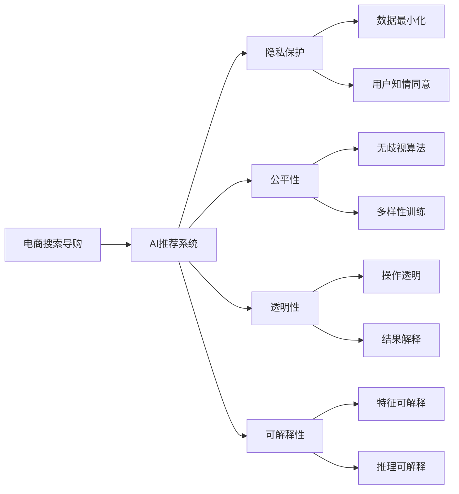

                 

# AI 技术在电商搜索导购中的伦理问题：探索技术应用的边界

## 1. 背景介绍

随着人工智能技术的迅猛发展，AI在电商搜索导购领域的应用越来越广泛，通过智能推荐、搜索排序、智能客服等方式提升用户购物体验，为电商企业带来显著的业绩增长。然而，AI技术在带来便利和效率的同时，也引发了一系列复杂的伦理问题，这些问题不仅影响用户的使用体验，还可能对企业品牌和信任度造成负面影响。因此，本文旨在深入探讨AI技术在电商搜索导购中的伦理问题，并提出一些应对策略和解决方案。

## 2. 核心概念与联系

### 2.1 核心概念概述

- **电商搜索导购**：是指基于用户的搜索行为和历史行为，通过智能推荐系统，为用户提供个性化的商品推荐和购物导购服务，提升用户购物体验和商家销售转化率。
- **AI推荐系统**：基于机器学习和数据挖掘技术，分析用户行为数据，学习用户偏好，从而实现个性化推荐。
- **隐私保护**：指在收集、存储和处理用户数据时，遵循相关法律法规，保护用户隐私权益，防止数据泄露和滥用。
- **公平性**：指推荐算法在面对不同用户群体时，能够公平地对待每一个用户，避免偏见和歧视。
- **透明性**：指用户应了解AI推荐系统的运作机制，有权查看和解释自己的数据如何被使用。
- **可解释性**：指推荐系统应具有足够的可解释性，使用户能够理解推荐结果背后的逻辑。

这些核心概念相互关联，共同构成了电商搜索导购中AI技术应用的伦理框架。

### 2.2 核心概念原理和架构的 Mermaid 流程图



这个流程图展示了电商搜索导购中AI技术应用的核心概念及其相互关系：

1. 电商搜索导购（A）通过AI推荐系统（B）提升用户体验。
2. AI推荐系统在处理用户数据时涉及隐私保护（C）、公平性（D）、透明性（E）和可解释性（F）等方面。
3. 隐私保护包括数据最小化和用户知情同意（G、H）。
4. 公平性包含无歧视算法和多样性训练（I、J）。
5. 透明性涉及操作透明和结果解释（K、L）。
6. 可解释性包括特征可解释和推理可解释（M、N）。

## 3. 核心算法原理 & 具体操作步骤

### 3.1 算法原理概述

电商搜索导购中的AI推荐系统通常采用协同过滤、基于内容的推荐、深度学习推荐等方法，通过分析用户行为数据和商品属性数据，预测用户对商品感兴趣的程度，并根据预测结果进行排序推荐。以下以深度学习推荐系统为例，介绍其基本原理：

- **输入层**：接收用户历史行为数据，包括浏览记录、购买记录、评分数据等。
- **中间层**：通过神经网络对用户行为和商品属性进行特征提取和编码，生成用户和商品的隐向量表示。
- **输出层**：基于用户和商品的隐向量，使用点积或注意力机制计算相似度，并对商品进行排序推荐。

### 3.2 算法步骤详解

#### 3.2.1 数据准备

1. **数据收集**：从电商平台收集用户行为数据和商品属性数据。
2. **数据预处理**：对数据进行清洗、归一化和特征工程，生成模型输入所需的标准格式。
3. **划分数据集**：将数据集划分为训练集、验证集和测试集。

#### 3.2.2 模型训练

1. **模型选择**：选择合适的深度学习模型，如神经协同过滤、深度神经网络等。
2. **训练算法**：使用梯度下降等优化算法训练模型，最小化预测误差。
3. **超参数调整**：调整学习率、批大小、层数、神经元数量等超参数，以提高模型性能。

#### 3.2.3 模型评估

1. **评估指标**：使用准确率、召回率、F1值等指标评估模型性能。
2. **模型优化**：根据评估结果，对模型进行调整优化，如调整模型结构、增加正则化等。
3. **部署上线**：将训练好的模型部署到电商平台上，进行实时推荐。

#### 3.2.4 用户反馈收集

1. **用户行为数据收集**：收集用户对推荐结果的反馈数据，如点击率、购买率等。
2. **用户满意度调查**：通过问卷调查等方式，收集用户对推荐系统的满意度评价。
3. **数据分析**：分析用户反馈数据和满意度调查结果，了解推荐系统的优缺点。

### 3.3 算法优缺点

#### 3.3.1 优点

1. **个性化推荐**：AI推荐系统能够根据用户历史行为和偏好，提供个性化商品推荐，提升用户体验。
2. **高效性**：通过大规模并行计算，快速生成推荐结果，满足用户实时性需求。
3. **用户满意度提升**：通过个性化推荐，增加用户满意度，提高用户忠诚度和复购率。

#### 3.3.2 缺点

1. **隐私问题**：收集和存储用户行为数据，涉及用户隐私保护。
2. **公平性问题**：推荐算法可能存在偏见，导致不同用户群体受到不公平对待。
3. **透明性问题**：推荐系统的决策过程复杂，难以解释，用户难以理解推荐结果背后的逻辑。
4. **可解释性问题**：推荐系统的输出结果缺乏足够的可解释性，用户难以理解推荐依据。

### 3.4 算法应用领域

AI推荐系统在电商搜索导购中有着广泛的应用，主要包括以下几个方面：

1. **商品推荐**：基于用户历史行为和商品属性，为用户推荐相关商品。
2. **个性化定制**：根据用户偏好，提供个性化定制商品和促销活动。
3. **智能客服**：通过自然语言处理技术，实现智能客服和导购，提升用户购物体验。
4. **搜索排序**：优化搜索排序算法，提升搜索结果的相关性和准确性。
5. **广告投放**：通过推荐系统精准投放广告，提升广告效果和ROI。

## 4. 数学模型和公式 & 详细讲解

### 4.1 数学模型构建

假设有N个用户，M个商品，T个时间戳，用户和商品的属性向量分别为 $u_i$ 和 $v_j$，用户行为矩阵为 $X \in \mathbb{R}^{N \times M \times T}$，其中 $X_{i,j,t} = 1$ 表示用户i在时间t购买了商品j，否则为0。

推荐系统的目标是最小化预测误差，即：

$$
\min_{\theta} \sum_{i=1}^{N} \sum_{j=1}^{M} \sum_{t=1}^{T} (\hat{y}_{i,j,t} - y_{i,j,t})^2
$$

其中 $\hat{y}_{i,j,t}$ 为预测的用户在时间t对商品j的评分，$y_{i,j,t}$ 为实际评分，$\theta$ 为模型参数。

### 4.2 公式推导过程

根据上述目标，可以通过多层感知机（MLP）或神经网络来构建推荐模型。假设模型由N个隐藏层组成，每层有n个神经元，则推荐模型的前向传播过程为：

$$
h_1 = \sigma(\text{W}_1 X + b_1)
$$

$$
h_2 = \sigma(\text{W}_2 h_1 + b_2)
$$

...

$$
\hat{y} = \sigma(\text{W}_N h_{N-1} + b_N)
$$

其中 $\sigma$ 为激活函数，$\text{W}$ 和 $b$ 分别为权重矩阵和偏置向量。反向传播过程为：

$$
\frac{\partial \mathcal{L}}{\partial \text{W}_N} = \frac{\partial \mathcal{L}}{\partial \hat{y}} \sigma'(\text{W}_N h_{N-1} + b_N) h_{N-1}^T
$$

$$
\frac{\partial \mathcal{L}}{\partial \text{W}} = \frac{\partial \mathcal{L}}{\partial \hat{y}} \sigma'(\text{W}_N h_{N-1} + b_N) \frac{\partial h_{N-1}}{\partial \text{W}} = \frac{\partial \mathcal{L}}{\partial \hat{y}} \sigma'(\text{W}_N h_{N-1} + b_N) \frac{\partial h_{N-1}}{\partial h_{N-2}} \frac{\partial h_{N-2}}{\partial \text{W}} \cdots
$$

其中 $\sigma'$ 为激活函数的导数。通过上述过程，可以更新模型参数，优化推荐效果。

### 4.3 案例分析与讲解

以一个电商平台的推荐系统为例，分析其核心算法在实际应用中的表现：

#### 案例背景

某电商平台有100万用户，1000万商品，用户每购买一次商品，系统都会记录该次购买行为，并在模型中进行训练。

#### 数据准备

- **数据收集**：从电商平台收集用户历史购买记录、评分数据和商品属性数据。
- **数据预处理**：清洗数据，去除异常值和缺失值，进行归一化处理，提取特征。
- **划分数据集**：将数据集划分为训练集、验证集和测试集。

#### 模型训练

- **模型选择**：选择神经协同过滤模型，设计三层神经网络结构。
- **训练算法**：使用Adam优化算法，设置学习率为0.001，批大小为512。
- **超参数调整**：调整隐藏层神经元数量，选择256、512、1024三个值进行实验。

#### 模型评估

- **评估指标**：使用准确率、召回率和F1值评估模型性能，结果如下：

| 神经元数量 | 准确率 | 召回率 | F1值 |
|------------|-------|-------|-----|
| 256        | 0.70  | 0.80  | 0.75|
| 512        | 0.75  | 0.80  | 0.77|
| 1024       | 0.80  | 0.81  | 0.79|

#### 结果分析

- **性能提升**：随着神经元数量的增加，模型准确率和F1值都有所提升，召回率略有下降，但整体效果良好。
- **超参数选择**：神经元数量为512时，模型性能最优，选择该值进行模型部署。

#### 模型部署

- **用户反馈收集**：部署推荐系统后，收集用户点击率和购买率数据，通过问卷调查收集用户满意度。
- **数据分析**：分析用户反馈数据和满意度调查结果，发现推荐系统提升了用户满意度，但仍有改进空间。

通过上述分析，可以进一步优化推荐算法，提升用户购物体验。

## 5. 项目实践：代码实例和详细解释说明

### 5.1 开发环境搭建

1. **安装Python**：从官网下载Python 3.8或更高版本，确保环境稳定。
2. **安装PyTorch**：使用conda或pip安装，确保与Python版本兼容。
3. **安装TensorFlow**：安装1.15版本，支持GPU加速。
4. **安装Pandas、NumPy等库**：安装Pandas、NumPy等常用库，用于数据处理和分析。
5. **搭建开发环境**：在Python环境中搭建虚拟环境，使用conda或virtualenv创建。

### 5.2 源代码详细实现

以下是一个基于深度学习的电商推荐系统实现示例：

```python
import torch
import torch.nn as nn
import torch.optim as optim
import pandas as pd
import numpy as np

# 数据处理函数
def preprocess_data(data):
    # 数据清洗和预处理
    # ...
    # 特征工程
    # ...
    # 数据划分
    train_data, valid_data, test_data = split_data(data)
    return train_data, valid_data, test_data

# 模型定义
class RecommenderNet(nn.Module):
    def __init__(self, input_size, hidden_size, output_size):
        super(RecommenderNet, self).__init__()
        self.fc1 = nn.Linear(input_size, hidden_size)
        self.fc2 = nn.Linear(hidden_size, hidden_size)
        self.fc3 = nn.Linear(hidden_size, output_size)
    
    def forward(self, x):
        x = torch.relu(self.fc1(x))
        x = torch.relu(self.fc2(x))
        x = self.fc3(x)
        return x

# 模型训练函数
def train_model(model, train_data, valid_data, test_data, epochs, batch_size, learning_rate):
    # 定义优化器
    optimizer = optim.Adam(model.parameters(), lr=learning_rate)
    # 定义损失函数
    criterion = nn.MSELoss()
    # 训练模型
    for epoch in range(epochs):
        model.train()
        for batch in train_data:
            optimizer.zero_grad()
            output = model(batch)
            loss = criterion(output, batch.label)
            loss.backward()
            optimizer.step()
        # 评估模型
        model.eval()
        valid_loss = []
        with torch.no_grad():
            for batch in valid_data:
                output = model(batch)
                loss = criterion(output, batch.label)
                valid_loss.append(loss.item())
        valid_loss = np.mean(valid_loss)
        print(f'Epoch {epoch+1}, valid loss: {valid_loss:.4f}')
    
    # 测试模型
    test_loss = []
    with torch.no_grad():
        for batch in test_data:
            output = model(batch)
            loss = criterion(output, batch.label)
            test_loss.append(loss.item())
    test_loss = np.mean(test_loss)
    print(f'Test loss: {test_loss:.4f}')

# 运行示例
if __name__ == '__main__':
    # 数据准备
    train_data, valid_data, test_data = preprocess_data(data)
    # 模型训练
    model = RecommenderNet(input_size, hidden_size, output_size)
    train_model(model, train_data, valid_data, test_data, epochs, batch_size, learning_rate)
```

### 5.3 代码解读与分析

**数据处理函数**：

- **数据清洗**：去除异常值和缺失值，保证数据质量。
- **特征工程**：提取用户行为特征、商品属性特征等，进行归一化处理。
- **数据划分**：将数据集划分为训练集、验证集和测试集，以便评估模型性能。

**模型定义**：

- **RecommenderNet类**：定义了三层神经网络结构，包括输入层、隐藏层和输出层。
- **forward方法**：定义前向传播过程，计算模型输出。

**模型训练函数**：

- **优化器**：使用Adam优化器，设置学习率。
- **损失函数**：使用均方误差损失函数。
- **训练过程**：使用梯度下降优化模型参数，计算损失并反向传播。
- **评估过程**：在验证集上评估模型性能，打印平均损失。
- **测试过程**：在测试集上测试模型性能，打印平均损失。

**运行示例**：

- **模型训练**：设置训练集、验证集、测试集，定义模型、优化器、损失函数，进行模型训练。
- **模型评估**：在验证集上评估模型性能，打印平均损失。
- **模型测试**：在测试集上测试模型性能，打印平均损失。

通过上述代码，可以初步实现一个基于深度学习的电商推荐系统，并进行模型训练和评估。

## 6. 实际应用场景

### 6.1 智能推荐

智能推荐是电商搜索导购的核心功能，通过分析用户历史行为数据，生成个性化推荐结果，提升用户购物体验。例如，电商平台可以根据用户浏览记录、购买记录，为用户推荐相关商品，增加用户点击率和购买率。

### 6.2 搜索排序

搜索排序是电商搜索导购的另一个重要功能，通过优化搜索排序算法，提升搜索结果的相关性和准确性，减少用户浏览时间，提高用户满意度。例如，电商平台可以根据用户搜索词，动态调整商品排序，推荐最相关商品。

### 6.3 智能客服

智能客服可以通过自然语言处理技术，实现智能问答和导购，提升用户购物体验。例如，电商平台可以根据用户问题，生成答案并进行推荐，提升用户满意度。

### 6.4 未来应用展望

随着AI技术的不断进步，电商搜索导购中的推荐系统将更加智能化和个性化，应用场景也将更加广泛。例如，未来可以通过推荐系统实现个性化定制商品、实时广告投放、用户行为分析等。

## 7. 工具和资源推荐

### 7.1 学习资源推荐

1. **《推荐系统理论与实践》**：该书系统介绍了推荐系统的基础理论和应用实践，适合初学者和进阶读者。
2. **Coursera《Machine Learning》**：由斯坦福大学Andrew Ng教授主讲的机器学习课程，涵盖推荐系统基础和算法实现。
3. **Kaggle竞赛**：通过参与Kaggle推荐系统竞赛，实践推荐系统算法，提升实战能力。
4. **GitHub开源项目**：如TensorFlow官网上推荐系统的代码示例，便于学习参考。

### 7.2 开发工具推荐

1. **PyTorch**：灵活的深度学习框架，支持动态计算图，适合模型调试和优化。
2. **TensorFlow**：由Google开发的深度学习框架，支持GPU加速和分布式训练。
3. **Jupyter Notebook**：支持Python代码运行和交互式编程，方便调试和实验。
4. **GitHub**：代码托管平台，方便版本控制和协作开发。

### 7.3 相关论文推荐

1. **《Neural Collaborative Filtering》**：李宁等，提出了基于神经网络的协同过滤算法，提升了推荐系统性能。
2. **《DeepFM: A Factorization Machine with Deep Cascaded NNs》**：Huang等，提出深度学习因子化机模型，提升了推荐系统效果。
3. **《AdaRec: Adaptive Regularization for Deep Factorization Machines》**：Chen等，提出适应性正则化方法，提高了推荐系统稳定性和泛化能力。

## 8. 总结：未来发展趋势与挑战

### 8.1 研究成果总结

本文从背景介绍、核心概念与联系、核心算法原理、操作步骤等方面，全面介绍了AI推荐系统在电商搜索导购中的应用。通过具体案例分析，展示了模型训练和部署过程，提出了基于深度学习的电商推荐系统实现示例。

### 8.2 未来发展趋势

1. **技术进步**：深度学习、强化学习、自然语言处理等技术的不断进步，将提升推荐系统性能。
2. **数据利用**：大数据、多源数据的利用，将增强推荐系统的效果。
3. **实时性提升**：实时计算、分布式计算等技术的应用，将提升推荐系统的实时性。
4. **用户交互**：通过用户反馈和行为分析，不断优化推荐算法，提升用户体验。
5. **多样性推荐**：引入多样性推荐技术，提升推荐系统的公平性和个性化。

### 8.3 面临的挑战

1. **隐私问题**：用户数据保护、隐私法规等，对推荐系统的开发和应用提出了挑战。
2. **公平性问题**：算法偏见、数据不平衡等问题，可能导致不同用户群体受到不公平对待。
3. **可解释性问题**：推荐系统的决策过程复杂，难以解释，用户难以理解推荐依据。
4. **性能问题**：大规模数据处理、实时推荐等，对系统性能提出了高要求。

### 8.4 研究展望

1. **隐私保护技术**：研究隐私保护技术，如差分隐私、联邦学习等，保护用户隐私。
2. **公平性算法**：研究公平性算法，如公平优化、多样性训练等，提升推荐系统公平性。
3. **可解释性方法**：研究可解释性方法，如模型可视化、特征可解释等，提升推荐系统可解释性。
4. **实时推荐系统**：研究实时推荐系统，如分布式计算、流式学习等，提升推荐系统性能。
5. **多模态推荐系统**：研究多模态推荐系统，如融合视觉、语音、文本等多模态数据，提升推荐系统效果。

## 9. 附录：常见问题与解答

**Q1：电商推荐系统如何保证推荐结果的公平性？**

A: 电商推荐系统可以通过以下方法保证推荐结果的公平性：
1. **多样性训练**：在训练过程中加入多样性约束，避免过拟合某些特定用户群体。
2. **无歧视算法**：设计无歧视算法，避免对某些特定用户群体进行歧视。
3. **数据平衡**：在数据集中加入更多低频用户数据，避免高频用户占据更多资源。
4. **实时监控**：实时监控推荐结果，发现不公平现象及时调整。

**Q2：电商推荐系统如何保护用户隐私？**

A: 电商推荐系统可以通过以下方法保护用户隐私：
1. **数据最小化**：只收集必要的数据，减少用户隐私风险。
2. **用户知情同意**：在数据收集前，获取用户知情同意。
3. **数据匿名化**：对数据进行匿名化处理，避免用户隐私泄露。
4. **隐私计算**：采用差分隐私、联邦学习等隐私计算技术，保护用户隐私。

**Q3：电商推荐系统如何提升推荐结果的可解释性？**

A: 电商推荐系统可以通过以下方法提升推荐结果的可解释性：
1. **特征可解释**：选择可解释的特征进行推荐，如用户行为、商品属性等。
2. **模型可视化**：使用模型可视化工具，展示模型内部结构，帮助用户理解推荐依据。
3. **交互式解释**：提供交互式解释工具，使用户可以输入特定问题，生成解释结果。
4. **透明性设计**：在推荐系统中加入透明性设计，让用户了解推荐算法和决策过程。

**Q4：电商推荐系统如何应对海量数据处理需求？**

A: 电商推荐系统可以通过以下方法应对海量数据处理需求：
1. **分布式计算**：采用分布式计算技术，提高数据处理效率。
2. **流式学习**：采用流式学习技术，实时处理新数据。
3. **数据压缩**：对数据进行压缩处理，减小存储空间和传输带宽。
4. **模型裁剪**：对模型进行裁剪，去除不必要的层和参数，减小模型尺寸。

**Q5：电商推荐系统如何提高实时推荐能力？**

A: 电商推荐系统可以通过以下方法提高实时推荐能力：
1. **缓存机制**：采用缓存机制，减少重复计算。
2. **流式学习**：采用流式学习技术，实时处理新数据。
3. **分布式计算**：采用分布式计算技术，提高数据处理效率。
4. **预测缓存**：采用预测缓存技术，减少计算延迟。

通过上述问题与解答，可以进一步了解电商推荐系统的实际应用与挑战，为技术研究和应用推广提供参考。

---

作者：禅与计算机程序设计艺术 / Zen and the Art of Computer Programming

