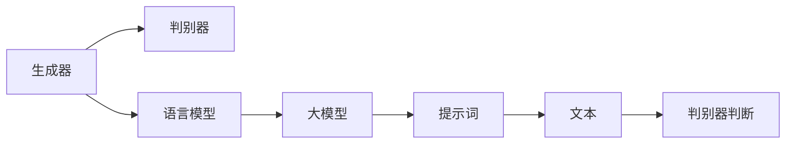

                 

# AIGC从入门到实战：提示词写作技巧

## 1. 背景介绍

随着人工智能技术的飞速发展，生成对抗网络（GAN）和语言模型（如GPT-3）等AI大模型在创意写作、自然语言处理等领域展现出卓越的能力。这些模型在接收特定提示词后，能够生成高质量的文本内容，大大降低了创作门槛，激发了艺术和文学创作的新浪潮。然而，如何写出高效且高质量的提示词，一直是AI艺术创作过程中的一个难题。

## 2. 核心概念与联系

为了更好地理解提示词写作技巧，本节将介绍几个核心概念及其之间的联系：

- **生成对抗网络（GAN）**：一种基于对抗思想的深度学习模型，通过训练一个生成器（Generator）和一个判别器（Discriminator），生成与真实数据无法区分的假数据。
- **语言模型（Language Model）**：一种用于预测文本序列的概率分布模型，能够根据前文预测下一个词汇的概率。
- **大模型（Large Model）**：指具有大规模参数量（如数十亿级别）的深度学习模型，通常通过自监督学习预训练获得通用语言能力。
- **提示词（Prompt）**：指在模型输入端添加的指导文本，用于引导模型按照预期方式输出。
- **创作过程**：从生成器接收提示词，模型根据提示词生成文本，判别器尝试区分生成的文本与真实文本，通过对抗训练不断提升生成器的创作能力。
- **GPT-3**：OpenAI开发的基于Transformer架构的语言模型，通过大规模预训练和自监督学习，具有极强的文本生成能力。

这些概念之间的联系可以通过以下Mermaid流程图来展示：



## 3. 核心算法原理 & 具体操作步骤

### 3.1 算法原理概述

生成对抗网络（GAN）和语言模型（如GPT-3）的创作过程本质上是一种协同训练的过程。生成器接收提示词，尝试生成高质量的文本内容；判别器则评估生成的文本与真实文本的区别，通过对抗训练不断提升生成器的创作能力。

### 3.2 算法步骤详解

1. **准备数据**：收集高质量的文本数据，如文学作品、艺术评论、专业论文等，用于训练语言模型。
2. **预训练**：使用大规模无标签文本数据对语言模型进行预训练，使其学习到语言的通用表示。
3. **提示词设计**：根据具体的创作目标设计提示词，通常包括一些关键词、创作主题、特定情境等信息。
4. **对抗训练**：将提示词输入到预训练好的语言模型中，生成器根据提示词生成文本，判别器评估生成的文本真实性，通过不断调整生成器的参数，提升其生成高质量文本的能力。
5. **创作实践**：将最终的生成器应用于实际创作中，根据设计好的提示词生成文本。

### 3.3 算法优缺点

**优点**：
- 创作效率高：预训练后的语言模型能够快速生成高质量文本。
- 创作范围广：大模型可以处理多种文本创作任务，如文学创作、艺术评论、技术文档等。
- 创作自由度高：提示词的灵活设计使得创作具有较高的自由度。

**缺点**：
- 数据依赖性强：模型的生成能力依赖于预训练数据的质量和数量。
- 可能存在偏见：模型可能在预训练数据中学习到固有偏见，导致生成的文本存在歧视性。
- 创作可控性差：生成的文本可能与设计好的提示词不符，需要反复调整提示词。

### 3.4 算法应用领域

提示词写作技巧在多个领域中有着广泛的应用：

- **文学创作**：为小说、诗歌、剧本等文学作品提供创作思路和写作框架。
- **艺术评论**：生成对艺术作品的评价和分析，辅助艺术创作的理解和评价。
- **技术文档**：生成用户手册、产品说明书等技术文档，提升文档写作效率。
- **新闻报道**：生成新闻稿件、社论等文本内容，辅助新闻撰写和编辑。
- **广告文案**：生成创意广告语、产品宣传文案等，提升广告效果。
- **游戏剧情**：生成游戏剧情、角色对话等文本内容，辅助游戏开发。

## 4. 数学模型和公式 & 详细讲解 & 举例说明

### 4.1 数学模型构建

假设语言模型为 $P(x_i|x_{<i})$，其中 $x_{<i}$ 为文本序列的前缀，$x_i$ 为下一个词汇。生成器的目标是最大化生成文本与真实文本之间的相似度，判别器的目标是尽可能区分真实文本与生成文本。

生成器通过损失函数 $L_g$ 进行训练，判别器通过损失函数 $L_d$ 进行训练。通过对抗训练，模型不断地调整参数，最终生成器能够生成高质量的文本内容。

### 4.2 公式推导过程

以GAN的对抗训练为例，生成器 $G$ 接收噪声向量 $z$，生成文本 $x$，判别器 $D$ 评估文本的真实性。模型通过以下损失函数进行训练：

$$
L_g = \mathbb{E}_{z \sim p(z)}[D(G(z))] + \lambda \mathbb{E}_{x \sim p(x)}[\log D(x)]
$$

$$
L_d = -\mathbb{E}_{x \sim p(x)}[\log D(x)] - \mathbb{E}_{z \sim p(z)}[\log (1 - D(G(z)))
$$

其中，$z$ 为噪声向量，$x$ 为文本，$D$ 为判别器，$G$ 为生成器，$p(z)$ 和 $p(x)$ 分别为噪声向量和文本的分布。

### 4.3 案例分析与讲解

以文本生成为例，假设我们要生成一段关于“时间旅行”的文章。提示词可以设计为：“时间旅行是一个令人着迷的概念，它……”。然后通过生成器生成完整的文章，并通过判别器评估其真实性。经过多次迭代训练，生成器能够生成高质量的文章。

## 5. 项目实践：代码实例和详细解释说明

### 5.1 开发环境搭建

在项目实践中，首先需要搭建好开发环境。以下是一个基于Python的开发环境搭建步骤：

1. **安装Python**：确保系统中安装了Python 3.x版本。
2. **安装TensorFlow或PyTorch**：选择其中一种深度学习框架进行安装，如：
```bash
pip install tensorflow
# 或
pip install torch
```
3. **安装OpenAI的GPT-3库**：
```bash
pip install openai
```

### 5.2 源代码详细实现

下面以使用GPT-3生成文学作品为例，给出Python代码实现：

```python
import openai

openai.api_key = 'your_api_key_here'

# 设置提示词
prompt = "时间旅行是一个令人着迷的概念，它……"

# 调用GPT-3生成文本
response = openai.Completion.create(
    engine="text-davinci-003",
    prompt=prompt,
    max_tokens=1000
)

# 输出生成的文本
print(response.choices[0].text)
```

### 5.3 代码解读与分析

- **openai.api_key**：设置OpenAI的API密钥，用于调用API。
- **prompt**：设计提示词，可以包含具体的创作主题和情境。
- **openai.Completion.create**：调用OpenAI的文本生成API，指定模型和提示词，生成文本。
- **response.choices[0].text**：获取生成的文本内容。

### 5.4 运行结果展示

运行上述代码，将生成一段关于“时间旅行”的文本内容。该文本内容的质量取决于提示词的设计和模型的训练效果，需要不断优化和调整。

## 6. 实际应用场景

### 6.1 文学创作

提示词写作技巧在文学创作中有着广泛的应用。作家可以借助模型生成文本框架，进行初步创作，然后再进行人工修改和优化。例如，可以设计提示词为：“故事的主角是一个年轻的科学家，他……”，然后通过GPT-3生成完整的故事情节。

### 6.2 艺术评论

艺术评论家可以借助模型生成对艺术作品的评价和分析，辅助艺术创作的理解和评价。例如，可以设计提示词为：“这幅画展示了……”，然后通过GPT-3生成对作品的评价和解读。

### 6.3 技术文档

技术文档撰写者可以借助模型生成用户手册、产品说明书等技术文档，提升文档写作效率。例如，可以设计提示词为：“本产品的主要功能是……”，然后通过GPT-3生成详细的技术文档。

### 6.4 新闻报道

新闻记者可以借助模型生成新闻稿件、社论等文本内容，辅助新闻撰写和编辑。例如，可以设计提示词为：“今天，……”，然后通过GPT-3生成新闻报道。

### 6.5 广告文案

广告创作者可以借助模型生成创意广告语、产品宣传文案等，提升广告效果。例如，可以设计提示词为：“本产品是……”，然后通过GPT-3生成广告文案。

### 6.6 游戏剧情

游戏开发者可以借助模型生成游戏剧情、角色对话等文本内容，辅助游戏开发。例如，可以设计提示词为：“在游戏中，……”，然后通过GPT-3生成游戏剧情。

## 7. 工具和资源推荐

### 7.1 学习资源推荐

为了帮助开发者系统掌握提示词写作技巧，这里推荐一些优质的学习资源：

1. **《生成对抗网络（GAN）》**：深入介绍GAN的基本原理、应用和最新进展，适合对深度学习有兴趣的读者。
2. **《自然语言处理（NLP）》**：斯坦福大学的NLP课程，涵盖NLP的基础知识和前沿技术，适合入门学习。
3. **《Python深度学习》**：深度学习领域的经典教材，详细介绍了TensorFlow和PyTorch的使用方法，适合动手实践。
4. **《深度学习生成模型》**：介绍生成模型（如GAN、VAE等）的原理和应用，适合对生成模型有深入研究的读者。
5. **《AI的艺术创作》**：探讨AI在艺术创作中的应用，适合对艺术创作感兴趣的技术爱好者。

### 7.2 开发工具推荐

高效的开发离不开优秀的工具支持。以下是几款用于提示词写作开发的常用工具：

1. **Jupyter Notebook**：支持Python代码的交互式编程和数据分析，适合快速迭代开发。
2. **TensorBoard**：可视化工具，实时监测模型训练状态，并提供丰富的图表呈现方式，是调试模型的得力助手。
3. **Weights & Biases**：模型训练的实验跟踪工具，可以记录和可视化模型训练过程中的各项指标，方便对比和调优。
4. **PyTorch**：基于Python的开源深度学习框架，灵活动态的计算图，适合快速迭代研究。
5. **TensorFlow**：由Google主导开发的开源深度学习框架，生产部署方便，适合大规模工程应用。
6. **OpenAI API**：提供文本生成、语言模型等功能，可以方便地调用API进行文本生成。

### 7.3 相关论文推荐

提示词写作技巧的研究源于学界的持续研究。以下是几篇奠基性的相关论文，推荐阅读：

1. **Generative Adversarial Networks**：Ian Goodfellow等人的论文，介绍了GAN的基本原理和应用。
2. **Neural Machine Translation by Jointly Learning to Align and Translate**：提出了一种基于注意力机制的机器翻译模型，适合对自然语言处理感兴趣的研究者。
3. **GPT-3: Language Models are Unsupervised Multitask Learners**：OpenAI的GPT-3模型论文，介绍了GPT-3模型的预训练和微调方法。
4. **Adversarial Examples for Natural Language Processing**：探讨了对抗样本对自然语言处理模型的影响，适合对安全性和鲁棒性感兴趣的研究者。
5. **The Unreasonable Effectiveness of Transfer Learning in NLP**：介绍了迁移学习在NLP中的应用，适合对迁移学习感兴趣的研究者。

## 8. 总结：未来发展趋势与挑战

### 8.1 研究成果总结

提示词写作技巧在AI生成内容领域中具有重要意义，通过设计高质量的提示词，可以显著提升生成文本的质量和创作效率。目前，该技术已经在文学创作、艺术评论、技术文档等众多领域得到广泛应用，取得了显著的成果。

### 8.2 未来发展趋势

展望未来，提示词写作技巧将呈现以下几个发展趋势：

1. **模型规模进一步扩大**：随着算力成本的下降和数据规模的扩张，预训练语言模型的参数量还将持续增长。超大规模语言模型蕴含的丰富语言知识，有望支撑更加复杂多变的下游任务。
2. **生成能力进一步提升**：通过进一步优化生成器和判别器的训练方法，模型的生成能力将进一步提升，生成的文本将更加自然流畅。
3. **跨领域应用更加广泛**：提示词写作技巧不仅限于文本创作，还将扩展到图像生成、语音合成等领域，推动多模态AI技术的发展。
4. **创作过程更加自动化**：通过进一步优化提示词设计方法和创作过程，将更加自动化和智能化，大幅提升创作效率。
5. **人机协同更加紧密**：未来，提示词写作将更加注重人机协同，通过人工干预和优化，提升生成文本的质量和可控性。

### 8.3 面临的挑战

尽管提示词写作技巧已经取得了瞩目成就，但在迈向更加智能化、普适化应用的过程中，它仍面临着诸多挑战：

1. **数据质量瓶颈**：提示词的质量很大程度上依赖于预训练数据的质量和数量，获取高质量预训练数据的高成本是制约技术发展的瓶颈。
2. **模型偏见问题**：模型可能在预训练数据中学习到固有偏见，导致生成的文本存在歧视性，如何减少模型偏见是亟待解决的问题。
3. **生成文本的可控性**：生成的文本可能与设计好的提示词不符，需要反复调整提示词，如何提高生成文本的可控性是未来的研究方向。
4. **技术落地难度**：提示词写作技巧需要结合具体的创作目标和数据特点，优化提示词设计和模型参数，如何高效落地技术是未来的挑战。
5. **伦理和隐私问题**：生成文本可能存在伦理和隐私问题，如何确保生成文本的合规性和安全性是未来的研究重点。

### 8.4 研究展望

面对提示词写作面临的种种挑战，未来的研究需要在以下几个方面寻求新的突破：

1. **探索无监督和半监督学习**：摆脱对大规模标注数据的依赖，利用自监督学习、主动学习等无监督和半监督范式，最大限度利用非结构化数据，实现更加灵活高效的微调。
2. **开发更高效的提示词设计方法**：研究高效的提示词设计方法，提升生成文本的质量和可控性。
3. **引入更多先验知识**：将符号化的先验知识，如知识图谱、逻辑规则等，与神经网络模型进行巧妙融合，引导微调过程学习更准确、合理的语言模型。
4. **探索跨模态融合**：将视觉、语音等多模态信息与文本信息进行协同建模，推动多模态AI技术的发展。
5. **引入因果分析工具**：将因果分析方法引入微调模型，识别出模型决策的关键特征，增强输出解释的因果性和逻辑性。

这些研究方向的探索，必将引领提示词写作技巧迈向更高的台阶，为构建安全、可靠、可解释、可控的智能系统铺平道路。面向未来，提示词写作技术还需要与其他人工智能技术进行更深入的融合，如知识表示、因果推理、强化学习等，多路径协同发力，共同推动自然语言理解和智能交互系统的进步。只有勇于创新、敢于突破，才能不断拓展语言模型的边界，让智能技术更好地造福人类社会。

---

作者：禅与计算机程序设计艺术 / Zen and the Art of Computer Programming

