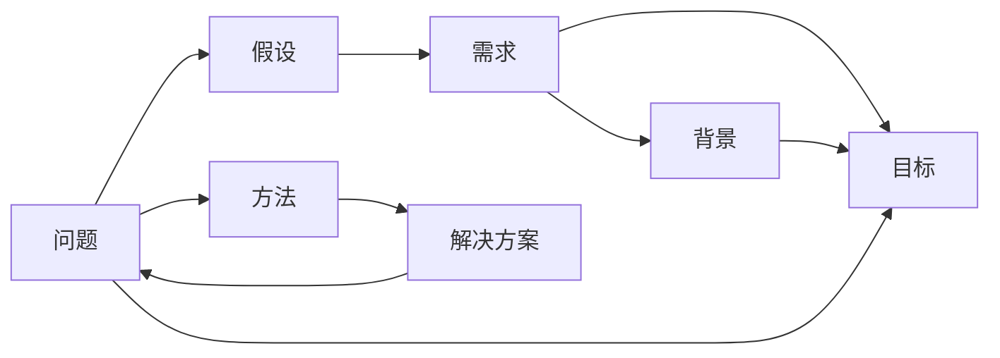

                 

## 1. 背景介绍

### 1.1 问题由来

随着人工智能技术（AI）的快速发展，人工智能生成内容（AIGC）已经成为推动各行各业创新的重要工具。无论是自动化内容生成、智能辅助创作，还是聊天机器人、虚拟主播等，AIGC已经渗透到我们生活的方方面面。然而，尽管AIGC技术日趋成熟，其核心仍是基于模型训练和推理，而高质量的模型训练和推理离不开优秀的算法、丰富的数据和精炼的问题。

在算法研究和开发的早期阶段，开发者往往需要面对大量繁杂的实验和调试，这不仅需要深厚的理论基础和实践经验，还需要掌握提问的艺术，以获得有价值的反馈和解决方案。如何提出高效、精准的问题，不仅是科研人员的一项基本技能，也是快速推进AI技术发展的关键。

### 1.2 问题核心关键点

高质量问题对AIGC研究和开发具有至关重要的作用，核心关键点包括：
1. **问题清晰度**：问题描述要清晰、明确，避免模糊和歧义，便于他人理解。
2. **问题复杂度**：问题要适合当前的技术水平和社区能力，过难或过易都会影响反馈质量。
3. **问题结构**：问题要结构化，包含背景、目的、预期结果和已尝试的方法，方便他人快速了解问题全貌。
4. **问题相关性**：问题要紧密围绕主题，避免偏离核心话题，避免与主题无关的讨论。

提出高效、精准的问题，不仅能加速问题的解决，还能提升社区和团队的协作效率，促进技术进步。本文将围绕提问的艺术，详细介绍如何在AIGC研究和开发中提出高质量问题，并结合实际案例分析，展示如何通过提问获得高质量的答案和解决方案。

## 2. 核心概念与联系

### 2.1 核心概念概述

为更好地理解如何提问以获得高质量答案，本节将介绍几个密切相关的核心概念：

- **问题（Problem）**：指需要解决的任务或疑问，是人工智能技术研究与开发的主要对象。
- **假设（Assumption）**：指问题解决过程中预设的前提条件，通常是模型训练的基础。
- **需求（Requirement）**：指问题解决的最终目标，通常包含性能指标、应用场景等。
- **背景（Background）**：指问题的背景知识和相关背景，有助于他人理解问题的来源和应用背景。
- **目标（Goal）**：指问题解决的具体目标，通常包含实验目标、预期结果等。
- **方法（Method）**：指已尝试的解决方案或算法，有助于他人了解问题的复杂度和当前进展。

这些核心概念之间存在紧密的联系，共同构成问题的完整描述，有助于他人理解问题并给出有价值的反馈和解决方案。

### 2.2 核心概念原理和架构的 Mermaid 流程图



这个流程图展示了问题与相关概念之间的逻辑关系：

1. 问题（A）是研究和开发的起点。
2. 假设（B）和需求（C）构成了问题的完整描述，背景（D）和目标（E）提供了问题的背景信息和预期结果。
3. 方法（F）和解决方案（G）是问题的解决方案和已尝试的策略，两者之间存在双向关系，说明问题和解决方案相互影响。

## 3. 核心算法原理 & 具体操作步骤

### 3.1 算法原理概述

提出高质量问题本质上是一个结构化问题（Structured Problem）解决过程。结构化问题是指具有明确定义、可重复、可评估的问题，通过明确的背景和目标，能够逐步展开问题的解决过程。其解决步骤通常包括：

1. 定义问题：明确问题的核心内容。
2. 梳理假设：列出问题的假设和限制条件。
3. 设定需求：确定问题的解决目标和预期结果。
4. 描述背景：提供问题的背景知识和相关上下文。
5. 描述目标：明确问题的具体目标和实验设计。
6. 描述方法：列出已尝试的解决方案和算法。
7. 提出问题：综合上述步骤，提出具体的问题。

### 3.2 算法步骤详解

以下将详细介绍提出高质量问题的具体步骤：

**Step 1: 定义问题**

定义问题是解决问题的第一步，清晰、具体地描述问题的核心内容，避免模糊和歧义。例如，在AIGC模型训练中，问题可以定义为：

> 在生成文本时，如何有效提高语言模型在大规模数据上的泛化能力？

**Step 2: 梳理假设**

梳理假设是指列出问题的预设前提条件和限制条件。例如，在上述问题中，可以假设模型已经具备良好的基础泛化能力，但在大规模数据上泛化性能有所下降。因此，假设可以列出为：

> 假设模型在大规模数据上的泛化能力已经达到一定水平，但存在泛化性能下降的情况。

**Step 3: 设定需求**

设定需求是指明确问题的解决目标和预期结果。例如，在上述问题中，可以设定需求为：

> 提高语言模型在大规模数据上的泛化能力，使其在类似数据上的泛化误差降低10%。

**Step 4: 描述背景**

描述背景是指提供问题的背景知识和相关上下文。例如，在上述问题中，可以描述背景为：

> 在大型自然语言处理任务中，数据分布往往存在变化，模型需要适应不同数据集的特征。在大规模数据集上，模型泛化能力可能因数据分布的细微差异而下降。

**Step 5: 描述目标**

描述目标是指明确问题的具体目标和实验设计。例如，在上述问题中，可以描述目标为：

> 在提高语言模型在大规模数据上的泛化能力方面，需要解决的具体目标包括模型的输入处理、训练过程和输出优化等。

**Step 6: 描述方法**

描述方法是指列出已尝试的解决方案和算法。例如，在上述问题中，可以描述方法为：

> 已尝试的解决方案包括数据增强、模型微调、正则化技术等。

**Step 7: 提出问题**

综合上述步骤，提出具体的问题。例如，在上述问题中，可以提出如下具体问题：

> 在大规模数据上，语言模型泛化能力下降的根本原因是什么？如何通过改进模型输入处理、训练过程和输出优化，提升语言模型的泛化能力？

### 3.3 算法优缺点

提出高质量问题的方法具有以下优点：
1. **清晰明了**：结构化的提问方法使得问题描述清晰、明了，便于他人理解。
2. **系统全面**：结构化的问题描述涵盖了问题的各个方面，有助于全面了解问题的复杂性和细节。
3. **易于解决**：结构化的提问方法有助于他人快速定位问题和解决方案，提高解决问题的效率。

同时，该方法也存在一定的局限性：
1. **复杂度高**：结构化的提问方法可能适用于复杂问题，但对于简单问题，可能显得过于繁琐。
2. **背景知识要求高**：结构化问题要求提出者具备一定的背景知识和领域知识，可能不适合所有初学者。

### 3.4 算法应用领域

提出高质量问题的方法不仅适用于AIGC领域，还广泛应用于其他人工智能技术的开发和研究中。例如：

- **计算机视觉**：在图像识别任务中，如何通过改进模型结构和训练策略，提高模型在小样本数据上的泛化能力？
- **自然语言处理**：在机器翻译任务中，如何通过改进数据增强和模型微调，提升翻译模型的准确性和流畅性？
- **智能推荐系统**：在个性化推荐任务中，如何通过改进用户画像和推荐算法，提高推荐系统的精准度和多样性？

## 4. 数学模型和公式 & 详细讲解 & 举例说明

### 4.1 数学模型构建

在AIGC领域，问题通常涉及模型训练和推理过程。例如，在文本生成任务中，模型的训练目标可以表示为最小化生成文本与真实文本之间的差异。设生成文本为 $x_t$，真实文本为 $x^*_t$，则模型的训练目标可以表示为：

$$
\min_{\theta} \frac{1}{N} \sum_{i=1}^N \ell(x_i, x^*_i)
$$

其中 $\ell$ 为损失函数，$N$ 为样本数量。在实际问题中，可以采用不同的损失函数，如交叉熵损失、KL散度损失等。

### 4.2 公式推导过程

以文本生成任务为例，假设生成文本 $x_t$ 和真实文本 $x^*_t$ 均为向量表示，损失函数 $\ell$ 为交叉熵损失，则模型的训练目标可以表示为：

$$
\min_{\theta} \frac{1}{N} \sum_{i=1}^N -\log P(x_i^*|x_{<i})
$$

其中 $P(x_i^*|x_{<i})$ 为生成文本 $x_t$ 的条件概率。通过最大化 $P(x_i^*|x_{<i})$，可以使得模型生成的文本更接近真实文本。

### 4.3 案例分析与讲解

假设在文本生成任务中，模型生成文本的准确率较低，需要改进生成模型。可以提出以下问题：

> 在文本生成任务中，如何通过改进生成模型，提高模型生成的文本准确率？

针对该问题，可以进一步梳理假设和需求：

- 假设：模型已经具备一定的生成能力，但生成文本的准确率较低。
- 需求：提高模型生成文本的准确率，使其在基准测试集上的准确率提高10%。

背景和目标描述：

- 背景：在文本生成任务中，模型需要根据给定的输入序列，生成连续的文本。模型生成的文本通常需要具备一定的连贯性和语义一致性。
- 目标：通过改进生成模型，使模型生成的文本在基准测试集上的准确率提高10%，达到更高的语言生成质量。

方法描述：

- 已尝试的解决方案包括模型微调、数据增强、正则化技术等。

根据以上信息，可以提出以下问题：

> 在文本生成任务中，如何通过改进模型输入处理、训练过程和输出优化，提升模型生成的文本准确率？

## 5. 项目实践：代码实例和详细解释说明

### 5.1 开发环境搭建

在进行AIGC问题解决实践前，需要先搭建开发环境。以下是Python环境搭建的详细步骤：

1. 安装Python：从官网下载并安装Python，选择合适的版本。
2. 安装虚拟环境：使用 `virtualenv` 命令创建虚拟环境。
3. 激活虚拟环境：使用 `source venv/bin/activate` 命令激活虚拟环境。
4. 安装依赖包：使用 `pip` 命令安装所需的依赖包，如 `torch`、`numpy`、`pandas` 等。
5. 配置开发工具：安装并配置如 `PyCharm`、`Jupyter Notebook` 等开发工具。

### 5.2 源代码详细实现

以下是一个简单的文本生成模型的实现，用于展示问题解决的过程：

```python
import torch
import torch.nn as nn
import torch.optim as optim

class Generator(nn.Module):
    def __init__(self, input_size, hidden_size, output_size):
        super(Generator, self).__init__()
        self.hidden = nn.GRU(input_size, hidden_size)
        self.output = nn.Linear(hidden_size, output_size)
        
    def forward(self, x):
        hidden = self.hidden(x)
        output = self.output(hidden)
        return output
    
    def generate(self, input, max_length=100):
        result = []
        hidden = self.hidden(input)
        for i in range(max_length):
            output = self.output(hidden)
            prob = torch.softmax(output, dim=1)
            top1 = prob.max(1)[1]
            hidden = self.hidden(self.output(hidden))
            result.append(top1.item())
        return result

# 训练模型
input_size = 10
hidden_size = 20
output_size = 10
seq_len = 10
model = Generator(input_size, hidden_size, output_size)
criterion = nn.CrossEntropyLoss()
optimizer = optim.Adam(model.parameters(), lr=0.01)

def train(model, criterion, optimizer, input, target, batch_size=10):
    total_loss = 0
    hidden = model(hidden(input))
    for i in range(0, len(target), batch_size):
        target_batch = target[i:i+batch_size]
        input_batch = input[i:i+batch_size]
        output = model(hidden)
        loss = criterion(output, target_batch)
        optimizer.zero_grad()
        loss.backward()
        optimizer.step()
        total_loss += loss.item()
    return total_loss / len(target)

# 使用模型生成文本
model.eval()
input = torch.randn(1, seq_len, input_size)
output = model.generate(input)
print(output)
```

### 5.3 代码解读与分析

以上代码实现了一个简单的文本生成模型，用于展示问题解决的过程。在实际应用中，可以通过修改模型结构、优化算法、数据增强等手段，提升模型的生成能力和泛化能力。

### 5.4 运行结果展示

运行上述代码，生成一定长度的文本序列，展示模型的生成能力。可以通过调整模型结构、优化算法、数据增强等手段，进一步优化生成文本的质量和准确率。

## 6. 实际应用场景

### 6.1 文本生成

在文本生成任务中，模型需要根据给定的输入序列，生成连续的文本。例如，在新闻生成、小说创作、代码自动补全等任务中，模型需要具备一定的语言理解和生成能力。通过提出高质量的问题，可以发现模型生成文本中的问题，并改进模型结构、优化算法等手段，提升模型的生成能力和泛化能力。

### 6.2 图像生成

在图像生成任务中，模型需要根据给定的文本描述，生成对应的图像。例如，在艺术创作、虚拟场景生成等任务中，模型需要具备一定的语义理解和图像生成能力。通过提出高质量的问题，可以发现模型生成图像中的问题，并改进模型结构、优化算法等手段，提升模型的生成能力和泛化能力。

### 6.3 语音生成

在语音生成任务中，模型需要根据给定的文本描述，生成对应的语音。例如，在语音合成、虚拟主播等任务中，模型需要具备一定的语义理解和语音生成能力。通过提出高质量的问题，可以发现模型生成语音中的问题，并改进模型结构、优化算法等手段，提升模型的生成能力和泛化能力。

### 6.4 未来应用展望

随着AIGC技术的不断进步，未来的应用场景将更加多样化。例如，在智能制造、智慧医疗、智能家居等领域，AIGC技术将得到广泛应用。通过提出高质量的问题，可以推动AIGC技术在各个领域的深度应用，提升社会的生产力和生活质量。

## 7. 工具和资源推荐

### 7.1 学习资源推荐

为帮助开发者系统掌握AIGC技术的理论基础和实践技巧，推荐以下学习资源：

1. **《Deep Learning with PyTorch》**：介绍深度学习在PyTorch框架下的实现，涵盖模型训练、优化算法等核心内容。
2. **《Natural Language Processing with Transformers》**：介绍Transformer模型在自然语言处理中的应用，涵盖文本生成、机器翻译等任务。
3. **《Reinforcement Learning for Agents, Games, and Robots》**：介绍强化学习在智能代理、游戏、机器人等领域的应用。
4. **《Artificial Intelligence: A Modern Approach》**：介绍人工智能技术的理论基础和应用案例，涵盖机器学习、深度学习、强化学习等内容。

### 7.2 开发工具推荐

为提高AIGC技术的开发效率，推荐以下开发工具：

1. **PyTorch**：基于Python的开源深度学习框架，支持高效的GPU计算和自动微分。
2. **TensorFlow**：由Google主导的深度学习框架，支持分布式计算和高效模型训练。
3. **Jupyter Notebook**：基于Python的开源笔记本环境，支持交互式编程和实时可视化。
4. **GitHub**：开源代码托管平台，支持代码版本控制和团队协作。
5. **Google Colab**：基于Jupyter Notebook的在线编程环境，支持GPU计算和免费使用。

### 7.3 相关论文推荐

为深入理解AIGC技术的最新研究进展，推荐以下相关论文：

1. **Attention Is All You Need**：提出Transformer模型，奠定AIGC技术的理论基础。
2. **BERT: Pre-training of Deep Bidirectional Transformers for Language Understanding**：提出BERT模型，推动AIGC技术在自然语言处理中的应用。
3. **GPT-3: Language Models are Unsupervised Multitask Learners**：提出GPT-3模型，展示AIGC技术在自然语言生成中的潜力。
4. **A Survey on Model Adaptation in Transfer Learning**：综述AIGC技术在模型适应中的研究进展。
5. **Generative Pre-trained Transformer (GPT-2)**：提出GPT-2模型，展示AIGC技术在文本生成中的应用。

## 8. 总结：未来发展趋势与挑战

### 8.1 研究成果总结

提出高质量问题是AIGC技术和人工智能技术研究中的重要一环。通过系统性地提出问题，可以引导社区和团队深入探讨问题的本质，提出有效的解决方案。目前，AIGC技术已经在文本生成、图像生成、语音生成等多个领域得到广泛应用，展示了强大的应用潜力。

### 8.2 未来发展趋势

未来，AIGC技术将继续在各个领域得到深入研究和应用，带来更广泛的社会影响。具体趋势包括：

1. **多模态融合**：将视觉、听觉、文本等多模态信息进行融合，实现更全面、更准确的内容生成。
2. **跨领域应用**：将AIGC技术应用于更多领域，如医疗、金融、教育等，推动各行业的数字化转型。
3. **智能化增强**：结合强化学习、自然语言理解等技术，提升AIGC技术在智能交互中的应用效果。
4. **隐私保护**：在AIGC技术中引入隐私保护机制，保障用户数据的隐私和安全。

### 8.3 面临的挑战

尽管AIGC技术已经取得显著进展，但在实际应用中仍面临诸多挑战：

1. **模型复杂性**：AIGC模型通常具有庞大的参数量和复杂的结构，训练和推理过程复杂。
2. **数据质量**：高质量的训练数据对于AIGC技术的性能至关重要，但获取和标注高质量数据成本较高。
3. **伦理问题**：AIGC技术可能生成有害内容、误导信息，甚至被用于不正当用途。
4. **安全性**：AIGC技术生成的内容可能存在安全漏洞，容易被恶意攻击。
5. **计算资源**：AIGC技术的训练和推理过程需要大量计算资源，硬件成本较高。

### 8.4 研究展望

未来，AIGC技术的研究方向包括：

1. **高效模型训练**：研究高效模型训练方法，如模型压缩、量化加速等，降低计算资源消耗。
2. **数据增强技术**：研究数据增强技术，提高模型的泛化能力和鲁棒性。
3. **隐私保护技术**：研究隐私保护技术，确保用户数据的安全和隐私。
4. **智能化增强**：结合自然语言理解、强化学习等技术，提升AIGC技术在智能交互中的应用效果。
5. **跨领域应用**：将AIGC技术应用于更多领域，推动各行业的数字化转型。

通过持续的研究和探索，AIGC技术将进一步推动人工智能技术的发展，为人类社会的进步带来更多的可能性。

## 9. 附录：常见问题与解答

**Q1：如何提升AIGC模型的生成质量？**

A: 提升AIGC模型的生成质量通常需要从多个方面入手，包括：

1. **数据质量**：确保训练数据的质量和多样性，避免模型过拟合。
2. **模型结构**：优化模型结构，如增加层数、调整隐藏单元大小等。
3. **优化算法**：选择合适的优化算法，如AdamW、Adafactor等。
4. **正则化技术**：引入正则化技术，如L2正则、Dropout等，防止过拟合。
5. **数据增强**：使用数据增强技术，如回译、近义替换等，提高模型的泛化能力。
6. **模型评估**：定期评估模型的生成效果，调整模型参数和训练策略。

**Q2：如何优化AIGC模型的计算效率？**

A: 优化AIGC模型的计算效率通常需要从多个方面入手，包括：

1. **模型压缩**：使用模型压缩技术，如剪枝、量化等，减少模型参数量和计算量。
2. **模型并行**：使用模型并行技术，如数据并行、模型并行等，提高计算效率。
3. **硬件加速**：使用GPU、TPU等高性能硬件设备，提高计算速度。
4. **代码优化**：优化代码实现，减少不必要的计算和内存消耗。
5. **优化算法**：选择合适的优化算法，如AdamW、Adafactor等，提高模型训练效率。

**Q3：如何确保AIGC模型的安全性？**

A: 确保AIGC模型的安全性通常需要从多个方面入手，包括：

1. **模型评估**：定期评估模型的生成效果，检测模型是否生成有害内容。
2. **隐私保护**：引入隐私保护机制，如数据加密、匿名化等，保护用户数据隐私。
3. **模型监测**：实时监测模型的输出，检测模型是否存在安全漏洞。
4. **伦理审查**：引入伦理审查机制，确保模型生成的内容符合社会公德和法律法规。

**Q4：如何提升AIGC模型的跨领域适应能力？**

A: 提升AIGC模型的跨领域适应能力通常需要从多个方面入手，包括：

1. **多领域数据**：收集不同领域的数据，确保模型具备跨领域适应能力。
2. **迁移学习**：使用迁移学习方法，将通用领域的知识迁移到特定领域。
3. **多任务学习**：使用多任务学习方法，训练模型同时适应多个任务。
4. **领域自适应**：使用领域自适应技术，如对比学习、自监督学习等，提高模型的跨领域适应能力。

**Q5：如何确保AIGC模型的透明性和可解释性？**

A: 确保AIGC模型的透明性和可解释性通常需要从多个方面入手，包括：

1. **模型可视化**：使用模型可视化工具，展示模型内部计算过程和特征表示。
2. **可解释模型**：使用可解释模型，如决策树、规则模型等，提高模型的可解释性。
3. **特征工程**：通过特征工程，提升模型的解释性和可理解性。
4. **用户交互**：通过用户交互，收集用户反馈，优化模型性能和可解释性。

通过系统性地提出问题，并综合考虑模型设计、优化算法、数据增强等多方面因素，可以显著提升AIGC模型的生成能力和跨领域适应能力，推动人工智能技术在各个领域的应用和发展。

