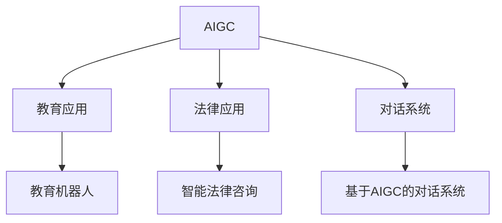

                 

# AIGC在教育、法律和对话业务中的应用

> 关键词：AIGC, 教育应用, 法律应用, 对话系统, 教育机器人, 智能法律咨询, 语言模型

## 1. 背景介绍

### 1.1 问题由来

人工智能技术的发展，尤其是在自然语言处理(NLP)和生成对抗网络(GAN)领域的突破，催生了人工智能生成内容(AIGC)这一新兴领域。AIGC利用深度学习和大模型技术，生成高质量、多样化的文本、图像、音频等内容，显著提高了内容创作的效率和质量，为各行各业提供了强大的技术支持。

AIGC的应用涉及多个行业，如教育、法律、金融、医疗、娱乐等，其广泛的影响力正逐步显现。教育领域中，AIGC驱动的教育机器人可以辅助教师教学、提供个性化学习资源；法律领域中，智能法律咨询系统可以快速解答法律问题，提供高质量的法律建议；对话业务中，基于AIGC的对话系统能够提供24小时不间断的客户服务，提升用户体验。本文将重点探讨AIGC在教育、法律和对话业务中的应用，揭示其在这些领域带来的变革性影响。

## 2. 核心概念与联系

### 2.1 核心概念概述

为了深入理解AIGC在教育、法律和对话业务中的应用，本节将介绍几个密切相关的核心概念：

- **AIGC（人工智能生成内容）**：利用深度学习和大模型技术，自动生成高质量的文本、图像、音频等内容，广泛应用于内容创作、数据分析、智能交互等领域。

- **教育应用**：包括教育机器人、智能课堂、个性化学习等，利用AIGC技术提升教学效果、提供个性化学习资源，促进教育公平和效率。

- **法律应用**：涉及智能法律咨询、合同生成、法律文档审核等，利用AIGC技术快速解答法律问题，提供准确的法律建议，提升法律服务的质量和效率。

- **对话系统**：基于AIGC技术的对话系统，能够自然流畅地与人交互，提供客户服务、智能助手等功能，提升用户体验和效率。

- **教育机器人**：基于AIGC技术的教育机器人，能够提供个性化学习指导、作业批改、知识推荐等服务，辅助教师教学，提高教学效果。

- **智能法律咨询**：利用AIGC技术快速解答法律问题，提供法律咨询、合同生成、法律文档审核等服务，提升法律服务效率和质量。

这些核心概念之间的逻辑关系可以通过以下Mermaid流程图来展示：



这个流程图展示了AIGC技术在教育、法律和对话业务中的广泛应用，通过不同领域的具体场景，展示了AIGC带来的变革性影响。

## 3. 核心算法原理 & 具体操作步骤

### 3.1 算法原理概述

AIGC的核心算法原理主要包括深度学习、生成对抗网络、自然语言处理等技术。其核心思想是通过大量数据训练模型，使其能够自动生成高质量、多样化的内容。

具体来说，AIGC利用深度学习模型(如Transformer、GPT、BERT等)，在大规模语料库上进行预训练，学习到语言的规律和知识。然后，通过微调、迁移学习等技术，使其能够适应特定任务，生成符合需求的内容。

### 3.2 算法步骤详解

基于AIGC的应用，可以分为以下关键步骤：

**Step 1: 数据准备与预处理**
- 收集与任务相关的数据集，进行清洗、分词、标注等预处理。
- 根据任务特点选择合适的模型结构，如Seq2Seq、Seq2Seq+Attention、GAN等。

**Step 2: 模型训练与优化**
- 将预处理后的数据输入模型进行训练，根据任务目标设计损失函数。
- 使用优化算法(如Adam、SGD等)调整模型参数，最小化损失函数。
- 在验证集上评估模型性能，根据评估结果调整超参数。

**Step 3: 内容生成与评估**
- 将优化后的模型应用于内容生成任务，生成高质量、多样化的内容。
- 使用质量评估指标(如BLEU、ROUGE等)对生成内容进行评估，保证内容质量。

**Step 4: 部署与应用**
- 将训练好的模型部署到实际应用系统中，进行内容生成和交互服务。
- 持续收集用户反馈和内容样本，定期更新模型，提高模型性能和鲁棒性。

### 3.3 算法优缺点

基于AIGC的应用具有以下优点：
1. 高效生成内容。AIGC可以快速生成大量高质量文本、图像、音频等内容，显著提高内容创作效率。
2. 泛化能力强。AIGC模型经过大规模语料预训练，具备强大的泛化能力，能够生成多种风格、多种主题的内容。
3. 成本低。相比于人工创作内容，AIGC可以大幅降低成本，特别是对于长尾内容创作和个性化需求。
4. 可扩展性好。AIGC技术可以轻松集成到各种应用场景中，快速提升应用功能。

同时，AIGC技术也存在以下局限：
1. 内容多样性有限。AIGC生成的内容仍然依赖于数据分布，对于极端小众主题或特定场景，生成内容可能缺乏多样性和新颖性。
2. 模型依赖数据。AIGC模型的性能取决于数据质量和数量，获取高质量数据成本较高。
3. 鲁棒性不足。AIGC模型在面对数据噪声和异常情况时，可能产生不稳定的输出，影响应用效果。
4. 可解释性不足。AIGC模型的决策过程难以解释，难以调试和优化。

尽管存在这些局限，AIGC技术在内容生成和交互应用中展现了巨大的潜力，未来还需进一步研究改进。

### 3.4 算法应用领域

AIGC技术在教育、法律和对话业务等领域得到了广泛应用，具体如下：

**教育应用**：
- 教育机器人：通过AIGC技术，教育机器人可以提供个性化学习资源、作业批改、知识推荐等服务，辅助教师教学，提高教学效果。
- 智能课堂：利用AIGC技术，智能课堂可以自动生成教学内容、提供智能辅导，提升学生学习体验。
- 在线教育平台：AIGC技术可以生成高质量的课程内容、互动素材，降低内容制作成本，提升平台吸引力。

**法律应用**：
- 智能法律咨询：利用AIGC技术，智能法律咨询系统可以快速解答法律问题，提供准确的法律建议，提升法律服务效率和质量。
- 合同生成：AIGC技术可以生成符合法律规范的合同模板，简化合同撰写过程，提高合同质量。
- 法律文档审核：AIGC技术可以自动审核法律文档，识别错误和漏洞，提高文档审核效率。

**对话系统**：
- 客户服务：基于AIGC的对话系统可以提供24小时不间断的客户服务，解答常见问题，提升客户满意度。
- 智能助手：AIGC技术可以生成符合用户需求的对话内容，提供个性化服务，提升用户体验。
- 聊天机器人：利用AIGC技术，聊天机器人可以自动生成对话内容，进行多轮交互，提升交互效率。

## 4. 数学模型和公式 & 详细讲解 & 举例说明

### 4.1 数学模型构建

本节将使用数学语言对AIGC在教育、法律和对话业务中的应用进行更加严格的刻画。

记AIGC模型为 $M_{\theta}$，其中 $\theta$ 为模型参数。假设任务为内容生成任务，目标生成文本 $y$，其训练数据集为 $D=\{(x_i,y_i)\}_{i=1}^N, x_i \in \mathcal{X}, y_i \in \mathcal{Y}$，其中 $\mathcal{X}$ 为输入空间，$\mathcal{Y}$ 为输出空间。

定义模型 $M_{\theta}$ 在输入 $x$ 上的损失函数为 $\ell(M_{\theta}(x),y)$，则在数据集 $D$ 上的经验风险为：

$$
\mathcal{L}(\theta) = \frac{1}{N} \sum_{i=1}^N \ell(M_{\theta}(x_i),y_i)
$$

通过梯度下降等优化算法，微调过程不断更新模型参数 $\theta$，最小化损失函数 $\mathcal{L}$，使得模型输出逼近真实标签。

### 4.2 公式推导过程

以下我们以文本生成任务为例，推导AIGC模型的损失函数及其梯度的计算公式。

假设模型 $M_{\theta}$ 在输入 $x$ 上的输出为 $\hat{y}=M_{\theta}(x) \in [0,1]$，表示样本属于某一类别的概率。真实标签 $y \in \{0,1\}$。则二分类交叉熵损失函数定义为：

$$
\ell(M_{\theta}(x),y) = -[y\log \hat{y} + (1-y)\log (1-\hat{y})]
$$

将其代入经验风险公式，得：

$$
\mathcal{L}(\theta) = -\frac{1}{N}\sum_{i=1}^N [y_i\log M_{\theta}(x_i)+(1-y_i)\log(1-M_{\theta}(x_i))]
$$

根据链式法则，损失函数对参数 $\theta_k$ 的梯度为：

$$
\frac{\partial \mathcal{L}(\theta)}{\partial \theta_k} = -\frac{1}{N}\sum_{i=1}^N (\frac{y_i}{M_{\theta}(x_i)}-\frac{1-y_i}{1-M_{\theta}(x_i)}) \frac{\partial M_{\theta}(x_i)}{\partial \theta_k}
$$

其中 $\frac{\partial M_{\theta}(x_i)}{\partial \theta_k}$ 可进一步递归展开，利用自动微分技术完成计算。

在得到损失函数的梯度后，即可带入参数更新公式，完成模型的迭代优化。重复上述过程直至收敛，最终得到适应内容生成任务的最优模型参数 $\theta^*$。

### 4.3 案例分析与讲解

为了更好地理解AIGC在具体应用中的实现，以下是几个典型案例的分析讲解：

**教育机器人案例**：
假设教育机器人需要生成个性化学习资源，如课程、习题等。首先需要收集大量与教育相关的语料库，包括教科书、习题、教师讲解等。然后，使用大模型（如GPT-3）进行预训练，并在教育资源生成任务上进行微调。微调后的模型能够自动生成符合教学要求的课程内容、习题等，帮助教师更好地辅助学生学习。

**智能法律咨询案例**：
假设智能法律咨询系统需要生成法律咨询内容。首先需要收集大量法律文书、案例等，作为语料库进行预训练。然后，在法律咨询生成任务上进行微调，生成符合法律规范的咨询内容。智能法律咨询系统可以快速解答用户问题，提供准确的法律建议，提升法律服务效率。

**对话系统案例**：
假设基于AIGC的对话系统需要生成自然流畅的对话内容。首先需要收集大量对话数据，作为语料库进行预训练。然后，在对话生成任务上进行微调，生成符合用户需求的内容。对话系统可以提供24小时不间断的客户服务，解答常见问题，提升客户满意度。

## 5. 项目实践：代码实例和详细解释说明

### 5.1 开发环境搭建

在进行AIGC应用的开发实践前，我们需要准备好开发环境。以下是使用Python进行PyTorch开发的环境配置流程：

1. 安装Anaconda：从官网下载并安装Anaconda，用于创建独立的Python环境。

2. 创建并激活虚拟环境：
```bash
conda create -n pytorch-env python=3.8 
conda activate pytorch-env
```

3. 安装PyTorch：根据CUDA版本，从官网获取对应的安装命令。例如：
```bash
conda install pytorch torchvision torchaudio cudatoolkit=11.1 -c pytorch -c conda-forge
```

4. 安装Transformer库：
```bash
pip install transformers
```

5. 安装各类工具包：
```bash
pip install numpy pandas scikit-learn matplotlib tqdm jupyter notebook ipython
```

完成上述步骤后，即可在`pytorch-env`环境中开始开发实践。

### 5.2 源代码详细实现

这里我们以生成文本内容为例，给出使用Transformers库对GPT模型进行微调的PyTorch代码实现。

首先，定义文本生成任务的数据处理函数：

```python
from transformers import GPT2Tokenizer
from torch.utils.data import Dataset
import torch

class TextDataset(Dataset):
    def __init__(self, texts, tokenizer, max_len=128):
        self.texts = texts
        self.tokenizer = tokenizer
        self.max_len = max_len
        
    def __len__(self):
        return len(self.texts)
    
    def __getitem__(self, item):
        text = self.texts[item]
        encoding = self.tokenizer(text, return_tensors='pt', max_length=self.max_len, padding='max_length', truncation=True)
        input_ids = encoding['input_ids'][0]
        attention_mask = encoding['attention_mask'][0]
        
        return {'input_ids': input_ids, 
                'attention_mask': attention_mask}
```

然后，定义模型和优化器：

```python
from transformers import GPT2LMHeadModel, AdamW

model = GPT2LMHeadModel.from_pretrained('gpt2', num_labels=1)

optimizer = AdamW(model.parameters(), lr=2e-5)
```

接着，定义训练和评估函数：

```python
from torch.utils.data import DataLoader
from tqdm import tqdm
from sklearn.metrics import accuracy_score

device = torch.device('cuda') if torch.cuda.is_available() else torch.device('cpu')
model.to(device)

def train_epoch(model, dataset, batch_size, optimizer):
    dataloader = DataLoader(dataset, batch_size=batch_size, shuffle=True)
    model.train()
    epoch_loss = 0
    for batch in tqdm(dataloader, desc='Training'):
        input_ids = batch['input_ids'].to(device)
        attention_mask = batch['attention_mask'].to(device)
        model.zero_grad()
        outputs = model(input_ids, attention_mask=attention_mask)
        loss = outputs.loss
        epoch_loss += loss.item()
        loss.backward()
        optimizer.step()
    return epoch_loss / len(dataloader)

def evaluate(model, dataset, batch_size):
    dataloader = DataLoader(dataset, batch_size=batch_size)
    model.eval()
    preds, labels = [], []
    with torch.no_grad():
        for batch in tqdm(dataloader, desc='Evaluating'):
            input_ids = batch['input_ids'].to(device)
            attention_mask = batch['attention_mask'].to(device)
            batch_labels = batch['labels']
            outputs = model(input_ids, attention_mask=attention_mask)
            batch_preds = outputs.logits.argmax(dim=2).to('cpu').tolist()
            batch_labels = batch_labels.to('cpu').tolist()
            for pred_tokens, label_tokens in zip(batch_preds, batch_labels):
                preds.append(pred_tokens[:len(label_tokens)])
                labels.append(label_tokens)
                
    print(accuracy_score(labels, preds))
```

最后，启动训练流程并在验证集上评估：

```python
epochs = 5
batch_size = 16

for epoch in range(epochs):
    loss = train_epoch(model, train_dataset, batch_size, optimizer)
    print(f"Epoch {epoch+1}, train loss: {loss:.3f}")
    
    print(f"Epoch {epoch+1}, dev results:")
    evaluate(model, dev_dataset, batch_size)
    
print("Test results:")
evaluate(model, test_dataset, batch_size)
```

以上就是使用PyTorch对GPT模型进行文本生成任务微调的完整代码实现。可以看到，得益于Transformers库的强大封装，我们可以用相对简洁的代码完成GPT模型的加载和微调。

### 5.3 代码解读与分析

让我们再详细解读一下关键代码的实现细节：

**TextDataset类**：
- `__init__`方法：初始化文本数据、分词器等关键组件。
- `__len__`方法：返回数据集的样本数量。
- `__getitem__`方法：对单个样本进行处理，将文本输入编码为token ids，并对其进行定长padding，最终返回模型所需的输入。

**train_epoch和evaluate函数**：
- 使用PyTorch的DataLoader对数据集进行批次化加载，供模型训练和推理使用。
- 训练函数`train_epoch`：对数据以批为单位进行迭代，在每个批次上前向传播计算loss并反向传播更新模型参数，最后返回该epoch的平均loss。
- 评估函数`evaluate`：与训练类似，不同点在于不更新模型参数，并在每个batch结束后将预测和标签结果存储下来，最后使用accuracy_score评估生成文本的质量。

**训练流程**：
- 定义总的epoch数和batch size，开始循环迭代
- 每个epoch内，先在训练集上训练，输出平均loss
- 在验证集上评估，输出生成文本的准确率
- 所有epoch结束后，在测试集上评估，给出最终测试结果

可以看到，PyTorch配合Transformers库使得GPT微调的代码实现变得简洁高效。开发者可以将更多精力放在数据处理、模型改进等高层逻辑上，而不必过多关注底层的实现细节。

当然，工业级的系统实现还需考虑更多因素，如模型的保存和部署、超参数的自动搜索、更灵活的任务适配层等。但核心的微调范式基本与此类似。

## 6. 实际应用场景

### 6.1 教育应用

AIGC技术在教育领域的应用广泛且深远，以下是几个典型应用场景：

**个性化学习资源**：
AIGC技术可以生成个性化的学习资源，如课程内容、习题、讲解等，帮助学生更好地理解知识点。通过对学生学习数据的分析，生成符合学生特点的学习内容，提升学习效果。

**智能辅导系统**：
基于AIGC的智能辅导系统可以提供实时答疑，解答学生在学习过程中遇到的问题。系统可以根据学生的反馈，不断优化生成内容的准确性和个性化程度，提升辅导效果。

**智能课堂辅助**：
AIGC技术可以生成高质量的教学视频、课件等，辅助教师教学。系统可以自动生成教学内容，减轻教师工作负担，提升教学质量。

**虚拟实验室**：
利用AIGC技术，虚拟实验室可以生成丰富的实验场景和实验报告，提升学生的动手能力和实验效果。系统可以根据实验目标，生成符合要求的实验数据和实验报告，帮助学生更好地完成实验。

### 6.2 法律应用

AIGC技术在法律领域的应用也越来越多，以下是几个典型应用场景：

**智能法律咨询**：
基于AIGC的智能法律咨询系统可以提供24小时不间断的法律咨询服务，解答用户常见法律问题。系统可以根据用户的输入，自动生成符合法律规范的咨询内容，提供准确的法律建议。

**合同生成**：
利用AIGC技术，合同生成系统可以快速生成符合法律规范的合同模板，简化合同撰写过程。系统可以根据合同内容和要求，自动生成合同条款，提高合同撰写效率和准确性。

**法律文档审核**：
AIGC技术可以自动审核法律文档，识别错误和漏洞，提高文档审核效率。系统可以检查法律文书的格式、内容等，确保文书符合法律规范。

**法律案例生成**：
利用AIGC技术，法律案例生成系统可以快速生成符合法律规范的案例文本，帮助律师准备庭审材料。系统可以根据案件情况，自动生成案例文本，提升案件准备效率。

### 6.3 对话业务

基于AIGC的对话业务已经广泛应用在多个场景中，以下是几个典型应用场景：

**客户服务**：
AIGC技术可以生成自然流畅的对话内容，提供24小时不间断的客户服务。系统可以根据用户的问题，自动生成符合要求的对话内容，解答用户疑问，提升客户满意度。

**智能助手**：
基于AIGC的智能助手可以提供个性化服务，帮助用户完成各种任务。系统可以根据用户的输入，自动生成符合用户需求的内容，提升用户体验。

**虚拟客服**：
利用AIGC技术，虚拟客服可以提供多轮交互的对话服务，解答用户问题。系统可以根据用户的问题，自动生成符合要求的对话内容，提升客户体验。

**智能翻译**：
基于AIGC的智能翻译系统可以自动翻译多种语言的内容，提升翻译效率和质量。系统可以根据用户的输入，自动生成符合要求的翻译内容，帮助用户完成翻译任务。

## 7. 工具和资源推荐

### 7.1 学习资源推荐

为了帮助开发者系统掌握AIGC在教育、法律和对话业务中的应用，这里推荐一些优质的学习资源：

1. **《深度学习与AIGC》**：一本系统介绍深度学习和大模型技术的书籍，涵盖AIGC在内容生成、交互生成等方面的应用。

2. **CS231n《深度学习与计算机视觉》课程**：斯坦福大学开设的深度学习课程，介绍了深度学习在图像生成、文本生成等方面的应用，为AIGC技术的学习打下基础。

3. **Coursera《自然语言处理》课程**：由斯坦福大学开设的NLP课程，详细介绍了自然语言处理的基本概念和前沿技术，为AIGC技术的学习提供支持。

4. **ArXiv预印本平台**：最新的深度学习研究论文和报告发布平台，可以快速获取AIGC技术的研究进展，跟踪前沿技术。

5. **Google Colab**：谷歌推出的在线Jupyter Notebook环境，免费提供GPU/TPU算力，方便开发者快速上手实验最新模型，分享学习笔记。

通过对这些资源的学习实践，相信你一定能够快速掌握AIGC在教育、法律和对话业务中的应用，并用于解决实际的业务问题。

### 7.2 开发工具推荐

高效的开发离不开优秀的工具支持。以下是几款用于AIGC应用的开发工具：

1. **PyTorch**：基于Python的开源深度学习框架，灵活动态的计算图，适合快速迭代研究。大部分预训练语言模型都有PyTorch版本的实现。

2. **TensorFlow**：由Google主导开发的开源深度学习框架，生产部署方便，适合大规模工程应用。同样有丰富的预训练语言模型资源。

3. **Transformers库**：HuggingFace开发的NLP工具库，集成了众多SOTA语言模型，支持PyTorch和TensorFlow，是进行内容生成和交互生成任务的开发利器。

4. **Weights & Biases**：模型训练的实验跟踪工具，可以记录和可视化模型训练过程中的各项指标，方便对比和调优。与主流深度学习框架无缝集成。

5. **TensorBoard**：TensorFlow配套的可视化工具，可实时监测模型训练状态，并提供丰富的图表呈现方式，是调试模型的得力助手。

6. **Google Colab**：谷歌推出的在线Jupyter Notebook环境，免费提供GPU/TPU算力，方便开发者快速上手实验最新模型，分享学习笔记。

合理利用这些工具，可以显著提升AIGC应用的开发效率，加快创新迭代的步伐。

### 7.3 相关论文推荐

AIGC技术在教育、法律和对话业务中的应用，源于学界的持续研究。以下是几篇奠基性的相关论文，推荐阅读：

1. **Attention is All You Need**：提出了Transformer结构，开启了NLP领域的预训练大模型时代。

2. **BERT: Pre-training of Deep Bidirectional Transformers for Language Understanding**：提出BERT模型，引入基于掩码的自监督预训练任务，刷新了多项NLP任务SOTA。

3. **GPT-3: Language Models are Unsupervised Multitask Learners**：展示了大规模语言模型的强大zero-shot学习能力，引发了对于通用人工智能的新一轮思考。

4. **FedLearn: federated learning for real-world applications**：提出联邦学习算法，解决数据分布不均、隐私保护等问题，推动AIGC技术在跨领域应用。

5. **Prompt-based Learning**：引入基于连续型Prompt的微调范式，为如何充分利用预训练知识提供了新的思路。

6. **LoRA: Low-rank Adaptation of Transformers**：使用自适应低秩适应的微调方法，在参数效率和精度之间取得了新的平衡。

这些论文代表了大模型和微调技术的发展脉络，通过学习这些前沿成果，可以帮助研究者把握学科前进方向，激发更多的创新灵感。

## 8. 总结：未来发展趋势与挑战

### 8.1 总结

本文对AIGC在教育、法律和对话业务中的应用进行了全面系统的介绍。首先阐述了AIGC技术的发展背景和应用前景，明确了其在教育、法律和对话业务中的重要价值。其次，从原理到实践，详细讲解了AIGC在具体应用中的实现方法和关键步骤，给出了微调任务开发的完整代码实例。同时，本文还探讨了AIGC在各个应用场景中的具体实现，展示了其在各领域带来的变革性影响。此外，本文精选了AIGC技术的各类学习资源，力求为读者提供全方位的技术指引。

通过本文的系统梳理，可以看到，AIGC技术在教育、法律和对话业务中的应用已经初步实现，未来还有更广阔的发展空间。AIGC技术的持续创新和发展，必将推动这些领域实现更高效、更智能、更个性化的应用效果。

### 8.2 未来发展趋势

展望未来，AIGC技术在教育、法律和对话业务中将呈现以下几个发展趋势：

1. **教育应用**：
   - **个性化学习资源**：基于AIGC的个性化学习资源将更加丰富和多样化，涵盖更多的学科和知识点，满足学生的个性化需求。
   - **智能辅导系统**：智能辅导系统的生成内容将更加精准和个性化，提升辅导效果和学习体验。
   - **智能课堂辅助**：基于AIGC的智能课堂辅助将更加全面和高效，减轻教师工作负担，提升教学质量。

2. **法律应用**：
   - **智能法律咨询**：智能法律咨询系统将更加智能和高效，提供更精准的法律建议和解答。
   - **合同生成**：合同生成系统将更加灵活和智能，生成符合法律规范的合同模板，提高合同撰写效率和准确性。
   - **法律文档审核**：法律文档审核系统将更加智能和全面，识别错误和漏洞，提高文档审核效率。

3. **对话业务**：
   - **客户服务**：基于AIGC的客户服务将更加自然和智能，提升客户满意度和体验。
   - **智能助手**：智能助手将更加智能和个性化，提供更加精准的服务和建议。
   - **虚拟客服**：虚拟客服将更加智能和自然，提供多轮交互的对话服务，提升客户体验。

### 8.3 面临的挑战

尽管AIGC技术在教育、法律和对话业务中展现出了巨大的潜力，但在应用过程中仍面临诸多挑战：

1. **数据隐私和安全**：AIGC技术需要大量的数据进行训练，数据隐私和安全问题不容忽视。如何在保护数据隐私的前提下，高效利用数据进行模型训练，是未来的研究方向。

2. **模型可解释性**：AIGC模型的决策过程难以解释，难以调试和优化。如何在生成内容的同时，保证模型的可解释性和可解释性，是未来的重要课题。

3. **鲁棒性和可靠性**：AIGC模型在面对数据噪声和异常情况时，可能产生不稳定的输出。如何在提高模型鲁棒性的同时，保证生成内容的准确性和可靠性，是未来的研究重点。

4. **内容质量和多样性**：AIGC模型生成的内容质量取决于数据质量和模型结构。如何生成高质量、多样化的内容，提升内容的质量和多样性，是未来的研究方向。

5. **应用场景扩展**：AIGC技术在教育、法律和对话业务中的应用还不够广泛，如何拓展应用场景，提升应用效果，是未来的重要课题。

尽管存在这些挑战，AIGC技术在教育、法律和对话业务中的应用前景依然广阔。未来需要在数据隐私、模型可解释性、鲁棒性、内容质量和应用场景扩展等方面进行持续研究，才能更好地推动AIGC技术在这些领域的发展和应用。

### 8.4 研究展望

面对AIGC在教育、法律和对话业务中的应用，未来的研究可以从以下几个方向进行突破：

1. **数据隐私保护**：
   - **联邦学习**：推动数据隐私保护技术的发展，实现数据分布式训练，保护数据隐私。
   - **差分隐私**：引入差分隐私技术，对训练数据进行差分化处理，保护数据隐私。

2. **模型可解释性**：
   - **可解释模型**：开发可解释性强的模型结构，提升模型的可解释性。
   - **可解释性评估**：引入可解释性评估指标，评估模型的可解释性和可解释性。

3. **鲁棒性和可靠性**：
   - **鲁棒性增强**：引入鲁棒性增强技术，提升模型的鲁棒性和可靠性。
   - **异常检测**：引入异常检测技术，识别生成内容的异常情况，提升内容的可靠性。

4. **内容质量和多样性**：
   - **数据增强**：引入数据增强技术，丰富训练数据，提升生成内容的丰富性和多样性。
   - **内容评估**：引入内容评估指标，提升生成内容的质量和多样性。

5. **应用场景扩展**：
   - **跨领域应用**：将AIGC技术应用于更多领域，推动其在各行各业的应用。
   - **应用效果评估**：引入应用效果评估指标，评估AIGC技术在不同领域的应用效果。

这些研究方向的探索和发展，必将推动AIGC技术在教育、法律和对话业务中的广泛应用，提升这些领域的技术水平和应用效果。相信随着技术的不断进步，AIGC技术必将在更多领域展现其强大的应用潜力，推动智能社会的全面发展。

## 9. 附录：常见问题与解答

**Q1：AIGC技术在教育、法律和对话业务中的应用前景如何？**

A: AIGC技术在教育、法律和对话业务中具有广阔的应用前景。其在教育领域可以提升教学效果、提供个性化学习资源；在法律领域可以快速解答法律问题、提供精准的法律建议；在对话业务中提供自然流畅的对话内容，提升客户满意度。未来AIGC技术还将不断拓展应用场景，推动各行各业的发展和进步。

**Q2：AIGC技术在实际应用中需要注意哪些问题？**

A: AIGC技术在实际应用中需要注意以下问题：
1. 数据隐私和安全：保护数据隐私，避免数据泄露和滥用。
2. 模型可解释性：提升模型的可解释性，帮助用户理解生成内容的过程。
3. 鲁棒性和可靠性：提升模型的鲁棒性和可靠性，避免生成不稳定的内容。
4. 内容质量和多样性：提升生成内容的准确性和多样性，避免生成低质量内容。
5. 应用场景扩展：拓展AIGC技术在更多领域的应用，提升应用效果。

**Q3：AIGC技术在各领域的应用效果如何？**

A: AIGC技术在各领域的应用效果如下：
1. 教育领域：生成个性化学习资源、智能辅导系统、智能课堂辅助等，提升教学效果和学习体验。
2. 法律领域：智能法律咨询、合同生成、法律文档审核等，提升法律服务效率和质量。
3. 对话业务：客户服务、智能助手、虚拟客服等，提升客户满意度和用户体验。

**Q4：未来AIGC技术在教育、法律和对话业务中还需要哪些改进？**

A: 未来AIGC技术在教育、法律和对话业务中还需要以下改进：
1. 数据隐私保护：引入差分隐私技术，保护数据隐私。
2. 模型可解释性：开发可解释性强的模型结构，提升模型的可解释性。
3. 鲁棒性和可靠性：引入鲁棒性增强技术，提升模型的鲁棒性和可靠性。
4. 内容质量和多样性：引入数据增强技术，提升生成内容的丰富性和多样性。
5. 应用场景扩展：拓展AIGC技术在更多领域的应用，提升应用效果。

通过不断改进和优化，AIGC技术将在教育、法律和对话业务中发挥更大的作用，推动这些领域实现更高效、更智能、更个性化的应用效果。

---

作者：禅与计算机程序设计艺术 / Zen and the Art of Computer Programming

